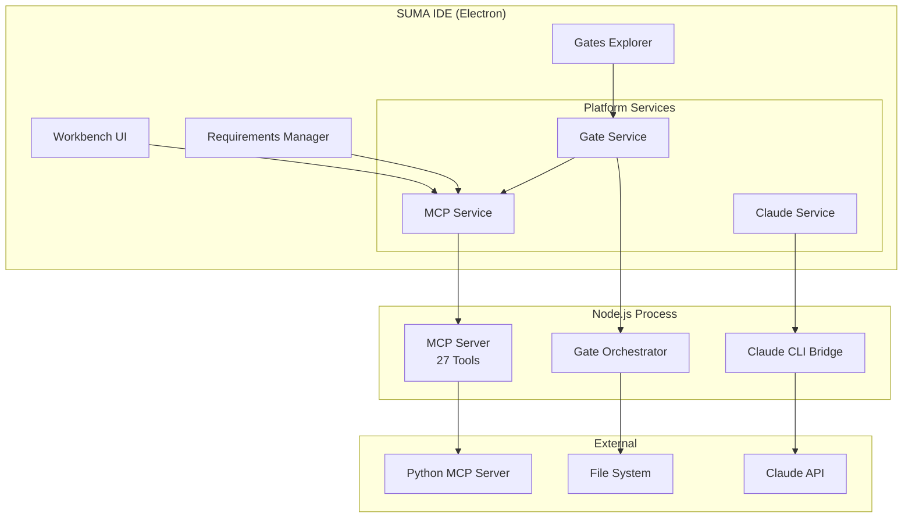
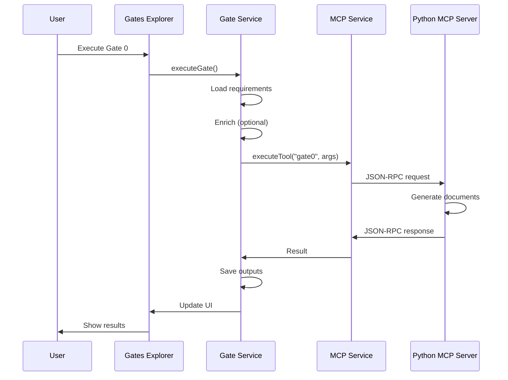
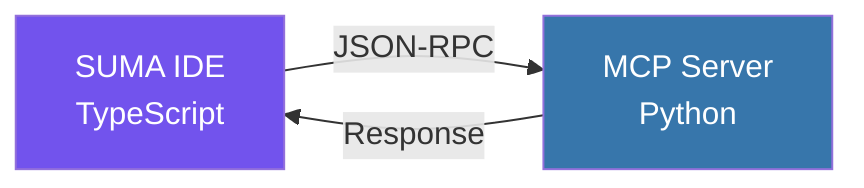
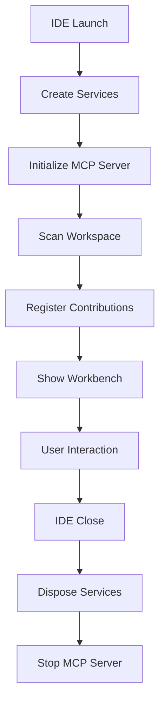

# SUMA IDE Architecture
{: .no_toc }

System design and architectural overview of SUMA IDE.
{: .fs-6 .fw-300 }

## Table of contents
{: .no_toc .text-delta }

1. TOC
{:toc}

---

## Overview

SUMA IDE is a fork of Visual Studio Code with native MCP (Model Context Protocol) integration and a comprehensive SDLC gate system.

## High-Level Architecture



## Core Components

### 1. VSCode Core (Fork)

**Location**: `src/vs/`

Base VSCode with minimal modifications for compatibility.

**Modifications**:
- Product configuration
- Activity bar (Gates icon)
- Custom welcome page

### 2. Platform Services

**Location**: `src/vs/platform/`

#### MCP Service

Native MCP Protocol implementation:

```typescript
interface IMCPService {
    listTools(): Promise<IMCPTool[]>;
    executeTool(name: string, args: any): Promise<IMCPToolResult>;
    isServerRunning(): Promise<boolean>;
    startServer(): Promise<void>;
    stopServer(): Promise<void>;
}
```

**Features**:
- Auto-start Python MCP server
- stdio communication
- Tool caching
- Lifecycle management

### 3. SUMA Contributions

**Location**: `src/vs/workbench/contrib/suma/`

#### Gates Explorer
- Project and gate tree view
- Execute gates via context menu
- Dashboard integration

#### Requirements Manager
- Syntax highlighting
- Validation and enrichment
- Quick navigation

#### AI Assistant Panel
- Chat interface
- Natural language commands
- Prompt enrichment

### 4. SUMA Core Services

**Location**: `src/suma/`

#### Gate System

Gate orchestration:

```typescript
async function executeGate(
    projectName: string,
    gateName: string,
    config: GateConfig
): Promise<GateResult> {
    // 1. Validate inputs
    await validateInputs(config);

    // 2. Load requirements
    const requirements = await loadRequirements(config.requirementsPath);

    // 3. Enrich if enabled
    const enriched = config.useEnrichment
        ? await enrichRequirements(requirements)
        : requirements;

    // 4. Execute via MCP
    const result = await mcpService.executeTool(
        `generate-${gateName}`,
        { requirements: enriched, ...config.options }
    );

    // 5. Save outputs
    await saveGateOutputs(projectName, gateName, result);

    return result;
}
```

## Data Flow

### Gate Execution Flow



### MCP Communication



**Request**:
```json
{
  "method": "tools/call",
  "params": {
    "name": "generate-gate0",
    "arguments": {
      "requirements": "...",
      "feature_name": "User Auth"
    }
  }
}
```

**Response**:
```json
{
  "content": [{
    "type": "text",
    "text": "# Requirements Summary\n..."
  }]
}
```

## Service Architecture

### Dependency Injection

```typescript
// Define service
export const IMCPService = createDecorator<IMCPService>('mcpService');

// Register
registerSingleton(IMCPService, MCPService);

// Use
class MyClass {
    constructor(
        @IMCPService private mcpService: IMCPService
    ) {}
}
```

### Service Lifecycle



## Extension Points

### MCP Extension API

```typescript
// Extension can access MCP tools
const api = vscode.extensions.getExtension('suma.core')?.exports;

// List tools
const tools = await api.mcp.listTools();

// Execute tool
const result = await api.mcp.executeTool('my-tool', { param: 'value' });
```

### Gates Extension API

```typescript
// Register custom gate
api.gates.registerGate({
    id: 'custom-gate',
    name: 'My Custom Gate',
    execute: async (config) => {
        // Custom logic
        return { success: true, outputs: [...] };
    }
});
```

## Build System

### Compilation

```bash
# Compile TypeScript
yarn compile

# Watch mode
yarn watch

# Build SUMA modules
yarn compile-suma
```

### Distribution

```bash
# Windows
yarn gulp vscode-win32-x64-suma

# macOS
yarn gulp vscode-darwin-universal-suma

# Linux
yarn gulp vscode-linux-x64-suma
```

## Performance

### Metrics

- **MCP Server Startup**: ~2-3 seconds (cold), ~500ms (warm)
- **Gate Execution**: 10-120 seconds depending on size
- **Memory Usage**: ~300-500 MB total

### Optimization

- Server runs in background
- Tool list caching
- Parallel gate execution support

## Security

### MCP Server Isolation

- Separate process
- stdio only (no network)
- Sandboxed file access
- No external calls by default

### Data Protection

- API keys in OS keychain
- Local-only processing
- Opt-in for external APIs

## Testing

```bash
# Unit tests
yarn test

# Integration tests
yarn test-integration

# E2E tests
yarn test-e2e
```

## Next Steps

- [Contributing Guide](contributing) - Contribute to SUMA IDE
- [Building from Source](building-from-source) - Development setup
- [Extension API](extension-api) - Create extensions
