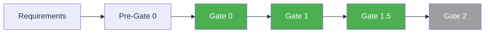
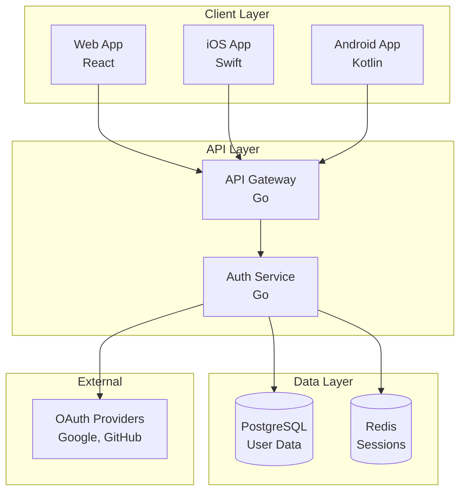
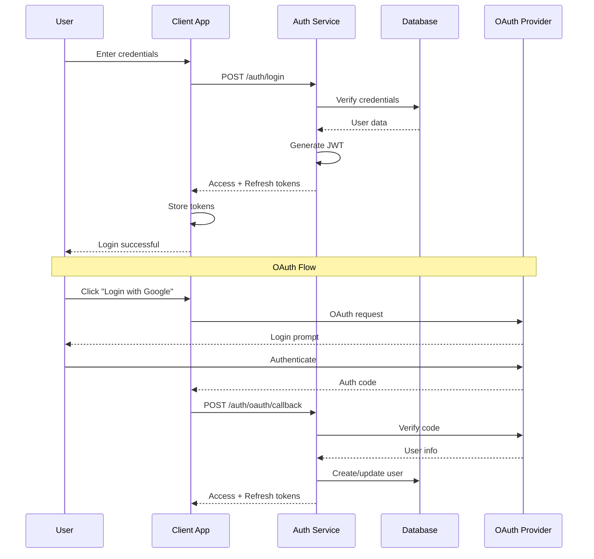

# User Authentication System
{: .no_toc }

Complete authentication feature with full gate system execution.
{: .fs-6 .fw-300 }

## Table of contents
{: .no_toc .text-delta }

1. TOC
{:toc}

---

## Overview

This is a real example of SUMA IDE's gate system processing a user authentication feature from requirements to architecture.

**Feature**: User registration and authentication system
**Platform**: Multi-platform (Web, iOS, Android)
**Status**: Architecture Phase (Gate 1 Complete)

---

## Gate Execution Flow

✅ **Completed**: Pre-Gate 0, Gate 0, Gate 1, Gate 1.5
⏳ **Pending**: Gate 2, Gate 2.5

---

## Documentation Structure

### Pre-Gate 0: Requirements Enrichment

Enriched initial requirements with codebase context and architectural patterns.

📁 [View Pre-Gate 0 Output](user-authentication/Pre-Gate-0-Requirements-Enrichment)

### Gate 0: Requirements Parsing

Parsed and validated functional and non-functional requirements.

📁 [View Gate 0 Output](user-authentication/Gate-0-Output)

Platform-specific requirements:
- 📁 [Platform Requirements](user-authentication/Gate-0-Platform-Requirements)

### Gate 1: Architecture Design

Generated complete system architecture across all platforms.

📁 [View Gate 1 Architecture](user-authentication/Gate-1-Architecture)

**Key Documents**:
- [Architecture README](user-authentication/Architecture/ARCHITECTURE-README) - Overview
- [Backend API](user-authentication/Architecture/Backend-API-Implementation-Requirements) - API design
- [Database](user-authentication/Architecture/Database-Implementation-Requirements) - Data layer
- [API Documentation](user-authentication/Architecture/APIs/api-documentation) - Endpoints

**Architecture Components**:
- [Frontend Architecture](user-authentication/Architecture/Frontend/frontend-architecture)
- [Component Architecture](user-authentication/Architecture/Frontend/component-architecture)
- [Database Architecture](user-authentication/Architecture/Database/database-architecture)
- [REST API Design](user-authentication/Architecture/APIs/rest-api-design)
- [GraphQL Schema](user-authentication/Architecture/APIs/graphql-schema)
- [Deployment Architecture](user-authentication/Architecture/Deployment/deployment-architecture)
- [CI/CD Pipeline](user-authentication/Architecture/Deployment/cicd-pipeline)
- [Monitoring & Logging](user-authentication/Architecture/Deployment/monitoring-logging)

### Gate 1.5: Cross-Validation

Validated architecture for compliance, security, and best practices.

📁 [View Gate 1.5 Validation](user-authentication/Gate-1.5-Cross-Validation)

---

## Key Features

### Authentication Methods
- Email/Password authentication
- OAuth 2.0 (Google, GitHub, Apple)
- Multi-factor authentication (MFA)
- Biometric authentication (iOS/Android)

### Security
- **Password hashing**: bcrypt with salt
- **Token-based auth**: JWT with refresh tokens
- **Session management**: Redis-backed sessions
- **Rate limiting**: Prevent brute force attacks
- **GDPR compliance**: Data privacy controls

### Platform Support
- **Web**: React + TypeScript
- **iOS**: Swift + SwiftUI
- **Android**: Kotlin + Jetpack Compose
- **Backend**: Go + PostgreSQL + Redis

---

## Architecture Highlights

### System Architecture

### Authentication Flow

---

## Project State

**Status**: Architecture Phase
**Last Updated**: 2025-11-01
**Gates Completed**: 4/7

**Metrics**:
- Requirements documents: 12
- Architecture documents: 45+
- API endpoints documented: 15+
- Database tables: 8

---

## Files & Artifacts

### Configuration
- [project-state.json](user-authentication/project-state) - Current state
- [document-analysis.json](user-authentication/document-analysis) - Analysis results
- [document-generation-tracking.json](user-authentication/document-generation-tracking) - Generation tracking

### Acceptance Criteria
- [Acceptance Criteria](user-authentication/Architecture/acceptance-criteria) - Feature acceptance

### Infrastructure
- [Infrastructure as Code](user-authentication/Architecture/Deployment/infrastructure-as-code) - Terraform/IaC
- [Caching Strategy](user-authentication/Architecture/Database/caching-strategy) - Redis caching
- [Data Migration Plan](user-authentication/Architecture/Database/data-migration-plan) - DB migrations

---

## How This Was Generated

This entire feature documentation was generated using SUMA IDE:

1. **Input**: Initial requirements (user authentication needs)
2. **Enrichment**: Added codebase context and patterns
3. **Gate 0**: Parsed into structured requirements
4. **Gate 1**: Generated multi-platform architecture
5. **Gate 1.5**: Validated for compliance and security

**Total time**: ~5 minutes
**Manual effort**: Writing initial requirements only
**Generated artifacts**: 50+ documents

---

## Try It Yourself

1. Install SUMA IDE
2. Create a requirements file
3. Execute Gate 0, Gate 1, Gate 1.5
4. Get similar comprehensive documentation

See [Getting Started](/user_guide/getting-started) to begin.

---

## Next Steps

- Execute **Gate 2** to generate detailed implementation plans
- Generate **Jira/Linear tickets** from architecture
- Generate **code scaffolding** for all platforms
- Set up **CI/CD pipelines** based on architecture

---

*This is a live example from SUMA IDE's gate system. The architecture shown here is production-ready and can be directly implemented.*
