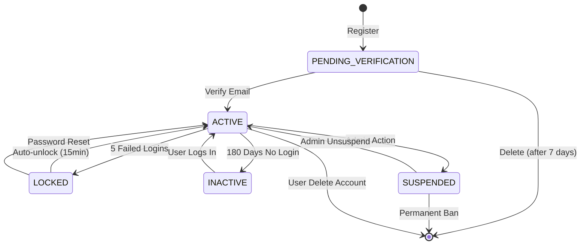
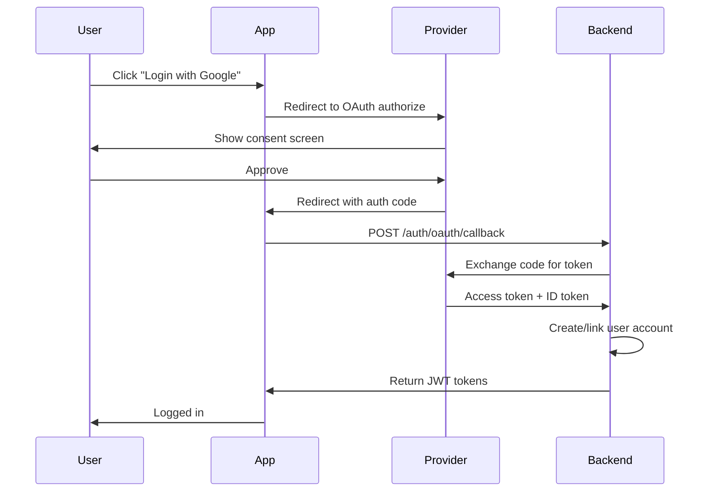

# Backend Business Logic - User Registration & Authentication

## 1. Business Rules Overview

### Core Business Rules
- **BR-001**: Users must provide a unique email address for registration
- **BR-002**: Passwords must meet minimum security requirements (8+ characters, uppercase, lowercase, number, special character)
- **BR-003**: Email verification is mandatory before account activation
- **BR-004**: Failed login attempts are tracked; account locks after 5 consecutive failures
- **BR-005**: User sessions expire after 30 minutes of inactivity
- **BR-006**: Password reset tokens are valid for 15 minutes only
- **BR-007**: Users cannot reuse their last 5 passwords
- **BR-008**: Inactive accounts (no login for 180 days) are flagged for review
- **BR-009**: Multi-factor authentication (MFA) is optional but recommended for financial operations

### Validation Rules
- **VR-001**: Email must follow RFC 5322 standard format
- **VR-002**: Password minimum length: 8 characters, maximum: 128 characters
- **VR-003**: Username (if used) must be 3-30 alphanumeric characters
- **VR-004**: Phone numbers (for MFA) must be valid E.164 format
- **VR-005**: Account must have verified email before accessing protected resources

### Business Constraints
- **BC-001**: Maximum 3 registration attempts per email per hour (anti-spam)
- **BC-002**: Maximum 5 active sessions per user account
- **BC-003**: Password reset requests limited to 3 per hour per account
- **BC-004**: Token refresh allowed only within 7 days of last authentication

## 2. Use Cases / User Stories

### UC-001: User Registration

**Actor**: Anonymous User

**Preconditions**: 
- User has not previously registered with the given email
- Registration rate limit not exceeded

**Main Flow**:
1. User submits registration form with email, password, and optional profile data
2. System validates email format and uniqueness
3. System validates password against security policy
4. System hashes password using bcrypt (cost factor 12)
5. System generates email verification token (JWT, 24hr expiry)
6. System creates user record with status "PENDING_VERIFICATION"
7. System sends verification email with token link
8. System returns success response (does not expose user ID)

**Alternative Flows**:
- **A1**: Email already exists → Return 409 Conflict with generic message
- **A2**: Password validation fails → Return 400 with specific password requirements
- **A3**: Email service unavailable → Queue email for retry, return 202 Accepted
- **A4**: Rate limit exceeded → Return 429 Too Many Requests with retry-after header

**Postconditions**:
- User record created in database with PENDING_VERIFICATION status
- Verification email queued/sent
- Registration event published to event bus

**Business Rules**: BR-001, BR-002, BR-003, VR-001, VR-002, BC-001

---

### UC-002: Email Verification

**Actor**: Registered User (Unverified)

**Preconditions**:
- User has registered but not verified email
- Verification token is valid and not expired

**Main Flow**:
1. User clicks verification link in email
2. System validates token signature and expiry
3. System locates user by token subject claim
4. System updates user status to "ACTIVE"
5. System marks email as verified with timestamp
6. System invalidates verification token
7. System redirects user to login page with success message

**Alternative Flows**:
- **A1**: Token expired → Provide "Resend verification" option
- **A2**: Token invalid/tampered → Return 400 Bad Request
- **A3**: User already verified → Redirect to login with info message
- **A4**: User not found → Return generic error (security)

**Postconditions**:
- User status changed to ACTIVE
- Email marked as verified
- User can now authenticate
- UserVerified event published

**Business Rules**: BR-003

---

### UC-003: User Login (Email/Password)

**Actor**: Verified User

**Preconditions**:
- User account status is ACTIVE
- Account is not locked
- Email is verified

**Main Flow**:
1. User submits email and password
2. System retrieves user by email
3. System verifies password hash using bcrypt
4. System resets failed login attempt counter
5. System generates JWT access token (15min expiry)
6. System generates JWT refresh token (7 days expiry)
7. System creates session record with device/IP info
8. System returns tokens and user profile
9. System publishes UserLoggedIn event

**Alternative Flows**:
- **A1**: Invalid credentials → Increment failed attempt counter, return 401
- **A2**: Account locked → Return 403 with lock reason and duration
- **A3**: Email not verified → Return 403 with verification required message
- **A4**: Account inactive → Return 403 with reactivation required message
- **A5**: 5th failed attempt → Lock account for 15 minutes, send alert email

**Postconditions**:
- Active session created
- Tokens issued
- Failed attempt counter reset (on success) or incremented (on failure)
- Login event published with metadata

**Business Rules**: BR-003, BR-004, BR-005

---

### UC-004: Token Refresh

**Actor**: Authenticated User

**Preconditions**:
- User has valid refresh token
- Refresh token not expired
- Session still exists and not revoked

**Main Flow**:
1. User submits refresh token
2. System validates token signature and expiry
3. System verifies session exists and is active
4. System checks last authentication within 7 days
5. System generates new access token (15min expiry)
6. System optionally rotates refresh token (security best practice)
7. System updates session last_active timestamp
8. System returns new access token (and refresh token if rotated)

**Alternative Flows**:
- **A1**: Refresh token expired → Return 401, require re-authentication
- **A2**: Session revoked → Return 401 with re-login required
- **A3**: Last auth > 7 days → Require re-authentication
- **A4**: Token reuse detected (if rotation enabled) → Revoke all user sessions

**Postconditions**:
- New access token issued
- Session updated
- TokenRefreshed event published

**Business Rules**: BR-005, BC-004

---

### UC-005: Password Reset Request

**Actor**: Verified User

**Preconditions**:
- User account exists
- Rate limit not exceeded

**Main Flow**:
1. User submits email for password reset
2. System locates user by email (timing-safe lookup)
3. System generates password reset token (JWT, 15min expiry)
4. System stores token hash with user record
5. System sends password reset email with token link
6. System returns success response (always, regardless of email existence)

**Alternative Flows**:
- **A1**: Email not found → Still return success (security - no enumeration)
- **A2**: Rate limit exceeded → Return 429 with retry-after
- **A3**: Account locked → Send alert email instead of reset link
- **A4**: Email service unavailable → Queue email, return 202

**Postconditions**:
- Reset token generated and stored
- Reset email queued/sent
- PasswordResetRequested event published

**Business Rules**: BR-006, BC-003

---

### UC-006: Password Reset Completion

**Actor**: User with Reset Token

**Preconditions**:
- User has valid password reset token
- Token not expired (15 minutes)

**Main Flow**:
1. User submits reset token and new password
2. System validates token signature and expiry
3. System retrieves user by token subject
4. System validates new password against policy
5. System checks new password not in last 5 used (hash comparison)
6. System hashes new password (bcrypt, cost 12)
7. System updates user password
8. System invalidates reset token
9. System revokes all active sessions (force re-login)
10. System adds old password hash to history
11. System sends password changed confirmation email
12. System returns success response

**Alternative Flows**:
- **A1**: Token expired → Return 400 with "Request new reset link"
- **A2**: Token invalid → Return 400 Bad Request
- **A3**: Password validation fails → Return 400 with requirements
- **A4**: Password reused from history → Return 400 with reuse policy
- **A5**: User not found → Return generic error

**Postconditions**:
- Password updated
- All sessions revoked
- Password history updated
- PasswordChanged event published

**Business Rules**: BR-002, BR-006, BR-007, VR-002

---

### UC-007: Account Lockout

**Actor**: System (Automated)

**Preconditions**:
- User has 5 consecutive failed login attempts

**Main Flow**:
1. System detects 5th failed login attempt
2. System updates user record: status = "LOCKED", lock_until = now + 15min
3. System revokes any active sessions
4. System sends security alert email to user
5. System logs security event with metadata (IP, device, timestamps)
6. System publishes AccountLocked event

**Alternative Flows**:
- **A1**: Email service down → Queue alert email for retry

**Postconditions**:
- Account locked for 15 minutes
- Sessions revoked
- Security alert sent
- Security event logged

**Business Rules**: BR-004

---

### UC-008: User Logout

**Actor**: Authenticated User

**Preconditions**:
- User has active session

**Main Flow**:
1. User initiates logout
2. System validates access token
3. System revokes session by ID
4. System blacklists access token (until expiry)
5. System invalidates refresh token
6. System publishes UserLoggedOut event
7. System returns success response

**Alternative Flows**:
- **A1**: Session already revoked → Return success (idempotent)
- **A2**: Invalid token → Return 401

**Postconditions**:
- Session revoked
- Tokens invalidated
- Logout event published

**Business Rules**: BR-005

---

## 3. Business Services

### AuthenticationService
**Responsibilities**:
- Password hashing and verification (bcrypt)
- JWT token generation and validation
- Session management (create, validate, revoke)
- Failed login attempt tracking
- Account lockout enforcement

**Transaction Boundaries**:
- Login operation: atomic (update failed attempts + create session OR lock account)
- Password reset: atomic (update password + revoke sessions + update history)

**Dependencies**:
- UserRepository (data access)
- EmailService (notifications)
- TokenService (JWT operations)
- EventBus (domain events)

**Error Handling**:
- Authentication failures return generic messages (security)
- Rate limit violations return 429 with exponential backoff hints
- System errors logged with request ID, never expose stack traces

---

### RegistrationService
**Responsibilities**:
- User registration workflow orchestration
- Email uniqueness validation
- Password policy enforcement
- Verification token generation
- Anti-spam rate limiting

**Transaction Boundaries**:
- Registration: atomic (create user + generate token + queue email)

**Dependencies**:
- UserRepository
- EmailService
- TokenService
- RateLimitService
- EventBus

**Error Handling**:
- Duplicate email returns 409 with generic message
- Validation errors return 400 with detailed field errors
- Rate limit returns 429 with retry-after header

---

### SessionService
**Responsibilities**:
- Session lifecycle management (CRUD)
- Session expiry enforcement (30min inactivity)
- Active session limit enforcement (max 5)
- Device/IP tracking for security audit
- Concurrent session management

**Transaction Boundaries**:
- Session creation: atomic (create session + enforce limit by revoking oldest if > 5)

**Dependencies**:
- SessionRepository
- CacheService (Redis for session store)

**Error Handling**:
- Session not found returns 401 (require re-authentication)
- Expired sessions auto-deleted, return 401

---

### PasswordService
**Responsibilities**:
- Password hashing (bcrypt, cost factor 12)
- Password validation against policy
- Password history management (last 5)
- Password strength scoring (optional, for UI feedback)

**Transaction Boundaries**:
- Password change: atomic (update password + update history + revoke sessions)

**Dependencies**:
- None (stateless utility service)

**Error Handling**:
- Weak passwords rejected with specific requirements
- Hash comparison timing-safe to prevent timing attacks

---

## 4. Domain Events

### UserRegistered
```json
{
  "eventId": "uuid",
  "eventType": "UserRegistered",
  "timestamp": "ISO-8601",
  "aggregateId": "userId",
  "payload": {
    "userId": "uuid",
    "email": "string",
    "registeredAt": "ISO-8601",
    "ipAddress": "string",
    "userAgent": "string"
  }
}
```
**Consumers**: Email verification service, Analytics service, Audit log

---

### UserVerified
```json
{
  "eventId": "uuid",
  "eventType": "UserVerified",
  "timestamp": "ISO-8601",
  "aggregateId": "userId",
  "payload": {
    "userId": "uuid",
    "email": "string",
    "verifiedAt": "ISO-8601"
  }
}
```
**Consumers**: Welcome email service, Analytics service

---

### UserLoggedIn
```json
{
  "eventId": "uuid",
  "eventType": "UserLoggedIn",
  "timestamp": "ISO-8601",
  "aggregateId": "userId",
  "payload": {
    "userId": "uuid",
    "sessionId": "uuid",
    "loginAt": "ISO-8601",
    "ipAddress": "string",
    "device": "string",
    "location": "string (optional)"
  }
}
```
**Consumers**: Security monitoring, Analytics, Fraud detection

---

### AccountLocked
```json
{
  "eventId": "uuid",
  "eventType": "AccountLocked",
  "timestamp": "ISO-8601",
  "aggregateId": "userId",
  "payload": {
    "userId": "uuid",
    "reason": "FAILED_LOGIN_ATTEMPTS",
    "lockedAt": "ISO-8601",
    "lockDuration": "15m",
    "failedAttempts": 5,
    "lastAttemptIp": "string"
  }
}
```
**Consumers**: Security alert service, Fraud detection, Audit log

---

### PasswordChanged
```json
{
  "eventId": "uuid",
  "eventType": "PasswordChanged",
  "timestamp": "ISO-8601",
  "aggregateId": "userId",
  "payload": {
    "userId": "uuid",
    "changedAt": "ISO-8601",
    "changeMethod": "RESET | USER_INITIATED",
    "ipAddress": "string"
  }
}
```
**Consumers**: Security alert service, Audit log

---

## 5. Validation Logic

### Input Validation Rules

#### Email Validation
```
RULE: Email format validation
INPUT: email (string)
VALIDATION:
  - NOT NULL
  - LENGTH: 5-254 characters
  - REGEX: ^[a-zA-Z0-9._%+-]+@[a-zA-Z0-9.-]+\.[a-zA-Z]{2,}$
  - RFC 5322 compliant
  - NO leading/trailing whitespace
ERROR: "Invalid email format"
```

#### Password Validation
```
RULE: Password strength policy
INPUT: password (string)
VALIDATION:
  - NOT NULL
  - LENGTH: 8-128 characters
  - MUST contain at least one uppercase letter [A-Z]
  - MUST contain at least one lowercase letter [a-z]
  - MUST contain at least one digit [0-9]
  - MUST contain at least one special character [@$!%*?&#]
  - MUST NOT contain common patterns (123456, password, qwerty, etc.)
ERROR: "Password must be 8-128 characters with uppercase, lowercase, number, and special character"
```

#### Username Validation (if applicable)
```
RULE: Username format
INPUT: username (string, optional)
VALIDATION:
  - LENGTH: 3-30 characters
  - ALPHANUMERIC only [a-zA-Z0-9_]
  - MUST NOT start with number
  - RESERVED WORDS check (admin, root, system, etc.)
ERROR: "Username must be 3-30 alphanumeric characters"
```

---

### Business Rule Validation

#### Email Uniqueness
```
RULE: Unique email constraint
WHEN: User registration OR email change
CHECK: SELECT COUNT(*) FROM users WHERE email = ? AND deleted_at IS NULL
CONDITION: COUNT = 0
ERROR: "An account with this email already exists"
NOTE: Return same error for security (prevent email enumeration)
```

#### Password History Check
```
RULE: Password reuse prevention
WHEN: Password change OR reset
CHECK: 
  1. Retrieve last 5 password hashes for user
  2. Compare new password against each using bcrypt.compare()
CONDITION: NO MATCH found
ERROR: "Cannot reuse any of your last 5 passwords"
```

#### Account Status Check
```
RULE: Active account required for login
WHEN: User authentication
CHECK: user.status IN ('ACTIVE')
CONDITIONS:
  - IF status = 'PENDING_VERIFICATION': ERROR "Email verification required"
  - IF status = 'LOCKED': ERROR "Account locked. Try again later"
  - IF status = 'INACTIVE': ERROR "Account inactive. Contact support"
  - IF status = 'SUSPENDED': ERROR "Account suspended. Contact support"
```

---

### Cross-Entity Validations

#### Session Limit Check
```
RULE: Maximum active sessions per user
WHEN: New session creation (login)
CHECK: SELECT COUNT(*) FROM sessions WHERE user_id = ? AND revoked_at IS NULL AND expires_at > NOW()
CONDITION: COUNT < 5
ACTION: If COUNT >= 5, revoke oldest session (by created_at ASC)
```

#### Rate Limit Validation
```
RULE: Registration rate limit
WHEN: User registration
CHECK: Redis key "registration:{email}:count" with TTL 1 hour
CONDITION: COUNT < 3
ACTION: Increment counter on each attempt
ERROR: "Too many registration attempts. Try again in {minutes} minutes"
```

---

### Async Validation Requirements

#### Email Verification
- Validation occurs asynchronously via email link click
- Token expires after 24 hours
- User cannot access protected resources until verified
- Periodic cleanup job removes unverified users after 7 days

#### Suspicious Activity Detection
- Failed login patterns analyzed asynchronously
- IP reputation checked against threat databases
- Geolocation anomalies flagged for review
- Real-time scoring feeds into account lockout decisions

---

## 6. State Transitions

### User Account State Machine



---

### Valid State Transitions

| From State           | To State             | Trigger                          | Guard Condition                  |
|----------------------|----------------------|----------------------------------|----------------------------------|
| -                    | PENDING_VERIFICATION | User submits registration        | Email unique, data valid         |
| PENDING_VERIFICATION | ACTIVE               | Email verification link clicked  | Token valid, not expired         |
| PENDING_VERIFICATION | (deleted)            | System cleanup job               | Created > 7 days ago             |
| ACTIVE               | LOCKED               | 5th consecutive failed login     | Failed attempts = 5              |
| ACTIVE               | INACTIVE             | System inactivity check          | Last login > 180 days            |
| ACTIVE               | SUSPENDED            | Admin suspension action          | Admin has suspend permission     |
| LOCKED               | ACTIVE               | Time-based auto-unlock           | Lock duration expired (15min)    |
| LOCKED               | ACTIVE               | Password reset completion        | Valid reset token, new password  |
| INACTIVE             | ACTIVE               | User successful login            | Credentials valid                |
| SUSPENDED            | ACTIVE               | Admin unsuspend action           | Admin has unsuspend permission   |
| SUSPENDED            | (deleted)            | Admin permanent ban              | Admin has ban permission         |
| ACTIVE               | (deleted)            | User account deletion            | User confirms deletion           |

---

### Transition Guards and Conditions

#### Register → PENDING_VERIFICATION
```
GUARDS:
  - Email format valid (VR-001)
  - Password policy met (BR-002)
  - Email not already registered (BR-001)
  - Registration rate limit not exceeded (BC-001)
```

#### PENDING_VERIFICATION → ACTIVE
```
GUARDS:
  - Verification token signature valid
  - Token not expired (< 24 hours)
  - User exists and in PENDING_VERIFICATION state
```

#### ACTIVE → LOCKED
```
GUARDS:
  - Failed login attempt count = 5 (BR-004)
  - Attempts within sliding window (15 minutes)
SIDE EFFECTS:
  - Set lock_until = NOW() + 15 minutes
  - Revoke all active sessions
  - Send security alert email
  - Publish AccountLocked event
```

#### LOCKED → ACTIVE (Auto-unlock)
```
GUARDS:
  - Current time >= lock_until timestamp
SIDE EFFECTS:
  - Reset failed login attempt counter to 0
  - Clear lock_until timestamp
```

#### LOCKED → ACTIVE (Password Reset)
```
GUARDS:
  - Valid password reset token
  - New password meets policy
  - New password not in history (last 5)
SIDE EFFECTS:
  - Update password hash
  - Reset failed login counter
  - Clear lock_until
  - Revoke all sessions
  - Add old password to history
```

---

### State-Specific Behaviors

#### PENDING_VERIFICATION State
- **Allowed Operations**: Resend verification email, account deletion
- **Blocked Operations**: Login, password reset, profile updates
- **System Behavior**: Auto-delete after 7 days if not verified

#### ACTIVE State
- **Allowed Operations**: Login, logout, password change, profile updates, MFA setup
- **Blocked Operations**: None
- **System Behavior**: Normal operational state, all features accessible

#### LOCKED State
- **Allowed Operations**: Password reset request
- **Blocked Operations**: Login attempts (return 403)
- **System Behavior**: Auto-unlock after 15 minutes OR manual unlock via password reset

#### INACTIVE State
- **Allowed Operations**: Login (transitions to ACTIVE), password reset
- **Blocked Operations**: None (but flagged for review)
- **System Behavior**: Flagged for security review, may require additional verification

#### SUSPENDED State
- **Allowed Operations**: Contact support (read-only view)
- **Blocked Operations**: All write operations, login
- **System Behavior**: Admin intervention required to restore access

---

## 7. Calculations & Algorithms

### Password Strength Scoring

**Algorithm**: ZXCVBN-inspired scoring
```
FUNCTION calculatePasswordStrength(password: string) -> int
  score = 0
  
  // Length scoring
  IF length >= 8: score += 1
  IF length >= 12: score += 1
  IF length >= 16: score += 1
  
  // Character variety
  IF contains lowercase: score += 1
  IF contains uppercase: score += 1
  IF contains digit: score += 1
  IF contains special: score += 1
  
  // Entropy calculation
  characterSpace = 0
  IF contains lowercase: characterSpace += 26
  IF contains uppercase: characterSpace += 26
  IF contains digit: characterSpace += 10
  IF contains special: characterSpace += 32
  
  entropy = length * log2(characterSpace)
  IF entropy > 50: score += 1
  IF entropy > 75: score += 1
  
  // Pattern penalties
  IF contains common patterns (123, abc, qwerty): score -= 2
  IF contains dictionary word: score -= 1
  IF contains repeated characters (aaa, 111): score -= 1
  
  // Normalize score to 0-4 range
  score = MAX(0, MIN(4, score))
  
  RETURN score
END FUNCTION

SCORING:
  0-1: Weak (reject)
  2: Fair (warn user)
  3: Good (accept)
  4: Strong (accept, no warning)
```

**Performance**: O(n) where n = password length, cached for 1 minute per password attempt

---

### JWT Token Generation

**Algorithm**: RS256 (RSA Signature with SHA-256)
```
FUNCTION generateAccessToken(user: User) -> string
  claims = {
    "sub": user.id,              // Subject (user ID)
    "email": user.email,
    "role": user.role,
    "iat": NOW(),                // Issued at
    "exp": NOW() + 15 minutes,   // Expiration
    "jti": generateUUID(),       // Token ID (for revocation)
    "iss": "finance-app",        // Issuer
    "aud": "finance-api"         // Audience
  }
  
  header = {
    "alg": "RS256",
    "typ": "JWT"
  }
  
  token = base64UrlEncode(header) + "." + 
          base64UrlEncode(claims)
  
  signature = RSA_SHA256_Sign(token, PRIVATE_KEY)
  
  RETURN token + "." + base64UrlEncode(signature)
END FUNCTION

FUNCTION generateRefreshToken(user: User, session: Session) -> string
  claims = {
    "sub": user.id,
    "sid": session.id,           // Session ID
    "iat": NOW(),
    "exp": NOW() + 7 days,
    "jti": generateUUID(),
    "iss": "finance-app",
    "aud": "finance-api",
    "type": "refresh"
  }
  
  // Same signing process as access token
  RETURN signJWT(claims)
END FUNCTION
```

**Performance**: RSA signing ~1-2ms per token, asymmetric allows stateless verification

---

### Failed Login Rate Calculation

**Algorithm**: Sliding Window Counter
```
FUNCTION trackFailedLogin(userId: string, ipAddress: string) -> boolean
  key = "failed_login:{userId}"
  window = 15 minutes
  maxAttempts = 5
  
  // Get current attempt count from Redis
  currentCount = redis.GET(key)
  
  IF currentCount IS NULL:
    currentCount = 0
    redis.SETEX(key, window, 0)
  END IF
  
  // Increment counter
  newCount = redis.INCR(key)
  redis.EXPIRE(key, window)  // Reset TTL
  
  // Check if threshold exceeded
  IF newCount >= maxAttempts:
    lockAccount(userId, duration: window)
    publishAccountLockedEvent(userId, ipAddress, newCount)
    RETURN true  // Account locked
  END IF
  
  RETURN false  // Not locked yet
END FUNCTION

FUNCTION resetFailedLoginCounter(userId: string) -> void
  key = "failed_login:{userId}"
  redis.DEL(key)
END FUNCTION
```

**Performance**: O(1) Redis operations, sub-millisecond latency

---

### Session Expiry Calculation

**Algorithm**: Idle Timeout with Sliding Window
```
FUNCTION checkSessionExpiry(session: Session) -> boolean
  idleTimeout = 30 minutes
  absoluteTimeout = 12 hours
  
  timeSinceLastActivity = NOW() - session.last_active_at
  timeSinceCreation = NOW() - session.created_at
  
  // Check idle timeout (sliding window)
  IF timeSinceLastActivity > idleTimeout:
    revokeSession(session.id)
    RETURN true  // Expired due to inactivity
  END IF
  
  // Check absolute timeout (maximum session lifetime)
  IF timeSinceCreation > absoluteTimeout:
    revokeSession(session.id)
    RETURN true  // Expired due to max lifetime
  END IF
  
  RETURN false  // Session still valid
END FUNCTION

FUNCTION updateSessionActivity(sessionId: string) -> void
  // Only update if last update was > 1 minute ago (reduce DB writes)
  redis.SETNX("session_update_lock:{sessionId}", 1, EX: 60 seconds)
  
  IF redis.EXISTS("session_update_lock:{sessionId}"):
    RETURN  // Already updated recently
  END IF
  
  db.UPDATE sessions 
  SET last_active_at = NOW() 
  WHERE id = sessionId
END FUNCTION
```

**Performance**: Lazy evaluation on each request, optimized with Redis lock to reduce DB writes

---

### Registration Rate Limiting

**Algorithm**: Token Bucket with Redis
```
FUNCTION checkRegistrationRateLimit(email: string) -> RateLimitResult
  key = "registration_rate:{email}"
  maxAttempts = 3
  windowDuration = 1 hour
  
  // Get current bucket state
  currentCount = redis.GET(key)
  
  IF currentCount IS NULL:
    // First attempt in window
    redis.SETEX(key, windowDuration, 1)
    RETURN {allowed: true, remaining: 2, resetAt: NOW() + windowDuration}
  END IF
  
  IF currentCount >= maxAttempts:
    ttl = redis.TTL(key)
    RETURN {
      allowed: false, 
      remaining: 0, 
      resetAt: NOW() + ttl,
      retryAfter: ttl
    }
  END IF
  
  // Increment bucket
  newCount = redis.INCR(key)
  ttl = redis.TTL(key)
  
  RETURN {
    allowed: true, 
    remaining: maxAttempts - newCount, 
    resetAt: NOW() + ttl
  }
END FUNCTION
```

**Performance**: O(1) Redis operations, supports distributed rate limiting

---

## 8. Authorization Rules

### Resource-Level Permissions

#### User Profile Resource
| Operation     | Required Permission     | Additional Constraints                  |
|---------------|-------------------------|-----------------------------------------|
| Read Own      | authenticated           | user.id == resource.id                  |
| Update Own    | authenticated           | user.id == resource.id                  |
| Delete Own    | authenticated           | user.id == resource.id + confirmation   |
| Read Others   | admin OR manager        | -                                       |
| Update Others | admin                   | Cannot modify admin accounts            |
| Delete Others | admin                   | Cannot delete own account               |

#### Session Resource
| Operation        | Required Permission | Additional Constraints           |
|------------------|---------------------|----------------------------------|
| List Own         | authenticated       | user.id == session.user_id       |
| Revoke Own       | authenticated       | user.id == session.user_id       |
| Revoke All Own   | authenticated       | user.id == session.user_id       |
| List Others      | admin               | -                                |
| Revoke Others    | admin               | Security audit log required      |

---

### Operation-Level Permissions

#### Authentication Operations
```
OPERATION: Register
PERMISSION: anonymous (public endpoint)
CONSTRAINTS:
  - Rate limit: 3 attempts per email per hour
  - CAPTCHA required after 1 failed attempt (optional)
```

```
OPERATION: Login
PERMISSION: anonymous (public endpoint)
CONSTRAINTS:
  - Account must be ACTIVE
  - Account not locked
  - Email verified
  - Rate limit: 10 attempts per IP per 15 minutes
```

```
OPERATION: Logout
PERMISSION: authenticated
CONSTRAINTS:
  - Must have valid access token
  - Can only revoke own session
```

```
OPERATION: Refresh Token
PERMISSION: valid refresh token
CONSTRAINTS:
  - Refresh token not expired
  - Session exists and not revoked
  - Last authentication within 7 days
```

```
OPERATION: Password Reset Request
PERMISSION: anonymous (public endpoint)
CONSTRAINTS:
  - Rate limit: 3 requests per email per hour
  - Generic response (no user enumeration)
```

```
OPERATION: Password Reset Complete
PERMISSION: valid reset token
CONSTRAINTS:
  - Token not expired (15 minutes)
  - New password meets policy
  - New password not in history
```

---

### Role-Based Access Control Rules

#### Role Hierarchy
```
Roles: [USER, MANAGER, ADMIN, SUPER_ADMIN]
Hierarchy: USER < MANAGER < ADMIN < SUPER_ADMIN
```

#### USER Role (Default)
- Manage own profile (read, update)
- Manage own sessions (list, revoke)
- Change own password
- Enable/disable own MFA
- Delete own account (with confirmation)

#### MANAGER Role
- All USER permissions
- Read user profiles (limited fields: id, email, name, status)
- View user activity logs (for managed users only)

#### ADMIN Role
- All MANAGER permissions
- Full CRUD on user accounts (except SUPER_ADMIN accounts)
- Lock/unlock user accounts
- Suspend/unsuspend accounts
- Reset user passwords (with audit trail)
- View all sessions and audit logs
- Revoke sessions for any user

#### SUPER_ADMIN Role
- All ADMIN permissions
- Manage ADMIN accounts
- System configuration access
- Bypass rate limits (for emergencies)
- Access to sensitive audit logs

---

### Data-Level Security Rules

#### Profile Visibility Rules
```
RULE: PII (Personally Identifiable Information) Protection
WHEN: User reads another user's profile
IF reader.role NOT IN [ADMIN, SUPER_ADMIN]:
  REDACT fields: [email, phone, address, date_of_birth, ssn]
  EXPOSE only: [id, public_name, avatar_url, created_at]
END IF
```

#### Session Data Rules
```
RULE: Session metadata protection
WHEN: User lists sessions
IF target_user.id != current_user.id AND current_user.role != ADMIN:
  DENY access (403 Forbidden)
ELSE IF current_user.role == ADMIN:
  EXPOSE: [session_id, user_id, created_at, last_active_at, ip_address, device]
  REDACT: [tokens, internal_metadata]
END IF
```

#### Audit Log Access
```
RULE: Audit log visibility
WHEN: User requests audit logs
IF current_user.role IN [ADMIN, SUPER_ADMIN]:
  IF requesting own logs:
    EXPOSE: all fields
  ELSE IF requesting others:
    EXPOSE: [event_type, timestamp, resource_type, resource_id, user_id, ip_address]
    REDACT: [sensitive_data, internal_ids]
ELSE:
  IF requesting own logs:
    EXPOSE: [event_type, timestamp, ip_address] (limited view)
  ELSE:
    DENY access (403 Forbidden)
END IF
```

---

### Authorization Decision Algorithm

```
FUNCTION authorizeRequest(user: User, operation: Operation, resource: Resource) -> AuthResult
  // Step 1: Check authentication
  IF user IS NULL OR NOT authenticated:
    RETURN DENY("Authentication required")
  END IF
  
  // Step 2: Check account status
  IF user.status NOT IN [ACTIVE]:
    RETURN DENY("Account not active")
  END IF
  
  // Step 3: Check email verification (for sensitive operations)
  IF operation.requiresVerifiedEmail AND NOT user.email_verified:
    RETURN DENY("Email verification required")
  END IF
  
  // Step 4: Check role-based permissions
  requiredRole = operation.requiredRole
  IF user.role < requiredRole:
    RETURN DENY("Insufficient permissions")
  END IF
  
  // Step 5: Check resource ownership
  IF operation.requiresOwnership:
    IF resource.ownerId != user.id AND user.role NOT IN [ADMIN, SUPER_ADMIN]:
      RETURN DENY("Not authorized to access this resource")
    END IF
  END IF
  
  // Step 6: Apply data-level security
  IF operation.type == READ:
    resource = applyDataRedaction(resource, user)
  END IF
  
  // Step 7: Check additional constraints (rate limits, etc.)
  IF NOT checkOperationConstraints(user, operation):
    RETURN DENY("Operation constraints not met")
  END IF
  
  // Step 8: Audit authorization decision
  logAuthorizationEvent(user, operation, resource, result: ALLOW)
  
  RETURN ALLOW(resource)
END FUNCTION
```

---

## 9. Integration Points

### Email Service Integration

**Purpose**: Send transactional emails (verification, password reset, security alerts)

**Integration Type**: Asynchronous via message queue (RabbitMQ/SQS)

**Endpoints**:
- **Provider**: SendGrid / AWS SES / Mailgun
- **Queue**: `email.outbound` (durable, persistent)

**Message Format**:
```json
{
  "messageId": "uuid",
  "template": "email-verification | password-reset | security-alert",
  "recipient": {
    "email": "user@example.com",
    "name": "User Name"
  },
  "data": {
    "verificationToken": "jwt-token",
    "resetLink": "https://app.example.com/reset?token=...",
    "expiresIn": "15 minutes"
  },
  "priority": "high | normal | low",
  "retryPolicy": {
    "maxAttempts": 3,
    "backoffMultiplier": 2
  }
}
```

**Error Handling**:
- Retry with exponential backoff (1min, 2min, 4min)
- Dead letter queue after 3 failures
- Alert ops team if email service down > 5 minutes
- Fallback to backup email provider if primary fails

**SLA**: 95% delivery within 30 seconds, 99.9% within 5 minutes

---

### SMS Service Integration (for MFA)

**Purpose**: Send one-time passwords (OTP) for multi-factor authentication

**Integration Type**: Synchronous REST API with circuit breaker

**Endpoints**:
- **Provider**: Twilio / AWS SNS
- **API**: `POST /v1/messages`

**Request**:
```json
{
  "to": "+351912345678",
  "body": "Your verification code is: 123456. Valid for 5 minutes.",
  "from": "+351987654321"
}
```

**Circuit Breaker Settings**:
- Failure threshold: 5 consecutive failures
- Timeout: 10 seconds
- Half-open retry: After 60 seconds
- Fallback: Disable MFA temporarily, send email OTP instead

**Security**:
- Rate limit: 3 SMS per phone number per hour
- Cost control: Max 1000 SMS per hour globally
- Phone number validation (E.164 format)

---

### Identity Provider Integration (OAuth/SAML)

**Purpose**: Third-party login (Google, Microsoft, GitHub)

**Integration Type**: OAuth 2.0 / OpenID Connect

**Supported Providers**:
- Google OAuth 2.0
- Microsoft Azure AD
- GitHub OAuth

**Flow**:


**API Endpoints**:
- `GET /auth/oauth/{provider}/authorize` - Initiate OAuth flow
- `POST /auth/oauth/{provider}/callback` - Handle OAuth callback
- `POST /auth/oauth/{provider}/link` - Link OAuth to existing account

**User Linking Rules**:
- If OAuth email matches existing user → Auto-link (if email verified)
- If OAuth email new → Create new user (auto-verified)
- If OAuth email matches unverified account → Require manual verification

**Error Handling**:
- OAuth provider timeout (10s) → Show error, retry option
- Invalid state parameter → Reject (CSRF protection)
- Token exchange failure → Log error, show generic message

---

### Audit Log Service Integration

**Purpose**: Centralized security and compliance audit logging

**Integration Type**: Asynchronous via event bus (Kafka/EventBridge)

**Events Published**:
- `UserRegistered`
- `UserVerified`
- `UserLoggedIn`
- `UserLoggedOut`
- `PasswordChanged`
- `AccountLocked`
- `SessionRevoked`
- `PermissionDenied`

**Event Schema**:
```json
{
  "eventId": "uuid",
  "eventType": "UserLoggedIn",
  "timestamp": "ISO-8601",
  "actorId": "userId",
  "actorType": "USER | SYSTEM | ADMIN",
  "resourceType": "User | Session | Token",
  "resourceId": "uuid",
  "action": "CREATE | READ | UPDATE | DELETE",
  "result": "SUCCESS | FAILURE",
  "metadata": {
    "ipAddress": "string",
    "userAgent": "string",
    "geolocation": "string",
    "reason": "string (for failures)"
  }
}
```

**Retention Policy**:
- Security events: 7 years (compliance requirement)
- General events: 1 year
- Sensitive data: Encrypted at rest

---

### Fraud Detection Service Integration

**Purpose**: Real-time fraud and anomaly detection

**Integration Type**: Asynchronous scoring + synchronous risk check

**Risk Signals**:
- Login from new device/location
- Unusual login time (e.g., 3 AM when user typically logs in 9-5)
- IP reputation (VPN, proxy, known malicious IPs)
- Velocity checks (e.g., 10 login attempts in 1 minute)
- Impossible travel (login from US then China 1 hour later)

**Integration Flow**:
1. On login attempt, publish `LoginAttempt` event (async)
2. Fraud service scores risk (0-100)
3. If risk > 80: Block login, trigger MFA challenge
4. If risk 50-80: Allow but flag for review
5. If risk < 50: Allow

**API Endpoint**:
- `POST /fraud/assess` - Synchronous risk assessment (max 200ms timeout)

**Fallback**:
- If fraud service unavailable → Allow with logging (fail-open for availability)
- Alert security team if service down > 5 minutes

---

### Analytics Service Integration

**Purpose**: User behavior analytics and product metrics

**Integration Type**: Asynchronous event streaming (Google Analytics, Mixpanel, Amplitude)

**Events Tracked**:
- Registration funnel (start, complete, verify)
- Login/logout events
- Session duration
- Feature usage
- Error rates

**Privacy Compliance**:
- PII stripped from analytics events
- User can opt-out of analytics
- GDPR-compliant data retention (13 months)

---

### Webhook Service Integration

**Purpose**: Notify external systems of authentication events

**Integration Type**: Outbound HTTP POST with retry

**Webhook Events**:
- `user.created`
- `user.verified`
- `user.logged_in`
- `user.password_changed`
- `user.deleted`

**Webhook Payload**:
```json
{
  "event": "user.verified",
  "timestamp": "ISO-8601",
  "data": {
    "userId": "uuid",
    "email": "user@example.com"
  },
  "signature": "HMAC-SHA256 signature for verification"
}
```

**Retry Policy**:
- Retry on 5xx errors: 3 attempts with exponential backoff
- No retry on 4xx errors (client error)
- Timeout: 10 seconds per attempt
- Dead letter queue after max retries

---

**End of Document**
