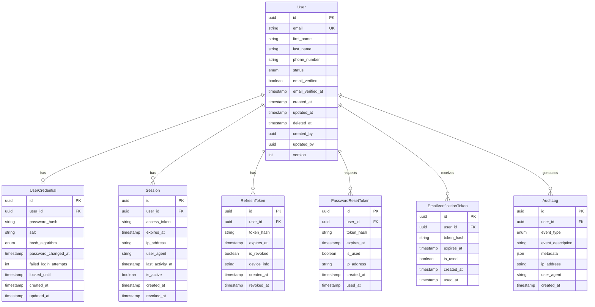

# Backend Data Models - SUMA Finance

## 1. Domain Model Overview

### Core Entities
The user registration and authentication domain consists of the following core entities:
- **User**: The primary aggregate root representing a registered user
- **UserCredential**: Secure storage of authentication credentials
- **Session**: Active user sessions and tokens
- **RefreshToken**: Long-lived tokens for session renewal
- **PasswordResetToken**: Time-limited tokens for password recovery
- **EmailVerificationToken**: Tokens for email verification
- **AuditLog**: Authentication and authorization event tracking

### Entity-Relationship Diagram



### Bounded Contexts
- **Identity Management**: User registration, profile management
- **Authentication**: Login, logout, session management
- **Authorization**: Role-based access control (future extension)
- **Security**: Password management, account security

### Aggregate Roots
- **User**: Primary aggregate containing user identity and profile information

### Value Objects
- **Email**: Validated email address
- **Password**: Validated password with strength requirements
- **PhoneNumber**: Validated phone number with country code
- **IPAddress**: IPv4/IPv6 address
- **Token**: Secure random token

## 2. Entity Definitions

### User Entity

| Property | Type | Constraints | Default | Description |
|----------|------|-------------|---------|-------------|
| id | UUID | PRIMARY KEY, NOT NULL | gen_random_uuid() | Unique user identifier |
| email | VARCHAR(255) | UNIQUE, NOT NULL | - | User email address (lowercase) |
| first_name | VARCHAR(100) | NOT NULL | - | User's first name |
| last_name | VARCHAR(100) | NOT NULL | - | User's last name |
| phone_number | VARCHAR(20) | NULLABLE | NULL | User's phone number with country code |
| status | ENUM | NOT NULL | 'ACTIVE' | Account status |
| email_verified | BOOLEAN | NOT NULL | false | Email verification status |
| email_verified_at | TIMESTAMP | NULLABLE | NULL | Email verification timestamp |
| created_at | TIMESTAMP | NOT NULL | NOW() | Record creation timestamp |
| updated_at | TIMESTAMP | NOT NULL | NOW() | Record update timestamp |
| deleted_at | TIMESTAMP | NULLABLE | NULL | Soft delete timestamp |
| created_by | UUID | NULLABLE | NULL | ID of user who created record |
| updated_by | UUID | NULLABLE | NULL | ID of user who updated record |
| version | INTEGER | NOT NULL | 1 | Optimistic locking version |

**Validations**:
- Email must match regex: `^[a-z0-9._%+-]+@[a-z0-9.-]+\.[a-z]{2,}$`
- First name: 1-100 characters, letters and spaces only
- Last name: 1-100 characters, letters and spaces only
- Phone number: Optional, format: +[country_code][number]
- Status must be one of: ACTIVE, SUSPENDED, LOCKED, DELETED

**Relationships**:
- One-to-one with UserCredential
- One-to-many with Session
- One-to-many with RefreshToken
- One-to-many with PasswordResetToken
- One-to-many with EmailVerificationToken
- One-to-many with AuditLog

**Lifecycle**:
- Creation: Auto-generate UUID, set created_at, status=ACTIVE, email_verified=false
- Updates: Update updated_at, increment version
- Soft delete: Set deleted_at, change status to DELETED

### UserCredential Entity

| Property | Type | Constraints | Default | Description |
|----------|------|-------------|---------|-------------|
| id | UUID | PRIMARY KEY, NOT NULL | gen_random_uuid() | Unique credential identifier |
| user_id | UUID | FOREIGN KEY, UNIQUE, NOT NULL | - | Reference to User |
| password_hash | VARCHAR(255) | NOT NULL | - | Bcrypt hashed password |
| salt | VARCHAR(64) | NOT NULL | - | Password salt |
| hash_algorithm | ENUM | NOT NULL | 'BCRYPT' | Hashing algorithm used |
| password_changed_at | TIMESTAMP | NOT NULL | NOW() | Last password change timestamp |
| failed_login_attempts | INTEGER | NOT NULL | 0 | Count of consecutive failed logins |
| locked_until | TIMESTAMP | NULLABLE | NULL | Account lock expiration |
| created_at | TIMESTAMP | NOT NULL | NOW() | Record creation timestamp |
| updated_at | TIMESTAMP | NOT NULL | NOW() | Record update timestamp |

**Validations**:
- password_hash must be valid bcrypt hash (60 characters)
- failed_login_attempts must be >= 0
- locked_until must be future timestamp if set

**Relationships**:
- Many-to-one with User (one credential per user)

**Business Rules**:
- Lock account after 5 failed login attempts for 30 minutes
- Reset failed_login_attempts on successful login
- Password must be changed every 90 days (configurable)

### Session Entity

| Property | Type | Constraints | Default | Description |
|----------|------|-------------|---------|-------------|
| id | UUID | PRIMARY KEY, NOT NULL | gen_random_uuid() | Unique session identifier |
| user_id | UUID | FOREIGN KEY, NOT NULL, INDEX | - | Reference to User |
| access_token | VARCHAR(512) | UNIQUE, NOT NULL | - | JWT access token |
| expires_at | TIMESTAMP | NOT NULL | NOW() + 15 minutes | Token expiration timestamp |
| ip_address | VARCHAR(45) | NOT NULL | - | Client IP address |
| user_agent | TEXT | NOT NULL | - | Client user agent string |
| last_activity_at | TIMESTAMP | NOT NULL | NOW() | Last activity timestamp |
| is_active | BOOLEAN | NOT NULL | true | Session active status |
| created_at | TIMESTAMP | NOT NULL | NOW() | Session creation timestamp |
| revoked_at | TIMESTAMP | NULLABLE | NULL | Session revocation timestamp |

**Validations**:
- access_token must be valid JWT format
- expires_at must be future timestamp
- ip_address must be valid IPv4 or IPv6

**Relationships**:
- Many-to-one with User

**Lifecycle**:
- Creation: Generate JWT, set expiration (15 minutes)
- Updates: Update last_activity_at on each request
- Revocation: Set is_active=false, set revoked_at

### RefreshToken Entity

| Property | Type | Constraints | Default | Description |
|----------|------|-------------|---------|-------------|
| id | UUID | PRIMARY KEY, NOT NULL | gen_random_uuid() | Unique token identifier |
| user_id | UUID | FOREIGN KEY, NOT NULL, INDEX | - | Reference to User |
| token_hash | VARCHAR(255) | UNIQUE, NOT NULL | - | Hashed refresh token |
| expires_at | TIMESTAMP | NOT NULL | NOW() + 30 days | Token expiration timestamp |
| is_revoked | BOOLEAN | NOT NULL | false | Token revocation status |
| device_info | TEXT | NULLABLE | NULL | Device information JSON |
| created_at | TIMESTAMP | NOT NULL | NOW() | Token creation timestamp |
| revoked_at | TIMESTAMP | NULLABLE | NULL | Token revocation timestamp |

**Validations**:
- token_hash must be SHA-256 hash
- expires_at must be future timestamp
- device_info must be valid JSON if provided

**Relationships**:
- Many-to-one with User

**Business Rules**:
- Maximum 5 active refresh tokens per user
- Automatically revoke oldest token when limit exceeded
- Single-use tokens (invalidate after use)

### PasswordResetToken Entity

| Property | Type | Constraints | Default | Description |
|----------|------|-------------|---------|-------------|
| id | UUID | PRIMARY KEY, NOT NULL | gen_random_uuid() | Unique token identifier |
| user_id | UUID | FOREIGN KEY, NOT NULL, INDEX | - | Reference to User |
| token_hash | VARCHAR(255) | UNIQUE, NOT NULL | - | Hashed reset token |
| expires_at | TIMESTAMP | NOT NULL | NOW() + 1 hour | Token expiration timestamp |
| is_used | BOOLEAN | NOT NULL | false | Token usage status |
| ip_address | VARCHAR(45) | NOT NULL | - | Request IP address |
| created_at | TIMESTAMP | NOT NULL | NOW() | Token creation timestamp |
| used_at | TIMESTAMP | NULLABLE | NULL | Token usage timestamp |

**Validations**:
- token_hash must be SHA-256 hash
- expires_at maximum 1 hour from creation
- ip_address must be valid IPv4 or IPv6

**Relationships**:
- Many-to-one with User

**Business Rules**:
- One-time use only
- Invalidate all previous tokens when new one requested
- Maximum 3 requests per hour per user

### EmailVerificationToken Entity

| Property | Type | Constraints | Default | Description |
|----------|------|-------------|---------|-------------|
| id | UUID | PRIMARY KEY, NOT NULL | gen_random_uuid() | Unique token identifier |
| user_id | UUID | FOREIGN KEY, NOT NULL, INDEX | - | Reference to User |
| token_hash | VARCHAR(255) | UNIQUE, NOT NULL | - | Hashed verification token |
| expires_at | TIMESTAMP | NOT NULL | NOW() + 24 hours | Token expiration timestamp |
| is_used | BOOLEAN | NOT NULL | false | Token usage status |
| created_at | TIMESTAMP | NOT NULL | NOW() | Token creation timestamp |
| used_at | TIMESTAMP | NULLABLE | NULL | Token usage timestamp |

**Validations**:
- token_hash must be SHA-256 hash
- expires_at maximum 24 hours from creation

**Relationships**:
- Many-to-one with User

**Business Rules**:
- One-time use only
- Automatically resend after 5 minutes if not used
- Maximum 5 resends per 24 hours

### AuditLog Entity

| Property | Type | Constraints | Default | Description |
|----------|------|-------------|---------|-------------|
| id | UUID | PRIMARY KEY, NOT NULL | gen_random_uuid() | Unique log identifier |
| user_id | UUID | FOREIGN KEY, NULLABLE, INDEX | NULL | Reference to User |
| event_type | ENUM | NOT NULL, INDEX | - | Type of event |
| event_description | TEXT | NOT NULL | - | Human-readable description |
| metadata | JSONB | NOT NULL | {} | Additional event data |
| ip_address | VARCHAR(45) | NOT NULL | - | Client IP address |
| user_agent | TEXT | NULLABLE | NULL | Client user agent |
| created_at | TIMESTAMP | NOT NULL, INDEX | NOW() | Event timestamp |

**Validations**:
- event_type must be valid enum value
- metadata must be valid JSON
- ip_address must be valid IPv4 or IPv6

**Relationships**:
- Many-to-one with User (nullable for anonymous events)

**Business Rules**:
- Immutable records (no updates or deletes)
- Partition by created_at (monthly partitions)
- Retention policy: 2 years

## 3. Data Transfer Objects (DTOs)

### Request DTOs

#### RegisterUserRequest
```typescript
{
  email: string;           // Required, valid email format
  password: string;        // Required, min 8 chars, uppercase, lowercase, number, special char
  firstName: string;       // Required, 1-100 chars
  lastName: string;        // Required, 1-100 chars
  phoneNumber?: string;    // Optional, E.164 format
}
```

#### LoginRequest
```typescript
{
  email: string;           // Required, valid email format
  password: string;        // Required
  deviceInfo?: {           // Optional device information
    deviceId?: string;
    deviceName?: string;
    platform?: string;
  };
}
```

#### RefreshTokenRequest
```typescript
{
  refreshToken: string;    // Required, JWT format
}
```

#### RequestPasswordResetRequest
```typescript
{
  email: string;           // Required, valid email format
}
```

#### ResetPasswordRequest
```typescript
{
  token: string;           // Required, reset token
  newPassword: string;     // Required, same validation as registration
}
```

#### VerifyEmailRequest
```typescript
{
  token: string;           // Required, verification token
}
```

#### UpdateUserProfileRequest
```typescript
{
  firstName?: string;      // Optional, 1-100 chars
  lastName?: string;       // Optional, 1-100 chars
  phoneNumber?: string;    // Optional, E.164 format
}
```

### Response DTOs

#### UserResponse
```typescript
{
  id: string;              // UUID
  email: string;
  firstName: string;
  lastName: string;
  phoneNumber: string | null;
  status: UserStatus;
  emailVerified: boolean;
  emailVerifiedAt: string | null;  // ISO 8601 timestamp
  createdAt: string;       // ISO 8601 timestamp
  updatedAt: string;       // ISO 8601 timestamp
}
```

#### AuthResponse
```typescript
{
  accessToken: string;     // JWT
  refreshToken: string;    // JWT
  expiresIn: number;       // Seconds until expiration
  tokenType: 'Bearer';
  user: UserResponse;
}
```

#### SessionResponse
```typescript
{
  id: string;              // UUID
  ipAddress: string;
  userAgent: string;
  lastActivityAt: string;  // ISO 8601 timestamp
  createdAt: string;       // ISO 8601 timestamp
  isActive: boolean;
}
```

#### ErrorResponse
```typescript
{
  error: {
    code: string;          // Error code
    message: string;       // Human-readable message
    field?: string;        // Field name for validation errors
    details?: any;         // Additional error details
  };
  timestamp: string;       // ISO 8601 timestamp
  path: string;            // Request path
  requestId: string;       // Trace ID
}
```

### DTO Mapping Rules

**Entity → Response DTO**:
- Exclude sensitive fields (password_hash, salt, token_hash)
- Convert UUIDs to string format
- Convert timestamps to ISO 8601 strings
- Null values remain null (no conversion to empty strings)
- Exclude soft-deleted records (deleted_at != null)

**Request DTO → Entity**:
- Validate all required fields
- Sanitize string inputs (trim whitespace)
- Normalize email to lowercase
- Hash passwords with bcrypt (cost factor 12)
- Generate UUIDs for new entities
- Set audit fields (created_by, updated_by)

## 4. Value Objects

### Email
```typescript
class Email {
  private readonly value: string;
  
  constructor(email: string) {
    if (!this.isValid(email)) {
      throw new Error('Invalid email format');
    }
    this.value = email.toLowerCase().trim();
  }
  
  private isValid(email: string): boolean {
    const regex = /^[a-z0-9._%+-]+@[a-z0-9.-]+\.[a-z]{2,}$/i;
    return regex.test(email) && email.length <= 255;
  }
  
  toString(): string {
    return this.value;
  }
  
  equals(other: Email): boolean {
    return this.value === other.value;
  }
}
```

### Password
```typescript
class Password {
  private readonly hash: string;
  private readonly salt: string;
  
  static create(plainPassword: string): Password {
    this.validate(plainPassword);
    const salt = generateSalt();
    const hash = bcrypt.hashSync(plainPassword, salt);
    return new Password(hash, salt);
  }
  
  private static validate(password: string): void {
    if (password.length < 8) {
      throw new Error('Password must be at least 8 characters');
    }
    if (!/[A-Z]/.test(password)) {
      throw new Error('Password must contain uppercase letter');
    }
    if (!/[a-z]/.test(password)) {
      throw new Error('Password must contain lowercase letter');
    }
    if (!/[0-9]/.test(password)) {
      throw new Error('Password must contain number');
    }
    if (!/[!@#$%^&*]/.test(password)) {
      throw new Error('Password must contain special character');
    }
  }
  
  verify(plainPassword: string): boolean {
    return bcrypt.compareSync(plainPassword, this.hash);
  }
}
```

### PhoneNumber
```typescript
class PhoneNumber {
  private readonly value: string;
  
  constructor(phoneNumber: string) {
    const normalized = this.normalize(phoneNumber);
    if (!this.isValid(normalized)) {
      throw new Error('Invalid phone number format');
    }
    this.value = normalized;
  }
  
  private normalize(phone: string): string {
    return phone.replace(/\s+/g, '').replace(/[().-]/g, '');
  }
  
  private isValid(phone: string): boolean {
    // E.164 format: +[country code][number]
    return /^\+[1-9]\d{1,14}$/.test(phone);
  }
  
  toString(): string {
    return this.value;
  }
}
```

### IPAddress
```typescript
class IPAddress {
  private readonly value: string;
  
  constructor(ip: string) {
    if (!this.isValid(ip)) {
      throw new Error('Invalid IP address');
    }
    this.value = ip;
  }
  
  private isValid(ip: string): boolean {
    const ipv4Regex = /^(\d{1,3}\.){3}\d{1,3}$/;
    const ipv6Regex = /^([0-9a-f]{1,4}:){7}[0-9a-f]{1,4}$/i;
    return ipv4Regex.test(ip) || ipv6Regex.test(ip);
  }
  
  toString(): string {
    return this.value;
  }
}
```

## 5. Enumerations

### UserStatus
```typescript
enum UserStatus {
  ACTIVE = 'ACTIVE',           // Normal active account
  SUSPENDED = 'SUSPENDED',     // Temporarily suspended
  LOCKED = 'LOCKED',           // Locked due to security concerns
  DELETED = 'DELETED'          // Soft deleted account
}
```

### HashAlgorithm
```typescript
enum HashAlgorithm {
  BCRYPT = 'BCRYPT',           // Default algorithm (cost factor 12)
  ARGON2 = 'ARGON2'            // Alternative for future migration
}
```

### AuditEventType
```typescript
enum AuditEventType {
  USER_REGISTERED = 'USER_REGISTERED',
  USER_LOGIN_SUCCESS = 'USER_LOGIN_SUCCESS',
  USER_LOGIN_FAILED = 'USER_LOGIN_FAILED',
  USER_LOGOUT = 'USER_LOGOUT',
  PASSWORD_CHANGED = 'PASSWORD_CHANGED',
  PASSWORD_RESET_REQUESTED = 'PASSWORD_RESET_REQUESTED',
  PASSWORD_RESET_COMPLETED = 'PASSWORD_RESET_COMPLETED',
  EMAIL_VERIFIED = 'EMAIL_VERIFIED',
  ACCOUNT_LOCKED = 'ACCOUNT_LOCKED',
  ACCOUNT_SUSPENDED = 'ACCOUNT_SUSPENDED',
  ACCOUNT_DELETED = 'ACCOUNT_DELETED',
  PROFILE_UPDATED = 'PROFILE_UPDATED',
  SESSION_CREATED = 'SESSION_CREATED',
  SESSION_REVOKED = 'SESSION_REVOKED',
  REFRESH_TOKEN_USED = 'REFRESH_TOKEN_USED',
  REFRESH_TOKEN_REVOKED = 'REFRESH_TOKEN_REVOKED'
}
```

## 6. Data Constraints

### Database Constraints

#### Users Table
```sql
-- Primary Key
CONSTRAINT pk_users PRIMARY KEY (id)

-- Unique Constraints
CONSTRAINT uk_users_email UNIQUE (email)

-- Check Constraints
CONSTRAINT ck_users_email_format CHECK (email ~* '^[a-z0-9._%+-]+@[a-z0-9.-]+\.[a-z]{2,}$')
CONSTRAINT ck_users_status CHECK (status IN ('ACTIVE', 'SUSPENDED', 'LOCKED', 'DELETED'))
CONSTRAINT ck_users_name_length CHECK (
  LENGTH(first_name) >= 1 AND LENGTH(first_name) <= 100 AND
  LENGTH(last_name) >= 1 AND LENGTH(last_name) <= 100
)

-- Indexes
CREATE INDEX idx_users_email ON users(email) WHERE deleted_at IS NULL;
CREATE INDEX idx_users_status ON users(status) WHERE deleted_at IS NULL;
CREATE INDEX idx_users_created_at ON users(created_at);
```

#### UserCredentials Table
```sql
-- Primary Key
CONSTRAINT pk_user_credentials PRIMARY KEY (id)

-- Foreign Key
CONSTRAINT fk_user_credentials_user FOREIGN KEY (user_id) 
  REFERENCES users(id) ON DELETE CASCADE

-- Unique Constraint
CONSTRAINT uk_user_credentials_user_id UNIQUE (user_id)

-- Check Constraints
CONSTRAINT ck_user_credentials_failed_attempts CHECK (failed_login_attempts >= 0)
CONSTRAINT ck_user_credentials_locked_until CHECK (
  locked_until IS NULL OR locked_until > NOW()
)
```

#### Sessions Table
```sql
-- Primary Key
CONSTRAINT pk_sessions PRIMARY KEY (id)

-- Foreign Key
CONSTRAINT fk_sessions_user FOREIGN KEY (user_id) 
  REFERENCES users(id) ON DELETE CASCADE

-- Check Constraints
CONSTRAINT ck_sessions_expires_at CHECK (expires_at > created_at)

-- Indexes
CREATE INDEX idx_sessions_user_id ON sessions(user_id);
CREATE INDEX idx_sessions_access_token ON sessions(access_token) WHERE is_active = true;
CREATE INDEX idx_sessions_expires_at ON sessions(expires_at) WHERE is_active = true;
```

#### RefreshTokens Table
```sql
-- Primary Key
CONSTRAINT pk_refresh_tokens PRIMARY KEY (id)

-- Foreign Key
CONSTRAINT fk_refresh_tokens_user FOREIGN KEY (user_id) 
  REFERENCES users(id) ON DELETE CASCADE

-- Unique Constraint
CONSTRAINT uk_refresh_tokens_token_hash UNIQUE (token_hash)

-- Check Constraints
CONSTRAINT ck_refresh_tokens_expires_at CHECK (expires_at > created_at)

-- Indexes
CREATE INDEX idx_refresh_tokens_user_id ON refresh_tokens(user_id);
CREATE INDEX idx_refresh_tokens_expires_at ON refresh_tokens(expires_at) 
  WHERE is_revoked = false;
```

#### PasswordResetTokens Table
```sql
-- Primary Key
CONSTRAINT pk_password_reset_tokens PRIMARY KEY (id)

-- Foreign Key
CONSTRAINT fk_password_reset_tokens_user FOREIGN KEY (user_id) 
  REFERENCES users(id) ON DELETE CASCADE

-- Unique Constraint
CONSTRAINT uk_password_reset_tokens_token_hash UNIQUE (token_hash)

-- Check Constraints
CONSTRAINT ck_password_reset_tokens_expires CHECK (
  expires_at <= created_at + INTERVAL '1 hour'
)

-- Indexes
CREATE INDEX idx_password_reset_tokens_user_id ON password_reset_tokens(user_id);
CREATE INDEX idx_password_reset_tokens_expires_at ON password_reset_tokens(expires_at) 
  WHERE is_used = false;
```

#### AuditLogs Table
```sql
-- Primary Key
CONSTRAINT pk_audit_logs PRIMARY KEY (id)

-- Foreign Key (nullable)
CONSTRAINT fk_audit_logs_user FOREIGN KEY (user_id) 
  REFERENCES users(id) ON DELETE SET NULL

-- Check Constraints
CONSTRAINT ck_audit_logs_event_type CHECK (
  event_type IN (
    'USER_REGISTERED', 'USER_LOGIN_SUCCESS', 'USER_LOGIN_FAILED',
    'USER_LOGOUT', 'PASSWORD_CHANGED', 'PASSWORD_RESET_REQUESTED',
    'PASSWORD_RESET_COMPLETED', 'EMAIL_VERIFIED', 'ACCOUNT_LOCKED',
    'ACCOUNT_SUSPENDED', 'ACCOUNT_DELETED', 'PROFILE_UPDATED',
    'SESSION_CREATED', 'SESSION_REVOKED', 'REFRESH_TOKEN_USED',
    'REFRESH_TOKEN_REVOKED'
  )
)

-- Indexes
CREATE INDEX idx_audit_logs_user_id ON audit_logs(user_id);
CREATE INDEX idx_audit_logs_event_type ON audit_logs(event_type);
CREATE INDEX idx_audit_logs_created_at ON audit_logs(created_at);

-- Partitioning (monthly)
CREATE TABLE audit_logs PARTITION BY RANGE (created_at);
```

### Application-Level Constraints

- **Email Uniqueness**: Case-insensitive, normalized to lowercase
- **Password Strength**: 8+ chars, uppercase, lowercase, number, special char
- **Rate Limiting**: 
  - Login: 5 attempts per 15 minutes per IP
  - Registration: 3 attempts per hour per IP
  - Password reset: 3 requests per hour per user
  - Email verification resend: 5 per 24 hours per user
- **Session Limits**: Maximum 10 concurrent sessions per user
- **Token Limits**: Maximum 5 active refresh tokens per user

## 7. Versioning & Audit

### Optimistic Locking
- **User** entity includes `version` field (integer)
- Increment on every update
- Conflict detection: WHERE version = expected_version
- Retry strategy on conflict (max 3 attempts)

### Audit Trail Fields

**Standard Audit Fields** (on User entity):
```sql
created_at    TIMESTAMP NOT NULL DEFAULT NOW()
updated_at    TIMESTAMP NOT NULL DEFAULT NOW()
deleted_at    TIMESTAMP NULL                      -- Soft delete
created_by    UUID NULL REFERENCES users(id)
updated_by    UUID NULL REFERENCES users(id)
version       INTEGER NOT NULL DEFAULT 1
```

**Audit Triggers**:
```sql
-- Auto-update updated_at
CREATE TRIGGER trg_users_updated_at
  BEFORE UPDATE ON users
  FOR EACH ROW
  EXECUTE FUNCTION update_timestamp();

-- Auto-increment version
CREATE TRIGGER trg_users_version
  BEFORE UPDATE ON users
  FOR EACH ROW
  EXECUTE FUNCTION increment_version();
```

### Soft Delete Pattern
- Set `deleted_at` timestamp instead of physical delete
- Change `status` to 'DELETED'
- Exclude from queries: `WHERE deleted_at IS NULL`
- Cascade soft delete to related sessions and tokens
- Retain audit logs permanently

### Historical Data Retention
- **Audit Logs**: Retain for 2 years, then archive to cold storage
- **Sessions**: Auto-delete expired sessions after 30 days
- **Tokens**: Auto-delete expired tokens after 7 days
- **User Data**: Permanent retention (until user requests deletion)

### Change Tracking
```typescript
interface AuditMetadata {
  changedFields?: string[];      // List of modified fields
  oldValues?: Record<string, any>; // Previous values
  newValues?: Record<string, any>; // New values
  reason?: string;                // Change reason
  requestId?: string;             // Trace ID
}
```

## 8. Data Migration Considerations

### Initial Data Seeds

#### Default Users (Development Only)
```typescript
[
  {
    email: 'admin@sumafinance.com',
    firstName: 'Admin',
    lastName: 'User',
    status: 'ACTIVE',
    emailVerified: true,
    password: 'Admin@123456'  // Change immediately
  },
  {
    email: 'test@sumafinance.com',
    firstName: 'Test',
    lastName: 'User',
    status: 'ACTIVE',
    emailVerified: true,
    password: 'Test@123456'
  }
]
```

#### Configuration Data
- Password policy settings
- Session timeout configurations
- Rate limiting rules
- Email templates (verification, password reset)

### Migration Strategy from Existing Systems

**Phase 1: Schema Setup**
1. Create all tables with constraints
2. Set up indexes and partitions
3. Create triggers and functions
4. Seed initial configuration data

**Phase 2: Data Import** (if migrating from existing system)
1. Extract users from legacy system
2. Transform data to match new schema:
   - Normalize email addresses (lowercase)
   - Re-hash passwords with bcrypt if different algorithm
   - Map legacy status codes to new UserStatus enum
   - Generate UUIDs for all records
3. Validate data integrity before import
4. Import in batches (1000 records per batch)
5. Verify foreign key relationships

**Phase 3: Validation**
1. Count records match source system
2. Verify all foreign keys valid
3. Test sample user logins
4. Validate email addresses
5. Check audit trail completeness

### Data Transformation Rules

**Email Normalization**:
```typescript
const normalizeEmail = (email: string): string => {
  return email.toLowerCase().trim();
};
```

**Password Migration**:
```typescript
// If migrating from different hash algorithm
const migratePassword = async (legacyHash: string, algorithm: string) => {
  if (algorithm === 'md5' || algorithm === 'sha1') {
    // Force password reset on first login
    return {
      requiresReset: true,
      tempHash: legacyHash,
      migrationFlag: true
    };
  }
  // Bcrypt passwords can be migrated directly
  return { requiresReset: false, hash: legacyHash };
};
```

**Status Mapping**:
```typescript
const mapLegacyStatus = (legacyStatus: string): UserStatus => {
  const mapping: Record<string, UserStatus> = {
    'active': UserStatus.ACTIVE,
    'inactive': UserStatus.SUSPENDED,
    'blocked': UserStatus.LOCKED,
    'deleted': UserStatus.DELETED
  };
  return mapping[legacyStatus.toLowerCase()] || UserStatus.ACTIVE;
};
```

### Rollback Strategy
- Full database backup before migration
- Transaction-based imports (rollback on error)
- Keep legacy system in read-only mode during migration
- Validation checkpoint after each phase
- Maintain migration logs for audit trail
