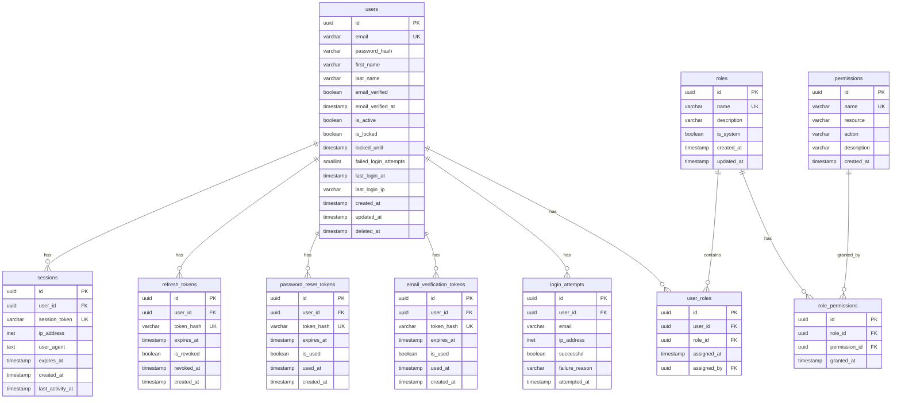

Claude configuration file at C:\Users\ricma\.claude.json is corrupted: Unexpected end of JSON input

Claude configuration file at C:\Users\ricma\.claude.json is corrupted
The corrupted file has been backed up to: C:\Users\ricma\.claude.json.corrupted.1762037208678
A backup file exists at: C:\Users\ricma\.claude.json.backup
You can manually restore it by running: cp "C:\Users\ricma\.claude.json.backup" "C:\Users\ricma\.claude.json"

# Database Schema Design - User Registration & Authentication

## 1. Schema Overview

### Database Type
- **Database**: PostgreSQL 15+
- **Primary Schema**: `auth`
- **Additional Schemas**: `audit`

### Naming Conventions
- Tables: `snake_case`, plural nouns (e.g., `users`, `sessions`)
- Columns: `snake_case` (e.g., `email_address`, `created_at`)
- Indexes: `idx_{table}_{columns}` (e.g., `idx_users_email`)
- Foreign Keys: `fk_{table}_{referenced_table}` (e.g., `fk_sessions_users`)
- Constraints: `chk_{table}_{column}` (e.g., `chk_users_email_format`)

### ER Diagram



## 2. Table Definitions

### 2.1 users

```sql
CREATE TABLE auth.users (
    id UUID PRIMARY KEY DEFAULT gen_random_uuid(),
    email VARCHAR(255) NOT NULL,
    password_hash VARCHAR(255) NOT NULL,
    first_name VARCHAR(100) NOT NULL,
    last_name VARCHAR(100) NOT NULL,
    email_verified BOOLEAN NOT NULL DEFAULT FALSE,
    email_verified_at TIMESTAMP WITH TIME ZONE,
    is_active BOOLEAN NOT NULL DEFAULT TRUE,
    is_locked BOOLEAN NOT NULL DEFAULT FALSE,
    locked_until TIMESTAMP WITH TIME ZONE,
    failed_login_attempts SMALLINT NOT NULL DEFAULT 0,
    last_login_at TIMESTAMP WITH TIME ZONE,
    last_login_ip INET,
    created_at TIMESTAMP WITH TIME ZONE NOT NULL DEFAULT NOW(),
    updated_at TIMESTAMP WITH TIME ZONE NOT NULL DEFAULT NOW(),
    deleted_at TIMESTAMP WITH TIME ZONE,
    
    CONSTRAINT chk_users_email_format CHECK (email ~* '^[A-Za-z0-9._%+-]+@[A-Za-z0-9.-]+\.[A-Za-z]{2,}$'),
    CONSTRAINT chk_users_failed_attempts CHECK (failed_login_attempts >= 0 AND failed_login_attempts <= 10),
    CONSTRAINT chk_users_name_length CHECK (LENGTH(first_name) >= 1 AND LENGTH(last_name) >= 1),
    CONSTRAINT uq_users_email UNIQUE (email) WHERE deleted_at IS NULL
);

CREATE INDEX idx_users_email ON auth.users(email) WHERE deleted_at IS NULL;
CREATE INDEX idx_users_is_active ON auth.users(is_active) WHERE deleted_at IS NULL;
CREATE INDEX idx_users_created_at ON auth.users(created_at);
CREATE INDEX idx_users_deleted_at ON auth.users(deleted_at) WHERE deleted_at IS NOT NULL;

COMMENT ON TABLE auth.users IS 'Core user accounts with authentication credentials';
COMMENT ON COLUMN auth.users.password_hash IS 'Bcrypt hashed password (cost factor 12)';
COMMENT ON COLUMN auth.users.failed_login_attempts IS 'Counter for failed login attempts, reset on successful login';
COMMENT ON COLUMN auth.users.locked_until IS 'Temporary lock expiration timestamp';
```

### 2.2 sessions

```sql
CREATE TABLE auth.sessions (
    id UUID PRIMARY KEY DEFAULT gen_random_uuid(),
    user_id UUID NOT NULL,
    session_token VARCHAR(255) NOT NULL,
    ip_address INET,
    user_agent TEXT,
    expires_at TIMESTAMP WITH TIME ZONE NOT NULL,
    created_at TIMESTAMP WITH TIME ZONE NOT NULL DEFAULT NOW(),
    last_activity_at TIMESTAMP WITH TIME ZONE NOT NULL DEFAULT NOW(),
    
    CONSTRAINT fk_sessions_users FOREIGN KEY (user_id) 
        REFERENCES auth.users(id) ON DELETE CASCADE,
    CONSTRAINT uq_sessions_token UNIQUE (session_token),
    CONSTRAINT chk_sessions_expiry CHECK (expires_at > created_at)
);

CREATE INDEX idx_sessions_user_id ON auth.sessions(user_id);
CREATE INDEX idx_sessions_token ON auth.sessions(session_token);
CREATE INDEX idx_sessions_expires_at ON auth.sessions(expires_at);
CREATE INDEX idx_sessions_last_activity ON auth.sessions(last_activity_at);

COMMENT ON TABLE auth.sessions IS 'Active user sessions with JWT tokens';
COMMENT ON COLUMN auth.sessions.session_token IS 'SHA-256 hash of JWT token';
```

### 2.3 refresh_tokens

```sql
CREATE TABLE auth.refresh_tokens (
    id UUID PRIMARY KEY DEFAULT gen_random_uuid(),
    user_id UUID NOT NULL,
    token_hash VARCHAR(255) NOT NULL,
    expires_at TIMESTAMP WITH TIME ZONE NOT NULL,
    is_revoked BOOLEAN NOT NULL DEFAULT FALSE,
    revoked_at TIMESTAMP WITH TIME ZONE,
    created_at TIMESTAMP WITH TIME ZONE NOT NULL DEFAULT NOW(),
    
    CONSTRAINT fk_refresh_tokens_users FOREIGN KEY (user_id) 
        REFERENCES auth.users(id) ON DELETE CASCADE,
    CONSTRAINT uq_refresh_tokens_token UNIQUE (token_hash),
    CONSTRAINT chk_refresh_tokens_expiry CHECK (expires_at > created_at),
    CONSTRAINT chk_refresh_tokens_revoked CHECK (
        (is_revoked = FALSE AND revoked_at IS NULL) OR 
        (is_revoked = TRUE AND revoked_at IS NOT NULL)
    )
);

CREATE INDEX idx_refresh_tokens_user_id ON auth.refresh_tokens(user_id);
CREATE INDEX idx_refresh_tokens_token ON auth.refresh_tokens(token_hash);
CREATE INDEX idx_refresh_tokens_expires_at ON auth.refresh_tokens(expires_at);
CREATE INDEX idx_refresh_tokens_active ON auth.refresh_tokens(user_id, is_revoked) 
    WHERE is_revoked = FALSE;

COMMENT ON TABLE auth.refresh_tokens IS 'Long-lived refresh tokens for obtaining new access tokens';
```

### 2.4 password_reset_tokens

```sql
CREATE TABLE auth.password_reset_tokens (
    id UUID PRIMARY KEY DEFAULT gen_random_uuid(),
    user_id UUID NOT NULL,
    token_hash VARCHAR(255) NOT NULL,
    expires_at TIMESTAMP WITH TIME ZONE NOT NULL,
    is_used BOOLEAN NOT NULL DEFAULT FALSE,
    used_at TIMESTAMP WITH TIME ZONE,
    created_at TIMESTAMP WITH TIME ZONE NOT NULL DEFAULT NOW(),
    
    CONSTRAINT fk_password_reset_tokens_users FOREIGN KEY (user_id) 
        REFERENCES auth.users(id) ON DELETE CASCADE,
    CONSTRAINT uq_password_reset_tokens_token UNIQUE (token_hash),
    CONSTRAINT chk_password_reset_expiry CHECK (expires_at > created_at),
    CONSTRAINT chk_password_reset_used CHECK (
        (is_used = FALSE AND used_at IS NULL) OR 
        (is_used = TRUE AND used_at IS NOT NULL)
    )
);

CREATE INDEX idx_password_reset_tokens_user_id ON auth.password_reset_tokens(user_id);
CREATE INDEX idx_password_reset_tokens_token ON auth.password_reset_tokens(token_hash);
CREATE INDEX idx_password_reset_tokens_expires_at ON auth.password_reset_tokens(expires_at);

COMMENT ON TABLE auth.password_reset_tokens IS 'One-time use tokens for password reset flow';
COMMENT ON COLUMN auth.password_reset_tokens.token_hash IS 'SHA-256 hash of reset token';
```

### 2.5 email_verification_tokens

```sql
CREATE TABLE auth.email_verification_tokens (
    id UUID PRIMARY KEY DEFAULT gen_random_uuid(),
    user_id UUID NOT NULL,
    token_hash VARCHAR(255) NOT NULL,
    expires_at TIMESTAMP WITH TIME ZONE NOT NULL,
    is_used BOOLEAN NOT NULL DEFAULT FALSE,
    used_at TIMESTAMP WITH TIME ZONE,
    created_at TIMESTAMP WITH TIME ZONE NOT NULL DEFAULT NOW(),
    
    CONSTRAINT fk_email_verification_tokens_users FOREIGN KEY (user_id) 
        REFERENCES auth.users(id) ON DELETE CASCADE,
    CONSTRAINT uq_email_verification_tokens_token UNIQUE (token_hash),
    CONSTRAINT chk_email_verification_expiry CHECK (expires_at > created_at),
    CONSTRAINT chk_email_verification_used CHECK (
        (is_used = FALSE AND used_at IS NULL) OR 
        (is_used = TRUE AND used_at IS NOT NULL)
    )
);

CREATE INDEX idx_email_verification_tokens_user_id ON auth.email_verification_tokens(user_id);
CREATE INDEX idx_email_verification_tokens_token ON auth.email_verification_tokens(token_hash);
CREATE INDEX idx_email_verification_tokens_expires_at ON auth.email_verification_tokens(expires_at);

COMMENT ON TABLE auth.email_verification_tokens IS 'One-time use tokens for email verification';
```

### 2.6 login_attempts

```sql
CREATE TABLE audit.login_attempts (
    id UUID PRIMARY KEY DEFAULT gen_random_uuid(),
    user_id UUID,
    email VARCHAR(255) NOT NULL,
    ip_address INET NOT NULL,
    successful BOOLEAN NOT NULL,
    failure_reason VARCHAR(100),
    attempted_at TIMESTAMP WITH TIME ZONE NOT NULL DEFAULT NOW(),
    
    CONSTRAINT fk_login_attempts_users FOREIGN KEY (user_id) 
        REFERENCES auth.users(id) ON DELETE SET NULL,
    CONSTRAINT chk_login_attempts_failure CHECK (
        (successful = TRUE AND failure_reason IS NULL) OR 
        (successful = FALSE AND failure_reason IS NOT NULL)
    )
);

CREATE INDEX idx_login_attempts_user_id ON audit.login_attempts(user_id);
CREATE INDEX idx_login_attempts_email ON audit.login_attempts(email);
CREATE INDEX idx_login_attempts_ip ON audit.login_attempts(ip_address);
CREATE INDEX idx_login_attempts_attempted_at ON audit.login_attempts(attempted_at DESC);
CREATE INDEX idx_login_attempts_failed ON audit.login_attempts(email, attempted_at) 
    WHERE successful = FALSE;

COMMENT ON TABLE audit.login_attempts IS 'Audit log of all login attempts for security monitoring';
```

### 2.7 roles

```sql
CREATE TABLE auth.roles (
    id UUID PRIMARY KEY DEFAULT gen_random_uuid(),
    name VARCHAR(50) NOT NULL,
    description TEXT,
    is_system BOOLEAN NOT NULL DEFAULT FALSE,
    created_at TIMESTAMP WITH TIME ZONE NOT NULL DEFAULT NOW(),
    updated_at TIMESTAMP WITH TIME ZONE NOT NULL DEFAULT NOW(),
    
    CONSTRAINT uq_roles_name UNIQUE (name),
    CONSTRAINT chk_roles_name_format CHECK (name ~* '^[A-Z_]+$')
);

CREATE INDEX idx_roles_name ON auth.roles(name);
CREATE INDEX idx_roles_is_system ON auth.roles(is_system);

COMMENT ON TABLE auth.roles IS 'User roles for role-based access control';
COMMENT ON COLUMN auth.roles.is_system IS 'System roles cannot be deleted or modified';
```

### 2.8 permissions

```sql
CREATE TABLE auth.permissions (
    id UUID PRIMARY KEY DEFAULT gen_random_uuid(),
    name VARCHAR(100) NOT NULL,
    resource VARCHAR(50) NOT NULL,
    action VARCHAR(50) NOT NULL,
    description TEXT,
    created_at TIMESTAMP WITH TIME ZONE NOT NULL DEFAULT NOW(),
    
    CONSTRAINT uq_permissions_name UNIQUE (name),
    CONSTRAINT uq_permissions_resource_action UNIQUE (resource, action),
    CONSTRAINT chk_permissions_name_format CHECK (name ~* '^[A-Z_]+$'),
    CONSTRAINT chk_permissions_action CHECK (action IN ('CREATE', 'READ', 'UPDATE', 'DELETE', 'EXECUTE'))
);

CREATE INDEX idx_permissions_name ON auth.permissions(name);
CREATE INDEX idx_permissions_resource ON auth.permissions(resource);
CREATE INDEX idx_permissions_resource_action ON auth.permissions(resource, action);

COMMENT ON TABLE auth.permissions IS 'Granular permissions for resources and actions';
```

### 2.9 user_roles

```sql
CREATE TABLE auth.user_roles (
    id UUID PRIMARY KEY DEFAULT gen_random_uuid(),
    user_id UUID NOT NULL,
    role_id UUID NOT NULL,
    assigned_at TIMESTAMP WITH TIME ZONE NOT NULL DEFAULT NOW(),
    assigned_by UUID,
    
    CONSTRAINT fk_user_roles_users FOREIGN KEY (user_id) 
        REFERENCES auth.users(id) ON DELETE CASCADE,
    CONSTRAINT fk_user_roles_roles FOREIGN KEY (role_id) 
        REFERENCES auth.roles(id) ON DELETE CASCADE,
    CONSTRAINT fk_user_roles_assigned_by FOREIGN KEY (assigned_by) 
        REFERENCES auth.users(id) ON DELETE SET NULL,
    CONSTRAINT uq_user_roles_user_role UNIQUE (user_id, role_id)
);

CREATE INDEX idx_user_roles_user_id ON auth.user_roles(user_id);
CREATE INDEX idx_user_roles_role_id ON auth.user_roles(role_id);
CREATE INDEX idx_user_roles_assigned_at ON auth.user_roles(assigned_at);

COMMENT ON TABLE auth.user_roles IS 'Many-to-many junction table for users and roles';
```

### 2.10 role_permissions

```sql
CREATE TABLE auth.role_permissions (
    id UUID PRIMARY KEY DEFAULT gen_random_uuid(),
    role_id UUID NOT NULL,
    permission_id UUID NOT NULL,
    granted_at TIMESTAMP WITH TIME ZONE NOT NULL DEFAULT NOW(),
    
    CONSTRAINT fk_role_permissions_roles FOREIGN KEY (role_id) 
        REFERENCES auth.roles(id) ON DELETE CASCADE,
    CONSTRAINT fk_role_permissions_permissions FOREIGN KEY (permission_id) 
        REFERENCES auth.permissions(id) ON DELETE CASCADE,
    CONSTRAINT uq_role_permissions_role_permission UNIQUE (role_id, permission_id)
);

CREATE INDEX idx_role_permissions_role_id ON auth.role_permissions(role_id);
CREATE INDEX idx_role_permissions_permission_id ON auth.role_permissions(permission_id);

COMMENT ON TABLE auth.role_permissions IS 'Many-to-many junction table for roles and permissions';
```

## 3. Column Specifications

### Data Type Rationale

- **UUID**: Primary keys for globally unique identifiers, better for distributed systems
- **VARCHAR(255)**: Email addresses, token hashes (SHA-256 = 64 chars hex)
- **VARCHAR(100)**: Names with reasonable length limits
- **TEXT**: User agent strings, descriptions (unbounded)
- **BOOLEAN**: Flags and status indicators
- **SMALLINT**: Counters with small range (failed attempts 0-10)
- **INET**: IP addresses (supports both IPv4 and IPv6)
- **TIMESTAMP WITH TIME ZONE**: All temporal data with timezone awareness

### NULL Constraints Strategy

- **NOT NULL**: Core identity fields (id, email, password_hash, names)
- **NULLABLE**: Optional metadata (last_login_at, locked_until, deleted_at)
- **NULLABLE with CHECK**: Fields that become required conditionally (revoked_at when is_revoked=TRUE)

## 4. Relationships

### One-to-Many
- `users` → `sessions` (one user has many sessions)
- `users` → `refresh_tokens` (one user has many refresh tokens)
- `users` → `password_reset_tokens` (one user requests many resets)
- `users` → `email_verification_tokens` (one user has verification tokens)
- `users` → `login_attempts` (one user has many login attempts)

### Many-to-Many
- `users` ↔ `roles` (through `user_roles`)
- `roles` ↔ `permissions` (through `role_permissions`)

### Self-Referential
- `user_roles.assigned_by` → `users.id` (user who assigned the role)

### Cascade Rules
- **ON DELETE CASCADE**: Sessions, tokens, user_roles (delete when user deleted)
- **ON DELETE SET NULL**: login_attempts.user_id, user_roles.assigned_by (preserve audit trail)

## 5. Indexes Strategy

### Primary Indexes
- All tables use UUID primary keys with B-tree indexes

### Foreign Key Indexes
- All foreign key columns indexed for join performance
- Example: `idx_sessions_user_id`, `idx_user_roles_user_id`

### Unique Indexes
- Email uniqueness with partial index (WHERE deleted_at IS NULL)
- Token uniqueness for all token tables
- Composite uniqueness for user_roles, role_permissions

### Composite Indexes
- `idx_refresh_tokens_active (user_id, is_revoked)` - Active tokens lookup
- `idx_login_attempts_failed (email, attempted_at)` - Failed attempts tracking
- `idx_permissions_resource_action` - Permission lookups

### Partial Indexes
- `uq_users_email` - Only enforce uniqueness for non-deleted users
- `idx_users_is_active` - Only index active users
- `idx_refresh_tokens_active` - Only index non-revoked tokens
- `idx_login_attempts_failed` - Only index failed attempts

### Performance Considerations
- Sessions table will grow rapidly: index on `expires_at` for cleanup
- Login attempts table needs indexes on `attempted_at DESC` for recent lookups
- Token lookups are critical path: unique indexes on token_hash

## 6. Constraints & Rules

### Data Validation Constraints

```sql
-- Email format validation
CONSTRAINT chk_users_email_format CHECK (email ~* '^[A-Za-z0-9._%+-]+@[A-Za-z0-9.-]+\.[A-Za-z]{2,}$')

-- Failed attempts range
CONSTRAINT chk_users_failed_attempts CHECK (failed_login_attempts >= 0 AND failed_login_attempts <= 10)

-- Name length validation
CONSTRAINT chk_users_name_length CHECK (LENGTH(first_name) >= 1 AND LENGTH(last_name) >= 1)

-- Token expiry validation
CONSTRAINT chk_sessions_expiry CHECK (expires_at > created_at)

-- Conditional nullability
CONSTRAINT chk_refresh_tokens_revoked CHECK (
    (is_revoked = FALSE AND revoked_at IS NULL) OR 
    (is_revoked = TRUE AND revoked_at IS NOT NULL)
)

-- Role name format (uppercase with underscores)
CONSTRAINT chk_roles_name_format CHECK (name ~* '^[A-Z_]+$')

-- Permission actions whitelist
CONSTRAINT chk_permissions_action CHECK (action IN ('CREATE', 'READ', 'UPDATE', 'DELETE', 'EXECUTE'))
```

### Referential Integrity
- All foreign keys enforce referential integrity
- Cascade deletes for dependent data (sessions, tokens)
- SET NULL for audit trail preservation (login_attempts)

## 7. Views & Materialized Views

### 7.1 Active Users View

```sql
CREATE VIEW auth.v_active_users AS
SELECT 
    u.id,
    u.email,
    u.first_name,
    u.last_name,
    u.email_verified,
    u.last_login_at,
    COUNT(DISTINCT s.id) AS active_sessions_count,
    u.created_at
FROM auth.users u
LEFT JOIN auth.sessions s ON u.id = s.user_id 
    AND s.expires_at > NOW()
WHERE u.is_active = TRUE 
    AND u.deleted_at IS NULL
    AND u.is_locked = FALSE
GROUP BY u.id;

COMMENT ON VIEW auth.v_active_users IS 'Active users with session counts';
```

### 7.2 User Permissions View

```sql
CREATE VIEW auth.v_user_permissions AS
SELECT 
    u.id AS user_id,
    u.email,
    r.name AS role_name,
    p.name AS permission_name,
    p.resource,
    p.action
FROM auth.users u
INNER JOIN auth.user_roles ur ON u.id = ur.user_id
INNER JOIN auth.roles r ON ur.role_id = r.id
INNER JOIN auth.role_permissions rp ON r.id = rp.role_id
INNER JOIN auth.permissions p ON rp.permission_id = p.id
WHERE u.is_active = TRUE 
    AND u.deleted_at IS NULL;

COMMENT ON VIEW auth.v_user_permissions IS 'Flattened view of user permissions through roles';
```

### 7.3 Failed Login Attempts (Last 24h) - Materialized View

```sql
CREATE MATERIALIZED VIEW audit.mv_failed_login_attempts_24h AS
SELECT 
    email,
    ip_address,
    COUNT(*) AS attempt_count,
    MAX(attempted_at) AS last_attempt,
    ARRAY_AGG(failure_reason ORDER BY attempted_at DESC) AS failure_reasons
FROM audit.login_attempts
WHERE successful = FALSE 
    AND attempted_at > NOW() - INTERVAL '24 hours'
GROUP BY email, ip_address
HAVING COUNT(*) >= 3;

CREATE UNIQUE INDEX idx_mv_failed_login_email_ip 
    ON audit.mv_failed_login_attempts_24h(email, ip_address);

COMMENT ON MATERIALIZED VIEW audit.mv_failed_login_attempts_24h IS 
    'Failed login attempts in last 24 hours (refresh every 5 minutes)';
```

**Refresh Strategy:**
```sql
-- Refresh every 5 minutes via cron/scheduler
REFRESH MATERIALIZED VIEW CONCURRENTLY audit.mv_failed_login_attempts_24h;
```

## 8. Partitioning Strategy

### 8.1 Login Attempts Partitioning

Given high volume of login attempts, partition by month:

```sql
-- Convert to partitioned table
CREATE TABLE audit.login_attempts_partitioned (
    LIKE audit.login_attempts INCLUDING ALL
) PARTITION BY RANGE (attempted_at);

-- Create monthly partitions
CREATE TABLE audit.login_attempts_2025_01 
    PARTITION OF audit.login_attempts_partitioned
    FOR VALUES FROM ('2025-01-01') TO ('2025-02-01');

CREATE TABLE audit.login_attempts_2025_02 
    PARTITION OF audit.login_attempts_partitioned
    FOR VALUES FROM ('2025-02-01') TO ('2025-03-01');

-- Create default partition for future data
CREATE TABLE audit.login_attempts_default 
    PARTITION OF audit.login_attempts_partitioned DEFAULT;
```

**Partition Management:**
- Auto-create new partitions monthly (via cron or pg_partman)
- Archive old partitions after 12 months
- Compress archived partitions

### 8.2 Sessions Partitioning Consideration

Sessions table may benefit from partitioning by `expires_at`:

```sql
-- Partition by expiry date for efficient cleanup
CREATE TABLE auth.sessions_partitioned (
    LIKE auth.sessions INCLUDING ALL
) PARTITION BY RANGE (expires_at);
```

**Decision:** Evaluate partitioning after 1M+ sessions

## 9. Data Types & Domains

### 9.1 Custom Domains

```sql
-- Email domain with validation
CREATE DOMAIN auth.email_address AS VARCHAR(255)
    CHECK (VALUE ~* '^[A-Za-z0-9._%+-]+@[A-Za-z0-9.-]+\.[A-Za-z]{2,}$');

-- Token hash domain
CREATE DOMAIN auth.token_hash AS VARCHAR(255)
    CHECK (LENGTH(VALUE) = 64); -- SHA-256 hex string

-- Permission action enum
CREATE TYPE auth.permission_action AS ENUM (
    'CREATE', 'READ', 'UPDATE', 'DELETE', 'EXECUTE'
);
```

### 9.2 JSONB Usage

Consider JSONB for flexible metadata:

```sql
-- Add to sessions table for device info
ALTER TABLE auth.sessions ADD COLUMN device_info JSONB;

-- Index for device type queries
CREATE INDEX idx_sessions_device_info ON auth.sessions 
    USING GIN (device_info);

-- Example query
SELECT * FROM auth.sessions 
WHERE device_info->>'device_type' = 'mobile';
```

### 9.3 Array Columns

Role names array for quick permission checks:

```sql
-- Denormalized role names for performance
ALTER TABLE auth.users ADD COLUMN role_names VARCHAR(50)[];

-- GIN index for array containment queries
CREATE INDEX idx_users_role_names ON auth.users USING GIN (role_names);

-- Example query
SELECT * FROM auth.users WHERE role_names @> ARRAY['ADMIN'];
```

## 10. Triggers & Automation

### 10.1 Updated At Trigger

```sql
CREATE OR REPLACE FUNCTION auth.update_updated_at_column()
RETURNS TRIGGER AS $$
BEGIN
    NEW.updated_at = NOW();
    RETURN NEW;
END;
$$ LANGUAGE plpgsql;

CREATE TRIGGER trg_users_updated_at
    BEFORE UPDATE ON auth.users
    FOR EACH ROW
    EXECUTE FUNCTION auth.update_updated_at_column();

CREATE TRIGGER trg_roles_updated_at
    BEFORE UPDATE ON auth.roles
    FOR EACH ROW
    EXECUTE FUNCTION auth.update_updated_at_column();
```

### 10.2 Email Verification Trigger

```sql
CREATE OR REPLACE FUNCTION auth.set_email_verified_timestamp()
RETURNS TRIGGER AS $$
BEGIN
    IF NEW.email_verified = TRUE AND OLD.email_verified = FALSE THEN
        NEW.email_verified_at = NOW();
    END IF;
    RETURN NEW;
END;
$$ LANGUAGE plpgsql;

CREATE TRIGGER trg_users_email_verified
    BEFORE UPDATE ON auth.users
    FOR EACH ROW
    EXECUTE FUNCTION auth.set_email_verified_timestamp();
```

### 10.3 Failed Login Attempts Reset

```sql
CREATE OR REPLACE FUNCTION auth.reset_failed_attempts_on_success()
RETURNS TRIGGER AS $$
BEGIN
    IF NEW.successful = TRUE AND OLD.failed_login_attempts > 0 THEN
        UPDATE auth.users 
        SET failed_login_attempts = 0,
            is_locked = FALSE,
            locked_until = NULL
        WHERE id = NEW.user_id;
    END IF;
    RETURN NEW;
END;
$$ LANGUAGE plpgsql;

-- Note: This trigger would be on login_attempts table after successful login insertion
```

### 10.4 Expired Token Cleanup

```sql
-- Function to clean up expired tokens
CREATE OR REPLACE FUNCTION auth.cleanup_expired_tokens()
RETURNS INTEGER AS $$
DECLARE
    deleted_count INTEGER;
BEGIN
    WITH deleted AS (
        DELETE FROM auth.sessions 
        WHERE expires_at < NOW() - INTERVAL '7 days'
        RETURNING 1
    )
    SELECT COUNT(*) INTO deleted_count FROM deleted;
    
    DELETE FROM auth.refresh_tokens 
    WHERE expires_at < NOW() AND is_revoked = FALSE;
    
    DELETE FROM auth.password_reset_tokens 
    WHERE expires_at < NOW() AND is_used = FALSE;
    
    DELETE FROM auth.email_verification_tokens 
    WHERE expires_at < NOW() AND is_used = FALSE;
    
    RETURN deleted_count;
END;
$$ LANGUAGE plpgsql;

-- Schedule via pg_cron or external scheduler
-- SELECT cron.schedule('cleanup-expired-tokens', '0 2 * * *', 'SELECT auth.cleanup_expired_tokens()');
```

## 11. Performance Optimization

### Connection Pooling
- Use PgBouncer or application-level pooling (min: 5, max: 20 connections)
- Set `idle_in_transaction_session_timeout = 60s`

### Query Optimization
- Analyze query plans for authentication paths
- Use `EXPLAIN ANALYZE` for slow queries
- Monitor slow query log (queries > 100ms)

### Index Maintenance
```sql
-- Reindex monthly
REINDEX TABLE CONCURRENTLY auth.users;
REINDEX TABLE CONCURRENTLY auth.sessions;

-- Analyze tables after bulk operations
ANALYZE auth.users;
ANALYZE auth.sessions;
```

### Vacuum Strategy
```sql
-- Autovacuum settings for high-update tables
ALTER TABLE auth.users SET (
    autovacuum_vacuum_scale_factor = 0.05,
    autovacuum_analyze_scale_factor = 0.02
);

ALTER TABLE auth.sessions SET (
    autovacuum_vacuum_scale_factor = 0.02,
    autovacuum_analyze_scale_factor = 0.01
);
```

## 12. Security Considerations

### Row-Level Security (RLS)

```sql
-- Enable RLS on users table
ALTER TABLE auth.users ENABLE ROW LEVEL SECURITY;

-- Policy: Users can read their own record
CREATE POLICY user_read_own ON auth.users
    FOR SELECT
    USING (id = current_setting('app.current_user_id')::UUID);

-- Policy: Admins can read all users
CREATE POLICY admin_read_all ON auth.users
    FOR SELECT
    USING (
        EXISTS (
            SELECT 1 FROM auth.user_roles ur
            JOIN auth.roles r ON ur.role_id = r.id
            WHERE ur.user_id = current_setting('app.current_user_id')::UUID
            AND r.name = 'ADMIN'
        )
    );
```

### Sensitive Data Protection
- Password hashes: Use bcrypt with cost factor 12
- Tokens: Store SHA-256 hashes, never plaintext
- PII: Consider encryption at rest for email, names
- Audit: Never log passwords or tokens

### Access Control
- Grant minimal required privileges
- Use separate database roles for read/write operations
- Revoke public schema access

```sql
-- Application user with limited access
CREATE ROLE finance_app_user WITH LOGIN PASSWORD 'secure_password';
GRANT CONNECT ON DATABASE financeapp TO finance_app_user;
GRANT USAGE ON SCHEMA auth TO finance_app_user;
GRANT SELECT, INSERT, UPDATE ON ALL TABLES IN SCHEMA auth TO finance_app_user;
GRANT DELETE ON auth.sessions TO finance_app_user;
REVOKE DELETE ON auth.users FROM finance_app_user;
```