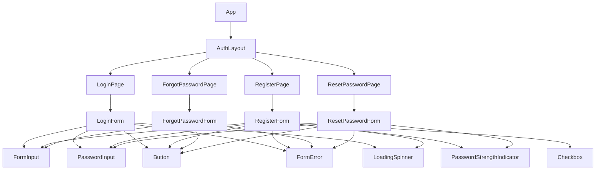

# Frontend Component Specification - SUMA Finance User Registration & Authentication

## 1. Component Architecture Overview

### Component Hierarchy


### Component Composition Patterns
- **Container/Presentational Pattern**: Page components (containers) manage state and logic, form components (presentational) handle rendering
- **Compound Components**: Form components composed of atomic input components
- **Higher-Order Components**: `withAuth` HOC for protected routes
- **Render Props**: Form validation and error handling

### Reusability Strategy
- Atomic design principles: Atoms (inputs, buttons) → Molecules (form fields) → Organisms (forms) → Templates (auth layouts) → Pages
- Shared form components across all authentication flows
- Common validation hooks and utilities
- Centralized theme and styling system

### Component Library Organization
```
src/
├── components/
│   ├── atoms/
│   │   ├── Button/
│   │   ├── Input/
│   │   ├── Checkbox/
│   │   └── LoadingSpinner/
│   ├── molecules/
│   │   ├── FormInput/
│   │   ├── PasswordInput/
│   │   ├── PasswordStrengthIndicator/
│   │   └── FormError/
│   ├── organisms/
│   │   ├── LoginForm/
│   │   ├── RegisterForm/
│   │   ├── ForgotPasswordForm/
│   │   └── ResetPasswordForm/
│   └── templates/
│       └── AuthLayout/
├── pages/
│   ├── LoginPage/
│   ├── RegisterPage/
│   ├── ForgotPasswordPage/
│   └── ResetPasswordPage/
└── hooks/
    ├── useAuth.ts
    ├── useForm.ts
    └── useValidation.ts
```

---

## 2. Core Components

### AuthLayout Template

**Purpose**: Wrapper template for all authentication pages providing consistent layout and branding

**Props Interface**:
```typescript
interface AuthLayoutProps {
  children: React.ReactNode;
  title?: string;
  subtitle?: string;
  showLogo?: boolean;
  backgroundVariant?: 'default' | 'gradient' | 'pattern';
}
```

**State Management**:
- No local state (purely presentational)

**Slots/Children**:
- `children`: Main form content area

**Layout Structure**:
```
┌────────────────────────────────────┐
│          [Logo]                    │
│                                    │
│    ┌──────────────────────┐       │
│    │                      │       │
│    │   [Title]            │       │
│    │   [Subtitle]         │       │
│    │                      │       │
│    │   {children}         │       │
│    │                      │       │
│    └──────────────────────┘       │
│                                    │
│    Terms • Privacy • Support       │
└────────────────────────────────────┘
```

---

### LoginPage

**Purpose**: Container component for user login functionality

**Props Interface**:
```typescript
interface LoginPageProps {
  redirectTo?: string;
  onSuccess?: (user: User) => void;
}
```

**State Management**:
- Managed by `useAuth` hook
- Navigation state for redirects

**Events**:
- `onLoginSuccess`: Emitted after successful authentication
- `onLoginError`: Emitted on authentication failure

---

### RegisterPage

**Purpose**: Container component for new user registration

**Props Interface**:
```typescript
interface RegisterPageProps {
  redirectTo?: string;
  onSuccess?: (user: User) => void;
  requireEmailVerification?: boolean;
}
```

**State Management**:
- Registration state managed by `useAuth` hook
- Multi-step form state if needed

**Events**:
- `onRegisterSuccess`: Emitted after successful registration
- `onRegisterError`: Emitted on registration failure

---

## 3. Layout Components

### Responsive Breakpoints
```typescript
const breakpoints = {
  mobile: '320px',
  tablet: '768px',
  desktop: '1024px',
  wide: '1440px'
};
```

### AuthLayout Grid System
- **Mobile**: Single column, full-width form (max-width: 400px)
- **Tablet**: Centered card with side padding
- **Desktop**: Split layout option (form left, branding right)

### Navigation Components
- **AuthNavigation**: Simple header with logo and language selector
- **AuthFooter**: Links to terms, privacy, support

---

## 4. Form Components

### LoginForm

**Purpose**: Complete login form with email/password authentication

**Props Interface**:
```typescript
interface LoginFormProps {
  onSubmit: (credentials: LoginCredentials) => Promise<void>;
  onForgotPassword?: () => void;
  onRegister?: () => void;
  isLoading?: boolean;
  error?: string;
  showSocialLogin?: boolean;
  rememberMeDefault?: boolean;
}

interface LoginCredentials {
  email: string;
  password: string;
  rememberMe: boolean;
}
```

**State Management**:
```typescript
const [formData, setFormData] = useState<LoginCredentials>({
  email: '',
  password: '',
  rememberMe: false
});
const [errors, setErrors] = useState<Record<string, string>>({});
const [touched, setTouched] = useState<Record<string, boolean>>({});
```

**Validation Rules**:
- Email: Required, valid email format
- Password: Required, minimum 8 characters

**Events**:
- `onSubmit(credentials)`: Form submission with validated credentials
- `onForgotPassword()`: Navigate to forgot password flow
- `onRegister()`: Navigate to registration flow

---

### RegisterForm

**Purpose**: Multi-step registration form with email verification

**Props Interface**:
```typescript
interface RegisterFormProps {
  onSubmit: (userData: RegistrationData) => Promise<void>;
  onLogin?: () => void;
  isLoading?: boolean;
  error?: string;
  requireTermsAcceptance?: boolean;
  requireEmailVerification?: boolean;
  passwordRequirements?: PasswordRequirements;
}

interface RegistrationData {
  email: string;
  password: string;
  confirmPassword: string;
  firstName: string;
  lastName: string;
  acceptTerms: boolean;
  marketingConsent?: boolean;
}

interface PasswordRequirements {
  minLength: number;
  requireUppercase: boolean;
  requireLowercase: boolean;
  requireNumbers: boolean;
  requireSpecialChars: boolean;
}
```

**State Management**:
```typescript
const [formData, setFormData] = useState<RegistrationData>({
  email: '',
  password: '',
  confirmPassword: '',
  firstName: '',
  lastName: '',
  acceptTerms: false,
  marketingConsent: false
});
const [errors, setErrors] = useState<Record<string, string>>({});
const [passwordStrength, setPasswordStrength] = useState<PasswordStrength>(null);
const [currentStep, setCurrentStep] = useState(1);
```

**Validation Rules**:
- Email: Required, valid format, uniqueness check (async)
- Password: Required, strength requirements (min 8 chars, uppercase, lowercase, number, special char)
- Confirm Password: Required, must match password
- First Name: Required, 2-50 characters, alphabetic
- Last Name: Required, 2-50 characters, alphabetic
- Accept Terms: Required (must be true)

**Multi-Step Flow**:
```
Step 1: Basic Info (email, password, confirm password)
Step 2: Personal Details (first name, last name)
Step 3: Terms & Consent (accept terms, marketing consent)
```

**Events**:
- `onSubmit(userData)`: Final form submission
- `onLogin()`: Navigate to login page
- `onStepChange(step)`: Step navigation

---

### ForgotPasswordForm

**Purpose**: Request password reset email

**Props Interface**:
```typescript
interface ForgotPasswordFormProps {
  onSubmit: (email: string) => Promise<void>;
  onBack?: () => void;
  isLoading?: boolean;
  error?: string;
  successMessage?: string;
}
```

**State Management**:
```typescript
const [email, setEmail] = useState('');
const [submitted, setSubmitted] = useState(false);
```

**Validation Rules**:
- Email: Required, valid format

---

### ResetPasswordForm

**Purpose**: Reset password using token from email

**Props Interface**:
```typescript
interface ResetPasswordFormProps {
  token: string;
  onSubmit: (password: string) => Promise<void>;
  onSuccess?: () => void;
  isLoading?: boolean;
  error?: string;
  passwordRequirements?: PasswordRequirements;
}
```

**State Management**:
```typescript
const [password, setPassword] = useState('');
const [confirmPassword, setConfirmPassword] = useState('');
const [passwordStrength, setPasswordStrength] = useState<PasswordStrength>(null);
```

**Validation Rules**:
- Password: Required, strength requirements
- Confirm Password: Required, must match password

---

## 5. Data Display Components

### UserProfileCard

**Purpose**: Display authenticated user information

**Props Interface**:
```typescript
interface UserProfileCardProps {
  user: User;
  onLogout?: () => void;
  showEmail?: boolean;
  showAvatar?: boolean;
  variant?: 'compact' | 'expanded';
}
```

---

### AuthStatusIndicator

**Purpose**: Visual indicator of authentication state

**Props Interface**:
```typescript
interface AuthStatusIndicatorProps {
  isAuthenticated: boolean;
  isLoading: boolean;
  user?: User;
  showDetails?: boolean;
}
```

---

## 6. Interactive Components

### FormInput (Molecule)

**Purpose**: Reusable form input with label, error display, and validation

**Props Interface**:
```typescript
interface FormInputProps {
  id: string;
  name: string;
  type?: 'text' | 'email' | 'tel' | 'number';
  label: string;
  value: string;
  onChange: (value: string) => void;
  onBlur?: () => void;
  error?: string;
  required?: boolean;
  disabled?: boolean;
  placeholder?: string;
  autoComplete?: string;
  maxLength?: number;
  helpText?: string;
  icon?: React.ReactNode;
}
```

**State Management**:
```typescript
const [isFocused, setIsFocused] = useState(false);
const [hasInteracted, setHasInteracted] = useState(false);
```

**Accessibility**:
- `aria-required` for required fields
- `aria-invalid` when error exists
- `aria-describedby` linking to error/help text
- Proper label association with `htmlFor`

---

### PasswordInput (Molecule)

**Purpose**: Password input with show/hide toggle and strength indicator integration

**Props Interface**:
```typescript
interface PasswordInputProps {
  id: string;
  name: string;
  label: string;
  value: string;
  onChange: (value: string) => void;
  onBlur?: () => void;
  error?: string;
  required?: boolean;
  disabled?: boolean;
  placeholder?: string;
  autoComplete?: 'current-password' | 'new-password';
  showStrengthIndicator?: boolean;
  showToggle?: boolean;
}
```

**State Management**:
```typescript
const [isVisible, setIsVisible] = useState(false);
const [strength, setStrength] = useState<PasswordStrength>(null);
```

**Features**:
- Toggle visibility button with eye icon
- Password strength calculation on change
- Caps lock warning indicator

---

### PasswordStrengthIndicator (Molecule)

**Purpose**: Visual feedback for password strength

**Props Interface**:
```typescript
interface PasswordStrengthIndicatorProps {
  password: string;
  requirements?: PasswordRequirements;
  showRequirements?: boolean;
}

type PasswordStrength = 'weak' | 'fair' | 'good' | 'strong';

interface PasswordStrengthResult {
  strength: PasswordStrength;
  score: number; // 0-100
  checks: {
    minLength: boolean;
    hasUppercase: boolean;
    hasLowercase: boolean;
    hasNumbers: boolean;
    hasSpecialChars: boolean;
  };
}
```

**Visual Design**:
```
Password strength: ████████░░ Strong

Requirements:
✓ At least 8 characters
✓ Contains uppercase letter
✓ Contains lowercase letter
✓ Contains number
✗ Contains special character
```

**Colors**:
- Weak: Red (#EF4444)
- Fair: Orange (#F59E0B)
- Good: Yellow (#EAB308)
- Strong: Green (#10B981)

---

### Checkbox (Atom)

**Purpose**: Custom styled checkbox for forms

**Props Interface**:
```typescript
interface CheckboxProps {
  id: string;
  name: string;
  checked: boolean;
  onChange: (checked: boolean) => void;
  label?: React.ReactNode;
  required?: boolean;
  disabled?: boolean;
  error?: string;
}
```

**Accessibility**:
- Keyboard accessible (spacebar to toggle)
- Focus visible styles
- `aria-checked` state
- `aria-required` for required checkboxes

---

### Button (Atom)

**Purpose**: Primary action button with loading states

**Props Interface**:
```typescript
interface ButtonProps {
  children: React.ReactNode;
  onClick?: () => void;
  type?: 'button' | 'submit' | 'reset';
  variant?: 'primary' | 'secondary' | 'outline' | 'ghost' | 'danger';
  size?: 'small' | 'medium' | 'large';
  isLoading?: boolean;
  disabled?: boolean;
  fullWidth?: boolean;
  icon?: React.ReactNode;
  iconPosition?: 'left' | 'right';
  ariaLabel?: string;
}
```

**States**:
- Default
- Hover
- Active
- Focused
- Disabled
- Loading (with spinner)

---

### LoadingSpinner (Atom)

**Purpose**: Animated loading indicator

**Props Interface**:
```typescript
interface LoadingSpinnerProps {
  size?: 'small' | 'medium' | 'large';
  color?: string;
  label?: string;
}
```

**Accessibility**:
- `role="status"`
- `aria-live="polite"`
- `aria-label` or `aria-labelledby`

---

### FormError (Atom)

**Purpose**: Styled error message display

**Props Interface**:
```typescript
interface FormErrorProps {
  error?: string;
  id?: string;
  visible?: boolean;
}
```

**Accessibility**:
- `role="alert"`
- `aria-live="assertive"`

---

### Toast Notification

**Purpose**: Temporary success/error notifications

**Props Interface**:
```typescript
interface ToastProps {
  message: string;
  type: 'success' | 'error' | 'warning' | 'info';
  duration?: number; // milliseconds
  onClose?: () => void;
  action?: {
    label: string;
    onClick: () => void;
  };
}
```

**Position**: Top-right corner, stacked if multiple

**Auto-dismiss**: Default 5000ms

---

### Modal (OAuth/Social Login)

**Purpose**: Modal dialog for third-party authentication

**Props Interface**:
```typescript
interface AuthModalProps {
  isOpen: boolean;
  onClose: () => void;
  providers: ('google' | 'apple' | 'facebook')[];
  onProviderSelect: (provider: string) => void;
}
```

**Accessibility**:
- Focus trap
- `role="dialog"`
- `aria-modal="true"`
- ESC key to close
- Focus returns to trigger on close

---

## 7. Component Styling

### CSS-in-JS Approach
**Framework**: Styled-components or Emotion

**Rationale**:
- Scoped styles prevent conflicts
- Dynamic theming support
- TypeScript integration
- Co-location with components

**Alternative**: CSS Modules (if preferred)

### Design Tokens
```typescript
const tokens = {
  colors: {
    primary: '#3B82F6',
    primaryHover: '#2563EB',
    primaryActive: '#1D4ED8',
    secondary: '#64748B',
    danger: '#EF4444',
    success: '#10B981',
    warning: '#F59E0B',
    
    text: {
      primary: '#1F2937',
      secondary: '#6B7280',
      disabled: '#9CA3AF',
      inverse: '#FFFFFF'
    },
    
    background: {
      primary: '#FFFFFF',
      secondary: '#F9FAFB',
      tertiary: '#F3F4F6'
    },
    
    border: {
      default: '#E5E7EB',
      focus: '#3B82F6',
      error: '#EF4444'
    }
  },
  
  typography: {
    fontFamily: "'Inter', -apple-system, BlinkMacSystemFont, 'Segoe UI', sans-serif",
    fontSize: {
      xs: '0.75rem',    // 12px
      sm: '0.875rem',   // 14px
      base: '1rem',     // 16px
      lg: '1.125rem',   // 18px
      xl: '1.25rem',    // 20px
      '2xl': '1.5rem',  // 24px
      '3xl': '1.875rem' // 30px
    },
    fontWeight: {
      normal: 400,
      medium: 500,
      semibold: 600,
      bold: 700
    },
    lineHeight: {
      tight: 1.25,
      normal: 1.5,
      relaxed: 1.75
    }
  },
  
  spacing: {
    xs: '0.25rem',  // 4px
    sm: '0.5rem',   // 8px
    md: '1rem',     // 16px
    lg: '1.5rem',   // 24px
    xl: '2rem',     // 32px
    '2xl': '3rem'   // 48px
  },
  
  borderRadius: {
    sm: '0.25rem',  // 4px
    md: '0.375rem', // 6px
    lg: '0.5rem',   // 8px
    full: '9999px'
  },
  
  shadows: {
    sm: '0 1px 2px 0 rgba(0, 0, 0, 0.05)',
    md: '0 4px 6px -1px rgba(0, 0, 0, 0.1)',
    lg: '0 10px 15px -3px rgba(0, 0, 0, 0.1)',
    focus: '0 0 0 3px rgba(59, 130, 246, 0.3)'
  },
  
  transitions: {
    fast: '150ms cubic-bezier(0.4, 0, 0.2, 1)',
    base: '200ms cubic-bezier(0.4, 0, 0.2, 1)',
    slow: '300ms cubic-bezier(0.4, 0, 0.2, 1)'
  }
};
```

### Responsive Breakpoints
```typescript
const breakpoints = {
  mobile: '320px',
  mobileLarge: '480px',
  tablet: '768px',
  desktop: '1024px',
  desktopLarge: '1280px',
  wide: '1440px'
};

// Media query helpers
const media = {
  mobile: `@media (min-width: ${breakpoints.mobile})`,
  tablet: `@media (min-width: ${breakpoints.tablet})`,
  desktop: `@media (min-width: ${breakpoints.desktop})`,
  wide: `@media (min-width: ${breakpoints.wide})`
};
```

### Accessibility Requirements

**Color Contrast**:
- Text: Minimum 4.5:1 ratio (WCAG AA)
- Large text (18px+): Minimum 3:1 ratio
- Interactive elements: Minimum 3:1 ratio

**Focus States**:
- Visible focus ring on all interactive elements
- `outline` or `box-shadow` with 3px minimum thickness
- High contrast color (primary blue)

**ARIA Attributes**:
- All form inputs have associated labels
- Error messages linked with `aria-describedby`
- Required fields marked with `aria-required`
- Invalid fields marked with `aria-invalid`
- Loading states with `aria-busy`
- Buttons with `aria-label` when no visible text

**Keyboard Navigation**:
- All interactive elements accessible via Tab
- Logical tab order
- Enter/Space to activate buttons
- ESC to close modals
- Arrow keys for custom controls

**Screen Reader Support**:
- Semantic HTML elements (`<button>`, `<input>`, `<label>`)
- `role` attributes where semantic HTML insufficient
- Live regions for dynamic content (`aria-live`)
- Hidden decorative content (`aria-hidden`)

---

## 8. Component Testing Strategy

### Unit Tests (Jest + React Testing Library)

**FormInput Component**:
```typescript
describe('FormInput', () => {
  it('renders label and input correctly', () => {});
  it('displays error message when error prop provided', () => {});
  it('calls onChange when input value changes', () => {});
  it('shows required indicator when required prop is true', () => {});
  it('disables input when disabled prop is true', () => {});
  it('associates label with input via htmlFor', () => {});
  it('applies aria-invalid when error exists', () => {});
});
```

**PasswordInput Component**:
```typescript
describe('PasswordInput', () => {
  it('toggles password visibility when toggle button clicked', () => {});
  it('shows strength indicator when showStrengthIndicator is true', () => {});
  it('calculates password strength correctly', () => {});
  it('displays caps lock warning when appropriate', () => {});
});
```

**LoginForm Component**:
```typescript
describe('LoginForm', () => {
  it('renders all form fields', () => {});
  it('validates email format on blur', () => {});
  it('prevents submission with invalid data', () => {});
  it('calls onSubmit with correct credentials', () => {});
  it('displays server error when provided', () => {});
  it('shows loading state during submission', () => {});
  it('disables form during submission', () => {});
});
```

**RegisterForm Component**:
```typescript
describe('RegisterForm', () => {
  it('validates password strength requirements', () => {});
  it('validates password confirmation match', () => {});
  it('requires terms acceptance before submission', () => {});
  it('advances through multi-step flow correctly', () => {});
  it('validates email uniqueness asynchronously', () => {});
  it('calls onSubmit with complete registration data', () => {});
});
```

### Integration Tests

**Authentication Flow**:
```typescript
describe('Login Flow', () => {
  it('successfully logs in with valid credentials', async () => {
    // Render LoginPage
    // Fill in email and password
    // Submit form
    // Verify redirect to dashboard
    // Verify auth token stored
  });
  
  it('displays error for invalid credentials', async () => {});
  it('navigates to forgot password flow', async () => {});
  it('navigates to registration flow', async () => {});
});

describe('Registration Flow', () => {
  it('successfully registers new user', async () => {
    // Render RegisterPage
    // Complete all steps
    // Submit form
    // Verify success message
    // Verify redirect to email verification
  });
  
  it('validates unique email during registration', async () => {});
  it('shows password strength feedback in real-time', async () => {});
});
```

### Snapshot Tests

**Visual Regression**:
- Snapshot all form components in default state
- Snapshot all form components with errors
- Snapshot loading states
- Snapshot disabled states
- Snapshot focus states (via CSS classes)

**Example**:
```typescript
describe('LoginForm Snapshots', () => {
  it('matches snapshot in default state', () => {
    const { container } = render(<LoginForm onSubmit={jest.fn()} />);
    expect(container).toMatchSnapshot();
  });
  
  it('matches snapshot with errors', () => {
    const { container } = render(
      <LoginForm onSubmit={jest.fn()} error="Invalid credentials" />
    );
    expect(container).toMatchSnapshot();
  });
});
```

### Accessibility Tests (jest-axe)

**Automated a11y Checks**:
```typescript
import { axe, toHaveNoViolations } from 'jest-axe';

expect.extend(toHaveNoViolations);

describe('LoginForm Accessibility', () => {
  it('has no accessibility violations', async () => {
    const { container } = render(<LoginForm onSubmit={jest.fn()} />);
    const results = await axe(container);
    expect(results).toHaveNoViolations();
  });
});

describe('RegisterForm Accessibility', () => {
  it('has no accessibility violations', async () => {
    const { container } = render(<RegisterForm onSubmit={jest.fn()} />);
    const results = await axe(container);
    expect(results).toHaveNoViolations();
  });
});
```

**Manual a11y Tests**:
- Keyboard navigation through entire form
- Screen reader testing (NVDA, JAWS, VoiceOver)
- Color contrast verification
- Focus management in modals
- Error announcement verification

### E2E Tests (Playwright/Cypress)

**Critical User Journeys**:
```typescript
describe('User Registration E2E', () => {
  it('completes full registration flow', async () => {
    // Navigate to registration page
    // Fill in all required fields
    // Submit form
    // Verify email sent
    // Click verification link in email
    // Verify account activated
    // Verify auto-login
  });
});

describe('User Login E2E', () => {
  it('logs in and accesses protected route', async () => {
    // Navigate to login page
    // Enter credentials
    // Submit form
    // Verify redirect to dashboard
    // Verify protected content visible
  });
});

describe('Password Reset E2E', () => {
  it('resets password via email flow', async () => {
    // Navigate to forgot password
    // Enter email
    // Submit form
    // Check email for reset link
    // Click reset link
    // Enter new password
    // Submit form
    // Verify login with new password
  });
});
```

### Test Coverage Goals
- **Unit Tests**: 90% coverage minimum
- **Integration Tests**: All critical authentication flows
- **E2E Tests**: Happy paths and major error scenarios
- **Accessibility Tests**: 100% of interactive components

### Testing Best Practices
- Use data-testid attributes for reliable selectors
- Test user behavior, not implementation details
- Mock API calls consistently
- Test error states and edge cases
- Verify accessibility in all tests
- Use realistic test data
- Clean up after each test (unmount, clear mocks)