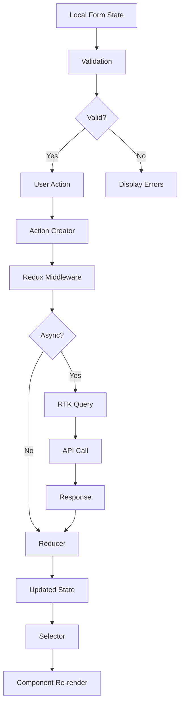

Claude configuration file at C:\Users\ricma\.claude.json is corrupted: Unexpected end of JSON input

Claude configuration file at C:\Users\ricma\.claude.json is corrupted
The corrupted file has been backed up to: C:\Users\ricma\.claude.json.corrupted.1762037208693
A backup file exists at: C:\Users\ricma\.claude.json.backup
You can manually restore it by running: cp "C:\Users\ricma\.claude.json.backup" "C:\Users\ricma\.claude.json"

# Frontend State Management Document

## Project: SUMA Finance
## Feature: User Registration & Authentication

---

## 1. State Architecture Overview

### State Management Approach
**Selected Solution**: Redux Toolkit (RTK) + RTK Query

**Rationale**:
- Predictable state management with time-travel debugging
- Built-in async handling with RTK Query
- Excellent TypeScript support
- Strong devtools for authentication flows
- Industry standard for finance applications requiring audit trails

### Global vs Local State Strategy

**Global State** (Redux):
- User authentication status
- User profile data
- Authentication tokens
- Session management
- Registration form progress (multi-step)
- Error states for auth operations

**Local State** (React useState/useReducer):
- Form field values (before submission)
- UI states (password visibility, dropdown menus)
- Validation errors (real-time)
- Modal open/close states
- Input focus states

### State Normalization Pattern
```
entities/
  users/
    byId: { [userId]: User }
    allIds: string[]
auth/
  currentUser: string | null
  accessToken: string | null
  refreshToken: string | null
  isAuthenticated: boolean
  authStatus: 'idle' | 'loading' | 'succeeded' | 'failed'
registration/
  currentStep: number
  formData: Partial<RegistrationData>
  status: 'idle' | 'submitting' | 'succeeded' | 'failed'
```

### Data Flow Diagram



---

## 2. Global State Structure

### Store Schema

```typescript
interface RootState {
  auth: AuthState;
  users: UsersState;
  registration: RegistrationState;
  session: SessionState;
}

interface AuthState {
  currentUserId: string | null;
  accessToken: string | null;
  refreshToken: string | null;
  tokenExpiry: number | null;
  isAuthenticated: boolean;
  authStatus: 'idle' | 'loading' | 'succeeded' | 'failed';
  loginError: string | null;
  mfaRequired: boolean;
  mfaToken: string | null;
}

interface UsersState {
  byId: Record<string, User>;
  allIds: string[];
}

interface User {
  id: string;
  email: string;
  firstName: string;
  lastName: string;
  phoneNumber?: string;
  emailVerified: boolean;
  phoneVerified: boolean;
  mfaEnabled: boolean;
  createdAt: string;
  lastLoginAt?: string;
  profileComplete: boolean;
}

interface RegistrationState {
  currentStep: number;
  totalSteps: number;
  formData: Partial<RegistrationFormData>;
  status: 'idle' | 'submitting' | 'succeeded' | 'failed';
  error: string | null;
  validationErrors: Record<string, string>;
}

interface RegistrationFormData {
  email: string;
  password: string;
  firstName: string;
  lastName: string;
  phoneNumber: string;
  acceptedTerms: boolean;
  marketingConsent: boolean;
  verificationCode: string;
}

interface SessionState {
  sessionId: string | null;
  lastActivity: number;
  sessionTimeout: number;
  warningShown: boolean;
}
```

### Initial State

```typescript
const initialAuthState: AuthState = {
  currentUserId: null,
  accessToken: null,
  refreshToken: null,
  tokenExpiry: null,
  isAuthenticated: false,
  authStatus: 'idle',
  loginError: null,
  mfaRequired: false,
  mfaToken: null,
};

const initialUsersState: UsersState = {
  byId: {},
  allIds: [],
};

const initialRegistrationState: RegistrationState = {
  currentStep: 0,
  totalSteps: 4,
  formData: {},
  status: 'idle',
  error: null,
  validationErrors: {},
};

const initialSessionState: SessionState = {
  sessionId: null,
  lastActivity: Date.now(),
  sessionTimeout: 30 * 60 * 1000, // 30 minutes
  warningShown: false,
};
```

### State Persistence

```typescript
// Persist to localStorage
const persistConfig = {
  key: 'suma-finance-auth',
  storage: localStorage,
  whitelist: ['auth', 'session'],
  blacklist: ['registration'], // Don't persist registration progress
  transforms: [
    // Encrypt sensitive data before persisting
    encryptTransform({
      secretKey: process.env.REACT_APP_STORAGE_KEY,
      onError: (error) => {
        console.error('Encryption error:', error);
      },
    }),
  ],
};

// Session storage for temporary data
const sessionPersistConfig = {
  key: 'suma-finance-session',
  storage: sessionStorage,
  whitelist: ['registration'],
};
```

---

## 3. Actions & Mutations

### Action Types

```typescript
// Auth Action Types
const AUTH_ACTION_TYPES = {
  LOGIN_REQUEST: 'auth/loginRequest',
  LOGIN_SUCCESS: 'auth/loginSuccess',
  LOGIN_FAILURE: 'auth/loginFailure',
  LOGOUT: 'auth/logout',
  REFRESH_TOKEN_REQUEST: 'auth/refreshTokenRequest',
  REFRESH_TOKEN_SUCCESS: 'auth/refreshTokenSuccess',
  REFRESH_TOKEN_FAILURE: 'auth/refreshTokenFailure',
  MFA_REQUIRED: 'auth/mfaRequired',
  MFA_VERIFY: 'auth/mfaVerify',
  SESSION_EXPIRED: 'auth/sessionExpired',
} as const;

// Registration Action Types
const REGISTRATION_ACTION_TYPES = {
  START_REGISTRATION: 'registration/start',
  UPDATE_FORM_DATA: 'registration/updateFormData',
  NEXT_STEP: 'registration/nextStep',
  PREVIOUS_STEP: 'registration/previousStep',
  SUBMIT_REGISTRATION: 'registration/submit',
  REGISTRATION_SUCCESS: 'registration/success',
  REGISTRATION_FAILURE: 'registration/failure',
  VALIDATE_FIELD: 'registration/validateField',
  RESET_REGISTRATION: 'registration/reset',
} as const;
```

### Action Creators

```typescript
// Auth Actions
export const authActions = {
  loginRequest: (credentials: LoginCredentials) => ({
    type: AUTH_ACTION_TYPES.LOGIN_REQUEST,
    payload: credentials,
  }),
  
  loginSuccess: (user: User, tokens: AuthTokens) => ({
    type: AUTH_ACTION_TYPES.LOGIN_SUCCESS,
    payload: { user, tokens },
  }),
  
  loginFailure: (error: string) => ({
    type: AUTH_ACTION_TYPES.LOGIN_FAILURE,
    payload: error,
  }),
  
  logout: () => ({
    type: AUTH_ACTION_TYPES.LOGOUT,
  }),
  
  mfaRequired: (mfaToken: string) => ({
    type: AUTH_ACTION_TYPES.MFA_REQUIRED,
    payload: mfaToken,
  }),
};

// Registration Actions
export const registrationActions = {
  updateFormData: (data: Partial<RegistrationFormData>) => ({
    type: REGISTRATION_ACTION_TYPES.UPDATE_FORM_DATA,
    payload: data,
  }),
  
  nextStep: () => ({
    type: REGISTRATION_ACTION_TYPES.NEXT_STEP,
  }),
  
  previousStep: () => ({
    type: REGISTRATION_ACTION_TYPES.PREVIOUS_STEP,
  }),
  
  submitRegistration: (data: RegistrationFormData) => ({
    type: REGISTRATION_ACTION_TYPES.SUBMIT_REGISTRATION,
    payload: data,
  }),
  
  validateField: (field: string, value: any) => ({
    type: REGISTRATION_ACTION_TYPES.VALIDATE_FIELD,
    payload: { field, value },
  }),
};
```

### Reducers

```typescript
const authSlice = createSlice({
  name: 'auth',
  initialState: initialAuthState,
  reducers: {
    loginRequest: (state) => {
      state.authStatus = 'loading';
      state.loginError = null;
    },
    loginSuccess: (state, action: PayloadAction<{ user: User; tokens: AuthTokens }>) => {
      state.currentUserId = action.payload.user.id;
      state.accessToken = action.payload.tokens.accessToken;
      state.refreshToken = action.payload.tokens.refreshToken;
      state.tokenExpiry = action.payload.tokens.expiresAt;
      state.isAuthenticated = true;
      state.authStatus = 'succeeded';
      state.loginError = null;
    },
    loginFailure: (state, action: PayloadAction<string>) => {
      state.authStatus = 'failed';
      state.loginError = action.payload;
      state.isAuthenticated = false;
    },
    logout: (state) => {
      return initialAuthState;
    },
    mfaRequired: (state, action: PayloadAction<string>) => {
      state.mfaRequired = true;
      state.mfaToken = action.payload;
      state.authStatus = 'idle';
    },
    sessionExpired: (state) => {
      state.isAuthenticated = false;
      state.accessToken = null;
      state.loginError = 'Session expired. Please login again.';
    },
  },
});

const registrationSlice = createSlice({
  name: 'registration',
  initialState: initialRegistrationState,
  reducers: {
    updateFormData: (state, action: PayloadAction<Partial<RegistrationFormData>>) => {
      state.formData = { ...state.formData, ...action.payload };
    },
    nextStep: (state) => {
      if (state.currentStep < state.totalSteps - 1) {
        state.currentStep += 1;
      }
    },
    previousStep: (state) => {
      if (state.currentStep > 0) {
        state.currentStep -= 1;
      }
    },
    submitRegistration: (state) => {
      state.status = 'submitting';
      state.error = null;
    },
    registrationSuccess: (state) => {
      state.status = 'succeeded';
      state.error = null;
    },
    registrationFailure: (state, action: PayloadAction<string>) => {
      state.status = 'failed';
      state.error = action.payload;
    },
    validateField: (state, action: PayloadAction<{ field: string; value: any }>) => {
      // Validation logic handled in middleware
    },
    resetRegistration: () => initialRegistrationState,
  },
});
```

### Side Effects (Thunks)

```typescript
// Login Thunk
export const loginUser = createAsyncThunk(
  'auth/login',
  async (credentials: LoginCredentials, { rejectWithValue }) => {
    try {
      const response = await authAPI.login(credentials);
      
      // Store tokens securely
      tokenService.setTokens(response.tokens);
      
      return {
        user: response.user,
        tokens: response.tokens,
      };
    } catch (error: any) {
      if (error.code === 'MFA_REQUIRED') {
        return rejectWithValue({ mfaRequired: true, mfaToken: error.mfaToken });
      }
      return rejectWithValue(error.message);
    }
  }
);

// Registration Thunk
export const registerUser = createAsyncThunk(
  'registration/submit',
  async (formData: RegistrationFormData, { rejectWithValue }) => {
    try {
      const response = await authAPI.register(formData);
      return response.user;
    } catch (error: any) {
      if (error.validationErrors) {
        return rejectWithValue({ validationErrors: error.validationErrors });
      }
      return rejectWithValue(error.message);
    }
  }
);

// Token Refresh Thunk
export const refreshAccessToken = createAsyncThunk(
  'auth/refreshToken',
  async (_, { getState, rejectWithValue }) => {
    try {
      const state = getState() as RootState;
      const refreshToken = state.auth.refreshToken;
      
      if (!refreshToken) {
        throw new Error('No refresh token available');
      }
      
      const response = await authAPI.refreshToken(refreshToken);
      tokenService.setTokens(response.tokens);
      
      return response.tokens;
    } catch (error: any) {
      return rejectWithValue(error.message);
    }
  }
);
```

---

## 4. Selectors & Computed Values

### Memoized Selectors

```typescript
// Auth Selectors
export const selectAuth = (state: RootState) => state.auth;
export const selectIsAuthenticated = (state: RootState) => state.auth.isAuthenticated;
export const selectCurrentUserId = (state: RootState) => state.auth.currentUserId;
export const selectAuthStatus = (state: RootState) => state.auth.authStatus;
export const selectLoginError = (state: RootState) => state.auth.loginError;
export const selectMfaRequired = (state: RootState) => state.auth.mfaRequired;

// User Selectors
export const selectCurrentUser = createSelector(
  [selectCurrentUserId, (state: RootState) => state.users.byId],
  (userId, usersById) => (userId ? usersById[userId] : null)
);

export const selectUserFullName = createSelector(
  [selectCurrentUser],
  (user) => (user ? `${user.firstName} ${user.lastName}` : '')
);

export const selectIsEmailVerified = createSelector(
  [selectCurrentUser],
  (user) => user?.emailVerified ?? false
);

export const selectIsProfileComplete = createSelector(
  [selectCurrentUser],
  (user) => user?.profileComplete ?? false
);

// Registration Selectors
export const selectRegistrationStep = (state: RootState) => state.registration.currentStep;
export const selectRegistrationFormData = (state: RootState) => state.registration.formData;
export const selectRegistrationStatus = (state: RootState) => state.registration.status;
export const selectRegistrationError = (state: RootState) => state.registration.error;

export const selectRegistrationProgress = createSelector(
  [selectRegistrationStep, (state: RootState) => state.registration.totalSteps],
  (currentStep, totalSteps) => ((currentStep + 1) / totalSteps) * 100
);

export const selectCanProceedToNextStep = createSelector(
  [selectRegistrationStep, selectRegistrationFormData],
  (step, formData) => {
    switch (step) {
      case 0: // Email & Password
        return Boolean(formData.email && formData.password);
      case 1: // Personal Info
        return Boolean(formData.firstName && formData.lastName);
      case 2: // Phone Verification
        return Boolean(formData.phoneNumber && formData.verificationCode);
      case 3: // Terms & Conditions
        return Boolean(formData.acceptedTerms);
      default:
        return false;
    }
  }
);

// Session Selectors
export const selectIsSessionActive = createSelector(
  [(state: RootState) => state.session.lastActivity, (state: RootState) => state.session.sessionTimeout],
  (lastActivity, timeout) => {
    const now = Date.now();
    return now - lastActivity < timeout;
  }
);

export const selectSessionTimeRemaining = createSelector(
  [(state: RootState) => state.session.lastActivity, (state: RootState) => state.session.sessionTimeout],
  (lastActivity, timeout) => {
    const elapsed = Date.now() - lastActivity;
    return Math.max(0, timeout - elapsed);
  }
);
```

---

## 5. Async Operations

### API Call Patterns with RTK Query

```typescript
// Auth API Definition
export const authApi = createApi({
  reducerPath: 'authApi',
  baseQuery: fetchBaseQuery({
    baseUrl: '/api/v1/auth',
    prepareHeaders: (headers, { getState }) => {
      const token = (getState() as RootState).auth.accessToken;
      if (token) {
        headers.set('Authorization', `Bearer ${token}`);
      }
      return headers;
    },
  }),
  tagTypes: ['User', 'Session'],
  endpoints: (builder) => ({
    login: builder.mutation<AuthResponse, LoginCredentials>({
      query: (credentials) => ({
        url: '/login',
        method: 'POST',
        body: credentials,
      }),
      invalidatesTags: ['User', 'Session'],
    }),
    
    register: builder.mutation<User, RegistrationFormData>({
      query: (formData) => ({
        url: '/register',
        method: 'POST',
        body: formData,
      }),
    }),
    
    verifyEmail: builder.mutation<void, { token: string }>({
      query: ({ token }) => ({
        url: '/verify-email',
        method: 'POST',
        body: { token },
      }),
      invalidatesTags: ['User'],
    }),
    
    getCurrentUser: builder.query<User, void>({
      query: () => '/me',
      providesTags: ['User'],
    }),
    
    logout: builder.mutation<void, void>({
      query: () => ({
        url: '/logout',
        method: 'POST',
      }),
      invalidatesTags: ['User', 'Session'],
    }),
    
    refreshToken: builder.mutation<AuthTokens, string>({
      query: (refreshToken) => ({
        url: '/refresh',
        method: 'POST',
        body: { refreshToken },
      }),
    }),
  }),
});

export const {
  useLoginMutation,
  useRegisterMutation,
  useVerifyEmailMutation,
  useGetCurrentUserQuery,
  useLogoutMutation,
  useRefreshTokenMutation,
} = authApi;
```

### Loading States Management

```typescript
interface AsyncState {
  loading: boolean;
  error: string | null;
  data: any | null;
}

// Loading state pattern in components
function LoginForm() {
  const [login, { isLoading, isError, error }] = useLoginMutation();
  
  return (
    <form onSubmit={handleSubmit}>
      {isError && <ErrorAlert message={error} />}
      <button disabled={isLoading}>
        {isLoading ? 'Logging in...' : 'Login'}
      </button>
    </form>
  );
}
```

### Error Handling Patterns

```typescript
// Error handling middleware
const errorHandlingMiddleware: Middleware = (store) => (next) => (action) => {
  if (action.type.endsWith('/rejected')) {
    const error = action.payload || action.error;
    
    // Handle specific error codes
    if (error.code === 'TOKEN_EXPIRED') {
      store.dispatch(refreshAccessToken());
    } else if (error.code === 'UNAUTHORIZED') {
      store.dispatch(authActions.logout());
    } else if (error.code === 'NETWORK_ERROR') {
      // Show offline notification
      toast.error('Network error. Please check your connection.');
    }
    
    // Log errors
    logger.error('Action failed', {
      action: action.type,
      error: error.message,
    });
  }
  
  return next(action);
};
```

### Optimistic Updates

```typescript
// Optimistic update for profile changes
export const updateProfile = createAsyncThunk(
  'users/updateProfile',
  async (updates: Partial<User>, { dispatch, getState, rejectWithValue }) => {
    const state = getState() as RootState;
    const userId = state.auth.currentUserId;
    
    if (!userId) {
      return rejectWithValue('No user logged in');
    }
    
    // Optimistically update UI
    dispatch(usersActions.updateUserLocally({ id: userId, ...updates }));
    
    try {
      const response = await userAPI.updateProfile(userId, updates);
      return response;
    } catch (error: any) {
      // Revert on failure
      dispatch(usersActions.revertUserUpdate(userId));
      return rejectWithValue(error.message);
    }
  }
);
```

### Request Cancellation

```typescript
// Abort controller for cancellable requests
let abortController: AbortController | null = null;

export const searchUsers = createAsyncThunk(
  'users/search',
  async (query: string, { signal }) => {
    // Cancel previous request
    if (abortController) {
      abortController.abort();
    }
    
    abortController = new AbortController();
    
    try {
      const response = await fetch(`/api/users/search?q=${query}`, {
        signal: abortController.signal,
      });
      return await response.json();
    } catch (error: any) {
      if (error.name === 'AbortError') {
        console.log('Request cancelled');
      }
      throw error;
    }
  }
);
```

### Retry Logic

```typescript
// Retry middleware with exponential backoff
const retryMiddleware: Middleware = (store) => (next) => async (action) => {
  const maxRetries = 3;
  const baseDelay = 1000;
  
  if (action.meta?.retry && action.type.endsWith('/rejected')) {
    const retryCount = action.meta.retryCount || 0;
    
    if (retryCount < maxRetries) {
      const delay = baseDelay * Math.pow(2, retryCount);
      
      await new Promise((resolve) => setTimeout(resolve, delay));
      
      // Retry the action
      const retryAction = {
        ...action.meta.originalAction,
        meta: {
          ...action.meta,
          retryCount: retryCount + 1,
        },
      };
      
      return store.dispatch(retryAction);
    }
  }
  
  return next(action);
};
```

---

## 6. Local Component State

### When to Use Local vs Global State

**Local State**:
- Form inputs before submission
- UI toggles (modals, dropdowns, tooltips)
- Transient validation errors
- Focus/hover states
- Animation states
- Component-specific filters

**Global State**:
- User authentication data
- Submitted form data
- Persistent error messages
- Shared UI state (theme, language)
- Data fetched from API
- Cross-component communication

### Form State Management

```typescript
// Local form state with useReducer
interface FormState {
  values: Record<string, any>;
  errors: Record<string, string>;
  touched: Record<string, boolean>;
  isSubmitting: boolean;
}

type FormAction =
  | { type: 'SET_FIELD'; field: string; value: any }
  | { type: 'SET_ERROR'; field: string; error: string }
  | { type: 'SET_TOUCHED'; field: string }
  | { type: 'SUBMIT_START' }
  | { type: 'SUBMIT_SUCCESS' }
  | { type: 'SUBMIT_FAILURE' }
  | { type: 'RESET' };

function formReducer(state: FormState, action: FormAction): FormState {
  switch (action.type) {
    case 'SET_FIELD':
      return {
        ...state,
        values: { ...state.values, [action.field]: action.value },
      };
    case 'SET_ERROR':
      return {
        ...state,
        errors: { ...state.errors, [action.field]: action.error },
      };
    case 'SET_TOUCHED':
      return {
        ...state,
        touched: { ...state.touched, [action.field]: true },
      };
    case 'SUBMIT_START':
      return { ...state, isSubmitting: true };
    case 'SUBMIT_SUCCESS':
      return { ...state, isSubmitting: false };
    case 'SUBMIT_FAILURE':
      return { ...state, isSubmitting: false };
    case 'RESET':
      return initialFormState;
    default:
      return state;
  }
}

// Usage in component
function LoginForm() {
  const [formState, dispatch] = useReducer(formReducer, initialFormState);
  const [login] = useLoginMutation();
  
  const handleChange = (field: string, value: any) => {
    dispatch({ type: 'SET_FIELD', field, value });
    dispatch({ type: 'SET_TOUCHED', field });
    
    // Real-time validation
    const error = validateField(field, value);
    if (error) {
      dispatch({ type: 'SET_ERROR', field, error });
    }
  };
  
  const handleSubmit = async (e: React.FormEvent) => {
    e.preventDefault();
    dispatch({ type: 'SUBMIT_START' });
    
    try {
      await login(formState.values).unwrap();
      dispatch({ type: 'SUBMIT_SUCCESS' });
    } catch (error) {
      dispatch({ type: 'SUBMIT_FAILURE' });
    }
  };
  
  return <form onSubmit={handleSubmit}>...</form>;
}
```

### UI State Management

```typescript
// Modal state
function RegistrationModal() {
  const [isOpen, setIsOpen] = useState(false);
  const [currentView, setCurrentView] = useState<'form' | 'success'>('form');
  
  return (
    <>
      <button onClick={() => setIsOpen(true)}>Register</button>
      <Modal isOpen={isOpen} onClose={() => setIsOpen(false)}>
        {currentView === 'form' ? (
          <RegistrationForm onSuccess={() => setCurrentView('success')} />
        ) : (
          <SuccessMessage />
        )}
      </Modal>
    </>
  );
}

// Dropdown state
function UserMenu() {
  const [isOpen, setIsOpen] = useState(false);
  const ref = useRef<HTMLDivElement>(null);
  
  // Close on outside click
  useEffect(() => {
    const handleClick = (e: MouseEvent) => {
      if (ref.current && !ref.current.contains(e.target as Node)) {
        setIsOpen(false);
      }
    };
    
    document.addEventListener('mousedown', handleClick);
    return () => document.removeEventListener('mousedown', handleClick);
  }, []);
  
  return (
    <div ref={ref}>
      <button onClick={() => setIsOpen(!isOpen)}>Menu</button>
      {isOpen && <DropdownMenu />}
    </div>
  );
}
```

### Ephemeral State Patterns

```typescript
// Password visibility toggle
function PasswordInput() {
  const [showPassword, setShowPassword] = useState(false);
  
  return (
    <div>
      <input type={showPassword ? 'text' : 'password'} />
      <button onClick={() => setShowPassword(!showPassword)}>
        {showPassword ? 'Hide' : 'Show'}
      </button>
    </div>
  );
}

// Loading state for button
function SubmitButton({ onClick }: { onClick: () => Promise<void> }) {
  const [isLoading, setIsLoading] = useState(false);
  
  const handleClick = async () => {
    setIsLoading(true);
    try {
      await onClick();
    } finally {
      setIsLoading(false);
    }
  };
  
  return (
    <button onClick={handleClick} disabled={isLoading}>
      {isLoading ? 'Processing...' : 'Submit'}
    </button>
  );
}
```

---

## 7. State Synchronization

### Server State vs Client State

**Server State** (source of truth):
- User profile data
- Authentication status
- Account settings
- Transaction history

**Client State** (derived/cached):
- UI preferences
- Form draft data
- Optimistic updates
- Cached API responses

### Real-time Updates

```typescript
// WebSocket integration for real-time auth events
class AuthWebSocketService {
  private ws: WebSocket | null = null;
  private dispatch: AppDispatch;
  
  constructor(dispatch: AppDispatch) {
    this.dispatch = dispatch;
  }
  
  connect(userId: string) {
    this.ws = new WebSocket(`wss://api.suma.finance/ws/auth/${userId}`);
    
    this.ws.onmessage = (event) => {
      const message = JSON.parse(event.data);
      
      switch (message.type) {
        case 'SESSION_EXPIRED':
          this.dispatch(authActions.sessionExpired());
          break;
        case 'PASSWORD_CHANGED':
          this.dispatch(authActions.logout());
          toast.info('Password changed. Please login again.');
          break;
        case 'NEW_LOGIN_DETECTED':
          toast.warning('New login detected from another device.');
          break;
      }
    };
    
    this.ws.onerror = (error) => {
      console.error('WebSocket error:', error);
    };
  }
  
  disconnect() {
    if (this.ws) {
      this.ws.close();
    }
  }
}

// Redux middleware for WebSocket
const webSocketMiddleware: Middleware = (store) => {
  let wsService: AuthWebSocketService | null = null;
  
  return (next) => (action) => {
    if (action.type === AUTH_ACTION_TYPES.LOGIN_SUCCESS) {
      const userId = action.payload.user.id;
      wsService = new AuthWebSocketService(store.dispatch);
      wsService.connect(userId);
    }
    
    if (action.type === AUTH_ACTION_TYPES.LOGOUT) {
      wsService?.disconnect();
    }
    
    return next(action);
  };
};
```

### Cache Invalidation Strategies

```typescript
// RTK Query cache invalidation
const authApi = createApi({
  tagTypes: ['User', 'Session'],
  endpoints: (builder) => ({
    updateProfile: builder.mutation<User, Partial<User>>({
      query: (updates) => ({
        url: '/profile',
        method: 'PATCH',
        body: updates,
      }),
      // Invalidate user cache on update
      invalidatesTags: ['User'],
    }),
    
    changePassword: builder.mutation<void, PasswordChangeData>({
      query: (data) => ({
        url: '/password',
        method: 'POST',
        body: data,
      }),
      // Invalidate session on password change
      invalidatesTags: ['Session'],
    }),
  }),
});

// Time-based cache invalidation
const cacheConfig = {
  // Refetch user data every 5 minutes
  refetchOnMountOrArgChange: 300,
  // Keep unused data for 1 minute
  keepUnusedDataFor: 60,
};
```

### Offline-First Patterns

```typescript
// Offline queue for failed requests
interface QueuedAction {
  id: string;
  action: any;
  timestamp: number;
  retries: number;
}

const offlineQueue: QueuedAction[] = [];

const offlineMiddleware: Middleware = (store) => (next) => (action) => {
  const isOnline = navigator.onLine;
  
  // Queue actions when offline
  if (!isOnline && action.meta?.queueOffline) {
    offlineQueue.push({
      id: generateId(),
      action,
      timestamp: Date.now(),
      retries: 0,
    });
    
    toast.info('Action queued. Will retry when online.');
    return;
  }
  
  return next(action);
};

// Process queue when back online
window.addEventListener('online', () => {
  const store = getStore();
  
  offlineQueue.forEach((item) => {
    store.dispatch(item.action);
  });
  
  offlineQueue.length = 0;
  toast.success('Synced offline changes.');
});
```

---

## 8. State Debugging & DevTools

### Redux DevTools Integration

```typescript
import { configureStore } from '@reduxjs/toolkit';
import { composeWithDevTools } from '@redux-devtools/extension';

const store = configureStore({
  reducer: rootReducer,
  middleware: (getDefaultMiddleware) =>
    getDefaultMiddleware().concat(
      errorHandlingMiddleware,
      webSocketMiddleware,
      offlineMiddleware
    ),
  devTools: process.env.NODE_ENV !== 'production' && {
    name: 'SUMA Finance',
    trace: true,
    traceLimit: 25,
    actionSanitizer: (action) => {
      // Remove sensitive data from DevTools
      if (action.type.includes('login') || action.type.includes('register')) {
        return {
          ...action,
          payload: {
            ...action.payload,
            password: '***REDACTED***',
            accessToken: '***REDACTED***',
          },
        };
      }
      return action;
    },
    stateSanitizer: (state) => {
      // Remove sensitive data from state snapshots
      return {
        ...state,
        auth: {
          ...state.auth,
          accessToken: state.auth.accessToken ? '***REDACTED***' : null,
          refreshToken: state.auth.refreshToken ? '***REDACTED***' : null,
        },
      };
    },
  },
});
```

### Time-Travel Debugging Requirements

```typescript
// Enable action replay for debugging
const actionHistory: any[] = [];

const historyMiddleware: Middleware = () => (next) => (action) => {
  if (process.env.NODE_ENV === 'development') {
    actionHistory.push({
      action,
      timestamp: Date.now(),
    });
    
    // Keep last 100 actions
    if (actionHistory.length > 100) {
      actionHistory.shift();
    }
  }
  
  return next(action);
};

// Debug utility to replay actions
export function replayActions(from: number, to?: number) {
  const actions = actionHistory.slice(from, to);
  actions.forEach((item) => {
    console.log('Replaying:', item.action.type);
    store.dispatch(item.action);
  });
}
```

### State Logging Patterns

```typescript
// Structured logging for state changes
const stateLogger: Middleware = (store) => (next) => (action) => {
  const prevState = store.getState();
  const result = next(action);
  const nextState = store.getState();
  
  if (process.env.NODE_ENV === 'development') {
    console.group(action.type);
    console.log('Action:', action);
    console.log('Previous State:', prevState);
    console.log('Next State:', nextState);
    console.groupEnd();
  }
  
  return result;
};
```

### Performance Monitoring

```typescript
// Performance tracking middleware
const performanceMiddleware: Middleware = () => (next) => (action) => {
  const start = performance.now();
  const result = next(action);
  const duration = performance.now() - start;
  
  if (duration > 16) {
    // Warn if action takes longer than 1 frame (60fps)
    console.warn(`Slow action detected: ${action.type} took ${duration.toFixed(2)}ms`);
  }
  
  // Send to analytics
  if (process.env.NODE_ENV === 'production') {
    analytics.track('redux_action', {
      type: action.type,
      duration,
    });
  }
  
  return result;
};
```

---

## 9. State Migration

### Handling State Shape Changes

```typescript
// State migration system
interface Migration {
  version: number;
  migrate: (state: any) => any;
}

const migrations: Migration[] = [
  {
    version: 1,
    migrate: (state) => {
      // v0 -> v1: Add mfaEnabled field to user
      return {
        ...state,
        users: {
          ...state.users,
          byId: Object.fromEntries(
            Object.entries(state.users.byId).map(([id, user]: [string, any]) => [
              id,
              { ...user, mfaEnabled: false },
            ])
          ),
        },
      };
    },
  },
  {
    version: 2,
    migrate: (state) => {
      // v1 -> v2: Split auth tokens into separate fields
      return {
        ...state,
        auth: {
          ...state.auth,
          accessToken: state.auth.token?.access || null,
          refreshToken: state.auth.token?.refresh || null,
          token: undefined,
        },
      };
    },
  },
  {
    version: 3,
    migrate: (state) => {
      // v2 -> v3: Add session state
      return {
        ...state,
        session: initialSessionState,
      };
    },
  },
];

// Apply migrations
function migrateState(persistedState: any, currentVersion: number): any {
  const stateVersion = persistedState._version || 0;
  
  if (stateVersion === currentVersion) {
    return persistedState;
  }
  
  let migratedState = persistedState;
  
  // Apply each migration in order
  for (const migration of migrations) {
    if (migration.version > stateVersion) {
      console.log(`Migrating state to version ${migration.version}`);
      migratedState = migration.migrate(migratedState);
    }
  }
  
  migratedState._version = currentVersion;
  return migratedState;
}
```

### Backwards Compatibility

```typescript
// Compatibility layer for old state structure
function ensureBackwardsCompatibility(state: any): RootState {
  // Handle old auth structure
  if (state.auth && 'token' in state.auth) {
    return {
      ...state,
      auth: {
        ...state.auth,
        accessToken: state.auth.token?.access || null,
        refreshToken: state.auth.token?.refresh || null,
      },
    };
  }
  
  // Handle old user structure
  if (state.users && Array.isArray(state.users)) {
    return {
      ...state,
      users: {
        byId: Object.fromEntries(state.users.map((user: User) => [user.id, user])),
        allIds: state.users.map((user: User) => user.id),
      },
    };
  }
  
  return state;
}
```

### State Version Management

```typescript
const CURRENT_STATE_VERSION = 3;

// Persist config with versioning
const persistConfig = {
  key: 'suma-finance-auth',
  version: CURRENT_STATE_VERSION,
  storage: localStorage,
  migrate: (state: any) => {
    return migrateState(state, CURRENT_STATE_VERSION);
  },
};

// Store configuration
const store = configureStore({
  reducer: persistReducer(persistConfig, rootReducer),
  middleware: (getDefaultMiddleware) =>
    getDefaultMiddleware({
      serializableCheck: {
        ignoredActions: [FLUSH, REHYDRATE, PAUSE, PERSIST, PURGE, REGISTER],
      },
    }),
});

// Check version on load
const persistor = persistStore(store, null, () => {
  const state = store.getState();
  const version = (state as any)._persist?.version;
  
  if (version !== CURRENT_STATE_VERSION) {
    console.warn(
      `State version mismatch. Expected ${CURRENT_STATE_VERSION}, got ${version}. Migrations applied.`
    );
  }
});
```

---

## Summary

This Frontend State Management document provides a comprehensive architecture for managing authentication and registration state in the SUMA Finance application. Key features include:

- **Redux Toolkit** for predictable state management
- **RTK Query** for efficient API calls and caching
- **Normalized state structure** for scalability
- **Comprehensive async handling** with loading, error, and retry logic
- **Local vs global state separation** for optimal performance
- **Real-time synchronization** via WebSockets
- **Offline-first patterns** for resilience
- **DevTools integration** for debugging
- **State migrations** for backwards compatibility

This architecture ensures maintainable, testable, and performant state management for the authentication flow while maintaining security and user experience.