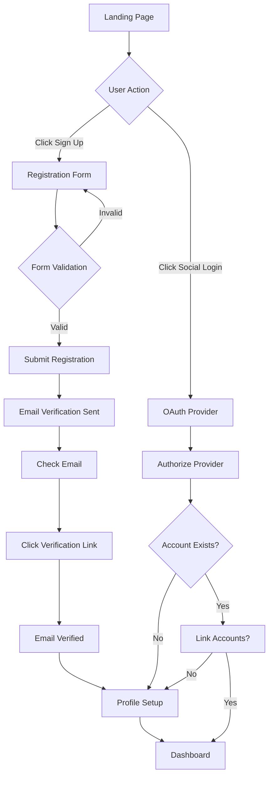
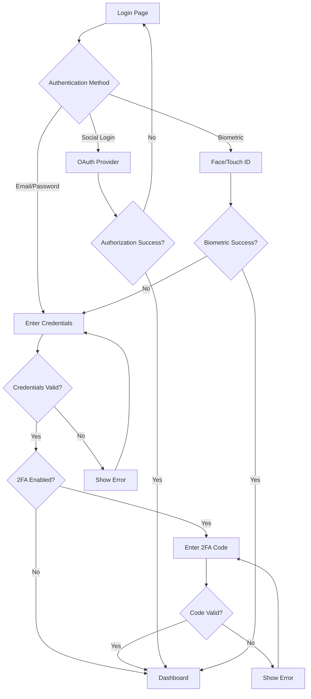
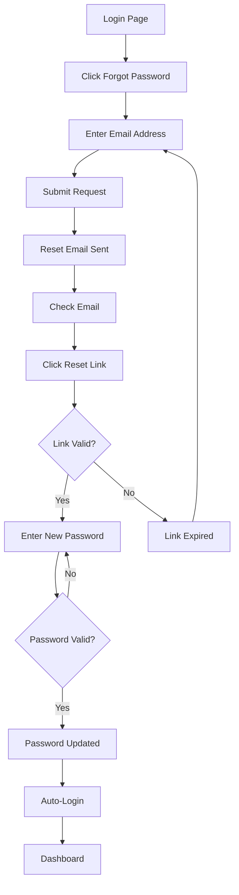

Claude configuration file at C:\Users\ricma\.claude.json is corrupted: Unexpected end of JSON input

Claude configuration file at C:\Users\ricma\.claude.json is corrupted
The corrupted file has been backed up to: C:\Users\ricma\.claude.json.corrupted.1762037208653
A backup file exists at: C:\Users\ricma\.claude.json.backup
You can manually restore it by running: cp "C:\Users\ricma\.claude.json.backup" "C:\Users\ricma\.claude.json"


Claude configuration file at C:\Users\ricma\.claude.json is corrupted: Unexpected end of JSON input

Claude configuration file at C:\Users\ricma\.claude.json is corrupted
The corrupted file has been backed up to: C:\Users\ricma\.claude.json.corrupted.1762037209120
A backup file exists at: C:\Users\ricma\.claude.json.backup
You can manually restore it by running: cp "C:\Users\ricma\.claude.json.backup" "C:\Users\ricma\.claude.json"

# Frontend UI/UX Requirements: User Registration & Authentication

## 1. User Experience Overview

### Target User Personas

**Primary Persona: Financial Organizer Emma**
- Age: 28-45
- Tech-savvy, uses multiple financial apps
- Values security and ease of use
- Wants quick access to financial data
- Uses mobile and desktop equally

**Secondary Persona: Security-Conscious Marcus**
- Age: 35-55
- Concerned about data privacy
- Prefers traditional authentication methods
- Wants clear security indicators
- Primarily desktop user

### User Journey Maps

**First-Time User Journey**
1. Discovers SUMA Finance through marketing/referral
2. Lands on homepage, sees value proposition
3. Clicks "Sign Up" or "Get Started"
4. Completes registration form
5. Verifies email address
6. Sets up profile/preferences
7. Begins using core features

**Returning User Journey**
1. Opens SUMA Finance app/website
2. Enters credentials or uses biometric login
3. Receives 2FA code (if enabled)
4. Accesses dashboard immediately
5. Continues financial management tasks

### Key User Flows

- **Registration Flow**: Sign up → Email verification → Profile setup → Dashboard
- **Login Flow**: Enter credentials → 2FA (optional) → Dashboard
- **Password Reset Flow**: Request reset → Email verification → New password → Login
- **Social Login Flow**: Select provider → Authorize → Profile confirmation → Dashboard

### UX Principles and Guidelines

1. **Security Without Friction**: Balance security with user convenience
2. **Progressive Disclosure**: Only ask for information when needed
3. **Clear Feedback**: Immediate response to all user actions
4. **Error Prevention**: Validate inputs in real-time
5. **Trust Building**: Transparent security practices and privacy policies

## 2. Visual Design System

### Color Palette

| Color Role | Hex Code | Usage |
|------------|----------|-------|
| **Primary** | #0066CC | Primary buttons, links, focus states |
| **Primary Dark** | #004C99 | Button hover states |
| **Primary Light** | #E6F2FF | Background highlights |
| **Secondary** | #6B7280 | Secondary buttons, less emphasis |
| **Success** | #10B981 | Success messages, verified badges |
| **Error** | #EF4444 | Error messages, validation errors |
| **Warning** | #F59E0B | Warning messages, attention needed |
| **Info** | #3B82F6 | Informational messages |
| **Neutral 900** | #111827 | Headings, primary text |
| **Neutral 700** | #374151 | Body text |
| **Neutral 500** | #6B7280 | Secondary text |
| **Neutral 300** | #D1D5DB | Borders, dividers |
| **Neutral 100** | #F3F4F6 | Background, disabled states |
| **White** | #FFFFFF | Cards, form backgrounds |

### Typography

| Element | Font Family | Size | Weight | Line Height |
|---------|-------------|------|--------|-------------|
| **H1** | Inter | 32px | 700 | 40px |
| **H2** | Inter | 24px | 600 | 32px |
| **H3** | Inter | 20px | 600 | 28px |
| **Body Large** | Inter | 16px | 400 | 24px |
| **Body** | Inter | 14px | 400 | 20px |
| **Body Small** | Inter | 12px | 400 | 16px |
| **Button** | Inter | 14px | 500 | 20px |
| **Label** | Inter | 14px | 500 | 20px |
| **Caption** | Inter | 12px | 400 | 16px |

### Spacing System

| Token | Value | Usage |
|-------|-------|-------|
| **xs** | 4px | Icon padding, tight spacing |
| **sm** | 8px | Form field internal padding |
| **md** | 16px | Standard component spacing |
| **lg** | 24px | Section spacing |
| **xl** | 32px | Large section spacing |
| **2xl** | 48px | Page section spacing |
| **3xl** | 64px | Major section dividers |

### Elevation/Shadows

| Level | Box Shadow | Usage |
|-------|------------|-------|
| **Level 1** | 0 1px 3px rgba(0,0,0,0.12) | Cards, form containers |
| **Level 2** | 0 4px 6px rgba(0,0,0,0.1) | Dropdowns, hover states |
| **Level 3** | 0 10px 20px rgba(0,0,0,0.15) | Modals, popovers |
| **Level 4** | 0 20px 40px rgba(0,0,0,0.2) | High-priority overlays |

### Border Radius

| Token | Value | Usage |
|-------|-------|-------|
| **sm** | 4px | Input fields, small buttons |
| **md** | 8px | Cards, standard buttons |
| **lg** | 12px | Large cards, containers |
| **xl** | 16px | Feature cards, hero sections |
| **full** | 9999px | Pills, avatar badges |

### Icons

- **Library**: Heroicons v2 (outline and solid variants)
- **Size Scale**: 16px, 20px, 24px
- **Usage**: Outline for navigation, solid for filled states
- **Color**: Inherit from parent or use neutral-700

## 3. Interaction Patterns

### Navigation Patterns

**Pre-Authentication Navigation**
```
[Logo]                    [Features] [Pricing] [About]    [Log In] [Sign Up CTA]
```

**Post-Authentication Navigation**
```
[Logo] [Dashboard] [Transactions] [Budgets] [Settings]    [Avatar Dropdown]
```

### Form Interaction Patterns

**Input Field States**
1. **Default**: Gray border, placeholder text visible
2. **Focus**: Primary color border (3px), remove placeholder
3. **Filled**: Retain value, label stays above field
4. **Error**: Red border, error message below
5. **Success**: Green checkmark icon, green border
6. **Disabled**: Gray background, reduced opacity

**Real-Time Validation**
- Validate on blur (when user leaves field)
- Show success/error indicators immediately
- Display password strength meter during typing
- Email format validation on blur
- Username availability check with debounce (500ms)

### Modal and Overlay Patterns

**Modal Behavior**
- Overlay dims background (rgba(0,0,0,0.6))
- Modal centered vertically and horizontally
- Close on: X button, Escape key, click outside (optional)
- Focus trap: Tab cycles within modal
- Animate in: Fade + scale from 95% to 100% (200ms)

### Gesture Support (Mobile)

- **Pull to refresh**: Dashboard data refresh
- **Swipe left**: Delete/archive actions (with confirmation)
- **Tap and hold**: Context menu on list items
- **Pinch zoom**: Disabled on forms (prevent accidental zoom)

## 4. User Flows

### Registration Flow



**Registration Flow Details**

**Entry Points**
- Homepage "Get Started" CTA button
- Navigation bar "Sign Up" link
- After clicking "Sign Up" on login page

**Step 1: Registration Form**
- Fields: Email, Username, Password, Confirm Password
- Display password strength meter
- Real-time validation on blur
- Checkbox: "I agree to Terms & Privacy Policy"
- Links to Terms and Privacy (open in new tab)
- Social login options: Google, Apple, Microsoft

**Step 2: Form Submission**
- Loading spinner on submit button
- Disable form during submission
- Display "Creating your account..." message

**Step 3: Email Verification Sent**
- Success message: "Check your email!"
- Display user's email address
- "Resend email" link (disabled for 60s after send)
- "Change email address" link
- Visual: Envelope icon animation

**Step 4: Email Verification**
- User clicks link in email
- Page displays: "Verifying your email..."
- On success: "Email verified! ✓"
- Auto-redirect to profile setup (3s countdown)

**Step 5: Profile Setup**
- Optional: Profile photo upload
- Optional: Display name
- Optional: Notification preferences
- "Skip for now" link
- "Complete Profile" button

**Step 6: Dashboard**
- Welcome message with user's name
- Onboarding checklist/tutorial
- Empty state with helpful actions

**Success Criteria**
- User account created in database
- Email verification completed
- User can log in successfully
- User reaches dashboard

**Error Paths**
- Email already registered → Display error, link to login
- Weak password → Show requirements, prevent submission
- Network error → Retry option, don't lose form data
- Email verification expired → Resend verification option
- OAuth error → Clear message, fallback to email registration

### Login Flow



**Login Flow Details**

**Entry Points**
- Navigation bar "Log In" link
- Homepage "Log In" button
- After session expiration
- Direct URL access to protected route

**Step 1: Login Form**
- Fields: Email/Username, Password
- "Show/Hide Password" toggle
- "Remember me" checkbox
- "Forgot password?" link
- Social login buttons below form divider

**Step 2: Credential Validation**
- Loading state on submit button
- Disable form during submission
- Display generic error for security: "Invalid email or password"

**Step 3: Two-Factor Authentication (if enabled)**
- Display: "Enter your authentication code"
- Show user's masked phone/email: "••••@example.com"
- 6-digit code input (auto-advance on digit entry)
- "Didn't receive code? Resend" link (60s cooldown)
- "Use backup code" link

**Step 4: Dashboard Access**
- Loading screen with skeleton UI
- Fetch user data
- Display personalized dashboard

**Success Criteria**
- User authenticated successfully
- Session token stored securely
- User redirected to dashboard or intended page

**Error Paths**
- Invalid credentials → Show error, don't specify which field
- Account locked (too many attempts) → Show lockout duration
- 2FA code invalid → Show error, allow retry (3 attempts)
- 2FA code expired → Resend option
- Network error → Retry button, maintain form state
- OAuth cancelled → Return to login with info message

### Password Reset Flow



**Password Reset Flow Details**

**Entry Points**
- "Forgot password?" link on login page
- Account lockout message
- Settings → Security → Change Password

**Step 1: Request Reset**
- Field: Email address
- Submit button: "Send Reset Link"
- Back to login link

**Step 2: Confirmation Page**
- Message: "Check your email"
- Display email address
- "Didn't receive? Resend" link (60s cooldown)
- "Try different email" link

**Step 3: Reset Password Page**
- Fields: New Password, Confirm Password
- Password strength meter
- Requirements checklist
- "Reset Password" button

**Step 4: Success Confirmation**
- Message: "Password updated successfully"
- "Continue to login" button (or auto-login)

**Success Criteria**
- Reset token validated
- New password meets requirements
- User can log in with new password

**Error Paths**
- Email not found → Show success anyway (security)
- Reset link expired → Clear message, resend option
- Weak password → Show requirements
- Network error → Retry option

## 5. Responsive Design

### Breakpoints

| Breakpoint | Width | Target Device | Layout Changes |
|------------|-------|---------------|----------------|
| **xs** | 320px | Small mobile | Single column, stacked |
| **sm** | 375px | Standard mobile | Single column, optimized spacing |
| **md** | 768px | Tablet portrait | Two-column where appropriate |
| **lg** | 1024px | Tablet landscape / small laptop | Multi-column layouts |
| **xl** | 1280px | Desktop | Full multi-column, sidebars |
| **2xl** | 1440px+ | Large desktop | Max-width constraints |

### Component Behavior at Breakpoints

**Registration/Login Forms**

**Mobile (320px - 767px)**
- Full-width container with 16px horizontal padding
- Stacked form fields (100% width)
- Full-width buttons
- Social login buttons stacked vertically
- Font sizes: H1 24px, Body 16px

**Tablet (768px - 1023px)**
- Centered card (max-width 480px)
- Form fields retain 100% width within card
- Social login buttons in 2-column grid
- Font sizes: H1 28px, Body 16px

**Desktop (1024px+)**
- Split screen layout option:
  - Left: Branding, testimonials, features (50%)
  - Right: Form card (50%, max-width 480px)
- Alternatively: Centered card (max-width 480px)
- Font sizes: H1 32px, Body 16px

**Navigation Bar**

**Mobile (< 768px)**
- Hamburger menu icon (right side)
- Logo (left side)
- Expandable drawer navigation
- Full-width menu items

**Tablet/Desktop (>= 768px)**
- Horizontal navigation
- Logo (left)
- Menu items (center)
- Auth buttons (right)

### Mobile-First Approach

- Base styles target mobile (320px)
- Progressive enhancement for larger screens
- Touch targets minimum 44x44px
- Avoid hover-only interactions
- Test on actual devices

## 6. Accessibility Requirements (WCAG 2.1)

### Level A Compliance (Minimum)

**1.1.1 Non-text Content**
- All icons have text alternatives
- Decorative images marked with `alt=""`
- Social login icons: ``

**1.3.1 Info and Relationships**
- Semantic HTML: `<form>`, `<label>`, `<input>`
- Form labels explicitly associated: `<label for="email">`
- Error messages linked to fields: `aria-describedby="email-error"`

**2.1.1 Keyboard**
- All interactive elements keyboard accessible
- Tab order follows visual order
- No keyboard traps

**2.4.2 Page Titled**
- Unique page titles: "Sign Up - SUMA Finance", "Log In - SUMA Finance"

**3.3.1 Error Identification**
- Errors identified in text
- Error messages clear and specific

### Level AA Compliance (Target)

**1.4.3 Contrast (Minimum)**
- Text contrast ratio: 4.5:1 minimum
- Large text (18pt+): 3:1 minimum
- Interactive components: 3:1 minimum
- Color palette meets contrast requirements

**1.4.5 Images of Text**
- Use real text instead of images where possible
- Logo is exception

**2.4.7 Focus Visible**
- Clear focus indicators on all interactive elements
- Focus outline: 3px solid primary color
- Outline offset: 2px

**3.3.2 Labels or Instructions**
- All form fields have visible labels
- Required fields marked with asterisk and "(required)"
- Password requirements clearly listed

**3.3.3 Error Suggestion**
- Provide suggestions for fixing errors
- Example: "Email format should be: name@example.com"

**3.3.4 Error Prevention**
- Confirmation for account deletion
- Password confirmation field
- "Review information" step before submission

### Keyboard Navigation

**Tab Order**
1. Skip to main content link (visible on focus)
2. Logo (if linked)
3. Navigation links
4. Form fields (in visual order)
5. Submit button
6. Secondary links (forgot password, sign up)
7. Social login buttons
8. Footer links

**Keyboard Shortcuts**
- `Tab`: Move to next element
- `Shift + Tab`: Move to previous element
- `Enter`: Submit form, activate button
- `Space`: Toggle checkbox, activate button
- `Escape`: Close modal, clear focus (where appropriate)

### Screen Reader Support

**ARIA Labels**
```html
<!-- Form structure -->
<form role="form" aria-labelledby="form-title">
  <h2 id="form-title">Sign Up</h2>
  
  <!-- Text input -->
  <label for="email">Email Address</label>
  <input 
    id="email" 
    type="email" 
    aria-required="true"
    aria-describedby="email-help email-error"
    aria-invalid="false"
  />
  <span id="email-help" class="help-text">We'll never share your email</span>
  <span id="email-error" class="error-text" role="alert"></span>
  
  <!-- Password with strength meter -->
  <label for="password">Password</label>
  <input 
    id="password" 
    type="password"
    aria-required="true"
    aria-describedby="password-strength password-requirements"
  />
  <div id="password-strength" aria-live="polite">
    Password strength: <span id="strength-value">None</span>
  </div>
  <div id="password-requirements">
    <!-- Requirements checklist -->
  </div>
  
  <!-- Submit button -->
  <button type="submit" aria-busy="false">
    <span aria-hidden="true">→</span>
    Create Account
  </button>
</form>

<!-- Social login -->
<button aria-label="Sign up with Google">
  
  <span>Google</span>
</button>

<!-- Loading state -->
<button aria-busy="true" aria-live="polite">
  <span class="spinner" aria-hidden="true"></span>
  Creating account...
</button>
```

**ARIA Live Regions**
- Form validation errors: `role="alert"` or `aria-live="assertive"`
- Success messages: `aria-live="polite"`
- Loading states: `aria-busy="true"`, `aria-live="polite"`
- Password strength updates: `aria-live="polite"`

### Focus Management

**Focus Indicators**
```css
/* Global focus style */
*:focus {
  outline: 3px solid #0066CC;
  outline-offset: 2px;
  border-radius: 4px;
}

/* High contrast mode support */
@media (prefers-contrast: high) {
  *:focus {
    outline-width: 4px;
  }
}
```

**Modal Focus Trap**
- On modal open: Focus moves to modal close button or first input
- Tab cycles within modal only
- On modal close: Focus returns to trigger element

**Skip Links**
```html
<a href="#main-content" class="skip-link">
  Skip to main content
</a>
```

Visible only on keyboard focus, positioned at top of page.

### Color Contrast

**Text Contrast**
- Body text (#374151) on white (#FFFFFF): 10.7:1 ✓
- Primary button (#FFFFFF) on primary (#0066CC): 4.5:1 ✓
- Error text (#EF4444) on white (#FFFFFF): 4.5:1 ✓
- Placeholder text (#6B7280) on white (#FFFFFF): 5.7:1 ✓

**Interactive Elements**
- Primary button: Background contrast 4.5:1 ✓
- Input borders: (#D1D5DB) on white: 3:1 ✓
- Focus indicators: Always primary color (high contrast)

**Color Independence**
- Never use color alone to convey information
- Errors: Red border + icon + text message
- Success: Green checkmark + text message
- Required fields: Asterisk + "(required)" text

## 7. Performance & Optimization

### Perceived Performance Goals

- **Time to Interactive (TTI)**: < 3.5 seconds
- **First Contentful Paint (FCP)**: < 1.5 seconds
- **Largest Contentful Paint (LCP)**: < 2.5 seconds
- **Cumulative Layout Shift (CLS)**: < 0.1
- **First Input Delay (FID)**: < 100ms

### Loading States and Skeletons

**Form Loading (Initial Page Load)**
```
┌─────────────────────────────────┐
│  [────────]  ← Logo skeleton    │
│                                 │
│  [─────────────]  ← H1 skeleton │
│  [──────]  ← Subtitle skeleton  │
│                                 │
│  [─────────────────────]  ← Input │
│  [─────────────────────]  ← Input │
│  [─────────────────────]  ← Input │
│                                 │
│  [──────────]  ← Button skeleton│
└─────────────────────────────────┘
```

**Button Loading States**
```
Default:   [   Sign Up   ]
Loading:   [  ⟳  Signing up...  ]
Success:   [  ✓  Account Created  ]
Error:     [  ✕  Try Again  ]
```

**Input Validation Loading**
```
Email: _________________ [⟳ Checking...]
Email: _________________ [✓ Available]
Email: _________________ [✕ Already registered]
```

### Progressive Enhancement

**Core Experience (No JavaScript)**
- Form submits to server
- Server-side validation
- Full page reload on response

**Enhanced Experience (With JavaScript)**
- Real-time validation
- Async form submission
- Inline error messages
- Smooth transitions
- Password strength meter

**Critical CSS**
- Inline above-the-fold CSS (<14KB)
- Defer non-critical CSS
- Font display: swap

### Image Optimization Strategy

**Avatar Images**
- Format: WebP with JPEG fallback
- Sizes: 40x40, 80x80, 160x160 (1x, 2x, 3x)
- Lazy load: Below the fold avatars
- Compression: 80% quality

**Social Login Icons**
- Format: SVG (vector)
- Inline critical icons (Google, Apple)
- Size: 20x20px
- Color: Inherit or brand colors

**Brand Assets**
- Logo: SVG
- Hero images: WebP with lazy loading
- Background images: CSS with fallback

### Code Splitting Requirements

**Critical Path**
- Authentication bundle: Login, registration, password reset forms
- Shared components: Input, Button, Form validation
- Total size target: <50KB gzipped

**Deferred Loading**
- Dashboard components (post-login)
- Settings pages
- Profile editor
- Admin features

**Lazy Loading**
- OAuth provider SDKs (Google, Apple, Microsoft)
- Password strength meter library
- Biometric authentication modules
- Analytics scripts

## 8. Feedback & Notifications

### Success Messages

**Toast Notifications (Top-Right)**
```
┌──────────────────────────────────┐
│  ✓  Account created successfully  │
│     Welcome to SUMA Finance!      │
└──────────────────────────────────┘
```
- Duration: 4 seconds
- Auto-dismiss with progress bar
- Dismissible via X button
- Color: Success green background

**Inline Success**
```
Email: user@example.com  [✓]
       Email verified
```

**Full-Page Success**
```
        ✓
   Email Verified!
   
Your account is now active.
Redirecting to dashboard in 3...

[Continue to Dashboard]
```

### Error Messages

**Inline Field Errors**
```
Password: ________________
          ✕ Password must be at least 8 characters
```
- Color: Error red text
- Icon: X or alert triangle
- Position: Below field
- Announced to screen readers

**Toast Error Notifications**
```
┌──────────────────────────────────┐
│  ✕  Network Error                 │
│     Please check your connection  │
│     [Retry]                       │
└──────────────────────────────────┘
```
- Duration: 6 seconds (longer than success)
- Manual dismiss required for critical errors
- Color: Error red background

**Modal Errors (Critical)**
```
┌─────────────────────────────────────┐
│  ⚠ Account Locked                   │
│                                     │
│  Too many failed login attempts.    │
│  Your account has been locked for   │
│  security reasons.                  │
│                                     │
│  Please try again in 15 minutes or  │
│  reset your password.               │
│                                     │
│  [Reset Password]  [Close]          │
└─────────────────────────────────────┘
```

### Warning Messages

**Inline Warnings**
```
Username: john.doe
          ⚠ Username cannot be changed later
```

**Banner Warnings**
```
┌──────────────────────────────────────────────┐
│  ⚠  Email Not Verified                        │
│     Please check your inbox and verify your   │
│     email address. [Resend Email]             │
└──────────────────────────────────────────────┘
```
- Color: Warning amber background
- Position: Top of page
- Persistent until resolved

### Info Messages

**Inline Info**
```
Password: ________________
          ℹ Must be at least 8 characters
```

**Tooltip Info**
```
Two-Factor Authentication [ℹ]

Hover/Focus shows:
┌─────────────────────────────────┐
│ Adds an extra layer of security │
│ by requiring a code from your   │
│ phone when logging in.          │
└─────────────────────────────────┘
```

### Loading Indicators

**Button Loading**
- Spinner icon (16px) replaces arrow
- Button text changes: "Sign Up" → "Signing up..."
- Button disabled state
- Animation: Rotating spinner (1s linear infinite)

**Full-Page Loading**
```
        ⟳
   Loading...
```
- Centered spinner (48px)
- Text below spinner
- Backdrop blur on existing content

**Skeleton Screens**
- Use for initial page loads
- Pulse animation (1.5s ease-in-out infinite)
- Match layout of actual content

### Progress Bars

**Multi-Step Registration**
```
Step 1 of 3: Create Account

[████████░░░░░░░░] 33%
```

**File Upload (Profile Photo)**
```
Uploading profile photo...
[██████████████░░] 85%
```
- Color: Primary blue fill
- Height: 4px
- Rounded ends
- Smooth animation

## 9. Empty States & Error States

### Empty List States

**No Recent Activity**
```
        📊
   No activity yet
   
Start managing your finances to
see your activity here.

[Connect Bank Account]
```

### No Search Results States

**Username Search**
```
        🔍
   No matches found
   
Try a different username or
check your spelling.

[Clear Search]
```

### 404 Error Page

```
        404
   Page Not Found
   
The page you're looking for doesn't exist
or has been moved.

[Go to Dashboard]  [Contact Support]
```
- Keep navigation visible
- Maintain branding
- Provide clear next steps

### 500 Error Page

```
        ⚠
   Something Went Wrong
   
We're experiencing technical difficulties.
Please try again in a few minutes.

Error ID: 1a2b3c4d (for support)

[Try Again]  [Go to Dashboard]
```

### Offline State

```
        📡
   You're Offline
   
Some features may not be available.
Please check your internet connection.

[Retry Connection]
```
- Detect with `navigator.onLine`
- Show banner at top of page
- Allow viewing cached data
- Disable form submissions

### Maintenance Mode

```
        🔧
   Scheduled Maintenance
   
We're currently performing maintenance.
We'll be back soon!

Estimated completion: 2:00 PM EST

[Check Status Page]
```

## 10. Microinteractions

### Button Hover and Active States

**Primary Button States**
```css
/* Default */
background: #0066CC;
transform: scale(1);

/* Hover */
background: #004C99;
transform: scale(1.02);
transition: all 150ms ease-out;
box-shadow: 0 4px 8px rgba(0,102,204,0.2);

/* Active (pressed) */
background: #003D7A;
transform: scale(0.98);
box-shadow: inset 0 2px 4px rgba(0,0,0,0.2);

/* Focus */
outline: 3px solid #0066CC;
outline-offset: 2px;
```

### Form Field Focus States

**Input Field Animation**
```css
/* Default */
border: 1px solid #D1D5DB;
transition: all 200ms ease-out;

/* Focus */
border: 3px solid #0066CC;
box-shadow: 0 0 0 3px rgba(0,102,204,0.1);

/* Label animation (float up) */
transform: translateY(-24px) scale(0.85);
color: #0066CC;
```

### Transitions and Animations

**Page Transitions**
- Fade in: 300ms ease-out
- Slide up: 400ms ease-out (modals)
- Cross-fade: 250ms ease-in-out (view changes)

**Element Transitions**
- Button states: 150ms ease-out
- Form fields: 200ms ease-out
- Dropdown menus: 200ms ease-out
- Tooltips: 150ms ease-in

### Loading Animations

**Spinner Animation**
```css
@keyframes spin {
  from { transform: rotate(0deg); }
  to { transform: rotate(360deg); }
}

.spinner {
  animation: spin 1s linear infinite;
}
```

**Skeleton Pulse**
```css
@keyframes pulse {
  0%, 100% { opacity: 1; }
  50% { opacity: 0.5; }
}

.skeleton {
  animation: pulse 1.5s ease-in-out infinite;
  background: linear-gradient(90deg, #F3F4F6 25%, #E5E7EB 50%, #F3F4F6 75%);
}
```

**Progress Bar Fill**
```css
@keyframes fill {
  from { width: 0%; }
  to { width: var(--progress-value); }
}

.progress-bar {
  animation: fill 500ms ease-out;
}
```

### Success Animations

**Checkmark Draw Animation**
```css
@keyframes draw-check {
  from {
    stroke-dashoffset: 20;
  }
  to {
    stroke-dashoffset: 0;
  }
}

.checkmark {
  stroke-dasharray: 20;
  animation: draw-check 400ms ease-out;
}
```

**Success Scale Animation**
```css
@keyframes success-scale {
  0% { transform: scale(0); opacity: 0; }
  50% { transform: scale(1.1); }
  100% { transform: scale(1); opacity: 1; }
}

.success-icon {
  animation: success-scale 500ms ease-out;
}
```

**Toast Slide In**
```css
@keyframes slide-in-right {
  from {
    transform: translateX(100%);
    opacity: 0;
  }
  to {
    transform: translateX(0);
    opacity: 1;
  }
}

.toast {
  animation: slide-in-right 300ms ease-out;
}
```

---

## Design Token Summary

### Complete Token Reference

| Category | Token | Value | Usage |
|----------|-------|-------|-------|
| **Colors** | primary | #0066CC | Primary actions |
| | primary-dark | #004C99 | Hover states |
| | success | #10B981 | Success states |
| | error | #EF4444 | Error states |
| **Typography** | font-family | Inter | All text |
| | h1 | 32px/700 | Page titles |
| | body | 14px/400 | Body text |
| **Spacing** | sm | 8px | Tight spacing |
| | md | 16px | Standard spacing |
| | lg | 24px | Section spacing |
| **Radius** | sm | 4px | Inputs |
| | md | 8px | Buttons, cards |
| **Shadow** | level-1 | 0 1px 3px rgba(0,0,0,0.12) | Cards |
| | level-2 | 0 4px 6px rgba(0,0,0,0.1) | Dropdowns |
| **Animation** | fast | 150ms | Buttons |
| | normal | 200ms | Forms |
| | slow | 400ms | Modals |

---

**Document Version**: 1.0  
**Last Updated**: 2025-11-01  
**Status**: Ready for Gate 1 (Backend Architecture)