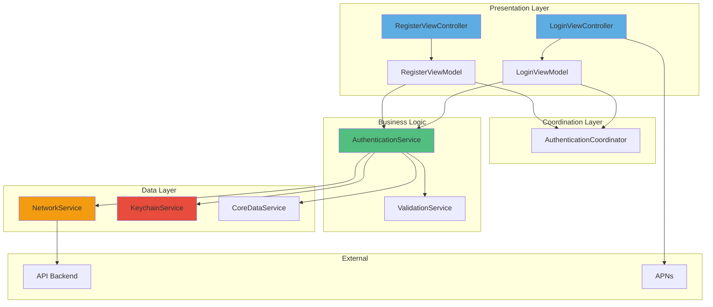

Claude configuration file at C:\Users\ricma\.claude.json is corrupted: Unexpected end of JSON input

Claude configuration file at C:\Users\ricma\.claude.json is corrupted
The corrupted file has been backed up to: C:\Users\ricma\.claude.json.corrupted.1762037208642
A backup file exists at: C:\Users\ricma\.claude.json.backup
You can manually restore it by running: cp "C:\Users\ricma\.claude.json.backup" "C:\Users\ricma\.claude.json"

# iOS Mobile Specification - SUMA Finance
## User Registration & Authentication

---

## 1. iOS Platform Overview

### Platform Requirements
- **Minimum iOS Version**: iOS 15.0
- **Target Devices**: Universal (iPhone + iPad)
- **Device Orientation**: Portrait (primary), Landscape (supported)
- **Swift Version**: Swift 5.9+
- **Xcode Version**: Xcode 15.0+

### Deployment Considerations
- **App Store Category**: Finance
- **Age Rating**: 4+ (Low Maturity)
- **Privacy Manifest**: Required (PrivacyInfo.xcprivacy)
- **Export Compliance**: Encryption declaration required
- **App Tracking Transparency**: Not required for authentication flows

### Compliance Requirements
- App Store Review Guidelines compliance
- Financial app security standards
- GDPR data handling (EU users)
- Biometric authentication guidelines

---

## 2. iOS Architecture

### Architecture Pattern
**MVVM + Coordinator Pattern**

```swift
// Architecture Overview
Authentication Module
├── Coordinators/
│   └── AuthenticationCoordinator.swift
├── ViewModels/
│   ├── LoginViewModel.swift
│   ├── RegisterViewModel.swift
│   └── ForgotPasswordViewModel.swift
├── Views/
│   ├── LoginViewController.swift
│   ├── RegisterViewController.swift
│   └── ForgotPasswordViewController.swift
├── Models/
│   ├── User.swift
│   ├── AuthToken.swift
│   └── RegistrationRequest.swift
└── Services/
    ├── AuthenticationService.swift
    └── KeychainService.swift
```

### Project Structure
```
SUMAFinance/
├── App/
│   ├── AppDelegate.swift
│   ├── SceneDelegate.swift
│   └── AppCoordinator.swift
├── Modules/
│   ├── Authentication/
│   ├── Dashboard/
│   └── Common/
├── Core/
│   ├── Networking/
│   ├── Storage/
│   └── Extensions/
└── Resources/
    ├── Assets.xcassets
    ├── Localizations/
    └── Info.plist
```

### Navigation Pattern
**Coordinator Pattern with NavigationController**

```swift
protocol Coordinator: AnyObject {
    var navigationController: UINavigationController { get }
    var childCoordinators: [Coordinator] { get set }
    
    func start()
}

final class AuthenticationCoordinator: Coordinator {
    var navigationController: UINavigationController
    var childCoordinators: [Coordinator] = []
    
    func start() {
        let loginVC = LoginViewController()
        loginVC.viewModel = LoginViewModel(coordinator: self)
        navigationController.pushViewController(loginVC, animated: true)
    }
    
    func showRegistration() {
        let registerVC = RegisterViewController()
        registerVC.viewModel = RegisterViewModel(coordinator: self)
        navigationController.pushViewController(registerVC, animated: true)
    }
}
```

### Dependency Injection
**Manual DI with Protocol-Oriented Design**

```swift
protocol AuthenticationServiceProtocol {
    func login(email: String, password: String) async throws -> User
    func register(request: RegistrationRequest) async throws -> User
}

final class AuthenticationService: AuthenticationServiceProtocol {
    private let networkService: NetworkServiceProtocol
    private let keychainService: KeychainServiceProtocol
    
    init(networkService: NetworkServiceProtocol, 
         keychainService: KeychainServiceProtocol) {
        self.networkService = networkService
        self.keychainService = keychainService
    }
}
```

---

## 3. UI Framework Selection

### Framework Choice
**Hybrid Approach: UIKit (Primary) + SwiftUI (Components)**

**Rationale:**
- UIKit for main view controllers (mature, stable, team familiarity)
- SwiftUI for custom components and forms
- Seamless interoperability using `UIHostingController`

### Implementation Strategy

**UIKit ViewControllers:**
```swift
final class LoginViewController: UIViewController {
    private let viewModel: LoginViewModel
    private var cancellables = Set<AnyCancellable>()
    
    // UIKit-based layout
    private lazy var emailTextField: UITextField = {
        let textField = UITextField()
        textField.placeholder = "Email"
        textField.keyboardType = .emailAddress
        textField.autocapitalizationType = .none
        return textField
    }()
}
```

**SwiftUI Components:**
```swift
struct PasswordStrengthIndicator: View {
    let strength: PasswordStrength
    
    var body: some View {
        HStack(spacing: 4) {
            ForEach(0..<4) { index in
                Rectangle()
                    .fill(color(for: index))
                    .frame(height: 4)
            }
        }
    }
}

// Bridge to UIKit
extension UIViewController {
    func embedSwiftUIView<Content: View>(_ view: Content, in container: UIView) {
        let hostingController = UIHostingController(rootView: view)
        addChild(hostingController)
        container.addSubview(hostingController.view)
        hostingController.view.translatesAutoresizingMaskIntoConstraints = false
        NSLayoutConstraint.activate([
            hostingController.view.topAnchor.constraint(equalTo: container.topAnchor),
            hostingController.view.bottomAnchor.constraint(equalTo: container.bottomAnchor),
            hostingController.view.leadingAnchor.constraint(equalTo: container.leadingAnchor),
            hostingController.view.trailingAnchor.constraint(equalTo: container.trailingAnchor)
        ])
        hostingController.didMove(toParent: self)
    }
}
```

### Interface Builder
**Programmatic UI (No Storyboards)**

- Full programmatic layout using Auto Layout
- Better version control and merge conflict resolution
- Type-safe UI construction
- Improved code review process

### Auto Layout Strategy
```swift
extension UIView {
    func pinToSuperview(insets: UIEdgeInsets = .zero) {
        guard let superview = superview else { return }
        translatesAutoresizingMaskIntoConstraints = false
        NSLayoutConstraint.activate([
            topAnchor.constraint(equalTo: superview.topAnchor, constant: insets.top),
            leadingAnchor.constraint(equalTo: superview.leadingAnchor, constant: insets.left),
            trailingAnchor.constraint(equalTo: superview.trailingAnchor, constant: -insets.right),
            bottomAnchor.constraint(equalTo: superview.bottomAnchor, constant: -insets.bottom)
        ])
    }
}
```

### Dark Mode Support
```swift
// Semantic colors in Assets.xcassets
// Runtime adaptation
extension UIColor {
    static let primaryBackground = UIColor(named: "PrimaryBackground")!
    static let primaryText = UIColor(named: "PrimaryText")!
    static let accentColor = UIColor(named: "AccentColor")!
}

// Automatic adaptation
override func traitCollectionDidChange(_ previousTraitCollection: UITraitCollection?) {
    super.traitCollectionDidChange(previousTraitCollection)
    
    if traitCollection.hasDifferentColorAppearance(comparedTo: previousTraitCollection) {
        updateColorsForCurrentTraitCollection()
    }
}
```

---

## 4. Screen Specifications

### 4.1 Login Screen

**Screen Name**: `LoginViewController`

**Purpose**: Primary authentication entry point

**UI Framework**: UIKit

**View Controller Structure**:
```swift
final class LoginViewController: UIViewController {
    // MARK: - Properties
    private let viewModel: LoginViewModel
    private var cancellables = Set<AnyCancellable>()
    
    // MARK: - UI Components
    private lazy var scrollView = UIScrollView()
    private lazy var contentView = UIView()
    private lazy var logoImageView = UIImageView()
    private lazy var emailTextField = PrimaryTextField()
    private lazy var passwordTextField = SecureTextField()
    private lazy var loginButton = PrimaryButton(title: "Log In")
    private lazy var forgotPasswordButton = TextButton(title: "Forgot Password?")
    private lazy var registerButton = SecondaryButton(title: "Create Account")
    private lazy var biometricButton = BiometricButton()
    
    // MARK: - Lifecycle
    override func viewDidLoad() {
        super.viewDidLoad()
        setupUI()
        bindViewModel()
        setupKeyboardHandling()
    }
}
```

**Data Binding**: Combine
```swift
private func bindViewModel() {
    // Input binding
    emailTextField.textPublisher
        .assign(to: \.email, on: viewModel)
        .store(in: &cancellables)
    
    passwordTextField.textPublisher
        .assign(to: \.password, on: viewModel)
        .store(in: &cancellables)
    
    loginButton.tapPublisher
        .sink { [weak self] in
            self?.viewModel.login()
        }
        .store(in: &cancellables)
    
    // Output binding
    viewModel.$isLoading
        .receive(on: DispatchQueue.main)
        .sink { [weak self] isLoading in
            self?.loginButton.isLoading = isLoading
        }
        .store(in: &cancellables)
    
    viewModel.$errorMessage
        .receive(on: DispatchQueue.main)
        .compactMap { $0 }
        .sink { [weak self] error in
            self?.showError(error)
        }
        .store(in: &cancellables)
}
```

**Navigation**: Root screen in Authentication flow

**State Management**:
```swift
final class LoginViewModel {
    // Input
    @Published var email: String = ""
    @Published var password: String = ""
    
    // Output
    @Published var isLoading: Bool = false
    @Published var errorMessage: String?
    @Published var isLoginEnabled: Bool = false
    
    private let authService: AuthenticationServiceProtocol
    private let coordinator: AuthenticationCoordinator
    
    init(authService: AuthenticationServiceProtocol, 
         coordinator: AuthenticationCoordinator) {
        self.authService = authService
        self.coordinator = coordinator
        
        setupValidation()
    }
    
    private func setupValidation() {
        Publishers.CombineLatest($email, $password)
            .map { email, password in
                email.isValidEmail && password.count >= 8
            }
            .assign(to: &$isLoginEnabled)
    }
    
    func login() {
        isLoading = true
        
        Task {
            do {
                let user = try await authService.login(email: email, password: password)
                await MainActor.run {
                    coordinator.didCompleteAuthentication(user: user)
                }
            } catch {
                await MainActor.run {
                    errorMessage = error.localizedDescription
                    isLoading = false
                }
            }
        }
    }
}
```

---

### 4.2 Registration Screen

**Screen Name**: `RegisterViewController`

**Purpose**: New user account creation

**UI Framework**: UIKit with SwiftUI components

**View Controller Structure**:
```swift
final class RegisterViewController: UIViewController {
    // MARK: - Properties
    private let viewModel: RegisterViewModel
    private var cancellables = Set<AnyCancellable>()
    
    // MARK: - UI Components
    private lazy var scrollView = UIScrollView()
    private lazy var fullNameTextField = PrimaryTextField()
    private lazy var emailTextField = PrimaryTextField()
    private lazy var passwordTextField = SecureTextField()
    private lazy var confirmPasswordTextField = SecureTextField()
    private lazy var passwordStrengthContainer = UIView()
    private lazy var termsCheckbox = CheckboxView()
    private lazy var registerButton = PrimaryButton(title: "Create Account")
    
    override func viewDidLoad() {
        super.viewDidLoad()
        setupUI()
        embedPasswordStrengthIndicator()
        bindViewModel()
    }
    
    private func embedPasswordStrengthIndicator() {
        let strengthView = PasswordStrengthIndicator(
            strength: viewModel.$passwordStrength.eraseToAnyPublisher()
        )
        embedSwiftUIView(strengthView, in: passwordStrengthContainer)
    }
}
```

**Data Binding**: Combine with validation

**Navigation**: Pushed from Login screen

**State Management**:
```swift
final class RegisterViewModel {
    struct RegistrationData {
        let fullName: String
        let email: String
        let password: String
    }
    
    // Input
    @Published var fullName: String = ""
    @Published var email: String = ""
    @Published var password: String = ""
    @Published var confirmPassword: String = ""
    @Published var termsAccepted: Bool = false
    
    // Output
    @Published var passwordStrength: PasswordStrength = .weak
    @Published var isRegistrationEnabled: Bool = false
    @Published var validationErrors: [ValidationError] = []
    @Published var isLoading: Bool = false
    
    private func setupValidation() {
        // Password strength calculation
        $password
            .map { PasswordValidator.calculateStrength($0) }
            .assign(to: &$passwordStrength)
        
        // Form validation
        Publishers.CombineLatest4($fullName, $email, $password, $confirmPassword)
            .combineLatest($termsAccepted)
            .map { data, termsAccepted in
                let (fullName, email, password, confirmPassword) = data
                return fullName.count >= 2 &&
                       email.isValidEmail &&
                       password.count >= 8 &&
                       password == confirmPassword &&
                       termsAccepted
            }
            .assign(to: &$isRegistrationEnabled)
    }
}
```

---

### 4.3 Forgot Password Screen

**Screen Name**: `ForgotPasswordViewController`

**Purpose**: Password reset flow initiation

**UI Framework**: UIKit

**Navigation**: Presented modally from Login

---

### 4.4 Biometric Authentication Screen

**Screen Name**: `BiometricAuthViewController`

**Purpose**: Face ID / Touch ID authentication

**UI Framework**: UIKit

**Implementation**:
```swift
import LocalAuthentication

final class BiometricAuthService {
    func authenticateWithBiometrics() async throws -> Bool {
        let context = LAContext()
        var error: NSError?
        
        guard context.canEvaluatePolicy(.deviceOwnerAuthenticationWithBiometrics, error: &error) else {
            throw BiometricError.notAvailable
        }
        
        let reason = "Authenticate to access your SUMA Finance account"
        
        return try await context.evaluatePolicy(
            .deviceOwnerAuthenticationWithBiometrics,
            localizedReason: reason
        )
    }
    
    var biometricType: BiometricType {
        let context = LAContext()
        guard context.canEvaluatePolicy(.deviceOwnerAuthenticationWithBiometrics, error: nil) else {
            return .none
        }
        
        switch context.biometryType {
        case .faceID: return .faceID
        case .touchID: return .touchID
        default: return .none
        }
    }
}
```

---

## 5. iOS Components Library

### Navigation Components

**Custom Navigation Bar**:
```swift
final class AuthNavigationBar: UIView {
    private let titleLabel = UILabel()
    private let backButton = UIButton(type: .system)
    private let closeButton = UIButton(type: .system)
    
    var onBackTapped: (() -> Void)?
    var onCloseTapped: (() -> Void)?
    
    init() {
        super.init(frame: .zero)
        setupUI()
    }
}
```

### Input Components

**Primary Text Field**:
```swift
final class PrimaryTextField: UITextField {
    private let padding = UIEdgeInsets(top: 16, left: 16, bottom: 16, right: 16)
    
    override init(frame: CGRect) {
        super.init(frame: frame)
        setupAppearance()
    }
    
    private func setupAppearance() {
        borderStyle = .none
        layer.cornerRadius = 12
        layer.borderWidth = 1
        layer.borderColor = UIColor.separator.cgColor
        backgroundColor = .secondarySystemBackground
        font = .systemFont(ofSize: 16, weight: .regular)
    }
    
    override func textRect(forBounds bounds: CGRect) -> CGRect {
        bounds.inset(by: padding)
    }
    
    override func editingRect(forBounds bounds: CGRect) -> CGRect {
        bounds.inset(by: padding)
    }
}

extension PrimaryTextField {
    var textPublisher: AnyPublisher<String, Never> {
        NotificationCenter.default
            .publisher(for: UITextField.textDidChangeNotification, object: self)
            .compactMap { ($0.object as? UITextField)?.text }
            .eraseToAnyPublisher()
    }
}
```

**Secure Text Field**:
```swift
final class SecureTextField: PrimaryTextField {
    private let toggleButton = UIButton(type: .system)
    
    override init(frame: CGRect) {
        super.init(frame: frame)
        isSecureTextEntry = true
        setupToggleButton()
    }
    
    private func setupToggleButton() {
        toggleButton.setImage(UIImage(systemName: "eye.fill"), for: .normal)
        toggleButton.setImage(UIImage(systemName: "eye.slash.fill"), for: .selected)
        toggleButton.addTarget(self, action: #selector(toggleVisibility), for: .touchUpInside)
        rightView = toggleButton
        rightViewMode = .always
    }
    
    @objc private func toggleVisibility() {
        isSecureTextEntry.toggle()
        toggleButton.isSelected.toggle()
    }
}
```

### Button Components

**Primary Button**:
```swift
final class PrimaryButton: UIButton {
    private let activityIndicator = UIActivityIndicatorView(style: .medium)
    
    var isLoading: Bool = false {
        didSet {
            updateLoadingState()
        }
    }
    
    init(title: String) {
        super.init(frame: .zero)
        setTitle(title, for: .normal)
        setupAppearance()
        setupActivityIndicator()
    }
    
    private func setupAppearance() {
        backgroundColor = .systemBlue
        setTitleColor(.white, for: .normal)
        layer.cornerRadius = 12
        titleLabel?.font = .systemFont(ofSize: 16, weight: .semibold)
        heightAnchor.constraint(equalToConstant: 52).isActive = true
    }
    
    var tapPublisher: AnyPublisher<Void, Never> {
        publisher(for: .touchUpInside)
            .map { _ in () }
            .eraseToAnyPublisher()
    }
}
```

### Feedback Components

**Error Alert**:
```swift
extension UIViewController {
    func showError(_ message: String, title: String = "Error") {
        let alert = UIAlertController(
            title: title,
            message: message,
            preferredStyle: .alert
        )
        alert.addAction(UIAlertAction(title: "OK", style: .default))
        present(alert, animated: true)
    }
    
    func showSuccess(_ message: String) {
        let alert = UIAlertController(
            title: "Success",
            message: message,
            preferredStyle: .alert
        )
        alert.addAction(UIAlertAction(title: "OK", style: .default))
        present(alert, animated: true)
    }
}
```

**Toast Message**:
```swift
final class ToastView: UIView {
    static func show(message: String, in view: UIView) {
        let toast = ToastView(message: message)
        view.addSubview(toast)
        
        toast.alpha = 0
        UIView.animate(withDuration: 0.3) {
            toast.alpha = 1
        } completion: { _ in
            UIView.animate(withDuration: 0.3, delay: 2.0) {
                toast.alpha = 0
            } completion: { _ in
                toast.removeFromSuperview()
            }
        }
    }
}
```

---

## 6. Data Persistence

### Keychain Storage (Secure Tokens)

```swift
import Security

final class KeychainService {
    enum KeychainError: Error {
        case itemNotFound
        case unexpectedData
        case unhandledError(status: OSStatus)
    }
    
    func save(_ data: Data, for key: String) throws {
        let query: [String: Any] = [
            kSecClass as String: kSecClassGenericPassword,
            kSecAttrAccount as String: key,
            kSecValueData as String: data,
            kSecAttrAccessible as String: kSecAttrAccessibleAfterFirstUnlock
        ]
        
        SecItemDelete(query as CFDictionary)
        
        let status = SecItemAdd(query as CFDictionary, nil)
        guard status == errSecSuccess else {
            throw KeychainError.unhandledError(status: status)
        }
    }
    
    func retrieve(for key: String) throws -> Data {
        let query: [String: Any] = [
            kSecClass as String: kSecClassGenericPassword,
            kSecAttrAccount as String: key,
            kSecReturnData as String: true,
            kSecMatchLimit as String: kSecMatchLimitOne
        ]
        
        var result: AnyObject?
        let status = SecItemCopyMatching(query as CFDictionary, &result)
        
        guard status == errSecSuccess else {
            throw status == errSecItemNotFound ? KeychainError.itemNotFound : KeychainError.unhandledError(status: status)
        }
        
        guard let data = result as? Data else {
            throw KeychainError.unexpectedData
        }
        
        return data
    }
    
    func delete(for key: String) throws {
        let query: [String: Any] = [
            kSecClass as String: kSecClassGenericPassword,
            kSecAttrAccount as String: key
        ]
        
        let status = SecItemDelete(query as CFDictionary)
        guard status == errSecSuccess || status == errSecItemNotFound else {
            throw KeychainError.unhandledError(status: status)
        }
    }
}

// Usage
extension KeychainService {
    private enum Keys {
        static let accessToken = "com.sumafinance.accessToken"
        static let refreshToken = "com.sumafinance.refreshToken"
        static let userID = "com.sumafinance.userID"
    }
    
    func saveAuthToken(_ token: String) throws {
        let data = token.data(using: .utf8)!
        try save(data, for: Keys.accessToken)
    }
    
    func retrieveAuthToken() throws -> String {
        let data = try retrieve(for: Keys.accessToken)
        guard let token = String(data: data, encoding: .utf8) else {
            throw KeychainError.unexpectedData
        }
        return token
    }
    
    func clearAuthData() throws {
        try? delete(for: Keys.accessToken)
        try? delete(for: Keys.refreshToken)
        try? delete(for: Keys.userID)
    }
}
```

### UserDefaults (App Preferences)

```swift
final class UserPreferences {
    private let defaults = UserDefaults.standard
    
    enum Keys {
        static let biometricEnabled = "biometricEnabled"
        static let rememberEmail = "rememberEmail"
        static let lastLoggedInEmail = "lastLoggedInEmail"
        static let onboardingCompleted = "onboardingCompleted"
    }
    
    var biometricEnabled: Bool {
        get { defaults.bool(forKey: Keys.biometricEnabled) }
        set { defaults.set(newValue, forKey: Keys.biometricEnabled) }
    }
    
    var lastLoggedInEmail: String? {
        get { defaults.string(forKey: Keys.lastLoggedInEmail) }
        set { defaults.set(newValue, forKey: Keys.lastLoggedInEmail) }
    }
    
    var onboardingCompleted: Bool {
        get { defaults.bool(forKey: Keys.onboardingCompleted) }
        set { defaults.set(newValue, forKey: Keys.onboardingCompleted) }
    }
}
```

### Core Data (User Session Cache)

```swift
// User.xcdatamodeld
Entity: UserEntity
- id: UUID
- email: String
- fullName: String
- avatarURL: String?
- createdAt: Date
- lastLoginAt: Date

import CoreData

final class PersistenceController {
    static let shared = PersistenceController()
    
    let container: NSPersistentContainer
    
    init(inMemory: Bool = false) {
        container = NSPersistentContainer(name: "SUMAFinance")
        
        if inMemory {
            container.persistentStoreDescriptions.first?.url = URL(fileURLWithPath: "/dev/null")
        }
        
        container.loadPersistentStores { description, error in
            if let error = error {
                fatalError("Failed to load Core Data: \(error)")
            }
        }
    }
    
    func saveUser(_ user: User) throws {
        let context = container.viewContext
        let entity = UserEntity(context: context)
        entity.id = user.id
        entity.email = user.email
        entity.fullName = user.fullName
        entity.lastLoginAt = Date()
        
        try context.save()
    }
    
    func fetchUser() throws -> User? {
        let context = container.viewContext
        let request = UserEntity.fetchRequest()
        request.fetchLimit = 1
        
        guard let entity = try context.fetch(request).first else {
            return nil
        }
        
        return User(
            id: entity.id!,
            email: entity.email!,
            fullName: entity.fullName!
        )
    }
}
```

---

## 7. Networking Layer

### URLSession-Based Service

```swift
protocol NetworkServiceProtocol {
    func request<T: Decodable>(_ endpoint: Endpoint) async throws -> T
}

final class NetworkService: NetworkServiceProtocol {
    private let session: URLSession
    private let baseURL: URL
    private let keychainService: KeychainService
    
    init(baseURL: URL, keychainService: KeychainService) {
        let configuration = URLSessionConfiguration.default
        configuration.timeoutIntervalForRequest = 30
        configuration.timeoutIntervalForResource = 60
        
        self.session = URLSession(configuration: configuration)
        self.baseURL = baseURL
        self.keychainService = keychainService
    }
    
    func request<T: Decodable>(_ endpoint: Endpoint) async throws -> T {
        var urlRequest = try endpoint.asURLRequest(baseURL: baseURL)
        
        // Add auth token if available
        if let token = try? keychainService.retrieveAuthToken() {
            urlRequest.setValue("Bearer \(token)", forHTTPHeaderField: "Authorization")
        }
        
        let (data, response) = try await session.data(for: urlRequest)
        
        guard let httpResponse = response as? HTTPURLResponse else {
            throw NetworkError.invalidResponse
        }
        
        guard (200...299).contains(httpResponse.statusCode) else {
            throw NetworkError.httpError(statusCode: httpResponse.statusCode)
        }
        
        do {
            let decoder = JSONDecoder()
            decoder.keyDecodingStrategy = .convertFromSnakeCase
            decoder.dateDecodingStrategy = .iso8601
            return try decoder.decode(T.self, from: data)
        } catch {
            throw NetworkError.decodingError(error)
        }
    }
}

// Endpoint Protocol
protocol Endpoint {
    var path: String { get }
    var method: HTTPMethod { get }
    var headers: [String: String] { get }
    var body: Data? { get }
    
    func asURLRequest(baseURL: URL) throws -> URLRequest
}

enum HTTPMethod: String {
    case get = "GET"
    case post = "POST"
    case put = "PUT"
    case delete = "DELETE"
}

// Authentication Endpoints
enum AuthEndpoint: Endpoint {
    case login(email: String, password: String)
    case register(RegistrationRequest)
    case refreshToken(String)
    case logout
    
    var path: String {
        switch self {
        case .login: return "/auth/login"
        case .register: return "/auth/register"
        case .refreshToken: return "/auth/refresh"
        case .logout: return "/auth/logout"
        }
    }
    
    var method: HTTPMethod {
        switch self {
        case .login, .register, .refreshToken, .logout:
            return .post
        }
    }
    
    var headers: [String: String] {
        ["Content-Type": "application/json"]
    }
    
    var body: Data? {
        switch self {
        case .login(let email, let password):
            let payload = ["email": email, "password": password]
            return try? JSONEncoder().encode(payload)
        case .register(let request):
            return try? JSONEncoder().encode(request)
        case .refreshToken(let token):
            let payload = ["refreshToken": token]
            return try? JSONEncoder().encode(payload)
        case .logout:
            return nil
        }
    }
}
```

### Models (Codable)

```swift
struct User: Codable {
    let id: UUID
    let email: String
    let fullName: String
    let avatarURL: String?
    let createdAt: Date
}

struct AuthResponse: Codable {
    let user: User
    let accessToken: String
    let refreshToken: String
    let expiresIn: Int
}

struct RegistrationRequest: Codable {
    let fullName: String
    let email: String
    let password: String
}

struct ErrorResponse: Codable {
    let code: String
    let message: String
    let details: [String: String]?
}
```

### Error Handling

```swift
enum NetworkError: LocalizedError {
    case invalidURL
    case invalidResponse
    case noData
    case httpError(statusCode: Int)
    case decodingError(Error)
    case unauthorized
    case serverError(String)
    
    var errorDescription: String? {
        switch self {
        case .invalidURL:
            return "Invalid URL"
        case .invalidResponse:
            return "Invalid server response"
        case .noData:
            return "No data received"
        case .httpError(let code):
            return "HTTP Error: \(code)"
        case .decodingError:
            return "Failed to parse response"
        case .unauthorized:
            return "Unauthorized. Please login again."
        case .serverError(let message):
            return message
        }
    }
}
```

### SSL Pinning

```swift
final class SSLPinningDelegate: NSObject, URLSessionDelegate {
    private let certificates: [SecCertificate]
    
    init(certificates: [SecCertificate]) {
        self.certificates = certificates
    }
    
    func urlSession(
        _ session: URLSession,
        didReceive challenge: URLAuthenticationChallenge,
        completionHandler: @escaping (URLSession.AuthChallengeDisposition, URLCredential?) -> Void
    ) {
        guard challenge.protectionSpace.authenticationMethod == NSURLAuthenticationMethodServerTrust,
              let serverTrust = challenge.protectionSpace.serverTrust else {
            completionHandler(.cancelAuthenticationChallenge, nil)
            return
        }
        
        let policy = SecPolicyCreateSSL(true, challenge.protectionSpace.host as CFString)
        SecTrustSetPolicies(serverTrust, policy)
        
        var isValid = false
        
        if let serverCertificate = SecTrustGetCertificateAtIndex(serverTrust, 0) {
            isValid = certificates.contains(where: { $0 == serverCertificate })
        }
        
        if isValid {
            let credential = URLCredential(trust: serverTrust)
            completionHandler(.useCredential, credential)
        } else {
            completionHandler(.cancelAuthenticationChallenge, nil)
        }
    }
}
```

---

## 8. State Management

### Combine-Based State Management

```swift
final class AuthenticationState: ObservableObject {
    @Published private(set) var isAuthenticated: Bool = false
    @Published private(set) var currentUser: User?
    @Published private(set) var authToken: String?
    
    private let keychainService: KeychainService
    private var cancellables = Set<AnyCancellable>()
    
    init(keychainService: KeychainService) {
        self.keychainService = keychainService
        restoreSession()
    }
    
    private func restoreSession() {
        if let token = try? keychainService.retrieveAuthToken() {
            authToken = token
            isAuthenticated = true
            // Fetch user profile
        }
    }
    
    func login(user: User, token: String) {
        currentUser = user
        authToken = token
        isAuthenticated = true
        
        try? keychainService.saveAuthToken(token)
    }
    
    func logout() {
        currentUser = nil
        authToken = nil
        isAuthenticated = false
        
        try? keychainService.clearAuthData()
    }
}

// Global state access
final class AppState {
    static let shared = AppState()
    
    let authState: AuthenticationState
    
    private init() {
        self.authState = AuthenticationState(keychainService: KeychainService())
    }
}
```

---

## 9. Background Tasks

### Token Refresh Background Task

```swift
import BackgroundTasks

final class TokenRefreshManager {
    static let taskIdentifier = "com.sumafinance.tokenrefresh"
    
    func registerBackgroundTasks() {
        BGTaskScheduler.shared.register(
            forTaskWithIdentifier: Self.taskIdentifier,
            using: nil
        ) { task in
            self.handleTokenRefresh(task: task as! BGAppRefreshTask)
        }
    }
    
    func scheduleTokenRefresh() {
        let request = BGAppRefreshTaskRequest(identifier: Self.taskIdentifier)
        request.earliestBeginDate = Date(timeIntervalSinceNow: 3600) // 1 hour
        
        do {
            try BGTaskScheduler.shared.submit(request)
        } catch {
            print("Failed to schedule token refresh: \(error)")
        }
    }
    
    private func handleTokenRefresh(task: BGAppRefreshTask) {
        scheduleTokenRefresh() // Schedule next refresh
        
        Task {
            do {
                // Refresh token logic
                task.setTaskCompleted(success: true)
            } catch {
                task.setTaskCompleted(success: false)
            }
        }
    }
}

// In AppDelegate or SceneDelegate
func application(
    _ application: UIApplication,
    didFinishLaunchingWithOptions launchOptions: [UIApplication.LaunchOptionsKey: Any]?
) -> Bool {
    TokenRefreshManager().registerBackgroundTasks()
    return true
}
```

---

## 10. Push Notifications

### APNs Setup

```swift
import UserNotifications

final class NotificationManager: NSObject {
    static let shared = NotificationManager()
    
    func requestAuthorization() async throws -> Bool {
        let center = UNUserNotificationCenter.current()
        let options: UNAuthorizationOptions = [.alert, .sound, .badge]
        
        return try await center.requestAuthorization(options: options)
    }
    
    func registerForRemoteNotifications() {
        DispatchQueue.main.async {
            UIApplication.shared.registerForRemoteNotifications()
        }
    }
}

// In AppDelegate
func application(
    _ application: UIApplication,
    didRegisterForRemoteNotificationsWithDeviceToken deviceToken: Data
) {
    let token = deviceToken.map { String(format: "%02.2hhx", $0) }.joined()
    print("APNs Token: \(token)")
    // Send to backend
}

func application(
    _ application: UIApplication,
    didFailToRegisterForRemoteNotificationsWithError error: Error
) {
    print("Failed to register for remote notifications: \(error)")
}

func application(
    _ application: UIApplication,
    didReceiveRemoteNotification userInfo: [AnyHashable: Any],
    fetchCompletionHandler completionHandler: @escaping (UIBackgroundFetchResult) -> Void
) {
    // Handle push notification
    completionHandler(.newData)
}
```

---

## 11. Deep Linking

### Universal Links Setup

**Associated Domains Entitlement:**
```
sumafinance.com
*.sumafinance.com
```

**apple-app-site-association (Backend):**
```json
{
  "applinks": {
    "apps": [],
    "details": [
      {
        "appID": "TEAMID.com.sumafinance.app",
        "paths": [
          "/auth/verify-email",
          "/auth/reset-password",
          "/invite/*"
        ]
      }
    ]
  }
}
```

**Deep Link Handler:**
```swift
final class DeepLinkCoordinator {
    enum DeepLink {
        case verifyEmail(token: String)
        case resetPassword(token: String)
        case invite(code: String)
    }
    
    func handle(_ url: URL) -> DeepLink? {
        guard let components = URLComponents(url: url, resolvingAgainstBaseURL: true) else {
            return nil
        }
        
        switch components.path {
        case "/auth/verify-email":
            guard let token = components.queryItems?.first(where: { $0.name == "token" })?.value else {
                return nil
            }
            return .verifyEmail(token: token)
            
        case "/auth/reset-password":
            guard let token = components.queryItems?.first(where: { $0.name == "token" })?.value else {
                return nil
            }
            return .resetPassword(token: token)
            
        default:
            return nil
        }
    }
}

// In SceneDelegate
func scene(
    _ scene: UIScene,
    continue userActivity: NSUserActivity
) {
    guard userActivity.activityType == NSUserActivityTypeBrowsingWeb,
          let url = userActivity.webpageURL else {
        return
    }
    
    if let deepLink = DeepLinkCoordinator().handle(url) {
        handleDeepLink(deepLink)
    }
}
```

---

## 12. iOS-Specific Features

### Face ID / Touch ID Integration

```swift
import LocalAuthentication

final class BiometricAuthenticationService {
    enum BiometricType {
        case faceID
        case touchID
        case none
    }
    
    var availableBiometricType: BiometricType {
        let context = LAContext()
        guard context.canEvaluatePolicy(.deviceOwnerAuthenticationWithBiometrics, error: nil) else {
            return .none
        }
        
        switch context.biometryType {
        case .faceID: return .faceID
        case .touchID: return .touchID
        default: return .none
        }
    }
    
    func authenticate() async throws -> Bool {
        let context = LAContext()
        context.localizedCancelTitle = "Use Password"
        
        let reason = "Authenticate to access your SUMA Finance account"
        
        return try await context.evaluatePolicy(
            .deviceOwnerAuthenticationWithBiometrics,
            localizedReason: reason
        )
    }
    
    func authenticateWithFallback() async throws -> Bool {
        let context = LAContext()
        context.localizedCancelTitle = "Cancel"
        context.localizedFallbackTitle = "Use Password"
        
        let reason = "Authenticate to access your account"
        
        return try await context.evaluatePolicy(
            .deviceOwnerAuthentication,
            localizedReason: reason
        )
    }
}
```

### Info.plist Configuration

```xml
<key>NSFaceIDUsageDescription</key>
<string>SUMA Finance uses Face ID to securely authenticate you</string>

<key>NSCameraUsageDescription</key>
<string>Upload profile picture</string>

<key>NSPhotoLibraryUsageDescription</key>
<string>Select profile picture from your photo library</string>
```

---

## 13. Performance Optimization

### Memory Management Best Practices

```swift
// Weak references in closures
final class LoginViewModel {
    func login() {
        Task { [weak self] in
            guard let self = self else { return }
            // Async work
        }
    }
}

// Combine cancellables cleanup
private var cancellables = Set<AnyCancellable>()

deinit {
    cancellables.forEach { $0.cancel() }
}
```

### Image Loading & Caching

```swift
final class ImageCache {
    static let shared = ImageCache()
    
    private let cache = NSCache<NSString, UIImage>()
    private let fileManager = FileManager.default
    
    func image(for url: URL) async throws -> UIImage {
        let key = url.absoluteString as NSString
        
        // Check memory cache
        if let cached = cache.object(forKey: key) {
            return cached
        }
        
        // Check disk cache
        if let diskImage = loadFromDisk(url: url) {
            cache.setObject(diskImage, forKey: key)
            return diskImage
        }
        
        // Download
        let (data, _) = try await URLSession.shared.data(from: url)
        guard let image = UIImage(data: data) else {
            throw ImageError.invalidData
        }
        
        cache.setObject(image, forKey: key)
        saveToDisk(image: image, url: url)
        
        return image
    }
}

// UIImageView extension
extension UIImageView {
    func loadImage(from url: URL) async {
        do {
            let image = try await ImageCache.shared.image(for: url)
            await MainActor.run {
                self.image = image
            }
        } catch {
            print("Failed to load image: \(error)")
        }
    }
}
```

### Main Thread Optimization

```swift
// Background processing
func processLargeDataset() {
    DispatchQueue.global(qos: .userInitiated).async {
        let result = heavyComputation()
        
        DispatchQueue.main.async {
            self.updateUI(with: result)
        }
    }
}

// MainActor for async/await
@MainActor
func updateUI(with data: Data) {
    // UI updates automatically on main thread
}
```

---

## 14. Accessibility

### VoiceOver Support

```swift
// Setting accessibility properties
emailTextField.isAccessibilityElement = true
emailTextField.accessibilityLabel = "Email address"
emailTextField.accessibilityHint = "Enter your email address"
emailTextField.accessibilityTraits = .none

loginButton.accessibilityLabel = "Log in"
loginButton.accessibilityHint = "Double tap to log in to your account"
loginButton.accessibilityTraits = .button

// Dynamic accessibility
private func updateLoginButtonAccessibility() {
    if isLoading {
        loginButton.accessibilityLabel = "Logging in"
        loginButton.accessibilityTraits = [.button, .notEnabled]
    } else {
        loginButton.accessibilityLabel = "Log in"
        loginButton.accessibilityTraits = .button
    }
}

// Grouping elements
containerView.isAccessibilityElement = true
containerView.accessibilityLabel = "Login form"
containerView.accessibilityElements = [emailTextField, passwordTextField, loginButton]
```

### Dynamic Type Support

```swift
// Using scaled fonts
let titleLabel = UILabel()
titleLabel.font = .preferredFont(forTextStyle: .title1)
titleLabel.adjustsFontForContentSizeCategory = true

// Custom scaled fonts
extension UIFont {
    static func scaledFont(size: CGFloat, weight: Weight = .regular) -> UIFont {
        let font = UIFont.systemFont(ofSize: size, weight: weight)
        let fontMetrics = UIFontMetrics.default
        return fontMetrics.scaledFont(for: font)
    }
}

// Respond to font size changes
override func traitCollectionDidChange(_ previousTraitCollection: UITraitCollection?) {
    super.traitCollectionDidChange(previousTraitCollection)
    
    if traitCollection.preferredContentSizeCategory != previousTraitCollection?.preferredContentSizeCategory {
        updateFonts()
    }
}
```

### Accessibility Identifiers (UI Testing)

```swift
// Setting identifiers
emailTextField.accessibilityIdentifier = "loginEmailTextField"
passwordTextField.accessibilityIdentifier = "loginPasswordTextField"
loginButton.accessibilityIdentifier = "loginButton"
registerButton.accessibilityIdentifier = "registerButton"

// Usage in UI tests
func testLoginFlow() {
    let app = XCUIApplication()
    
    let emailField = app.textFields["loginEmailTextField"]
    emailField.tap()
    emailField.typeText("user@example.com")
    
    let passwordField = app.secureTextFields["loginPasswordTextField"]
    passwordField.tap()
    passwordField.typeText("password123")
    
    app.buttons["loginButton"].tap()
}
```

---

## 15. Testing Strategy

### Unit Tests (XCTest)

```swift
import XCTest
@testable import SUMAFinance

final class LoginViewModelTests: XCTestCase {
    var sut: LoginViewModel!
    var mockAuthService: MockAuthenticationService!
    var mockCoordinator: MockAuthenticationCoordinator!
    
    override func setUp() {
        super.setUp()
        mockAuthService = MockAuthenticationService()
        mockCoordinator = MockAuthenticationCoordinator()
        sut = LoginViewModel(
            authService: mockAuthService,
            coordinator: mockCoordinator
        )
    }
    
    override func tearDown() {
        sut = nil
        mockAuthService = nil
        mockCoordinator = nil
        super.tearDown()
    }
    
    func testEmailValidation() {
        // Given
        sut.email = "invalid-email"
        sut.password = "password123"
        
        // Then
        XCTAssertFalse(sut.isLoginEnabled)
        
        // When
        sut.email = "valid@example.com"
        
        // Then
        XCTAssertTrue(sut.isLoginEnabled)
    }
    
    func testSuccessfulLogin() async throws {
        // Given
        let expectedUser = User(
            id: UUID(),
            email: "user@example.com",
            fullName: "Test User",
            avatarURL: nil,
            createdAt: Date()
        )
        mockAuthService.loginResult = .success(expectedUser)
        
        sut.email = "user@example.com"
        sut.password = "password123"
        
        // When
        sut.login()
        
        // Wait for async operation
        try await Task.sleep(nanoseconds: 100_000_000)
        
        // Then
        XCTAssertFalse(sut.isLoading)
        XCTAssertNil(sut.errorMessage)
        XCTAssertTrue(mockCoordinator.didCompleteAuthenticationCalled)
    }
    
    func testFailedLogin() async throws {
        // Given
        mockAuthService.loginResult = .failure(NetworkError.unauthorized)
        
        sut.email = "user@example.com"
        sut.password = "wrongpassword"
        
        // When
        sut.login()
        
        // Wait for async operation
        try await Task.sleep(nanoseconds: 100_000_000)
        
        // Then
        XCTAssertFalse(sut.isLoading)
        XCTAssertNotNil(sut.errorMessage)
        XCTAssertFalse(mockCoordinator.didCompleteAuthenticationCalled)
    }
}

// Mock Services
final class MockAuthenticationService: AuthenticationServiceProtocol {
    var loginResult: Result<User, Error>?
    
    func login(email: String, password: String) async throws -> User {
        guard let result = loginResult else {
            throw NetworkError.noData
        }
        return try result.get()
    }
    
    func register(request: RegistrationRequest) async throws -> User {
        fatalError("Not implemented")
    }
}

final class MockAuthenticationCoordinator: AuthenticationCoordinator {
    var didCompleteAuthenticationCalled = false
    
    override func didCompleteAuthentication(user: User) {
        didCompleteAuthenticationCalled = true
    }
}
```

### UI Tests (XCUITest)

```swift
import XCTest

final class LoginUITests: XCTestCase {
    var app: XCUIApplication!
    
    override func setUp() {
        super.setUp()
        continueAfterFailure = false
        app = XCUIApplication()
        app.launchArguments = ["UI-Testing"]
        app.launch()
    }
    
    func testLoginFlow() {
        // Given
        let emailField = app.textFields["loginEmailTextField"]
        let passwordField = app.secureTextFields["loginPasswordTextField"]
        let loginButton = app.buttons["loginButton"]
        
        // When
        emailField.tap()
        emailField.typeText("test@example.com")
        
        passwordField.tap()
        passwordField.typeText("password123")
        
        loginButton.tap()
        
        // Then
        let dashboardView = app.otherElements["dashboardView"]
        XCTAssertTrue(dashboardView.waitForExistence(timeout: 5))
    }
    
    func testInvalidEmailError() {
        // Given
        let emailField = app.textFields["loginEmailTextField"]
        let loginButton = app.buttons["loginButton"]
        
        // When
        emailField.tap()
        emailField.typeText("invalid-email")
        
        // Then
        XCTAssertFalse(loginButton.isEnabled)
    }
    
    func testNavigationToRegistration() {
        // Given
        let registerButton = app.buttons["registerButton"]
        
        // When
        registerButton.tap()
        
        // Then
        let registerView = app.otherElements["registerView"]
        XCTAssertTrue(registerView.exists)
    }
}
```

### Snapshot Tests

```swift
import SnapshotTesting
import XCTest
@testable import SUMAFinance

final class LoginViewSnapshotTests: XCTestCase {
    func testLoginViewDefaultState() {
        let vc = LoginViewController()
        vc.viewModel = LoginViewModel(
            authService: MockAuthenticationService(),
            coordinator: MockAuthenticationCoordinator()
        )
        
        assertSnapshot(matching: vc, as: .image(on: .iPhone13Pro))
    }
    
    func testLoginViewLoadingState() {
        let vc = LoginViewController()
        let viewModel = LoginViewModel(
            authService: MockAuthenticationService(),
            coordinator: MockAuthenticationCoordinator()
        )
        viewModel.isLoading = true
        vc.viewModel = viewModel
        
        assertSnapshot(matching: vc, as: .image(on: .iPhone13Pro))
    }
    
    func testLoginViewDarkMode() {
        let vc = LoginViewController()
        vc.viewModel = LoginViewModel(
            authService: MockAuthenticationService(),
            coordinator: MockAuthenticationCoordinator()
        )
        
        assertSnapshot(matching: vc, as: .image(on: .iPhone13Pro, traits: .init(userInterfaceStyle: .dark)))
    }
}
```

### Code Coverage Target
**Minimum: 80% overall coverage**
- ViewModels: 90%+
- Services: 85%+
- UI Components: 70%+

---

## 16. Build & Deployment

### Build Configurations

**Xcode Configurations:**
- Debug
- Staging
- Release

**Configuration Files:**
```swift
// Config.xcconfig
API_BASE_URL_DEBUG = https://dev-api.sumafinance.com
API_BASE_URL_STAGING = https://staging-api.sumafinance.com
API_BASE_URL_RELEASE = https://api.sumafinance.com

// AppConfig.swift
enum Environment {
    case debug
    case staging
    case release
    
    static var current: Environment {
        #if DEBUG
        return .debug
        #elseif STAGING
        return .staging
        #else
        return .release
        #endif
    }
    
    var apiBaseURL: String {
        switch self {
        case .debug: return "https://dev-api.sumafinance.com"
        case .staging: return "https://staging-api.sumafinance.com"
        case .release: return "https://api.sumafinance.com"
        }
    }
}
```

### Schemes

- **SUMAFinance-Debug**: Development builds
- **SUMAFinance-Staging**: QA testing
- **SUMAFinance-Release**: App Store production

### Fastlane Configuration

**Fastfile:**
```ruby
default_platform(:ios)

platform :ios do
  desc "Run tests"
  lane :test do
    run_tests(
      scheme: "SUMAFinance-Debug",
      devices: ["iPhone 15 Pro"],
      code_coverage: true
    )
  end
  
  desc "Build for staging"
  lane :staging do
    build_app(
      scheme: "SUMAFinance-Staging",
      export_method: "ad-hoc",
      output_directory: "./build"
    )
    
    upload_to_testflight(
      skip_waiting_for_build_processing: true
    )
  end
  
  desc "Build and submit to App Store"
  lane :release do
    increment_build_number(
      build_number: latest_testflight_build_number + 1
    )
    
    build_app(
      scheme: "SUMAFinance-Release",
      export_method: "app-store",
      output_directory: "./build"
    )
    
    upload_to_app_store(
      submit_for_review: true,
      automatic_release: false,
      force: true
    )
  end
  
  desc "Run code linting"
  lane :lint do
    swiftlint(
      mode: :lint,
      config_file: ".swiftlint.yml",
      raise_if_swiftlint_error: true
    )
  end
end
```

### CI/CD Pipeline (GitHub Actions)

```yaml
name: iOS CI

on:
  push:
    branches: [ main, develop ]
  pull_request:
    branches: [ main, develop ]

jobs:
  test:
    runs-on: macos-14
    steps:
      - uses: actions/checkout@v3
      
      - name: Setup Xcode
        uses: maxim-lobanov/setup-xcode@v1
        with:
          xcode-version: '15.2'
      
      - name: Install dependencies
        run: |
          bundle install
          
      - name: Run SwiftLint
        run: fastlane lint
      
      - name: Run tests
        run: fastlane test
      
      - name: Upload coverage
        uses: codecov/codecov-action@v3
        with:
          token: ${{ secrets.CODECOV_TOKEN }}
  
  build_staging:
    needs: test
    if: github.ref == 'refs/heads/develop'
    runs-on: macos-14
    steps:
      - uses: actions/checkout@v3
      
      - name: Build staging
        run: fastlane staging
        env:
          MATCH_PASSWORD: ${{ secrets.MATCH_PASSWORD }}
          FASTLANE_APPLE_ID: ${{ secrets.APPLE_ID }}
```

---

## 17. Dependencies & Package Management

### Swift Package Manager (Primary)

**Package.swift:**
```swift
// swift-tools-version: 5.9
import PackageDescription

let package = Package(
    name: "SUMAFinance",
    platforms: [.iOS(.v15)],
    products: [
        .library(name: "SUMAFinance", targets: ["SUMAFinance"])
    ],
    dependencies: [
        // Networking
        .package(url: "https://github.com/Alamofire/Alamofire.git", from: "5.8.0"),
        
        // Image caching
        .package(url: "https://github.com/onevcat/Kingfisher.git", from: "7.10.0"),
        
        // Keychain
        .package(url: "https://github.com/kishikawakatsumi/KeychainAccess.git", from: "4.2.2"),
        
        // Snapshot testing
        .package(url: "https://github.com/pointfreeco/swift-snapshot-testing.git", from: "1.15.0")
    ],
    targets: [
        .target(
            name: "SUMAFinance",
            dependencies: [
                "Alamofire",
                "Kingfisher",
                "KeychainAccess"
            ]
        ),
        .testTarget(
            name: "SUMAFinanceTests",
            dependencies: [
                "SUMAFinance",
                .product(name: "SnapshotTesting", package: "swift-snapshot-testing")
            ]
        )
    ]
)
```

### Approved Third-Party Libraries

**Essential:**
- Alamofire (Networking)
- Kingfisher (Image caching)
- KeychainAccess (Secure storage)

**Testing:**
- SnapshotTesting (Visual regression)

**Optional:**
- SwiftLint (Code linting)
- SwiftGen (Asset generation)

---

## 18. iOS Security

### App Transport Security (ATS)

**Info.plist:**
```xml
<key>NSAppTransportSecurity</key>
<dict>
    <key>NSAllowsArbitraryLoads</key>
    <false/>
    <key>NSExceptionDomains</key>
    <dict>
        <key>sumafinance.com</key>
        <dict>
            <key>NSIncludesSubdomains</key>
            <true/>
            <key>NSRequiresCertificateTransparency</key>
            <true/>
            <key>NSExceptionMinimumTLSVersion</key>
            <string>TLSv1.3</string>
        </dict>
    </dict>
</dict>
```

### Certificate Pinning Implementation

```swift
final class CertificatePinner {
    private let certificates: [Data]
    
    init() {
        guard let certURL = Bundle.main.url(forResource: "suma-finance", withExtension: "cer"),
              let certData = try? Data(contentsOf: certURL) else {
            fatalError("Certificate not found")
        }
        self.certificates = [certData]
    }
    
    func validate(trust: SecTrust, domain: String) -> Bool {
        guard let serverCertificate = SecTrustGetCertificateAtIndex(trust, 0) else {
            return false
        }
        
        let serverCertData = SecCertificateCopyData(serverCertificate) as Data
        
        return certificates.contains(serverCertData)
    }
}
```

### Jailbreak Detection

```swift
final class SecurityChecker {
    func isJailbroken() -> Bool {
        #if targetEnvironment(simulator)
        return false
        #else
        let jailbreakPaths = [
            "/Applications/Cydia.app",
            "/Library/MobileSubstrate/MobileSubstrate.dylib",
            "/bin/bash",
            "/usr/sbin/sshd",
            "/etc/apt",
            "/private/var/lib/apt/"
        ]
        
        for path in jailbreakPaths {
            if FileManager.default.fileExists(atPath: path) {
                return true
            }
        }
        
        // Sandbox violation check
        if canWriteToRestrictedPath() {
            return true
        }
        
        return false
        #endif
    }
    
    private func canWriteToRestrictedPath() -> Bool {
        let testString = "Jailbreak test"
        let testPath = "/private/jailbreak-test.txt"
        
        do {
            try testString.write(toFile: testPath, atomically: true, encoding: .utf8)
            try FileManager.default.removeItem(atPath: testPath)
            return true
        } catch {
            return false
        }
    }
}

// Usage in AppDelegate
if SecurityChecker().isJailbroken() {
    // Show warning or restrict functionality
    showJailbreakWarning()
}
```

### Secure Coding Practices

```swift
// Input validation
extension String {
    var isSafeInput: Bool {
        let pattern = "^[a-zA-Z0-9@._-]+$"
        return self.range(of: pattern, options: .regularExpression) != nil
    }
}

// Prevent screenshot in sensitive screens
extension UIViewController {
    func preventScreenshot() {
        let textField = UITextField()
        textField.isSecureTextEntry = true
        view.layer.superlayer?.addSublayer(textField.layer)
        textField.layer.sublayers?.first?.addSublayer(view.layer)
    }
}

// Secure text clearing
extension String {
    mutating func securelyClear() {
        for _ in 0..<self.count {
            self = "\0"
        }
        self = ""
    }
}
```

---

## Architecture Diagram



---

## Human Interface Guidelines References

- [Authentication](https://developer.apple.com/design/human-interface-guidelines/authentication)
- [Typography](https://developer.apple.com/design/human-interface-guidelines/typography)
- [Color](https://developer.apple.com/design/human-interface-guidelines/color)
- [Dark Mode](https://developer.apple.com/design/human-interface-guidelines/dark-mode)
- [Accessibility](https://developer.apple.com/design/human-interface-guidelines/accessibility)
- [Face ID and Touch ID](https://developer.apple.com/design/human-interface-guidelines/face-id-and-touch-id)

---

## Summary

This iOS Mobile Specification provides a comprehensive, production-ready blueprint for implementing user registration and authentication in the SUMA Finance iOS app. The architecture follows iOS best practices, leverages native frameworks (UIKit + SwiftUI hybrid), implements robust security measures, and ensures accessibility compliance.

**Key Highlights:**
- MVVM + Coordinator architecture
- Combine-based reactive state management
- Keychain for secure token storage
- Face ID / Touch ID biometric authentication
- Certificate pinning for network security
- Comprehensive testing strategy (Unit, UI, Snapshot)
- Fastlane CI/CD automation
- Full accessibility support (VoiceOver, Dynamic Type)

The specification is implementation-ready and aligns with Apple Human Interface Guidelines and App Store requirements.
