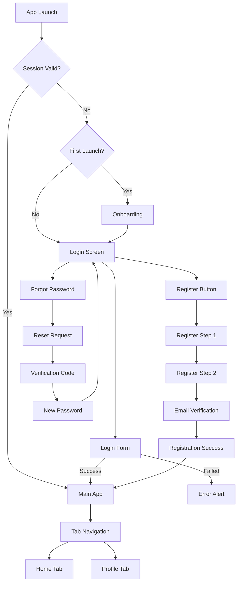
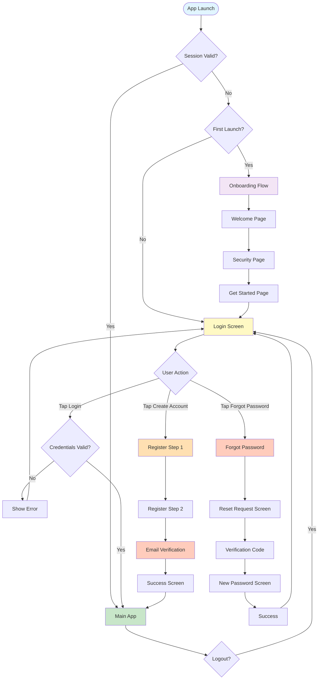

Claude configuration file at C:\Users\ricma\.claude.json is corrupted: Unexpected end of JSON input

Claude configuration file at C:\Users\ricma\.claude.json is corrupted
The corrupted file has been backed up to: C:\Users\ricma\.claude.json.corrupted.1762037208669
A backup file exists at: C:\Users\ricma\.claude.json.backup
You can manually restore it by running: cp "C:\Users\ricma\.claude.json.backup" "C:\Users\ricma\.claude.json"

# Mobile Navigation & Routing - SUMA Finance
## User Registration & Authentication

---

## 1. Navigation Architecture Overview

### Navigation Pattern
**Hybrid Navigation Architecture**
- **Primary Pattern**: Stack-based navigation for authentication flows
- **Post-Auth Pattern**: Tab-based navigation (prepared for future features)
- **Secondary Pattern**: Modal presentations for critical actions

### Navigation Library Choice
- **iOS**: 
  - SwiftUI NavigationStack (iOS 16+) for modern declarative navigation
  - Fallback to UIKit UINavigationController for iOS 15 support
  - Coordinator pattern for navigation logic separation
- **Android**: 
  - Jetpack Navigation Component with Safe Args
  - Navigation Graph for declarative route definitions
  - Compose Navigation for Jetpack Compose UI

### Deep Linking Strategy
- Universal Links (iOS) and App Links (Android) for authentication flows
- Support for email verification links and password reset links
- Deferred deep linking for post-registration redirects
- Fallback to web redirect if app not installed

### State Restoration Requirements
- Preserve authentication state across app restarts
- Save incomplete registration form data
- Restore navigation stack after process death
- Maintain session tokens securely in keychain/keystore

### Cross-Platform Consistency vs Platform-Specific Patterns
- **Consistent**: User flows, screen order, validation rules
- **Platform-Specific**: 
  - iOS: Native sheet presentations, swipe gestures
  - Android: Material Design transitions, back button behavior

---

## 2. Navigation Structure

### Root Navigation
**Entry Point**: SplashScreen → Authentication Gate
- Check for existing valid session token
- Route to Login if unauthenticated
- Route to Main App if authenticated
- Show onboarding if first launch

### Primary Navigation
**Authentication Stack** (Pre-Auth)
- Login Screen (Root)
- Registration Flow
- Forgot Password Flow

**Main App Navigation** (Post-Auth)
- Prepared tab-based structure for future features
- Currently single-screen placeholder

### Secondary Navigation
- **Modal Presentations**: Terms & Conditions, Privacy Policy, Biometric Enrollment
- **Sheet Presentations**: Error alerts, Success confirmations
- **Push Navigation**: Multi-step registration screens

### Navigation Hierarchy
```
App Launch
├── Splash Screen
├── Onboarding (First Launch Only)
└── Authentication Gate
    ├── Unauthenticated Flow
    │   ├── Login (Root)
    │   ├── Register Flow
    │   │   ├── Register Step 1 (Email/Password)
    │   │   ├── Register Step 2 (Personal Info)
    │   │   └── Register Step 3 (Verification)
    │   └── Forgot Password Flow
    │       ├── Request Reset
    │       ├── Verification Code
    │       └── New Password
    └── Authenticated Flow
        └── Main App (Placeholder)
```

### Navigation Flow Diagram



---

## 3. Tab-Based Navigation

**Note**: Tab navigation is prepared for future features. Currently implementing authentication-only navigation.

### Prepared Tab Structure
```swift
// iOS - Prepared TabView Structure
enum AppTab: String, CaseIterable {
    case home = "Home"
    case transactions = "Transactions"
    case accounts = "Accounts"
    case profile = "Profile"
    
    var icon: String {
        switch self {
        case .home: return "house.fill"
        case .transactions: return "list.bullet.rectangle"
        case .accounts: return "creditcard.fill"
        case .profile: return "person.crop.circle.fill"
        }
    }
}
```

```kotlin
// Android - Prepared Bottom Navigation
sealed class BottomNavItem(val route: String, val icon: Int, val title: String) {
    object Home : BottomNavItem("home", R.drawable.ic_home, "Home")
    object Transactions : BottomNavItem("transactions", R.drawable.ic_list, "Transactions")
    object Accounts : BottomNavItem("accounts", R.drawable.ic_account, "Accounts")
    object Profile : BottomNavItem("profile", R.drawable.ic_profile, "Profile")
}
```

### Tab Switching Strategy (Future)
- **State Preservation**: Each tab maintains its own navigation stack
- **Data Reload**: Refresh data on tab reselection if stale (>5 min)
- **Badge Notifications**: Display unread transaction count on Transactions tab

---

## 4. Drawer Navigation

**Not Applicable**: Authentication flow uses stack navigation only. Drawer navigation not required for this feature.

---

## 5. Stack Navigation

### Authentication Stack

#### Stack: Unauthenticated Flow
**Root Screen**: LoginScreen

**Push Navigation**:
- LoginScreen → RegisterStep1Screen (tap "Create Account")
- RegisterStep1Screen → RegisterStep2Screen (form valid, tap "Next")
- RegisterStep2Screen → EmailVerificationScreen (form valid, tap "Register")
- EmailVerificationScreen → RegistrationSuccessScreen (code verified)
- LoginScreen → ForgotPasswordRequestScreen (tap "Forgot Password")
- ForgotPasswordRequestScreen → VerificationCodeScreen (email sent)
- VerificationCodeScreen → NewPasswordScreen (code verified)

**Pop Navigation**:
- Back button: Pop to previous screen
- Cancel button on registration: Pop to LoginScreen (clear stack)
- Cancel button on forgot password: Pop to LoginScreen
- Success screen: Replace stack with Main App (clear authentication stack)

**Stack Depth Limits**: Maximum 4 screens deep before forced reset

**iOS Implementation**:
```swift
// SwiftUI NavigationStack
struct AuthenticationCoordinator: View {
    @StateObject var router = AuthRouter()
    
    var body: some View {
        NavigationStack(path: $router.path) {
            LoginScreen()
                .navigationDestination(for: AuthRoute.self) { route in
                    switch route {
                    case .register: RegisterStep1Screen()
                    case .registerStep2: RegisterStep2Screen()
                    case .emailVerification: EmailVerificationScreen()
                    case .forgotPassword: ForgotPasswordRequestScreen()
                    case .verificationCode: VerificationCodeScreen()
                    case .newPassword: NewPasswordScreen()
                    }
                }
        }
    }
}
```

**Android Implementation**:
```xml
<!-- Navigation Graph -->
<navigation xmlns:android="http://schemas.android.com/apk/res/android"
    xmlns:app="http://schemas.android.com/apk/res-auto"
    android:id="@+id/auth_nav_graph"
    app:startDestination="@id/loginFragment">
    
    <fragment
        android:id="@+id/loginFragment"
        android:name="com.suma.finance.ui.auth.LoginFragment">
        <action
            android:id="@+id/action_to_register"
            app:destination="@id/registerStep1Fragment" />
        <action
            android:id="@+id/action_to_forgot_password"
            app:destination="@id/forgotPasswordFragment" />
    </fragment>
    
    <fragment
        android:id="@+id/registerStep1Fragment"
        android:name="com.suma.finance.ui.auth.RegisterStep1Fragment">
        <action
            android:id="@+id/action_to_step2"
            app:destination="@id/registerStep2Fragment" />
    </fragment>
    
    <!-- Additional fragments -->
</navigation>
```

---

## 6. Modal/Overlay Navigation

### Full-Screen Modals
1. **Terms & Conditions**
   - Triggered from: Registration Step 1 (tap "Terms & Conditions" link)
   - Presentation: Full-screen modal with close button
   - Dismissal: Close button, required to dismiss to continue

2. **Privacy Policy**
   - Triggered from: Registration Step 1 (tap "Privacy Policy" link)
   - Presentation: Full-screen modal with close button
   - Dismissal: Close button

3. **Biometric Enrollment** (Post-Login)
   - Triggered from: Successful login (first time only)
   - Presentation: Full-screen modal with skip option
   - Dismissal: "Enable" or "Skip" button

### Bottom Sheets
1. **Login Method Picker** (Future)
   - Email/Password, Biometric, Social Login options
   - Presentation: Half-height bottom sheet
   - Dismissal: Tap selection or swipe down

2. **Account Recovery Options**
   - Email reset, SMS reset, Contact support
   - Presentation: Half-height bottom sheet
   - Dismissal: Tap selection or swipe down

### Dialogs/Alerts
1. **Validation Errors**
   - Type: Alert dialog
   - Dismissal: "OK" button only
   - Example: "Invalid email format", "Password too weak"

2. **Network Errors**
   - Type: Alert dialog with retry
   - Dismissal: "Retry" or "Cancel" button
   - Example: "Connection failed. Please try again."

3. **Session Expired**
   - Type: Alert dialog (non-dismissible)
   - Dismissal: "Login Again" button (navigates to Login)

4. **Email Verification Sent**
   - Type: Success toast/snackbar
   - Dismissal: Auto-dismiss after 3 seconds
   - Example: "Verification email sent to user@example.com"

### Presentation Styles
**iOS**:
- `.sheet`: Default for bottom sheets and medium-height modals
- `.fullScreenCover`: Terms & Conditions, Privacy Policy
- `.alert`: Error and confirmation dialogs

**Android**:
- `ModalBottomSheet`: Account recovery, login options
- `Dialog`: Alerts and confirmations
- `Snackbar`: Success messages and non-critical notifications

---

## 7. Screen Transitions

### Default Transitions
- **iOS**: 
  - Push: Slide from right (0.35s duration)
  - Pop: Slide to right (0.35s duration)
  - Modal: Slide up from bottom (0.4s duration)
  
- **Android**: 
  - Push: Material fade through (300ms duration)
  - Pop: Material fade through (300ms duration)
  - Modal: Slide up from bottom (400ms duration)

### Custom Transitions
1. **Registration Success Animation**
   - Checkmark animation with scale and fade
   - Duration: 1.5s
   - Auto-navigate to Main App after animation

2. **Login → Main App Transition**
   - Cross-fade transition (no slide)
   - Duration: 0.3s
   - Smooth visual continuity

3. **Splash Screen Fade**
   - Fade out splash, fade in first screen
   - Duration: 0.5s

### Gesture-Based Navigation
- **iOS**: 
  - Edge swipe from left: Pop navigation (native gesture)
  - Swipe down on modal: Dismiss modal (requires `interactiveDismissDisabled(false)`)
  
- **Android**: 
  - System back button: Pop navigation
  - Swipe down on bottom sheet: Dismiss sheet
  - Predictive back gesture (Android 13+): Visual preview before pop

### iOS Custom Transition Example
```swift
struct RegistrationSuccessTransition: ViewModifier {
    @State private var scale: CGFloat = 0.5
    @State private var opacity: Double = 0
    
    func body(content: Content) -> some View {
        content
            .scaleEffect(scale)
            .opacity(opacity)
            .onAppear {
                withAnimation(.spring(response: 0.6, dampingFraction: 0.7)) {
                    scale = 1.0
                    opacity = 1.0
                }
            }
    }
}
```

### Android Custom Transition Example
```kotlin
// Navigation Component transition
val enterTransition = fadeIn(animationSpec = tween(300)) + 
                     slideInHorizontally(initialOffsetX = { it })
val exitTransition = fadeOut(animationSpec = tween(300)) + 
                    slideOutHorizontally(targetOffsetX = { -it })
```

---

## 8. Deep Linking Routes

### Deep Link Route Definitions

#### 1. Email Verification
- **Route Pattern**: `sumafinance://auth/verify-email?token={token}&email={email}`
- **Universal Link**: `https://suma.finance/auth/verify-email?token={token}&email={email}`
- **Destination**: EmailVerificationScreen (auto-submit token)
- **Parameters**: 
  - `token` (required): Verification token from email
  - `email` (required): User's email address
- **Authentication**: Not required (pre-auth flow)
- **Fallback**: Show error "Invalid verification link" if token expired

#### 2. Password Reset
- **Route Pattern**: `sumafinance://auth/reset-password?token={token}&email={email}`
- **Universal Link**: `https://suma.finance/auth/reset-password?token={token}&email={email}`
- **Destination**: NewPasswordScreen (with token pre-filled)
- **Parameters**: 
  - `token` (required): Reset token from email
  - `email` (required): User's email address
- **Authentication**: Not required (pre-auth flow)
- **Fallback**: Show error "Reset link expired. Request a new one."

#### 3. Login Direct Link
- **Route Pattern**: `sumafinance://auth/login`
- **Universal Link**: `https://suma.finance/auth/login`
- **Destination**: LoginScreen
- **Parameters**: None
- **Authentication**: Not required
- **Fallback**: N/A (always navigates to login)

#### 4. Registration Direct Link
- **Route Pattern**: `sumafinance://auth/register`
- **Universal Link**: `https://suma.finance/auth/register`
- **Destination**: RegisterStep1Screen
- **Parameters**: 
  - `referral` (optional): Referral code for tracking
- **Authentication**: Not required
- **Fallback**: N/A (always navigates to registration)

### iOS Universal Links Configuration
```json
// apple-app-site-association
{
  "applinks": {
    "apps": [],
    "details": [
      {
        "appID": "TEAMID.com.suma.finance",
        "paths": [
          "/auth/verify-email",
          "/auth/reset-password",
          "/auth/login",
          "/auth/register"
        ]
      }
    ]
  }
}
```

### Android App Links Configuration
```xml
<!-- AndroidManifest.xml -->
<intent-filter android:autoVerify="true">
    <action android:name="android.intent.action.VIEW" />
    <category android:name="android.intent.category.DEFAULT" />
    <category android:name="android.intent.category.BROWSABLE" />
    
    <data
        android:scheme="https"
        android:host="suma.finance"
        android:pathPrefix="/auth" />
</intent-filter>

<intent-filter>
    <action android:name="android.intent.action.VIEW" />
    <category android:name="android.intent.category.DEFAULT" />
    <category android:name="android.intent.category.BROWSABLE" />
    
    <data
        android:scheme="sumafinance"
        android:host="auth" />
</intent-filter>
```

### Deep Link Handling Logic
```swift
// iOS Deep Link Handler
func handleDeepLink(url: URL) -> AuthRoute? {
    guard let components = URLComponents(url: url, resolvingAgainstBaseURL: true),
          let host = components.host else {
        return nil
    }
    
    switch host {
    case "verify-email":
        guard let token = components.queryItems?.first(where: { $0.name == "token" })?.value,
              let email = components.queryItems?.first(where: { $0.name == "email" })?.value else {
            return nil
        }
        return .emailVerification(token: token, email: email)
        
    case "reset-password":
        guard let token = components.queryItems?.first(where: { $0.name == "token" })?.value,
              let email = components.queryItems?.first(where: { $0.name == "email" })?.value else {
            return nil
        }
        return .passwordReset(token: token, email: email)
        
    case "login":
        return .login
        
    case "register":
        let referral = components.queryItems?.first(where: { $0.name == "referral" })?.value
        return .register(referralCode: referral)
        
    default:
        return nil
    }
}
```

---

## 9. Navigation State Management

### State Preservation
**iOS**:
```swift
// SwiftUI State Restoration
@SceneStorage("authNavigationPath") private var pathData: Data?

var body: some View {
    NavigationStack(path: $router.path) {
        LoginScreen()
    }
    .onAppear {
        if let data = pathData,
           let path = try? JSONDecoder().decode([AuthRoute].self, from: data) {
            router.path = path
        }
    }
    .onChange(of: router.path) { newPath in
        pathData = try? JSONEncoder().encode(newPath)
    }
}
```

**Android**:
```kotlin
// ViewModel with SavedStateHandle
class AuthViewModel(
    private val savedStateHandle: SavedStateHandle
) : ViewModel() {
    
    var registrationData by savedStateHandle.saveable { 
        mutableStateOf(RegistrationData()) 
    }
    
    fun saveNavigationState(bundle: Bundle) {
        savedStateHandle["nav_state"] = bundle
    }
}
```

### Tab Memory (Future Implementation)
- **Home Tab**: Preserve scroll position of transaction list
- **Transactions Tab**: Remember applied filters and date range
- **Profile Tab**: Remember last viewed section

### Login Flow
**Post-Login Redirect**:
1. User attempts to access protected route while unauthenticated
2. Store intended destination in memory: `pendingDestination = .profile`
3. Redirect to Login screen
4. After successful login, navigate to `pendingDestination`
5. Clear `pendingDestination`

```swift
class AuthRouter: ObservableObject {
    @Published var pendingDestination: AppRoute?
    
    func handleLoginSuccess() {
        if let destination = pendingDestination {
            navigateTo(destination)
            pendingDestination = nil
        } else {
            navigateTo(.home)
        }
    }
}
```

### Logout Flow
**Clear Navigation and Session**:
1. Clear authentication token from keychain/keystore
2. Clear all cached user data
3. Reset navigation stack to root (Login)
4. Clear any pending destinations
5. Show logout success message (toast)

```swift
func logout() {
    authService.clearSession()
    router.path.removeAll() // Clear navigation stack
    router.pendingDestination = nil
    router.navigateTo(.login)
}
```

### Process Death Handling
**iOS**: Use `@SceneStorage` for lightweight state restoration
**Android**: Use `SavedStateHandle` in ViewModel

**Preserved State**:
- Current screen in authentication flow
- Partially filled registration form data (not passwords)
- Verification code input (if entered)
- Selected options (biometric enrollment preference)

**Not Preserved**:
- Sensitive data (passwords, tokens in memory)
- Temporary error messages
- Modal/sheet presentation state

---

## 10. Authentication-Based Navigation

### Unauthenticated Flow
```
App Launch → Session Check → Unauthenticated
    ↓
Login Screen (Root)
    ├── Login Form
    ├── Create Account → Registration Flow
    └── Forgot Password → Password Reset Flow
```

**Screens**:
1. **LoginScreen**: Email/password form, biometric option (if enrolled)
2. **RegisterStep1Screen**: Email, password, confirm password
3. **RegisterStep2Screen**: Full name, phone number, date of birth
4. **EmailVerificationScreen**: 6-digit code input
5. **ForgotPasswordRequestScreen**: Email input
6. **VerificationCodeScreen**: 6-digit code for password reset
7. **NewPasswordScreen**: New password, confirm password

### Authenticated Flow
```
Login Success → Token Stored
    ↓
Main App (Placeholder)
    ├── Profile Screen (Accessible)
    └── Future Features (Tab Navigation)
```

**Screens**:
1. **MainAppScreen**: Placeholder for tab navigation
2. **ProfileScreen**: User profile with logout option

### Session Expiration Handling
**Trigger**: API returns 401 Unauthorized

**Flow**:
1. Detect 401 response from API
2. Show alert: "Your session has expired. Please login again."
3. Clear authentication token
4. Store current route as `pendingDestination`
5. Navigate to LoginScreen
6. After re-login, restore `pendingDestination`

```swift
// iOS Session Manager
class SessionManager: ObservableObject {
    @Published var isSessionExpired = false
    
    func handleAPIError(_ error: APIError) {
        if case .unauthorized = error {
            isSessionExpired = true
            authRouter.pendingDestination = .currentRoute
            authService.clearToken()
            authRouter.navigateTo(.login)
        }
    }
}
```

### First-Time User Onboarding
**Trigger**: First app launch (no previous session)

**Flow**:
1. Show 3-screen onboarding carousel
2. Screen 1: Welcome message and key features
3. Screen 2: Security and privacy highlights
4. Screen 3: Call-to-action (Get Started)
5. "Skip" button available on all screens
6. After completion, navigate to LoginScreen
7. Set `hasCompletedOnboarding = true` in UserDefaults

**Implementation**:
```swift
struct OnboardingCoordinator: View {
    @AppStorage("hasCompletedOnboarding") var hasCompleted = false
    @State private var currentPage = 0
    
    var body: some View {
        if hasCompleted {
            LoginScreen()
        } else {
            TabView(selection: $currentPage) {
                OnboardingPage1().tag(0)
                OnboardingPage2().tag(1)
                OnboardingPage3().tag(2)
            }
            .tabViewStyle(.page)
        }
    }
}
```

### Permission Gates
**Not Applicable**: Authentication feature does not require runtime permissions. Future features (Biometric, Notifications) will implement permission gating.

**Prepared Structure**:
```swift
enum Permission {
    case biometric
    case notifications
    case camera
    
    func checkStatus() -> PermissionStatus {
        // Check system permission status
    }
    
    func navigate(onGranted: () -> Void, onDenied: () -> Void) {
        // Navigate to permission request screen or settings
    }
}
```

---

## 11. Onboarding Navigation

### Welcome Screens
**3-Screen Onboarding Flow**:

#### Screen 1: Welcome to SUMA Finance
- **Content**: App logo, tagline, key value proposition
- **Animation**: Fade-in logo, slide-in text
- **Action**: Swipe left or tap "Next"

#### Screen 2: Secure & Private
- **Content**: Security features, encryption, biometric login
- **Animation**: Lock icon animation, shield badge
- **Action**: Swipe left or tap "Next"

#### Screen 3: Get Started
- **Content**: Call-to-action, feature highlights
- **Animation**: Floating UI elements preview
- **Action**: "Create Account" button (primary), "Sign In" button (secondary)

### Skip Option
- **Visibility**: "Skip" button in top-right corner on all screens
- **Action**: Dismiss onboarding, navigate to LoginScreen
- **Persistence**: Mark onboarding as completed to prevent re-showing

### Completion Tracking
```swift
// iOS - UserDefaults persistence
@AppStorage("hasCompletedOnboarding") var hasCompleted = false

func completeOnboarding() {
    hasCompleted = true
    router.navigateTo(.login)
}
```

```kotlin
// Android - SharedPreferences
class OnboardingRepository(context: Context) {
    private val prefs = context.getSharedPreferences("onboarding", Context.MODE_PRIVATE)
    
    var hasCompleted: Boolean
        get() = prefs.getBoolean("completed", false)
        set(value) = prefs.edit().putBoolean("completed", value).apply()
}
```

### Tutorial Overlays (Future)
- **Trigger**: First interaction with specific features
- **Appearance**: Spotlight overlay with instructional text
- **Dismissal**: Tap "Got it" or tap outside spotlight
- **Examples**: 
  - First transaction entry
  - First budget creation
  - First report generation

### iOS Implementation
```swift
struct OnboardingView: View {
    @State private var currentPage = 0
    @AppStorage("hasCompletedOnboarding") var hasCompleted = false
    
    var body: some View {
        TabView(selection: $currentPage) {
            OnboardingPage(
                title: "Welcome to SUMA Finance",
                description: "Manage your finances with ease",
                image: "welcome",
                tag: 0
            )
            
            OnboardingPage(
                title: "Secure & Private",
                description: "Your data is encrypted end-to-end",
                image: "security",
                tag: 1
            )
            
            OnboardingPage(
                title: "Get Started",
                description: "Create an account in seconds",
                image: "start",
                tag: 2,
                isLast: true,
                onComplete: completeOnboarding
            )
        }
        .tabViewStyle(.page)
        .indexViewStyle(.page(backgroundDisplayMode: .always))
        .overlay(alignment: .topTrailing) {
            Button("Skip") { completeOnboarding() }
                .padding()
        }
    }
}
```

### Android Implementation
```kotlin
@Composable
fun OnboardingScreen(onComplete: () -> Unit) {
    val pagerState = rememberPagerState(pageCount = { 3 })
    
    HorizontalPager(state = pagerState) { page ->
        when (page) {
            0 -> OnboardingPage(
                title = "Welcome to SUMA Finance",
                description = "Manage your finances with ease",
                imageRes = R.drawable.onboarding_welcome
            )
            1 -> OnboardingPage(
                title = "Secure & Private",
                description = "Your data is encrypted end-to-end",
                imageRes = R.drawable.onboarding_security
            )
            2 -> OnboardingPage(
                title = "Get Started",
                description = "Create an account in seconds",
                imageRes = R.drawable.onboarding_start,
                isLast = true,
                onComplete = onComplete
            )
        }
    }
}
```

---

## 12. Bottom Navigation Patterns (Android)

### Material Design Bottom Navigation
**Implementation**: Future feature (post-authentication phase)

**Prepared Navigation Bar**:
```kotlin
@Composable
fun BottomNavigationBar(
    selectedTab: BottomNavItem,
    onTabSelected: (BottomNavItem) -> Unit
) {
    NavigationBar(
        containerColor = MaterialTheme.colorScheme.surface,
        contentColor = MaterialTheme.colorScheme.onSurface
    ) {
        BottomNavItem.values().forEach { item ->
            NavigationBarItem(
                icon = { Icon(painterResource(item.icon), contentDescription = null) },
                label = { Text(item.title) },
                selected = selectedTab == item,
                onClick = { onTabSelected(item) },
                colors = NavigationBarItemDefaults.colors(
                    selectedIconColor = MaterialTheme.colorScheme.primary,
                    selectedTextColor = MaterialTheme.colorScheme.primary,
                    indicatorColor = MaterialTheme.colorScheme.primaryContainer
                )
            )
        }
    }
}
```

### Badge Support
**Use Cases** (Future):
- Unread transaction count on Transactions tab
- Pending approval count on Accounts tab
- Notification count on Profile tab

```kotlin
NavigationBarItem(
    icon = {
        BadgedBox(
            badge = {
                if (badgeCount > 0) {
                    Badge { Text("$badgeCount") }
                }
            }
        ) {
            Icon(painterResource(item.icon), contentDescription = null)
        }
    },
    // ...
)
```

### Selection Behavior
**Reselect to Scroll to Top**:
- Tap currently selected tab → Scroll content to top
- Tap currently selected tab → Pop back stack to root of that tab

```kotlin
fun handleTabSelection(newTab: BottomNavItem) {
    if (currentTab == newTab) {
        // Reselect: scroll to top or pop to root
        navController.popBackStack(newTab.route, inclusive = false)
    } else {
        // New selection: navigate to tab
        navController.navigate(newTab.route) {
            popUpTo(navController.graph.findStartDestination().id) {
                saveState = true
            }
            launchSingleTop = true
            restoreState = true
        }
    }
    currentTab = newTab
}
```

### State Saving
**Navigation Component State Management**:
- Each tab has its own navigation graph
- Back stack preserved per tab when switching
- State restoration after process death

```kotlin
NavHost(
    navController = navController,
    startDestination = "home"
) {
    navigation(startDestination = "home_screen", route = "home") {
        composable("home_screen") { HomeScreen() }
        composable("home_detail/{id}") { HomeDetailScreen() }
    }
    
    navigation(startDestination = "transactions_screen", route = "transactions") {
        composable("transactions_screen") { TransactionsScreen() }
        composable("transaction_detail/{id}") { TransactionDetailScreen() }
    }
    
    navigation(startDestination = "profile_screen", route = "profile") {
        composable("profile_screen") { ProfileScreen() }
        composable("profile_settings") { SettingsScreen() }
    }
}
```

---

## 13. Navigation Events & Analytics

### Screen View Tracking
**Track every screen navigation** for user journey analysis.

**Events to Track**:
- Screen name
- Screen class (iOS: ViewController/View, Android: Fragment/Composable)
- Previous screen
- Entry timestamp
- Exit timestamp
- Time spent on screen

**iOS Implementation**:
```swift
struct AnalyticsModifier: ViewModifier {
    let screenName: String
    let screenClass: String
    
    func body(content: Content) -> some View {
        content
            .onAppear {
                Analytics.logScreenView(
                    name: screenName,
                    screenClass: screenClass,
                    timestamp: Date()
                )
            }
            .onDisappear {
                Analytics.logScreenExit(
                    name: screenName,
                    timestamp: Date()
                )
            }
    }
}

// Usage
LoginScreen()
    .analyticsScreen(name: "Login", screenClass: "LoginScreen")
```

**Android Implementation**:
```kotlin
@Composable
fun ScreenAnalytics(
    screenName: String,
    content: @Composable () -> Unit
) {
    DisposableEffect(screenName) {
        val startTime = System.currentTimeMillis()
        FirebaseAnalytics.getInstance().logEvent("screen_view") {
            param("screen_name", screenName)
            param("screen_class", screenName)
        }
        
        onDispose {
            val duration = System.currentTimeMillis() - startTime
            FirebaseAnalytics.getInstance().logEvent("screen_exit") {
                param("screen_name", screenName)
                param("duration_ms", duration)
            }
        }
    }
    
    content()
}
```

### Navigation Source Tracking
**Track how users reached each screen** to understand user paths.

**Tracked Sources**:
- `direct_navigation`: User tapped button/link
- `deep_link`: Opened from email/external link
- `push_notification`: Opened from notification
- `tab_switch`: Switched tabs
- `back_navigation`: Used back button
- `auto_redirect`: Automatic redirect (session expired, etc.)

```swift
func navigateTo(_ route: AuthRoute, source: NavigationSource) {
    Analytics.logNavigation(
        destination: route.screenName,
        source: source.rawValue,
        previousScreen: currentScreen
    )
    path.append(route)
}
```

### Back Button Analytics
**Monitor back navigation patterns** to identify UX issues.

**Tracked Metrics**:
- Back button usage frequency per screen
- Screens with high back rate (potential UX issues)
- Average screens navigated before back press
- Back press on registration flow (drop-off points)

**Alert Threshold**: If >40% of users press back on a screen, flag for UX review.

```kotlin
fun onBackPressed() {
    val currentScreen = navController.currentDestination?.route ?: "unknown"
    Analytics.logEvent("back_button_pressed") {
        param("screen_name", currentScreen)
        param("stack_depth", navController.backQueue.size)
    }
    navController.popBackStack()
}
```

### Deep Link Conversions
**Track deep link success rate** and failure reasons.

**Tracked Events**:
- `deep_link_opened`: Deep link URL opened
- `deep_link_success`: Successfully navigated to destination
- `deep_link_failure`: Failed to process deep link
- `deep_link_fallback`: Redirected to fallback screen

**Conversion Metrics**:
- Email verification link success rate
- Password reset link success rate
- Registration referral link conversion rate

```swift
func handleDeepLink(url: URL) {
    Analytics.logEvent("deep_link_opened", parameters: ["url": url.absoluteString])
    
    if let route = parseDeepLink(url) {
        Analytics.logEvent("deep_link_success", parameters: [
            "url": url.absoluteString,
            "destination": route.screenName
        ])
        navigateTo(route, source: .deepLink)
    } else {
        Analytics.logEvent("deep_link_failure", parameters: [
            "url": url.absoluteString,
            "error": "Invalid route"
        ])
        showErrorAlert("Invalid link")
    }
}
```

### User Flow Funnels
**Identify drop-off points** in critical user journeys.

**Registration Funnel**:
1. Login Screen → Tap "Create Account" (100% baseline)
2. Register Step 1 → Tap "Next" (drop-off point 1)
3. Register Step 2 → Tap "Register" (drop-off point 2)
4. Email Verification → Enter code (drop-off point 3)
5. Registration Success → Enter Main App (conversion)

**Password Reset Funnel**:
1. Login Screen → Tap "Forgot Password" (100% baseline)
2. Reset Request → Email sent (drop-off point 1)
3. Verification Code → Code entered (drop-off point 2)
4. New Password → Password reset (conversion)

**Analytics Implementation**:
```kotlin
// Track funnel step completion
fun logFunnelStep(funnelName: String, stepName: String, stepNumber: Int) {
    FirebaseAnalytics.getInstance().logEvent("funnel_step") {
        param("funnel_name", funnelName)
        param("step_name", stepName)
        param("step_number", stepNumber.toLong())
    }
}

// Usage in Registration Flow
logFunnelStep("registration", "email_entered", 1)
logFunnelStep("registration", "personal_info_entered", 2)
logFunnelStep("registration", "email_verified", 3)
logFunnelStep("registration", "completed", 4)
```

---

## 14. Error Navigation Handling

### 404 Not Found (Invalid Deep Link)
**Scenario**: User opens expired or malformed deep link.

**Handling**:
1. Parse deep link URL
2. If route invalid or token expired, show alert
3. Alert message: "This link is invalid or has expired."
4. Provide "Go to Login" button
5. Navigate to LoginScreen

```swift
func handleInvalidDeepLink(url: URL) {
    showAlert(
        title: "Invalid Link",
        message: "This link is invalid or has expired. Please try again.",
        primaryAction: AlertAction(title: "Go to Login") {
            router.navigateTo(.login)
        }
    )
}
```

### Permission Denied
**Scenario**: User denies biometric or notification permission.

**Handling**:
1. Detect permission denial
2. Show bottom sheet: "Permission Required"
3. Explain why permission is needed
4. Provide "Open Settings" button to navigate to system settings
5. Provide "Skip" button to continue without permission

```swift
func handlePermissionDenied(permission: Permission) {
    showBottomSheet(
        title: "\(permission.displayName) Access Required",
        message: "We need this permission to \(permission.reason). You can enable it in Settings.",
        actions: [
            BottomSheetAction(title: "Open Settings", style: .primary) {
                UIApplication.shared.open(URL(string: UIApplication.openSettingsURLString)!)
            },
            BottomSheetAction(title: "Skip", style: .secondary) {
                dismissBottomSheet()
            }
        ]
    )
}
```

### Network Error
**Scenario**: Network request fails during authentication.

**Handling**:
1. Detect network error (timeout, no connection)
2. Show inline error message on current screen
3. Provide "Retry" button
4. If persistent, show full-screen error state with illustration
5. Provide "Try Again" and "Go Offline" options (future)

```kotlin
@Composable
fun NetworkErrorState(onRetry: () -> Unit) {
    Column(
        modifier = Modifier.fillMaxSize(),
        horizontalAlignment = Alignment.CenterHorizontally,
        verticalArrangement = Arrangement.Center
    ) {
        Icon(
            painter = painterResource(R.drawable.ic_network_error),
            contentDescription = null,
            modifier = Modifier.size(120.dp)
        )
        Spacer(modifier = Modifier.height(16.dp))
        Text("No Internet Connection", style = MaterialTheme.typography.headlineSmall)
        Text("Please check your connection and try again.", textAlign = TextAlign.Center)
        Spacer(modifier = Modifier.height(24.dp))
        Button(onClick = onRetry) {
            Text("Try Again")
        }
    }
}
```

### Session Expired
**Scenario**: Session token expires while user is in Main App.

**Handling**:
1. API returns 401 Unauthorized
2. Clear authentication token from secure storage
3. Show non-dismissible alert: "Your session has expired. Please login again."
4. Store current screen as `pendingDestination`
5. Dismiss alert → Navigate to LoginScreen
6. After successful re-login, navigate to `pendingDestination`

```swift
func handleSessionExpired() {
    authService.clearToken()
    let currentScreen = router.currentRoute
    router.pendingDestination = currentScreen
    
    showAlert(
        title: "Session Expired",
        message: "Your session has expired. Please login again to continue.",
        primaryAction: AlertAction(title: "Login") {
            router.navigateTo(.login)
        },
        isDismissible: false
    )
}
```

### Server Error (5xx)
**Scenario**: Backend server error during authentication.

**Handling**:
1. Detect 5xx error response
2. Show error screen with friendly message
3. Provide "Retry" button
4. Log error details to analytics
5. If persistent (>3 retries), show "Contact Support" option

```kotlin
@Composable
fun ServerErrorScreen(onRetry: () -> Unit, onContactSupport: () -> Unit) {
    Column(
        modifier = Modifier
            .fillMaxSize()
            .padding(24.dp),
        horizontalAlignment = Alignment.CenterHorizontally,
        verticalArrangement = Arrangement.Center
    ) {
        Icon(
            painter = painterResource(R.drawable.ic_server_error),
            contentDescription = null,
            modifier = Modifier.size(120.dp),
            tint = MaterialTheme.colorScheme.error
        )
        Spacer(modifier = Modifier.height(16.dp))
        Text(
            text = "Something Went Wrong",
            style = MaterialTheme.typography.headlineSmall
        )
        Text(
            text = "We're having trouble connecting to our servers. Please try again.",
            textAlign = TextAlign.Center,
            style = MaterialTheme.typography.bodyMedium
        )
        Spacer(modifier = Modifier.height(24.dp))
        Button(
            onClick = onRetry,
            modifier = Modifier.fillMaxWidth()
        ) {
            Text("Try Again")
        }
        OutlinedButton(
            onClick = onContactSupport,
            modifier = Modifier.fillMaxWidth()
        ) {
            Text("Contact Support")
        }
    }
}
```

---

## 15. iOS-Specific Navigation

### UINavigationController (UIKit)
**Legacy Support**: For iOS 15 and below.

```swift
class AuthCoordinator: NSObject {
    var navigationController: UINavigationController
    
    init(navigationController: UINavigationController) {
        self.navigationController = navigationController
        super.init()
    }
    
    func showLogin() {
        let loginVC = LoginViewController()
        loginVC.delegate = self
        navigationController.setViewControllers([loginVC], animated: false)
    }
    
    func showRegister() {
        let registerVC = RegisterStep1ViewController()
        registerVC.coordinator = self
        navigationController.pushViewController(registerVC, animated: true)
    }
    
    func showMainApp() {
        let mainVC = MainTabBarController()
        navigationController.setViewControllers([mainVC], animated: true)
    }
}
```

### NavigationStack (SwiftUI)
**Modern Approach**: For iOS 16+.

```swift
enum AuthRoute: Hashable {
    case login
    case register
    case registerStep2
    case emailVerification(token: String?, email: String)
    case forgotPassword
    case verificationCode
    case newPassword(token: String, email: String)
}

class AuthRouter: ObservableObject {
    @Published var path = NavigationPath()
    @Published var pendingDestination: AppRoute?
    
    func navigateTo(_ route: AuthRoute) {
        path.append(route)
    }
    
    func popToRoot() {
        path.removeLast(path.count)
    }
    
    func pop() {
        if !path.isEmpty {
            path.removeLast()
        }
    }
}

struct AuthCoordinatorView: View {
    @StateObject var router = AuthRouter()
    
    var body: some View {
        NavigationStack(path: $router.path) {
            LoginScreen()
                .navigationDestination(for: AuthRoute.self) { route in
                    destinationView(for: route)
                }
        }
        .environmentObject(router)
    }
    
    @ViewBuilder
    func destinationView(for route: AuthRoute) -> some View {
        switch route {
        case .login:
            LoginScreen()
        case .register:
            RegisterStep1Screen()
        case .registerStep2:
            RegisterStep2Screen()
        case .emailVerification(let token, let email):
            EmailVerificationScreen(token: token, email: email)
        case .forgotPassword:
            ForgotPasswordRequestScreen()
        case .verificationCode:
            VerificationCodeScreen()
        case .newPassword(let token, let email):
            NewPasswordScreen(token: token, email: email)
        }
    }
}
```

### Coordinator Pattern
**Decouple navigation logic** from ViewControllers/Views.

```swift
protocol Coordinator {
    var navigationController: UINavigationController { get set }
    func start()
}

class AppCoordinator: Coordinator {
    var navigationController: UINavigationController
    var childCoordinators: [Coordinator] = []
    
    init(navigationController: UINavigationController) {
        self.navigationController = navigationController
    }
    
    func start() {
        if AuthService.shared.isAuthenticated {
            showMainApp()
        } else {
            showAuth()
        }
    }
    
    func showAuth() {
        let authCoordinator = AuthCoordinator(navigationController: navigationController)
        authCoordinator.parentCoordinator = self
        childCoordinators.append(authCoordinator)
        authCoordinator.start()
    }
    
    func showMainApp() {
        let mainCoordinator = MainCoordinator(navigationController: navigationController)
        childCoordinators.append(mainCoordinator)
        mainCoordinator.start()
    }
}
```

### Split View (iPad)
**Master-Detail Navigation**: Prepared for iPad support.

```swift
struct SplitViewCoordinator: View {
    @State private var columnVisibility = NavigationSplitViewVisibility.doubleColumn
    @State private var selectedRoute: AuthRoute?
    
    var body: some View {
        NavigationSplitView(columnVisibility: $columnVisibility) {
            // Sidebar (Master)
            List(selection: $selectedRoute) {
                NavigationLink("Login", value: AuthRoute.login)
                NavigationLink("Register", value: AuthRoute.register)
                NavigationLink("Forgot Password", value: AuthRoute.forgotPassword)
            }
            .navigationTitle("Authentication")
        } detail: {
            // Detail view
            if let route = selectedRoute {
                destinationView(for: route)
            } else {
                Text("Select an option")
            }
        }
    }
}
```

### Tab Bar Customization
**Custom Tab Bar Appearance** (Future):

```swift
func configureTabBarAppearance() {
    let appearance = UITabBarAppearance()
    appearance.configureWithOpaqueBackground()
    appearance.backgroundColor = UIColor.systemBackground
    
    // Selected item
    appearance.stackedLayoutAppearance.selected.iconColor = .systemBlue
    appearance.stackedLayoutAppearance.selected.titleTextAttributes = [
        .foregroundColor: UIColor.systemBlue
    ]
    
    // Normal item
    appearance.stackedLayoutAppearance.normal.iconColor = .systemGray
    appearance.stackedLayoutAppearance.normal.titleTextAttributes = [
        .foregroundColor: UIColor.systemGray
    ]
    
    UITabBar.appearance().standardAppearance = appearance
    UITabBar.appearance().scrollEdgeAppearance = appearance
}
```

---

## 16. Android-Specific Navigation

### Navigation Component
**Jetpack Navigation Graph** for fragment-based navigation.

```xml
<!-- res/navigation/auth_nav_graph.xml -->
<navigation xmlns:android="http://schemas.android.com/apk/res/android"
    xmlns:app="http://schemas.android.com/apk/res-auto"
    android:id="@+id/auth_nav_graph"
    app:startDestination="@id/loginFragment">
    
    <fragment
        android:id="@+id/loginFragment"
        android:name="com.suma.finance.ui.auth.LoginFragment"
        android:label="Login">
        <action
            android:id="@+id/action_login_to_register"
            app:destination="@id/registerStep1Fragment"
            app:enterAnim="@anim/slide_in_right"
            app:exitAnim="@anim/slide_out_left"
            app:popEnterAnim="@anim/slide_in_left"
            app:popExitAnim="@anim/slide_out_right" />
        <action
            android:id="@+id/action_login_to_forgot_password"
            app:destination="@id/forgotPasswordFragment" />
    </fragment>
    
    <fragment
        android:id="@+id/registerStep1Fragment"
        android:name="com.suma.finance.ui.auth.RegisterStep1Fragment"
        android:label="Create Account">
        <action
            android:id="@+id/action_step1_to_step2"
            app:destination="@id/registerStep2Fragment" />
    </fragment>
    
    <fragment
        android:id="@+id/registerStep2Fragment"
        android:name="com.suma.finance.ui.auth.RegisterStep2Fragment"
        android:label="Personal Info">
        <action
            android:id="@+id/action_step2_to_verification"
            app:destination="@id/emailVerificationFragment" />
        <argument
            android:name="email"
            app:argType="string" />
        <argument
            android:name="password"
            app:argType="string" />
    </fragment>
    
    <fragment
        android:id="@+id/emailVerificationFragment"
        android:name="com.suma.finance.ui.auth.EmailVerificationFragment"
        android:label="Verify Email">
        <argument
            android:name="email"
            app:argType="string" />
        <argument
            android:name="token"
            app:argType="string"
            app:nullable="true"
            android:defaultValue="@null" />
    </fragment>
</navigation>
```

### NavController Usage
```kotlin
class LoginFragment : Fragment() {
    private val navController by lazy { findNavController() }
    
    private fun navigateToRegister() {
        navController.navigate(R.id.action_login_to_register)
    }
    
    private fun navigateToForgotPassword() {
        navController.navigate(R.id.action_login_to_forgot_password)
    }
    
    private fun navigateToMainApp() {
        navController.navigate(R.id.action_login_to_main) {
            popUpTo(R.id.loginFragment) {
                inclusive = true
            }
        }
    }
}
```

### Safe Args (Type-Safe Arguments)
```kotlin
// Generated by Safe Args plugin
val args: RegisterStep2FragmentArgs by navArgs()
val email = args.email
val password = args.password

// Navigate with arguments
val action = RegisterStep2FragmentDirections.actionStep2ToVerification(
    email = "user@example.com",
    token = null
)
navController.navigate(action)
```

### Conditional Navigation
```kotlin
fun navigateBasedOnAuth() {
    if (authViewModel.isAuthenticated) {
        navController.navigate(R.id.action_to_main_app) {
            popUpTo(navController.graph.findStartDestination().id) {
                inclusive = true
            }
        }
    } else {
        navController.navigate(R.id.action_to_login)
    }
}
```

### Compose Navigation
**Jetpack Compose Navigation**:

```kotlin
@Composable
fun AuthNavGraph(
    navController: NavHostController,
    startDestination: String = "login"
) {
    NavHost(
        navController = navController,
        startDestination = startDestination
    ) {
        composable("login") {
            LoginScreen(
                onNavigateToRegister = { navController.navigate("register") },
                onNavigateToForgotPassword = { navController.navigate("forgot_password") },
                onLoginSuccess = {
                    navController.navigate("main_app") {
                        popUpTo("login") { inclusive = true }
                    }
                }
            )
        }
        
        composable("register") {
            RegisterStep1Screen(
                onNavigateToStep2 = { email, password ->
                    navController.navigate("register_step2/$email/$password")
                },
                onNavigateBack = { navController.popBackStack() }
            )
        }
        
        composable(
            route = "register_step2/{email}/{password}",
            arguments = listOf(
                navArgument("email") { type = NavType.StringType },
                navArgument("password") { type = NavType.StringType }
            )
        ) { backStackEntry ->
            val email = backStackEntry.arguments?.getString("email") ?: ""
            val password = backStackEntry.arguments?.getString("password") ?: ""
            
            RegisterStep2Screen(
                email = email,
                password = password,
                onNavigateToVerification = { token ->
                    navController.navigate("email_verification/$email/$token")
                },
                onNavigateBack = { navController.popBackStack() }
            )
        }
        
        composable(
            route = "email_verification/{email}/{token}",
            arguments = listOf(
                navArgument("email") { type = NavType.StringType },
                navArgument("token") { 
                    type = NavType.StringType
                    nullable = true
                    defaultValue = null
                }
            )
        ) { backStackEntry ->
            val email = backStackEntry.arguments?.getString("email") ?: ""
            val token = backStackEntry.arguments?.getString("token")
            
            EmailVerificationScreen(
                email = email,
                token = token,
                onVerificationSuccess = {
                    navController.navigate("main_app") {
                        popUpTo("login") { inclusive = true }
                    }
                }
            )
        }
    }
}
```

---

## 17. Accessibility Navigation

### Focus Management
**Set initial focus** when screen loads for screen reader users.

**iOS**:
```swift
struct LoginScreen: View {
    @AccessibilityFocusState private var focusedField: Field?
    
    enum Field {
        case email, password
    }
    
    var body: some View {
        VStack {
            TextField("Email", text: $email)
                .accessibilityFocused($focusedField, equals: .email)
                .accessibilityLabel("Email address")
                .accessibilityHint("Enter your email address")
            
            SecureField("Password", text: $password)
                .accessibilityFocused($focusedField, equals: .password)
                .accessibilityLabel("Password")
                .accessibilityHint("Enter your password")
        }
        .onAppear {
            DispatchQueue.main.asyncAfter(deadline: .now() + 0.5) {
                focusedField = .email
            }
        }
    }
}
```

**Android**:
```kotlin
@Composable
fun LoginScreen() {
    val focusRequester = remember { FocusRequester() }
    
    Column {
        OutlinedTextField(
            value = email,
            onValueChange = { email = it },
            label = { Text("Email") },
            modifier = Modifier
                .focusRequester(focusRequester)
                .semantics {
                    contentDescription = "Email address field"
                    stateDescription = "Enter your email address"
                }
        )
        
        // Request focus on first field
        LaunchedEffect(Unit) {
            delay(500)
            focusRequester.requestFocus()
        }
    }
}
```

### Skip Navigation
**Allow users to skip repetitive navigation** elements.

- Skip to main content button
- Skip onboarding option
- Skip optional steps in registration

```swift
Button("Skip to Main Content") {
    router.navigateTo(.mainContent)
}
.accessibilityLabel("Skip navigation and go to main content")
.accessibilityHint("Double tap to skip to the main content area")
```

### Breadcrumbs
**Show current location** in navigation hierarchy.

```swift
struct BreadcrumbView: View {
    let path: [String]
    
    var body: some View {
        HStack(spacing: 4) {
            ForEach(Array(path.enumerated()), id: \.offset) { index, item in
                Text(item)
                    .font(.caption)
                    .foregroundColor(.secondary)
                
                if index < path.count - 1 {
                    Image(systemName: "chevron.right")
                        .font(.caption2)
                        .foregroundColor(.secondary)
                }
            }
        }
        .accessibilityElement(children: .combine)
        .accessibilityLabel("Current location: \(path.joined(separator: ", then "))")
    }
}

// Usage
BreadcrumbView(path: ["Login", "Register", "Personal Info"])
```

### VoiceOver/TalkBack Screen Announcements
**Announce screen changes** to screen reader users.

**iOS**:
```swift
.onAppear {
    UIAccessibility.post(
        notification: .screenChanged,
        argument: "Registration Step 1. Enter your email and password."
    )
}
```

**Android**:
```kotlin
@Composable
fun AnnounceScreen(message: String) {
    val view = LocalView.current
    
    LaunchedEffect(Unit) {
        delay(500)
        view.announceForAccessibility(message)
    }
}

// Usage
AnnounceScreen("Registration Step 1. Enter your email and password.")
```

### Keyboard Navigation
**Support keyboard shortcuts** for navigation (especially iPad/tablets).

**iOS**:
```swift
.keyboardShortcut("n", modifiers: [.command, .shift]) // Navigate Next
.keyboardShortcut("b", modifiers: [.command]) // Navigate Back
.keyboardShortcut("l", modifiers: [.command]) // Go to Login
```

**Android**:
```kotlin
override fun onKeyDown(keyCode: Int, event: KeyEvent?): Boolean {
    return when (keyCode) {
        KeyEvent.KEYCODE_N -> {
            if (event?.isCtrlPressed == true) {
                navigateNext()
                true
            } else false
        }
        KeyEvent.KEYCODE_B -> {
            if (event?.isCtrlPressed == true) {
                navigateBack()
                true
            } else false
        }
        else -> super.onKeyDown(keyCode, event)
    }
}
```

---

## 18. Navigation Performance

### Lazy Loading
**Load screens on-demand** to reduce initial app load time.

**iOS**:
```swift
@ViewBuilder
func destinationView(for route: AuthRoute) -> some View {
    // Lazy loading: Views are only instantiated when navigated to
    switch route {
    case .register:
        RegisterStep1Screen()
    case .registerStep2:
        RegisterStep2Screen()
    case .emailVerification:
        EmailVerificationScreen()
    // ... other routes
    }
}
```

**Android**:
```kotlin
// Navigation Component loads fragments lazily by default
// Only the visible fragment is instantiated

// For Compose, screens are also lazy-loaded
NavHost(navController = navController, startDestination = "login") {
    composable("login") { LoginScreen() } // Only loaded when navigated to
    composable("register") { RegisterScreen() } // Lazy
    composable("verification") { VerificationScreen() } // Lazy
}
```

### Preloading
**Prefetch likely next screens** for instant navigation.

```swift
class NavigationPreloader {
    func preloadLikelyScreens() {
        // Preload registration screen assets when user focuses on email field
        // Preload verification screen when user taps "Register" button
        Task {
            await ImageCache.shared.preload([
                "registration_illustration",
                "verification_illustration"
            ])
        }
    }
}
```

### Memory Management
**Release off-screen views** to prevent memory bloat.

**iOS**:
```swift
// SwiftUI automatically releases off-screen views
// For UIKit, ensure proper deallocation
deinit {
    NotificationCenter.default.removeObserver(self)
    cancellables.forEach { $0.cancel() }
}
```

**Android**:
```kotlin
// Fragment lifecycle automatically releases views
override fun onDestroyView() {
    super.onDestroyView()
    _binding = null // Release view binding
}

// For ViewModels, use viewModelScope for automatic cancellation
viewModelScope.launch {
    // Coroutine automatically cancelled when ViewModel is cleared
}
```

### Transition Performance
**Ensure 60 FPS animations** for smooth navigation.

**Performance Tips**:
- Avoid heavy computations during transitions
- Use GPU-accelerated animations
- Reduce view hierarchy complexity
- Profile with Instruments (iOS) and Profiler (Android)

**iOS**:
```swift
// Use hardware-accelerated transitions
.transition(.asymmetric(
    insertion: .move(edge: .trailing),
    removal: .move(edge: .leading)
))
.animation(.easeInOut(duration: 0.3), value: isPresented)
```

**Android**:
```kotlin
// Enable hardware acceleration in manifest (default in modern Android)
<application android:hardwareAccelerated="true">

// Use optimized Material transitions
app:enterAnim="@anim/nav_default_enter_anim"
app:exitAnim="@anim/nav_default_exit_anim"
```

### Deep Link Performance
**Fast deep link resolution** (<100ms).

```swift
class DeepLinkRouter {
    private let cache = NSCache<NSString, AuthRoute>()
    
    func parseDeepLink(_ url: URL) -> AuthRoute? {
        // Check cache first
        if let cached = cache.object(forKey: url.absoluteString as NSString) {
            return cached
        }
        
        // Parse and cache result
        if let route = performParsing(url) {
            cache.setObject(route, forKey: url.absoluteString as NSString)
            return route
        }
        
        return nil
    }
}
```

---

## 19. Navigation Testing

### Unit Tests (Navigation Logic)
**Test route parsing and navigation decisions**.

**iOS**:
```swift
import XCTest
@testable import SUMAFinance

class AuthRouterTests: XCTestCase {
    var router: AuthRouter!
    
    override func setUp() {
        super.setUp()
        router = AuthRouter()
    }
    
    func testNavigateToRegister() {
        router.navigateTo(.register)
        XCTAssertEqual(router.path.count, 1)
    }
    
    func testPopToRoot() {
        router.navigateTo(.register)
        router.navigateTo(.registerStep2)
        router.popToRoot()
        XCTAssertEqual(router.path.count, 0)
    }
    
    func testDeepLinkParsing() {
        let url = URL(string: "sumafinance://auth/verify-email?token=abc123&email=test@example.com")!
        let route = router.parseDeepLink(url)
        
        if case .emailVerification(let token, let email) = route {
            XCTAssertEqual(token, "abc123")
            XCTAssertEqual(email, "test@example.com")
        } else {
            XCTFail("Failed to parse deep link")
        }
    }
}
```

**Android**:
```kotlin
import org.junit.Test
import org.junit.Assert.*

class AuthNavigationTest {
    @Test
    fun `test navigation to register screen`() {
        val navController = TestNavHostController(ApplicationProvider.getApplicationContext())
        navController.setGraph(R.navigation.auth_nav_graph)
        
        navController.navigate(R.id.action_login_to_register)
        
        assertEquals(R.id.registerStep1Fragment, navController.currentDestination?.id)
    }
    
    @Test
    fun `test deep link parsing for email verification`() {
        val deepLink = "sumafinance://auth/verify-email?token=abc123&email=test@example.com"
        val uri = Uri.parse(deepLink)
        
        val token = uri.getQueryParameter("token")
        val email = uri.getQueryParameter("email")
        
        assertEquals("abc123", token)
        assertEquals("test@example.com", email)
    }
}
```

### UI Tests (Screen Navigation Flows)
**Test end-to-end navigation scenarios**.

**iOS**:
```swift
import XCTest

class AuthFlowUITests: XCTestCase {
    let app = XCUIApplication()
    
    func testRegistrationFlow() {
        app.launch()
        
        // Tap "Create Account"
        app.buttons["createAccountButton"].tap()
        XCTAssertTrue(app.staticTexts["Create Account"].exists)
        
        // Fill Step 1
        app.textFields["emailField"].tap()
        app.textFields["emailField"].typeText("test@example.com")
        app.secureTextFields["passwordField"].tap()
        app.secureTextFields["passwordField"].typeText("SecurePass123!")
        app.buttons["nextButton"].tap()
        
        // Verify navigation to Step 2
        XCTAssertTrue(app.staticTexts["Personal Info"].exists)
    }
    
    func testBackNavigation() {
        app.launch()
        app.buttons["createAccountButton"].tap()
        app.navigationBars.buttons.element(boundBy: 0).tap() // Back button
        
        // Verify back to login
        XCTAssertTrue(app.buttons["loginButton"].exists)
    }
}
```

**Android**:
```kotlin
@RunWith(AndroidJUnit4::class)
class AuthFlowUITest {
    @get:Rule
    val activityRule = ActivityScenarioRule(MainActivity::class.java)
    
    @Test
    fun testRegistrationFlow() {
        // Tap "Create Account"
        onView(withId(R.id.createAccountButton)).perform(click())
        onView(withText("Create Account")).check(matches(isDisplayed()))
        
        // Fill Step 1
        onView(withId(R.id.emailField)).perform(typeText("test@example.com"))
        onView(withId(R.id.passwordField)).perform(typeText("SecurePass123!"))
        onView(withId(R.id.nextButton)).perform(click())
        
        // Verify navigation to Step 2
        onView(withText("Personal Info")).check(matches(isDisplayed()))
    }
    
    @Test
    fun testBackNavigation() {
        onView(withId(R.id.createAccountButton)).perform(click())
        pressBack()
        
        // Verify back to login
        onView(withId(R.id.loginButton)).check(matches(isDisplayed()))
    }
}
```

### Deep Link Tests
**Verify all deep link routes work correctly**.

```swift
func testEmailVerificationDeepLink() {
    let url = URL(string: "sumafinance://auth/verify-email?token=test123&email=user@example.com")!
    app.open(url)
    
    XCTAssertTrue(app.staticTexts["Verify Email"].exists)
    XCTAssertTrue(app.textFields["codeField"].exists)
}

func testInvalidDeepLink() {
    let url = URL(string: "sumafinance://auth/invalid-route")!
    app.open(url)
    
    XCTAssertTrue(app.alerts["Invalid Link"].exists)
}
```

### Back Stack Tests
**Verify correct back navigation behavior**.

```kotlin
@Test
fun testBackStackAfterRegistration() {
    // Navigate through registration flow
    onView(withId(R.id.createAccountButton)).perform(click())
    onView(withId(R.id.nextButton)).perform(click())
    onView(withId(R.id.registerButton)).perform(click())
    
    // Complete verification
    onView(withId(R.id.submitButton)).perform(click())
    
    // Press back from main app
    pressBack()
    
    // Should NOT go back to registration screens
    // Should exit app or stay in main app
    onView(withId(R.id.mainAppLayout)).check(matches(isDisplayed()))
}
```

### State Restoration Tests
**Test process death scenarios**.

```swift
func testStateRestorationAfterProcessDeath() {
    app.launch()
    app.buttons["createAccountButton"].tap()
    
    // Fill partial form
    app.textFields["emailField"].typeText("test@example.com")
    
    // Simulate process death and restoration
    app.terminate()
    app.launch()
    
    // Verify form data restored
    XCTAssertEqual(app.textFields["emailField"].value as? String, "test@example.com")
}
```

---

## 20. Navigation Documentation

### Navigation Map (Visual Diagram)



### Route Registry

| Route Name | Deep Link URL | Screen | Auth Required | Parameters |
|------------|---------------|--------|---------------|------------|
| Login | `sumafinance://auth/login` | LoginScreen | No | None |
| Register | `sumafinance://auth/register` | RegisterStep1Screen | No | `referral` (optional) |
| Register Step 2 | N/A | RegisterStep2Screen | No | `email`, `password` |
| Email Verification | `sumafinance://auth/verify-email` | EmailVerificationScreen | No | `token`, `email` |
| Forgot Password | `sumafinance://auth/forgot-password` | ForgotPasswordRequestScreen | No | None |
| Verification Code | N/A | VerificationCodeScreen | No | `email` |
| Password Reset | `sumafinance://auth/reset-password` | NewPasswordScreen | No | `token`, `email` |
| Main App | N/A | MainAppScreen | Yes | None |
| Profile | N/A | ProfileScreen | Yes | None |

### Navigation Decision Tree

**When to use Modal vs Push vs Tab?**

```
Is this a critical interruption? (e.g., session expired)
    ├─ Yes → Use non-dismissible Modal
    └─ No → Continue
    
Is this an optional overlay? (e.g., Terms & Conditions)
    ├─ Yes → Use dismissible Modal (Full Screen or Sheet)
    └─ No → Continue
    
Is this part of a sequential flow? (e.g., Registration steps)
    ├─ Yes → Use Push Navigation (Stack)
    └─ No → Continue
    
Is this a top-level destination? (e.g., Home, Profile)
    ├─ Yes → Use Tab Navigation (Future)
    └─ No → Use Push Navigation
```

**Examples**:
- **Modal**: Terms & Conditions, Privacy Policy, Session Expired Alert
- **Sheet**: Account Recovery Options, Login Method Picker
- **Push**: Login → Register → Verification (sequential flow)
- **Tab**: Home Tab, Transactions Tab, Profile Tab (future)

### Platform Differences

| Feature | iOS | Android |
|---------|-----|---------|
| **Navigation Library** | NavigationStack (SwiftUI), UINavigationController (UIKit) | Navigation Component, Compose Navigation |
| **Back Gesture** | Edge swipe from left | System back button, Gesture navigation (swipe from edge) |
| **Modal Presentation** | Sheet, Full Screen Cover, Page Sheet | ModalBottomSheet, Dialog, Full Screen |
| **Deep Linking** | Universal Links (Associated Domains) | App Links (Digital Asset Links) |
| **Tab Navigation** | TabView (SwiftUI), UITabBarController (UIKit) | BottomNavigationView, NavigationBar (Material3) |
| **Transitions** | Slide, Fade, Scale (Core Animation) | Fade Through, Shared Element (Material Motion) |
| **State Restoration** | @SceneStorage, NSUserActivity | SavedStateHandle, ViewModel |
| **Accessibility** | VoiceOver, Dynamic Type | TalkBack, Font Scaling |
| **Split View** | NavigationSplitView (iPad) | Sliding Pane Layout (Tablets) |

---

## Summary

This Mobile Navigation & Routing document provides a comprehensive navigation architecture for the SUMA Finance user registration and authentication feature. Key highlights:

- **Hybrid navigation**: Stack-based for auth, prepared for tab-based post-auth
- **Deep linking**: Email verification and password reset links
- **Cross-platform**: Native patterns for iOS (SwiftUI/UIKit) and Android (Jetpack/Compose)
- **Accessibility**: VoiceOver/TalkBack support, keyboard navigation, focus management
- **Performance**: Lazy loading, transition optimization, memory management
- **Analytics**: Screen tracking, funnel analysis, deep link conversion monitoring
- **Testing**: Unit tests for navigation logic, UI tests for flows, state restoration tests

The architecture is designed to scale for future features while maintaining a smooth, accessible, and performant user experience on both iOS and Android platforms.
