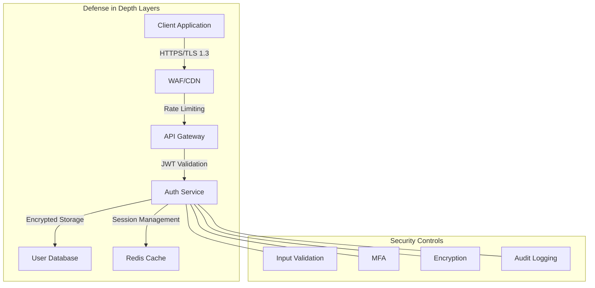
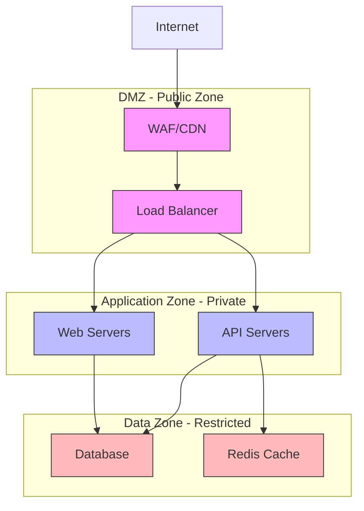
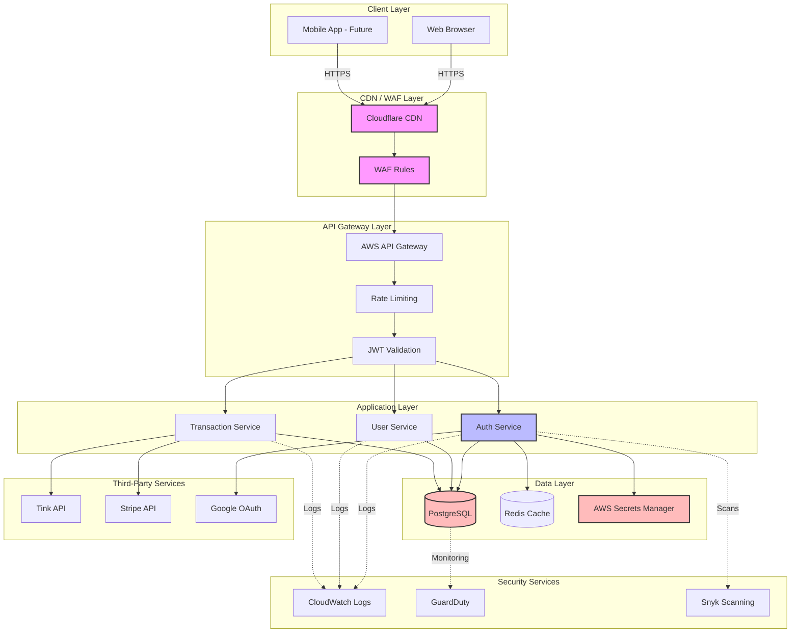

# Gate 0: Security Requirements Document

## Project Information
- **Project Name**: SUMA Finance
- **Feature**: User Registration & Authentication
- **Document Version**: 1.0
- **Date**: 2025-11-01
- **Classification**: Internal - Security Requirements

---

## 1. Security Overview

### Security Objectives
- **Confidentiality**: Protect user credentials, personal data, and authentication tokens from unauthorized access
- **Integrity**: Ensure authentication data cannot be tampered with or forged
- **Availability**: Maintain authentication service availability with 99.9% uptime SLA

### Security Architecture Principles
- **Defense in Depth**: Multiple layers of security controls (input validation, encryption, access controls)
- **Fail Securely**: Authentication failures default to deny access
- **Principle of Least Privilege**: Users granted minimum necessary permissions
- **Secure by Default**: All authentication mechanisms secure out-of-the-box

### Zero-Trust Security Model
- Never trust, always verify: All authentication requests validated regardless of source
- Verify explicitly: Multi-factor authentication for sensitive operations
- Assume breach: Session tokens rotated, activity monitored for anomalies

### Security Compliance Targets
- **GDPR**: User consent, data portability, right to deletion for EU users
- **PSD2**: Strong Customer Authentication (SCA) for financial transactions
- **ISO 27001**: Information security management best practices
- **OWASP Top 10**: Protection against web application vulnerabilities



---

## 2. Authentication Requirements

### Authentication Methods
- **Primary**: Username (email) + Password
- **Social Login**: Google OAuth 2.0, Apple Sign-In
- **Multi-Factor Authentication**: TOTP (Time-based One-Time Password)
- **Passwordless** (Future): Magic links via email

### Password Policy
- **Minimum Length**: 12 characters
- **Complexity Requirements**:
  - At least 1 uppercase letter
  - At least 1 lowercase letter
  - At least 1 number
  - At least 1 special character (!@#$%^&*()_+-=[]{}|;:,.<>?)
- **Expiration**: No forced expiration (per NIST guidelines)
- **History**: Prevent reuse of last 5 passwords
- **Dictionary Check**: Block common passwords (top 10,000 list)
- **Breach Detection**: Check against Have I Been Pwned API

### Multi-Factor Authentication (MFA)
- **Required For**:
  - Financial transactions
  - Account settings changes
  - Password reset
  - New device login
- **TOTP Implementation**:
  - Google Authenticator compatible
  - 6-digit codes
  - 30-second validity window
  - Backup codes (10 codes, single-use)
- **Future**: SMS fallback, Biometric (Face ID/Touch ID)

### Social Login Security
- **Google OAuth 2.0**:
  - Authorization Code flow with PKCE
  - Scope: `openid email profile`
  - Verify ID token signature
  - Validate `aud` and `iss` claims
- **Apple Sign-In**:
  - Native iOS/Android SDK
  - Verify JWT signature with Apple public keys
  - Handle "Hide My Email" feature
- **Account Linking**: Allow linking social accounts to existing email accounts

### Session Management
- **Session Timeout**:
  - Idle timeout: 30 minutes
  - Absolute timeout: 12 hours
  - Remember me: 30 days (requires re-authentication for sensitive actions)
- **Concurrent Sessions**: Maximum 5 active sessions per user
- **Session Invalidation**:
  - On password change: Invalidate all sessions
  - On logout: Invalidate current session
  - Manual revocation: User can revoke sessions from settings

### Login Attempt Limits
- **Rate Limiting**:
  - Per IP: 10 attempts per 15 minutes
  - Per account: 5 attempts per 15 minutes
- **Account Lockout**:
  - Lockout after 5 failed attempts
  - Lockout duration: 15 minutes
  - Unlock via email verification link
- **CAPTCHA**: Triggered after 3 failed attempts from same IP
- **Notification**: Email alert on suspicious login attempts

---

## 3. Authorization & Access Control

### Access Control Model
- **Role-Based Access Control (RBAC)**: Primary model
- **Attribute-Based Access Control (ABAC)**: For fine-grained permissions (future)

### User Roles
| Role | Permissions | Description |
|------|-------------|-------------|
| **User** | Own data access, Transaction viewing, Profile management | Standard authenticated user |
| **Premium User** | User permissions + Advanced analytics, Export data | Paid subscription tier |
| **Admin** | User management, System configuration, Audit logs | Internal administrators |
| **Super Admin** | All permissions, Role management, Security settings | Highest privilege level |

### Permission Granularity
- **Resource-level**: Access to accounts, transactions, budgets
- **Action-level**: Read, Create, Update, Delete permissions per resource
- **Field-level** (Future): Restrict access to specific fields (e.g., account balance)

### Least Privilege Principle
- New users start with minimal permissions (User role)
- Permissions granted explicitly, never implicitly
- Temporary privilege elevation for specific operations (step-up authentication)

### Segregation of Duties
- User management separated from financial operations
- Admin role cannot perform financial transactions on behalf of users
- Audit logs immutable, no admin deletion

### Admin Access Controls
- **Elevated Privileges**: Require MFA for all admin actions
- **Approval Workflows**: Super Admin approval required for:
  - Creating new admin accounts
  - Modifying security settings
  - Accessing production data
- **Session Duration**: Admin sessions expire after 15 minutes idle
- **IP Whitelist**: Admin access restricted to corporate IP ranges

---

## 4. Data Security

### Data Classification
| Classification | Examples | Security Requirements |
|----------------|----------|----------------------|
| **Public** | Marketing content, Help docs | No encryption required |
| **Internal** | User IDs, Transaction dates | Encryption in transit |
| **Confidential** | Email addresses, Names | Encryption at rest + in transit |
| **Restricted** | Passwords, Bank credentials, SSN | Encryption, Tokenization, Access logging |

### Encryption at Rest
- **Database Encryption**:
  - PostgreSQL transparent data encryption (TDE)
  - AES-256-GCM for column-level encryption
  - Encrypt: passwords (hashed), tokens, bank credentials
- **File Encryption**: AES-256-CBC for uploaded documents
- **Key Management**: AWS KMS with automatic key rotation (90 days)

### Encryption in Transit
- **TLS 1.3**: Mandatory for all client-server communication
- **TLS 1.2**: Minimum supported version
- **Certificate**: 2048-bit RSA or 256-bit ECDSA
- **HTTPS Only**: HSTS with `max-age=31536000; includeSubDomains; preload`
- **Certificate Pinning**: Mobile apps pin production certificates

### Encryption Algorithms
- **Symmetric**: AES-256 (GCM for authenticated encryption)
- **Asymmetric**: RSA-2048 minimum, RSA-4096 preferred
- **Hashing**: SHA-256 minimum, SHA-512 for critical operations
- **Password Hashing**: bcrypt with cost factor 12

### Key Management
- **Storage**: AWS KMS, HashiCorp Vault (backup)
- **Key Hierarchy**: Master keys → Data encryption keys → Data
- **Key Rotation**: Automatic every 90 days
- **Key Access**: Audit all key access, restrict to service accounts
- **Key Backup**: Encrypted backups stored in separate region

### Data Masking
- **Logs**: Mask email (u***@example.com), passwords (****), tokens
- **UI**: Mask bank account numbers (****1234), credit cards
- **Admin Interface**: Mask PII in user lists, unmask requires justification + logging

### Tokenization
- **Credit Cards**: Tokenize via Stripe, never store raw card data
- **Bank Credentials**: Tokenize via Tink, store tokens only
- **SSN/Tax ID**: Tokenize, store only last 4 digits in plaintext

---

## 5. API Security

### API Authentication
- **JWT Tokens**:
  - Access token: 15-minute expiry
  - Refresh token: 30-day expiry, single-use (rotation)
  - Signature algorithm: RS256 (RSA with SHA-256)
  - Include claims: `sub` (user ID), `iat`, `exp`, `roles`
- **API Keys**: For server-to-server integration (future)
  - UUID v4 format
  - SHA-256 hashed in database
  - Rate limited per key

### API Authorization
- **Scope-Based Access**: JWT includes `scope` claim (e.g., `read:transactions`)
- **Resource Ownership**: Validate user owns resource before access
- **Admin Endpoints**: Require `admin` role in JWT

### Rate Limiting
- **Per User**: 100 requests per minute
- **Per IP**: 1000 requests per minute
- **Per Endpoint**:
  - `/auth/login`: 10 requests per 15 minutes
  - `/auth/register`: 5 requests per hour
  - `/transactions`: 100 requests per minute
- **Response**: HTTP 429 with `Retry-After` header

### Input Validation
- **JSON Schema Validation**: All POST/PUT/PATCH requests
- **Type Checking**: Enforce string, number, boolean, array types
- **Length Limits**:
  - Email: 254 characters max
  - Password: 128 characters max
  - Text fields: 1000 characters default
- **Format Validation**: Email (RFC 5322), URLs (RFC 3986), Dates (ISO 8601)
- **Rejection**: Return HTTP 400 with detailed validation errors

### Output Encoding
- **JSON Encoding**: Use secure JSON serializers (prevent prototype pollution)
- **XSS Prevention**: Content-Type header set to `application/json`
- **Error Messages**: Generic errors, no stack traces in production

### CORS Policy
- **Allowed Origins**: `https://app.sumafinance.com`, `https://sumafinance.com`
- **Methods**: `GET, POST, PUT, DELETE`
- **Headers**: `Content-Type, Authorization`
- **Credentials**: `Access-Control-Allow-Credentials: true`
- **Preflight Cache**: `Access-Control-Max-Age: 86400`

### API Versioning
- **URL Versioning**: `/api/v1/`, `/api/v2/`
- **Deprecation Policy**: 6-month notice, sunset header
- **Backwards Compatibility**: Additive changes only in minor versions

---

## 6. Input Validation & Sanitization

### Client-Side Validation
- **Purpose**: User experience only, NOT security
- **Implementation**: Form validation, immediate feedback
- **Note**: All validation repeated server-side

### Server-Side Validation
- **Mandatory**: All inputs validated on server
- **Whitelist Approach**: Accept known-good inputs, reject rest
- **Validation Libraries**: Joi (Node.js), Pydantic (Python), Validator (Go)

### SQL Injection Prevention
- **Parameterized Queries**: All database queries use placeholders
- **ORM Usage**: SQLAlchemy (Python), GORM (Go), Prisma (Node.js)
- **Input Sanitization**: Escape special characters if raw SQL necessary
- **Example** (Python):
```python
# SECURE
cursor.execute("SELECT * FROM users WHERE email = %s", (email,))

# INSECURE - NEVER DO THIS
cursor.execute(f"SELECT * FROM users WHERE email = '{email}'")
```

### XSS Prevention
- **Output Encoding**: HTML entity encoding for user-generated content
- **Content Security Policy**: `default-src 'self'; script-src 'self'`
- **React**: Use JSX (auto-escapes), avoid `dangerouslySetInnerHTML`
- **Sanitize HTML**: DOMPurify for rich text content

### Command Injection Prevention
- **Avoid Shell Execution**: Use language libraries instead of shell commands
- **Input Sanitization**: Whitelist allowed characters if shell necessary
- **Example** (Node.js):
```javascript
// SECURE
const { spawn } = require('child_process');
spawn('ls', ['-l', userInput]); // Arguments passed as array

// INSECURE
exec(`ls -l ${userInput}`); // Command injection risk
```

### Path Traversal Prevention
- **Canonicalization**: Resolve paths to absolute, check prefix
- **Whitelist Directories**: Only allow access to upload directories
- **Example** (Python):
```python
import os
UPLOAD_DIR = "/var/www/uploads"
user_path = os.path.realpath(os.path.join(UPLOAD_DIR, filename))
if not user_path.startswith(UPLOAD_DIR):
    raise SecurityError("Invalid path")
```

### File Upload Validation
- **File Type**: Check MIME type AND file extension
- **Magic Bytes**: Verify file header matches declared type
- **Size Limits**: 5 MB for images, 10 MB for documents
- **Malware Scanning**: ClamAV scan before storage
- **Allowed Extensions**: `.jpg, .png, .pdf, .csv`
- **Storage**: Separate domain for uploads (e.g., `uploads.sumafinance.com`)

---

## 7. Session Security

### Session Token Generation
- **Cryptographically Secure**: Use `crypto.randomBytes(32)` (Node.js), `secrets.token_urlsafe(32)` (Python)
- **Token Length**: 256 bits minimum (32 bytes)
- **Format**: Base64URL encoding for URL safety

### Session Storage
- **Server-Side Sessions**: Redis for fast access, PostgreSQL for persistence
- **Session Data**:
  - User ID
  - Role
  - Login timestamp
  - Last activity timestamp
  - IP address (for anomaly detection)
- **Cookie-Based**: Encrypted, signed cookies for stateless sessions (fallback)

### Session Timeout
- **Idle Timeout**: 30 minutes of inactivity
- **Absolute Timeout**: 12 hours since login
- **Remember Me**: 30 days (stores refresh token, requires re-auth for sensitive actions)
- **Warning**: Notify user 5 minutes before timeout

### Session Fixation Prevention
- **Regenerate Session ID**: On login, privilege escalation, password change
- **Invalidate Old Sessions**: Previous session ID immediately invalidated
- **Example** (Express.js):
```javascript
app.post('/login', (req, res) => {
  // Authenticate user
  req.session.regenerate((err) => {
    req.session.userId = user.id;
    res.json({ success: true });
  });
});
```

### CSRF Protection
- **CSRF Tokens**: Synchronizer token pattern
- **Token Generation**: Unique per session, cryptographically random
- **Validation**: Verify token on all state-changing requests (POST, PUT, DELETE)
- **SameSite Cookies**: `SameSite=Lax` for GET, `SameSite=Strict` for sensitive
- **Double Submit**: Alternative pattern for stateless APIs

### Cookie Security
- **HttpOnly**: Prevent JavaScript access (`Set-Cookie: token=...; HttpOnly`)
- **Secure**: HTTPS only (`Secure` flag)
- **SameSite**: `SameSite=Lax` default, `Strict` for sensitive cookies
- **Domain**: Set explicit domain, avoid wildcard subdomains
- **Path**: Restrict to `/` or specific paths
- **Example**:
```
Set-Cookie: session=abc123; Secure; HttpOnly; SameSite=Strict; Max-Age=1800; Path=/
```

---

## 8. Password Security

### Password Hashing
- **Algorithm**: bcrypt (preferred), Argon2id (alternative)
- **Never Use**: MD5, SHA1, SHA256 (unsalted)
- **Library**: bcrypt.js (Node.js), bcrypt (Python), golang.org/x/crypto/bcrypt (Go)

### Salt Generation
- **Unique Salt**: Automatically generated per password by bcrypt
- **Salt Length**: 128 bits (16 bytes)
- **Storage**: Salt stored with hash (bcrypt format: `$2b$12$salt_and_hash`)

### Hash Iterations
- **bcrypt Cost Factor**: 12 (2^12 = 4096 iterations)
- **Performance**: Target 250-500ms per hash (adjust cost as hardware improves)
- **Future-Proofing**: Increase cost factor annually

### Password Reset
- **Token Generation**: Cryptographically secure random token (256 bits)
- **Token Storage**: SHA-256 hash of token stored in database
- **Token Expiration**: 1 hour validity
- **Single Use**: Token invalidated after use or on new request
- **Notification**: Email sent to user when reset requested
- **Rate Limiting**: 3 reset requests per hour per email

### Password Change
- **Require Current Password**: Verify old password before allowing change
- **Notify User**: Email confirmation sent after password change
- **Session Invalidation**: Logout all other sessions on password change
- **Prevent Reuse**: Check against last 5 passwords

### Password Storage
- **Never Store Plaintext**: Only store bcrypt hashes
- **No Reversible Encryption**: One-way hashing only
- **Example** (Python):
```python
import bcrypt

# Hashing
password = "user_password"
hashed = bcrypt.hashpw(password.encode(), bcrypt.gensalt(rounds=12))

# Verification
if bcrypt.checkpw(password.encode(), hashed):
    print("Password correct")
```

---

## 9. Secrets Management

### Environment Variables
- **Store In**: `.env` files (local), AWS Systems Manager Parameter Store (production)
- **Never Commit**: Add `.env` to `.gitignore`
- **Examples**:
  - `DATABASE_URL`
  - `JWT_SECRET`
  - `STRIPE_API_KEY`
  - `TINK_CLIENT_SECRET`

### Secret Storage
- **Development**: `.env` files (encrypted at rest)
- **Production**: AWS Secrets Manager or HashiCorp Vault
- **Access**: Service accounts only, IAM roles for AWS
- **Audit**: All secret access logged

### Secret Rotation
- **Schedule**: Every 90 days for critical secrets
- **Automated**: AWS Secrets Manager automatic rotation for RDS
- **Manual Rotation**: API keys, OAuth client secrets
- **Zero Downtime**: Support both old and new secrets during rotation period

### Secret Access Control
- **Principle of Least Privilege**: Services access only required secrets
- **IAM Policies**: Restrict secret access by service, environment
- **Example** (AWS IAM):
```json
{
  "Effect": "Allow",
  "Action": "secretsmanager:GetSecretValue",
  "Resource": "arn:aws:secretsmanager:us-east-1:123456789:secret:prod/db-password-*"
}
```

### Hardcoded Secrets Detection
- **Pre-commit Hooks**: git-secrets, detect-secrets
- **CI/CD Scanning**: TruffleHog, GitGuardian
- **Alerting**: Immediate notification on secret leak detection
- **Remediation**: Rotate secret immediately, invalidate leaked credentials

### Development Secrets
- **Separate Secrets**: Dev, staging, production use different credentials
- **Test Data**: Fake/synthetic data in development
- **Local Secrets**: Developers use personal `.env`, never shared
- **Example Structure**:
  - `.env.example` (template, committed)
  - `.env.local` (personal, ignored)
  - `.env.production` (production, never committed)

---

## 10. Security Headers

### Content-Security-Policy (CSP)
```
Content-Security-Policy: 
  default-src 'self';
  script-src 'self' https://cdn.sumafinance.com;
  style-src 'self' 'unsafe-inline';
  img-src 'self' data: https:;
  font-src 'self';
  connect-src 'self' https://api.sumafinance.com;
  frame-ancestors 'none';
  base-uri 'self';
  form-action 'self';
```
- **Purpose**: Prevent XSS, data injection attacks
- **Reporting**: Add `report-uri /csp-report` for violations

### X-Frame-Options
```
X-Frame-Options: DENY
```
- **Purpose**: Prevent clickjacking attacks
- **Alternative**: Use CSP `frame-ancestors 'none'`

### X-Content-Type-Options
```
X-Content-Type-Options: nosniff
```
- **Purpose**: Prevent MIME type sniffing
- **Effect**: Browser respects declared Content-Type

### Strict-Transport-Security (HSTS)
```
Strict-Transport-Security: max-age=31536000; includeSubDomains; preload
```
- **Purpose**: Force HTTPS connections
- **Preload**: Submit to Chrome HSTS preload list
- **Duration**: 1 year (31536000 seconds)

### X-XSS-Protection
```
X-XSS-Protection: 1; mode=block
```
- **Purpose**: Legacy XSS protection (deprecated in modern browsers)
- **Note**: CSP is preferred, but include for older browsers

### Referrer-Policy
```
Referrer-Policy: strict-origin-when-cross-origin
```
- **Purpose**: Control referrer information sent
- **Options**: `no-referrer`, `same-origin`, `strict-origin-when-cross-origin`

### Permissions-Policy
```
Permissions-Policy: 
  camera=(),
  microphone=(),
  geolocation=(self),
  payment=(self)
```
- **Purpose**: Control browser features
- **Effect**: Disable camera/microphone, restrict geolocation to same origin

---

## 11. Logging & Monitoring

### Security Event Logging
**Events to Log**:
- Successful/failed login attempts
- Password changes/resets
- MFA enrollment/usage
- Permission changes
- Account lockouts
- Session creation/invalidation
- API authentication failures
- Admin actions
- Unusual activity (e.g., login from new country)

### Log Content
**Include**:
- Timestamp (ISO 8601, UTC)
- User ID
- IP address
- User agent
- Action performed
- Resource accessed
- Result (success/failure)
- Session ID

**NEVER Log**:
- Passwords (plain or hashed)
- Authentication tokens
- Credit card numbers
- Bank credentials
- Personal health information
- Unencrypted PII

**Example Log Entry**:
```json
{
  "timestamp": "2025-11-01T10:30:00Z",
  "event": "login_attempt",
  "user_id": "user_12345",
  "email": "u***@example.com",
  "ip": "203.0.113.42",
  "user_agent": "Mozilla/5.0...",
  "result": "success",
  "mfa_used": true,
  "session_id": "sess_abc123"
}
```

### Log Retention
- **Hot Storage**: 90 days in Elasticsearch/CloudWatch
- **Warm Storage**: 1 year in S3 (compressed)
- **Cold Storage**: 7 years in Glacier (compliance requirement)
- **Deletion**: Automated deletion after retention period

### Log Protection
- **Tamper-Proof**: Write-once storage, no modification allowed
- **Encryption**: AES-256 encryption for archived logs
- **Access Control**: Restricted to security team, audit trail for access
- **Integrity**: SHA-256 hash chain for log entries

### Real-Time Monitoring
**Alerts**:
- Failed login attempts > 5 in 10 minutes
- Account lockout
- Login from new country/IP
- Admin privilege escalation
- Unusual API usage patterns
- Security header missing/modified

**Notification Channels**:
- Email to security team
- Slack #security-alerts channel
- PagerDuty for critical incidents

### Audit Trails
**User Actions**:
- Profile updates
- Email/phone changes
- Bank account linking/unlinking
- Transaction creation/modification
- Data export requests

**Admin Activities**:
- User account modifications
- Role assignments
- Security setting changes
- Production data access
- Secret rotations

**Immutable Audit Log**: Stored in separate database, no deletion/modification

---

## 12. Vulnerability Management

### Dependency Scanning
- **Tools**: Snyk, Dependabot, npm audit, pip-audit
- **Frequency**: Daily automated scans
- **CI/CD Integration**: Block builds with high/critical vulnerabilities
- **Notifications**: Slack alerts for new vulnerabilities
- **Remediation SLA**: Critical (24 hours), High (7 days), Medium (30 days)

### Security Patching
**SLA**:
- **Critical Vulnerabilities**: 24-hour patch
- **High Vulnerabilities**: 7-day patch
- **Medium Vulnerabilities**: 30-day patch
- **Low Vulnerabilities**: Next release cycle

**Process**:
1. Vulnerability identified
2. Impact assessment
3. Patch development/testing
4. Deploy to staging
5. Deploy to production
6. Verify fix
7. Document in changelog

### Penetration Testing
- **Frequency**: Annual external penetration test
- **Scope**: Web application, API, Infrastructure
- **Provider**: Third-party security firm (CREST certified)
- **Bug Bounty**: HackerOne program for continuous testing
- **Remediation**: Critical findings fixed before production release

### Security Code Review
- **Manual Review**: Security champion reviews high-risk code (auth, payment)
- **Automated SAST**: SonarQube, Semgrep in CI/CD pipeline
- **Automated DAST**: OWASP ZAP, Burp Suite automated scans
- **Pull Request Checks**: Security checklist for auth/payment PRs

### Vulnerability Disclosure
**Responsible Disclosure Policy**:
- **Contact**: security@sumafinance.com
- **Response Time**: Acknowledge within 24 hours
- **Disclosure Timeline**: 90 days after fix deployed
- **Rewards**: Bug bounty rewards for valid vulnerabilities
- **Public Disclosure**: Coordinated disclosure with researcher

### CVE Monitoring
- **Sources**: NVD, GitHub Security Advisories, vendor bulletins
- **Subscriptions**: Email alerts for dependencies (npm, PyPI, Go modules)
- **Tracking**: Jira tickets for each CVE affecting dependencies
- **Prioritization**: Risk-based prioritization (CVSS score + exploitability)

---

## 13. Infrastructure Security

### Network Segmentation


- **Public Zone**: Load balancer, CDN (accessible from internet)
- **Application Zone**: Application servers (no direct internet access)
- **Data Zone**: Databases, cache (only accessible from application zone)

### Firewall Rules
- **Whitelist Approach**: Deny all by default, allow specific traffic
- **Inbound Rules**:
  - Port 443 (HTTPS) from internet to load balancer
  - Port 80 (HTTP) redirect to 443
  - Port 22 (SSH) from corporate VPN only
- **Outbound Rules**:
  - Allow HTTPS to third-party APIs (Tink, Stripe)
  - Allow DNS queries
  - Deny all other traffic
- **Database**: Port 5432 (PostgreSQL) accessible only from app servers

### DDoS Protection
- **CDN**: Cloudflare with DDoS protection enabled
- **Rate Limiting**: Cloudflare rate limiting rules
- **Traffic Filtering**: Block malicious IPs, GeoIP blocking (if needed)
- **Capacity Planning**: Auto-scaling to handle traffic spikes
- **Monitoring**: Alerts on abnormal traffic patterns

### SSL/TLS Configuration
- **Protocol Versions**: TLS 1.3 (preferred), TLS 1.2 (minimum)
- **Cipher Suites** (priority order):
  - `TLS_AES_128_GCM_SHA256` (TLS 1.3)
  - `TLS_AES_256_GCM_SHA384` (TLS 1.3)
  - `ECDHE-RSA-AES128-GCM-SHA256` (TLS 1.2)
  - `ECDHE-RSA-AES256-GCM-SHA384` (TLS 1.2)
- **Disable**: SSLv3, TLS 1.0, TLS 1.1, RC4, 3DES
- **Testing**: SSL Labs A+ rating required

### Server Hardening
- **OS**: Ubuntu 22.04 LTS (latest patches)
- **Disable Unused Services**: FTP, Telnet, unnecessary daemons
- **Security Patches**: Automated with unattended-upgrades
- **SSH Hardening**:
  - Disable root login
  - Key-based authentication only (no passwords)
  - Change default port (optional)
  - Fail2ban for brute force protection
- **File Permissions**: Principle of least privilege, no world-writable files

### Container Security
- **Image Scanning**: Trivy, Clair scan for vulnerabilities
- **Base Images**: Use official, minimal base images (Alpine, Distroless)
- **Non-Root Users**: Containers run as non-root user
- **Read-Only Filesystem**: Where possible, mount filesystem as read-only
- **Resource Limits**: CPU/memory limits to prevent resource exhaustion
- **Secrets**: Inject via environment variables, never bake into images

---

## 14. Mobile Security (Future Consideration)

### Certificate Pinning
- **Implementation**: Pin production SSL certificate public key
- **Pinning Method**: Public key pinning (more flexible than cert pinning)
- **Backup Pins**: Include backup certificate for rotation
- **Expiration Handling**: Graceful fallback if pin expired

### Jailbreak/Root Detection
- **Purpose**: Detect compromised devices
- **Detection Methods**:
  - Check for Cydia, SuperSU apps
  - Attempt to write to system directories
  - Check for hooking frameworks
- **Response**: Warn user, block sensitive operations (not full block)

### Secure Local Storage
- **iOS**: Keychain for tokens, encrypted UserDefaults for settings
- **Android**: EncryptedSharedPreferences, Keystore for keys
- **Never Store**: Plaintext passwords, unencrypted tokens, sensitive PII

### Code Obfuscation
- **iOS**: Bitcode, strip symbols, obfuscate strings
- **Android**: ProGuard/R8 for minification and obfuscation
- **Purpose**: Raise difficulty of reverse engineering (not foolproof)

### Biometric Authentication
- **iOS**: Face ID, Touch ID via LocalAuthentication framework
- **Android**: BiometricPrompt API
- **Fallback**: PIN/password if biometric fails
- **Sensitive Operations**: Require biometric for payments, account changes

### App Transport Security (iOS)
- **ATS Compliance**: Enforce HTTPS, TLS 1.2+
- **Exceptions**: Only for specific domains if absolutely necessary
- **Configuration** (Info.plist):
```xml
<key>NSAppTransportSecurity</key>
<dict>
    <key>NSAllowsArbitraryLoads</key>
    <false/>
</dict>
```

---

## 15. Third-Party Security

### Vendor Security Assessment
**Tink (Bank Aggregation)**:
- **Compliance**: PSD2, GDPR compliant
- **Data Storage**: User bank credentials never stored by us (Tink handles)
- **Data Sharing**: Only transaction data retrieved, no credential exposure
- **Assessment**: Review Tink SOC2 report, security whitepaper

**Stripe (Payment Processing)**:
- **PCI-DSS**: Stripe is PCI-DSS Level 1 compliant
- **Tokenization**: Use Stripe.js to tokenize cards client-side
- **Data Storage**: Never store card data, only Stripe tokens
- **Assessment**: Review Stripe security documentation

**Google OAuth / Apple Sign-In**:
- **Data Minimization**: Request only necessary scopes (email, profile)
- **Token Validation**: Verify ID token signature server-side
- **Privacy**: Handle Apple "Hide My Email" feature

### Third-Party API Security
- **API Key Management**: Store in secrets manager, rotate every 90 days
- **Scoped Access**: Request minimal necessary permissions from third parties
- **Network Restrictions**: Restrict API access to production IPs (if supported)
- **Monitoring**: Log all third-party API calls, alert on errors

### SDK Vetting
**Process**:
1. Review SDK security documentation
2. Check for known vulnerabilities (CVE search)
3. Review permissions requested (mobile SDKs)
4. Audit source code if open-source
5. Test in isolated environment
6. Monitor for supply chain attacks (GitHub Dependabot)

**Approved SDKs**:
- @stripe/stripe-js (payment processing)
- Tink Link SDK (bank aggregation)
- Google Sign-In SDK (social login)

### Data Sharing Agreements
**What Data is Shared**:
- Tink: User consent, bank credentials (Tink-only access)
- Stripe: Transaction amounts, user email (for receipts)
- Google/Apple: User email, name (with consent)

**How It's Protected**:
- HTTPS/TLS for all data transfers
- Encrypted storage at third-party
- GDPR Data Processing Agreements (DPA) signed
- Regular security audits

### Supply Chain Security
- **Package Integrity**: Use lock files (package-lock.json, go.sum)
- **Hash Verification**: Verify package hashes before installation
- **Private Registry**: Mirror critical packages in private registry (optional)
- **Dependency Review**: Manual review for new dependencies
- **Automated Scanning**: Snyk, Dependabot for vulnerability detection

---

## 16. Incident Response

### Incident Response Plan
**Roles**:
- **Incident Commander**: CTO or Security Lead
- **Technical Lead**: Senior Engineer
- **Communications Lead**: Product Manager
- **Legal/Compliance**: Legal Counsel (if data breach)

**Escalation**:
1. **Low**: Developer → Team Lead
2. **Medium**: Team Lead → Engineering Manager
3. **High**: Engineering Manager → CTO
4. **Critical**: CTO → CEO + Legal

### Incident Classification
| Severity | Definition | Response Time | Examples |
|----------|------------|---------------|----------|
| **Critical** | Service down, data breach | 15 minutes | Database compromised, Authentication bypass |
| **High** | Security vulnerability actively exploited | 1 hour | SQL injection exploited, DDoS attack |
| **Medium** | Vulnerability discovered, not exploited | 4 hours | Unpatched dependency, Misconfigured security header |
| **Low** | Minor security finding, no immediate risk | 24 hours | Outdated documentation, Low-risk CVE |

### Incident Detection
- **Automated Monitoring**: CloudWatch, Datadog alerts
- **Security Tools**: WAF alerts, IDS/IPS alerts
- **User Reports**: security@sumafinance.com
- **Bug Bounty**: HackerOne submissions
- **Manual Discovery**: Code review, penetration test findings

### Incident Containment
**Immediate Actions**:
1. **Assess Scope**: Determine affected systems, users, data
2. **Isolate**: Block malicious IPs, disable compromised accounts
3. **Preserve Evidence**: Take snapshots, export logs
4. **Notify Stakeholders**: Inform incident response team

**Containment Strategies**:
- **Authentication Bypass**: Invalidate all sessions, force re-login
- **SQL Injection**: Block offending IPs, patch vulnerability
- **Data Breach**: Rotate secrets, reset affected user passwords

### Incident Recovery
1. **Patch Vulnerability**: Deploy fix to production
2. **Verify Fix**: Security testing, penetration test
3. **Restore Services**: Gradual rollout, monitor for issues
4. **Data Recovery**: Restore from backups if data corrupted
5. **User Communication**: Notify affected users (if required)

### Post-Incident Review
**Within 48 Hours**:
1. **Root Cause Analysis**: Why did incident occur?
2. **Timeline**: Document timeline of events
3. **Impact Assessment**: Users affected, data exposed
4. **Lessons Learned**: What went well, what didn't
5. **Action Items**: Preventive measures, process improvements
6. **Documentation**: Write incident report

**Follow-Up**:
- Update runbooks
- Implement preventive controls
- Schedule training if human error involved

---

## 17. Backup & Disaster Recovery

### Backup Frequency
- **Database**: 
  - Full backup: Daily at 2 AM UTC
  - Incremental backup: Every 6 hours
  - Point-in-time recovery: 5-minute granularity
- **Files/Documents**: Daily backup to S3
- **Secrets**: Weekly backup of secrets manager (encrypted)

### Backup Encryption
- **Algorithm**: AES-256-GCM
- **Key Management**: AWS KMS, separate key for backups
- **In-Transit**: TLS 1.3 for backup transfers
- **At-Rest**: S3 server-side encryption (SSE-KMS)

### Backup Testing
- **Monthly**: Restore backup to staging environment
- **Quarterly**: Full disaster recovery drill
- **Validation**: Verify data integrity, application functionality
- **Documentation**: Update recovery procedures based on test results

### Disaster Recovery Plan
**Recovery Objectives**:
- **RTO (Recovery Time Objective)**: 4 hours
- **RPO (Recovery Point Objective)**: 5 minutes

**Disaster Scenarios**:
- Database failure
- Regional AWS outage
- Ransomware attack
- Accidental data deletion

**Recovery Steps**:
1. Assess scope of disaster
2. Activate disaster recovery team
3. Failover to secondary region (if regional outage)
4. Restore from backup (if data loss)
5. Verify system functionality
6. Resume normal operations
7. Post-mortem analysis

### Failover Procedures
**Database Failover**:
- **Primary**: AWS RDS Multi-AZ (automatic failover)
- **Cross-Region**: Read replica in secondary region (manual promotion)
- **Failover Time**: 1-2 minutes for Multi-AZ, 15-30 minutes for cross-region

**Application Failover**:
- **Active-Active**: Load balanced across multiple AZs
- **Active-Passive**: Secondary region on standby (manual activation)
- **DNS Failover**: Route53 health checks, automatic failover

### Business Continuity
**Alternative Systems**:
- Read-only mode if database unavailable
- Cached data for basic functionality
- Status page for user communication

**Communication Plan**:
- Internal: Slack #incidents channel
- External: Status page (status.sumafinance.com)
- Email: Mass notification to affected users
- Social Media: Twitter updates for major outages

---

## 18. Privacy & Data Protection

### Personal Data Inventory
**PII Collected**:
- Email address (required for registration)
- Name (optional, user-provided)
- Phone number (optional, for MFA)
- IP address (logged for security)
- Bank account numbers (via Tink, tokenized)

**Storage Locations**:
- PostgreSQL database (encrypted at rest)
- Redis cache (session data, encrypted)
- Logs (masked PII)
- Backups (encrypted)

### Data Minimization
- **Registration**: Only email + password required
- **Optional Fields**: Name, phone collected only if user provides
- **Bank Data**: Only transaction data retrieved, no credentials stored
- **Retention**: Delete data no longer needed

### Consent Management
- **Registration Consent**: User agrees to Terms of Service, Privacy Policy
- **Marketing Consent**: Opt-in checkbox for marketing emails (unchecked by default)
- **Bank Linking Consent**: Explicit consent via Tink Link flow
- **Cookie Consent**: GDPR-compliant cookie banner
- **Consent Withdrawal**: User can revoke consent in settings

### Right to Access
- **Data Export**: User can download all personal data (JSON format)
- **Request Process**: In-app "Download My Data" button
- **Response Time**: Data delivered within 48 hours
- **Data Included**: Profile, transactions, settings, audit logs

### Right to Deletion
- **User Deletion**: In-app "Delete Account" button
- **Confirmation**: Re-authenticate before deletion
- **Grace Period**: 30-day soft delete (account recoverable)
- **Hard Delete**: After 30 days, all user data permanently deleted
- **Exceptions**: Legal/compliance data retained (transaction logs for 7 years)
- **Third-Party**: Notify Tink, Stripe to delete user data

### Privacy Policy
- **Transparency**: Clear disclosure of data collection, usage, sharing
- **Accessibility**: Linked from registration, settings, footer
- **Updates**: Users notified of material changes via email
- **Review**: Annual legal review, updates as needed

### Cookie Consent (GDPR)
- **Cookie Banner**: Displayed on first visit
- **Granular Consent**: Separate consent for necessary, analytics, marketing cookies
- **Necessary Cookies**: Session, authentication (no consent required)
- **Analytics Cookies**: Google Analytics (consent required)
- **Opt-Out**: User can revoke consent in settings

---

## 19. Secure Development Lifecycle

### Security Requirements
- **User Stories**: Include security acceptance criteria
  - Example: "As a user, I want my password to be securely hashed using bcrypt"
- **Threat Modeling**: Per-feature threat analysis during design phase
- **Security Checklist**: Reviewed during sprint planning

### Threat Modeling
**Process** (STRIDE Framework):
- **Spoofing**: Can attacker impersonate another user?
- **Tampering**: Can attacker modify data?
- **Repudiation**: Can user deny actions?
- **Information Disclosure**: Can attacker access sensitive data?
- **Denial of Service**: Can attacker make system unavailable?
- **Elevation of Privilege**: Can attacker gain unauthorized permissions?

**Example** (User Registration):
| Threat | Scenario | Mitigation |
|--------|----------|------------|
| Spoofing | Attacker registers with someone else's email | Email verification required |
| Information Disclosure | Attacker enumerates registered emails | Generic error message ("Check your email") |
| Denial of Service | Attacker sends millions of registration requests | Rate limiting (5 per hour) |

### Secure Coding Standards
- **OWASP Guidelines**: Follow OWASP Top 10 mitigations
- **Language Standards**:
  - JavaScript/TypeScript: Airbnb Style Guide + security rules
  - Python: PEP 8 + security best practices
  - Go: Effective Go + secure coding practices
- **Security Linters**: ESLint security plugins, Bandit (Python), Gosec (Go)

### Code Review
**Security Review Checklist**:
- [ ] Input validation on all user inputs
- [ ] Parameterized queries (no string concatenation)
- [ ] Authentication/authorization checks
- [ ] Sensitive data not logged
- [ ] HTTPS for all external requests
- [ ] Secrets not hardcoded
- [ ] Error messages generic (no stack traces)
- [ ] CSRF protection on state-changing endpoints
- [ ] Security headers configured

**Review Process**:
- All code requires 1 approval
- Security-critical code (auth, payment) requires security champion approval
- Automated security checks in CI/CD

### Security Testing
**SAST (Static Application Security Testing)**:
- SonarQube: Code quality + security vulnerabilities
- Semgrep: Pattern-based security rule enforcement
- Frequency: Every commit (CI/CD)

**DAST (Dynamic Application Security Testing)**:
- OWASP ZAP: Automated vulnerability scanning
- Burp Suite: Manual penetration testing
- Frequency: Weekly automated scans, quarterly manual tests

**Dependency Scanning**:
- Snyk: Scan for vulnerable dependencies
- npm audit / pip-audit: Language-specific tools
- Frequency: Daily scans, CI/CD blocking

### Security Training
**Topics**:
- OWASP Top 10 vulnerabilities
- Secure coding practices per language
- Authentication/authorization best practices
- Secrets management
- Incident response procedures

**Frequency**:
- Onboarding: Security training for all new developers
- Quarterly: Lunch & Learn security sessions
- Annual: Formal security training (online course)

**Resources**:
- OWASP Cheat Sheets
- PortSwigger Web Security Academy
- Internal security wiki

---

## 20. Compliance Requirements

### GDPR (EU General Data Protection Regulation)
**Applicability**: If serving EU users

**Requirements**:
- **Data Protection Officer (DPO)**: Designate DPO if processing large volumes of EU data
- **Lawful Basis**: Consent (user registration), Legitimate interest (fraud prevention)
- **User Rights**: Access, Rectification, Erasure, Portability, Object to processing
- **Data Breach Notification**: Notify supervisory authority within 72 hours
- **Privacy by Design**: Security built into system architecture
- **Data Processing Agreement (DPA)**: With all third-party processors (Tink, Stripe)

**Implementation**:
- Privacy policy with GDPR disclosures
- Cookie consent banner
- User data export/delete functionality
- DPA signed with vendors
- Data breach response plan

### PSD2 (Payment Services Directive 2)
**Applicability**: If providing payment services to EU users

**Requirements**:
- **Strong Customer Authentication (SCA)**: Two-factor authentication for payments
- **Open Banking**: Allow third-party access to user accounts (via Tink)
- **Transaction Monitoring**: Monitor for fraud
- **Data Security**: Encryption, secure communication

**Implementation**:
- MFA for payments
- Tink integration for open banking
- TLS 1.3 for all API communication
- Fraud detection system

### SOC 2 (Service Organization Control 2)
**Applicability**: If targeting enterprise customers

**Trust Service Criteria**:
- **Security**: System protected against unauthorized access
- **Availability**: System available per SLA
- **Processing Integrity**: Processing complete, accurate, timely
- **Confidentiality**: Confidential information protected
- **Privacy**: Personal information managed per privacy notice

**Implementation**:
- Annual SOC 2 Type II audit
- Access control policies
- Incident response plan
- Backup/disaster recovery
- Vendor management

### PCI-DSS (Payment Card Industry Data Security Standard)
**Applicability**: If handling credit card data

**Requirements**:
- **Never Store**: CVV, full track data
- **Tokenization**: Use Stripe for card tokenization
- **Network Segmentation**: Isolate payment processing
- **Encryption**: TLS for transmission, encryption at rest
- **Access Control**: Restrict access to cardholder data

**Implementation**:
- Stripe.js tokenizes cards client-side (SAQ A compliance)
- No card data stored in our systems
- PCI-compliant hosting (AWS)
- Annual PCI-DSS self-assessment (SAQ A)

### ISO 27001 (Information Security Management)
**Applicability**: Optional, for enterprise credibility

**Requirements**:
- Information security policy
- Risk assessment
- Asset management
- Access control
- Cryptography
- Physical security
- Operations security
- Incident management
- Business continuity
- Compliance

**Implementation**:
- Develop ISMS (Information Security Management System)
- Annual risk assessments
- Security policies documented
- ISO 27001 certification (optional)

### Regulatory Audits
**Preparation**:
- Maintain security documentation (policies, procedures, architecture)
- Evidence collection (logs, access reviews, training records)
- Internal audit before external audit
- Assign audit liaison

**During Audit**:
- Provide requested documentation
- Demonstrate security controls
- Answer auditor questions
- Track audit findings

**Post-Audit**:
- Remediate findings per priority
- Update documentation
- Continuous improvement

---

## Threat Scenarios & Mitigations

### Scenario 1: Credential Stuffing Attack
**Threat**: Attacker uses leaked credentials from other breaches to attempt login.

**Mitigations**:
- Rate limiting (10 attempts per 15 minutes per IP)
- Account lockout after 5 failed attempts
- CAPTCHA after 3 failed attempts
- Password breach detection (Have I Been Pwned)
- MFA for high-risk logins (new device, new country)
- Notify user of failed login attempts

### Scenario 2: Session Hijacking
**Threat**: Attacker steals session token via XSS or network sniffing.

**Mitigations**:
- HttpOnly cookies (prevent XSS access)
- Secure flag (HTTPS only)
- SameSite=Strict for sensitive cookies
- TLS 1.3 (prevent MITM)
- Session regeneration on privilege escalation
- Anomaly detection (login from different country)

### Scenario 3: SQL Injection
**Threat**: Attacker injects malicious SQL via user input.

**Mitigations**:
- Parameterized queries (100% coverage)
- ORM usage (SQLAlchemy, Prisma, GORM)
- Input validation (whitelist approach)
- Least privilege database user (no DROP, ALTER)
- WAF with SQL injection rules
- Regular code audits

### Scenario 4: API Rate Limiting Bypass
**Threat**: Attacker bypasses rate limiting by rotating IPs.

**Mitigations**:
- Per-user rate limiting (JWT-based)
- Per-account rate limiting (database-backed)
- Distributed rate limiting (Redis)
- Device fingerprinting
- CAPTCHA on suspicious activity
- Block known VPN/proxy IPs (optional)

### Scenario 5: Insider Threat
**Threat**: Malicious employee accesses production data.

**Mitigations**:
- Least privilege access (no default production access)
- Audit all production data access
- Require justification for access requests
- MFA for admin access
- Separation of duties (no single person has full access)
- Background checks for employees with data access

---

## Security Architecture Diagram



---

## Implementation Examples

### Example 1: Secure Password Hashing (Node.js)
```javascript
const bcrypt = require('bcrypt');

// Registration
async function registerUser(email, password) {
  // Validate password strength
  if (password.length < 12) {
    throw new Error('Password must be at least 12 characters');
  }
  
  // Hash password
  const saltRounds = 12;
  const hashedPassword = await bcrypt.hash(password, saltRounds);
  
  // Save to database
  await db.users.create({
    email,
    password: hashedPassword,
    created_at: new Date()
  });
}

// Login
async function loginUser(email, password) {
  const user = await db.users.findOne({ email });
  if (!user) {
    throw new Error('Invalid credentials'); // Generic error
  }
  
  const isValid = await bcrypt.compare(password, user.password);
  if (!isValid) {
    throw new Error('Invalid credentials'); // Generic error
  }
  
  return user;
}
```

### Example 2: JWT Token Generation (Python)
```python
import jwt
from datetime import datetime, timedelta

SECRET_KEY = os.getenv('JWT_SECRET')

def generate_access_token(user_id: str, roles: list[str]) -> str:
    """Generate access token (15-minute expiry)"""
    payload = {
        'sub': user_id,
        'roles': roles,
        'iat': datetime.utcnow(),
        'exp': datetime.utcnow() + timedelta(minutes=15),
        'type': 'access'
    }
    return jwt.encode(payload, SECRET_KEY, algorithm='RS256')

def generate_refresh_token(user_id: str) -> str:
    """Generate refresh token (30-day expiry)"""
    payload = {
        'sub': user_id,
        'iat': datetime.utcnow(),
        'exp': datetime.utcnow() + timedelta(days=30),
        'type': 'refresh'
    }
    return jwt.encode(payload, SECRET_KEY, algorithm='RS256')

def verify_token(token: str) -> dict:
    """Verify and decode JWT token"""
    try:
        payload = jwt.decode(token, SECRET_KEY, algorithms=['RS256'])
        return payload
    except jwt.ExpiredSignatureError:
        raise AuthError('Token expired')
    except jwt.InvalidTokenError:
        raise AuthError('Invalid token')
```

### Example 3: SQL Injection Prevention (Go)
```go
package repository

import (
    "database/sql"
    _ "github.com/lib/pq"
)

// SECURE: Parameterized query
func GetUserByEmail(db *sql.DB, email string) (*User, error) {
    query := "SELECT id, email, name FROM users WHERE email = $1"
    row := db.QueryRow(query, email) // Parameter passed separately
    
    var user User
    err := row.Scan(&user.ID, &user.Email, &user.Name)
    if err != nil {
        return nil, err
    }
    return &user, nil
}

// INSECURE: String concatenation (NEVER DO THIS)
func GetUserByEmailInsecure(db *sql.DB, email string) (*User, error) {
    query := "SELECT id, email, name FROM users WHERE email = '" + email + "'"
    // Vulnerable to SQL injection if email = "'; DROP TABLE users; --"
    row := db.QueryRow(query)
    // ... rest of code
}
```

### Example 4: Rate Limiting Middleware (Express.js)
```javascript
const rateLimit = require('express-rate-limit');
const RedisStore = require('rate-limit-redis');
const redis = require('redis');

const redisClient = redis.createClient();

// Login rate limiter
const loginLimiter = rateLimit({
  store: new RedisStore({
    client: redisClient,
    prefix: 'rl:login:'
  }),
  windowMs: 15 * 60 * 1000, // 15 minutes
  max: 10, // 10 requests per window
  message: 'Too many login attempts, please try again later',
  standardHeaders: true,
  legacyHeaders: false,
  keyGenerator: (req) => {
    // Rate limit by IP + email
    return `${req.ip}:${req.body.email}`;
  }
});

// Apply to login route
app.post('/api/auth/login', loginLimiter, loginController);
```

---

## References

### OWASP Resources
- **OWASP Top 10 2021**: https://owasp.org/Top10/
- **OWASP Cheat Sheet Series**: https://cheatsheetseries.owasp.org/
- **OWASP ASVS (Application Security Verification Standard)**: https://owasp.org/www-project-application-security-verification-standard/

### Security Standards
- **NIST Cybersecurity Framework**: https://www.nist.gov/cyberframework
- **CWE Top 25 (Common Weakness Enumeration)**: https://cwe.mitre.org/top25/
- **PCI-DSS v4.0**: https://www.pcisecuritystandards.org/

### Compliance
- **GDPR**: https://gdpr.eu/
- **PSD2**: https://ec.europa.eu/info/law/payment-services-psd-2-directive-eu-2015-2366_en
- **SOC 2**: https://www.aicpa.org/soc

### Tools & Libraries
- **bcrypt**: https://github.com/kelektiv/node.bcrypt.js
- **JWT**: https://jwt.io/
- **Snyk**: https://snyk.io/
- **OWASP ZAP**: https://www.zaproxy.org/

---

## Sign-Off

This Security Requirements document has been generated for **SUMA Finance - User Registration & Authentication** feature.

**Next Steps**:
1. Review with security team
2. Implement security controls per priority (Critical → High → Medium)
3. Conduct threat modeling session
4. Update during development as new threats identified
5. Security testing before production deployment

**Document Status**: ✅ Gate 0 - Security Requirements Complete