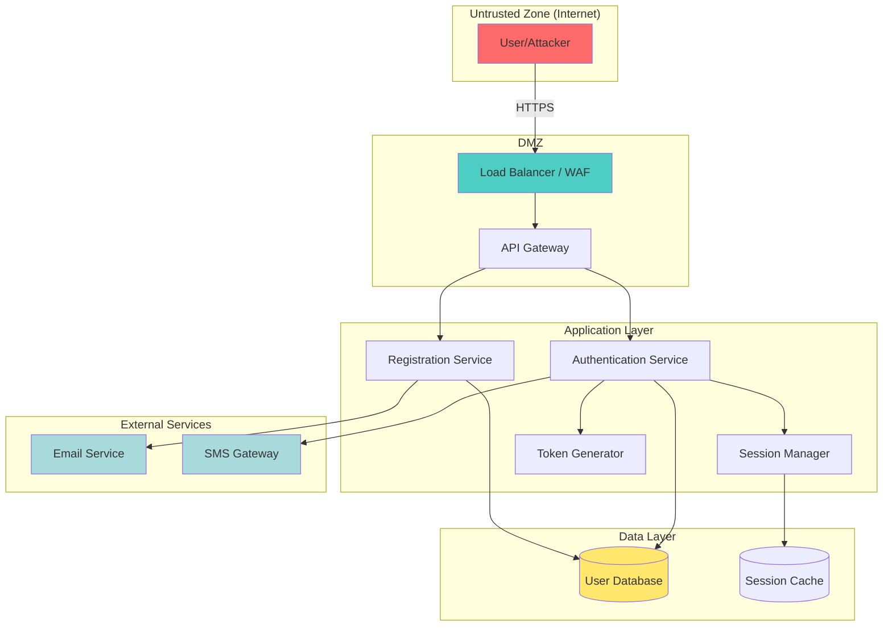
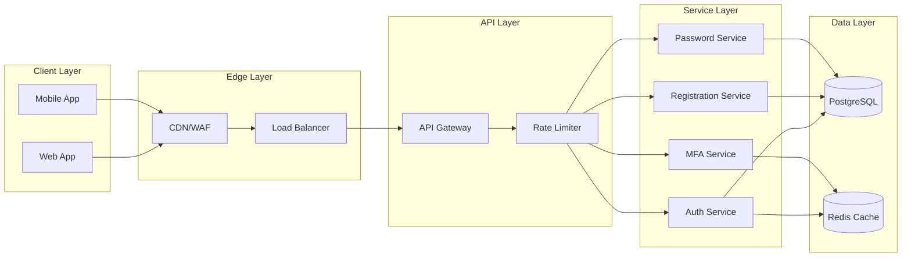
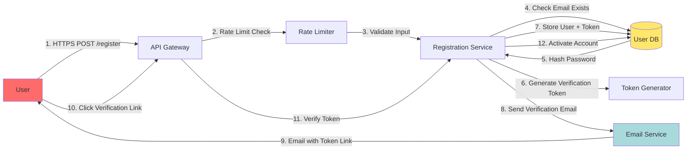
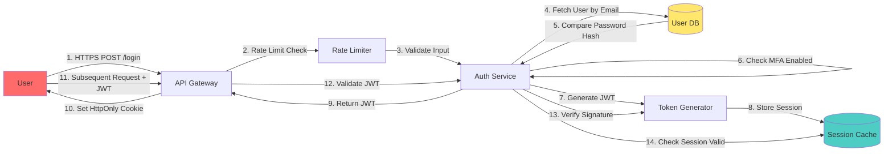
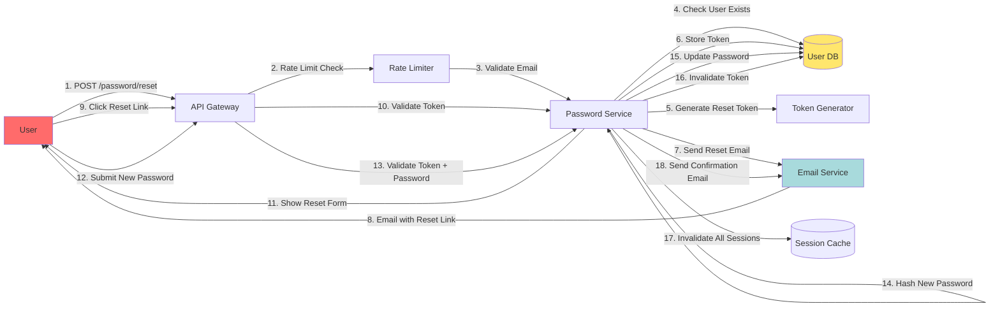
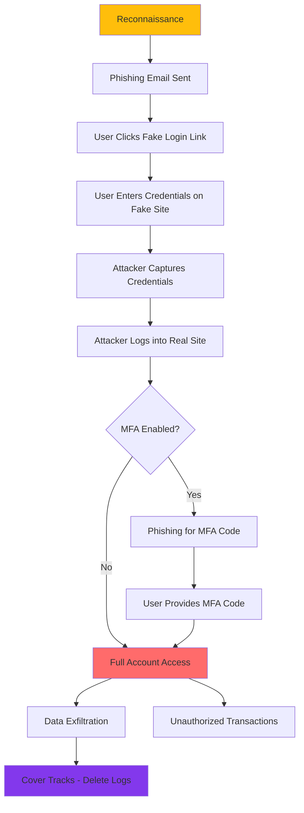
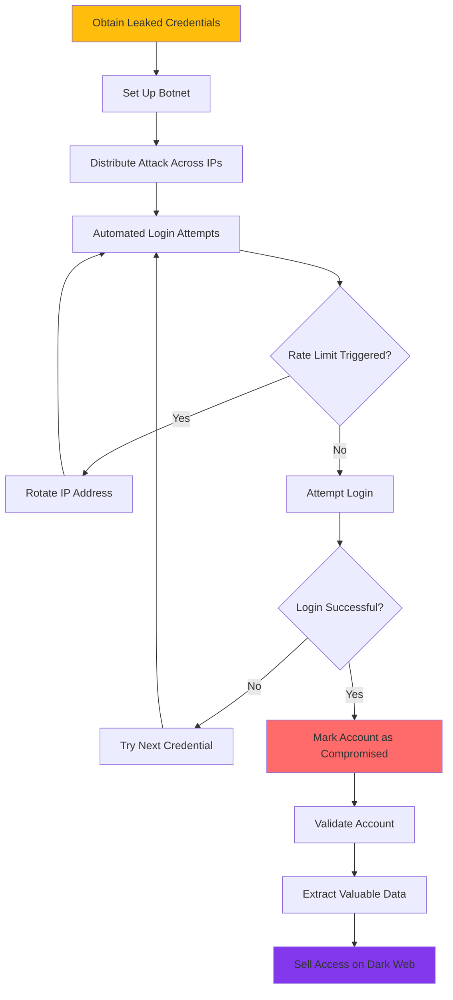
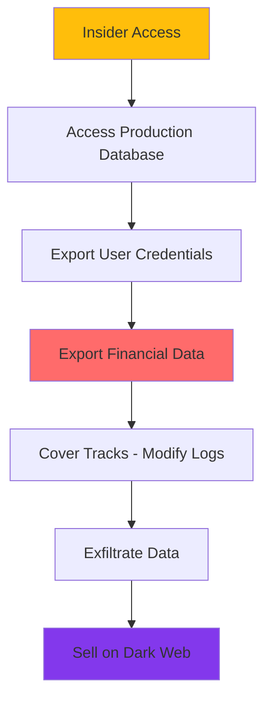

# Security Threat Model - SUMA Finance User Registration & Authentication

## 1. Threat Modeling Overview

### Methodology
This threat model uses **STRIDE** (Spoofing, Tampering, Repudiation, Information Disclosure, Denial of Service, Elevation of Privilege) as the primary framework, supplemented with:
- **DREAD** for risk scoring (Damage, Reproducibility, Exploitability, Affected Users, Discoverability)
- **Attack Trees** for scenario modeling
- **OWASP Top 10** for web application threats

### Scope
- User registration endpoints and workflows
- User authentication mechanisms (login, logout, session management)
- Password management (reset, change)
- Token generation and validation
- Session management
- Multi-factor authentication (if implemented)

### Assets to Protect
1. **User credentials** (passwords, tokens, MFA secrets)
2. **User personal data** (email, phone, profile information)
3. **Session tokens** (JWT, session cookies)
4. **Authentication endpoints** (login, register, password reset)
5. **User database** (user table with credentials)
6. **API keys and secrets** (JWT signing keys, encryption keys)

### Trust Boundaries
- **External → DMZ**: Internet users accessing web/mobile applications
- **DMZ → Application Layer**: Load balancer to application servers
- **Application Layer → Data Layer**: Application servers to database
- **Application Layer → External Services**: Email service, SMS gateway for MFA

### Threat Model Diagram



## 2. System Architecture Overview

### High-Level Architecture
The authentication system consists of:
- **Frontend**: Web application (React/Angular/Vue) and mobile apps (iOS/Android)
- **API Gateway**: Entry point for all authentication requests
- **Authentication Service**: Handles login, token validation, MFA
- **Registration Service**: Handles user signup and email verification
- **Session Manager**: Manages active sessions and token refresh
- **User Database**: Stores user credentials (hashed passwords) and profile data
- **Session Cache**: Redis/Memcached for active session tokens

### Trust Boundaries
1. **Internet ↔ Load Balancer**: TLS termination, DDoS protection
2. **Load Balancer ↔ API Gateway**: Internal network, API authentication
3. **API Gateway ↔ Services**: Service-to-service authentication (mTLS)
4. **Services ↔ Database**: Encrypted connections, database credentials

### Entry Points
- `POST /api/v1/auth/register` - User registration
- `POST /api/v1/auth/login` - User login
- `POST /api/v1/auth/logout` - User logout
- `POST /api/v1/auth/refresh` - Token refresh
- `POST /api/v1/auth/password/reset` - Password reset request
- `POST /api/v1/auth/password/change` - Password change
- `POST /api/v1/auth/verify-email` - Email verification
- `POST /api/v1/auth/mfa/enable` - Enable MFA
- `POST /api/v1/auth/mfa/verify` - Verify MFA code

### Data Stores
- **Users table**: `user_id`, `email`, `password_hash`, `created_at`, `verified`, `mfa_enabled`, `mfa_secret`
- **Sessions table**: `session_id`, `user_id`, `token`, `expires_at`, `ip_address`, `user_agent`
- **Password reset tokens table**: `token`, `user_id`, `expires_at`
- **Session cache**: Active JWT tokens, refresh tokens

### External Dependencies
- **Email service**: SendGrid, AWS SES, Mailgun for verification emails
- **SMS gateway**: Twilio, AWS SNS for MFA codes
- **Cloud provider**: AWS/Azure/GCP for hosting
- **CDN**: Cloudflare, Akamai for DDoS protection

### Network Architecture
```
[Internet] → [CDN/WAF] → [Load Balancer] → [API Gateway] → [Auth Services] → [Database]
```

### Architecture Diagram



## 3. Asset Identification

| Asset Name | Asset Type | Sensitivity Level | Impact if Compromised | Storage Location | Access Controls |
|------------|-----------|-------------------|----------------------|------------------|----------------|
| User Passwords | Credential | Restricted | Critical - Account takeover, identity theft | Database (hashed with bcrypt) | Application layer only, encrypted at rest |
| JWT Signing Keys | Credential | Restricted | Critical - Mass token forgery, system-wide breach | Key management service | Service layer only, HSM-backed |
| User Email Addresses | Data | Confidential | High - Phishing, identity theft, spam | Database | Authenticated users, admin access |
| User Phone Numbers | Data | Confidential | High - SMS phishing, identity theft | Database | Authenticated users, admin access |
| Session Tokens (JWT) | Credential | Restricted | High - Session hijacking, unauthorized access | Redis cache, client-side | Token owner only |
| MFA Secrets (TOTP) | Credential | Restricted | Critical - MFA bypass, account takeover | Database (encrypted) | Application layer only |
| Password Reset Tokens | Credential | Confidential | High - Account takeover via token theft | Database | Token owner only, time-limited |
| Email Verification Tokens | Credential | Internal | Medium - Unauthorized account activation | Database | Token owner only, time-limited |
| User Profile Data | Data | Internal | Medium - Privacy violation, data breach | Database | User owner, admins |
| Session Metadata | Data | Internal | Low - Privacy concern, user tracking | Database, logs | Application layer, admin access |
| API Rate Limit Counters | Data | Public | Low - Service availability information | Redis cache | Application layer |
| Failed Login Attempts | Data | Internal | Low - Brute force detection bypass | Database, logs | Application layer, security team |

### Asset Protection Requirements

**User Passwords**:
- Storage: bcrypt hashed (cost factor 12+)
- Transmission: Never transmitted in plaintext
- Validation: Strong password policy (min 12 chars, complexity requirements)
- Rotation: Optional password expiry

**JWT Signing Keys**:
- Storage: Hardware Security Module (HSM) or AWS KMS
- Rotation: Quarterly rotation schedule
- Algorithm: RS256 (asymmetric) preferred over HS256
- Access: Service layer only via secure API

**Session Tokens**:
- Storage: HttpOnly, Secure, SameSite cookies
- Expiry: Short-lived (15 min access, 7 day refresh)
- Transmission: HTTPS only
- Invalidation: On logout, password change, suspicious activity

## 4. STRIDE Threat Analysis

### Spoofing Identity Threats

#### Threat S1: Credential Stuffing Attack
- **Threat description**: Attacker uses leaked credentials from other breaches to attempt login
- **Attack vector**: Automated login attempts using credential lists from data breaches
- **Affected assets**: User accounts, authentication endpoint
- **Likelihood**: High (common attack, readily available credential databases)
- **Impact**: High (account takeover, unauthorized access to user data)
- **Risk rating**: **Critical**
- **Mitigations**:
  - Implement CAPTCHA after 3 failed login attempts
  - Rate limiting: 5 login attempts per IP per 15 minutes
  - Monitor for distributed login attempts across IPs
  - Force password reset if account detected in known breach databases (HaveIBeenPwned API)
  - Multi-factor authentication (MFA) requirement
  - Device fingerprinting and anomaly detection
  - IP reputation checking (block known bot IPs)

#### Threat S2: Phishing Attack
- **Threat description**: Attacker creates fake login page to steal credentials
- **Attack vector**: Phishing emails, fake websites mimicking SUMA Finance login
- **Affected assets**: User credentials, session tokens
- **Likelihood**: Medium (requires social engineering effort)
- **Impact**: High (account takeover, credential theft)
- **Risk rating**: **High**
- **Mitigations**:
  - User education on phishing detection
  - Email authentication (SPF, DKIM, DMARC)
  - Browser warnings for lookalike domains
  - Certificate transparency monitoring
  - MFA requirement (reduces phishing impact)
  - Login notification emails (alert users to suspicious logins)
  - Implement FIDO2/WebAuthn for phishing-resistant authentication

#### Threat S3: Session Token Theft
- **Threat description**: Attacker steals session token via XSS, network interception, or malware
- **Attack vector**: XSS vulnerability, unsecured WiFi, malware on user device
- **Affected assets**: Session tokens (JWT), user sessions
- **Likelihood**: Medium (requires vulnerability or user compromise)
- **Impact**: High (session hijacking, unauthorized access)
- **Risk rating**: **High**
- **Mitigations**:
  - HttpOnly cookies (prevent JavaScript access)
  - Secure flag on cookies (HTTPS only)
  - SameSite=Strict cookie attribute
  - Short token expiry (15 minutes for access tokens)
  - Token binding to user-agent and IP address
  - Detect and invalidate sessions on suspicious activity
  - Content Security Policy (CSP) to prevent XSS
  - Regular security scanning for XSS vulnerabilities

#### Threat S4: Brute Force Password Attack
- **Threat description**: Attacker attempts to guess user password through automated attempts
- **Attack vector**: Automated login attempts with common passwords or password dictionaries
- **Affected assets**: User accounts, authentication endpoint
- **Likelihood**: High (automated tools readily available)
- **Impact**: Medium (single account compromise, resource exhaustion)
- **Risk rating**: **High**
- **Mitigations**:
  - Strong password policy enforcement (min 12 characters, complexity)
  - Progressive delays after failed attempts (exponential backoff)
  - Account lockout after 5 failed attempts (30-minute cooldown)
  - CAPTCHA after 3 failed attempts
  - Rate limiting: 5 attempts per IP per 15 minutes
  - Monitor for distributed attacks across multiple IPs
  - Alert security team on threshold breach (100+ failed attempts/hour)
  - Web Application Firewall (WAF) rules

#### Threat S5: JWT Token Forgery
- **Threat description**: Attacker attempts to forge valid JWT tokens by compromising signing keys
- **Attack vector**: Key compromise, weak signing algorithm (none, HS256 with weak secret)
- **Affected assets**: JWT signing keys, all user sessions
- **Likelihood**: Low (requires key compromise or weak implementation)
- **Impact**: Critical (mass account takeover, system-wide authentication bypass)
- **Risk rating**: **Critical**
- **Mitigations**:
  - Use asymmetric algorithms (RS256, ES256) instead of symmetric (HS256)
  - Store signing keys in HSM or cloud KMS (AWS KMS, Azure Key Vault)
  - Implement key rotation (quarterly)
  - Never expose private keys to application code (use key APIs)
  - Validate JWT signature on every request
  - Validate JWT claims (issuer, audience, expiry)
  - Monitor for tokens with invalid signatures
  - Implement algorithm whitelist (reject "none" algorithm)

### Tampering with Data Threats

#### Threat T1: SQL Injection in Authentication Queries
- **Threat description**: Attacker injects malicious SQL to bypass authentication or extract data
- **Attack vector**: Unvalidated input in login, registration, or password reset endpoints
- **Affected assets**: User database, authentication logic, all user credentials
- **Likelihood**: Medium (common vulnerability if not properly mitigated)
- **Impact**: Critical (authentication bypass, data breach, database compromise)
- **Risk rating**: **Critical**
- **Mitigations**:
  - Use parameterized queries (prepared statements) exclusively
  - ORM frameworks with parameterization (Sequelize, TypeORM, SQLAlchemy)
  - Input validation: whitelist allowed characters in email/username
  - Database user with minimal privileges (no DROP, ALTER permissions)
  - Web Application Firewall (WAF) with SQL injection rules
  - Regular penetration testing
  - Static code analysis (SAST) for SQL injection patterns
  - Database activity monitoring

#### Threat T2: Password Hash Tampering
- **Threat description**: Attacker with database access modifies password hashes to gain access
- **Attack vector**: Database breach, SQL injection, compromised admin account
- **Affected assets**: User password hashes, user accounts
- **Likelihood**: Low (requires database access)
- **Impact**: Critical (mass account takeover, credential theft)
- **Risk rating**: **High**
- **Mitigations**:
  - Database encryption at rest
  - Database access controls (principle of least privilege)
  - Audit logging of all database modifications
  - Monitor for unexpected changes to user table
  - Database activity monitoring (alert on UPDATE users SET password_hash)
  - Immutable audit trail (separate audit database)
  - Multi-factor authentication for database access
  - Regular database integrity checks

#### Threat T3: Man-in-the-Middle (MITM) Attack
- **Threat description**: Attacker intercepts communication between client and server to steal credentials
- **Attack vector**: Unsecured WiFi, ARP spoofing, DNS hijacking, SSL stripping
- **Affected assets**: User credentials, session tokens, authentication requests
- **Likelihood**: Medium (requires network position, common on public WiFi)
- **Impact**: High (credential theft, session hijacking)
- **Risk rating**: **High**
- **Mitigations**:
  - Enforce HTTPS for all endpoints (TLS 1.3 preferred)
  - HTTP Strict Transport Security (HSTS) header with preload
  - Certificate pinning in mobile apps
  - Validate TLS certificates (no self-signed certificates)
  - Detect and block SSL stripping attempts
  - User education on secure network usage
  - Implement Certificate Transparency monitoring
  - Regular SSL/TLS configuration reviews (SSL Labs scan)

#### Threat T4: Registration Data Manipulation
- **Threat description**: Attacker manipulates registration data to create privileged accounts
- **Attack vector**: Mass assignment, parameter tampering, API manipulation
- **Affected assets**: User accounts, user roles, access control
- **Likelihood**: Medium (requires API knowledge and weak validation)
- **Impact**: High (privilege escalation, unauthorized admin access)
- **Risk rating**: **High**
- **Mitigations**:
  - Whitelist allowed registration fields (deny `role`, `is_admin`)
  - Server-side validation of all input fields
  - Never trust client-side role assignments
  - Separate admin account creation process (manual approval)
  - Input validation and sanitization
  - Schema validation (JSON schema, OpenAPI)
  - Audit logging of all account creations
  - Monitor for accounts created with elevated privileges

### Repudiation Threats

#### Threat R1: User Denies Account Creation
- **Threat description**: User claims they never created an account (fraud, dispute)
- **Attack vector**: Lack of audit trail, missing email verification proof
- **Affected assets**: User accounts, registration audit logs
- **Likelihood**: Medium (common in fraud cases)
- **Impact**: Medium (legal disputes, fraud investigation delays)
- **Risk rating**: **Medium**
- **Mitigations**:
  - Comprehensive audit logging (IP, timestamp, user-agent)
  - Email verification required before account activation
  - Store verification email send/click timestamps
  - Retain registration audit logs (minimum 2 years)
  - CAPTCHA during registration (proof of human interaction)
  - Device fingerprinting for additional evidence
  - Digital signatures on critical account events
  - Centralized log management (immutable logs)

#### Threat R2: User Denies Password Change
- **Threat description**: User claims they didn't change password (account compromise investigation)
- **Attack vector**: Lack of audit trail, missing notification, log tampering
- **Affected assets**: Password change audit logs, security incident response
- **Likelihood**: Low (legitimate concern in compromise scenarios)
- **Impact**: Medium (security incident investigation delays)
- **Risk rating**: **Medium**
- **Mitigations**:
  - Audit log for all password changes (timestamp, IP, user-agent)
  - Email notification on password change
  - Require current password for password change
  - Invalidate all sessions on password change
  - Store password change history (timestamp, IP)
  - Immutable audit logs (append-only)
  - Geographic location tracking (alert on unusual locations)
  - Require MFA for sensitive account changes

#### Threat R3: Audit Log Tampering
- **Threat description**: Attacker deletes or modifies audit logs to cover tracks
- **Attack vector**: Database access, compromised admin account, log injection
- **Affected assets**: Authentication audit logs, security monitoring
- **Likelihood**: Low (requires privileged access)
- **Impact**: High (loss of forensic evidence, compliance violation)
- **Risk rating**: **Medium**
- **Mitigations**:
  - Immutable audit logs (write-once, append-only)
  - Separate audit database (isolated from application database)
  - Log forwarding to SIEM (Splunk, ELK, AWS CloudWatch)
  - Cryptographic signatures on log entries
  - Access controls on audit logs (read-only for most admins)
  - Monitor for log deletion attempts
  - Regular log integrity checks
  - Compliance with audit log retention requirements (2+ years)

### Information Disclosure Threats

#### Threat I1: User Enumeration via Registration
- **Threat description**: Attacker determines which email addresses have accounts
- **Attack vector**: Different error messages for existing vs non-existing users
- **Affected assets**: User email addresses, account existence information
- **Likelihood**: High (common vulnerability)
- **Impact**: Low (privacy concern, enables targeted attacks)
- **Risk rating**: **Medium**
- **Mitigations**:
  - Generic error messages ("If account exists, email sent")
  - Same response time for existing and non-existing users
  - Rate limiting on registration and password reset endpoints
  - CAPTCHA to prevent automated enumeration
  - Monitor for enumeration patterns (sequential email attempts)
  - Consider using "email verification always required" flow

#### Threat I2: Password Reset Token Leakage
- **Threat description**: Password reset tokens leaked via Referer header, logs, or URL sharing
- **Attack vector**: Token in URL, HTTP Referer header, server logs, browser history
- **Affected assets**: Password reset tokens, user accounts
- **Likelihood**: Medium (common implementation mistake)
- **Impact**: High (account takeover via stolen token)
- **Risk rating**: **High**
- **Mitigations**:
  - Use POST requests (not GET) for password reset
  - Send token via email only (not in URL)
  - Short token expiry (15 minutes)
  - One-time use tokens (invalidate after use)
  - No Referer header on password reset pages (Referrer-Policy: no-referrer)
  - Don't log tokens in server logs
  - Cryptographically secure random tokens (256-bit)
  - Rate limit password reset requests (5 per hour per email)

#### Threat I3: Sensitive Data in API Responses
- **Threat description**: API returns sensitive data unnecessarily (password hashes, internal IDs)
- **Attack vector**: Over-fetching data, missing field filtering, verbose error messages
- **Affected assets**: User data, password hashes, internal system information
- **Likelihood**: Medium (common in REST APIs)
- **Impact**: Medium (information disclosure, attack reconnaissance)
- **Risk rating**: **Medium**
- **Mitigations**:
  - Never return password hashes in API responses
  - Field filtering (only return requested fields)
  - DTO (Data Transfer Object) pattern for API responses
  - Sanitize error messages (no stack traces in production)
  - API response schema validation
  - Regular API security audits
  - Implement GraphQL with field-level authorization
  - Mask sensitive fields in logs

#### Threat I4: Session Token in URL
- **Threat description**: Session tokens exposed in URLs (logged, cached, shared)
- **Attack vector**: Token in query string, server logs, proxy logs, browser history
- **Affected assets**: Session tokens, user sessions
- **Likelihood**: Low (poor implementation practice)
- **Impact**: High (session hijacking, token theft)
- **Risk rating**: **Medium**
- **Mitigations**:
  - Never pass tokens in URLs (use cookies or Authorization header)
  - Use HttpOnly cookies for session tokens
  - Use POST requests for authentication
  - Implement token binding (cannot be used from different context)
  - Short token expiry
  - Don't log Authorization headers
  - Regular code reviews for token handling

#### Threat I5: Timing Attacks on Authentication
- **Threat description**: Attacker infers information by measuring response times
- **Attack vector**: Different response times for valid vs invalid usernames or passwords
- **Affected assets**: User account existence, authentication logic
- **Likelihood**: Low (requires sophisticated attacker)
- **Impact**: Low (user enumeration, minor information leakage)
- **Risk rating**: **Low**
- **Mitigations**:
  - Constant-time password comparison
  - Consistent response times for authentication failures
  - Add random delays to authentication responses
  - Rate limiting (prevents measurement of response times)
  - Use bcrypt (inherently constant-time)

### Denial of Service Threats

#### Threat D1: Brute Force Resource Exhaustion
- **Threat description**: Attacker overwhelms authentication endpoints with login attempts
- **Attack vector**: Automated login attempts, credential stuffing attacks
- **Affected assets**: Authentication service, API servers, database connections
- **Likelihood**: High (common attack, easily automated)
- **Impact**: High (service unavailability, legitimate user lockout)
- **Risk rating**: **High**
- **Mitigations**:
  - Rate limiting: 5 login attempts per IP per 15 minutes
  - Progressive delays (exponential backoff)
  - CAPTCHA after 3 failed attempts
  - Web Application Firewall (WAF) with rate limiting
  - DDoS protection (Cloudflare, AWS Shield)
  - Auto-scaling infrastructure
  - Connection pooling and limits
  - Monitor for distributed attacks
  - Block malicious IPs (automated threat intelligence feeds)

#### Threat D2: Account Lockout Attack
- **Threat description**: Attacker deliberately locks out legitimate user accounts
- **Attack vector**: Failed login attempts against target accounts
- **Affected assets**: User accounts, authentication service
- **Likelihood**: Medium (requires knowing target usernames)
- **Impact**: Medium (service disruption for specific users)
- **Risk rating**: **Medium**
- **Mitigations**:
  - Time-based lockout (30 minutes) instead of permanent
  - Alert users via email on account lockout
  - CAPTCHA instead of hard lockout after multiple failures
  - Monitor for suspicious lockout patterns
  - Allow account unlock via email verification
  - Implement progressive delays instead of hard lockout
  - Consider using risk-based authentication (don't lock out for low-risk failures)

#### Threat D3: Email/SMS Flood Attack
- **Threat description**: Attacker triggers mass email/SMS sends via registration or password reset
- **Attack vector**: Automated registration or password reset requests
- **Affected assets**: Email service quota, SMS credits, notification system
- **Likelihood**: Medium (common abuse vector)
- **Impact**: Medium (service cost increase, quota exhaustion)
- **Risk rating**: **Medium**
- **Mitigations**:
  - Rate limiting: 3 registration requests per IP per hour
  - Rate limiting: 5 password reset requests per email per hour
  - CAPTCHA on registration and password reset
  - Email verification queue with throttling
  - Monitor email/SMS send rates
  - Cost alerts on email/SMS services
  - Block disposable email domains
  - Honeypot fields to detect bots

#### Threat D4: Regex DoS (ReDoS)
- **Threat description**: Attacker crafts input causing catastrophic backtracking in regex validation
- **Attack vector**: Malicious input in email, password, or username fields
- **Affected assets**: Application servers, regex validation functions
- **Likelihood**: Low (requires vulnerable regex patterns)
- **Impact**: Medium (CPU exhaustion, request timeout)
- **Risk rating**: **Medium**
- **Mitigations**:
  - Use simple regex patterns (avoid nested quantifiers)
  - Set regex timeout limits
  - Use dedicated validation libraries (validator.js)
  - Limit input length (max 255 chars for email)
  - Test regex patterns with security tools (regex101)
  - Consider moving validation to pre-compiled safe validators

#### Threat D5: Database Connection Pool Exhaustion
- **Threat description**: Attacker exhausts database connections through rapid requests
- **Attack vector**: Rapid authentication requests without connection reuse
- **Affected assets**: Database connection pool, authentication service
- **Likelihood**: Medium (common in DDoS scenarios)
- **Impact**: High (service unavailability, database overload)
- **Risk rating**: **High**
- **Mitigations**:
  - Connection pooling with max limits (50-100 connections)
  - Connection timeout and cleanup
  - Rate limiting at API gateway
  - Caching authentication checks (Redis)
  - Separate read replicas for authentication queries
  - Monitor database connection metrics
  - Auto-scaling database infrastructure
  - Circuit breaker pattern (fail fast when DB overloaded)

### Elevation of Privilege Threats

#### Threat E1: Horizontal Privilege Escalation
- **Threat description**: User accesses another user's account or data
- **Attack vector**: Missing authorization checks, insecure direct object references
- **Affected assets**: User accounts, user data, user sessions
- **Likelihood**: Medium (common authorization vulnerability)
- **Impact**: High (unauthorized data access, privacy violation)
- **Risk rating**: **High**
- **Mitigations**:
  - Authorization checks on every API request
  - Validate user owns the resource being accessed
  - Use random UUIDs instead of sequential IDs
  - Never trust user-provided IDs without validation
  - Implement row-level security in database
  - Audit logging of all data access
  - Regular security testing for IDOR vulnerabilities
  - API gateway with authorization middleware

#### Threat E2: Vertical Privilege Escalation
- **Threat description**: Regular user gains admin or elevated privileges
- **Attack vector**: Parameter tampering, mass assignment, weak role validation
- **Affected assets**: Admin functions, privileged operations, system configuration
- **Likelihood**: Low (requires implementation vulnerability)
- **Impact**: Critical (full system compromise, data breach)
- **Risk rating**: **High**
- **Mitigations**:
  - Role-based access control (RBAC) enforcement
  - Whitelist registration fields (never allow role assignment via API)
  - Server-side role validation on every request
  - Separate admin account creation workflow
  - Audit logging of privilege changes
  - Require admin approval for role changes
  - Multi-factor authentication for admin accounts
  - Regular privilege audit (remove unused elevated accounts)

#### Threat E3: JWT Claim Tampering
- **Threat description**: Attacker modifies JWT claims to elevate privileges
- **Attack vector**: Weak signing algorithm, signature validation bypass, none algorithm attack
- **Affected assets**: JWT tokens, user roles, access control
- **Likelihood**: Low (requires weak JWT implementation)
- **Impact**: Critical (privilege escalation, authentication bypass)
- **Risk rating**: **High**
- **Mitigations**:
  - Use strong signing algorithms (RS256, ES256)
  - Validate signature on every request
  - Implement algorithm whitelist (reject "none")
  - Never trust claims without signature validation
  - Use short-lived tokens (15 minutes)
  - Store critical claims server-side (validate against database)
  - Monitor for tokens with modified claims
  - Regularly rotate signing keys

#### Threat E4: Session Fixation
- **Threat description**: Attacker forces user to use attacker-controlled session ID
- **Attack vector**: Session ID in URL, session ID not regenerated on login
- **Affected assets**: User sessions, session tokens
- **Likelihood**: Low (less common with modern frameworks)
- **Impact**: High (session hijacking, account takeover)
- **Risk rating**: **Medium**
- **Mitigations**:
  - Regenerate session ID on login (new token after authentication)
  - Never accept session IDs from URL parameters
  - Use HttpOnly, Secure cookies for session management
  - Invalidate old session on login
  - Short session expiry
  - Bind session to IP address and user-agent
  - Monitor for session fixation attempts

#### Threat E5: Insecure Password Reset Flow
- **Threat description**: Attacker exploits password reset to gain account access
- **Attack vector**: Weak reset tokens, missing token validation, token reuse
- **Affected assets**: User accounts, password reset tokens
- **Likelihood**: Medium (common vulnerability)
- **Impact**: High (account takeover)
- **Risk rating**: **High**
- **Mitigations**:
  - Cryptographically secure random tokens (256-bit)
  - Short token expiry (15 minutes)
  - One-time use tokens (invalidate after use)
  - Require email verification before reset
  - Invalidate all sessions on password reset
  - Rate limit password reset requests
  - Email notification on password reset
  - Consider requiring current password for password change

## 5. Attack Surface Analysis

### Web Application Attack Surface

#### Entry Points
- `POST /api/v1/auth/register` - New user registration
- `POST /api/v1/auth/login` - User authentication
- `POST /api/v1/auth/logout` - Session termination
- `POST /api/v1/auth/refresh` - Token refresh
- `POST /api/v1/auth/password/reset` - Password reset request
- `POST /api/v1/auth/password/confirm` - Password reset confirmation
- `POST /api/v1/auth/password/change` - Password change (authenticated)
- `GET /api/v1/auth/verify-email?token=xyz` - Email verification
- `POST /api/v1/auth/mfa/enable` - Enable MFA
- `POST /api/v1/auth/mfa/verify` - Verify MFA code
- `POST /api/v1/auth/mfa/disable` - Disable MFA

#### Attack Vectors
- **SQL Injection**: Unvalidated input in authentication queries
- **Cross-Site Scripting (XSS)**: Reflected or stored XSS in error messages, user profiles
- **Cross-Site Request Forgery (CSRF)**: Unauthorized state-changing operations (password change, logout)
- **Insecure Direct Object References (IDOR)**: Access to other users' data or sessions
- **Server-Side Request Forgery (SSRF)**: Manipulating callback URLs in OAuth flows
- **Authentication Bypass**: Logic flaws in authentication checks
- **Credential Stuffing**: Automated login with leaked credentials
- **Brute Force**: Password guessing attacks
- **User Enumeration**: Determining valid usernames/emails
- **Session Hijacking**: Token theft via XSS or MITM

#### Mitigations
- **Input Validation**: Whitelist validation on all inputs, max length limits, regex validation
- **Output Encoding**: HTML entity encoding, JavaScript escaping, URL encoding
- **Parameterized Queries**: Prepared statements, ORM frameworks
- **CSRF Tokens**: Synchronizer token pattern, SameSite cookies
- **Authorization Checks**: Validate user ownership on every request
- **Rate Limiting**: Per-IP and per-user rate limits
- **CAPTCHA**: After failed attempts, on registration
- **WAF**: Web Application Firewall with OWASP rule sets
- **Content Security Policy**: Restrict script sources to prevent XSS

### Mobile Application Attack Surface

#### Entry Points
- Login screen (username/email + password)
- Registration screen (email, password, profile data)
- Biometric authentication (fingerprint, Face ID)
- Deep links for email verification, password reset
- Push notifications (trigger actions, display sensitive data)

#### Local Storage
- SQLite database (cached user data, session tokens)
- Keychain (iOS) / Keystore (Android) for sensitive credentials
- SharedPreferences/UserDefaults (settings, non-sensitive data)
- Application files (logs, temporary data)

#### Network Communication
- HTTPS APIs (authentication, data sync)
- WebSocket connections (real-time updates)
- Push notification services (APNs, FCM)

#### Attack Vectors
- **Reverse Engineering**: Decompilation, binary analysis, string extraction
- **Man-in-the-Middle (MITM)**: Proxy tools (mitmproxy, Charles), SSL stripping
- **Insecure Local Storage**: Plaintext credentials, unencrypted tokens
- **Jailbreak/Root Detection Bypass**: Runtime manipulation, hooking frameworks
- **Certificate Pinning Bypass**: SSL Kill Switch, Frida scripts
- **Code Injection**: Runtime hooking (Frida, Xposed), method swizzling
- **Binary Patching**: Modifying app binary to bypass security checks
- **Debugging**: Attaching debuggers to extract secrets
- **Screenshot/Screen Recording**: Capturing sensitive data

#### Mitigations
- **Code Obfuscation**: ProGuard (Android), symbol stripping (iOS), string encryption
- **Certificate Pinning**: Pin to specific certificates or public keys
- **Secure Storage**: Keychain (iOS), Keystore (Android) for credentials
- **Biometric Authentication**: Touch ID, Face ID for sensitive operations
- **Jailbreak/Root Detection**: Check for jailbreak indicators, SafetyNet (Android)
- **Runtime Integrity Checks**: Detect debugging, hooking frameworks
- **Network Security**: HTTPS only, certificate validation, pinning
- **Tamper Detection**: Binary signature validation, checksum verification
- **Anti-Screenshot**: Secure flag on sensitive screens (Android)
- **Secure Keyboard**: Disable autocorrect/suggestions on password fields

### API Attack Surface

#### Public APIs
- Registration endpoint (no authentication required)
- Login endpoint (no authentication required)
- Password reset request (no authentication required)
- Email verification (token-based authentication)

#### Authenticated APIs
- Profile endpoints (require valid JWT)
- Password change (require valid JWT)
- Session management (require valid JWT)
- MFA management (require valid JWT)

#### Admin APIs
- User management (require admin role)
- Audit log access (require admin role)
- System configuration (require admin role)

#### Attack Vectors
- **Broken Authentication**: Weak password policy, missing MFA, insecure token storage
- **Broken Authorization**: Missing role checks, IDOR, privilege escalation
- **Excessive Data Exposure**: Over-fetching, verbose error messages, sensitive data in responses
- **Rate Limiting Bypass**: Distributed attacks, rotating IPs, header manipulation
- **Injection Attacks**: SQL injection, NoSQL injection, command injection
- **Mass Assignment**: Binding user input to object properties without validation
- **Security Misconfiguration**: Verbose error messages, default credentials, unnecessary endpoints
- **API Abuse**: Account creation spam, resource exhaustion, scraping

#### Mitigations
- **API Authentication**: JWT with RS256, short-lived tokens, refresh token rotation
- **Authorization**: RBAC enforcement, resource ownership validation, policy-based access control
- **Rate Limiting**: Per-IP limits (100 req/min), per-user limits (1000 req/hour), per-endpoint limits
- **Input Validation**: JSON schema validation, field whitelisting, type checking
- **Schema Validation**: OpenAPI specification, request/response validation
- **API Gateway**: Centralized authentication, rate limiting, logging
- **Monitoring**: API usage metrics, anomaly detection, abuse detection
- **CORS Configuration**: Whitelist allowed origins, credentials handling
- **API Versioning**: Deprecation strategy, backward compatibility

### Infrastructure Attack Surface

#### Cloud Infrastructure
- **Compute**: EC2 instances, containers (ECS, Kubernetes), serverless functions (Lambda)
- **Database**: RDS (PostgreSQL), DynamoDB, Redis ElastiCache
- **Storage**: S3 buckets, EBS volumes, EFS file systems
- **Networking**: VPC, subnets, security groups, NACLs, load balancers
- **Identity**: IAM roles, service accounts, API keys, secrets management

#### Attack Vectors
- **Misconfigured Cloud Resources**: Public S3 buckets, open security groups, overly permissive IAM roles
- **Unpatched Systems**: Outdated OS, libraries, containers, services
- **Weak Network Segmentation**: Flat network, database accessible from internet
- **Exposed Management Interfaces**: RDP, SSH, database ports exposed to internet
- **Credential Theft**: IAM keys in code, metadata service exploitation (SSRF), compromised instances
- **Container Escape**: Kernel exploits, Docker daemon access, privileged containers
- **Serverless Injection**: Function code injection, dependency vulnerabilities
- **Cloud API Abuse**: Unauthorized API calls, resource creation, data exfiltration

#### Mitigations
- **Infrastructure as Code**: Terraform, CloudFormation with security scanning (Checkov, tfsec)
- **Security Hardening**: CIS benchmarks, OS hardening, minimal base images
- **Network Segmentation**: Multi-tier VPC, private subnets for databases, bastion hosts
- **Security Groups**: Principle of least privilege, deny by default, no 0.0.0.0/0 on sensitive ports
- **Patch Management**: Automated patching, vulnerability scanning (Nessus, Qualys), update schedules
- **Secrets Management**: AWS Secrets Manager, HashiCorp Vault, no secrets in code
- **Monitoring**: CloudTrail, VPC Flow Logs, GuardDuty, Security Hub
- **IAM Best Practices**: Least privilege, MFA for privileged accounts, regular access reviews
- **Container Security**: Vulnerability scanning (Trivy, Clair), runtime security (Falco), minimal images

## 6. Data Flow Analysis

### Registration Data Flow



**Data Flow Steps**:
1. User submits registration (email, password, name) over HTTPS
2. API Gateway performs rate limiting (3 requests per IP per hour)
3. Registration service validates input (email format, password strength)
4. Check if email already exists in database
5. Hash password with bcrypt (cost factor 12)
6. Generate cryptographically secure verification token (256-bit random)
7. Store user record (status: unverified) and token in database
8. Send verification email with token link
9. User clicks verification link in email
10. API Gateway receives verification request
11. Registration service validates token (exists, not expired, not used)
12. Update user status to verified, invalidate token

**Data Classification**: Confidential (passwords, email addresses)

**Trust Boundaries Crossed**:
- Internet → DMZ (API Gateway): HTTPS, TLS 1.3
- DMZ → Application Layer: Internal network, service mesh
- Application Layer → Data Layer: Encrypted database connection
- Application Layer → External Services: TLS to email service

**Encryption Requirements**:
- In transit: TLS 1.3, minimum TLS 1.2
- At rest: AES-256 encryption on database, encrypted backups

**Authentication/Authorization Points**:
- No authentication required for registration (public endpoint)
- Token validation required for email verification

**Threats at Each Stage**:
1. HTTPS POST: MITM, SSL stripping → Mitigation: HSTS, certificate pinning
2. Rate limiting: Bypass via distributed IPs → Mitigation: CAPTCHA, fingerprinting
3. Input validation: SQL injection, XSS → Mitigation: Parameterized queries, encoding
4. Email check: User enumeration → Mitigation: Generic responses
5. Password hashing: Weak hashing → Mitigation: bcrypt cost factor 12+
6. Token generation: Predictable tokens → Mitigation: Cryptographic randomness
7. Database storage: SQL injection, unauthorized access → Mitigation: Prepared statements, encryption
8. Email service: Token leakage in logs → Mitigation: No token logging
9. Email delivery: Phishing, interception → Mitigation: SPF/DKIM/DMARC
10. Token verification: Token reuse, expired tokens → Mitigation: One-time use, expiry check

### Authentication Data Flow



**Data Flow Steps**:
1. User submits login credentials (email, password) over HTTPS
2. API Gateway performs rate limiting (5 attempts per IP per 15 min)
3. Auth service validates input (email format, password length)
4. Fetch user record from database by email
5. Compare submitted password with stored bcrypt hash (constant-time)
6. Check if MFA is enabled (if yes, require MFA verification)
7. Generate JWT with claims (user_id, roles, expiry)
8. Store session in Redis cache (session_id, user_id, expiry)
9. Return JWT to client
10. Set JWT as HttpOnly, Secure, SameSite=Strict cookie
11. User makes subsequent API requests with JWT in cookie
12. API Gateway extracts JWT from cookie
13. Verify JWT signature with public key
14. Check session is still valid in cache (not revoked)

**Data Classification**: Restricted (passwords), Confidential (JWTs)

**Trust Boundaries Crossed**:
- Internet → DMZ: HTTPS with TLS 1.3
- DMZ → Application Layer: Service mesh with mTLS
- Application Layer → Data Layer: Encrypted database connection
- Application Layer → Cache Layer: Encrypted Redis connection

**Encryption Requirements**:
- In transit: TLS 1.3 for all communications
- At rest: Encrypted password hashes (bcrypt), encrypted JWT signing keys (KMS)

**Authentication/Authorization Points**:
- Login endpoint: Credential validation (email + password)
- MFA verification: TOTP code validation
- Subsequent requests: JWT signature validation, session check

**Threats at Each Stage**:
1. HTTPS POST: Credential theft via MITM → Mitigation: TLS 1.3, HSTS
2. Rate limiting: Brute force, credential stuffing → Mitigation: Rate limits, CAPTCHA
3. Input validation: SQL injection → Mitigation: Parameterized queries
4. User fetch: Timing attacks → Mitigation: Constant-time comparison
5. Password comparison: Brute force → Mitigation: Account lockout, progressive delays
6. MFA check: MFA bypass → Mitigation: Enforce MFA for sensitive accounts
7. JWT generation: Token forgery → Mitigation: RS256 algorithm, secure keys
8. Session storage: Session hijacking → Mitigation: Short expiry, IP binding
9. JWT return: Token interception → Mitigation: HTTPS, no token in URL
10. Cookie setting: XSS token theft → Mitigation: HttpOnly flag
11. Subsequent request: Token replay → Mitigation: Token expiry, session validation
12. JWT validation: Signature validation bypass → Mitigation: Algorithm whitelist
13. Signature verification: Weak algorithm → Mitigation: RS256, key rotation
14. Session check: Session fixation → Mitigation: Regenerate session on login

### Password Reset Data Flow



**Data Flow Steps**:
1. User requests password reset (submits email)
2. API Gateway rate limits (5 requests per email per hour)
3. Password service validates email format
4. Check if user with this email exists (respond generically regardless)
5. Generate cryptographically secure reset token (256-bit random)
6. Store token in database with expiry (15 minutes)
7. Send password reset email with token link
8. User clicks reset link in email
9. API Gateway receives token validation request
10. Password service validates token (exists, not expired, not used)
11. Display password reset form to user
12. User submits new password
13. Validate token again and validate new password strength
14. Hash new password with bcrypt (cost factor 12)
15. Update user's password hash in database
16. Invalidate reset token (mark as used)
17. Invalidate all existing user sessions (force re-login)
18. Send password change confirmation email

**Data Classification**: Restricted (new password), Confidential (reset token)

**Trust Boundaries Crossed**:
- Internet → DMZ: HTTPS
- DMZ → Application Layer: Internal network
- Application Layer → Data Layer: Encrypted connection
- Application Layer → External Services: TLS to email service

**Encryption Requirements**:
- In transit: TLS 1.3
- At rest: Encrypted password hashes, token not logged

**Authentication/Authorization Points**:
- Token validation: Ensures token ownership

**Threats at Each Stage**:
1. Reset request: User enumeration → Mitigation: Generic responses
2. Rate limiting: Token generation spam → Mitigation: 5 per hour limit
3. Email validation: Invalid email DoS → Mitigation: Format validation
4. User check: Timing attacks → Mitigation: Constant-time response
5. Token generation: Predictable tokens → Mitigation: Cryptographic randomness
6. Token storage: SQL injection → Mitigation: Parameterized queries
7. Email send: Phishing → Mitigation: SPF/DKIM/DMARC
8. Email delivery: Token interception → Mitigation: Short expiry (15 min)
9. Token validation: Token reuse → Mitigation: One-time use
10. Form display: CSRF → Mitigation: CSRF token
11. Password submission: MITM → Mitigation: HTTPS
12. Token + password validation: Replay attacks → Mitigation: Token expiry
13. Password hashing: Weak hashing → Mitigation: bcrypt cost 12
14. Password update: SQL injection → Mitigation: Prepared statements
15. Token invalidation: Token reuse → Mitigation: Mark as used
16. Session invalidation: Session hijacking → Mitigation: Invalidate all sessions
17. Confirmation email: Unauthorized reset → Mitigation: Alert user

## 7. Third-Party Risk Analysis

### Email Service Provider (SendGrid / AWS SES)

**Purpose**: Send verification emails, password reset emails, login notifications

**Data Shared**:
- User email addresses
- Verification/reset tokens (in email links)
- User names (in email content)

**Trust Level**: High (reputable providers with security certifications)

**Threats**:
- **Third-party data breach**: Email provider database compromised
- **Email interception**: MITM on email delivery
- **Token leakage**: Tokens logged by email provider
- **Service disruption**: Email service outage preventing verifications
- **Vendor lock-in**: Dependency on single email provider

**Mitigations**:
- **Vendor security assessment**: Review SOC 2, ISO 27001 certifications
- **Data minimization**: Only send necessary data (no passwords, no sensitive PII beyond email)
- **Contractual security requirements**: Data Processing Agreement (DPA) with security clauses
- **Monitoring**: Track email delivery rates, monitor for anomalies
- **Encryption**: Use TLS for API connections to email service
- **Token protection**: Short-lived tokens, one-time use, no logging of tokens
- **Redundancy**: Implement fallback to secondary email provider
- **Email authentication**: Implement SPF, DKIM, DMARC to prevent spoofing

### SMS Gateway (Twilio / AWS SNS)

**Purpose**: Send MFA codes, login verification codes

**Data Shared**:
- User phone numbers
- MFA verification codes

**Trust Level**: High (reputable providers)

**Threats**:
- **SIM swapping**: Attacker hijacks user's phone number
- **SMS interception**: SS7 attacks, malicious apps
- **Toll fraud**: Attacker generates mass SMS to premium numbers
- **Service cost explosion**: Abuse leads to high SMS costs
- **Phone number enumeration**: Attacker tests which numbers are registered

**Mitigations**:
- **Prefer authenticator apps**: TOTP (Google Authenticator) over SMS when possible
- **Rate limiting**: Limit MFA code generation (3 per hour per user)
- **Cost alerts**: Set billing alerts on SMS service
- **Phone number validation**: Validate phone number format, block premium numbers
- **SIM swap detection**: Monitor for phone number changes, require re-verification
- **Alternative MFA**: Offer backup codes, hardware tokens (FIDO2)
- **Vendor security assessment**: Review Twilio's security practices
- **Monitor abuse**: Track SMS send patterns, detect abuse

### Cloud Provider (AWS / Azure / GCP)

**Purpose**: Infrastructure hosting (compute, database, storage, networking)

**Data Shared**:
- All application data (stored on cloud provider infrastructure)
- User credentials (in databases)
- Application logs (in cloud logging services)

**Trust Level**: High (SOC 2, ISO 27001, FedRAMP certified)

**Threats**:
- **Cloud account compromise**: IAM credentials stolen
- **Misconfigured resources**: Public S3 buckets, open security groups
- **Insider threat**: Malicious cloud provider employee
- **Supply chain attack**: Compromise of cloud provider infrastructure
- **Service outage**: Regional failure affecting availability
- **Data residency violation**: Data stored in wrong geographic region

**Mitigations**:
- **IAM best practices**: MFA on all accounts, least privilege roles, no root key usage
- **Infrastructure as Code**: Terraform with security scanning (prevent misconfigurations)
- **Encryption**: Encrypt data at rest (KMS), in transit (TLS)
- **Network segmentation**: VPC, private subnets, security groups
- **Monitoring**: CloudTrail, GuardDuty, Security Hub
- **Data residency**: Use region-specific deployments for compliance
- **Backup and DR**: Multi-region backups, disaster recovery plan
- **Contractual protections**: Business Associate Agreement (BAA) for HIPAA, DPA for GDPR
- **Regular audits**: Review IAM permissions, security configurations

### CDN / DDoS Protection (Cloudflare / Akamai)

**Purpose**: Content delivery, DDoS mitigation, WAF

**Data Shared**:
- User IP addresses
- HTTP request data (headers, URLs)
- Session cookies (if not excluded from caching)

**Trust Level**: High

**Threats**:
- **CDN account compromise**: Attacker modifies WAF rules, steals data
- **Man-in-the-Middle**: CDN provider can decrypt TLS traffic
- **Service disruption**: CDN outage affects availability
- **Data leakage**: Sensitive data cached on CDN edge servers

**Mitigations**:
- **Account security**: MFA on CDN account, least privilege access
- **Cache configuration**: Don't cache sensitive endpoints (auth, user data)
- **Exclude sensitive cookies**: Don't send session tokens through CDN
- **Monitor**: Track CDN logs for anomalies
- **Contractual security**: DPA with security requirements
- **Certificate management**: Use own TLS certificates, certificate pinning
- **Redundancy**: Multi-CDN setup for failover

### Authentication Libraries (Passport.js / Auth0 SDK)

**Purpose**: Authentication logic, JWT generation

**Data Shared**:
- User credentials (processed by library)
- JWT tokens (generated by library)

**Trust Level**: High (open-source with community review, or reputable SaaS)

**Threats**:
- **Dependency vulnerability**: Library has security flaw (XSS, injection)
- **Supply chain attack**: Malicious version of library published
- **Deprecated algorithms**: Library uses weak crypto algorithms

**Mitigations**:
- **Dependency scanning**: Snyk, Dependabot, npm audit
- **Version pinning**: Lock specific versions, review updates
- **Monitor security advisories**: GitHub Security Advisories, CVE databases
- **Use reputable libraries**: Choose widely-used, actively-maintained libraries
- **Regular updates**: Keep dependencies updated with security patches
- **Code review**: Review authentication logic using libraries
- **Software Composition Analysis**: Automate vulnerability scanning in CI/CD

## 8. Threat Scenarios

### Scenario 1: Account Takeover via Phishing

**Scenario Name**: "Credential Phishing Leading to Account Takeover"

**Attacker Profile**: External attacker (cybercriminal, financially motivated)

**Attack Steps**:



**Attack Steps Detailed**:

1. **Reconnaissance**:
   - Attacker researches SUMA Finance (public website, social media)
   - Identifies target users (LinkedIn, data breaches)
   - Discovers email format (firstname.lastname@company.com)
   - Registers lookalike domain (suma-finance.com instead of sumafinance.com)

2. **Initial Access (Phishing)**:
   - Attacker crafts convincing phishing email ("Password Expiry Notice")
   - Email contains link to fake login page (suma-finance.com/login)
   - Targets 1000 users, expects 3% click rate (30 victims)

3. **Credential Capture**:
   - User clicks link, sees convincing fake login page
   - User enters email and password
   - Fake site captures credentials, redirects to real site

4. **Account Access**:
   - Attacker attempts login with captured credentials
   - If MFA not enabled: Immediate access
   - If MFA enabled: Attacker performs real-time phishing (proxy attack)

5. **Privilege Escalation** (if applicable):
   - Attacker checks if account has elevated privileges
   - Attempts to access admin functions

6. **Lateral Movement**:
   - Attacker accesses user's financial data
   - Looks for linked bank accounts, payment methods

7. **Data Exfiltration**:
   - Downloads user's financial records
   - Screenshots sensitive information
   - Exports transaction history

8. **Impact/Malicious Actions**:
   - Initiates unauthorized transactions
   - Changes account settings (email, password)
   - Requests financial information from other services

9. **Cover Tracks**:
   - Clears browser history on fake site
   - May attempt to delete audit logs (if admin access)

**Preconditions**:
- User has not enabled MFA
- User is not trained on phishing detection
- No email authentication (SPF/DKIM/DMARC) allowing spoofed emails
- No login anomaly detection

**Impact**:
- **Business**: Financial loss, regulatory fines, reputation damage
- **Data Breach**: Unauthorized access to user financial data
- **Reputational Damage**: Loss of customer trust, media coverage
- **Legal**: GDPR violation (inadequate security measures)

**Detection**:
- Login from unusual geographic location
- Login from unusual device/browser
- Rapid sequence of suspicious actions after login
- Multiple failed attempts followed by successful login
- User reports suspicious activity
- Email authentication failures (DMARC reports)
- Website typosquatting detection

**Prevention**:
- **Mandatory MFA**: Enforce MFA for all users
- **Email authentication**: Implement SPF, DKIM, DMARC (reject failures)
- **User education**: Phishing awareness training, simulated phishing exercises
- **Login notifications**: Email user on every login
- **Device fingerprinting**: Detect new devices, require re-verification
- **Risk-based authentication**: Challenge suspicious logins (unusual location, new device)
- **Certificate transparency monitoring**: Detect fake SSL certificates
- **Domain monitoring**: Monitor for lookalike domains
- **FIDO2/WebAuthn**: Phishing-resistant authentication

**Response**:
1. **Detection**: Anomaly detection alerts security team
2. **Investigation**: Review login logs, user activity, source IP
3. **Containment**: Immediately invalidate compromised session
4. **Eradication**: Force password reset, enable MFA
5. **Recovery**: Restore any modified data from backups
6. **Notification**: Notify affected user, regulatory authorities (72 hours for GDPR)
7. **Lessons Learned**: Update phishing training, improve detection

### Scenario 2: Credential Stuffing Attack

**Scenario Name**: "Automated Credential Stuffing Campaign"

**Attacker Profile**: External attacker (cybercriminal, using botnets)

**Attack Steps**:



**Attack Steps Detailed**:

1. **Reconnaissance**:
   - Attacker obtains leaked credential database (from previous breach)
   - 10 million email/password combinations
   - Filters for active, valid-looking credentials

2. **Initial Access**:
   - Sets up botnet (1000+ compromised devices)
   - Distributes credential list across botnet
   - Each IP attempts 5 logins (under rate limit threshold)

3. **Automated Login Attempts**:
   - Botnet makes login attempts across distributed IPs
   - Uses residential proxies to appear legitimate
   - Mimics legitimate user-agents and browsers

4. **Evade Detection**:
   - Stays under rate limits (5 attempts per IP per 15 min)
   - Randomizes timing between attempts
   - Rotates IPs when rate limited

5. **Successful Logins**:
   - 0.5% success rate expected (50,000 compromised accounts)
   - Attacker validates each successful login
   - Checks account value (linked payment methods, balance)

6. **Data Exfiltration**:
   - High-value accounts: Extract financial data
   - Medium-value accounts: Sell credentials on dark web ($5-50 per account)
   - Low-value accounts: Use for further attacks (spam, fraud)

**Preconditions**:
- Users reused passwords from breached services
- No MFA enabled on accounts
- Rate limiting not effective against distributed attacks
- No breach detection monitoring (HaveIBeenPwned)

**Impact**:
- **Business**: Mass account takeover, regulatory fines
- **Users**: Unauthorized transactions, identity theft
- **Reputational**: Loss of trust, media coverage
- **Operational**: Incident response costs, account recovery costs

**Detection**:
- High volume of failed logins across distributed IPs
- Unusual geographic distribution of login attempts
- Rapid succession of login attempts on different accounts
- Same password used across multiple accounts (breach pattern)
- Successful logins followed by immediate suspicious activity
- HaveIBeenPwned API alerts on compromised credentials

**Prevention**:
- **MFA enforcement**: Mandatory MFA for all users
- **Breach detection**: Integrate HaveIBeenPwned API, force reset on breach
- **Device fingerprinting**: Detect automated behavior patterns
- **Advanced rate limiting**: Per-user, per-IP, per-fingerprint limits
- **CAPTCHA**: After 3 failed attempts
- **Behavioral analysis**: Detect bot-like behavior (timing, patterns)
- **IP reputation**: Block known bot IPs, VPN/proxy IPs
- **Login challenges**: Require email verification on unusual logins
- **Password policy**: Prohibit common breached passwords

**Response**:
1. **Detection**: Automated alerts on unusual login patterns
2. **Analysis**: Identify credential stuffing pattern (distributed, high volume)
3. **Containment**: Implement aggressive rate limiting, block suspicious IPs
4. **Force MFA**: Require MFA for all accounts before next login
5. **Password reset**: Force password reset for high-risk accounts
6. **Notification**: Email all users about security incident, password reset recommendations
7. **Investigation**: Identify compromised accounts, review for fraudulent activity
8. **Recovery**: Restore any compromised accounts, reverse unauthorized transactions
9. **Post-incident**: Implement lessons learned (improved detection, mandatory MFA)

### Scenario 3: Insider Threat - Database Administrator

**Scenario Name**: "Malicious Database Administrator Data Exfiltration"

**Attacker Profile**: Insider threat (disgruntled database administrator)

**Attack Steps**:



**Attack Steps Detailed**:

1. **Reconnaissance**:
   - Insider (DBA) has legitimate database access
   - Maps database schema, identifies valuable tables
   - Researches audit logging mechanisms

2. **Initial Access**:
   - Uses legitimate database credentials
   - Connects during off-hours (weekend, late night)
   - VPN connection appears legitimate

3. **Data Exfiltration**:
   - Exports user table (emails, password hashes, phone numbers)
   - Exports financial transactions table
   - Exports linked bank accounts, payment methods
   - Large query returns 500k user records

4. **Cover Tracks**:
   - Attempts to delete audit logs
   - Modifies timestamps on log entries
   - Uses admin privileges to bypass logging

5. **Exfiltration**:
   - Uploads data to personal cloud storage
   - Encrypts data before upload
   - Uses personal device to avoid corporate DLP

6. **Monetization**:
   - Sells user database on dark web forum
   - Sells financial data to fraudsters
   - Potential for blackmail/extortion

**Preconditions**:
- DBA has unrestricted database access
- Audit logs can be modified by DBAs
- No data loss prevention (DLP) monitoring
- No anomaly detection on database queries
- Lack of separation of duties (DBA can access and modify logs)

**Impact**:
- **Data Breach**: Exposure of 500k user records
- **Regulatory**: GDPR fine (up to €20M or 4% revenue)
- **Reputational**: Severe damage, loss of customer trust
- **Legal**: Class-action lawsuits from affected users
- **Financial**: Incident response, legal costs, fines, compensation

**Detection**:
- Unusual database query patterns (large exports during off-hours)
- Database activity monitoring alerts
- Immutable log inconsistencies (log deletion attempts)
- DLP detection of sensitive data leaving network
- User behavior analytics (unusual login times, large data access)
- SIEM correlation (database access + cloud upload)

**Prevention**:
- **Principle of least privilege**: DBAs have read-only access by default
- **Separation of duties**: Different people for DB access and log management
- **Immutable audit logs**: Logs written to append-only, separate system
- **Database activity monitoring**: Real-time monitoring of queries
- **Data loss prevention**: Monitor for large data exports
- **Multi-person approval**: Require approval for sensitive queries
- **User behavior analytics**: Detect anomalous behavior
- **Regular audits**: Review database access logs
- **Background checks**: Screen employees with database access

**Response**:
1. **Detection**: DLP or DAM alert on large data export
2. **Investigation**: Review audit logs, query history, user activity
3. **Containment**: Revoke DBA credentials immediately
4. **Eradication**: Remove any backdoors, change all database credentials
5. **Recovery**: Assess data exposure, determine breach scope
6. **Notification**: 72-hour GDPR notification, user notification
7. **Legal action**: Pursue legal action against insider
8. **Remediation**: Implement controls (immutable logs, least privilege)

## 9. Risk Assessment Matrix

| Threat ID | Threat Name | STRIDE Category | Likelihood | Impact | Risk Score | Current Mitigations | Residual Risk | Recommended Actions | Priority | Owner |
|-----------|-------------|-----------------|------------|--------|------------|---------------------|---------------|---------------------|----------|-------|
| S1 | Credential Stuffing | Spoofing | High (4) | High (3) | **12** | Rate limiting, CAPTCHA | Medium | Mandatory MFA, breach detection API | **Critical** | Security Team |
| S2 | Phishing Attack | Spoofing | Medium (3) | High (3) | **9** | User education, email auth | Medium | FIDO2/WebAuthn, mandatory MFA | **High** | Security Team |
| S3 | Session Token Theft | Spoofing | Medium (3) | High (3) | **9** | HttpOnly cookies, short expiry | Low | Token binding, anomaly detection | **High** | Engineering Team |
| S4 | Brute Force Attack | Spoofing | High (4) | Medium (2) | **8** | Rate limiting, lockout | Low | CAPTCHA, progressive delays | **High** | Engineering Team |
| S5 | JWT Token Forgery | Spoofing | Low (1) | Critical (4) | **4** | RS256, HSM key storage | Very Low | Key rotation schedule, monitoring | **Medium** | Security Team |
| T1 | SQL Injection | Tampering | Medium (3) | Critical (4) | **12** | Parameterized queries, WAF | Low | SAST scanning, penetration testing | **Critical** | Engineering Team |
| T2 | Password Hash Tampering | Tampering | Low (1) | Critical (4) | **4** | Database encryption, access controls | Low | Immutable audit logs, DAM | **Medium** | DBA Team |
| T3 | Man-in-the-Middle | Tampering | Medium (3) | High (3) | **9** | TLS 1.3, HSTS | Low | Certificate pinning, CT monitoring | **High** | Security Team |
| T4 | Registration Data Manipulation | Tampering | Medium (2) | High (3) | **6** | Input validation, schema validation | Low | Audit logging, monitoring | **Medium** | Engineering Team |
| R1 | User Denies Account Creation | Repudiation | Medium (2) | Medium (2) | **4** | Audit logging, email verification | Low | Digital signatures, immutable logs | **Low** | Engineering Team |
| R2 | User Denies Password Change | Repudiation | Low (1) | Medium (2) | **2** | Audit logging, email notification | Very Low | None needed | **Low** | Engineering Team |
| R3 | Audit Log Tampering | Repudiation | Low (1) | High (3) | **3** | Separate audit DB | Low | Immutable logs, SIEM integration | **Medium** | Security Team |
| I1 | User Enumeration | Information Disclosure | High (4) | Low (1) | **4** | Generic error messages | Low | Rate limiting, CAPTCHA | **Medium** | Engineering Team |
| I2 | Password Reset Token Leakage | Information Disclosure | Medium (3) | High (3) | **9** | POST requests, short expiry | Medium | No-referrer policy, one-time tokens | **High** | Engineering Team |
| I3 | Sensitive Data in API | Information Disclosure | Medium (2) | Medium (2) | **4** | Field filtering, DTOs | Low | Regular API audits | **Low** | Engineering Team |
| I4 | Session Token in URL | Information Disclosure | Low (1) | High (3) | **3** | Cookie-based auth | Very Low | None needed | **Low** | Engineering Team |
| I5 | Timing Attacks | Information Disclosure | Low (1) | Low (1) | **1** | Bcrypt constant-time | Very Low | None needed | **Low** | Engineering Team |
| D1 | Brute Force Resource Exhaustion | Denial of Service | High (4) | High (3) | **12** | Rate limiting, WAF | Medium | DDoS protection, auto-scaling | **Critical** | Infrastructure Team |
| D2 | Account Lockout Attack | Denial of Service | Medium (2) | Medium (2) | **4** | Time-based lockout, alerts | Low | CAPTCHA over lockout | **Medium** | Engineering Team |
| D3 | Email/SMS Flood | Denial of Service | Medium (3) | Medium (2) | **6** | Rate limiting, CAPTCHA | Low | Cost alerts, queue throttling | **Medium** | Engineering Team |
| D4 | Regex DoS | Denial of Service | Low (1) | Medium (2) | **2** | Simple regex patterns | Very Low | None needed | **Low** | Engineering Team |
| D5 | DB Connection Pool Exhaustion | Denial of Service | Medium (3) | High (3) | **9** | Connection pooling, limits | Medium | Circuit breaker, caching | **High** | Infrastructure Team |
| E1 | Horizontal Privilege Escalation | Elevation of Privilege | Medium (3) | High (3) | **9** | Authorization checks, UUIDs | Low | Row-level security, audit logging | **High** | Engineering Team |
| E2 | Vertical Privilege Escalation | Elevation of Privilege | Low (1) | Critical (4) | **4** | RBAC, field whitelisting | Low | Regular privilege audits | **Medium** | Security Team |
| E3 | JWT Claim Tampering | Elevation of Privilege | Low (1) | Critical (4) | **4** | Signature validation, RS256 | Very Low | Algorithm whitelist, monitoring | **Medium** | Engineering Team |
| E4 | Session Fixation | Elevation of Privilege | Low (1) | High (3) | **3** | Session regeneration | Very Low | None needed | **Low** | Engineering Team |
| E5 | Insecure Password Reset | Elevation of Privilege | Medium (2) | High (3) | **6** | Secure tokens, short expiry | Low | One-time use, email notification | **Medium** | Engineering Team |

**Risk Score Legend**:
- **1-3**: Low Risk (Monitor)
- **4-6**: Medium Risk (Plan mitigation)
- **7-9**: High Risk (Mitigate soon)
- **10-12+**: Critical Risk (Immediate action)

**Likelihood Scale**:
- **Low (1)**: Unlikely to occur, requires significant effort/skill
- **Medium (2)**: May occur, requires moderate effort
- **Medium-High (3)**: Likely to occur, common attack vector
- **High (4)**: Very likely, easily exploited

**Impact Scale**:
- **Low (1)**: Minimal impact, no data loss
- **Medium (2)**: Limited impact, minor data exposure
- **High (3)**: Significant impact, data breach, service disruption
- **Critical (4)**: Severe impact, mass data breach, system compromise

## 10. Security Controls Mapping

### Preventive Controls

| Control Name | Threats Mitigated | Implementation Status | Notes |
|--------------|-------------------|----------------------|-------|
| Strong Password Policy | S4 (Brute Force) | ✅ Implemented | Min 12 chars, complexity requirements |
| Parameterized Queries | T1 (SQL Injection) | ✅ Implemented | All database queries use prepared statements |
| Input Validation | T1, T4, D4 | ✅ Implemented | Whitelist validation, length limits |
| TLS 1.3 Encryption | T3 (MITM) | ✅ Implemented | All endpoints use HTTPS |
| HSTS Header | T3 (MITM) | ✅ Implemented | Max-age 1 year, includeSubDomains |
| Rate Limiting | S1, S4, D1, D3 | ✅ Implemented | Per-IP and per-user limits |
| CAPTCHA | S1, S4, D1, I1 | ✅ Implemented | After 3 failed login attempts |
| Multi-Factor Authentication | S1, S2, S3 | ⚠️ Optional | **RECOMMENDED: Make mandatory** |
| Web Application Firewall | T1, T3, D1 | ✅ Implemented | OWASP Core Rule Set |
| Account Lockout | S4 (Brute Force) | ✅ Implemented | 30-minute time-based lockout |
| HttpOnly Cookies | S3 (Token Theft) | ✅ Implemented | Prevents JavaScript access |
| Secure Cookie Flag | S3 (Token Theft) | ✅ Implemented | HTTPS only |
| SameSite Cookie Attribute | S3 (Token Theft) | ✅ Implemented | SameSite=Strict |
| Content Security Policy | S3 (XSS) | ✅ Implemented | Restricts script sources |
| JWT Signature Validation | S5, E3 | ✅ Implemented | RS256 algorithm |
| RBAC Enforcement | E2 (Privilege Escalation) | ✅ Implemented | Role checked on every request |
| Field Whitelisting | T4, E2 | ✅ Implemented | Registration only accepts specific fields |
| CSRF Tokens | T4 | ✅ Implemented | All state-changing operations |
| Email Authentication (SPF/DKIM/DMARC) | S2 (Phishing) | ⚠️ Partial | **RECOMMENDED: Enforce DMARC reject** |
| Certificate Pinning | T3 (MITM) | ❌ Not Implemented | **RECOMMENDED: Implement in mobile apps** |
| DDoS Protection | D1 | ✅ Implemented | Cloudflare/WAF |

### Detective Controls

| Control Name | Threats Detected | Implementation Status | Notes |
|--------------|------------------|----------------------|-------|
| Audit Logging | All threats | ✅ Implemented | Logs all authentication events |
| Failed Login Monitoring | S1, S4 | ✅ Implemented | Alerts on > 100 failures/hour |
| Anomaly Detection | S1, S2, S3 | ⚠️ Partial | **RECOMMENDED: Enhance with ML** |
| Database Activity Monitoring | T2, Insider threats | ❌ Not Implemented | **RECOMMENDED: Implement DAM** |
| SIEM Integration | All threats | ⚠️ Partial | **RECOMMENDED: Centralized logging** |
| Intrusion Detection System | T3, D1 | ✅ Implemented | Network-level IDS |
| Login Notification Emails | S2, S3 | ✅ Implemented | Email on every login |
| Geographic Anomaly Detection | S1, S2 | ⚠️ Partial | **RECOMMENDED: Risk-based auth** |
| User Behavior Analytics | Insider threats | ❌ Not Implemented | **RECOMMENDED: Implement UBA** |
| Security Information Monitoring | All threats | ⚠️ Partial | Basic monitoring in place |
| HaveIBeenPwned Integration | S1 (Credential Stuffing) | ❌ Not Implemented | **RECOMMENDED: Implement API checks** |
| Certificate Transparency Monitoring | S2 (Phishing) | ❌ Not Implemented | **RECOMMENDED: Monitor for fake certs** |

### Corrective Controls

| Control Name | Threats Corrected | Implementation Status | Notes |
|--------------|-------------------|----------------------|-------|
| Incident Response Plan | All threats | ✅ Implemented | Documented procedures |
| Session Invalidation | S3, E4 | ✅ Implemented | Invalidate on password change |
| Password Reset Flow | S3, E5 | ✅ Implemented | Secure token-based reset |
| Account Recovery | D2 (Lockout) | ✅ Implemented | Email-based unlock |
| Backup and Recovery | T2 | ✅ Implemented | Daily database backups |
| Automated Threat Response | S1, D1 | ⚠️ Partial | **RECOMMENDED: Automate IP blocking** |
| User Notification | S2, S3 | ✅ Implemented | Email alerts on suspicious activity |
| Force Password Reset | S1, S2, T2 | ✅ Implemented | Admin can force reset |
| Token Revocation | S3, S5 | ✅ Implemented | Tokens can be revoked |

### Compensating Controls

| Control Name | Primary Control | Threats Mitigated | Implementation Status | Notes |
|--------------|-----------------|-------------------|----------------------|-------|
| Progressive Delays | Account Lockout | S4 (Brute Force) | ✅ Implemented | Exponential backoff on failures |
| Device Fingerprinting | IP-based Rate Limiting | S1, D1 | ⚠️ Partial | **RECOMMENDED: Enhance fingerprinting** |
| Email Verification | Direct access after registration | I1 | ✅ Implemented | Prevents spam registrations |
| Generic Error Messages | Detailed error messages | I1 | ✅ Implemented | No user enumeration |
| Token Expiry | Long-lived sessions | S3, S5 | ✅ Implemented | 15-min access, 7-day refresh |

**Legend**:
- ✅ Implemented: Control is in place and functioning
- ⚠️ Partial: Control exists but needs enhancement
- ❌ Not Implemented: Control missing, recommended for implementation

## 11. Compliance Threat Analysis

### GDPR Compliance Threats

#### Threat: Unauthorized Data Access (GDPR Article 32)

**Description**: Failure to implement appropriate technical measures to protect personal data

**Affected Requirements**:
- Article 32: Security of processing
- Article 5(1)(f): Integrity and confidentiality

**Threats**:
- SQL injection leading to data breach
- Weak authentication allowing unauthorized access
- Insecure password storage (plaintext, weak hashing)
- Lack of encryption at rest/in transit

**Mitigations**:
- ✅ Bcrypt password hashing (cost factor 12)
- ✅ TLS 1.3 for data in transit
- ✅ Database encryption at rest
- ✅ Parameterized queries
- ⚠️ **RECOMMENDED: Mandatory MFA**

**Residual Risk**: Medium (MFA not mandatory)

#### Threat: Data Breach Notification Failure (GDPR Article 33/34)

**Description**: Unable to detect or report breach within 72 hours

**Affected Requirements**:
- Article 33: Notification of personal data breach to supervisory authority
- Article 34: Communication of breach to data subjects

**Threats**:
- Lack of intrusion detection (breach goes unnoticed)
- Incomplete audit logs (cannot determine breach scope)
- No incident response plan (delayed notification)
- Audit log tampering (evidence destroyed)

**Mitigations**:
- ✅ Comprehensive audit logging
- ✅ Incident response plan documented
- ⚠️ **RECOMMENDED: Immutable logs, SIEM integration**
- ⚠️ **RECOMMENDED: Automated breach detection**

**Residual Risk**: Medium (detection gaps possible)

#### Threat: Right to Erasure Violation (GDPR Article 17)

**Description**: Unable to delete all user data on request

**Affected Requirements**:
- Article 17: Right to erasure ("right to be forgotten")

**Threats**:
- User data scattered across systems (database, logs, backups)
- Data shared with third parties (cannot recall)
- Audit logs contain PII (cannot delete for compliance)
- Cached data not deleted

**Mitigations**:
- ✅ User deletion endpoint implemented
- ✅ Cascade deletes in database
- ⚠️ **RECOMMENDED: Data inventory mapping**
- ⚠️ **RECOMMENDED: Third-party data deletion procedures**
- ⚠️ **RECOMMENDED: Log anonymization (pseudonymize user IDs)**

**Residual Risk**: Medium (backup/log retention challenges)

#### Threat: Lack of Data Portability (GDPR Article 20)

**Description**: Cannot provide user data in machine-readable format

**Affected Requirements**:
- Article 20: Right to data portability

**Threats**:
- No data export functionality
- Data in proprietary format (not machine-readable)
- Incomplete data export (missing linked data)

**Mitigations**:
- ⚠️ **RECOMMENDED: User data export endpoint (JSON/CSV)**
- ⚠️ **RECOMMENDED: Include all user data (transactions, profile, history)**

**Residual Risk**: High (feature not implemented)

### PCI DSS Compliance Threats (if handling payment cards)

#### Threat: Cardholder Data Exposure

**Description**: Payment card data stored insecurely

**Requirements**:
- PCI DSS Requirement 3: Protect stored cardholder data
- PCI DSS Requirement 4: Encrypt transmission of cardholder data

**Threats**:
- Storing full PAN (Primary Account Number) in database
- Weak encryption of card data
- CVV stored (PCI DSS violation)
- Card data in logs

**Mitigations**:
- ✅ **RECOMMENDED: Use payment processor (Stripe, Adyen) - no card storage**
- ✅ Never store CVV
- ✅ Tokenization of payment methods
- ✅ PCI DSS scope reduction (no card data touches system)

**Residual Risk**: Low (if using payment processor)

### SOC 2 Compliance Threats

#### Threat: Inadequate Access Controls (CC6.1)

**Description**: Insufficient logical access controls to protect information

**Common Criteria**: CC6.1 - Logical and physical access controls

**Threats**:
- Weak authentication (no MFA)
- Excessive database privileges
- Lack of role-based access control
- No access reviews

**Mitigations**:
- ✅ RBAC implemented
- ✅ Least privilege database access
- ⚠️ **RECOMMENDED: Mandatory MFA for admin accounts**
- ⚠️ **RECOMMENDED: Quarterly access reviews**

**Residual Risk**: Medium

#### Threat: Insufficient Monitoring (CC7.2)

**Description**: Lack of monitoring and alerting for security events

**Common Criteria**: CC7.2 - System monitoring

**Threats**:
- Security incidents go undetected
- Delayed incident response
- Incomplete audit trails
- No alerting on suspicious activity

**Mitigations**:
- ✅ Basic logging and monitoring
- ⚠️ **RECOMMENDED: SIEM integration**
- ⚠️ **RECOMMENDED: 24/7 security monitoring**
- ⚠️ **RECOMMENDED: Automated alerting**

**Residual Risk**: Medium

## 12. Mitigation Roadmap

### Q1 2025: Critical Mitigations

| Threat | Current State | Target State | Gap | Mitigation Action | Timeline | Owner | Status |
|--------|---------------|--------------|-----|-------------------|----------|-------|--------|
| S1: Credential Stuffing | Optional MFA | Mandatory MFA | MFA not enforced | Enforce MFA for all users, grace period 30 days | Q1 2025 | Security Team | Not Started |
| T1: SQL Injection | Parameterized queries | SAST scanning | No automated scanning | Integrate SAST (Semgrep) in CI/CD pipeline | Q1 2025 | Engineering Team | Not Started |
| D1: Resource Exhaustion | Basic rate limiting | Advanced DDoS protection | Limited DDoS protection | Implement Cloudflare Enterprise, auto-scaling | Q1 2025 | Infrastructure Team | Not Started |
| S1: Credential Stuffing | No breach detection | HaveIBeenPwned API | Missing breach checks | Integrate HIBP API, force reset on breach | Q1 2025 | Engineering Team | Not Started |

### Q2 2025: High-Priority Mitigations

| Threat | Current State | Target State | Gap | Mitigation Action | Timeline | Owner | Status |
|--------|---------------|--------------|-----|-------------------|----------|-------|--------|
| S2: Phishing | Email auth (partial) | DMARC reject policy | DMARC not enforced | Implement DMARC reject, CT monitoring | Q2 2025 | Security Team | Not Started |
| T3: MITM | TLS 1.3 | Certificate pinning | No pinning in mobile | Implement certificate pinning in iOS/Android apps | Q2 2025 | Mobile Team | Not Started |
| E1: Horizontal Privilege Escalation | API authorization | Row-level security | DB-level security missing | Implement PostgreSQL RLS policies | Q2 2025 | DBA Team | Not Started |
| I2: Password Reset Token Leakage | Token in email | One-time use enforced | Token reuse possible | Enforce one-time token use, no-referrer policy | Q2 2025 | Engineering Team | Not Started |
| D5: DB Connection Exhaustion | Connection pooling | Circuit breaker | No resilience pattern | Implement circuit breaker (Hystrix, Resilience4j) | Q2 2025 | Engineering Team | Not Started |

### Q3 2025: Medium-Priority Mitigations

| Threat | Current State | Target State | Gap | Mitigation Action | Timeline | Owner | Status |
|--------|---------------|--------------|-----|-------------------|----------|-------|--------|
| Insider Threat | Basic DB access | Database activity monitoring | No DAM | Implement database activity monitoring tool | Q3 2025 | DBA Team | Not Started |
| R3: Audit Log Tampering | Separate DB | Immutable logs | Logs can be modified | Implement append-only logs, SIEM integration | Q3 2025 | Security Team | Not Started |
| S2: Phishing | User education | FIDO2/WebAuthn | No phishing-resistant auth | Implement WebAuthn for high-value accounts | Q3 2025 | Engineering Team | Not Started |
| GDPR: Data Portability | No export feature | JSON/CSV export | Missing functionality | Build user data export endpoint (API + UI) | Q3 2025 | Engineering Team | Not Started |
| D3: Email/SMS Flood | Basic rate limiting | Cost alerts | No cost monitoring | Implement AWS cost alerts, email queue throttling | Q3 2025 | Infrastructure Team | Not Started |

### Q4 2025: Enhancements & Monitoring

| Threat | Current State | Target State | Gap | Mitigation Action | Timeline | Owner | Status |
|--------|---------------|--------------|-----|-------------------|----------|-------|--------|
| S1, S2: Anomaly Detection | Basic alerts | ML-based detection | No ML models | Implement ML anomaly detection (geographic, behavioral) | Q4 2025 | Data Science Team | Not Started |
| Insider Threat | Basic monitoring | User behavior analytics | No UBA | Implement UBA solution (Splunk UBA, Exabeam) | Q4 2025 | Security Team | Not Started |
| S2: Phishing | Basic detection | Phishing simulation | No training program | Implement phishing simulation program (KnowBe4) | Q4 2025 | Security Team | Not Started |
| All: Monitoring | Basic logging | Centralized SIEM | No SIEM | Implement SIEM (Splunk, ELK, AWS Security Hub) | Q4 2025 | Security Team | Not Started |
| E2: Privilege Escalation | RBAC | Quarterly access reviews | No review process | Establish access review process, automated reminders | Q4 2025 | Security Team | Not Started |

## 13. Security Assumptions

This threat model is based on the following assumptions. **If any assumption is violated, the threat model must be revisited.**

### Technical Assumptions

1. **Strong Cryptography Assumption**:
   - Assumption: bcrypt, AES-256, RSA-2048, TLS 1.3 are cryptographically secure
   - Risk if violated: Mass credential compromise, encryption bypass
   - Mitigation: Monitor NIST recommendations, update algorithms as needed

2. **Database Security Assumption**:
   - Assumption: PostgreSQL is configured securely (no default passwords, network isolated)
   - Risk if violated: Database compromise, data breach
   - Mitigation: Regular security audits, hardening guides (CIS benchmarks)

3. **Cloud Provider Security Assumption**:
   - Assumption: AWS/Azure/GCP implements baseline security (physical security, hypervisor isolation)
   - Risk if violated: Infrastructure compromise, data breach
   - Mitigation: Review cloud provider certifications (SOC 2, ISO 27001)

4. **Third-Party Library Security Assumption**:
   - Assumption: npm/pip packages from public registries are not malicious
   - Risk if violated: Supply chain attack, malicious code execution
   - Mitigation: Dependency scanning (Snyk, Dependabot), version pinning

5. **TLS Implementation Assumption**:
   - Assumption: TLS libraries (OpenSSL, BoringSSL) correctly implement TLS 1.3
   - Risk if violated: MITM attacks, encryption bypass
   - Mitigation: Use latest stable versions, monitor security advisories

### Operational Assumptions

6. **User Password Protection Assumption**:
   - Assumption: Users will protect their passwords and not share them
   - Risk if violated: Account compromise via credential sharing
   - Mitigation: User education, detect shared account patterns, enforce password change

7. **User Device Security Assumption**:
   - Assumption: User devices (phones, laptops) are reasonably secure (no malware)
   - Risk if violated: Credential theft via keyloggers, token theft
   - Mitigation: Encourage device security (antivirus, OS updates), MFA

8. **Employee Trustworthiness Assumption**:
   - Assumption: Employees are not malicious insiders
   - Risk if violated: Insider data theft, sabotage
   - Mitigation: Background checks, least privilege, audit logging, UBA

9. **Email Service Security Assumption**:
   - Assumption: Email service provider (SendGrid, SES) securely delivers emails
   - Risk if violated: Email interception, token theft
   - Mitigation: TLS for email API, short-lived tokens, monitor email service security

10. **Network Security Assumption**:
    - Assumption: Internal corporate network is reasonably secure
    - Risk if violated: Lateral movement after initial compromise
    - Mitigation: Network segmentation, Zero Trust architecture, endpoint security

### Compliance Assumptions

11. **Data Residency Assumption**:
    - Assumption: User data stored in EU for GDPR compliance (if applicable)
    - Risk if violated: GDPR violation, regulatory fines
    - Mitigation: Use region-specific deployments, data locality enforcement

12. **Third-Party DPA Assumption**:
    - Assumption: Third-party vendors have signed Data Processing Agreements
    - Risk if violated: GDPR liability for third-party breaches
    - Mitigation: Vendor management program, DPA enforcement

### Physical Security Assumptions

13. **Data Center Physical Security Assumption**:
    - Assumption: Cloud provider data centers have adequate physical security
    - Risk if violated: Physical server access, data theft
    - Mitigation: Review cloud provider physical security certifications

14. **Office Physical Security Assumption**:
    - Assumption: Office premises are physically secure (badge access, cameras)
    - Risk if violated: Unauthorized physical access to systems
    - Mitigation: Physical security controls, visitor logs, endpoint encryption

### Process Assumptions

15. **Incident Response Readiness Assumption**:
    - Assumption: Security team can respond to incidents within 1 hour
    - Risk if violated: Delayed response, increased breach impact
    - Mitigation: 24/7 on-call rotation, documented runbooks, regular drills

16. **Patch Management Assumption**:
    - Assumption: Systems are patched within 30 days of critical vulnerability disclosure
    - Risk if violated: Exploitation of known vulnerabilities
    - Mitigation: Automated patch management, vulnerability scanning

## 14. Threat Model Maintenance

### Review Schedule

**Quarterly Reviews**:
- Review threat model for accuracy
- Update risk ratings based on new intelligence
- Review mitigation roadmap progress
- Update security assumptions

**Annual Reviews**:
- Comprehensive threat model revision
- Incorporate lessons learned from incidents
- Update based on new attack techniques (MITRE ATT&CK)
- External security assessment (penetration test)

### Update Triggers

Update threat model immediately when:
1. **New Feature Launch**: Registration with OAuth, biometric auth, passwordless login
2. **Architecture Change**: Microservices, serverless migration, new database
3. **New Threat Intelligence**: Zero-day vulnerability, new attack technique
4. **Security Incident**: Breach, near-miss, penetration test finding
5. **Regulatory Change**: New compliance requirement (GDPR update, new regulation)
6. **Third-Party Change**: New vendor, vendor breach, service change

### Ownership

- **Security Team**: Overall threat model ownership, quarterly reviews
- **Architecture Team**: Input on architecture changes, review technical threats
- **Engineering Team**: Implement mitigations, validate technical controls
- **Compliance Team**: Review compliance threats, regulatory updates
- **Leadership**: Approve mitigation roadmap, resource allocation

### Versioning

- **Version format**: `YYYY.Q#.Revision`
- **Example**: `2025.Q1.0` (Q1 2025, initial version)
- **Changelog**: Track changes between versions
- **Distribution**: Share with engineering, security, leadership
- **Archive**: Maintain historical versions for compliance

### Communication

**Stakeholders to inform**:
- Engineering teams (implement mitigations)
- Product teams (prioritize security features)
- Infrastructure teams (implement controls)
- Executive leadership (risk acceptance, budget)
- Audit/Compliance teams (regulatory requirements)

**Communication channels**:
- Quarterly security review meetings
- Monthly engineering sync (high-priority threats)
- Incident retrospectives (update threat model)
- Architecture review board (new features)

---

**Document Version**: 2025.Q1.0  
**Last Updated**: 2025-01-01  
**Next Review**: 2025-04-01  
**Owner**: Security Team  
**Status**: Active