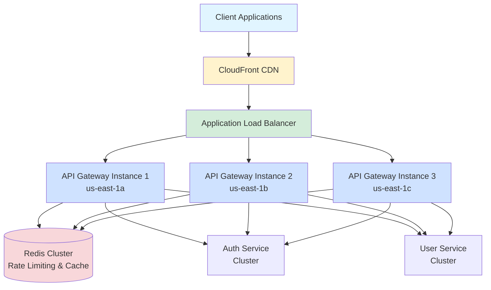
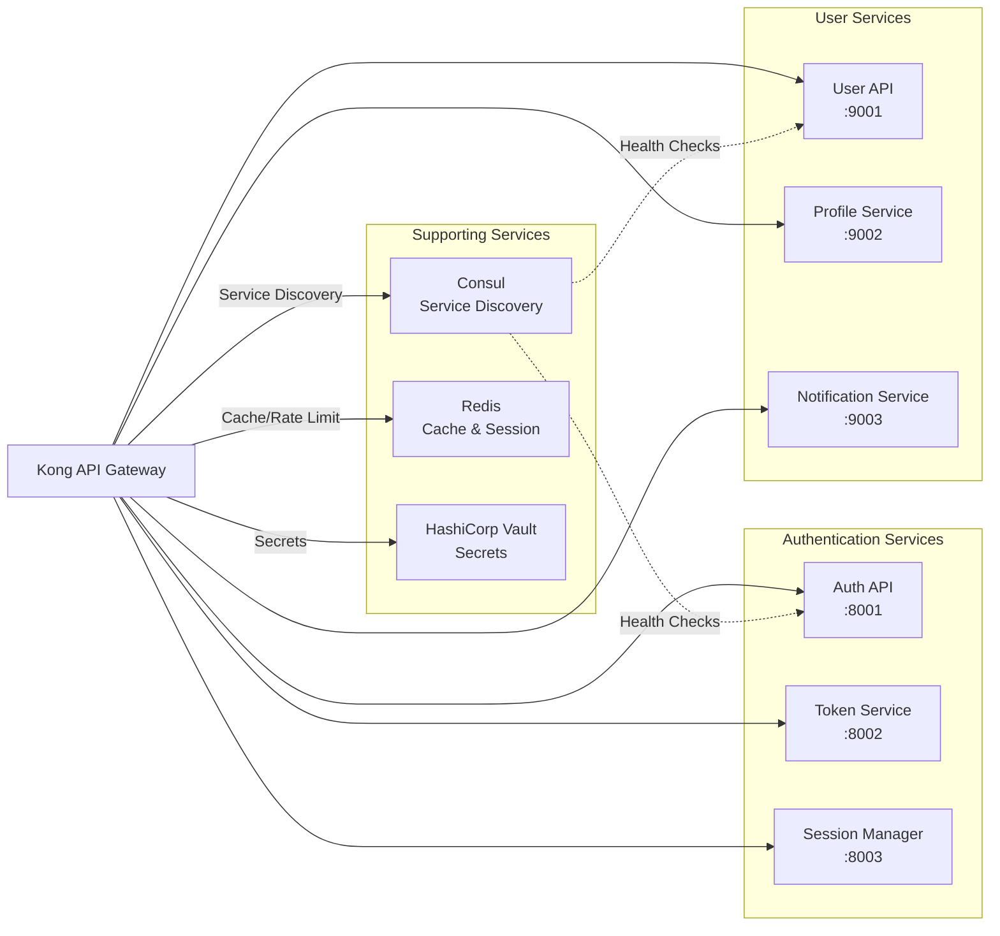
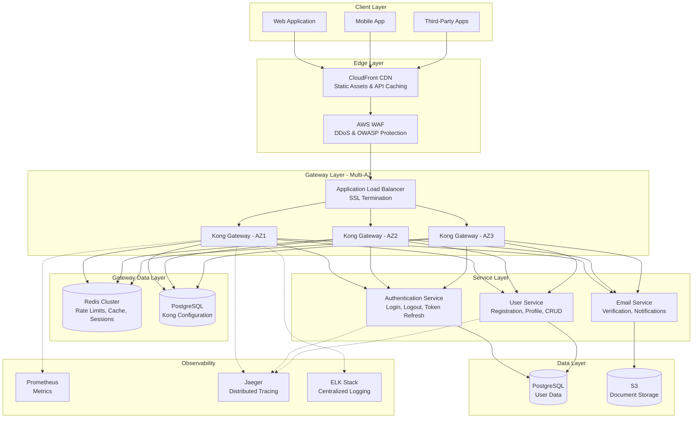
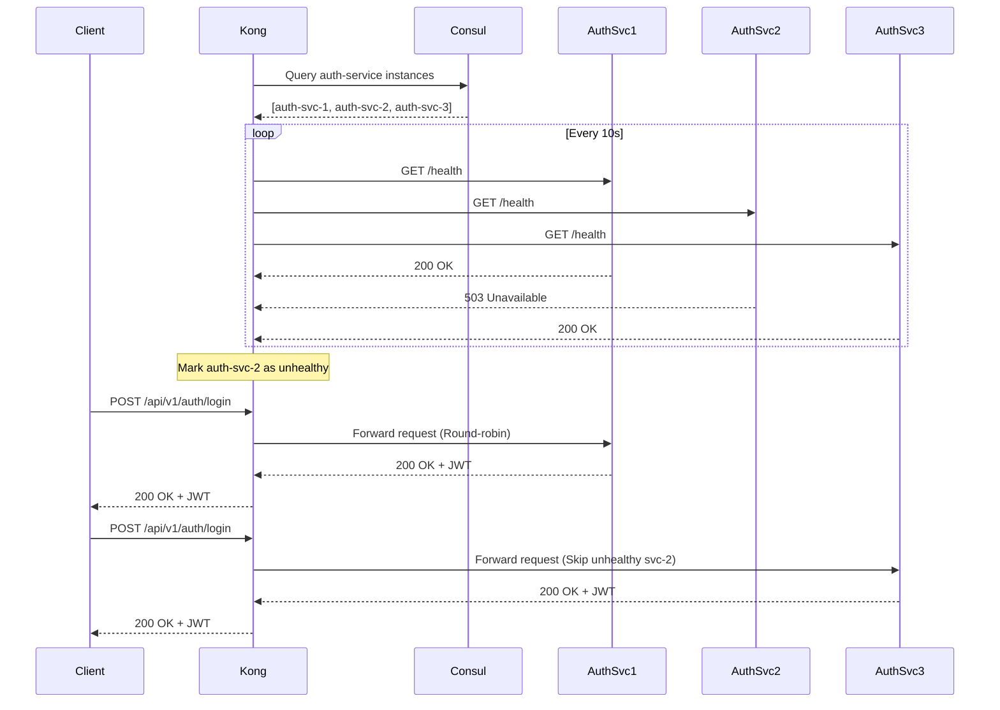
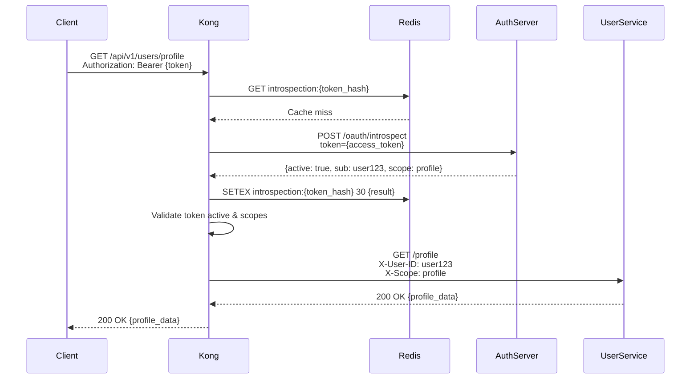
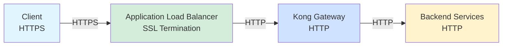

# Gate 1: API Gateway Design Architecture

**Project:** SUMA Finance  
**Feature:** User Registration & Authentication  
**Version:** 1.0  
**Date:** 2025-11-02

---

## 1. API Gateway Architecture Overview

### Gateway Role and Responsibilities

The API Gateway serves as the single entry point for all client applications accessing the SUMA Finance user registration and authentication services. It provides:

- **Unified API Interface**: Single endpoint for web, mobile, and third-party integrations
- **Security Enforcement**: Authentication, authorization, and threat protection
- **Traffic Management**: Rate limiting, throttling, and load balancing
- **Protocol Translation**: REST API exposure with backend service abstraction
- **Observability**: Centralized logging, monitoring, and tracing

### Gateway Deployment Topology



### Technology Selection

**Recommended Gateway: Kong Gateway (OSS + Enterprise)**

**Rationale:**
- **High Performance**: Lua/NGINX core handles 100k+ requests/second per instance
- **Plugin Ecosystem**: 50+ official plugins for auth, security, traffic control
- **Cloud Agnostic**: Runs on AWS, Azure, GCP, on-premises
- **Scalability**: Horizontal scaling with no session affinity required
- **Observability**: Native Prometheus, Jaeger, Datadog integration
- **Cost Effective**: Open source core with enterprise features for compliance

**Alternative Considerations:**

| Technology | Pros | Cons | Use Case |
|------------|------|------|----------|
| **AWS API Gateway** | Fully managed, auto-scaling, AWS integration | Vendor lock-in, higher latency, cost at scale | AWS-only deployments, serverless backends |
| **Azure API Management** | Enterprise features, Azure integration, developer portal | Azure-specific, complex pricing | Azure-native applications |
| **NGINX Plus** | Proven stability, low latency, fine-grained control | Manual scaling, limited plugin ecosystem | High-performance requirements, existing NGINX expertise |
| **Traefik** | Kubernetes-native, dynamic configuration, modern | Smaller ecosystem, less mature | Kubernetes-first deployments |
| **Istio** | Service mesh capabilities, advanced traffic management | Complex setup, resource intensive | Full microservices mesh required |

### Integration with Backend Microservices



### High-Level Architecture Diagram



---

## 2. Routing and Load Balancing

### Request Routing

#### Path-Based Routing

```yaml
# Kong Route Configuration
routes:
  - name: user-registration
    paths:
      - /api/v1/auth/register
    methods:
      - POST
    service: auth-service
    strip_path: false
    
  - name: user-login
    paths:
      - /api/v1/auth/login
    methods:
      - POST
    service: auth-service
    
  - name: token-refresh
    paths:
      - /api/v1/auth/refresh
    methods:
      - POST
    service: token-service
    
  - name: user-profile
    paths:
      - /api/v1/users/profile
    methods:
      - GET
      - PUT
      - PATCH
    service: user-service
    
  - name: user-logout
    paths:
      - /api/v1/auth/logout
    methods:
      - POST
    service: auth-service
    
  - name: password-reset
    paths:
      - /api/v1/auth/password/reset
      - /api/v1/auth/password/confirm
    methods:
      - POST
    service: auth-service
    
  - name: email-verification
    paths:
      - /api/v1/auth/verify-email
    methods:
      - POST
      - GET
    service: auth-service
```

#### Host-Based Routing

```yaml
routes:
  - name: public-api
    hosts:
      - api.sumafinance.com
    paths:
      - /api/v1/auth/register
      - /api/v1/auth/login
    service: auth-service
    
  - name: admin-api
    hosts:
      - admin.sumafinance.com
    paths:
      - /api/v1/admin/users
    service: user-service
    plugins:
      - name: ip-restriction
        config:
          allow:
            - 10.0.0.0/8  # Internal network
            - 52.1.2.3    # Office IP
    
  - name: partner-api
    hosts:
      - partner.sumafinance.com
    paths:
      - /api/v1/partner/*
    service: user-service
    plugins:
      - name: key-auth
```

#### Header-Based Routing

```yaml
routes:
  - name: mobile-api-v1
    paths:
      - /api/v1/auth/*
    headers:
      X-Client-Type:
        - mobile
      X-API-Version:
        - "1.0"
    service: auth-service-v1
    
  - name: mobile-api-v2
    paths:
      - /api/v1/auth/*
    headers:
      X-Client-Type:
        - mobile
      X-API-Version:
        - "2.0"
    service: auth-service-v2
```

#### Dynamic Routing Rules

```lua
-- Kong plugin: dynamic-routing.lua
local function route_by_tenant(tenant_id)
  if tenant_id == "enterprise" then
    return "auth-service-premium"
  elseif tenant_id == "trial" then
    return "auth-service-trial"
  else
    return "auth-service-standard"
  end
end

function plugin:access(config)
  local tenant_id = kong.request.get_header("X-Tenant-ID")
  local service = route_by_tenant(tenant_id)
  kong.service.set_target(service, 8001)
end
```

### Load Balancing Strategies

#### Round-Robin (Default)

```yaml
services:
  - name: auth-service
    url: http://auth-service:8001
    load_balancing:
      algorithm: round-robin
    targets:
      - target: auth-service-1.internal:8001
        weight: 100
      - target: auth-service-2.internal:8001
        weight: 100
      - target: auth-service-3.internal:8001
        weight: 100
```

**Use Case**: Uniform backend capacity, stateless services

#### Least Connections

```yaml
services:
  - name: user-service
    url: http://user-service:9001
    load_balancing:
      algorithm: least-connections
    targets:
      - target: user-service-1.internal:9001
      - target: user-service-2.internal:9001
      - target: user-service-3.internal:9001
```

**Use Case**: Long-running requests, WebSocket connections, varying request complexity

#### IP Hash / Sticky Sessions

```yaml
services:
  - name: auth-service
    url: http://auth-service:8001
    load_balancing:
      algorithm: consistent-hashing
      hash_on: ip
      hash_fallback: none
    targets:
      - target: auth-service-1.internal:8001
      - target: auth-service-2.internal:8001
```

**Configuration with Cookie-Based Stickiness:**

```yaml
plugins:
  - name: session
    service: auth-service
    config:
      cookie_name: SUMA_SESSION
      cookie_lifetime: 3600
      cookie_secure: true
      cookie_httponly: true
      cookie_samesite: Strict
      storage: redis
      redis:
        host: redis-cluster.internal
        port: 6379
        database: 0
```

**Use Case**: Session-based authentication (fallback), WebSocket connections, stateful operations

#### Weighted Load Balancing

```yaml
services:
  - name: auth-service
    url: http://auth-service:8001
    load_balancing:
      algorithm: round-robin
    targets:
      - target: auth-service-1.internal:8001
        weight: 100  # Older instance
      - target: auth-service-2.internal:8001
        weight: 200  # Newer, more powerful instance
      - target: auth-service-3.internal:8001
        weight: 150  # Canary deployment - reduced traffic
```

**Use Case**: Heterogeneous infrastructure, canary deployments, gradual migration

### Service Discovery Integration

#### Consul Integration

```yaml
# Kong configuration for Consul service discovery
_format_version: "3.0"

services:
  - name: auth-service
    url: http://auth-service.service.consul:8001
    connect_timeout: 5000
    read_timeout: 60000
    write_timeout: 60000
    
  - name: user-service
    url: http://user-service.service.consul:9001
```

**Consul Service Definition:**

```hcl
# auth-service.hcl
service {
  name = "auth-service"
  port = 8001
  
  check {
    id       = "auth-health"
    name     = "Auth Service Health Check"
    http     = "http://localhost:8001/health"
    interval = "10s"
    timeout  = "2s"
  }
  
  check {
    id       = "auth-ready"
    name     = "Auth Service Readiness Check"
    http     = "http://localhost:8001/ready"
    interval = "5s"
    timeout  = "2s"
  }
  
  tags = [
    "api",
    "authentication",
    "v1"
  ]
}
```

#### Dynamic Upstream Discovery

```yaml
# Kong DNS resolver configuration
_format_version: "3.0"
_transform: true

upstreams:
  - name: auth-service-upstream
    algorithm: round-robin
    hash_on: none
    healthchecks:
      active:
        type: http
        http_path: /health
        timeout: 2
        healthy:
          interval: 10
          successes: 2
        unhealthy:
          interval: 5
          http_failures: 3
          timeouts: 3
      passive:
        type: http
        healthy:
          successes: 5
        unhealthy:
          http_failures: 5
          timeouts: 5
    targets:
      - target: auth-service.service.consul:8001
        weight: 100
```

**Kong DNS Configuration:**

```yaml
# kong.conf
dns_resolver = 127.0.0.1:8600  # Consul DNS
dns_hostsfile = /etc/hosts
dns_order = LAST,SRV,A,CNAME
dns_no_sync = off
dns_stale_ttl = 3600
```

#### Health Check Based Routing

```yaml
upstreams:
  - name: user-service-upstream
    healthchecks:
      active:
        type: http
        http_path: /health
        https_verify_certificate: false
        timeout: 2
        concurrency: 10
        healthy:
          interval: 10
          http_statuses: [200, 302]
          successes: 2
        unhealthy:
          interval: 5
          http_statuses: [429, 500, 502, 503, 504]
          http_failures: 3
          tcp_failures: 3
          timeouts: 3
      passive:
        type: http
        healthy:
          http_statuses: [200, 201, 202, 203, 204, 205, 206, 207, 208, 226, 300, 301, 302, 303, 304, 305, 306, 307, 308]
          successes: 5
        unhealthy:
          http_statuses: [429, 500, 503]
          tcp_failures: 2
          timeouts: 5
          http_failures: 5
```

**Request Flow with Health Checks:**



---

## 3. Authentication and Authorization

### Authentication at Gateway

#### JWT Token Validation

```yaml
plugins:
  - name: jwt
    config:
      uri_param_names:
        - jwt
      cookie_names:
        - jwt_token
      header_names:
        - Authorization
      claims_to_verify:
        - exp
        - nbf
      key_claim_name: iss
      secret_is_base64: false
      maximum_expiration: 86400  # 24 hours
      run_on_preflight: false
```

**JWT Plugin Configuration for Multiple Issuers:**

```yaml
consumers:
  - username: suma-auth-service
    jwt_secrets:
      - key: suma-finance-issuer
        algorithm: RS256
        rsa_public_key: |
          -----BEGIN PUBLIC KEY-----
          MIIBIjANBgkqhkiG9w0BAQEFAAOCAQ8AMIIBCgKCAQEA...
          -----END PUBLIC KEY-----
        
  - username: external-oauth-provider
    jwt_secrets:
      - key: google-oauth
        algorithm: RS256
        rsa_public_key: |
          -----BEGIN PUBLIC KEY-----
          MIIBIjANBgkqhkiG9w0BAQEFAAOCAQ8AMIIBCgKCAQEA...
          -----END PUBLIC KEY-----
```

**Custom JWT Validation Plugin:**

```lua
-- jwt-validator.lua
local jwt_decoder = require "kong.plugins.jwt.jwt_parser"
local redis = require "resty.redis"

local function is_token_revoked(jti)
  local red = redis:new()
  red:set_timeout(1000)
  
  local ok, err = red:connect("redis-cluster.internal", 6379)
  if not ok then
    kong.log.err("Failed to connect to Redis: ", err)
    return false
  end
  
  local revoked, err = red:get("revoked_token:" .. jti)
  if revoked == "1" then
    return true
  end
  
  return false
end

function plugin:access(config)
  local token = kong.request.get_header("Authorization")
  if not token then
    return kong.response.exit(401, {message = "Unauthorized"})
  end
  
  token = token:gsub("Bearer ", "")
  
  local jwt, err = jwt_decoder:new(token)
  if err then
    return kong.response.exit(401, {message = "Invalid token"})
  end
  
  -- Verify claims
  local claims = jwt.claims
  
  if is_token_revoked(claims.jti) then
    return kong.response.exit(401, {message = "Token has been revoked"})
  end
  
  -- Set user context for downstream services
  kong.service.request.set_header("X-User-ID", claims.sub)
  kong.service.request.set_header("X-User-Email", claims.email)
  kong.service.request.set_header("X-User-Roles", table.concat(claims.roles, ","))
end
```

#### OAuth 2.0 Token Introspection

```yaml
plugins:
  - name: oauth2-introspection
    config:
      introspection_url: https://auth.sumafinance.com/oauth/introspect
      authorization_value: "Basic BASE64_ENCODED_CREDENTIALS"
      token_type_hint: access_token
      ttl: 30  # Cache introspection result for 30 seconds
      consumer_by: username
      introspection_headers_values:
        X-Client-ID: suma-gateway
```

**Token Introspection Flow:**



#### API Key Validation

```yaml
plugins:
  - name: key-auth
    route: partner-api
    config:
      key_names:
        - apikey
        - X-API-Key
      key_in_header: true
      key_in_query: false
      key_in_body: false
      hide_credentials: true
      run_on_preflight: true
```

**API Key Consumer Setup:**

```bash
# Create consumer
curl -X POST http://kong-admin:8001/consumers \
  --data "username=partner-acme-corp"

# Create API key for consumer
curl -X POST http://kong-admin:8001/consumers/partner-acme-corp/key-auth \
  --data "key=acme_sk_live_xJk8sL9mNqP2vWz4"

# Apply rate limiting to consumer
curl -X POST http://kong-admin:8001/consumers/partner-acme-corp/plugins \
  --data "name=rate-limiting" \
  --data "config.minute=1000" \
  --data "config.policy=redis" \
  --data "config.redis_host=redis-cluster.internal"
```

#### mTLS (Mutual TLS)

```yaml
plugins:
  - name: mtls-auth
    route: admin-api
    config:
      ca_certificates:
        - ca-cert-id-1
        - ca-cert-id-2
      skip_consumer_lookup: false
      authenticated_group_by: CN
      revocation_check_mode: IGNORE_CA_ERROR
      http_proxy_host: null
      https_proxy_host: null
```

**CA Certificate Configuration:**

```bash
# Upload CA certificate
curl -X POST http://kong-admin:8001/ca_certificates \
  -F "cert=@/path/to/ca-cert.pem"

# Create consumer based on client certificate CN
curl -X POST http://kong-admin:8001/consumers \
  --data "username=admin-client" \
  --data "custom_id=CN=admin.sumafinance.com"
```

**NGINX Configuration for mTLS:**

```nginx
server {
  listen 443 ssl;
  server_name admin.sumafinance.com;
  
  ssl_certificate /etc/ssl/certs/server.crt;
  ssl_certificate_key /etc/ssl/private/server.key;
  
  # Client certificate verification
  ssl_client_certificate /etc/ssl/certs/ca.crt;
  ssl_verify_client on;
  ssl_verify_depth 2;
  
  # Extract client cert details
  proxy_set_header X-SSL-Client-Cert $ssl_client_cert;
  proxy_set_header X-SSL-Client-DN $ssl_client_s_dn;
  proxy_set_header X-SSL-Client-CN $ssl_client_s_dn_cn;
  
  location / {
    proxy_pass http://kong-gateway:8000;
  }
}
```

### Authorization

#### Scope-Based Authorization

```lua
-- scope-authorization.lua
local function has_required_scope(user_scopes, required_scopes)
  for _, required in ipairs(required_scopes) do
    local found = false
    for _, scope in ipairs(user_scopes) do
      if scope == required then
        found = true
        break
      end
    end
    if not found then
      return false
    end
  end
  return true
end

function plugin:access(config)
  local jwt_claims = kong.ctx.shared.jwt_claims
  
  if not jwt_claims then
    return kong.response.exit(401, {message = "No authentication provided"})
  end
  
  local user_scopes = jwt_claims.scope:gmatch("%S+")
  local scopes_table = {}
  for scope in user_scopes do
    table.insert(scopes_table, scope)
  end
  
  if not has_required_scope(scopes_table, config.required_scopes) then
    return kong.response.exit(403, {
      message = "Insufficient permissions",
      required_scopes = config.required_scopes,
      user_scopes = scopes_table
    })
  end
end
```

**Plugin Configuration:**

```yaml
routes:
  - name: user-profile-read
    paths:
      - /api/v1/users/profile
    methods:
      - GET
    plugins:
      - name: scope-authorization
        config:
          required_scopes:
            - profile:read
            
  - name: user-profile-write
    paths:
      - /api/v1/users/profile
    methods:
      - PUT
      - PATCH
    plugins:
      - name: scope-authorization
        config:
          required_scopes:
            - profile:read
            - profile:write
```

#### Role-Based Access Control (RBAC)

```yaml
plugins:
  - name: acl
    route: admin-endpoints
    config:
      allow:
        - admin
        - super-admin
      deny: null
      hide_groups_header: true
```

**Consumer ACL Group Assignment:**

```bash
# Assign admin role to consumer
curl -X POST http://kong-admin:8001/consumers/john-doe/acls \
  --data "group=admin"

# Assign multiple roles
curl -X POST http://kong-admin:8001/consumers/jane-admin/acls \
  --data "group=super-admin"
```

**Custom RBAC Plugin with Permission Granularity:**

```lua
-- rbac-authorization.lua
local rbac_config = {
  roles = {
    ["admin"] = {
      permissions = {"users:read", "users:write", "users:delete", "system:admin"}
    },
    ["user"] = {
      permissions = {"users:read", "profile:write"}
    },
    ["guest"] = {
      permissions = {"users:read"}
    }
  },
  routes = {
    ["GET:/api/v1/users"] = {"users:read"},
    ["POST:/api/v1/users"] = {"users:write"},
    ["DELETE:/api/v1/users/:id"] = {"users:delete"},
    ["PUT:/api/v1/users/profile"] = {"profile:write"}
  }
}

local function get_user_permissions(roles)
  local permissions = {}
  for _, role in ipairs(roles) do
    if rbac_config.roles[role] then
      for _, perm in ipairs(rbac_config.roles[role].permissions) do
        permissions[perm] = true
      end
    end
  end
  return permissions
end

function plugin:access(config)
  local user_roles = kong.request.get_header("X-User-Roles")
  if not user_roles then
    return kong.response.exit(403, {message = "No roles assigned"})
  end
  
  local roles = {}
  for role in user_roles:gmatch("[^,]+") do
    table.insert(roles, role)
  end
  
  local user_permissions = get_user_permissions(roles)
  
  local method = kong.request.get_method()
  local path = kong.request.get_path()
  local route_key = method .. ":" .. path
  
  local required_perms = rbac_config.routes[route_key]
  if required_perms then
    for _, perm in ipairs(required_perms) do
      if not user_permissions[perm] then
        return kong.response.exit(403, {
          message = "Insufficient permissions",
          required = perm,
          user_roles = roles
        })
      end
    end
  end
end
```

#### Integration with Authorization Service

```yaml
plugins:
  - name: opa-authorization
    config:
      policy_url: http://opa-service.internal:8181/v1/data/sumafinance/authz/allow
      include_body: true
      include_headers:
        - X-User-ID
        - X-User-Roles
        - X-Tenant-ID
      timeout: 1000
      keepalive: 60000
```

**Open Policy Agent (OPA) Policy:**

```rego
# authz.rego
package sumafinance.authz

import future.keywords.if

default allow = false

# Allow admins full access
allow if {
    input.user.roles[_] == "admin"
}

# Allow users to access their own profile
allow if {
    input.method == "GET"
    input.path == "/api/v1/users/profile"
    input.user.id == input.request.headers["X-User-ID"]
}

# Allow users to update their own profile
allow if {
    input.method == "PUT"
    input.path == "/api/v1/users/profile"
    input.user.id == input.request.headers["X-User-ID"]
    has_scope("profile:write")
}

has_scope(scope) if {
    input.user.scopes[_] == scope
}
```

#### Pre-Flight Authorization Checks

```lua
-- preflight-authz.lua
function plugin:access(config)
  local method = kong.request.get_method()
  local user_id = kong.request.get_header("X-User-ID")
  local resource_id = kong.request.get_path_variables().id
  
  -- OPTIONS requests for CORS preflight
  if method == "OPTIONS" then
    return
  end
  
  -- Check resource ownership for sensitive operations
  if method == "DELETE" or method == "PUT" then
    local httpc = require("resty.http").new()
    
    local res, err = httpc:request_uri(
      "http://authz-service.internal:8080/check-ownership",
      {
        method = "POST",
        body = json.encode({
          user_id = user_id,
          resource_id = resource_id,
          resource_type = "user_profile"
        }),
        headers = {
          ["Content-Type"] = "application/json"
        }
      }
    )
    
    if not res or res.status ~= 200 then
      return kong.response.exit(403, {message = "Access denied: resource ownership check failed"})
    end
  end
end
```

### Identity Propagation

#### Forwarding User Identity to Backend Services

```yaml
plugins:
  - name: request-transformer
    config:
      add:
        headers:
          - X-User-ID:$(jwt_claims.sub)
          - X-User-Email:$(jwt_claims.email)
          - X-User-Roles:$(jwt_claims.roles)
          - X-User-Tenant:$(jwt_claims.tenant_id)
          - X-Authenticated:true
      remove:
        headers:
          - Authorization  # Remove original token from backend
```

#### JWT Claims Extraction

```lua
-- identity-propagation.lua
function plugin:access(config)
  local jwt_claims = kong.ctx.shared.jwt_claims
  
  if jwt_claims then
    -- Extract and set standard claims
    kong.service.request.set_header("X-User-ID", jwt_claims.sub)
    kong.service.request.set_header("X-User-Email", jwt_claims.email)
    kong.service.request.set_header("X-User-Name", jwt_claims.name)
    
    -- Extract roles
    if jwt_claims.roles then
      local roles_json = json.encode(jwt_claims.roles)
      kong.service.request.set_header("X-User-Roles", roles_json)
    end
    
    -- Extract custom claims
    if jwt_claims.tenant_id then
      kong.service.request.set_header("X-Tenant-ID", jwt_claims.tenant_id)
    end
    
    if jwt_claims.subscription_tier then
      kong.service.request.set_header("X-Subscription-Tier", jwt_claims.subscription_tier)
    end
    
    -- Set authentication metadata
    kong.service.request.set_header("X-Auth-Method", "jwt")
    kong.service.request.set_header("X-Auth-Time", jwt_claims.auth_time)
    kong.service.request.set_header("X-Token-Issued-At", jwt_claims.iat)
  end
end
```

#### Custom Headers

```yaml
plugins:
  - name: request-transformer
    config:
      add:
        headers:
          # User Identity
          - X-User-ID:$(jwt.sub)
          - X-User-Email:$(jwt.email)
          - X-User-Roles:$(jwt.roles)
          
          # Request Context
          - X-Request-ID:$(uuid)
          - X-Forwarded-For:$(client_ip)
          - X-Real-IP:$(client_ip)
          
          # Tenant Context
          - X-Tenant-ID:$(jwt.tenant_id)
          - X-Organization-ID:$(jwt.org_id)
          
          # Security Context
          - X-Auth-Method:jwt
          - X-Auth-Level:$(jwt.acr)
          - X-Session-ID:$(jwt.sid)
          
          # API Gateway Metadata
          - X-Gateway-Version:1.0.0
          - X-Gateway-Region:us-east-1
      remove:
        headers:
          - Authorization
          - Cookie
```

**Backend Service Identity Consumption (Go Example):**

```go
// middleware/identity.go
package middleware

import (
    "context"
    "net/http"
    "strings"
)

type UserContext struct {
    UserID    string
    Email     string
    Roles     []string
    TenantID  string
}

func ExtractIdentity(next http.Handler) http.Handler {
    return http.HandlerFunc(func(w http.ResponseWriter, r *http.Request) {
        ctx := &UserContext{
            UserID:   r.Header.Get("X-User-ID"),
            Email:    r.Header.Get("X-User-Email"),
            TenantID: r.Header.Get("X-Tenant-ID"),
        }
        
        // Parse roles from comma-separated string
        rolesHeader := r.Header.Get("X-User-Roles")
        if rolesHeader != "" {
            ctx.Roles = strings.Split(rolesHeader, ",")
        }
        
        // Add to request context
        newCtx := context.WithValue(r.Context(), "user", ctx)
        next.ServeHTTP(w, r.WithContext(newCtx))
    })
}

func GetUserFromContext(ctx context.Context) *UserContext {
    user, _ := ctx.Value("user").(*UserContext)
    return user
}
```

---

## 4. Rate Limiting and Throttling

### Rate Limiting Strategies

#### Per-User Rate Limiting

```yaml
plugins:
  - name: rate-limiting
    route: user-api
    config:
      second: null
      minute: 100
      hour: 5000
      day: 50000
      month: null
      year: null
      limit_by: consumer
      policy: redis
      fault_tolerant: true
      hide_client_headers: false
      redis_host: redis-cluster.internal
      redis_port: 6379
      redis_password: null
      redis_database: 1
      redis_timeout: 2000
```

**Advanced Per-User Configuration:**

```lua
-- user-rate-limiter.lua
local redis = require "resty.redis"

function plugin:access(config)
  local user_id = kong.request.get_header("X-User-ID")
  
  if not user_id then
    return kong.response.exit(401, {message = "User identification required"})
  end
  
  -- Get user's subscription tier from JWT or database
  local subscription_tier = kong.request.get_header("X-Subscription-Tier") or "free"
  
  local limits = {
    free = {minute = 10, hour = 100, day = 1000},
    basic = {minute = 100, hour = 5000, day = 50000},
    premium = {minute = 1000, hour = 50000, day = 500000},
    enterprise = {minute = 10000, hour = 500000, day = 5000000}
  }
  
  local user_limits = limits[subscription_tier] or limits.free
  
  local red = redis:new()
  red:connect("redis-cluster.internal", 6379)
  
  -- Check minute limit
  local key = "ratelimit:" .. user_id .. ":minute:" .. os.time() / 60
  local count = red:incr(key)
  red:expire(key, 60)
  
  if count > user_limits.minute then
    kong.response.set_header("X-RateLimit-Limit", user_limits.minute)
    kong.response.set_header("X-RateLimit-Remaining", 0)
    kong.response.set_header("X-RateLimit-Reset", os.time() + 60)
    return kong.response.exit(429, {
      message = "Rate limit exceeded",
      limit = user_limits.minute,
      window = "minute"
    })
  end
  
  -- Set rate limit headers
  kong.response.set_header("X-RateLimit-Limit", user_limits.minute)
  kong.response.set_header("X-RateLimit-Remaining", user_limits.minute - count)
end
```

#### Per-IP Rate Limiting

```yaml
plugins:
  - name: rate-limiting
    route: public-auth-endpoints
    config:
      minute: 30
      hour: 200
      limit_by: ip
      policy: redis
      redis_host: redis-cluster.internal
      redis_port: 6379
      redis_database: 2
```

**IP-Based with Geographic Restrictions:**

```lua
-- geo-rate-limiter.lua
local maxmind = require "maxminddb"
local db = maxmind.open("/usr/local/share/GeoLite2-Country.mmdb")

function plugin:access(config)
  local client_ip = kong.client.get_forwarded_ip()
  local geo_data = db:lookup(client_ip)
  
  local country_code = geo_data and geo_data.country and geo_data.country.iso_code
  
  -- Stricter limits for high-risk countries
  local limits = {
    default = {minute = 30, hour = 200},
    strict = {minute = 10, hour = 50}
  }
  
  local high_risk_countries = {"CN", "RU", "KP"}
  local is_high_risk = false
  
  for _, code in ipairs(high_risk_countries) do
    if country_code == code then
      is_high_risk = true
      break
    end
  end
  
  local rate_limit = is_high_risk and limits.strict or limits.default
  
  -- Apply rate limiting logic
  -- ... (similar to per-user example)
end
```

#### Per-API-Key Rate Limiting

```yaml
plugins:
  - name: rate-limiting
    route: partner-api
    config:
      minute: 1000
      hour: 50000
      day: 500000
      limit_by: credential
      policy: redis
      redis_host: redis-cluster.internal
```

**Consumer-Specific Overrides:**

```bash
# Set custom rate limit for specific partner
curl -X POST http://kong-admin:8001/consumers/partner-acme-corp/plugins \
  --data "name=rate-limiting" \
  --data "config.minute=5000" \
  --data "config.hour=200000" \
  --data "config.policy=redis" \
  --data "config.redis_host=redis-cluster.internal"
```

#### Global Rate Limiting

```yaml
plugins:
  - name: rate-limiting
    config:
      second: 10000
      minute: 500000
      limit_by: service
      policy: cluster
      fault_tolerant: true
      hide_client_headers: false
```

### Rate Limit Algorithms

#### Token Bucket

```lua
-- token-bucket-limiter.lua
local redis = require "resty.redis"

function plugin:access(config)
  local identifier = kong.request.get_header("X-User-ID") or kong.client.get_forwarded_ip()
  local bucket_key = "token_bucket:" .. identifier
  
  local red = redis:new()
  red:connect("redis-cluster.internal", 6379)
  
  -- Token bucket parameters
  local capacity = config.capacity or 100
  local refill_rate = config.refill_rate or 10  -- tokens per second
  local cost = config.cost or 1
  
  -- Get current bucket state
  local bucket_data = red:hgetall(bucket_key)
  local tokens = tonumber(bucket_data.tokens) or capacity
  local last_refill = tonumber(bucket_data.last_refill) or os.time()
  
  -- Calculate tokens to add based on time elapsed
  local now = os.time()
  local elapsed = now - last_refill
  local tokens_to_add = elapsed * refill_rate
  
  tokens = math.min(capacity, tokens + tokens_to_add)
  
  -- Check if enough tokens
  if tokens < cost then
    return kong.response.exit(429, {
      message = "Rate limit exceeded",
      retry_after = math.ceil((cost - tokens) / refill_rate)
    })
  end
  
  -- Consume tokens
  tokens = tokens - cost
  
  -- Update bucket state
  red:hset(bucket_key, "tokens", tokens)
  red:hset(bucket_key, "last_refill", now)
  red:expire(bucket_key, 3600)
  
  -- Set headers
  kong.response.set_header("X-RateLimit-Limit", capacity)
  kong.response.set_header("X-RateLimit-Remaining", math.floor(tokens))
end
```

#### Leaky Bucket

```lua
-- leaky-bucket-limiter.lua
function plugin:access(config)
  local identifier = kong.request.get_header("X-User-ID") or kong.client.get_forwarded_ip()
  local queue_key = "leaky_bucket:" .. identifier
  
  local red = redis:new()
  red:connect("redis-cluster.internal", 6379)
  
  local capacity = config.capacity or 100
  local leak_rate = config.leak_rate or 10  -- requests per second
  
  local queue_data = red:hgetall(queue_key)
  local queue_size = tonumber(queue_data.size) or 0
  local last_leak = tonumber(queue_data.last_leak) or os.time()
  
  -- Calculate leakage
  local now = os.time()
  local elapsed = now - last_leak
  local leaked = elapsed * leak_rate
  
  queue_size = math.max(0, queue_size - leaked)
  
  -- Check capacity
  if queue_size >= capacity then
    return kong.response.exit(429, {
      message = "Rate limit exceeded",
      retry_after = math.ceil(queue_size / leak_rate)
    })
  end
  
  -- Add request to queue
  queue_size = queue_size + 1
  
  red:hset(queue_key, "size", queue_size)
  red:hset(queue_key, "last_leak", now)
  red:expire(queue_key, 3600)
end
```

#### Fixed Window

```yaml
plugins:
  - name: rate-limiting
    config:
      minute: 100
      policy: local
      fault_tolerant: true
```

**Fixed Window Implementation:**

```lua
-- fixed-window-limiter.lua
function plugin:access(config)
  local identifier = kong.request.get_header("X-User-ID")
  local window = math.floor(os.time() / 60)  -- 1-minute window
  local key = "fixed_window:" .. identifier .. ":" .. window
  
  local red = redis:new()
  red:connect("redis-cluster.internal", 6379)
  
  local count = red:incr(key)
  red:expire(key, 60)
  
  if count > config.limit then
    return kong.response.exit(429, {message = "Rate limit exceeded"})
  end
end
```

#### Sliding Window

```lua
-- sliding-window-limiter.lua
function plugin:access(config)
  local identifier = kong.request.get_header("X-User-ID")
  local now = os.time() * 1000  -- milliseconds
  local window_ms = 60000  -- 1 minute
  local limit = config.limit or 100
  
  local key = "sliding_window:" .. identifier
  
  local red = redis:new()
  red:connect("redis-cluster.internal", 6379)
  
  -- Remove old entries outside the window
  red:zremrangebyscore(key, 0, now - window_ms)
  
  -- Count current entries
  local count = red:zcard(key)
  
  if count >= limit then
    -- Calculate when the oldest request will expire
    local oldest = red:zrange(key, 0, 0, "WITHSCORES")
    local retry_after = math.ceil((oldest[2] + window_ms - now) / 1000)
    
    kong.response.set_header("Retry-After", retry_after)
    return kong.response.exit(429, {
      message = "Rate limit exceeded",
      retry_after = retry_after
    })
  end
  
  -- Add current request
  red:zadd(key, now, now .. ":" .. math.random(1000000))
  red:expire(key, 60)
  
  kong.response.set_header("X-RateLimit-Limit", limit)
  kong.response.set_header("X-RateLimit-Remaining", limit - count - 1)
end
```

### Rate Limit Storage

#### Redis for Distributed Rate Limiting

```yaml
# kong.conf
rate_limiting_policy = redis

# Redis connection pool
redis_host = redis-cluster.internal
redis_port = 6379
redis_password = your_secure_password
redis_database = 0
redis_timeout = 2000
redis_keepalive_pool_size = 30
redis_keepalive_backlog = 128
```

**Redis Cluster Configuration:**

```yaml
plugins:
  - name: rate-limiting
    config:
      policy: redis
      redis_host: redis-cluster-node1.internal
      redis_port: 6379
      redis_ssl: true
      redis_ssl_verify: true
      redis_server_name: redis-cluster.internal
      redis_cluster_addresses:
        - redis-cluster-node1.internal:6379
        - redis-cluster-node2.internal:6379
        - redis-cluster-node3.internal:6379
```

#### In-Memory for Single Instance

```yaml
plugins:
  - name: rate-limiting
    config:
      policy: local
      minute: 100
      fault_tolerant: true
```

**Note:** Local policy does not synchronize across Kong instances. Only use for single-instance deployments or non-critical rate limiting.

### Rate Limit Headers

```lua
function plugin:header_filter(config)
  local limit = config.limit
  local remaining = kong.ctx.shared.rate_limit_remaining
  local reset = kong.ctx.shared.rate_limit_reset
  
  kong.response.set_header("X-RateLimit-Limit", limit)
  kong.response.set_header("X-RateLimit-Remaining", remaining)
  kong.response.set_header("X-RateLimit-Reset", reset)
  
  if remaining == 0 then
    kong.response.set_header("Retry-After", reset - os.time())
  end
end
```

**Example Response Headers:**

```http
HTTP/1.1 200 OK
X-RateLimit-Limit: 100
X-RateLimit-Remaining: 87
X-RateLimit-Reset: 1730649720
```

**On Rate Limit Exceeded:**

```http
HTTP/1.1 429 Too Many Requests
X-RateLimit-Limit: 100
X-RateLimit-Remaining: 0
X-RateLimit-Reset: 1730649780
Retry-After: 45
Content-Type: application/json

{
  "message": "API rate limit exceeded",
  "limit": 100,
  "window": "minute",
  "retry_after": 45
}
```

### Tiered Rate Limits

#### Free Tier vs Paid Tier

```lua
-- tiered-rate-limiter.lua
local rate_limits = {
  free = {
    minute = 10,
    hour = 100,
    day = 1000,
    burst = 5
  },
  basic = {
    minute = 100,
    hour = 5000,
    day = 50000,
    burst = 50
  },
  premium = {
    minute = 1000,
    hour = 50000,
    day = 500000,
    burst = 200
  },
  enterprise = {
    minute = 10000,
    hour = 500000,
    day = 5000000,
    burst = 1000
  }
}

function plugin:access(config)
  local tier = kong.request.get_header("X-Subscription-Tier") or "free"
  local limits = rate_limits[tier]
  
  -- Apply rate limiting based on tier
  apply_rate_limit(limits)
end
```

#### Different Limits Per Endpoint

```yaml
routes:
  - name: user-login
    paths:
      - /api/v1/auth/login
    plugins:
      - name: rate-limiting
        config:
          minute: 5  # Stricter for login
          hour: 20
          limit_by: ip
          
  - name: user-profile
    paths:
      - /api/v1/users/profile
    plugins:
      - name: rate-limiting
        config:
          minute: 100  # More relaxed for profile
          hour: 5000
          limit_by: consumer
```

#### Burst Allowances

```lua
-- burst-limiter.lua
function plugin:access(config)
  local identifier = kong.request.get_header("X-User-ID")
  
  local sustained_rate = config.sustained_rate or 100  -- per minute
  local burst_size = config.burst_size or 200
  
  local red = redis:new()
  red:connect("redis-cluster.internal", 6379)
  
  -- Check burst bucket
  local burst_key = "burst:" .. identifier
  local burst_count = red:incr(burst_key)
  red:expire(burst_key, 60)
  
  if burst_count > burst_size then
    return kong.response.exit(429, {message = "Burst limit exceeded"})
  end
  
  -- Check sustained rate
  local sustained_key = "sustained:" .. identifier .. ":" .. math.floor(os.time() / 60)
  local sustained_count = red:incr(sustained_key)
  red:expire(sustained_key, 60)
  
  if sustained_count > sustained_rate then
    return kong.response.exit(429, {message = "Sustained rate limit exceeded"})
  end
end
```

---

## 5. Request/Response Transformation

### Request Transformation

#### Header Manipulation

```yaml
plugins:
  - name: request-transformer
    config:
      add:
        headers:
          - X-Request-ID:$(uuid)
          - X-Forwarded-Proto:https
          - X-Gateway-Version:1.0.0
          - X-User-Agent:$(headers.user-agent)
      replace:
        headers:
          - Host:backend-service.internal
      remove:
        headers:
          - Cookie
          - Authorization
      rename:
        headers:
          - X-Client-ID:X-Consumer-ID
```

**Advanced Header Transformation:**

```lua
-- header-transformer.lua
function plugin:access(config)
  -- Add correlation ID if not present
  if not kong.request.get_header("X-Correlation-ID") then
    kong.service.request.set_header("X-Correlation-ID", kong.utils.uuid())
  end
  
  -- Normalize user agent
  local user_agent = kong.request.get_header("User-Agent") or "Unknown"
  kong.service.request.set_header("X-User-Agent-Normalized", normalize_user_agent(user_agent))
  
  -- Add geographic information
  local client_ip = kong.client.get_forwarded_ip()
  local geo_data = get_geo_data(client_ip)
  kong.service.request.set_header("X-Client-Country", geo_data.country_code)
  kong.service.request.set_header("X-Client-Region", geo_data.region)
  
  -- Security headers
  kong.service.request.set_header("X-Forwarded-Proto", "https")
  kong.service.request.set_header("X-Request-Start", tostring(ngx.now() * 1000))
  
  -- Remove sensitive headers
  kong.service.request.clear_header("Cookie")
  kong.service.request.clear_header("X-API-Key")  -- Already validated, no need to forward
end
```

#### Query Parameter Transformation

```yaml
plugins:
  - name: request-transformer
    config:
      add:
        querystring:
          - source:gateway
          - version:v1
      replace:
        querystring:
          - format:json
      remove:
        querystring:
          - debug
          - internal_test
```

**Dynamic Query Parameter Transformation:**

```lua
-- query-transformer.lua
function plugin:access(config)
  local query_params = kong.request.get_query()
  
  -- Add pagination defaults if not provided
  if not query_params.limit then
    query_params.limit = 20
  end
  
  if not query_params.offset then
    query_params.offset = 0
  end
  
  -- Normalize sort parameter
  if query_params.sort then
    local normalized_sort = query_params.sort:lower():gsub(" ", "")
    query_params.sort = normalized_sort
  end
  
  -- Remove sensitive parameters
  query_params.api_key = nil
  query_params.token = nil
  
  kong.service.request.set_query(query_params)
end
```

#### Request Body Transformation

```yaml
plugins:
  - name: request-transformer-advanced
    config:
      add:
        json:
          - metadata.gateway_version:1.0.0
          - metadata.received_at:$(timestamp)
      replace:
        json:
          - user.status:active
      remove:
        json:
          - internal_field
          - debug_info
```

**Complex Body Transformation:**

```lua
-- body-transformer.lua
local cjson = require "cjson"

function plugin:access(config)
  local body = kong.request.get_body()
  
  if not body then
    return
  end
  
  local json_body = cjson.decode(body)
  
  -- Add metadata
  json_body.metadata = {
    gateway_version = "1.0.0",
    received_at = os.time(),
    source = "api-gateway"
  }
  
  -- Transform email to lowercase
  if json_body.email then
    json_body.email = json_body.email:lower()
  end
  
  -- Hash sensitive fields
  if json_body.password then
    json_body.password_hash = hash_password(json_body.password)
    json_body.password = nil
  end
  
  -- Validate and transform phone number
  if json_body.phone then
    json_body.phone = normalize_phone_number(json_body.phone)
  end
  
  kong.service.request.set_body(cjson.encode(json_body))
end
```

#### URL Rewriting

```yaml
plugins:
  - name: request-transformer
    config:
      replace:
        uri: /v2/users/$(uri_captures.user_id)/profile
```

**Advanced URL Rewriting:**

```lua
-- url-rewriter.lua
function plugin:rewrite(config)
  local uri = kong.request.get_path()
  
  -- Rewrite legacy URLs
  if uri:match("^/api/users/me$") then
    local user_id = kong.request.get_header("X-User-ID")
    kong.service.request.set_path("/api/v2/users/" .. user_id)
  end
  
  -- Rewrite versioned URLs
  local version, path = uri:match("^/api/(v%d+)/(.+)$")
  if version then
    kong.service.request.set_header("X-API-Version", version)
    kong.service.request.set_path("/api/" .. path)
  end
  
  -- Normalize trailing slashes
  if uri:sub(-1) == "/" and uri ~= "/" then
    kong.service.request.set_path(uri:sub(1, -2))
  end
end
```

### Response Transformation

#### Response Header Modification

```yaml
plugins:
  - name: response-transformer
    config:
      add:
        headers:
          - X-Response-Time:$(latency)
          - X-Powered-By:SUMA-Gateway
          - X-Content-Type-Options:nosniff
          - X-Frame-Options:DENY
      remove:
        headers:
          - X-Internal-Server
          - X-Database-Query-Time
      replace:
        headers:
          - Server:SUMA-Gateway/1.0
```

**Security Response Headers:**

```lua
-- security-headers.lua
function plugin:header_filter(config)
  -- Security headers
  kong.response.set_header("X-Content-Type-Options", "nosniff")
  kong.response.set_header("X-Frame-Options", "DENY")
  kong.response.set_header("X-XSS-Protection", "1; mode=block")
  kong.response.set_header("Strict-Transport-Security", "max-age=31536000; includeSubDomains")
  kong.response.set_header("Content-Security-Policy", "default-src 'self'")
  kong.response.set_header("Referrer-Policy", "strict-origin-when-cross-origin")
  
  -- Remove server information
  kong.response.clear_header("Server")
  kong.response.clear_header("X-Powered-By")
  
  -- CORS headers (if configured)
  if config.cors_enabled then
    kong.response.set_header("Access-Control-Allow-Origin", config.allowed_origins)
    kong.response.set_header("Access-Control-Allow-Methods", "GET, POST, PUT, DELETE, OPTIONS")
    kong.response.set_header("Access-Control-Allow-Headers", "Authorization, Content-Type")
  end
end
```

#### Response Body Transformation

```yaml
plugins:
  - name: response-transformer-advanced
    config:
      add:
        json:
          - metadata.response_time:$(latency)
          - metadata.gateway_version:1.0.0
      remove:
        json:
          - internal_id
          - database_timestamp
      replace:
        json:
          - status:success
```

**Response Filtering and Masking:**

```lua
-- response-filter.lua
local cjson = require "cjson"

function plugin:body_filter(config)
  local body = kong.response.get_raw_body()
  
  if not body then
    return
  end
  
  local json_body = cjson.decode(body)
  
  -- Mask sensitive fields
  if json_body.user then
    if json_body.user.email then
      json_body.user.email = mask_email(json_body.user.email)
    end
    
    if json_body.user.phone then
      json_body.user.phone = mask_phone(json_body.user.phone)
    end
    
    -- Remove internal fields
    json_body.user.internal_id = nil
    json_body.user.created_by = nil
  end
  
  -- Add response metadata
  json_body.metadata = {
    response_time_ms = kong.ctx.shared.response_time,
    gateway_version = "1.0.0",
    cached = kong.ctx.shared.cache_hit or false
  }
  
  kong.response.set_raw_body(cjson.encode(json_body))
end
```

#### Response Aggregation

```lua
-- response-aggregator.lua
local http = require "resty.http"
local cjson = require "cjson"

function plugin:access(config)
  local user_id = kong.request.get_header("X-User-ID")
  
  if not user_id then
    return
  end
  
  local httpc = http.new()
  
  -- Parallel requests to multiple services
  local user_profile_request = httpc:request_uri("http://user-service.internal:9001/users/" .. user_id)
  local subscription_request = httpc:request_uri("http://subscription-service.internal:9002/subscriptions/" .. user_id)
  local preferences_request = httpc:request_uri("http://preferences-service.internal:9003/preferences/" .. user_id)
  
  -- Aggregate responses
  local aggregated_response = {
    user = cjson.decode(user_profile_request.body),
    subscription = cjson.decode(subscription_request.body),
    preferences = cjson.decode(preferences_request.body)
  }
  
  return kong.response.exit(200, aggregated_response)
end
```

#### Content-Type Conversion

```lua
-- content-type-converter.lua
function plugin:body_filter(config)
  local content_type = kong.response.get_header("Content-Type")
  local accept = kong.request.get_header("Accept")
  
  -- Convert JSON to XML if client requests XML
  if content_type == "application/json" and accept == "application/xml" then
    local body = kong.response.get_raw_body()
    local json_data = cjson.decode(body)
    local xml_data = json_to_xml(json_data)
    
    kong.response.set_header("Content-Type", "application/xml")
    kong.response.set_raw_body(xml_data)
  end
end
```

---

## 6. Caching Strategy

### Cache Configuration

#### Redis Cache Storage

```yaml
plugins:
  - name: proxy-cache
    config:
      strategy: redis
      redis:
        host: redis-cache.internal
        port: 6379
        database: 3
        password: cache_password
        connect_timeout: 2000
        send_timeout: 2000
        read_timeout: 2000
      content_type:
        - application/json
        - text/plain
      cache_ttl: 300  # 5 minutes
      cache_control: true
      request_method:
        - GET
        - HEAD
      response_code:
        - 200
        - 301
        - 404
      vary_headers:
        - Accept
        - Accept-Language
      vary_query_params:
        - page
        - limit
```

#### Memcached Cache Storage

```yaml
plugins:
  - name: proxy-cache-advanced
    config:
      strategy: memcached
      memcached:
        host: memcached-cluster.internal
        port: 11211
      cache_ttl: 600
```

#### In-Memory Cache

```yaml
plugins:
  - name: proxy-cache
    config:
      strategy: memory
      memory:
        dictionary_name: kong_cache
      cache_ttl: 60
```

**Note:** Memory strategy shares cache across all Kong workers on the same node but not across nodes.

#### Cache Key Generation Strategy

```lua
-- cache-key-generator.lua
function plugin:access(config)
  local user_id = kong.request.get_header("X-User-ID")
  local accept_lang = kong.request.get_header("Accept-Language") or "en"
  local uri = kong.request.get_path()
  local query = kong.request.get_raw_query()
  
  -- Generate cache key
  local cache_key = table.concat({
    "suma",
    "v1",
    user_id or "anonymous",
    accept_lang,
    uri,
    query
  }, ":")
  
  -- Hash cache key to prevent key length issues
  local cache_key_hash = ngx.md5(cache_key)
  
  kong.ctx.shared.cache_key = cache_key_hash
end
```

**Advanced Cache Key Strategy:**

```lua
-- Generate different cache keys based on user tier
function generate_cache_key(config)
  local base_key = kong.request.get_path()
  local tier = kong.request.get_header("X-Subscription-Tier")
  
  -- Premium users get personalized cache
  if tier == "premium" or tier == "enterprise" then
    local user_id = kong.request.get_header("X-User-ID")
    return "cache:" .. tier .. ":" .. user_id .. ":" .. base_key
  end
  
  -- Free/basic users share cache
  return "cache:shared:" .. base_key
end
```

#### Cache TTL Policies

```yaml
plugins:
  - name: proxy-cache
    routes:
      - user-profile-read
    config:
      cache_ttl: 300  # 5 minutes for user profiles
      
  - name: proxy-cache
    routes:
      - public-data
    config:
      cache_ttl: 3600  # 1 hour for public data
      
  - name: proxy-cache
    routes:
      - static-content
    config:
      cache_ttl: 86400  # 24 hours for static content
```

**Dynamic TTL Based on Response:**

```lua
-- dynamic-ttl.lua
function plugin:header_filter(config)
  local cache_control = kong.response.get_header("Cache-Control")
  
  if cache_control then
    local max_age = cache_control:match("max%-age=(%d+)")
    if max_age then
      kong.ctx.shared.cache_ttl = tonumber(max_age)
    end
  else
    -- Default TTL based on content type
    local content_type = kong.response.get_header("Content-Type")
    
    if content_type:match("application/json") then
      kong.ctx.shared.cache_ttl = 300
    elseif content_type:match("image/") then
      kong.ctx.shared.cache_ttl = 86400
    else
      kong.ctx.shared.cache_ttl = 600
    end
  end
end
```

#### Cache Warming

```bash
#!/bin/bash
# cache-warmer.sh

# Warm cache for common user profile requests
USER_IDS=(user123 user456 user789)

for user_id in "${USER_IDS[@]}"; do
  curl -X GET "https://api.sumafinance.com/api/v1/users/$user_id/profile" \
    -H "Authorization: Bearer $TOKEN" \
    -H "X-Cache-Warm: true"
done

# Warm cache for public endpoints
ENDPOINTS=(
  "/api/v1/auth/health"
  "/api/v1/auth/version"
  "/api/v1/users/public-stats"
)

for endpoint in "${ENDPOINTS[@]}"; do
  curl -X GET "https://api.sumafinance.com$endpoint"
done
```

**Scheduled Cache Warming (Cron):**

```lua
-- cache-warmer.lua (Kong plugin with timer)
local function warm_cache(premature)
  if premature then
    return
  end
  
  local httpc = require("resty.http").new()
  
  local endpoints_to_warm = {
    "/api/v1/users/public-stats",
    "/api/v1/auth/health"
  }
  
  for _, endpoint in ipairs(endpoints_to_warm) do
    httpc:request_uri("http://localhost:8000" .. endpoint)
  end
  
  -- Schedule next warming in 5 minutes
  ngx.timer.at(300, warm_cache)
end

function plugin:init_worker()
  ngx.timer.at(0, warm_cache)
end
```

### HTTP Caching

#### Cache-Control Headers

```yaml
plugins:
  - name: response-transformer
    routes:
      - public-endpoints
    config:
      add:
        headers:
          - Cache-Control:public, max-age=3600
          
  - name: response-transformer
    routes:
      - user-specific-endpoints
    config:
      add:
        headers:
          - Cache-Control:private, max-age=300
          
  - name: response-transformer
    routes:
      - no-cache-endpoints
    config:
      add:
        headers:
          - Cache-Control:no-store, no-cache, must-revalidate
```

**Dynamic Cache-Control:**

```lua
-- cache-control.lua
function plugin:header_filter(config)
  local uri = kong.request.get_path()
  
  if uri:match("^/api/v1/users/.+/profile$") then
    -- User profiles - private, short cache
    kong.response.set_header("Cache-Control", "private, max-age=300")
  elseif uri:match("^/api/v1/public/") then
    -- Public data - public, long cache
    kong.response.set_header("Cache-Control", "public, max-age=3600")
  elseif uri:match("^/api/v1/auth/login$") then
    -- Auth endpoints - no cache
    kong.response.set_header("Cache-Control", "no-store, no-cache, must-revalidate")
    kong.response.set_header("Pragma", "no-cache")
  end
end
```

#### ETag Support

```yaml
plugins:
  - name: etag
    config:
      enable: true
      hash_algorithm: md5
```

**Custom ETag Generation:**

```lua
-- etag-generator.lua
function plugin:body_filter(config)
  local body = kong.response.get_raw_body()
  
  if body then
    local etag = ngx.md5(body)
    kong.response.set_header("ETag", '"' .. etag .. '"')
  end
end
```

#### Conditional Requests (If-None-Match)

```lua
-- conditional-request.lua
function plugin:access(config)
  local if_none_match = kong.request.get_header("If-None-Match")
  
  if if_none_match then
    local cache_key = generate_cache_key()
    local cached_etag = get_cached_etag(cache_key)
    
    if cached_etag and cached_etag == if_none_match then
      return kong.response.exit(304, nil, {
        ["ETag"] = cached_etag,
        ["Cache-Control"] = "max-age=300"
      })
    end
  end
end
```

### Cache Invalidation

#### TTL-Based Expiration

```yaml
plugins:
  - name: proxy-cache
    config:
      cache_ttl: 300
```

**Automatic expiration after 300 seconds.**

#### Event-Based Invalidation

```lua
-- cache-invalidator.lua
local function invalidate_user_cache(user_id)
  local red = redis:new()
  red:connect("redis-cache.internal", 6379)
  
  -- Delete all cache entries for user
  local pattern = "cache:*:" .. user_id .. ":*"
  local keys = red:keys(pattern)
  
  for _, key in ipairs(keys) do
    red:del(key)
  end
  
  kong.log.info("Invalidated cache for user: " .. user_id)
end

function plugin:access(config)
  local method = kong.request.get_method()
  local user_id = kong.request.get_header("X-User-ID")
  
  -- Invalidate cache on write operations
  if method == "POST" or method == "PUT" or method == "DELETE" or method == "PATCH" then
    invalidate_user_cache(user_id)
  end
end
```

**WebHook-Based Invalidation:**

```lua
-- webhook-cache-invalidator.lua
function plugin:access(config)
  if kong.request.get_path() == "/internal/cache/invalidate" then
    local body = kong.request.get_body()
    local data = cjson.decode(body)
    
    if data.invalidate_pattern then
      invalidate_cache_pattern(data.invalidate_pattern)
    end
    
    if data.user_id then
      invalidate_user_cache(data.user_id)
    end
    
    return kong.response.exit(200, {message = "Cache invalidated"})
  end
end
```

#### Manual Cache Purge

```bash
# Purge specific endpoint cache
curl -X DELETE "http://kong-admin:8001/proxy-cache/user-service/api/v1/users/123/profile"

# Purge all cache for a service
curl -X DELETE "http://kong-admin:8001/proxy-cache/user-service"
```

**Admin API for Cache Management:**

```lua
-- admin-cache-api.lua
function plugin:admin_api()
  return {
    ["/cache/purge"] = {
      DELETE = function(self)
        local pattern = self.params.pattern
        purge_cache_pattern(pattern)
        return kong.response.exit(200, {message = "Cache purged", pattern = pattern})
      end
    },
    ["/cache/stats"] = {
      GET = function(self)
        local stats = get_cache_stats()
        return kong.response.exit(200, stats)
      end
    }
  }
end
```

#### Cache Versioning

```lua
-- cache-versioning.lua
local CACHE_VERSION = "v2"

function generate_cache_key_with_version(uri)
  return CACHE_VERSION .. ":" .. uri
end

-- When deploying new version, increment CACHE_VERSION
-- Old cache entries will be orphaned and expire naturally
```

---

## 7. Security Features

### TLS/SSL Termination

#### SSL Certificate Management

```yaml
# Upload SSL certificate via Kong Admin API
curl -X POST http://kong-admin:8001/certificates \
  -F "cert=@/path/to/cert.pem" \
  -F "key=@/path/to/key.pem" \
  -F "tags[]=production"

# Associate with SNI
curl -X POST http://kong-admin:8001/certificates/{cert-id}/snis \
  --data "name=api.sumafinance.com"
```

**Automated Certificate Renewal with Let's Encrypt:**

```yaml
plugins:
  - name: acme
    config:
      account_email: ssl@sumafinance.com
      api_uri: https://acme-v02.api.letsencrypt.org/directory
      storage: redis
      storage_config:
        host: redis-cluster.internal
        port: 6379
      domains:
        - api.sumafinance.com
        - admin.sumafinance.com
      renew_threshold_days: 30
```

#### TLS 1.2+ Enforcement

```nginx
# kong.conf
ssl_protocols TLSv1.2 TLSv1.3
ssl_prefer_server_ciphers on
ssl_session_cache shared:SSL:10m
ssl_session_timeout 10m
```

**NGINX Configuration:**

```nginx
server {
  listen 443 ssl http2;
  server_name api.sumafinance.com;
  
  ssl_certificate /etc/ssl/certs/api.sumafinance.com.pem;
  ssl_certificate_key /etc/ssl/private/api.sumafinance.com.key;
  
  ssl_protocols TLSv1.2 TLSv1.3;
  ssl_ciphers 'ECDHE-ECDSA-AES128-GCM-SHA256:ECDHE-RSA-AES128-GCM-SHA256:ECDHE-ECDSA-AES256-GCM-SHA384:ECDHE-RSA-AES256-GCM-SHA384';
  ssl_prefer_server_ciphers on;
  
  # HSTS
  add_header Strict-Transport-Security "max-age=31536000; includeSubDomains" always;
}
```

#### Cipher Suite Configuration

```yaml
# kong.conf
ssl_cipher_suite modern  # modern, intermediate, old
```

**Custom Cipher Configuration:**

```nginx
ssl_ciphers 'ECDHE-ECDSA-AES128-GCM-SHA256:ECDHE-RSA-AES128-GCM-SHA256:ECDHE-ECDSA-AES256-GCM-SHA384:ECDHE-RSA-AES256-GCM-SHA384:ECDHE-ECDSA-CHACHA20-POLY1305:ECDHE-RSA-CHACHA20-POLY1305:DHE-RSA-AES128-GCM-SHA256:DHE-RSA-AES256-GCM-SHA384';
```

#### SSL Offloading



**Configuration:**

```yaml
# ALB handles SSL termination
# Kong receives plain HTTP on port 8000
# Backend services receive plain HTTP

# kong.conf
proxy_listen = 0.0.0.0:8000
admin_listen = 127.0.0.1:8001

# Trust X-Forwarded-* headers from ALB
trusted_ips = 10.0.0.0/8
real_ip_header = X-Forwarded-For
real_ip_recursive = on
```

### DDoS Protection

#### Rate Limiting

```yaml
plugins:
  - name: rate-limiting
    config:
      second: 100
      minute: 5000
      hour: 100000
      policy: redis
      fault_tolerant: true
```

#### IP Blacklisting/Whitelisting

```yaml
plugins:
  - name: ip-restriction
    routes:
      - admin-endpoints
    config:
      allow:
        - 10.0.0.0/8      # Internal network
        - 52.1.2.3/32     # Office IP
      deny: null
      
  - name: ip-restriction
    routes:
      - public-api
    config:
      allow: null
      deny:
        - 192.0.2.1       # Known attacker
        - 198.51.100.0/24 # Blocked range
```

**Dynamic IP Blacklisting:**

```lua
-- dynamic-ip-blacklist.lua
local redis = require "resty.redis"

function is_ip_blacklisted(ip)
  local red = redis:new()
  red:connect("redis-cluster.internal", 6379)
  
  local blacklisted = red:get("blacklist:ip:" .. ip)
  return blacklisted == "1"
end

function plugin:access(config)
  local client_ip = kong.client.get_forwarded_ip()
  
  if is_ip_blacklisted(client_ip) then
    kong.log.warn("Blocked blacklisted IP: " .. client_ip)
    return kong.response.exit(403, {message = "Access denied"})
  end
end
```

#### Request Size Limits

```yaml
plugins:
  - name: request-size-limiting
    config:
      allowed_payload_size: 10  # MB
      size_unit: megabytes
      require_content_length: true
```

**Per-Route Size Limits:**

```yaml
routes:
  - name: file-upload
    paths:
      - /api/v1/upload
    plugins:
      - name: request-size-limiting
        config:
          allowed_payload_size: 50  # MB
          
  - name: standard-api
    paths:
      - /api/v1/*
    plugins:
      - name: request-size-limiting
