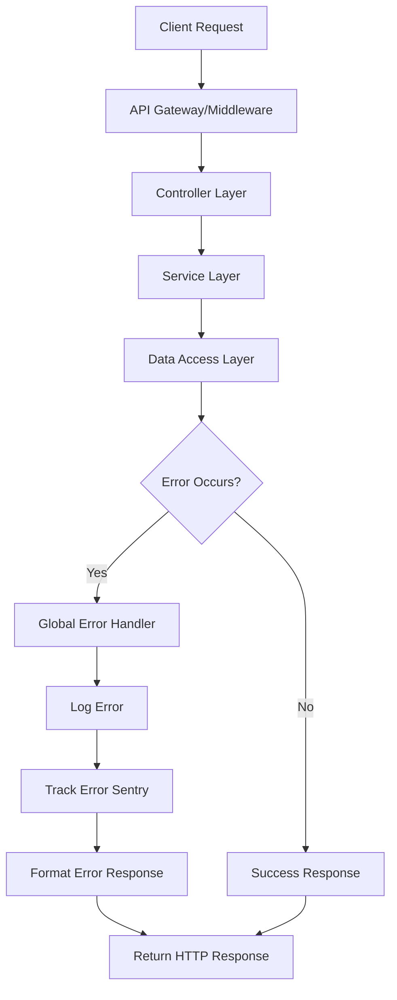
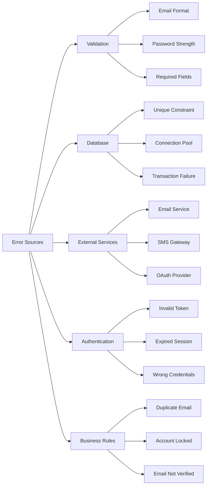
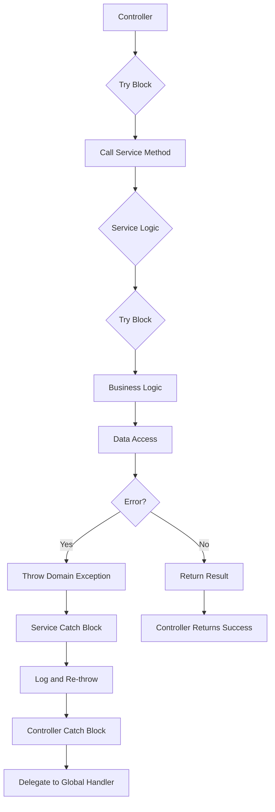

# Error Handling Architecture - SUMA Finance
## User Registration & Authentication

---

## 1. Error Handling Architecture Overview

### Philosophy and Principles

The SUMA Finance error handling architecture follows these core principles:

1. **Fail Fast, Fail Safe**: Detect errors early and prevent system-wide failures
2. **User-Centric Messaging**: Provide clear, actionable error messages without exposing system internals
3. **Security First**: Never leak sensitive information through error responses
4. **Observability**: Every error is logged, tracked, and monitored
5. **Graceful Degradation**: System remains partially functional during failures

### Centralized Error Handling Strategy



### Error Propagation Strategy

- **Service Layer**: Throws domain-specific exceptions (e.g., `UserAlreadyExistsError`, `InvalidCredentialsError`)
- **Controller Layer**: Catches service exceptions, delegates to global handler
- **Global Handler**: Converts exceptions to standardized HTTP error responses
- **Client**: Receives consistent error format, displays user-friendly messages

### Technology Stack

| Component | Technology | Purpose |
|-----------|-----------|---------|
| Backend Error Tracking | Sentry | Real-time error monitoring and alerting |
| Frontend Error Tracking | Sentry (Browser SDK) | Client-side error tracking |
| Logging | Winston (Node.js) / Pino | Structured JSON logging |
| Log Aggregation | ELK Stack / CloudWatch | Centralized log storage and analysis |
| Monitoring | Prometheus + Grafana | Metrics and dashboards |
| Alerting | PagerDuty / Opsgenie | Critical error notifications |

---

## 2. Error Classification and Taxonomy

### Error Categories

#### Client Errors (4xx)
- **Validation Errors**: Invalid email format, weak password, missing required fields
- **Authentication Errors**: Invalid credentials, expired token, missing token
- **Authorization Errors**: Insufficient permissions, account locked
- **Resource Errors**: User already exists, email already registered
- **Rate Limiting**: Too many login attempts, registration requests

#### Server Errors (5xx)
- **Application Errors**: Unhandled exceptions, null pointer errors
- **Database Errors**: Connection failures, query timeouts, constraint violations
- **Integration Errors**: Email service unavailable, SMS gateway failure
- **Infrastructure Errors**: Out of memory, disk full, service overload

#### Network Errors
- **Timeout Errors**: Request timeout, database connection timeout
- **Connection Errors**: Network unreachable, connection refused
- **DNS Errors**: Domain not found, DNS resolution failure

#### Business Logic Errors
- **Registration Errors**: Duplicate email, invalid email domain, age restriction
- **Authentication Errors**: Account not verified, account suspended, password expired

### Error Severity Levels

```typescript
enum ErrorSeverity {
  FATAL = 'fatal',    // System crash, data corruption - immediate action required
  ERROR = 'error',    // Request failure, unexpected exception - requires investigation
  WARN = 'warn',      // Degraded functionality, fallback used - monitor closely
  INFO = 'info'       // Expected errors (invalid password) - log for analysis
}
```

#### Severity Mapping for Authentication Features

| Error Type | Severity | Example |
|------------|----------|---------|
| Database unavailable | FATAL | Cannot connect to user database |
| Unhandled exception in registration | ERROR | NullPointerException in user service |
| Email service timeout (using fallback) | WARN | SendGrid timeout, queued for retry |
| Invalid login credentials | INFO | User entered wrong password |

### Error Sources



---

## 3. HTTP Status Code Strategy

### Success Codes (2xx)

| Code | Usage | Authentication Example |
|------|-------|------------------------|
| **200 OK** | Successful GET, PUT, PATCH, DELETE | `GET /api/auth/me` returns user profile |
| **201 Created** | Successful POST creating resource | `POST /api/auth/register` creates new user |
| **202 Accepted** | Async processing started | Email verification sent, processing in background |
| **204 No Content** | Successful DELETE with no body | `DELETE /api/auth/sessions/{id}` logs out session |

### Client Error Codes (4xx)

| Code | Usage | Authentication Example |
|------|-------|------------------------|
| **400 Bad Request** | Validation error, malformed request | Missing required field `email` |
| **401 Unauthorized** | Missing or invalid authentication | No JWT token in Authorization header |
| **403 Forbidden** | Authenticated but not authorized | Account suspended, cannot access resource |
| **404 Not Found** | Resource doesn't exist | User ID not found |
| **409 Conflict** | Concurrent update conflict, duplicate | Email already registered |
| **422 Unprocessable Entity** | Semantic validation error | Password too weak (meets format but not policy) |
| **429 Too Many Requests** | Rate limit exceeded | More than 5 login attempts in 15 minutes |

### Server Error Codes (5xx)

| Code | Usage | Authentication Example |
|------|-------|------------------------|
| **500 Internal Server Error** | Generic server error | Unhandled exception in registration service |
| **502 Bad Gateway** | Upstream service error | OAuth provider returned invalid response |
| **503 Service Unavailable** | Temporary outage, maintenance | Database connection pool exhausted |
| **504 Gateway Timeout** | Upstream timeout | Email verification service timeout |

---

## 4. Error Response Format

### Standard Error Response Structure

```typescript
interface ErrorResponse {
  error: {
    code: string;                    // Application-specific error code
    message: string;                 // User-friendly message
    details?: ErrorDetail[];         // Field-level validation errors
    request_id: string;              // For log correlation
    timestamp: string;               // ISO 8601 timestamp
    path: string;                    // Request path
    documentation_url?: string;      // Link to error docs
    trace_id?: string;              // Distributed tracing ID (dev/staging only)
    stack?: string;                 // Stack trace (dev/staging only)
  };
}

interface ErrorDetail {
  field: string;                    // Field name (e.g., "email")
  message: string;                  // Field-specific error message
  code: string;                     // Field-specific error code
  value?: any;                      // Invalid value (sanitized)
}
```

### Example Error Responses

#### Validation Error (400)

```json
{
  "error": {
    "code": "VALIDATION_ERROR",
    "message": "Registration validation failed",
    "details": [
      {
        "field": "email",
        "message": "Email format is invalid",
        "code": "INVALID_EMAIL_FORMAT",
        "value": "user@invalid"
      },
      {
        "field": "password",
        "message": "Password must be at least 8 characters with uppercase, lowercase, and number",
        "code": "WEAK_PASSWORD"
      }
    ],
    "request_id": "req_7k9m2n4p",
    "timestamp": "2025-01-15T10:30:00Z",
    "path": "/api/auth/register",
    "documentation_url": "https://docs.sumafinance.com/errors/VALIDATION_ERROR"
  }
}
```

#### Authentication Error (401)

```json
{
  "error": {
    "code": "INVALID_CREDENTIALS",
    "message": "The email or password you entered is incorrect",
    "request_id": "req_8p1q3r5s",
    "timestamp": "2025-01-15T10:31:00Z",
    "path": "/api/auth/login",
    "documentation_url": "https://docs.sumafinance.com/errors/INVALID_CREDENTIALS"
  }
}
```

#### Conflict Error (409)

```json
{
  "error": {
    "code": "EMAIL_ALREADY_EXISTS",
    "message": "An account with this email already exists",
    "details": [
      {
        "field": "email",
        "message": "This email is already registered",
        "code": "DUPLICATE_EMAIL"
      }
    ],
    "request_id": "req_9t2w4e6r",
    "timestamp": "2025-01-15T10:32:00Z",
    "path": "/api/auth/register",
    "documentation_url": "https://docs.sumafinance.com/errors/EMAIL_ALREADY_EXISTS"
  }
}
```

#### Rate Limit Error (429)

```json
{
  "error": {
    "code": "RATE_LIMIT_EXCEEDED",
    "message": "Too many login attempts. Please try again in 15 minutes",
    "details": [
      {
        "field": "retry_after",
        "message": "Retry after 900 seconds",
        "code": "RETRY_AFTER",
        "value": 900
      }
    ],
    "request_id": "req_1a3b5c7d",
    "timestamp": "2025-01-15T10:33:00Z",
    "path": "/api/auth/login",
    "documentation_url": "https://docs.sumafinance.com/errors/RATE_LIMIT_EXCEEDED"
  }
}
```

#### Server Error (500)

```json
{
  "error": {
    "code": "INTERNAL_SERVER_ERROR",
    "message": "An unexpected error occurred. Our team has been notified",
    "request_id": "req_2d4f6g8h",
    "timestamp": "2025-01-15T10:34:00Z",
    "path": "/api/auth/register",
    "documentation_url": "https://docs.sumafinance.com/errors/INTERNAL_SERVER_ERROR"
  }
}
```

### Error Code Convention

#### Naming Convention
- **Format**: `UPPER_SNAKE_CASE`
- **Structure**: `<DOMAIN>_<ERROR_TYPE>`
- **Examples**: 
  - `VALIDATION_ERROR`
  - `EMAIL_ALREADY_EXISTS`
  - `INVALID_CREDENTIALS`
  - `TOKEN_EXPIRED`
  - `ACCOUNT_SUSPENDED`

#### Error Code Catalog for Authentication

| Error Code | HTTP Status | Description |
|------------|-------------|-------------|
| `VALIDATION_ERROR` | 400 | General validation failure |
| `INVALID_EMAIL_FORMAT` | 400 | Email format is invalid |
| `WEAK_PASSWORD` | 422 | Password doesn't meet security requirements |
| `REQUIRED_FIELD_MISSING` | 400 | Required field not provided |
| `INVALID_CREDENTIALS` | 401 | Email or password is incorrect |
| `TOKEN_MISSING` | 401 | Authorization token not provided |
| `TOKEN_INVALID` | 401 | Authorization token is malformed or invalid |
| `TOKEN_EXPIRED` | 401 | Authorization token has expired |
| `EMAIL_NOT_VERIFIED` | 403 | Email address not verified |
| `ACCOUNT_SUSPENDED` | 403 | User account is suspended |
| `ACCOUNT_LOCKED` | 403 | Account locked due to suspicious activity |
| `EMAIL_ALREADY_EXISTS` | 409 | Email is already registered |
| `RATE_LIMIT_EXCEEDED` | 429 | Too many requests from this IP/user |
| `DATABASE_ERROR` | 500 | Database operation failed |
| `EMAIL_SERVICE_ERROR` | 503 | Email service unavailable |
| `INTERNAL_SERVER_ERROR` | 500 | Unexpected server error |

---

## 5. Validation Error Handling

### Client-Side Validation (UX Enhancement Only)

```typescript
// React Hook Form validation example
interface RegistrationFormData {
  email: string;
  password: string;
  confirmPassword: string;
  firstName: string;
  lastName: string;
}

const registrationSchema = yup.object({
  email: yup
    .string()
    .required('Email is required')
    .email('Please enter a valid email address'),
  password: yup
    .string()
    .required('Password is required')
    .min(8, 'Password must be at least 8 characters')
    .matches(/[A-Z]/, 'Password must contain uppercase letter')
    .matches(/[a-z]/, 'Password must contain lowercase letter')
    .matches(/[0-9]/, 'Password must contain number')
    .matches(/[@$!%*?&#]/, 'Password must contain special character'),
  confirmPassword: yup
    .string()
    .required('Please confirm your password')
    .oneOf([yup.ref('password')], 'Passwords must match'),
  firstName: yup
    .string()
    .required('First name is required')
    .min(2, 'First name must be at least 2 characters'),
  lastName: yup
    .string()
    .required('Last name is required')
    .min(2, 'Last name must be at least 2 characters')
});

// Real-time field validation
const { register, handleSubmit, formState: { errors } } = useForm({
  resolver: yupResolver(registrationSchema),
  mode: 'onBlur' // Validate on blur for better UX
});
```

**Client-Side Validation UI**:
```tsx
<TextField
  {...register('email')}
  error={!!errors.email}
  helperText={errors.email?.message}
  label="Email"
  type="email"
  aria-invalid={!!errors.email}
  aria-describedby="email-error"
/>
{errors.email && (
  <FormHelperText id="email-error" error>
    {errors.email.message}
  </FormHelperText>
)}
```

### Server-Side Validation (Security Mandatory)

```typescript
// Backend validation using class-validator
import { IsEmail, IsString, MinLength, Matches, IsNotEmpty } from 'class-validator';

class RegisterUserDto {
  @IsEmail({}, { message: 'Please provide a valid email address' })
  @IsNotEmpty({ message: 'Email is required' })
  email: string;

  @IsString()
  @MinLength(8, { message: 'Password must be at least 8 characters' })
  @Matches(/^(?=.*[a-z])(?=.*[A-Z])(?=.*\d)(?=.*[@$!%*?&#])[A-Za-z\d@$!%*?&#]+$/, {
    message: 'Password must contain uppercase, lowercase, number, and special character'
  })
  password: string;

  @IsString()
  @MinLength(2, { message: 'First name must be at least 2 characters' })
  @IsNotEmpty({ message: 'First name is required' })
  firstName: string;

  @IsString()
  @MinLength(2, { message: 'Last name must be at least 2 characters' })
  @IsNotEmpty({ message: 'Last name is required' })
  lastName: string;
}
```

**Validation Middleware**:
```typescript
import { validate } from 'class-validator';
import { plainToClass } from 'class-transformer';

async function validateDto(req: Request, res: Response, next: NextFunction) {
  const dto = plainToClass(RegisterUserDto, req.body);
  const errors = await validate(dto);

  if (errors.length > 0) {
    const formattedErrors = errors.map(error => ({
      field: error.property,
      message: Object.values(error.constraints || {})[0],
      code: `INVALID_${error.property.toUpperCase()}`
    }));

    return res.status(400).json({
      error: {
        code: 'VALIDATION_ERROR',
        message: 'Validation failed',
        details: formattedErrors,
        request_id: req.id,
        timestamp: new Date().toISOString(),
        path: req.path
      }
    });
  }

  next();
}
```

### Business Rule Validation

```typescript
class RegistrationBusinessRules {
  async validateEmailNotExists(email: string): Promise<void> {
    const existingUser = await userRepository.findByEmail(email);
    if (existingUser) {
      throw new ConflictError('EMAIL_ALREADY_EXISTS', 'An account with this email already exists', [
        {
          field: 'email',
          message: 'This email is already registered',
          code: 'DUPLICATE_EMAIL'
        }
      ]);
    }
  }

  async validateEmailDomain(email: string): Promise<void> {
    const domain = email.split('@')[1];
    const blockedDomains = ['tempmail.com', 'throwaway.email', '10minutemail.com'];
    
    if (blockedDomains.includes(domain)) {
      throw new ValidationError('INVALID_EMAIL_DOMAIN', 'Temporary email addresses are not allowed', [
        {
          field: 'email',
          message: 'Please use a permanent email address',
          code: 'TEMPORARY_EMAIL_NOT_ALLOWED'
        }
      ]);
    }
  }

  async validatePasswordNotCommon(password: string): Promise<void> {
    const commonPasswords = await loadCommonPasswordList();
    if (commonPasswords.includes(password.toLowerCase())) {
      throw new ValidationError('WEAK_PASSWORD', 'This password is too common', [
        {
          field: 'password',
          message: 'Please choose a more unique password',
          code: 'PASSWORD_TOO_COMMON'
        }
      ]);
    }
  }
}
```

---

## 6. Exception Handling Strategy

### Custom Exception Classes

```typescript
// Base error class
class AppError extends Error {
  constructor(
    public code: string,
    public message: string,
    public statusCode: number,
    public details?: ErrorDetail[],
    public isOperational = true
  ) {
    super(message);
    this.name = this.constructor.name;
    Error.captureStackTrace(this, this.constructor);
  }
}

// Domain-specific errors
class ValidationError extends AppError {
  constructor(code: string, message: string, details?: ErrorDetail[]) {
    super(code, message, 400, details);
  }
}

class AuthenticationError extends AppError {
  constructor(code: string, message: string, details?: ErrorDetail[]) {
    super(code, message, 401, details);
  }
}

class AuthorizationError extends AppError {
  constructor(code: string, message: string, details?: ErrorDetail[]) {
    super(code, message, 403, details);
  }
}

class ConflictError extends AppError {
  constructor(code: string, message: string, details?: ErrorDetail[]) {
    super(code, message, 409, details);
  }
}

class RateLimitError extends AppError {
  constructor(code: string, message: string, retryAfter: number) {
    super(code, message, 429, [
      { field: 'retry_after', message: `Retry after ${retryAfter} seconds`, code: 'RETRY_AFTER', value: retryAfter }
    ]);
  }
}

class DatabaseError extends AppError {
  constructor(code: string, message: string) {
    super(code, message, 500);
  }
}

class ExternalServiceError extends AppError {
  constructor(code: string, message: string, statusCode = 503) {
    super(code, message, statusCode);
  }
}
```

### Try-Catch Architecture



**Service Layer**:
```typescript
class AuthService {
  async registerUser(dto: RegisterUserDto): Promise<User> {
    try {
      // Business rule validation
      await this.businessRules.validateEmailNotExists(dto.email);
      await this.businessRules.validateEmailDomain(dto.email);
      await this.businessRules.validatePasswordNotCommon(dto.password);

      // Hash password
      const hashedPassword = await bcrypt.hash(dto.password, 12);

      // Create user
      const user = await this.userRepository.create({
        email: dto.email,
        password: hashedPassword,
        firstName: dto.firstName,
        lastName: dto.lastName,
        isVerified: false
      });

      // Send verification email (async, don't block response)
      this.emailService.sendVerificationEmail(user.email, user.id)
        .catch(err => {
          logger.error('Failed to send verification email', {
            userId: user.id,
            email: user.email,
            error: err.message
          });
        });

      return user;

    } catch (error) {
      // Log error with context
      logger.error('User registration failed', {
        email: dto.email,
        error: error.message,
        stack: error.stack
      });

      // Re-throw domain exceptions
      if (error instanceof AppError) {
        throw error;
      }

      // Handle database errors
      if (error.code === '23505') { // PostgreSQL unique constraint violation
        throw new ConflictError('EMAIL_ALREADY_EXISTS', 'An account with this email already exists');
      }

      // Wrap unexpected errors
      throw new DatabaseError('DATABASE_ERROR', 'Failed to create user account');
    }
  }

  async loginUser(email: string, password: string): Promise<{ user: User; token: string }> {
    try {
      // Find user
      const user = await this.userRepository.findByEmail(email);
      if (!user) {
        throw new AuthenticationError('INVALID_CREDENTIALS', 'The email or password you entered is incorrect');
      }

      // Verify password
      const isPasswordValid = await bcrypt.compare(password, user.password);
      if (!isPasswordValid) {
        throw new AuthenticationError('INVALID_CREDENTIALS', 'The email or password you entered is incorrect');
      }

      // Check if email is verified
      if (!user.isVerified) {
        throw new AuthorizationError('EMAIL_NOT_VERIFIED', 'Please verify your email address before logging in');
      }

      // Check if account is suspended
      if (user.status === 'SUSPENDED') {
        throw new AuthorizationError('ACCOUNT_SUSPENDED', 'Your account has been suspended. Please contact support');
      }

      // Generate JWT token
      const token = jwt.sign(
        { userId: user.id, email: user.email },
        process.env.JWT_SECRET,
        { expiresIn: '7d' }
      );

      return { user, token };

    } catch (error) {
      logger.error('User login failed', {
        email,
        error: error.message
      });

      if (error instanceof AppError) {
        throw error;
      }

      throw new DatabaseError('DATABASE_ERROR', 'Failed to authenticate user');
    }
  }
}
```

**Controller Layer**:
```typescript
class AuthController {
  @Post('/register')
  async register(req: Request, res: Response, next: NextFunction) {
    try {
      const user = await this.authService.registerUser(req.body);

      res.status(201).json({
        success: true,
        data: {
          id: user.id,
          email: user.email,
          firstName: user.firstName,
          lastName: user.lastName
        },
        message: 'Registration successful. Please check your email to verify your account'
      });

    } catch (error) {
      // Delegate to global error handler
      next(error);
    }
  }

  @Post('/login')
  async login(req: Request, res: Response, next: NextFunction) {
    try {
      const { email, password } = req.body;
      const { user, token } = await this.authService.loginUser(email, password);

      res.status(200).json({
        success: true,
        data: {
          user: {
            id: user.id,
            email: user.email,
            firstName: user.firstName,
            lastName: user.lastName
          },
          token
        },
        message: 'Login successful'
      });

    } catch (error) {
      next(error);
    }
  }
}
```

### Global Exception Handler

```typescript
function globalErrorHandler(
  error: Error,
  req: Request,
  res: Response,
  next: NextFunction
) {
  // Generate request ID if not exists
  const requestId = req.id || uuidv4();

  // Default error response
  let statusCode = 500;
  let errorCode = 'INTERNAL_SERVER_ERROR';
  let message = 'An unexpected error occurred. Our team has been notified';
  let details: ErrorDetail[] | undefined;

  // Handle known errors
  if (error instanceof AppError) {
    statusCode = error.statusCode;
    errorCode = error.code;
    message = error.message;
    details = error.details;

    // Log operational errors at appropriate level
    if (error.statusCode >= 500) {
      logger.error('Operational error', {
        code: error.code,
        message: error.message,
        statusCode: error.statusCode,
        requestId,
        path: req.path,
        method: req.method,
        stack: error.stack
      });
    } else {
      logger.warn('Client error', {
        code: error.code,
        message: error.message,
        statusCode: error.statusCode,
        requestId,
        path: req.path
      });
    }
  } else {
    // Unexpected error - log with full details
    logger.error('Unexpected error', {
      error: error.message,
      stack: error.stack,
      requestId,
      path: req.path,
      method: req.method,
      body: req.body,
      query: req.query
    });

    // Send to error tracking service
    Sentry.captureException(error, {
      tags: {
        requestId,
        path: req.path,
        method: req.method
      },
      user: {
        id: req.user?.id,
        email: req.user?.email
      }
    });
  }

  // Build error response
  const errorResponse: ErrorResponse = {
    error: {
      code: errorCode,
      message,
      details,
      request_id: requestId,
      timestamp: new Date().toISOString(),
      path: req.path,
      documentation_url: `https://docs.sumafinance.com/errors/${errorCode}`
    }
  };

  // Include stack trace in development
  if (process.env.NODE_ENV === 'development') {
    errorResponse.error.stack = error.stack;
  }

  // Send response
  res.status(statusCode).json(errorResponse);
}
```

---

## 7. Database Error Handling

### Constraint Violation Errors

```typescript
class DatabaseErrorHandler {
  static handleConstraintViolation(error: any): AppError {
    // PostgreSQL error codes
    switch (error.code) {
      case '23505': // unique_violation
        return this.handleUniqueViolation(error);
      
      case '23503': // foreign_key_violation
        return this.handleForeignKeyViolation(error);
      
      case '23502': // not_null_violation
        return this.handleNotNullViolation(error);
      
      case '23514': // check_violation
        return this.handleCheckViolation(error);
      
      default:
        return new DatabaseError('DATABASE_CONSTRAINT_ERROR', 'Database constraint violation');
    }
  }

  private static handleUniqueViolation(error: any): ConflictError {
    // Parse constraint name to determine which field
    const constraintName = error.constraint;
    
    if (constraintName === 'users_email_unique') {
      return new ConflictError('EMAIL_ALREADY_EXISTS', 'An account with this email already exists', [
        {
          field: 'email',
          message: 'This email is already registered',
          code: 'DUPLICATE_EMAIL'
        }
      ]);
    }

    return new ConflictError('DUPLICATE_ENTRY', 'A record with these values already exists');
  }

  private static handleForeignKeyViolation(error: any): ValidationError {
    return new ValidationError('INVALID_REFERENCE', 'Referenced record does not exist', [
      {
        field: error.column,
        message: 'Invalid reference',
        code: 'FOREIGN_KEY_VIOLATION'
      }
    ]);
  }

  private static handleNotNullViolation(error: any): ValidationError {
    const field = error.column;
    return new ValidationError('REQUIRED_FIELD_MISSING', 'Required field is missing', [
      {
        field,
        message: `${field} is required`,
        code: 'NOT_NULL_VIOLATION'
      }
    ]);
  }
}
```

### Connection Errors

```typescript
class DatabaseConnectionManager {
  private pool: Pool;
  private maxRetries = 3;
  private retryDelay = 1000; // ms

  async query<T>(sql: string, params?: any[]): Promise<T> {
    let lastError: Error;

    for (let attempt = 1; attempt <= this.maxRetries; attempt++) {
      try {
        const client = await this.pool.connect();
        try {
          const result = await client.query(sql, params);
          return result.rows as T;
        } finally {
          client.release();
        }
      } catch (error) {
        lastError = error;

        logger.warn('Database query failed', {
          attempt,
          maxRetries: this.maxRetries,
          error: error.message,
          code: error.code
        });

        // Connection errors - retry
        if (error.code === 'ECONNREFUSED' || error.code === 'ETIMEDOUT') {
          if (attempt < this.maxRetries) {
            await this.delay(this.retryDelay * attempt); // Exponential backoff
            continue;
          }
        }

        // Other errors - don't retry
        throw this.handleDatabaseError(error);
      }
    }

    throw new DatabaseError('DATABASE_CONNECTION_ERROR', 'Unable to connect to database after multiple retries');
  }

  private handleDatabaseError(error: any): AppError {
    // Connection errors
    if (error.code === 'ECONNREFUSED') {
      return new DatabaseError('DATABASE_UNAVAILABLE', 'Database service is unavailable');
    }

    if (error.code === 'ETIMEDOUT') {
      return new DatabaseError('DATABASE_TIMEOUT', 'Database query timed out');
    }

    // Pool exhausted
    if (error.message.includes('pool exhausted')) {
      return new DatabaseError('DATABASE_OVERLOAD', 'Database connection pool exhausted');
    }

    // Constraint violations
    if (error.code?.startsWith('23')) {
      return DatabaseErrorHandler.handleConstraintViolation(error);
    }

    return new DatabaseError('DATABASE_ERROR', 'Database operation failed');
  }

  private delay(ms: number): Promise<void> {
    return new Promise(resolve => setTimeout(resolve, ms));
  }
}
```

### Transaction Errors

```typescript
class TransactionManager {
  async executeTransaction<T>(
    callback: (client: PoolClient) => Promise<T>
  ): Promise<T> {
    const client = await this.pool.connect();
    
    try {
      await client.query('BEGIN');
      
      const result = await callback(client);
      
      await client.query('COMMIT');
      return result;
      
    } catch (error) {
      await client.query('ROLLBACK');
      
      // Deadlock detection
      if (error.code === '40P01') {
        logger.warn('Deadlock detected, retrying transaction');
        // Retry once
        return this.executeTransaction(callback);
      }

      // Serialization failure (optimistic locking conflict)
      if (error.code === '40001') {
        throw new ConflictError('CONCURRENT_UPDATE', 'Record was updated by another request. Please retry');
      }

      throw error;
      
    } finally {
      client.release();
    }
  }
}
```

---

## 8. External Service Error Handling

### Email Service Error Handling

```typescript
class EmailService {
  private maxRetries = 3;
  private retryDelay = 2000;

  async sendVerificationEmail(email: string, userId: string): Promise<void> {
    const verificationToken = await this.generateVerificationToken(userId);
    const verificationUrl = `${process.env.APP_URL}/auth/verify-email?token=${verificationToken}`;

    try {
      await this.sendEmailWithRetry({
        to: email,
        subject: 'Verify your SUMA Finance account',
        template: 'verification-email',
        context: {
          verificationUrl,
          email
        }
      });

      logger.info('Verification email sent', { email, userId });

    } catch (error) {
      logger.error('Failed to send verification email', {
        email,
        userId,
        error: error.message
      });

      // Queue for retry
      await this.queueEmailForRetry(email, userId, 'verification');

      // Don't throw - email failure shouldn't block registration
      // User can request resend later
    }
  }

  private async sendEmailWithRetry(emailData: EmailData): Promise<void> {
    let lastError: Error;

    for (let attempt = 1; attempt <= this.maxRetries; attempt++) {
      try {
        await this.emailProvider.send(emailData);
        return;

      } catch (error) {
        lastError = error;

        logger.warn('Email send attempt failed', {
          attempt,
          to: emailData.to,
          error: error.message
        });

        // Rate limit error - don't retry immediately
        if (error.statusCode === 429) {
          const retryAfter = error.headers?.['retry-after'] || 60;
          await this.delay(retryAfter * 1000);
          continue;
        }

        // Transient errors - retry
        if (error.statusCode >= 500 || error.code === 'ETIMEDOUT') {
          if (attempt < this.maxRetries) {
            await this.delay(this.retryDelay * attempt);
            continue;
          }
        }

        // Permanent errors - don't retry
        if (error.statusCode === 400 || error.statusCode === 401) {
          throw new ExternalServiceError('EMAIL_SERVICE_ERROR', 'Invalid email configuration');
        }

        throw error;
      }
    }

    throw new ExternalServiceError('EMAIL_SERVICE_UNAVAILABLE', 'Email service is temporarily unavailable');
  }

  private async queueEmailForRetry(email: string, userId: string, type: string): Promise<void> {
    // Queue in Redis or message queue for background retry
    await this.emailQueue.add({
      email,
      userId,
      type,
      attempts: 0,
      maxAttempts: 5
    }, {
      delay: 60000, // Retry after 1 minute
      backoff: {
        type: 'exponential',
        delay: 60000
      }
    });
  }
}
```

### Circuit Breaker Pattern

```typescript
class CircuitBreaker {
  private failures = 0;
  private lastFailureTime: number | null = null;
  private state: 'CLOSED' | 'OPEN' | 'HALF_OPEN' = 'CLOSED';

  constructor(
    private failureThreshold = 5,
    private resetTimeout = 60000, // 1 minute
    private successThreshold = 2
  ) {}

  async execute<T>(operation: () => Promise<T>): Promise<T> {
    if (this.state === 'OPEN') {
      if (Date.now() - this.lastFailureTime! > this.resetTimeout) {
        this.state = 'HALF_OPEN';
        this.failures = 0;
      } else {
        throw new ExternalServiceError('SERVICE_UNAVAILABLE', 'Service is temporarily unavailable (circuit breaker open)');
      }
    }

    try {
      const result = await operation();
      
      if (this.state === 'HALF_OPEN') {
        this.failures = 0;
        this.state = 'CLOSED';
      }
      
      return result;

    } catch (error) {
      this.failures++;
      this.lastFailureTime = Date.now();

      if (this.failures >= this.failureThreshold) {
        this.state = 'OPEN';
        logger.error('Circuit breaker opened', {
          failures: this.failures,
          threshold: this.failureThreshold
        });
      }

      throw error;
    }
  }

  getState(): string {
    return this.state;
  }
}

// Usage
class EmailServiceWithCircuitBreaker {
  private circuitBreaker = new CircuitBreaker(5, 60000);

  async sendEmail(emailData: EmailData): Promise<void> {
    try {
      await this.circuitBreaker.execute(async () => {
        return await this.emailProvider.send(emailData);
      });
    } catch (error) {
      if (this.circuitBreaker.getState() === 'OPEN') {
        // Circuit is open - queue for later
        await this.queueEmailForRetry(emailData);
        logger.warn('Email queued due to circuit breaker', { to: emailData.to });
        return; // Don't throw - handled gracefully
      }
      throw error;
    }
  }
}
```

---

## 9. Asynchronous Error Handling

### Background Job Errors

```typescript
// Bull queue for background jobs
import Queue from 'bull';

const emailQueue = new Queue('email-queue', {
  redis: {
    host: process.env.REDIS_HOST,
    port: parseInt(process.env.REDIS_PORT)
  }
});

// Job processor with error handling
emailQueue.process(async (job) => {
  const { email, userId, type } = job.data;

  try {
    await emailService.sendEmail(email, userId, type);
    
    logger.info('Background email sent', {
      jobId: job.id,
      email,
      type
    });

  } catch (error) {
    logger.error('Background email failed', {
      jobId: job.id,
      email,
      type,
      error: error.message,
      attempt: job.attemptsMade
    });

    // Throw to trigger retry
    throw error;
  }
});

// Error event handlers
emailQueue.on('failed', (job, error) => {
  logger.error('Job failed permanently', {
    jobId: job.id,
    data: job.data,
    error: error.message,
    attempts: job.attemptsMade
  });

  // Move to dead letter queue
  deadLetterQueue.add(job.data);

  // Send alert if critical
  if (job.data.priority === 'high') {
    alertingService.sendAlert({
      severity: 'ERROR',
      message: `Critical email job failed: ${job.id}`,
      context: job.data
    });
  }
});

emailQueue.on('stalled', (job) => {
  logger.warn('Job stalled', {
    jobId: job.id,
    data: job.data
  });
});

// Add job with retry configuration
await emailQueue.add(
  { email, userId, type: 'verification' },
  {
    attempts: 5,
    backoff: {
      type: 'exponential',
      delay: 60000 // 1 minute base delay
    },
    removeOnComplete: true,
    removeOnFail: false
  }
);
```

### Dead Letter Queue

```typescript
const deadLetterQueue = new Queue('dead-letter-queue', {
  redis: {
    host: process.env.REDIS_HOST,
    port: parseInt(process.env.REDIS_PORT)
  }
});

// Manual retry from DLQ
class DeadLetterQueueManager {
  async retryFailedJob(jobId: string): Promise<void> {
    const job = await deadLetterQueue.getJob(jobId);
    
    if (!job) {
      throw new Error('Job not found in dead letter queue');
    }

    // Move back to original queue
    await emailQueue.add(job.data, {
      attempts: 3,
      backoff: {
        type: 'exponential',
        delay: 60000
      }
    });

    await job.remove();

    logger.info('Job moved from DLQ to retry', { jobId, data: job.data });
  }

  async getFailedJobs(limit = 100): Promise<any[]> {
    return await deadLetterQueue.getJobs(['completed'], 0, limit);
  }
}
```

---

## 10. Frontend Error Handling

### API Error Handling

```typescript
// Axios interceptor for error handling
import axios, { AxiosError } from 'axios';

const apiClient = axios.create({
  baseURL: process.env.REACT_APP_API_URL,
  timeout: 30000
});

// Request interceptor - add auth token
apiClient.interceptors.request.use(
  (config) => {
    const token = localStorage.getItem('authToken');
    if (token) {
      config.headers.Authorization = `Bearer ${token}`;
    }
    return config;
  },
  (error) => Promise.reject(error)
);

// Response interceptor - handle errors
apiClient.interceptors.response.use(
  (response) => response,
  async (error: AxiosError<ErrorResponse>) => {
    const { response, config } = error;

    // Network error (no response)
    if (!response) {
      if (error.code === 'ECONNABORTED') {
        toast.error('Request timed out. Please try again');
      } else {
        toast.error('Network error. Please check your connection');
      }
      throw error;
    }

    const { status, data } = response;

    // Handle specific status codes
    switch (status) {
      case 401:
        // Unauthorized - token expired or invalid
        if (data?.error?.code === 'TOKEN_EXPIRED') {
          // Try to refresh token
          try {
            const newToken = await refreshAuthToken();
            localStorage.setItem('authToken', newToken);
            
            // Retry original request
            config!.headers.Authorization = `Bearer ${newToken}`;
            return apiClient.request(config!);
          } catch (refreshError) {
            // Refresh failed - redirect to login
            localStorage.removeItem('authToken');
            window.location.href = '/login';
          }
        } else {
          toast.error(data?.error?.message || 'Authentication required');
          window.location.href = '/login';
        }
        break;

      case 403:
        toast.error(data?.error?.message || 'Access denied');
        break;

      case 404:
        toast.error(data?.error?.message || 'Resource not found');
        break;

      case 409:
        // Conflict - show specific message
        toast.error(data?.error?.message || 'Conflict error');
        break;

      case 422:
        // Validation error - handled by form
        break;

      case 429:
        const retryAfter = data?.error?.details?.find(d => d.field === 'retry_after')?.value || 60;
        toast.error(`Too many requests. Please try again in ${retryAfter} seconds`);
        break;

      case 500:
      case 502:
      case 503:
      case 504:
        toast.error('Server error. Our team has been notified. Please try again later');
        
        // Report to error tracking
        Sentry.captureException(error, {
          tags: {
            errorCode: data?.error?.code,
            requestId: data?.error?.request_id
          }
        });
        break;

      default:
        toast.error(data?.error?.message || 'An error occurred');
    }

    throw error;
  }
);
```

### React Error Boundary

```typescript
import React, { Component, ErrorInfo, ReactNode } from 'react';
import * as Sentry from '@sentry/react';

interface Props {
  children: ReactNode;
  fallback?: ReactNode;
}

interface State {
  hasError: boolean;
  error: Error | null;
}

class ErrorBoundary extends Component<Props, State> {
  constructor(props: Props) {
    super(props);
    this.state = {
      hasError: false,
      error: null
    };
  }

  static getDerivedStateFromError(error: Error): State {
    return {
      hasError: true,
      error
    };
  }

  componentDidCatch(error: Error, errorInfo: ErrorInfo): void {
    console.error('Error boundary caught:', error, errorInfo);

    // Report to Sentry
    Sentry.captureException(error, {
      contexts: {
        react: {
          componentStack: errorInfo.componentStack
        }
      }
    });
  }

  resetError = (): void => {
    this.setState({
      hasError: false,
      error: null
    });
  };

  render(): ReactNode {
    if (this.state.hasError) {
      return this.props.fallback || (
        <div className="error-boundary">
          <h1>Something went wrong</h1>
          <p>We've been notified and are working to fix the issue.</p>
          <button onClick={this.resetError}>Try again</button>
          <button onClick={() => window.location.href = '/'}>Go home</button>
        </div>
      );
    }

    return this.props.children;
  }
}

// Usage
<ErrorBoundary>
  <App />
</ErrorBoundary>
```

### Form Validation Error Display

```typescript
import { useForm } from 'react-hook-form';
import { yupResolver } from '@hookform/resolvers/yup';
import { toast } from 'react-toastify';

const RegistrationForm: React.FC = () => {
  const { register, handleSubmit, formState: { errors }, setError } = useForm({
    resolver: yupResolver(registrationSchema)
  });

  const onSubmit = async (data: RegistrationFormData) => {
    try {
      await apiClient.post('/api/auth/register', data);
      toast.success('Registration successful! Please check your email to verify your account');
      navigate('/login');

    } catch (error: any) {
      if (error.response?.status === 400) {
        // Validation errors from server
        const details = error.response.data?.error?.details;
        
        if (details) {
          details.forEach((detail: ErrorDetail) => {
            setError(detail.field as any, {
              type: 'server',
              message: detail.message
            });
          });
        }
      } else if (error.response?.status === 409) {
        // Email already exists
        setError('email', {
          type: 'server',
          message: error.response.data?.error?.message || 'Email already registered'
        });
      }
      // Other errors handled by interceptor
    }
  };

  return (
    <form onSubmit={handleSubmit(onSubmit)}>
      <TextField
        {...register('email')}
        label="Email"
        error={!!errors.email}
        helperText={errors.email?.message}
        fullWidth
      />
      
      <TextField
        {...register('password')}
        label="Password"
        type="password"
        error={!!errors.password}
        helperText={errors.password?.message}
        fullWidth
      />

      <Button type="submit">Register</Button>
    </form>
  );
};
```

---

## 11. Logging Architecture

### Structured Logging

```typescript
import winston from 'winston';

const logger = winston.createLogger({
  level: process.env.LOG_LEVEL || 'info',
  format: winston.format.combine(
    winston.format.timestamp(),
    winston.format.errors({ stack: true }),
    winston.format.json()
  ),
  defaultMeta: {
    service: 'suma-finance-api',
    environment: process.env.NODE_ENV
  },
  transports: [
    // Console transport for development
    new winston.transports.Console({
      format: winston.format.combine(
        winston.format.colorize(),
        winston.format.simple()
      )
    }),
    
    // File transport for all logs
    new winston.transports.File({
      filename: 'logs/combined.log',
      maxsize: 10485760, // 10MB
      maxFiles: 10
    }),
    
    // Separate file for errors
    new winston.transports.File({
      filename: 'logs/error.log',
      level: 'error',
      maxsize: 10485760,
      maxFiles: 10
    })
  ]
});

// Add CloudWatch transport for production
if (process.env.NODE_ENV === 'production') {
  const CloudWatchTransport = require('winston-cloudwatch');
  
  logger.add(new CloudWatchTransport({
    logGroupName: '/suma-finance/api',
    logStreamName: `${process.env.NODE_ENV}-${new Date().toISOString().split('T')[0]}`,
    awsRegion: process.env.AWS_REGION,
    jsonMessage: true
  }));
}

export default logger;
```

### Contextual Logging

```typescript
// Request ID middleware
import { v4 as uuidv4 } from 'uuid';

function requestIdMiddleware(req: Request, res: Response, next: NextFunction) {
  req.id = uuidv4();
  res.setHeader('X-Request-ID', req.id);
  next();
}

// Logging middleware
function loggingMiddleware(req: Request, res: Response, next: NextFunction) {
  const startTime = Date.now();

  // Log request
  logger.info('Incoming request', {
    requestId: req.id,
    method: req.method,
    path: req.path,
    query: req.query,
    ip: req.ip,
    userAgent: req.get('user-agent'),
    userId: req.user?.id
  });

  // Log response
  res.on('finish', () => {
    const duration = Date.now() - startTime;
    
    const logData = {
      requestId: req.id,
      method: req.method,
      path: req.path,
      statusCode: res.statusCode,
      duration,
      userId: req.user?.id
    };

    if (res.statusCode >= 500) {
      logger.error('Request failed', logData);
    } else if (res.statusCode >= 400) {
      logger.warn('Request error', logData);
    } else {
      logger.info('Request completed', logData);
    }
  });

  next();
}
```

### Sensitive Data Masking

```typescript
class SensitiveDataMasker {
  private static sensitiveFields = [
    'password',
    'token',
    'apiKey',
    'secret',
    'creditCard',
    'ssn',
    'authorization'
  ];

  static mask(data: any): any {
    if (typeof data !== 'object' || data === null) {
      return data;
    }

    const masked = Array.isArray(data) ? [...data] : { ...data };

    for (const [key, value] of Object.entries(masked)) {
      // Check if field is sensitive
      if (this.isSensitiveField(key)) {
        masked[key] = '***REDACTED***';
      } else if (typeof value === 'object' && value !== null) {
        masked[key] = this.mask(value);
      }
    }

    return masked;
  }

  private static isSensitiveField(fieldName: string): boolean {
    const lowerField = fieldName.toLowerCase();
    return this.sensitiveFields.some(sensitive => 
      lowerField.includes(sensitive.toLowerCase())
    );
  }
}

// Usage in logging
logger.info('User login attempt', {
  ...SensitiveDataMasker.mask(req.body),
  requestId: req.id
});
```

---

## 12. Error Monitoring and Alerting

### Sentry Integration

```typescript
import * as Sentry from '@sentry/node';

Sentry.init({
  dsn: process.env.SENTRY_DSN,
  environment: process.env.NODE_ENV,
  tracesSampleRate: process.env.NODE_ENV === 'production' ? 0.1 : 1.0,
  
  beforeSend(event, hint) {
    // Filter out expected errors
    const error = hint.originalException as AppError;
    if (error instanceof AppError && error.statusCode < 500) {
      return null; // Don't send client errors (4xx)
    }

    // Mask sensitive data
    if (event.request?.data) {
      event.request.data = SensitiveDataMasker.mask(event.request.data);
    }

    return event;
  },

  integrations: [
    new Sentry.Integrations.Http({ tracing: true }),
    new Sentry.Integrations.Express({ app })
  ]
});

// Request handler
app.use(Sentry.Handlers.requestHandler());
app.use(Sentry.Handlers.tracingHandler());

// Error handler (after all controllers)
app.use(Sentry.Handlers.errorHandler());
```

### Error Metrics and Dashboards

```typescript
import client from 'prom-client';

// Create metrics
const errorCounter = new client.Counter({
  name: 'api_errors_total',
  help: 'Total number of API errors',
  labelNames: ['method', 'path', 'status_code', 'error_code']
});

const errorRate = new client.Gauge({
  name: 'api_error_rate',
  help: 'API error rate (errors per minute)',
  labelNames: ['method', 'path']
});

// Track errors in global handler
function trackError(req: Request, error: AppError) {
  errorCounter.inc({
    method: req.method,
    path: req.path,
    status_code: error.statusCode,
    error_code: error.code
  });
}

// Expose metrics endpoint
app.get('/metrics', async (req, res) => {
  res.set('Content-Type', client.register.contentType);
  res.end(await client.register.metrics());
});
```

### Real-Time Alerting

```typescript
class AlertingService {
  async sendCriticalAlert(error: AppError, context: any): Promise<void> {
    // Determine if error is critical
    const isCritical = error.statusCode >= 500 || 
                      error.code === 'DATABASE_UNAVAILABLE' ||
                      error.code === 'EMAIL_SERVICE_UNAVAILABLE';

    if (!isCritical) return;

    // Send to PagerDuty
    await this.sendPagerDutyAlert({
      severity: 'error',
      summary: `${error.code}: ${error.message}`,
      source: 'suma-finance-api',
      custom_details: {
        error_code: error.code,
        request_id: context.requestId,
        path: context.path,
        stack: error.stack
      }
    });

    // Send to Slack
    await this.sendSlackAlert({
      channel: '#alerts-critical',
      text: `🚨 Critical Error: ${error.code}`,
      blocks: [
        {
          type: 'section',
          text: {
            type: 'mrkdwn',
            text: `*Error:* ${error.message}\n*Code:* ${error.code}\n*Path:* ${context.path}\n*Request ID:* ${context.requestId}`
          }
        }
      ]
    });
  }

  private async sendPagerDutyAlert(data: any): Promise<void> {
    await axios.post('https://events.pagerduty.com/v2/enqueue', {
      routing_key: process.env.PAGERDUTY_KEY,
      event_action: 'trigger',
      payload: data
    });
  }

  private async sendSlackAlert(data: any): Promise<void> {
    await axios.post(process.env.SLACK_WEBHOOK_URL, data);
  }
}
```

---

## 13. Error Recovery and Resilience

### Retry Mechanisms

```typescript
class RetryStrategy {
  static async executeWithRetry<T>(
    operation: () => Promise<T>,
    options: {
      maxRetries?: number;
      baseDelay?: number;
      maxDelay?: number;
      retryableErrors?: string[];
    } = {}
  ): Promise<T> {
    const {
      maxRetries = 3,
      baseDelay = 1000,
      maxDelay = 10000,
      retryableErrors = ['ETIMEDOUT', 'ECONNREFUSED', 'ENOTFOUND']
    } = options;

    let lastError: Error;

    for (let attempt = 0; attempt <= maxRetries; attempt++) {
      try {
        return await operation();
      } catch (error: any) {
        lastError = error;

        // Check if error is retryable
        const isRetryable = retryableErrors.includes(error.code) || 
                           error.statusCode >= 500;

        if (!isRetryable || attempt === maxRetries) {
          throw error;
        }

        // Calculate delay with exponential backoff and jitter
        const exponentialDelay = Math.min(baseDelay * Math.pow(2, attempt), maxDelay);
        const jitter = Math.random() * 1000;
        const delay = exponentialDelay + jitter;

        logger.warn('Operation failed, retrying', {
          attempt: attempt + 1,
          maxRetries,
          delay,
          error: error.message
        });

        await this.delay(delay);
      }
    }

    throw lastError!;
  }

  private static delay(ms: number): Promise<void> {
    return new Promise(resolve => setTimeout(resolve, ms));
  }
}

// Usage
const user = await RetryStrategy.executeWithRetry(
  () => userRepository.findById(userId),
  { maxRetries: 3, baseDelay: 1000 }
);
```

### Graceful Degradation

```typescript
class AuthServiceWithFallback {
  async loginUser(email: string, password: string): Promise<LoginResponse> {
    try {
      // Primary authentication flow
      return await this.primaryLogin(email, password);

    } catch (error) {
      logger.error('Primary login failed', { email, error: error.message });

      // Check if database is unavailable
      if (error.code === 'DATABASE_UNAVAILABLE') {
        // Fallback to cached session validation
        return await this.fallbackLogin(email, password);
      }

      throw error;
    }
  }

  private async fallbackLogin(email: string, password: string): Promise<LoginResponse> {
    // Check Redis cache for recent valid session
    const cachedUser = await redis.get(`user:${email}`);
    
    if (!cachedUser) {
      throw new ExternalServiceError('SERVICE_UNAVAILABLE', 'Authentication service temporarily unavailable');
    }

    const user = JSON.parse(cachedUser);

    // Verify password against cached hash
    const isValid = await bcrypt.compare(password, user.passwordHash);
    if (!isValid) {
      throw new AuthenticationError('INVALID_CREDENTIALS', 'Invalid credentials');
    }

    logger.warn('Fallback login used', { email });

    return {
      user,
      token: await this.generateToken(user),
      warning: 'Limited functionality due to temporary service degradation'
    };
  }
}
```

---

## 14. Security Considerations

### Error Message Security

```typescript
class SecureErrorFormatter {
  static formatForProduction(error: AppError): ErrorResponse {
    const response: ErrorResponse = {
      error: {
        code: error.code,
        message: this.getSafeMessage(error),
        request_id: error.requestId,
        timestamp: new Date().toISOString(),
        path: error.path
      }
    };

    // Never include stack traces in production
    if (process.env.NODE_ENV === 'production') {
      delete response.error.stack;
    }

    // Sanitize validation details
    if (error.details) {
      response.error.details = error.details.map(detail => ({
        field: detail.field,
        message: detail.message,
        code: detail.code
        // Remove 'value' to avoid leaking user input
      }));
    }

    return response;
  }

  private static getSafeMessage(error: AppError): string {
    // Authentication errors - generic message
    if (error.code === 'INVALID_CREDENTIALS') {
      return 'The email or password you entered is incorrect';
    }

    // Don't reveal if email exists
    if (error.code === 'EMAIL_NOT_FOUND') {
      return 'The email or password you entered is incorrect';
    }

    // Generic message for server errors
    if (error.statusCode >= 500) {
      return 'An unexpected error occurred. Our team has been notified';
    }

    return error.message;
  }
}
```

### Rate Limiting Error Responses

```typescript
import rateLimit from 'express-rate-limit';

const loginRateLimiter = rateLimit({
  windowMs: 15 * 60 * 1000, // 15 minutes
  max: 5, // 5 attempts
  skipSuccessfulRequests: true,
  handler: (req, res) => {
    res.status(429).json({
      error: {
        code: 'RATE_LIMIT_EXCEEDED',
        message: 'Too many login attempts. Please try again in 15 minutes',
        request_id: req.id,
        timestamp: new Date().toISOString(),
        path: req.path,
        details: [
          {
            field: 'retry_after',
            message: 'Retry after 900 seconds',
            code: 'RETRY_AFTER',
            value: 900
          }
        ]
      }
    });
  }
});

app.post('/api/auth/login', loginRateLimiter, authController.login);
```

---

## 15. Testing Error Scenarios

### Unit Tests

```typescript
describe('AuthService', () => {
  describe('registerUser', () => {
    it('should throw ConflictError when email already exists', async () => {
      // Mock repository
      userRepository.findByEmail = jest.fn().resolves({ id: '123', email: 'test@example.com' });

      await expect(
        authService.registerUser({
          email: 'test@example.com',
          password: 'Password123!',
          firstName: 'Test',
          lastName: 'User'
        })
      ).rejects.toThrow(ConflictError);

      await expect(
        authService.registerUser({
          email: 'test@example.com',
          password: 'Password123!',
          firstName: 'Test',
          lastName: 'User'
        })
      ).rejects.toMatchObject({
        code: 'EMAIL_ALREADY_EXISTS',
        statusCode: 409
      });
    });

    it('should handle database errors gracefully', async () => {
      userRepository.create = jest.fn().rejects(new Error('Connection timeout'));

      await expect(
        authService.registerUser({
          email: 'test@example.com',
          password: 'Password123!',
          firstName: 'Test',
          lastName: 'User'
        })
      ).rejects.toThrow(DatabaseError);
    });
  });
});
```

### Integration Tests

```typescript
describe('POST /api/auth/register', () => {
  it('should return 400 for validation errors', async () => {
    const response = await request(app)
      .post('/api/auth/register')
      .send({
        email: 'invalid-email',
        password: '123',
        firstName: 'T',
        lastName: 'U'
      });

    expect(response.status).toBe(400);
    expect(response.body.error.code).toBe('VALIDATION_ERROR');
    expect(response.body.error.details).toHaveLength(4);
  });

  it('should return 409 for duplicate email', async () => {
    // Create user first
    await createTestUser({ email: 'test@example.com' });

    const response = await request(app)
      .post('/api/auth/register')
      .send({
        email: 'test@example.com',
        password: 'Password123!',
        firstName: 'Test',
        lastName: 'User'
      });

    expect(response.status).toBe(409);
    expect(response.body.error.code).toBe('EMAIL_ALREADY_EXISTS');
  });
});
```

---

## 16. Error Documentation

### Error Code Catalog

| Error Code | HTTP Status | Description | User Action | Developer Action |
|------------|-------------|-------------|-------------|------------------|
| `VALIDATION_ERROR` | 400 | Request validation failed | Fix invalid fields | Check request payload |
| `INVALID_EMAIL_FORMAT` | 400 | Email format is invalid | Enter valid email | Validate email regex |
| `WEAK_PASSWORD` | 422 | Password doesn't meet requirements | Use stronger password | Review password policy |
| `REQUIRED_FIELD_MISSING` | 400 | Required field not provided | Fill all required fields | Check required fields |
| `INVALID_CREDENTIALS` | 401 | Email or password incorrect | Check credentials | Verify authentication logic |
| `TOKEN_MISSING` | 401 | Authorization token missing | Login again | Include Authorization header |
| `TOKEN_EXPIRED` | 401 | Authorization token expired | Login again | Refresh token flow |
| `EMAIL_NOT_VERIFIED` | 403 | Email not verified | Check email for verification link | Verify email workflow |
| `ACCOUNT_SUSPENDED` | 403 | Account suspended | Contact support | Review suspension reason |
| `EMAIL_ALREADY_EXISTS` | 409 | Email already registered | Use different email or login | Check unique constraint |
| `RATE_LIMIT_EXCEEDED` | 429 | Too many requests | Wait and try again | Review rate limit config |
| `DATABASE_ERROR` | 500 | Database operation failed | Try again later | Check database logs |
| `EMAIL_SERVICE_ERROR` | 503 | Email service unavailable | Try again later | Check email service status |
| `INTERNAL_SERVER_ERROR` | 500 | Unexpected error | Contact support | Check error logs |

---

## 17. User Experience

### Error Prevention

```typescript
// Password strength indicator
const PasswordStrengthIndicator: React.FC<{ password: string }> = ({ password }) => {
  const strength = calculatePasswordStrength(password);
  
  return (
    <div className="password-strength">
      <div className={`strength-bar strength-${strength.level}`} />
      <span>{strength.message}</span>
      <ul>
        <li className={password.length >= 8 ? 'valid' : 'invalid'}>
          At least 8 characters
        </li>
        <li className={/[A-Z]/.test(password) ? 'valid' : 'invalid'}>
          One uppercase letter
        </li>
        <li className={/[a-z]/.test(password) ? 'valid' : 'invalid'}>
          One lowercase letter
        </li>
        <li className={/[0-9]/.test(password) ? 'valid' : 'invalid'}>
          One number
        </li>
        <li className={/[@$!%*?&#]/.test(password) ? 'valid' : 'invalid'}>
          One special character
        </li>
      </ul>
    </div>
  );
};
```

### Error Communication

```typescript
// User-friendly error messages
const ErrorMessage: React.FC<{ error: ErrorResponse }> = ({ error }) => {
  const getIcon = () => {
    if (error.error.code.includes('VALIDATION')) return '⚠️';
    if (error.error.code.includes('AUTH')) return '🔒';
    if (error.error.code.includes('SERVER')) return '❌';
    return '❗';
  };

  return (
    <div className="error-message">
      <div className="error-header">
        <span className="error-icon">{getIcon()}</span>
        <h3>{error.error.message}</h3>
      </div>
      
      {error.error.details && (
        <ul className="error-details">
          {error.error.details.map((detail, index) => (
            <li key={index}>{detail.message}</li>
          ))}
        </ul>
      )}
      
      <div className="error-actions">
        <button onClick={() => window.location.reload()}>Try Again</button>
        <a href="/support">Contact Support</a>
      </div>
    </div>
  );
};
```

---

**End of Error Handling Architecture Document**