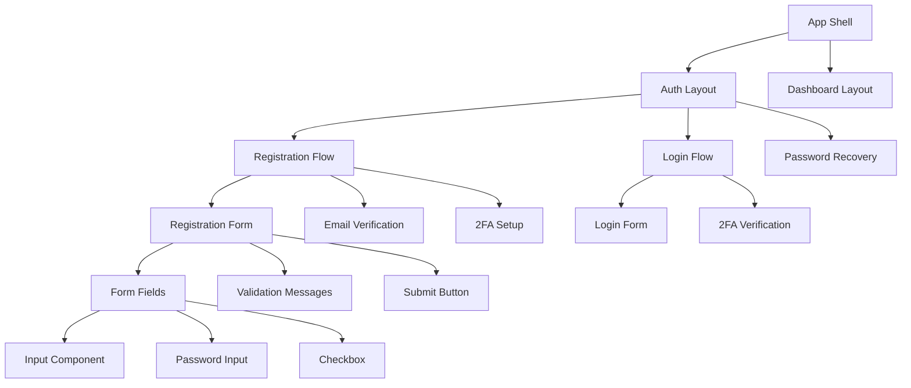
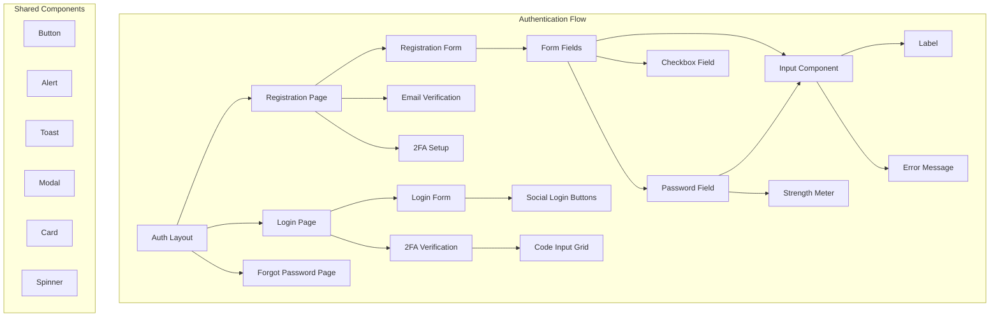

# Component Architecture - Gate 1

## Project: SUMA Finance
## Feature: User Registration & Authentication

---

## 1. Component Architecture Overview

### Architecture Principles
- **Component-Based Design**: Modular, reusable, and composable components
- **Single Responsibility**: Each component handles one specific concern
- **Composition over Inheritance**: Build complex UIs from simple components
- **Separation of Concerns**: Presentational vs Container components
- **Accessibility First**: WCAG 2.1 AA compliance by default
- **Type Safety**: TypeScript for robust interfaces and compile-time checks

### Framework Selection
**Primary Framework**: **React 18+** with TypeScript

**Rationale**:
- Industry standard for fintech applications
- Strong ecosystem for authentication (NextAuth.js, Auth0, Clerk)
- Excellent TypeScript support
- Rich component libraries for financial UIs
- Superior testing tools and practices
- Large talent pool for hiring

**Supporting Technologies**:
- **Next.js 14+**: Server-side rendering, API routes, optimized routing
- **React Hook Form**: Performant form management
- **Zod**: Runtime schema validation
- **Tailwind CSS**: Utility-first styling with design tokens
- **Radix UI**: Unstyled, accessible component primitives
- **Framer Motion**: Smooth animations for feedback

### Component Hierarchy



### Design System Integration
- **Design Token System**: Colors, typography, spacing, shadows defined centrally
- **Component Library**: Shared `@suma/ui` package for consistency
- **Figma Integration**: Component naming aligned with design specs
- **Theme Provider**: Support for light/dark modes and accessibility preferences

---

## 2. Component Classification

### Atomic Design Hierarchy

#### **Atoms**
```typescript
// Button, Input, Label, Icon, Badge, Spinner
<Button variant="primary" size="md" />
<Input type="email" error={errors.email} />
<Label htmlFor="email">Email Address</Label>
<Icon name="lock" size={20} />
```

#### **Molecules**
```typescript
// Form Field (Label + Input + Error), Password Field, Checkbox Field
<FormField
  label="Email"
  name="email"
  type="email"
  error={errors.email}
  required
/>

<PasswordField
  label="Password"
  name="password"
  showStrengthMeter
  error={errors.password}
/>
```

#### **Organisms**
```typescript
// Registration Form, Login Form, 2FA Form, Email Verification Card
<RegistrationForm
  onSubmit={handleSubmit}
  defaultValues={initialValues}
/>

<TwoFactorVerificationForm
  method="authenticator"
  onVerify={handleVerify}
/>
```

#### **Templates**
```typescript
// Auth Page Template, Verification Page Template
<AuthPageTemplate
  title="Create Account"
  subtitle="Join SUMA Finance"
  illustration={<RegistrationIllustration />}
>
  <RegistrationForm />
</AuthPageTemplate>
```

#### **Pages**
```typescript
// /register, /login, /verify-email, /setup-2fa
export default function RegisterPage() {
  return (
    <AuthPageTemplate title="Register">
      <RegistrationFlow />
    </AuthPageTemplate>
  );
}
```

### Component Categories

#### **Presentational Components (Dumb)**
- Pure, stateless components
- Receive data via props
- Emit events via callbacks
- Examples: Button, Input, Card, Badge

```typescript
interface ButtonProps {
  variant: 'primary' | 'secondary' | 'ghost';
  size: 'sm' | 'md' | 'lg';
  children: ReactNode;
  onClick?: () => void;
  disabled?: boolean;
  loading?: boolean;
}

export const Button: FC<ButtonProps> = ({
  variant,
  size,
  children,
  onClick,
  disabled,
  loading
}) => {
  return (
    <button
      className={cn(buttonStyles({ variant, size }))}
      onClick={onClick}
      disabled={disabled || loading}
      aria-busy={loading}
    >
      {loading && <Spinner size="sm" />}
      {children}
    </button>
  );
};
```

#### **Container Components (Smart)**
- Manage state and logic
- Fetch data and handle side effects
- Pass data to presentational components
- Examples: RegistrationFormContainer, AuthProvider

```typescript
export const RegistrationFormContainer: FC = () => {
  const [step, setStep] = useState<'details' | 'verify' | '2fa'>('details');
  const { mutate: register, isLoading } = useRegisterMutation();
  
  const handleSubmit = (data: RegistrationData) => {
    register(data, {
      onSuccess: () => setStep('verify')
    });
  };
  
  return (
    <RegistrationForm
      onSubmit={handleSubmit}
      isLoading={isLoading}
      currentStep={step}
    />
  );
};
```

#### **Higher-Order Components (HOCs)**
```typescript
// withAuth HOC - Protect routes requiring authentication
export function withAuth<P extends object>(
  Component: ComponentType<P>
) {
  return function AuthenticatedComponent(props: P) {
    const { user, isLoading } = useAuth();
    const router = useRouter();
    
    useEffect(() => {
      if (!isLoading && !user) {
        router.push('/login');
      }
    }, [user, isLoading, router]);
    
    if (isLoading) return <LoadingSpinner />;
    if (!user) return null;
    
    return <Component {...props} />;
  };
}
```

#### **Hooks-Based Components**
```typescript
// Custom hooks for authentication logic
export const useRegistration = () => {
  const [errors, setErrors] = useState<RegistrationErrors>({});
  const { mutate, isLoading } = useMutation(registerUser);
  
  const validateEmail = (email: string) => {
    // Validation logic
  };
  
  const register = (data: RegistrationData) => {
    mutate(data);
  };
  
  return { register, errors, isLoading, validateEmail };
};
```

---

## 3. Component Organization Strategy

### Directory Structure
**Feature-Based + Atomic Design Hybrid**

```
src/
├── components/
│   ├── ui/                          # Atomic components (shared)
│   │   ├── atoms/
│   │   │   ├── Button/
│   │   │   │   ├── Button.tsx
│   │   │   │   ├── Button.test.tsx
│   │   │   │   ├── Button.stories.tsx
│   │   │   │   ├── Button.module.css
│   │   │   │   └── index.ts
│   │   │   ├── Input/
│   │   │   ├── Label/
│   │   │   ├── Icon/
│   │   │   └── index.ts
│   │   ├── molecules/
│   │   │   ├── FormField/
│   │   │   ├── PasswordField/
│   │   │   ├── CheckboxField/
│   │   │   └── index.ts
│   │   └── index.ts
│   └── layout/
│       ├── AuthLayout/
│       ├── DashboardLayout/
│       └── index.ts
├── features/
│   └── auth/                        # Feature-specific components
│       ├── components/
│       │   ├── RegistrationForm/
│       │   │   ├── RegistrationForm.tsx
│       │   │   ├── RegistrationForm.test.tsx
│       │   │   ├── useRegistrationForm.ts
│       │   │   └── index.ts
│       │   ├── LoginForm/
│       │   ├── TwoFactorVerification/
│       │   ├── EmailVerification/
│       │   └── index.ts
│       ├── hooks/
│       │   ├── useAuth.ts
│       │   ├── useRegistration.ts
│       │   ├── useLogin.ts
│       │   └── index.ts
│       ├── api/
│       │   ├── auth.api.ts
│       │   └── index.ts
│       ├── types/
│       │   ├── auth.types.ts
│       │   └── index.ts
│       └── schemas/
│           ├── registration.schema.ts
│           ├── login.schema.ts
│           └── index.ts
├── pages/
│   ├── register.tsx
│   ├── login.tsx
│   ├── verify-email.tsx
│   └── setup-2fa.tsx
└── styles/
    ├── globals.css
    └── theme.css
```

### File Organization Conventions

1. **Component File Structure**:
   ```
   ComponentName/
   ├── ComponentName.tsx          # Main component
   ├── ComponentName.test.tsx     # Unit tests
   ├── ComponentName.stories.tsx  # Storybook stories
   ├── ComponentName.module.css   # Component styles (if not using Tailwind)
   ├── useComponentName.ts        # Component-specific hook (if needed)
   └── index.ts                   # Barrel export
   ```

2. **Barrel Exports** (`index.ts`):
   ```typescript
   export { Button } from './Button';
   export type { ButtonProps } from './Button';
   ```

### Component Naming Conventions

- **PascalCase** for component names: `RegistrationForm`, `PasswordField`
- **camelCase** for hooks: `useAuth`, `useRegistrationForm`
- **UPPER_SNAKE_CASE** for constants: `MAX_PASSWORD_LENGTH`
- **Descriptive names**: `EmailVerificationCard` not `Card2`
- **Prefix for context**: `AuthProvider`, `ThemeProvider`
- **Suffix for containers**: `RegistrationFormContainer`

---

## 4. Core UI Components

### Form Components

#### **Input Component**
```typescript
interface InputProps extends InputHTMLAttributes<HTMLInputElement> {
  label?: string;
  error?: string;
  helperText?: string;
  leftIcon?: ReactNode;
  rightIcon?: ReactNode;
  required?: boolean;
}

export const Input = forwardRef<HTMLInputElement, InputProps>(
  ({ label, error, helperText, leftIcon, rightIcon, required, ...props }, ref) => {
    const id = useId();
    
    return (
      <div className="space-y-1">
        {label && (
          <Label htmlFor={id} required={required}>
            {label}
          </Label>
        )}
        <div className="relative">
          {leftIcon && (
            <div className="absolute left-3 top-1/2 -translate-y-1/2">
              {leftIcon}
            </div>
          )}
          <input
            id={id}
            ref={ref}
            className={cn(
              "w-full px-3 py-2 border rounded-lg",
              "focus:ring-2 focus:ring-primary-500 focus:border-primary-500",
              error && "border-red-500",
              leftIcon && "pl-10",
              rightIcon && "pr-10"
            )}
            aria-invalid={!!error}
            aria-describedby={error ? `${id}-error` : undefined}
            {...props}
          />
          {rightIcon && (
            <div className="absolute right-3 top-1/2 -translate-y-1/2">
              {rightIcon}
            </div>
          )}
        </div>
        {error && (
          <p id={`${id}-error`} className="text-sm text-red-600" role="alert">
            {error}
          </p>
        )}
        {helperText && !error && (
          <p className="text-sm text-gray-600">{helperText}</p>
        )}
      </div>
    );
  }
);
```

#### **PasswordField Component**
```typescript
interface PasswordFieldProps extends Omit<InputProps, 'type'> {
  showStrengthMeter?: boolean;
  onStrengthChange?: (strength: PasswordStrength) => void;
}

export const PasswordField: FC<PasswordFieldProps> = ({
  showStrengthMeter,
  onStrengthChange,
  ...props
}) => {
  const [showPassword, setShowPassword] = useState(false);
  const [strength, setStrength] = useState<PasswordStrength>('weak');
  
  const handlePasswordChange = (e: ChangeEvent<HTMLInputElement>) => {
    const newStrength = calculatePasswordStrength(e.target.value);
    setStrength(newStrength);
    onStrengthChange?.(newStrength);
    props.onChange?.(e);
  };
  
  return (
    <div className="space-y-2">
      <Input
        {...props}
        type={showPassword ? 'text' : 'password'}
        onChange={handlePasswordChange}
        rightIcon={
          <button
            type="button"
            onClick={() => setShowPassword(!showPassword)}
            aria-label={showPassword ? 'Hide password' : 'Show password'}
          >
            <Icon name={showPassword ? 'eye-off' : 'eye'} />
          </button>
        }
      />
      {showStrengthMeter && (
        <PasswordStrengthMeter strength={strength} />
      )}
    </div>
  );
};
```

#### **CheckboxField Component**
```typescript
interface CheckboxFieldProps {
  label: ReactNode;
  name: string;
  checked?: boolean;
  onChange?: (checked: boolean) => void;
  error?: string;
  required?: boolean;
}

export const CheckboxField: FC<CheckboxFieldProps> = ({
  label,
  name,
  checked,
  onChange,
  error,
  required
}) => {
  const id = useId();
  
  return (
    <div className="space-y-1">
      <div className="flex items-start gap-2">
        <input
          id={id}
          type="checkbox"
          name={name}
          checked={checked}
          onChange={(e) => onChange?.(e.target.checked)}
          className={cn(
            "mt-1 h-4 w-4 rounded border-gray-300",
            "focus:ring-2 focus:ring-primary-500",
            error && "border-red-500"
          )}
          aria-invalid={!!error}
          aria-describedby={error ? `${id}-error` : undefined}
        />
        <label htmlFor={id} className="text-sm">
          {label}
          {required && <span className="text-red-500 ml-1">*</span>}
        </label>
      </div>
      {error && (
        <p id={`${id}-error`} className="text-sm text-red-600 ml-6" role="alert">
          {error}
        </p>
      )}
    </div>
  );
};
```

### Button Components

```typescript
interface ButtonProps extends ButtonHTMLAttributes<HTMLButtonElement> {
  variant?: 'primary' | 'secondary' | 'ghost' | 'danger';
  size?: 'sm' | 'md' | 'lg';
  loading?: boolean;
  leftIcon?: ReactNode;
  rightIcon?: ReactNode;
  fullWidth?: boolean;
}

export const Button: FC<ButtonProps> = ({
  variant = 'primary',
  size = 'md',
  loading,
  leftIcon,
  rightIcon,
  fullWidth,
  children,
  disabled,
  ...props
}) => {
  return (
    <button
      className={cn(
        "inline-flex items-center justify-center gap-2 rounded-lg font-medium transition-colors",
        "focus:outline-none focus:ring-2 focus:ring-offset-2",
        "disabled:opacity-50 disabled:cursor-not-allowed",
        {
          'bg-primary-600 text-white hover:bg-primary-700 focus:ring-primary-500': variant === 'primary',
          'bg-gray-200 text-gray-900 hover:bg-gray-300 focus:ring-gray-500': variant === 'secondary',
          'bg-transparent text-primary-600 hover:bg-primary-50 focus:ring-primary-500': variant === 'ghost',
          'bg-red-600 text-white hover:bg-red-700 focus:ring-red-500': variant === 'danger',
          'px-3 py-1.5 text-sm': size === 'sm',
          'px-4 py-2 text-base': size === 'md',
          'px-6 py-3 text-lg': size === 'lg',
          'w-full': fullWidth
        }
      )}
      disabled={disabled || loading}
      aria-busy={loading}
      {...props}
    >
      {loading && <Spinner size={size === 'sm' ? 'xs' : 'sm'} />}
      {!loading && leftIcon}
      {children}
      {!loading && rightIcon}
    </button>
  );
};
```

### Feedback Components

#### **Alert Component**
```typescript
interface AlertProps {
  variant: 'info' | 'success' | 'warning' | 'error';
  title?: string;
  children: ReactNode;
  onClose?: () => void;
}

export const Alert: FC<AlertProps> = ({ variant, title, children, onClose }) => {
  const icons = {
    info: 'info-circle',
    success: 'check-circle',
    warning: 'warning',
    error: 'x-circle'
  };
  
  const colors = {
    info: 'bg-blue-50 border-blue-200 text-blue-800',
    success: 'bg-green-50 border-green-200 text-green-800',
    warning: 'bg-yellow-50 border-yellow-200 text-yellow-800',
    error: 'bg-red-50 border-red-200 text-red-800'
  };
  
  return (
    <div
      className={cn("p-4 border rounded-lg", colors[variant])}
      role="alert"
    >
      <div className="flex gap-3">
        <Icon name={icons[variant]} className="flex-shrink-0 mt-0.5" />
        <div className="flex-1">
          {title && <h4 className="font-semibold mb-1">{title}</h4>}
          <div className="text-sm">{children}</div>
        </div>
        {onClose && (
          <button
            onClick={onClose}
            className="flex-shrink-0 hover:opacity-70"
            aria-label="Close alert"
          >
            <Icon name="x" size={20} />
          </button>
        )}
      </div>
    </div>
  );
};
```

#### **Toast Component**
```typescript
// Using react-hot-toast or custom implementation
import { toast as showToast } from 'react-hot-toast';

export const toast = {
  success: (message: string) => showToast.success(message),
  error: (message: string) => showToast.error(message),
  loading: (message: string) => showToast.loading(message),
  promise: <T,>(
    promise: Promise<T>,
    messages: {
      loading: string;
      success: string;
      error: string;
    }
  ) => showToast.promise(promise, messages)
};

// Usage
toast.success('Registration successful!');
toast.error('Invalid credentials');
```

---

## 5. Component Design Patterns

### Compound Components Pattern

```typescript
// Tabs compound component example
interface TabsContextValue {
  activeTab: string;
  setActiveTab: (tab: string) => void;
}

const TabsContext = createContext<TabsContextValue | null>(null);

export const Tabs: FC<{ defaultTab: string; children: ReactNode }> & {
  List: FC<{ children: ReactNode }>;
  Tab: FC<{ value: string; children: ReactNode }>;
  Panel: FC<{ value: string; children: ReactNode }>;
} = ({ defaultTab, children }) => {
  const [activeTab, setActiveTab] = useState(defaultTab);
  
  return (
    <TabsContext.Provider value={{ activeTab, setActiveTab }}>
      <div>{children}</div>
    </TabsContext.Provider>
  );
};

Tabs.List = ({ children }) => {
  return <div role="tablist" className="flex gap-2 border-b">{children}</div>;
};

Tabs.Tab = ({ value, children }) => {
  const context = useContext(TabsContext);
  const isActive = context?.activeTab === value;
  
  return (
    <button
      role="tab"
      aria-selected={isActive}
      onClick={() => context?.setActiveTab(value)}
      className={cn("px-4 py-2", isActive && "border-b-2 border-primary-600")}
    >
      {children}
    </button>
  );
};

Tabs.Panel = ({ value, children }) => {
  const context = useContext(TabsContext);
  if (context?.activeTab !== value) return null;
  
  return <div role="tabpanel" className="p-4">{children}</div>;
};

// Usage
<Tabs defaultTab="email">
  <Tabs.List>
    <Tabs.Tab value="email">Email</Tabs.Tab>
    <Tabs.Tab value="sms">SMS</Tabs.Tab>
  </Tabs.List>
  <Tabs.Panel value="email">
    <EmailVerification />
  </Tabs.Panel>
  <Tabs.Panel value="sms">
    <SMSVerification />
  </Tabs.Panel>
</Tabs>
```

### Render Props Pattern

```typescript
interface FormStateProps<T> {
  initialValues: T;
  onSubmit: (values: T) => void;
  children: (props: {
    values: T;
    errors: Record<string, string>;
    handleChange: (field: keyof T, value: any) => void;
    handleSubmit: () => void;
    isSubmitting: boolean;
  }) => ReactNode;
}

export function FormState<T extends Record<string, any>>({
  initialValues,
  onSubmit,
  children
}: FormStateProps<T>) {
  const [values, setValues] = useState<T>(initialValues);
  const [errors, setErrors] = useState<Record<string, string>>({});
  const [isSubmitting, setIsSubmitting] = useState(false);
  
  const handleChange = (field: keyof T, value: any) => {
    setValues(prev => ({ ...prev, [field]: value }));
  };
  
  const handleSubmit = async () => {
    setIsSubmitting(true);
    await onSubmit(values);
    setIsSubmitting(false);
  };
  
  return <>{children({ values, errors, handleChange, handleSubmit, isSubmitting })}</>;
}

// Usage
<FormState
  initialValues={{ email: '', password: '' }}
  onSubmit={handleLogin}
>
  {({ values, errors, handleChange, handleSubmit, isSubmitting }) => (
    <form onSubmit={handleSubmit}>
      <Input
        value={values.email}
        onChange={(e) => handleChange('email', e.target.value)}
        error={errors.email}
      />
      <Button type="submit" loading={isSubmitting}>Login</Button>
    </form>
  )}
</FormState>
```

### Custom Hooks Pattern

```typescript
// useForm hook for form management
export const useRegistrationForm = () => {
  const form = useForm<RegistrationFormData>({
    resolver: zodResolver(registrationSchema),
    defaultValues: {
      email: '',
      password: '',
      firstName: '',
      lastName: '',
      agreeToTerms: false
    }
  });
  
  const { mutate: register, isLoading } = useRegisterMutation();
  
  const onSubmit = form.handleSubmit((data) => {
    register(data, {
      onSuccess: () => {
        toast.success('Registration successful!');
      },
      onError: (error) => {
        toast.error(error.message);
      }
    });
  });
  
  return {
    ...form,
    onSubmit,
    isLoading
  };
};

// Usage in component
export const RegistrationForm: FC = () => {
  const { register, formState: { errors }, onSubmit, isLoading } = useRegistrationForm();
  
  return (
    <form onSubmit={onSubmit}>
      <Input {...register('email')} error={errors.email?.message} />
      <Button type="submit" loading={isLoading}>Register</Button>
    </form>
  );
};
```

### Controlled vs Uncontrolled Components

```typescript
// Controlled Input (recommended for forms)
const [email, setEmail] = useState('');

<Input
  value={email}
  onChange={(e) => setEmail(e.target.value)}
/>

// Uncontrolled Input (for simple cases)
const emailRef = useRef<HTMLInputElement>(null);

<input ref={emailRef} defaultValue="user@example.com" />

// Access value: emailRef.current?.value
```

---

## 6. Component Composition

### Component Reusability

```typescript
// Generic FormField component
interface FormFieldProps<T extends FieldValues> {
  name: Path<T>;
  label: string;
  type?: HTMLInputTypeAttribute;
  required?: boolean;
  helperText?: string;
  control: Control<T>;
}

export function FormField<T extends FieldValues>({
  name,
  label,
  type = 'text',
  required,
  helperText,
  control
}: FormFieldProps<T>) {
  return (
    <Controller
      name={name}
      control={control}
      render={({ field, fieldState: { error } }) => (
        <Input
          {...field}
          label={label}
          type={type}
          required={required}
          error={error?.message}
          helperText={helperText}
        />
      )}
    />
  );
}

// Usage - fully reusable
<FormField
  name="email"
  label="Email Address"
  type="email"
  required
  control={form.control}
/>
```

### Children Props Composition

```typescript
// Card component with flexible content
interface CardProps {
  children: ReactNode;
  header?: ReactNode;
  footer?: ReactNode;
  variant?: 'default' | 'elevated' | 'outlined';
}

export const Card: FC<CardProps> = ({
  children,
  header,
  footer,
  variant = 'default'
}) => {
  return (
    <div
      className={cn(
        "rounded-lg",
        variant === 'elevated' && "shadow-lg",
        variant === 'outlined' && "border border-gray-200"
      )}
    >
      {header && <div className="p-4 border-b">{header}</div>}
      <div className="p-4">{children}</div>
      {footer && <div className="p-4 border-t bg-gray-50">{footer}</div>}
    </div>
  );
};

// Usage
<Card
  header={<h3>User Registration</h3>}
  footer={<Button>Submit</Button>}
>
  <RegistrationForm />
</Card>
```

### Slot-Based Composition

```typescript
// Modal with named slots
interface ModalProps {
  isOpen: boolean;
  onClose: () => void;
  title: ReactNode;
  children: ReactNode;
  footer?: ReactNode;
  size?: 'sm' | 'md' | 'lg' | 'xl';
}

export const Modal: FC<ModalProps> = ({
  isOpen,
  onClose,
  title,
  children,
  footer,
  size = 'md'
}) => {
  if (!isOpen) return null;
  
  return (
    <Dialog open={isOpen} onOpenChange={onClose}>
      <DialogContent size={size}>
        <DialogHeader>
          <DialogTitle>{title}</DialogTitle>
        </DialogHeader>
        <DialogBody>{children}</DialogBody>
        {footer && <DialogFooter>{footer}</DialogFooter>}
      </DialogContent>
    </Dialog>
  );
};
```

---

## 7. Props and API Design

### Props Interface Design

```typescript
// Well-designed props interface
interface RegistrationFormProps {
  // Required props
  onSubmit: (data: RegistrationFormData) => void;
  
  // Optional props with defaults
  defaultValues?: Partial<RegistrationFormData>;
  variant?: 'compact' | 'detailed';
  
  // Boolean props with "is", "has", "show" prefix
  isLoading?: boolean;
  showSocialLogin?: boolean;
  
  // Event handlers with "on" prefix
  onSuccess?: (user: User) => void;
  onError?: (error: Error) => void;
  
  // Render props for customization
  renderFooter?: (props: { isSubmitting: boolean }) => ReactNode;
  
  // Style overrides
  className?: string;
  styles?: Partial<RegistrationFormStyles>;
}

// Type-safe default props
const defaultProps: Partial<RegistrationFormProps> = {
  variant: 'detailed',
  isLoading: false,
  showSocialLogin: true
};
```

### Props Spreading and Rest Props

```typescript
// Forward all HTML attributes to underlying element
interface InputProps extends Omit<InputHTMLAttributes<HTMLInputElement>, 'size'> {
  label?: string;
  error?: string;
  size?: 'sm' | 'md' | 'lg'; // Override HTML size attribute
}

export const Input = forwardRef<HTMLInputElement, InputProps>(
  ({ label, error, size = 'md', className, ...rest }, ref) => {
    return (
      <div>
        {label && <label>{label}</label>}
        <input
          ref={ref}
          className={cn('input', `input-${size}`, className)}
          aria-invalid={!!error}
          {...rest} // Spread remaining props
        />
        {error && <span>{error}</span>}
      </div>
    );
  }
);
```

### Ref Forwarding

```typescript
// Forwarding ref to access DOM element
export const Input = forwardRef<HTMLInputElement, InputProps>(
  (props, ref) => {
    return <input ref={ref} {...props} />;
  }
);

// Usage
const inputRef = useRef<HTMLInputElement>(null);

useEffect(() => {
  inputRef.current?.focus(); // Direct DOM access
}, []);

<Input ref={inputRef} />
```

---

## 8. Component State Management

### Local Component State

```typescript
// Simple state with useState
export const LoginForm: FC = () => {
  const [email, setEmail] = useState('');
  const [password, setPassword] = useState('');
  const [rememberMe, setRememberMe] = useState(false);
  
  // Complex state with useReducer
  const [state, dispatch] = useReducer(loginReducer, initialState);
  
  return (
    <form>
      <Input value={email} onChange={(e) => setEmail(e.target.value)} />
      <Input value={password} onChange={(e) => setPassword(e.target.value)} />
      <Checkbox checked={rememberMe} onChange={setRememberMe} />
    </form>
  );
};

// useReducer for complex state
type LoginState = {
  step: 'credentials' | '2fa' | 'success';
  email: string;
  password: string;
  twoFactorCode: string;
  error: string | null;
};

type LoginAction =
  | { type: 'SET_CREDENTIALS'; email: string; password: string }
  | { type: 'PROCEED_TO_2FA' }
  | { type: 'SET_2FA_CODE'; code: string }
  | { type: 'SET_ERROR'; error: string }
  | { type: 'RESET' };

const loginReducer = (state: LoginState, action: LoginAction): LoginState => {
  switch (action.type) {
    case 'SET_CREDENTIALS':
      return { ...state, email: action.email, password: action.password };
    case 'PROCEED_TO_2FA':
      return { ...state, step: '2fa' };
    case 'SET_2FA_CODE':
      return { ...state, twoFactorCode: action.code };
    case 'SET_ERROR':
      return { ...state, error: action.error };
    case 'RESET':
      return initialState;
    default:
      return state;
  }
};
```

### Derived State

```typescript
// Compute values from props/state - don't store redundantly
export const PasswordField: FC<PasswordFieldProps> = ({ value, onChange }) => {
  // Derived state - recalculated on each render
  const strength = useMemo(() => {
    return calculatePasswordStrength(value);
  }, [value]);
  
  const hasUpperCase = /[A-Z]/.test(value);
  const hasLowerCase = /[a-z]/.test(value);
  const hasNumber = /[0-9]/.test(value);
  const hasSpecial = /[^A-Za-z0-9]/.test(value);
  
  return (
    <div>
      <Input type="password" value={value} onChange={onChange} />
      <PasswordStrengthMeter strength={strength} />
      <PasswordRequirements
        hasUpperCase={hasUpperCase}
        hasLowerCase={hasLowerCase}
        hasNumber={hasNumber}
        hasSpecial={hasSpecial}
      />
    </div>
  );
};
```

### Component-Level Context

```typescript
// Auth context for authentication state
interface AuthContextValue {
  user: User | null;
  isAuthenticated: boolean;
  isLoading: boolean;
  login: (credentials: LoginCredentials) => Promise<void>;
  logout: () => Promise<void>;
  register: (data: RegistrationData) => Promise<void>;
}

const AuthContext = createContext<AuthContextValue | null>(null);

export const AuthProvider: FC<{ children: ReactNode }> = ({ children }) => {
  const [user, setUser] = useState<User | null>(null);
  const [isLoading, setIsLoading] = useState(true);
  
  useEffect(() => {
    // Check for existing session
    checkSession().then(setUser).finally(() => setIsLoading(false));
  }, []);
  
  const login = async (credentials: LoginCredentials) => {
    const user = await authApi.login(credentials);
    setUser(user);
  };
  
  const logout = async () => {
    await authApi.logout();
    setUser(null);
  };
  
  const register = async (data: RegistrationData) => {
    const user = await authApi.register(data);
    setUser(user);
  };
  
  const value = {
    user,
    isAuthenticated: !!user,
    isLoading,
    login,
    logout,
    register
  };
  
  return <AuthContext.Provider value={value}>{children}</AuthContext.Provider>;
};

// Custom hook for consuming context
export const useAuth = () => {
  const context = useContext(AuthContext);
  if (!context) {
    throw new Error('useAuth must be used within AuthProvider');
  }
  return context;
};

// Usage
export const LoginForm: FC = () => {
  const { login, isLoading } = useAuth();
  
  const handleSubmit = async (data: LoginFormData) => {
    await login(data);
  };
  
  return <form>...</form>;
};
```

---

## 9. Styling Architecture

### Styling Approach: **Tailwind CSS + CSS Modules**

**Primary**: Tailwind CSS for utility-first styling
**Secondary**: CSS Modules for complex component-specific styles

```typescript
// Tailwind CSS (90% of styling)
export const Button: FC<ButtonProps> = ({ variant, size, children }) => {
  return (
    <button
      className={cn(
        "inline-flex items-center justify-center rounded-lg font-medium",
        "transition-colors duration-200",
        "focus:outline-none focus:ring-2 focus:ring-offset-2",
        {
          'bg-primary-600 text-white hover:bg-primary-700': variant === 'primary',
          'px-4 py-2 text-base': size === 'md',
        }
      )}
    >
      {children}
    </button>
  );
};

// CSS Modules for complex animations/specific needs
import styles from './RegistrationFlow.module.css';

export const RegistrationFlow: FC = () => {
  return (
    <div className={styles.flowContainer}>
      <div className={styles.stepIndicator} />
      <div className={styles.formContent} />
    </div>
  );
};
```

### Theming with CSS Variables

```css
/* globals.css */
:root {
  /* Colors */
  --color-primary-50: #eff6ff;
  --color-primary-100: #dbeafe;
  --color-primary-500: #3b82f6;
  --color-primary-600: #2563eb;
  --color-primary-700: #1d4ed8;
  
  /* Typography */
  --font-sans: 'Inter', system-ui, sans-serif;
  --font-mono: 'Fira Code', monospace;
  
  /* Spacing */
  --spacing-xs: 0.25rem;
  --spacing-sm: 0.5rem;
  --spacing-md: 1rem;
  --spacing-lg: 1.5rem;
  --spacing-xl: 2rem;
  
  /* Border Radius */
  --radius-sm: 0.25rem;
  --radius-md: 0.5rem;
  --radius-lg: 0.75rem;
  
  /* Shadows */
  --shadow-sm: 0 1px 2px 0 rgb(0 0 0 / 0.05);
  --shadow-md: 0 4px 6px -1px rgb(0 0 0 / 0.1);
  --shadow-lg: 0 10px 15px -3px rgb(0 0 0 / 0.1);
}

[data-theme='dark'] {
  --color-primary-50: #1e293b;
  --color-primary-100: #334155;
  /* ... dark theme colors */
}
```

### Tailwind Configuration

```javascript
// tailwind.config.js
module.exports = {
  content: ['./src/**/*.{js,ts,jsx,tsx}'],
  theme: {
    extend: {
      colors: {
        primary: {
          50: 'var(--color-primary-50)',
          100: 'var(--color-primary-100)',
          500: 'var(--color-primary-500)',
          600: 'var(--color-primary-600)',
          700: 'var(--color-primary-700)',
        }
      },
      fontFamily: {
        sans: ['var(--font-sans)'],
        mono: ['var(--font-mono)'],
      },
      spacing: {
        xs: 'var(--spacing-xs)',
        sm: 'var(--spacing-sm)',
        md: 'var(--spacing-md)',
        lg: 'var(--spacing-lg)',
        xl: 'var(--spacing-xl)',
      }
    }
  },
  plugins: [
    require('@tailwindcss/forms'),
    require('@tailwindcss/typography'),
  ]
};
```

### Dark Mode Support

```typescript
// Theme provider
export const ThemeProvider: FC<{ children: ReactNode }> = ({ children }) => {
  const [theme, setTheme] = useState<'light' | 'dark'>('light');
  
  useEffect(() => {
    const root = document.documentElement;
    root.setAttribute('data-theme', theme);
  }, [theme]);
  
  const toggleTheme = () => {
    setTheme(prev => prev === 'light' ? 'dark' : 'light');
  };
  
  return (
    <ThemeContext.Provider value={{ theme, toggleTheme }}>
      {children}
    </ThemeContext.Provider>
  );
};

// Usage
<html className="dark"> {/* or controlled by state */}
  <body className="bg-white dark:bg-gray-900 text-gray-900 dark:text-white">
    <App />
  </body>
</html>
```

### Responsive Design

```typescript
// Mobile-first responsive design
<div className="
  w-full                    /* Mobile: full width */
  md:w-1/2                  /* Tablet: half width */
  lg:w-1/3                  /* Desktop: third width */
  p-4                       /* Mobile: padding 1rem */
  md:p-6                    /* Tablet: padding 1.5rem */
  lg:p-8                    /* Desktop: padding 2rem */
">
  <RegistrationForm />
</div>

// Hide on mobile, show on desktop
<div className="hidden md:block">
  <Sidebar />
</div>

// Stack on mobile, row on desktop
<div className="flex flex-col md:flex-row gap-4">
  <LoginForm />
  <Divider />
  <SocialLogin />
</div>
```

---

## 10. Component Accessibility (a11y)

### Semantic HTML

```typescript
// Good: Semantic HTML
<nav aria-label="Main navigation">
  <ul>
    <li><a href="/register">Register</a></li>
    <li><a href="/login">Login</a></li>
  </ul>
</nav>

<main>
  <h1>User Registration</h1>
  <form>
    <fieldset>
      <legend>Personal Information</legend>
      {/* form fields */}
    </fieldset>
  </form>
</main>

// Bad: Non-semantic divs
<div onClick={handleClick}>Click me</div> // Should be <button>
```

### ARIA Attributes

```typescript
export const Input = forwardRef<HTMLInputElement, InputProps>(
  ({ label, error, required, ...props }, ref) => {
    const id = useId();
    const errorId = `${id}-error`;
    const descriptionId = `${id}-description`;
    
    return (
      <>
        <label htmlFor={id}>
          {label}
          {required && <span aria-label="required">*</span>}
        </label>
        <input
          id={id}
          ref={ref}
          aria-invalid={!!error}
          aria-describedby={error ? errorId : descriptionId}
          aria-required={required}
          {...props}
        />
        {error && (
          <span id={errorId} role="alert">
            {error}
          </span>
        )}
      </>
    );
  }
);

// Modal with proper ARIA
export const Modal: FC<ModalProps> = ({ isOpen, title, children, onClose }) => {
  return (
    <div
      role="dialog"
      aria-modal="true"
      aria-labelledby="modal-title"
      aria-describedby="modal-description"
    >
      <h2 id="modal-title">{title}</h2>
      <div id="modal-description">{children}</div>
      <button onClick={onClose} aria-label="Close modal">×</button>
    </div>
  );
};
```

### Keyboard Navigation

```typescript
export const Dropdown: FC<DropdownProps> = ({ items, onSelect }) => {
  const [isOpen, setIsOpen] = useState(false);
  const [focusedIndex, setFocusedIndex] = useState(0);
  
  const handleKeyDown = (e: KeyboardEvent) => {
    switch (e.key) {
      case 'ArrowDown':
        e.preventDefault();
        setFocusedIndex(prev => Math.min(prev + 1, items.length - 1));
        break;
      case 'ArrowUp':
        e.preventDefault();
        setFocusedIndex(prev => Math.max(prev - 1, 0));
        break;
      case 'Enter':
      case ' ':
        e.preventDefault();
        onSelect(items[focusedIndex]);
        setIsOpen(false);
        break;
      case 'Escape':
        e.preventDefault();
        setIsOpen(false);
        break;
    }
  };
  
  return (
    <div onKeyDown={handleKeyDown}>
      <button
        onClick={() => setIsOpen(!isOpen)}
        aria-haspopup="listbox"
        aria-expanded={isOpen}
      >
        Select option
      </button>
      {isOpen && (
        <ul role="listbox">
          {items.map((item, index) => (
            <li
              key={item.id}
              role="option"
              aria-selected={index === focusedIndex}
              tabIndex={index === focusedIndex ? 0 : -1}
            >
              {item.label}
            </li>
          ))}
        </ul>
      )}
    </div>
  );
};
```

### Focus Management

```typescript
// Trap focus in modal
export const Modal: FC<ModalProps> = ({ isOpen, children, onClose }) => {
  const modalRef = useRef<HTMLDivElement>(null);
  const previousFocusRef = useRef<HTMLElement | null>(null);
  
  useEffect(() => {
    if (isOpen) {
      // Save current focus
      previousFocusRef.current = document.activeElement as HTMLElement;
      
      // Focus first focusable element in modal
      const firstFocusable = modalRef.current?.querySelector<HTMLElement>(
        'button, [href], input, select, textarea, [tabindex]:not([tabindex="-1"])'
      );
      firstFocusable?.focus();
    } else {
      // Restore focus when modal closes
      previousFocusRef.current?.focus();
    }
  }, [isOpen]);
  
  const handleKeyDown = (e: KeyboardEvent) => {
    if (e.key === 'Tab') {
      const focusableElements = modalRef.current?.querySelectorAll<HTMLElement>(
        'button, [href], input, select, textarea, [tabindex]:not([tabindex="-1"])'
      );
      
      if (!focusableElements) return;
      
      const firstElement = focusableElements[0];
      const lastElement = focusableElements[focusableElements.length - 1];
      
      if (e.shiftKey && document.activeElement === firstElement) {
        e.preventDefault();
        lastElement.focus();
      } else if (!e.shiftKey && document.activeElement === lastElement) {
        e.preventDefault();
        firstElement.focus();
      }
    }
  };
  
  return (
    <div ref={modalRef} onKeyDown={handleKeyDown} role="dialog">
      {children}
    </div>
  );
};
```

### Screen Reader Support

```typescript
// Live region for dynamic content
export const FormSubmitFeedback: FC<{ message: string; type: 'success' | 'error' }> = ({
  message,
  type
}) => {
  return (
    <div
      role="status"
      aria-live="polite"
      aria-atomic="true"
      className={type === 'error' ? 'text-red-600' : 'text-green-600'}
    >
      {message}
    </div>
  );
};

// Visually hidden but available to screen readers
export const VisuallyHidden: FC<{ children: ReactNode }> = ({ children }) => {
  return (
    <span className="sr-only">
      {children}
    </span>
  );
};

// Usage
<button>
  <Icon name="save" aria-hidden="true" />
  <VisuallyHidden>Save changes</VisuallyHidden>
</button>
```

---

## 11. Component Performance Optimization

### Memoization

```typescript
// React.memo for expensive components
export const UserCard = React.memo<UserCardProps>(({ user, onEdit }) => {
  return (
    <Card>
      <h3>{user.name}</h3>
      <p>{user.email}</p>
      <Button onClick={() => onEdit(user.id)}>Edit</Button>
    </Card>
  );
}, (prevProps, nextProps) => {
  // Custom comparison function
  return prevProps.user.id === nextProps.user.id;
});

// useMemo for expensive calculations
export const PasswordStrengthMeter: FC<{ password: string }> = ({ password }) => {
  const strength = useMemo(() => {
    // Expensive calculation
    return calculatePasswordStrength(password);
  }, [password]);
  
  return <StrengthBar strength={strength} />;
};

// useCallback for stable function references
export const RegistrationForm: FC = () => {
  const [formData, setFormData] = useState(initialData);
  
  // Memoized callback - doesn't change on every render
  const handleFieldChange = useCallback((field: string, value: any) => {
    setFormData(prev => ({ ...prev, [field]: value }));
  }, []); // Empty deps - function never changes
  
  return (
    <>
      <Input onChange={(e) => handleFieldChange('email', e.target.value)} />
      <Input onChange={(e) => handleFieldChange('password', e.target.value)} />
    </>
  );
};
```

### Code Splitting

```typescript
// Route-based code splitting
import { lazy, Suspense } from 'react';

const RegistrationPage = lazy(() => import('./pages/RegistrationPage'));
const LoginPage = lazy(() => import('./pages/LoginPage'));
const DashboardPage = lazy(() => import('./pages/DashboardPage'));

export const App = () => {
  return (
    <Suspense fallback={<LoadingSpinner />}>
      <Routes>
        <Route path="/register" element={<RegistrationPage />} />
        <Route path="/login" element={<LoginPage />} />
        <Route path="/dashboard" element={<DashboardPage />} />
      </Routes>
    </Suspense>
  );
};

// Component-based code splitting
const HeavyChartComponent = lazy(() => import('./components/HeavyChart'));

export const Dashboard: FC = () => {
  const [showChart, setShowChart] = useState(false);
  
  return (
    <div>
      <Button onClick={() => setShowChart(true)}>Show Chart</Button>
      {showChart && (
        <Suspense fallback={<Skeleton />}>
          <HeavyChartComponent />
        </Suspense>
      )}
    </div>
  );
};
```

### Virtualization

```typescript
// Virtual scrolling for large lists
import { FixedSizeList } from 'react-window';

export const UserList: FC<{ users: User[] }> = ({ users }) => {
  const Row = ({ index, style }: { index: number; style: CSSProperties }) => (
    <div style={style}>
      <UserCard user={users[index]} />
    </div>
  );
  
  return (
    <FixedSizeList
      height={600}
      itemCount={users.length}
      itemSize={80}
      width="100%"
    >
      {Row}
    </FixedSizeList>
  );
};
```

### Image Optimization

```typescript
// Next.js Image component with lazy loading
import Image from 'next/image';

export const UserAvatar: FC<{ src: string; alt: string }> = ({ src, alt }) => {
  return (
    <Image
      src={src}
      alt={alt}
      width={40}
      height={40}
      loading="lazy"
      placeholder="blur"
      blurDataURL="data:image/..."
    />
  );
};

// Responsive images
<picture>
  <source srcSet="/avatar-small.webp" media="(max-width: 768px)" type="image/webp" />
  <source srcSet="/avatar-large.webp" media="(min-width: 769px)" type="image/webp" />
  
</picture>
```

---

## 12. Form Component Architecture

### Form Library: React Hook Form + Zod

```typescript
// Registration form schema
import { z } from 'zod';

export const registrationSchema = z.object({
  firstName: z.string().min(2, 'First name must be at least 2 characters'),
  lastName: z.string().min(2, 'Last name must be at least 2 characters'),
  email: z.string().email('Invalid email address'),
  password: z
    .string()
    .min(8, 'Password must be at least 8 characters')
    .regex(/[A-Z]/, 'Password must contain at least one uppercase letter')
    .regex(/[a-z]/, 'Password must contain at least one lowercase letter')
    .regex(/[0-9]/, 'Password must contain at least one number')
    .regex(/[^A-Za-z0-9]/, 'Password must contain at least one special character'),
  confirmPassword: z.string(),
  agreeToTerms: z.boolean().refine(val => val === true, 'You must agree to the terms')
}).refine(data => data.password === data.confirmPassword, {
  message: 'Passwords do not match',
  path: ['confirmPassword']
});

export type RegistrationFormData = z.infer<typeof registrationSchema>;
```

### Form Implementation

```typescript
import { useForm } from 'react-hook-form';
import { zodResolver } from '@hookform/resolvers/zod';

export const RegistrationForm: FC = () => {
  const {
    register,
    handleSubmit,
    formState: { errors, isSubmitting, isDirty, isValid },
    watch,
    reset
  } = useForm<RegistrationFormData>({
    resolver: zodResolver(registrationSchema),
    mode: 'onBlur', // Validate on blur
    defaultValues: {
      firstName: '',
      lastName: '',
      email: '',
      password: '',
      confirmPassword: '',
      agreeToTerms: false
    }
  });
  
  const password = watch('password');
  
  const onSubmit = async (data: RegistrationFormData) => {
    try {
      await registerUser(data);
      toast.success('Registration successful!');
      reset();
    } catch (error) {
      toast.error('Registration failed. Please try again.');
    }
  };
  
  return (
    <form onSubmit={handleSubmit(onSubmit)} noValidate>
      <div className="grid grid-cols-2 gap-4">
        <Input
          label="First Name"
          {...register('firstName')}
          error={errors.firstName?.message}
          required
        />
        <Input
          label="Last Name"
          {...register('lastName')}
          error={errors.lastName?.message}
          required
        />
      </div>
      
      <Input
        label="Email"
        type="email"
        {...register('email')}
        error={errors.email?.message}
        required
      />
      
      <PasswordField
        label="Password"
        {...register('password')}
        error={errors.password?.message}
        showStrengthMeter
        required
      />
      
      <Input
        label="Confirm Password"
        type="password"
        {...register('confirmPassword')}
        error={errors.confirmPassword?.message}
        required
      />
      
      <CheckboxField
        label={
          <>
            I agree to the <a href="/terms">Terms of Service</a> and{' '}
            <a href="/privacy">Privacy Policy</a>
          </>
        }
        {...register('agreeToTerms')}
        error={errors.agreeToTerms?.message}
        required
      />
      
      <Button
        type="submit"
        fullWidth
        loading={isSubmitting}
        disabled={!isDirty || !isValid}
      >
        Create Account
      </Button>
    </form>
  );
};
```

### Multi-Step Form

```typescript
export const MultiStepRegistrationForm: FC = () => {
  const [currentStep, setCurrentStep] = useState<'details' | 'verify' | '2fa'>('details');
  const [formData, setFormData] = useState<Partial<RegistrationFormData>>({});
  
  const steps = [
    { id: 'details', label: 'Account Details', component: AccountDetailsStep },
    { id: 'verify', label: 'Email Verification', component: EmailVerificationStep },
    { id: '2fa', label: 'Two-Factor Setup', component: TwoFactorSetupStep }
  ];
  
  const currentStepIndex = steps.findIndex(s => s.id === currentStep);
  const CurrentStepComponent = steps[currentStepIndex].component;
  
  const handleStepComplete = (stepData: Partial<RegistrationFormData>) => {
    setFormData(prev => ({ ...prev, ...stepData }));
    
    if (currentStepIndex < steps.length - 1) {
      setCurrentStep(steps[currentStepIndex + 1].id as any);
    } else {
      // Final submission
      submitRegistration(formData);
    }
  };
  
  return (
    <div>
      <ProgressIndicator
        steps={steps}
        currentStep={currentStepIndex}
      />
      
      <CurrentStepComponent
        onComplete={handleStepComplete}
        initialData={formData}
      />
      
      {currentStepIndex > 0 && (
        <Button
          variant="ghost"
          onClick={() => setCurrentStep(steps[currentStepIndex - 1].id as any)}
        >
          Back
        </Button>
      )}
    </div>
  );
};
```

---

## 13. Component Testing

### Unit Testing with React Testing Library

```typescript
import { render, screen, fireEvent, waitFor } from '@testing-library/react';
import userEvent from '@testing-library/user-event';
import { RegistrationForm } from './RegistrationForm';

describe('RegistrationForm', () => {
  it('renders all form fields', () => {
    render(<RegistrationForm />);
    
    expect(screen.getByLabelText(/first name/i)).toBeInTheDocument();
    expect(screen.getByLabelText(/last name/i)).toBeInTheDocument();
    expect(screen.getByLabelText(/email/i)).toBeInTheDocument();
    expect(screen.getByLabelText(/^password$/i)).toBeInTheDocument();
    expect(screen.getByLabelText(/confirm password/i)).toBeInTheDocument();
    expect(screen.getByRole('button', { name: /create account/i })).toBeInTheDocument();
  });
  
  it('validates email format', async () => {
    const user = userEvent.setup();
    render(<RegistrationForm />);
    
    const emailInput = screen.getByLabelText(/email/i);
    await user.type(emailInput, 'invalid-email');
    await user.tab(); // Trigger blur validation
    
    expect(await screen.findByText(/invalid email address/i)).toBeInTheDocument();
  });
  
  it('validates password strength', async () => {
    const user = userEvent.setup();
    render(<RegistrationForm />);
    
    const passwordInput = screen.getByLabelText(/^password$/i);
    await user.type(passwordInput, 'weak');
    await user.tab();
    
    expect(await screen.findByText(/password must be at least 8 characters/i)).toBeInTheDocument();
  });
  
  it('validates password confirmation match', async () => {
    const user = userEvent.setup();
    render(<RegistrationForm />);
    
    const passwordInput = screen.getByLabelText(/^password$/i);
    const confirmInput = screen.getByLabelText(/confirm password/i);
    
    await user.type(passwordInput, 'ValidPass123!');
    await user.type(confirmInput, 'DifferentPass123!');
    await user.tab();
    
    expect(await screen.findByText(/passwords do not match/i)).toBeInTheDocument();
  });
  
  it('submits form with valid data', async () => {
    const onSubmit = jest.fn();
    const user = userEvent.setup();
    render(<RegistrationForm onSubmit={onSubmit} />);
    
    await user.type(screen.getByLabelText(/first name/i), 'John');
    await user.type(screen.getByLabelText(/last name/i), 'Doe');
    await user.type(screen.getByLabelText(/email/i), 'john.doe@example.com');
    await user.type(screen.getByLabelText(/^password$/i), 'ValidPass123!');
    await user.type(screen.getByLabelText(/confirm password/i), 'ValidPass123!');
    await user.click(screen.getByRole('checkbox', { name: /agree to terms/i }));
    
    await user.click(screen.getByRole('button', { name: /create account/i }));
    
    await waitFor(() => {
      expect(onSubmit).toHaveBeenCalledWith({
        firstName: 'John',
        lastName: 'Doe',
        email: 'john.doe@example.com',
        password: 'ValidPass123!',
        confirmPassword: 'ValidPass123!',
        agreeToTerms: true
      });
    });
  });
  
  it('disables submit button while submitting', async () => {
    const user = userEvent.setup();
    render(<RegistrationForm />);
    
    // Fill form with valid data
    await user.type(screen.getByLabelText(/first name/i), 'John');
    // ... fill other fields
    
    const submitButton = screen.getByRole('button', { name: /create account/i });
    await user.click(submitButton);
    
    expect(submitButton).toBeDisabled();
    expect(screen.getByRole('button', { name: /creating/i })).toBeInTheDocument();
  });
});
```

### Accessibility Testing

```typescript
import { axe, toHaveNoViolations } from 'jest-axe';

expect.extend(toHaveNoViolations);

describe('RegistrationForm Accessibility', () => {
  it('has no accessibility violations', async () => {
    const { container } = render(<RegistrationForm />);
    const results = await axe(container);
    expect(results).toHaveNoViolations();
  });
  
  it('has proper focus management', async () => {
    const user = userEvent.setup();
    render(<RegistrationForm />);
    
    const firstInput = screen.getByLabelText(/first name/i);
    const lastInput = screen.getByLabelText(/last name/i);
    
    expect(document.body).toHaveFocus();
    
    await user.tab();
    expect(firstInput).toHaveFocus();
    
    await user.tab();
    expect(lastInput).toHaveFocus();
  });
});
```

### Component Snapshot Testing

```typescript
import { render } from '@testing-library/react';
import { Button } from './Button';

describe('Button Snapshots', () => {
  it('renders primary button correctly', () => {
    const { container } = render(<Button variant="primary">Click me</Button>);
    expect(container.firstChild).toMatchSnapshot();
  });
  
  it('renders loading state correctly', () => {
    const { container } = render(<Button loading>Loading</Button>);
    expect(container.firstChild).toMatchSnapshot();
  });
});
```

---

## 14. Component Documentation

### Storybook Configuration

```typescript
// Button.stories.tsx
import type { Meta, StoryObj } from '@storybook/react';
import { Button } from './Button';

const meta: Meta<typeof Button> = {
  title: 'Components/Button',
  component: Button,
  tags: ['autodocs'],
  argTypes: {
    variant: {
      control: 'select',
      options: ['primary', 'secondary', 'ghost', 'danger']
    },
    size: {
      control: 'select',
      options: ['sm', 'md', 'lg']
    },
    loading: {
      control: 'boolean'
    },
    disabled: {
      control: 'boolean'
    }
  }
};

export default meta;
type Story = StoryObj<typeof Button>;

export const Primary: Story = {
  args: {
    variant: 'primary',
    children: 'Primary Button'
  }
};

export const Secondary: Story = {
  args: {
    variant: 'secondary',
    children: 'Secondary Button'
  }
};

export const Loading: Story = {
  args: {
    loading: true,
    children: 'Loading...'
  }
};

export const WithIcons: Story = {
  args: {
    leftIcon: <Icon name="plus" />,
    children: 'Add Item'
  }
};

export const AllVariants: Story = {
  render: () => (
    <div className="flex gap-4">
      <Button variant="primary">Primary</Button>
      <Button variant="secondary">Secondary</Button>
      <Button variant="ghost">Ghost</Button>
      <Button variant="danger">Danger</Button>
    </div>
  )
};
```

### JSDoc Documentation

```typescript
/**
 * Input component for form fields with label, error handling, and icons.
 * 
 * @example
 * ```tsx
 * <Input
 *   label="Email"
 *   type="email"
 *   placeholder="you@example.com"
 *   error={errors.email}
 *   leftIcon={<Icon name="mail" />}
 * />
 * ```
 * 
 * @param {string} [label] - Label text for the input
 * @param {string} [error] - Error message to display
 * @param {ReactNode} [leftIcon] - Icon to display on the left side
 * @param {ReactNode} [rightIcon] - Icon to display on the right side
 * @param {boolean} [required] - Whether the field is required
 */
export const Input = forwardRef<HTMLInputElement, InputProps>((props, ref) => {
  // Implementation
});
```

---

## 15. Design System Integration

### Design Tokens

```typescript
// tokens.ts
export const tokens = {
  colors: {
    primary: {
      50: '#eff6ff',
      100: '#dbeafe',
      500: '#3b82f6',
      600: '#2563eb',
      700: '#1d4ed8'
    },
    success: {
      500: '#10b981',
      600: '#059669'
    },
    error: {
      500: '#ef4444',
      600: '#dc2626'
    }
  },
  typography: {
    fontFamily: {
      sans: 'Inter, system-ui, sans-serif',
      mono: 'Fira Code, monospace'
    },
    fontSize: {
      xs: '0.75rem',
      sm: '0.875rem',
      base: '1rem',
      lg: '1.125rem',
      xl: '1.25rem',
      '2xl': '1.5rem'
    },
    fontWeight: {
      normal: 400,
      medium: 500,
      semibold: 600,
      bold: 700
    }
  },
  spacing: {
    xs: '0.25rem',
    sm: '0.5rem',
    md: '1rem',
    lg: '1.5rem',
    xl: '2rem',
    '2xl': '3rem'
  },
  borderRadius: {
    sm: '0.25rem',
    md: '0.5rem',
    lg: '0.75rem',
    full: '9999px'
  },
  shadows: {
    sm: '0 1px 2px 0 rgb(0 0 0 / 0.05)',
    md: '0 4px 6px -1px rgb(0 0 0 / 0.1)',
    lg: '0 10px 15px -3px rgb(0 0 0 / 0.1)'
  }
};
```

---

## 16. Authentication-Specific Components

### Login Form Component

```typescript
export const LoginForm: FC = () => {
  const { login, isLoading } = useAuth();
  const router = useRouter();
  
  const form = useForm<LoginFormData>({
    resolver: zodResolver(loginSchema),
    defaultValues: {
      email: '',
      password: '',
      rememberMe: false
    }
  });
  
  const onSubmit = form.handleSubmit(async (data) => {
    try {
      await login(data);
      router.push('/dashboard');
      toast.success('Welcome back!');
    } catch (error) {
      if (error.code === '2FA_REQUIRED') {
        router.push('/verify-2fa');
      } else {
        toast.error('Invalid credentials');
      }
    }
  });
  
  return (
    <form onSubmit={onSubmit}>
      <Input
        label="Email"
        type="email"
        {...form.register('email')}
        error={form.formState.errors.email?.message}
        leftIcon={<Icon name="mail" />}
        autoComplete="email"
        required
      />
      
      <PasswordField
        label="Password"
        {...form.register('password')}
        error={form.formState.errors.password?.message}
        autoComplete="current-password"
        required
      />
      
      <div className="flex items-center justify-between">
        <CheckboxField
          label="Remember me"
          {...form.register('rememberMe')}
        />
        <Link href="/forgot-password" className="text-sm text-primary-600">
          Forgot password?
        </Link>
      </div>
      
      <Button type="submit" fullWidth loading={isLoading}>
        Sign In
      </Button>
      
      <Divider text="or" />
      
      <SocialLoginButtons />
    </form>
  );
};
```

### Two-Factor Verification Component

```typescript
export const TwoFactorVerification: FC = () => {
  const [code, setCode] = useState(['', '', '', '', '', '']);
  const inputRefs = useRef<(HTMLInputElement | null)[]>([]);
  const { verify2FA, isLoading } = useAuth();
  
  const handleCodeChange = (index: number, value: string) => {
    if (value.length > 1) return; // Only single digit
    
    const newCode = [...code];
    newCode[index] = value;
    setCode(newCode);
    
    // Auto-focus next input
    if (value && index < 5) {
      inputRefs.current[index + 1]?.focus();
    }
    
    // Auto-submit when complete
    if (newCode.every(digit => digit) && !isLoading) {
      verify2FA(newCode.join(''));
    }
  };
  
  const handleKeyDown = (index: number, e: KeyboardEvent) => {
    if (e.key === 'Backspace' && !code[index] && index > 0) {
      inputRefs.current[index - 1]?.focus();
    }
  };
  
  const handlePaste = (e: ClipboardEvent) => {
    e.preventDefault();
    const pastedData = e.clipboardData.getData('text').slice(0, 6);
    const newCode = pastedData.split('');
    setCode(newCode.concat(Array(6 - newCode.length).fill('')));
    inputRefs.current[Math.min(pastedData.length, 5)]?.focus();
  };
  
  return (
    <div>
      <h2>Enter Verification Code</h2>
      <p>Enter the 6-digit code from your authenticator app</p>
      
      <div className="flex gap-2 justify-center mt-4">
        {code.map((digit, index) => (
          <input
            key={index}
            ref={el => inputRefs.current[index] = el}
            type="text"
            inputMode="numeric"
            pattern="[0-9]"
            maxLength={1}
            value={digit}
            onChange={(e) => handleCodeChange(index, e.target.value)}
            onKeyDown={(e) => handleKeyDown(index, e)}
            onPaste={index === 0 ? handlePaste : undefined}
            className="w-12 h-14 text-center text-2xl border-2 rounded-lg focus:border-primary-500"
            aria-label={`Digit ${index + 1}`}
          />
        ))}
      </div>
      
      <Button
        onClick={() => verify2FA(code.join(''))}
        disabled={code.some(d => !d) || isLoading}
        loading={isLoading}
        fullWidth
        className="mt-4"
      >
        Verify
      </Button>
    </div>
  );
};
```

---

## Component Hierarchy Diagram



---

## Summary

This Component Architecture for SUMA Finance user registration and authentication includes:

1. **React + TypeScript** as the primary framework
2. **Atomic Design** hierarchy for component organization
3. **Form management** with React Hook Form + Zod validation
4. **Tailwind CSS** for styling with design token system
5. **Comprehensive accessibility** (WCAG 2.1 AA compliance)
6. **Performance optimization** through memoization, code splitting, and lazy loading
7. **Testing strategy** with React Testing Library and Storybook
8. **Authentication-specific components** including multi-step registration, 2FA, and social login

All components are designed to be reusable, accessible, type-safe, and maintainable for a production fintech application.