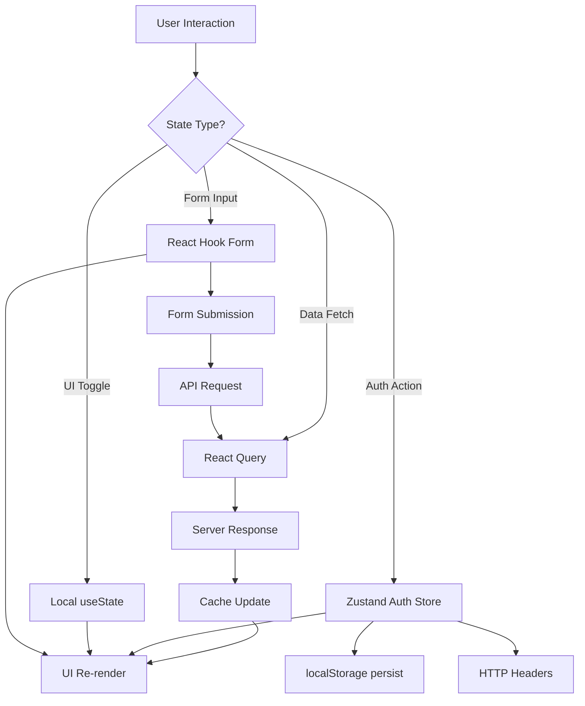
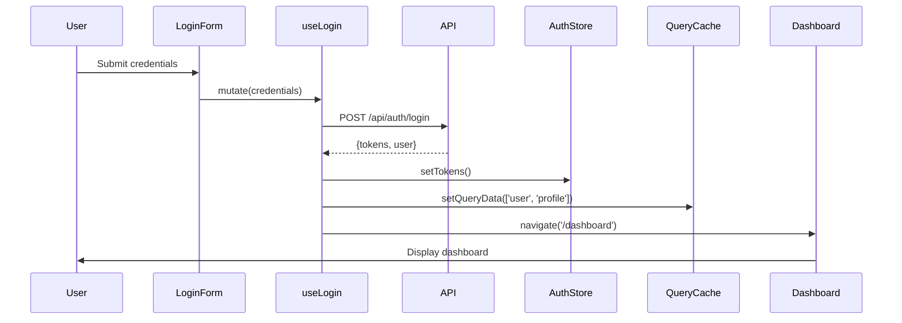

# Gate 1: State Management Architecture

## Project: SUMA Finance
## Feature: User Registration & Authentication

---

## 1. State Management Overview

### State Management Philosophy
For the SUMA Finance application, we adopt a **hybrid state management approach** that balances simplicity, scalability, and performance:

- **Server-state separation**: Treat authentication and user data as server state, distinct from client UI state
- **Minimal global state**: Only elevate state to global scope when genuinely shared across multiple feature areas
- **Type-safety first**: Leverage TypeScript for compile-time safety and developer experience
- **Developer experience**: Choose tools with excellent debugging capabilities and minimal boilerplate

### State Management Library Selection Rationale

**Primary: Zustand + React Query (TanStack Query)**

**Zustand** for client-side global state:
- Lightweight (1KB) with zero boilerplate
- No Provider wrapper needed
- Built-in TypeScript support
- DevTools integration
- Middleware support (persist, immer)
- Perfect for authentication state, user preferences, UI state

**React Query (TanStack Query)** for server state:
- Declarative data fetching
- Automatic caching, refetching, and invalidation
- Optimistic updates out of the box
- Built-in loading and error states
- Background synchronization
- Perfect for user profile data, session management

**React Hook Form** for form state:
- Uncontrolled components (better performance)
- Built-in validation
- Minimal re-renders
- Native validation support

### Global State vs Local State Strategy

| State Type | Scope | Management | Example |
|------------|-------|------------|---------|
| **Local UI State** | Single component | useState | Password visibility toggle, input focus |
| **Shared UI State** | Feature module | useState + props | Multi-step registration wizard state |
| **Global Client State** | Application-wide | Zustand | Auth tokens, user session, theme |
| **Server Cache State** | Application-wide | React Query | User profile, account data |
| **Form State** | Form scope | React Hook Form | Registration form, login form |
| **URL State** | Route scope | React Router | Redirect params, email verification tokens |

### Data Flow Architecture



### Technology Stack

- **Zustand**: ^4.5.0 - Global client state
- **@tanstack/react-query**: ^5.17.0 - Server state management
- **react-hook-form**: ^7.49.0 - Form state
- **zod**: ^3.22.0 - Schema validation
- **zustand/middleware**: persist, devtools, immer
- **@tanstack/react-query-devtools**: Development debugging

---

## 2. State Classification

### Local Component State

```typescript
// Password visibility toggle - pure UI state
const LoginForm: React.FC = () => {
  const [showPassword, setShowPassword] = useState(false);
  const [rememberMe, setRememberMe] = useState(false);
  
  // Transient state - no need to persist or share
  return (
    <input
      type={showPassword ? 'text' : 'password'}
      // ...
    />
  );
};
```

**Use cases**:
- Password visibility toggles
- Dropdown open/close state
- Tooltip hover state
- Input focus state
- Modal open/close (when not shared)

### Shared State

```typescript
// Registration wizard - shared across multiple steps
const RegistrationWizard: React.FC = () => {
  const [currentStep, setCurrentStep] = useState(0);
  const [formData, setFormData] = useState<PartialRegistrationData>({});
  
  return (
    <>
      {currentStep === 0 && <PersonalInfoStep data={formData} onNext={setFormData} />}
      {currentStep === 1 && <AccountInfoStep data={formData} onNext={setFormData} />}
      {currentStep === 2 && <VerificationStep data={formData} />}
    </>
  );
};
```

**Use cases**:
- Multi-step form navigation
- Shared filters across sibling components
- Parent-child component communication

### Global Application State (Zustand)

```typescript
interface AuthState {
  accessToken: string | null;
  refreshToken: string | null;
  isAuthenticated: boolean;
  sessionExpiry: number | null;
  setTokens: (access: string, refresh: string, expiry: number) => void;
  clearAuth: () => void;
}

const useAuthStore = create<AuthState>()(
  persist(
    devtools((set) => ({
      accessToken: null,
      refreshToken: null,
      isAuthenticated: false,
      sessionExpiry: null,
      setTokens: (access, refresh, expiry) =>
        set({
          accessToken: access,
          refreshToken: refresh,
          isAuthenticated: true,
          sessionExpiry: expiry,
        }),
      clearAuth: () =>
        set({
          accessToken: null,
          refreshToken: null,
          isAuthenticated: false,
          sessionExpiry: null,
        }),
    })),
    {
      name: 'suma-auth-storage',
      partialize: (state) => ({
        accessToken: state.accessToken,
        refreshToken: state.refreshToken,
        sessionExpiry: state.sessionExpiry,
      }),
    }
  )
);
```

**Use cases**:
- Authentication tokens
- User session state
- Theme preferences
- Language selection
- Feature flags

### Server Cache State (React Query)

```typescript
// User profile - fetched from server, cached
const useUserProfile = () => {
  return useQuery({
    queryKey: ['user', 'profile'],
    queryFn: async () => {
      const response = await fetch('/api/user/profile', {
        headers: {
          Authorization: `Bearer ${useAuthStore.getState().accessToken}`,
        },
      });
      if (!response.ok) throw new Error('Failed to fetch profile');
      return response.json() as Promise<UserProfile>;
    },
    staleTime: 5 * 60 * 1000, // 5 minutes
    gcTime: 10 * 60 * 1000, // 10 minutes
    retry: 2,
  });
};
```

**Use cases**:
- User profile data
- Account settings
- Transaction history
- Dashboard data

### URL State

```typescript
// Email verification with token from URL
const EmailVerification: React.FC = () => {
  const [searchParams] = useSearchParams();
  const token = searchParams.get('token');
  const email = searchParams.get('email');
  
  const { mutate: verifyEmail } = useMutation({
    mutationFn: (data: { token: string; email: string }) =>
      api.verifyEmail(data),
  });
  
  useEffect(() => {
    if (token && email) {
      verifyEmail({ token, email });
    }
  }, [token, email]);
};
```

**Use cases**:
- Email verification tokens
- Password reset tokens
- OAuth callback parameters
- Redirect URLs after login

### Form State (React Hook Form)

```typescript
interface RegistrationFormData {
  email: string;
  password: string;
  confirmPassword: string;
  firstName: string;
  lastName: string;
  acceptTerms: boolean;
}

const registrationSchema = z.object({
  email: z.string().email('Invalid email address'),
  password: z.string()
    .min(8, 'Password must be at least 8 characters')
    .regex(/[A-Z]/, 'Must contain uppercase letter')
    .regex(/[0-9]/, 'Must contain number'),
  confirmPassword: z.string(),
  firstName: z.string().min(2, 'First name required'),
  lastName: z.string().min(2, 'Last name required'),
  acceptTerms: z.boolean().refine(val => val === true, 'Must accept terms'),
}).refine(data => data.password === data.confirmPassword, {
  message: "Passwords don't match",
  path: ['confirmPassword'],
});

const RegistrationForm: React.FC = () => {
  const {
    register,
    handleSubmit,
    formState: { errors, isSubmitting, isDirty, touchedFields },
  } = useForm<RegistrationFormData>({
    resolver: zodResolver(registrationSchema),
  });
  
  const { mutate: registerUser } = useMutation({
    mutationFn: (data: RegistrationFormData) => api.register(data),
  });
  
  const onSubmit = (data: RegistrationFormData) => {
    registerUser(data);
  };
};
```

**Use cases**:
- Registration form
- Login form
- Profile update form
- Password reset form

---

## 3. State Management Library Selection

### Zustand Architecture (Selected for Global Client State)

**Why Zustand over Redux?**
- **Simplicity**: No boilerplate, no action types, no reducers
- **Bundle size**: 1KB vs 8KB (Redux + Toolkit)
- **Developer experience**: Minimal API surface, easy to learn
- **TypeScript**: First-class TypeScript support
- **Middleware**: Built-in persist, devtools, immer
- **No Provider**: Direct store access, no context wrapper

**Zustand Store Structure**:

```typescript
// stores/authStore.ts
import { create } from 'zustand';
import { persist, devtools } from 'zustand/middleware';
import { immer } from 'zustand/middleware/immer';

interface AuthState {
  // State
  accessToken: string | null;
  refreshToken: string | null;
  isAuthenticated: boolean;
  sessionExpiry: number | null;
  
  // Actions
  setTokens: (access: string, refresh: string, expiry: number) => void;
  clearAuth: () => void;
  refreshAccessToken: () => Promise<void>;
}

export const useAuthStore = create<AuthState>()(
  devtools(
    persist(
      immer((set, get) => ({
        accessToken: null,
        refreshToken: null,
        isAuthenticated: false,
        sessionExpiry: null,
        
        setTokens: (access, refresh, expiry) =>
          set((state) => {
            state.accessToken = access;
            state.refreshToken = refresh;
            state.isAuthenticated = true;
            state.sessionExpiry = expiry;
          }),
        
        clearAuth: () =>
          set((state) => {
            state.accessToken = null;
            state.refreshToken = null;
            state.isAuthenticated = false;
            state.sessionExpiry = null;
          }),
        
        refreshAccessToken: async () => {
          const { refreshToken } = get();
          if (!refreshToken) throw new Error('No refresh token');
          
          const response = await fetch('/api/auth/refresh', {
            method: 'POST',
            headers: { 'Content-Type': 'application/json' },
            body: JSON.stringify({ refreshToken }),
          });
          
          const { accessToken, expiresIn } = await response.json();
          const expiry = Date.now() + expiresIn * 1000;
          
          set((state) => {
            state.accessToken = accessToken;
            state.sessionExpiry = expiry;
          });
        },
      })),
      {
        name: 'suma-auth-storage',
        partialize: (state) => ({
          accessToken: state.accessToken,
          refreshToken: state.refreshToken,
          sessionExpiry: state.sessionExpiry,
        }),
      }
    ),
    { name: 'AuthStore' }
  )
);
```

**Store Usage**:

```typescript
// Component usage
const LoginButton: React.FC = () => {
  const isAuthenticated = useAuthStore((state) => state.isAuthenticated);
  const clearAuth = useAuthStore((state) => state.clearAuth);
  
  return isAuthenticated ? (
    <button onClick={clearAuth}>Logout</button>
  ) : (
    <button>Login</button>
  );
};

// Outside React component
import { useAuthStore } from '@/stores/authStore';

const token = useAuthStore.getState().accessToken;
useAuthStore.getState().setTokens(access, refresh, expiry);
```

### React Query (TanStack Query) Architecture

**Why React Query?**
- **Server state specialization**: Built specifically for async data
- **Automatic caching**: Intelligent cache invalidation
- **Background refetching**: Keep data fresh automatically
- **Optimistic updates**: Built-in support
- **Devtools**: Excellent debugging experience
- **Request deduplication**: Automatic deduplication of identical requests

**React Query Setup**:

```typescript
// providers/QueryProvider.tsx
import { QueryClient, QueryClientProvider } from '@tanstack/react-query';
import { ReactQueryDevtools } from '@tanstack/react-query-devtools';

const queryClient = new QueryClient({
  defaultOptions: {
    queries: {
      staleTime: 60 * 1000, // 1 minute
      gcTime: 5 * 60 * 1000, // 5 minutes (formerly cacheTime)
      retry: 1,
      refetchOnWindowFocus: false,
      refetchOnReconnect: true,
    },
    mutations: {
      retry: 0,
    },
  },
});

export const QueryProvider: React.FC<{ children: React.ReactNode }> = ({
  children,
}) => (
  <QueryClientProvider client={queryClient}>
    {children}
    <ReactQueryDevtools initialIsOpen={false} />
  </QueryClientProvider>
);
```

**Query Hook Pattern**:

```typescript
// hooks/useUserProfile.ts
import { useQuery } from '@tanstack/react-query';
import { useAuthStore } from '@/stores/authStore';

interface UserProfile {
  id: string;
  email: string;
  firstName: string;
  lastName: string;
  createdAt: string;
  emailVerified: boolean;
}

export const useUserProfile = () => {
  const accessToken = useAuthStore((state) => state.accessToken);
  
  return useQuery({
    queryKey: ['user', 'profile'],
    queryFn: async (): Promise<UserProfile> => {
      const response = await fetch('/api/user/profile', {
        headers: {
          Authorization: `Bearer ${accessToken}`,
        },
      });
      
      if (!response.ok) {
        throw new Error('Failed to fetch user profile');
      }
      
      return response.json();
    },
    enabled: !!accessToken, // Only fetch if authenticated
    staleTime: 5 * 60 * 1000, // 5 minutes
    retry: 2,
  });
};
```

**Mutation Hook Pattern**:

```typescript
// hooks/useRegister.ts
import { useMutation, useQueryClient } from '@tanstack/react-query';
import { useAuthStore } from '@/stores/authStore';
import { useNavigate } from 'react-router-dom';

interface RegisterData {
  email: string;
  password: string;
  firstName: string;
  lastName: string;
}

interface RegisterResponse {
  accessToken: string;
  refreshToken: string;
  expiresIn: number;
  user: UserProfile;
}

export const useRegister = () => {
  const setTokens = useAuthStore((state) => state.setTokens);
  const navigate = useNavigate();
  const queryClient = useQueryClient();
  
  return useMutation({
    mutationFn: async (data: RegisterData): Promise<RegisterResponse> => {
      const response = await fetch('/api/auth/register', {
        method: 'POST',
        headers: { 'Content-Type': 'application/json' },
        body: JSON.stringify(data),
      });
      
      if (!response.ok) {
        const error = await response.json();
        throw new Error(error.message || 'Registration failed');
      }
      
      return response.json();
    },
    onSuccess: (data) => {
      // Update auth store
      const expiry = Date.now() + data.expiresIn * 1000;
      setTokens(data.accessToken, data.refreshToken, expiry);
      
      // Set user profile in cache
      queryClient.setQueryData(['user', 'profile'], data.user);
      
      // Navigate to dashboard
      navigate('/dashboard');
    },
    onError: (error: Error) => {
      console.error('Registration failed:', error.message);
    },
  });
};
```

### React Hook Form (Selected for Form State)

**Why React Hook Form over Formik?**
- **Performance**: Uncontrolled components, minimal re-renders
- **Bundle size**: 9KB vs 15KB (Formik)
- **Developer experience**: Simpler API, less boilerplate
- **Validation**: Built-in validation, Zod integration
- **TypeScript**: Excellent type inference

**Form Implementation**:

```typescript
// components/RegistrationForm.tsx
import { useForm } from 'react-hook-form';
import { zodResolver } from '@hookform/resolvers/zod';
import { z } from 'zod';
import { useRegister } from '@/hooks/useRegister';

const registrationSchema = z.object({
  email: z.string().email('Invalid email address'),
  password: z.string()
    .min(8, 'Password must be at least 8 characters')
    .regex(/[A-Z]/, 'Must contain at least one uppercase letter')
    .regex(/[a-z]/, 'Must contain at least one lowercase letter')
    .regex(/[0-9]/, 'Must contain at least one number')
    .regex(/[^A-Za-z0-9]/, 'Must contain at least one special character'),
  confirmPassword: z.string(),
  firstName: z.string().min(2, 'First name must be at least 2 characters'),
  lastName: z.string().min(2, 'Last name must be at least 2 characters'),
  acceptTerms: z.boolean().refine(val => val === true, {
    message: 'You must accept the terms and conditions',
  }),
}).refine(data => data.password === data.confirmPassword, {
  message: "Passwords don't match",
  path: ['confirmPassword'],
});

type RegistrationFormData = z.infer<typeof registrationSchema>;

export const RegistrationForm: React.FC = () => {
  const {
    register,
    handleSubmit,
    formState: { errors, isSubmitting, isDirty, touchedFields },
    watch,
  } = useForm<RegistrationFormData>({
    resolver: zodResolver(registrationSchema),
    mode: 'onBlur',
  });
  
  const { mutate: registerUser, isPending, error } = useRegister();
  
  const onSubmit = (data: RegistrationFormData) => {
    const { confirmPassword, acceptTerms, ...registrationData } = data;
    registerUser(registrationData);
  };
  
  return (
    <form onSubmit={handleSubmit(onSubmit)}>
      <div>
        <label htmlFor="email">Email</label>
        <input
          id="email"
          type="email"
          {...register('email')}
          aria-invalid={!!errors.email}
        />
        {errors.email && <span role="alert">{errors.email.message}</span>}
      </div>
      
      <div>
        <label htmlFor="password">Password</label>
        <input
          id="password"
          type="password"
          {...register('password')}
          aria-invalid={!!errors.password}
        />
        {errors.password && <span role="alert">{errors.password.message}</span>}
      </div>
      
      <div>
        <label htmlFor="confirmPassword">Confirm Password</label>
        <input
          id="confirmPassword"
          type="password"
          {...register('confirmPassword')}
          aria-invalid={!!errors.confirmPassword}
        />
        {errors.confirmPassword && (
          <span role="alert">{errors.confirmPassword.message}</span>
        )}
      </div>
      
      <div>
        <label htmlFor="firstName">First Name</label>
        <input
          id="firstName"
          type="text"
          {...register('firstName')}
          aria-invalid={!!errors.firstName}
        />
        {errors.firstName && (
          <span role="alert">{errors.firstName.message}</span>
        )}
      </div>
      
      <div>
        <label htmlFor="lastName">Last Name</label>
        <input
          id="lastName"
          type="text"
          {...register('lastName')}
          aria-invalid={!!errors.lastName}
        />
        {errors.lastName && <span role="alert">{errors.lastName.message}</span>}
      </div>
      
      <div>
        <label>
          <input type="checkbox" {...register('acceptTerms')} />
          I accept the terms and conditions
        </label>
        {errors.acceptTerms && (
          <span role="alert">{errors.acceptTerms.message}</span>
        )}
      </div>
      
      {error && <div role="alert">{error.message}</div>}
      
      <button type="submit" disabled={isPending || isSubmitting}>
        {isPending ? 'Registering...' : 'Register'}
      </button>
    </form>
  );
};
```

---

## 4. State Structure Design

### State Shape

**Authentication State (Zustand) - Flat Structure**:

```typescript
interface AuthState {
  // Tokens
  accessToken: string | null;
  refreshToken: string | null;
  
  // Session
  isAuthenticated: boolean;
  sessionExpiry: number | null;
  
  // User preferences (client-side only)
  rememberMe: boolean;
  lastLoginEmail: string | null;
}
```

**Why Flat?**
- Simple selectors
- Easy to serialize for persistence
- No nested updates needed
- Clear data ownership

**User Profile State (React Query Cache) - Normalized Structure**:

```typescript
interface UserProfile {
  id: string;
  email: string;
  firstName: string;
  lastName: string;
  phoneNumber: string | null;
  createdAt: string;
  updatedAt: string;
  emailVerified: boolean;
  phoneVerified: boolean;
  twoFactorEnabled: boolean;
}

// Cached at key: ['user', 'profile']
// Accessed via useUserProfile() hook
```

### State Slices (Zustand)

**Modular Store Architecture**:

```typescript
// stores/slices/authSlice.ts
export interface AuthSlice {
  accessToken: string | null;
  refreshToken: string | null;
  isAuthenticated: boolean;
  sessionExpiry: number | null;
  setTokens: (access: string, refresh: string, expiry: number) => void;
  clearAuth: () => void;
}

export const createAuthSlice: StateCreator<AuthSlice> = (set) => ({
  accessToken: null,
  refreshToken: null,
  isAuthenticated: false,
  sessionExpiry: null,
  setTokens: (access, refresh, expiry) =>
    set({
      accessToken: access,
      refreshToken: refresh,
      isAuthenticated: true,
      sessionExpiry: expiry,
    }),
  clearAuth: () =>
    set({
      accessToken: null,
      refreshToken: null,
      isAuthenticated: false,
      sessionExpiry: null,
    }),
});

// stores/slices/preferencesSlice.ts
export interface PreferencesSlice {
  rememberMe: boolean;
  lastLoginEmail: string | null;
  setRememberMe: (value: boolean) => void;
  setLastLoginEmail: (email: string) => void;
}

export const createPreferencesSlice: StateCreator<PreferencesSlice> = (set) => ({
  rememberMe: false,
  lastLoginEmail: null,
  setRememberMe: (value) => set({ rememberMe: value }),
  setLastLoginEmail: (email) => set({ lastLoginEmail: email }),
});

// stores/index.ts - Combined store
import { create } from 'zustand';
import { persist, devtools } from 'zustand/middleware';
import { createAuthSlice, AuthSlice } from './slices/authSlice';
import { createPreferencesSlice, PreferencesSlice } from './slices/preferencesSlice';

type StoreState = AuthSlice & PreferencesSlice;

export const useStore = create<StoreState>()(
  devtools(
    persist(
      (set, get, api) => ({
        ...createAuthSlice(set, get, api),
        ...createPreferencesSlice(set, get, api),
      }),
      {
        name: 'suma-storage',
        partialize: (state) => ({
          accessToken: state.accessToken,
          refreshToken: state.refreshToken,
          sessionExpiry: state.sessionExpiry,
          rememberMe: state.rememberMe,
          lastLoginEmail: state.lastLoginEmail,
        }),
      }
    ),
    { name: 'SumaStore' }
  )
);
```

### Immutable State Updates

**Using Immer Middleware**:

```typescript
import { immer } from 'zustand/middleware/immer';

const useAuthStore = create<AuthState>()(
  immer((set) => ({
    accessToken: null,
    refreshToken: null,
    
    // Immer allows "mutable" syntax - actually produces immutable updates
    setTokens: (access, refresh, expiry) =>
      set((state) => {
        state.accessToken = access; // Looks mutable, but Immer makes it immutable
        state.refreshToken = refresh;
        state.isAuthenticated = true;
        state.sessionExpiry = expiry;
      }),
  }))
);
```

**Without Immer (Manual Immutability)**:

```typescript
const useAuthStore = create<AuthState>((set) => ({
  accessToken: null,
  refreshToken: null,
  
  setTokens: (access, refresh, expiry) =>
    set((state) => ({
      ...state, // Spread existing state
      accessToken: access,
      refreshToken: refresh,
      isAuthenticated: true,
      sessionExpiry: expiry,
    })),
}));
```

### State Initialization

**Initial State from localStorage**:

```typescript
// Automatic with persist middleware
const useAuthStore = create<AuthState>()(
  persist(
    (set) => ({
      accessToken: null, // Will be hydrated from localStorage
      refreshToken: null,
      isAuthenticated: false,
      sessionExpiry: null,
      // ...
    }),
    {
      name: 'suma-auth-storage',
      // Custom storage (default is localStorage)
      storage: createJSONStorage(() => localStorage),
      // Rehydration callback
      onRehydrateStorage: () => (state) => {
        console.log('Hydration finished', state);
        
        // Check if tokens are expired
        if (state?.sessionExpiry && state.sessionExpiry < Date.now()) {
          state.clearAuth();
        }
      },
    }
  )
);
```

**Initial State from Server (SSR/SSG)**:

```typescript
// For Next.js with server-side rendering
import { useEffect } from 'react';
import { useQueryClient } from '@tanstack/react-query';

export const useHydrateUserProfile = (initialData?: UserProfile) => {
  const queryClient = useQueryClient();
  
  useEffect(() => {
    if (initialData) {
      queryClient.setQueryData(['user', 'profile'], initialData);
    }
  }, [initialData, queryClient]);
};

// Usage in page component
export const getServerSideProps = async (context) => {
  const userProfile = await fetchUserProfile(context.req);
  return { props: { userProfile } };
};

const DashboardPage = ({ userProfile }) => {
  useHydrateUserProfile(userProfile);
  // ...
};
```

---

## 5. Actions and Events

### Action Types (Zustand Pattern)

**Synchronous Actions**:

```typescript
interface AuthState {
  // ... state properties
  
  // Synchronous action - immediate state update
  setTokens: (access: string, refresh: string, expiry: number) => void;
  clearAuth: () => void;
  setRememberMe: (value: boolean) => void;
}
```

**Asynchronous Actions (Thunk Pattern)**:

```typescript
interface AuthState {
  // ... state properties
  
  // Async action - returns Promise
  refreshAccessToken: () => Promise<void>;
  validateSession: () => Promise<boolean>;
}

export const useAuthStore = create<AuthState>((set, get) => ({
  // ... state
  
  refreshAccessToken: async () => {
    const { refreshToken } = get();
    if (!refreshToken) throw new Error('No refresh token');
    
    try {
      const response = await fetch('/api/auth/refresh', {
        method: 'POST',
        headers: { 'Content-Type': 'application/json' },
        body: JSON.stringify({ refreshToken }),
      });
      
      if (!response.ok) throw new Error('Token refresh failed');
      
      const { accessToken, expiresIn } = await response.json();
      const expiry = Date.now() + expiresIn * 1000;
      
      set({
        accessToken,
        sessionExpiry: expiry,
      });
    } catch (error) {
      // Clear auth on refresh failure
      get().clearAuth();
      throw error;
    }
  },
  
  validateSession: async () => {
    const { accessToken, sessionExpiry } = get();
    
    if (!accessToken) return false;
    
    // Check expiry
    if (sessionExpiry && sessionExpiry < Date.now()) {
      try {
        await get().refreshAccessToken();
        return true;
      } catch {
        return false;
      }
    }
    
    return true;
  },
}));
```

### Action Naming Conventions

**Zustand Actions (Imperative)**:
- `setTokens` - Set authentication tokens
- `clearAuth` - Clear authentication state
- `updateProfile` - Update user profile
- `toggleRememberMe` - Toggle remember me preference

**React Query Mutations (Descriptive)**:
- `useRegister` - User registration mutation
- `useLogin` - User login mutation
- `useLogout` - User logout mutation
- `useUpdateProfile` - Update profile mutation
- `useSendVerificationEmail` - Send verification email mutation

### Action Payloads

**Minimal Payload Principle**:

```typescript
// Good - minimal payload
setTokens: (access: string, refresh: string, expiry: number) => void;

// Bad - unnecessary data
setTokens: (data: {
  accessToken: string;
  refreshToken: string;
  expiresIn: number;
  user: UserProfile; // User profile should be in React Query cache
  timestamp: number; // Can be computed
}) => void;
```

**Normalized Payloads (React Query)**:

```typescript
// Registration mutation - normalized response
interface RegisterResponse {
  accessToken: string;
  refreshToken: string;
  expiresIn: number;
  user: UserProfile;
}

export const useRegister = () => {
  const setTokens = useAuthStore((state) => state.setTokens);
  const queryClient = useQueryClient();
  
  return useMutation({
    mutationFn: registerApi,
    onSuccess: (data: RegisterResponse) => {
      // Store tokens in Zustand
      const expiry = Date.now() + data.expiresIn * 1000;
      setTokens(data.accessToken, data.refreshToken, expiry);
      
      // Store user profile in React Query cache
      queryClient.setQueryData(['user', 'profile'], data.user);
    },
  });
};
```

**Error Payloads**:

```typescript
interface ApiError {
  message: string;
  code: string;
  field?: string; // For validation errors
  details?: Record<string, string[]>;
}

// Error handling in mutation
return useMutation({
  mutationFn: registerApi,
  onError: (error: ApiError) => {
    if (error.code === 'VALIDATION_ERROR' && error.details) {
      // Handle field-specific errors
      Object.entries(error.details).forEach(([field, messages]) => {
        console.error(`${field}: ${messages.join(', ')}`);
      });
    } else {
      // Handle general errors
      console.error(error.message);
    }
  },
});
```

### Dispatching Actions

**Component Dispatching**:

```typescript
const LoginForm: React.FC = () => {
  const setTokens = useAuthStore((state) => state.setTokens);
  const { mutate: login } = useLogin();
  
  const onSubmit = (data: LoginFormData) => {
    login(data); // Mutation will call setTokens on success
  };
  
  return <form onSubmit={handleSubmit(onSubmit)}>...</form>;
};
```

**Middleware Dispatching (Axios Interceptor)**:

```typescript
// api/axios.ts
import axios from 'axios';
import { useAuthStore } from '@/stores/authStore';

const apiClient = axios.create({
  baseURL: '/api',
});

// Request interceptor - add auth token
apiClient.interceptors.request.use((config) => {
  const token = useAuthStore.getState().accessToken;
  if (token) {
    config.headers.Authorization = `Bearer ${token}`;
  }
  return config;
});

// Response interceptor - handle token refresh
apiClient.interceptors.response.use(
  (response) => response,
  async (error) => {
    const originalRequest = error.config;
    
    if (error.response?.status === 401 && !originalRequest._retry) {
      originalRequest._retry = true;
      
      try {
        await useAuthStore.getState().refreshAccessToken();
        
        // Retry with new token
        const newToken = useAuthStore.getState().accessToken;
        originalRequest.headers.Authorization = `Bearer ${newToken}`;
        return apiClient(originalRequest);
      } catch {
        useAuthStore.getState().clearAuth();
        window.location.href = '/login';
        return Promise.reject(error);
      }
    }
    
    return Promise.reject(error);
  }
);
```

---

## 6. Reducers and State Updates

### Zustand State Updates (No Reducers)

Zustand uses direct state updates instead of reducers:

```typescript
// Traditional Redux reducer (NOT used in Zustand)
const authReducer = (state, action) => {
  switch (action.type) {
    case 'SET_TOKENS':
      return { ...state, accessToken: action.payload.access };
    default:
      return state;
  }
};

// Zustand approach - direct update functions
const useAuthStore = create<AuthState>((set) => ({
  accessToken: null,
  
  // Direct update function
  setTokens: (access, refresh, expiry) =>
    set({ accessToken: access, refreshToken: refresh }),
}));
```

### Immutable Updates (Immer)

```typescript
import { immer } from 'zustand/middleware/immer';

const useStore = create<State>()(
  immer((set) => ({
    user: { name: '', email: '' },
    
    // Immer allows mutation syntax
    updateUser: (updates: Partial<User>) =>
      set((state) => {
        Object.assign(state.user, updates); // Looks mutable
      }),
    
    // Nested updates made easy
    updateUserEmail: (email: string) =>
      set((state) => {
        state.user.email = email; // Direct assignment
      }),
  }))
);
```

### Array Operations

```typescript
interface TodoState {
  todos: Todo[];
  addTodo: (todo: Todo) => void;
  removeTodo: (id: string) => void;
  updateTodo: (id: string, updates: Partial<Todo>) => void;
}

const useTodoStore = create<TodoState>()(
  immer((set) => ({
    todos: [],
    
    // Add item (immutable with Immer)
    addTodo: (todo) =>
      set((state) => {
        state.todos.push(todo); // Immer makes this immutable
      }),
    
    // Remove item
    removeTodo: (id) =>
      set((state) => {
        const index = state.todos.findIndex(t => t.id === id);
        if (index !== -1) state.todos.splice(index, 1);
      }),
    
    // Update item
    updateTodo: (id, updates) =>
      set((state) => {
        const todo = state.todos.find(t => t.id === id);
        if (todo) Object.assign(todo, updates);
      }),
  }))
);

// Without Immer (manual immutability)
const useTodoStore = create<TodoState>((set) => ({
  todos: [],
  
  addTodo: (todo) =>
    set((state) => ({ todos: [...state.todos, todo] })),
  
  removeTodo: (id) =>
    set((state) => ({
      todos: state.todos.filter(t => t.id !== id),
    })),
  
  updateTodo: (id, updates) =>
    set((state) => ({
      todos: state.todos.map(t =>
        t.id === id ? { ...t, ...updates } : t
      ),
    })),
}));
```

---

## 7. Selectors and Derived State

### Selector Functions (Zustand)

```typescript
// Basic selector - extract single value
const LoginButton: React.FC = () => {
  const isAuthenticated = useAuthStore((state) => state.isAuthenticated);
  return <button>{isAuthenticated ? 'Logout' : 'Login'}</button>;
};

// Multiple values - returns new object on every render (avoid)
const Header: React.FC = () => {
  // BAD - creates new object reference on every render
  const { isAuthenticated, user } = useAuthStore((state) => ({
    isAuthenticated: state.isAuthenticated,
    user: state.user,
  }));
};

// Better - use shallow equality
import { shallow } from 'zustand/shallow';

const Header: React.FC = () => {
  const { isAuthenticated, user } = useAuthStore(
    (state) => ({
      isAuthenticated: state.isAuthenticated,
      user: state.user,
    }),
    shallow // Only re-render if values actually change
  );
};

// Best - separate selectors
const Header: React.FC = () => {
  const isAuthenticated = useAuthStore((state) => state.isAuthenticated);
  const user = useAuthStore((state) => state.user);
};
```

### Memoized Selectors

```typescript
// utils/selectors.ts
import { create } from 'zustand';

interface AuthState {
  accessToken: string | null;
  sessionExpiry: number | null;
  isAuthenticated: boolean;
}

export const useAuthStore = create<AuthState>(() => ({
  accessToken: null,
  sessionExpiry: null,
  isAuthenticated: false,
}));

// Derived selector - is session valid?
export const useIsSessionValid = () => {
  return useAuthStore((state) => {
    if (!state.isAuthenticated) return false;
    if (!state.sessionExpiry) return false;
    return state.sessionExpiry > Date.now();
  });
};

// Derived selector - time until expiry
export const useSessionTimeRemaining = () => {
  return useAuthStore((state) => {
    if (!state.sessionExpiry) return 0;
    const remaining = state.sessionExpiry - Date.now();
    return Math.max(0, remaining);
  });
};

// Usage
const SessionIndicator: React.FC = () => {
  const isValid = useIsSessionValid();
  const timeRemaining = useSessionTimeRemaining();
  
  return (
    <div>
      Status: {isValid ? 'Active' : 'Expired'}
      {isValid && <span>Expires in {Math.floor(timeRemaining / 1000)}s</span>}
    </div>
  );
};
```

### Computed Values (React Query)

```typescript
// Derived data from React Query
export const useUserDisplayName = () => {
  const { data: user } = useUserProfile();
  
  return useMemo(() => {
    if (!user) return 'Guest';
    return `${user.firstName} ${user.lastName}`.trim() || user.email;
  }, [user]);
};

// Derived authentication status
export const useAuthStatus = () => {
  const isAuthenticated = useAuthStore((state) => state.isAuthenticated);
  const { data: user, isLoading } = useUserProfile();
  
  return useMemo(() => ({
    isAuthenticated,
    isLoading,
    isFullyAuthenticated: isAuthenticated && !!user && user.emailVerified,
    requiresEmailVerification: isAuthenticated && !!user && !user.emailVerified,
  }), [isAuthenticated, user, isLoading]);
};
```

### Selector Composition

```typescript
// Base selectors
const selectAccessToken = (state: AuthState) => state.accessToken;
const selectSessionExpiry = (state: AuthState) => state.sessionExpiry;

// Composed selector
const selectIsSessionValid = (state: AuthState) => {
  const token = selectAccessToken(state);
  const expiry = selectSessionExpiry(state);
  
  if (!token || !expiry) return false;
  return expiry > Date.now();
};

// Usage
const isValid = useAuthStore(selectIsSessionValid);
```

---

## 8. Asynchronous State Management

### Data Fetching Patterns (React Query)

```typescript
// hooks/useUserProfile.ts
export const useUserProfile = () => {
  const accessToken = useAuthStore((state) => state.accessToken);
  
  return useQuery({
    queryKey: ['user', 'profile'],
    queryFn: async (): Promise<UserProfile> => {
      const response = await fetch('/api/user/profile', {
        headers: { Authorization: `Bearer ${accessToken}` },
      });
      if (!response.ok) throw new Error('Failed to fetch profile');
      return response.json();
    },
    enabled: !!accessToken, // Only fetch when authenticated
    staleTime: 5 * 60 * 1000, // Consider fresh for 5 minutes
    gcTime: 10 * 60 * 1000, // Keep in cache for 10 minutes
    retry: 2,
    retryDelay: (attemptIndex) => Math.min(1000 * 2 ** attemptIndex, 30000),
  });
};

// Component usage with loading/error states
const ProfileDisplay: React.FC = () => {
  const { data: user, isLoading, error, refetch } = useUserProfile();
  
  if (isLoading) return <div>Loading profile...</div>;
  if (error) return <div>Error: {error.message} <button onClick={() => refetch()}>Retry</button></div>;
  if (!user) return null;
  
  return (
    <div>
      <h2>{user.firstName} {user.lastName}</h2>
      <p>{user.email}</p>
    </div>
  );
};
```

### Mutation Patterns

```typescript
// hooks/useLogin.ts
interface LoginData {
  email: string;
  password: string;
}

interface LoginResponse {
  accessToken: string;
  refreshToken: string;
  expiresIn: number;
  user: UserProfile;
}

export const useLogin = () => {
  const setTokens = useAuthStore((state) => state.setTokens);
  const setLastLoginEmail = useAuthStore((state) => state.setLastLoginEmail);
  const queryClient = useQueryClient();
  const navigate = useNavigate();
  
  return useMutation({
    mutationFn: async (data: LoginData): Promise<LoginResponse> => {
      const response = await fetch('/api/auth/login', {
        method: 'POST',
        headers: { 'Content-Type': 'application/json' },
        body: JSON.stringify(data),
      });
      
      if (!response.ok) {
        const error = await response.json();
        throw new Error(error.message || 'Login failed');
      }
      
      return response.json();
    },
    
    onSuccess: (data, variables) => {
      // Update auth store
      const expiry = Date.now() + data.expiresIn * 1000;
      setTokens(data.accessToken, data.refreshToken, expiry);
      setLastLoginEmail(variables.email);
      
      // Set user profile in cache
      queryClient.setQueryData(['user', 'profile'], data.user);
      
      // Navigate to dashboard
      navigate('/dashboard');
    },
    
    onError: (error: Error) => {
      console.error('Login failed:', error.message);
    },
  });
};
```

### Loading, Success, Error States

```typescript
// Comprehensive state handling
const LoginForm: React.FC = () => {
  const {
    mutate: login,
    isPending,
    isSuccess,
    isError,
    error,
    reset,
  } = useLogin();
  
  const { handleSubmit, register } = useForm<LoginFormData>();
  
  const onSubmit = (data: LoginFormData) => {
    reset(); // Clear previous errors
    login(data);
  };
  
  return (
    <form onSubmit={handleSubmit(onSubmit)}>
      <input {...register('email')} disabled={isPending} />
      <input type="password" {...register('password')} disabled={isPending} />
      
      {isError && (
        <div role="alert" className="error">
          {error.message}
        </div>
      )}
      
      {isSuccess && (
        <div className="success">Login successful! Redirecting...</div>
      )}
      
      <button type="submit" disabled={isPending}>
        {isPending ? 'Logging in...' : 'Login'}
      </button>
    </form>
  );
};
```

### Request Deduplication

```typescript
// React Query automatically deduplicates requests with the same queryKey
// Multiple components calling useUserProfile will only trigger one API call

const Header: React.FC = () => {
  const { data: user } = useUserProfile(); // Request 1
  return <div>{user?.firstName}</div>;
};

const Sidebar: React.FC = () => {
  const { data: user } = useUserProfile(); // Same request - deduplicated
  return <div>{user?.email}</div>;
};

// Only ONE API call is made to /api/user/profile
```

### Parallel Queries

```typescript
// Fetch multiple resources in parallel
const Dashboard: React.FC = () => {
  const userQuery = useUserProfile();
  const accountsQuery = useQuery({
    queryKey: ['accounts'],
    queryFn: fetchAccounts,
  });
  const transactionsQuery = useQuery({
    queryKey: ['transactions', 'recent'],
    queryFn: () => fetchRecentTransactions(10),
  });
  
  const isLoading = userQuery.isLoading || accountsQuery.isLoading || transactionsQuery.isLoading;
  const isError = userQuery.isError || accountsQuery.isError || transactionsQuery.isError;
  
  if (isLoading) return <div>Loading dashboard...</div>;
  if (isError) return <div>Failed to load dashboard</div>;
  
  return (
    <div>
      <Header user={userQuery.data} />
      <AccountsList accounts={accountsQuery.data} />
      <TransactionsList transactions={transactionsQuery.data} />
    </div>
  );
};

// Or use useQueries for dynamic parallel queries
const useMultipleAccounts = (accountIds: string[]) => {
  return useQueries({
    queries: accountIds.map(id => ({
      queryKey: ['account', id],
      queryFn: () => fetchAccount(id),
    })),
  });
};
```

### Dependent Queries

```typescript
// Fetch user first, then fetch user-specific data
const UserTransactions: React.FC = () => {
  const { data: user } = useUserProfile();
  
  const { data: transactions, isLoading } = useQuery({
    queryKey: ['transactions', user?.id],
    queryFn: () => fetchUserTransactions(user!.id),
    enabled: !!user?.id, // Only fetch when user ID is available
  });
  
  if (!user) return <div>Loading user...</div>;
  if (isLoading) return <div>Loading transactions...</div>;
  
  return <TransactionsList transactions={transactions} />;
};
```

---

## 9. Server Cache Management

### React Query Architecture

**Query Keys Strategy**:

```typescript
// Query key factory for consistency
export const queryKeys = {
  user: {
    all: ['user'] as const,
    profile: () => [...queryKeys.user.all, 'profile'] as const,
    settings: () => [...queryKeys.user.all, 'settings'] as const,
  },
  accounts: {
    all: ['accounts'] as const,
    list: () => [...queryKeys.accounts.all, 'list'] as const,
    detail: (id: string) => [...queryKeys.accounts.all, 'detail', id] as const,
  },
  transactions: {
    all: ['transactions'] as const,
    recent: (limit: number) => [...queryKeys.transactions.all, 'recent', limit] as const,
    byAccount: (accountId: string) => [...queryKeys.transactions.all, 'account', accountId] as const,
  },
};

// Usage
const { data } = useQuery({
  queryKey: queryKeys.user.profile(),
  queryFn: fetchUserProfile,
});
```

### Cache Invalidation Strategies

```typescript
// Invalidate on mutation
export const useUpdateProfile = () => {
  const queryClient = useQueryClient();
  
  return useMutation({
    mutationFn: updateProfileApi,
    onSuccess: () => {
      // Invalidate and refetch user profile
      queryClient.invalidateQueries({ queryKey: queryKeys.user.profile() });
    },
  });
};

// Invalidate multiple related queries
export const useDeleteAccount = () => {
  const queryClient = useQueryClient();
  
  return useMutation({
    mutationFn: deleteAccountApi,
    onSuccess: (_, accountId) => {
      // Invalidate account list
      queryClient.invalidateQueries({ queryKey: queryKeys.accounts.list() });
      
      // Remove specific account from cache
      queryClient.removeQueries({ queryKey: queryKeys.accounts.detail(accountId) });
      
      // Invalidate related transactions
      queryClient.invalidateQueries({
        queryKey: queryKeys.transactions.byAccount(accountId),
      });
    },
  });
};
```

### Background Refetching

```typescript
// Configure refetch behavior
export const useUserProfile = () => {
  return useQuery({
    queryKey: queryKeys.user.profile(),
    queryFn: fetchUserProfile,
    
    // Refetch configuration
    staleTime: 5 * 60 * 1000, // Data is fresh for 5 minutes
    gcTime: 10 * 60 * 1000, // Keep unused data for 10 minutes
    refetchOnWindowFocus: true, // Refetch when window regains focus
    refetchOnReconnect: true, // Refetch when connection is restored
    refetchInterval: false, // No polling by default
    refetchIntervalInBackground: false,
  });
};

// Polling for real-time data
export const usePendingTransactions = () => {
  return useQuery({
    queryKey: queryKeys.transactions.pending(),
    queryFn: fetchPendingTransactions,
    refetchInterval: 30 * 1000, // Poll every 30 seconds
    refetchIntervalInBackground: false, // Stop polling when tab is inactive
  });
};
```

### Optimistic Updates

```typescript
// Optimistic UI for better UX
export const useUpdateUserProfile = () => {
  const queryClient = useQueryClient();
  
  return useMutation({
    mutationFn: updateProfileApi,
    
    // Optimistically update the cache before the request completes
    onMutate: async (newProfile: Partial<UserProfile>) => {
      // Cancel outgoing refetches
      await queryClient.cancelQueries({ queryKey: queryKeys.user.profile() });
      
      // Snapshot current value
      const previousProfile = queryClient.getQueryData<UserProfile>(
        queryKeys.user.profile()
      );
      
      // Optimistically update cache
      queryClient.setQueryData<UserProfile>(
        queryKeys.user.profile(),
        (old) => (old ? { ...old, ...newProfile } : old)
      );
      
      // Return context with snapshot
      return { previousProfile };
    },
    
    // Rollback on error
    onError: (err, newProfile, context) => {
      queryClient.setQueryData(
        queryKeys.user.profile(),
        context?.previousProfile
      );
    },
    
    // Always refetch after error or success
    onSettled: () => {
      queryClient.invalidateQueries({ queryKey: queryKeys.user.profile() });
    },
  });
};
```

### Mutation Hooks with Cache Updates

```typescript
// Direct cache update without refetch
export const useToggleEmailNotifications = () => {
  const queryClient = useQueryClient();
  
  return useMutation({
    mutationFn: toggleEmailNotificationsApi,
    onSuccess: (response) => {
      // Directly update cache
      queryClient.setQueryData<UserProfile>(
        queryKeys.user.profile(),
        (old) => old ? { ...old, emailNotifications: response.enabled } : old
      );
    },
  });
};
```

---

## 10. Optimistic Updates

### Optimistic UI Pattern

```typescript
// Full optimistic update example
export const useAddBankAccount = () => {
  const queryClient = useQueryClient();
  
  return useMutation({
    mutationFn: addBankAccountApi,
    
    onMutate: async (newAccount: CreateBankAccountData) => {
      // Cancel outgoing refetches
      await queryClient.cancelQueries({ queryKey: queryKeys.accounts.list() });
      
      // Snapshot current value
      const previousAccounts = queryClient.getQueryData<BankAccount[]>(
        queryKeys.accounts.list()
      );
      
      // Create optimistic account with temporary ID
      const optimisticAccount: BankAccount = {
        id: `temp-${Date.now()}`,
        ...newAccount,
        balance: 0,
        createdAt: new Date().toISOString(),
        status: 'pending',
      };
      
      // Optimistically update cache
      queryClient.setQueryData<BankAccount[]>(
        queryKeys.accounts.list(),
        (old) => (old ? [...old, optimisticAccount] : [optimisticAccount])
      );
      
      return { previousAccounts };
    },
    
    onError: (err, newAccount, context) => {
      // Rollback on error
      queryClient.setQueryData(
        queryKeys.accounts.list(),
        context?.previousAccounts
      );
      
      // Show error notification
      console.error('Failed to add account:', err.message);
    },
    
    onSuccess: (savedAccount) => {
      // Replace optimistic account with real server data
      queryClient.setQueryData<BankAccount[]>(
        queryKeys.accounts.list(),
        (old) =>
          old
            ? old.map((account) =>
                account.id.startsWith('temp-') ? savedAccount : account
              )
            : [savedAccount]
      );
    },
    
    onSettled: () => {
      // Refetch to ensure consistency
      queryClient.invalidateQueries({ queryKey: queryKeys.accounts.list() });
    },
  });
};
```

### User Experience Benefits

- **Instant Feedback**: UI updates immediately, no waiting for server
- **Perceived Performance**: App feels faster and more responsive
- **Graceful Degradation**: Rollback on error maintains data integrity
- **Conflict Resolution**: Server reconciliation ensures consistency

### Implementation Strategy

```typescript
// Component using optimistic updates
const AddAccountForm: React.FC = () => {
  const { mutate: addAccount, isPending } = useAddBankAccount();
  const { handleSubmit, register, reset } = useForm<CreateBankAccountData>();
  
  const onSubmit = (data: CreateBankAccountData) => {
    addAccount(data, {
      onSuccess: () => {
        reset();
        // Account appears immediately in the list (optimistic)
        // Form is cleared for next entry
      },
      onError: (error) => {
        // Optimistic update is rolled back automatically
        alert(`Failed to add account: ${error.message}`);
      },
    });
  };
  
  return (
    <form onSubmit={handleSubmit(onSubmit)}>
      {/* Form fields */}
      <button type="submit" disabled={isPending}>
        {isPending ? 'Adding...' : 'Add Account'}
      </button>
    </form>
  );
};
```

### Server Reconciliation

```typescript
// Handle conflicts when server data differs from optimistic data
export const useUpdateTransaction = () => {
  const queryClient = useQueryClient();
  
  return useMutation({
    mutationFn: updateTransactionApi,
    
    onMutate: async (update: { id: string; data: Partial<Transaction> }) => {
      await queryClient.cancelQueries({
        queryKey: queryKeys.transactions.detail(update.id),
      });
      
      const previous = queryClient.getQueryData<Transaction>(
        queryKeys.transactions.detail(update.id)
      );
      
      queryClient.setQueryData<Transaction>(
        queryKeys.transactions.detail(update.id),
        (old) => (old ? { ...old, ...update.data } : old)
      );
      
      return { previous };
    },
    
    onSuccess: (serverData, variables) => {
      // Server may have modified data (e.g., timestamps, computed fields)
      // Always trust server response
      queryClient.setQueryData(
        queryKeys.transactions.detail(variables.id),
        serverData
      );
    },
    
    onError: (err, variables, context) => {
      queryClient.setQueryData(
        queryKeys.transactions.detail(variables.id),
        context?.previous
      );
    },
  });
};
```

---

## 11. Real-Time State Updates

### WebSocket Integration

```typescript
// hooks/useWebSocket.ts
import { useEffect } from 'react';
import { useQueryClient } from '@tanstack/react-query';
import { useAuthStore } from '@/stores/authStore';

interface WebSocketMessage {
  type: 'TRANSACTION_UPDATE' | 'BALANCE_UPDATE' | 'ACCOUNT_STATUS';
  payload: any;
}

export const useWebSocket = () => {
  const queryClient = useQueryClient();
  const accessToken = useAuthStore((state) => state.accessToken);
  
  useEffect(() => {
    if (!accessToken) return;
    
    const ws = new WebSocket(`wss://api.suma.finance/ws?token=${accessToken}`);
    
    ws.onopen = () => {
      console.log('WebSocket connected');
    };
    
    ws.onmessage = (event) => {
      const message: WebSocketMessage = JSON.parse(event.data);
      
      switch (message.type) {
        case 'TRANSACTION_UPDATE':
          // Invalidate transactions cache
          queryClient.invalidateQueries({
            queryKey: queryKeys.transactions.all,
          });
          break;
        
        case 'BALANCE_UPDATE':
          // Update specific account balance
          queryClient.setQueryData<BankAccount>(
            queryKeys.accounts.detail(message.payload.accountId),
            (old) =>
              old ? { ...old, balance: message.payload.newBalance } : old
          );
          break;
        
        case 'ACCOUNT_STATUS':
          // Update account status
          queryClient.invalidateQueries({
            queryKey: queryKeys.accounts.detail(message.payload.accountId),
          });
          break;
      }
    };
    
    ws.onerror = (error) => {
      console.error('WebSocket error:', error);
    };
    
    ws.onclose = () => {
      console.log('WebSocket disconnected');
    };
    
    return () => {
      ws.close();
    };
  }, [accessToken, queryClient]);
};

// Usage in App component
const App: React.FC = () => {
  useWebSocket(); // Connect to WebSocket on app mount
  
  return <Router>...</Router>;
};
```

### Connection State Management

```typescript
// stores/websocketStore.ts
interface WebSocketState {
  isConnected: boolean;
  reconnectAttempts: number;
  lastConnected: number | null;
  setConnected: (connected: boolean) => void;
  incrementReconnectAttempts: () => void;
  resetReconnectAttempts: () => void;
}

export const useWebSocketStore = create<WebSocketState>((set) => ({
  isConnected: false,
  reconnectAttempts: 0,
  lastConnected: null,
  
  setConnected: (connected) =>
    set({
      isConnected: connected,
      lastConnected: connected ? Date.now() : undefined,
      reconnectAttempts: connected ? 0 : undefined,
    }),
  
  incrementReconnectAttempts: () =>
    set((state) => ({
      reconnectAttempts: state.reconnectAttempts + 1,
    })),
  
  resetReconnectAttempts: () =>
    set({ reconnectAttempts: 0 }),
}));
```

### Reconnection Logic

```typescript
// hooks/useWebSocketWithReconnect.ts
export const useWebSocketWithReconnect = () => {
  const queryClient = useQueryClient();
  const accessToken = useAuthStore((state) => state.accessToken);
  const {
    setConnected,
    incrementReconnectAttempts,
    reconnectAttempts,
  } = useWebSocketStore();
  
  useEffect(() => {
    if (!accessToken) return;
    
    let ws: WebSocket | null = null;
    let reconnectTimeout: NodeJS.Timeout | null = null;
    
    const connect = () => {
      ws = new WebSocket(`wss://api.suma.finance/ws?token=${accessToken}`);
      
      ws.onopen = () => {
        setConnected(true);
        console.log('WebSocket connected');
      };
      
      ws.onmessage = (event) => {
        // Handle messages...
      };
      
      ws.onclose = () => {
        setConnected(false);
        console.log('WebSocket disconnected');
        
        // Exponential backoff for reconnection
        const delay = Math.min(1000 * 2 ** reconnectAttempts, 30000);
        reconnectTimeout = setTimeout(() => {
          incrementReconnectAttempts();
          connect();
        }, delay);
      };
      
      ws.onerror = (error) => {
        console.error('WebSocket error:', error);
        ws?.close();
      };
    };
    
    connect();
    
    return () => {
      if (reconnectTimeout) clearTimeout(reconnectTimeout);
      ws?.close();
    };
  }, [accessToken, queryClient, reconnectAttempts]);
};
```

---

## 12. State Persistence

### LocalStorage Persistence (Zustand)

```typescript
// Automatic persistence with Zustand
import { create } from 'zustand';
import { persist, createJSONStorage } from 'zustand/middleware';

interface AuthState {
  accessToken: string | null;
  refreshToken: string | null;
  sessionExpiry: number | null;
  rememberMe: boolean;
}

export const useAuthStore = create<AuthState>()(
  persist(
    (set) => ({
      accessToken: null,
      refreshToken: null,
      sessionExpiry: null,
      rememberMe: false,
      
      setTokens: (access, refresh, expiry) =>
        set({ accessToken: access, refreshToken: refresh, sessionExpiry: expiry }),
      
      clearAuth: () =>
        set({ accessToken: null, refreshToken: null, sessionExpiry: null }),
    }),
    {
      name: 'suma-auth-storage', // localStorage key
      storage: createJSONStorage(() => localStorage),
      
      // Only persist specific fields
      partialize: (state) => ({
        accessToken: state.rememberMe ? state.accessToken : null,
        refreshToken: state.rememberMe ? state.refreshToken : null,
        sessionExpiry: state.rememberMe ? state.sessionExpiry : null,
        rememberMe: state.rememberMe,
      }),
      
      // Rehydration callback
      onRehydrateStorage: () => (state) => {
        console.log('Hydration started');
        
        return () => {
          console.log('Hydration finished', state);
          
          // Clear expired tokens
          if (state?.sessionExpiry && state.sessionExpiry < Date.now()) {
            state.clearAuth();
          }
        };
      },
    }
  )
);
```

### SessionStorage (Temporary Persistence)

```typescript
// Use sessionStorage for wizard state
import { persist, createJSONStorage } from 'zustand/middleware';

interface RegistrationWizardState {
  currentStep: number;
  formData: Partial<RegistrationFormData>;
  setStep: (step: number) => void;
  updateFormData: (data: Partial<RegistrationFormData>) => void;
  reset: () => void;
}

export const useRegistrationWizardStore = create<RegistrationWizardState>()(
  persist(
    (set) => ({
      currentStep: 0,
      formData: {},
      
      setStep: (step) => set({ currentStep: step }),
      updateFormData: (data) =>
        set((state) => ({
          formData: { ...state.formData, ...data },
        })),
      reset: () => set({ currentStep: 0, formData: {} }),
    }),
    {
      name: 'registration-wizard',
      storage: createJSONStorage(() => sessionStorage), // Use sessionStorage
    }
  )
);
```

### Selective Persistence

```typescript
// Only persist certain parts of state
const useAppStore = create<AppState>()(
  persist(
    (set) => ({
      // Persisted
      theme: 'light',
      language: 'en',
      
      // Not persisted
      isOnline: true,
      currentRoute: '/',
      
      // Actions
      setTheme: (theme) => set({ theme }),
      setLanguage: (language) => set({ language }),
      setOnline: (isOnline) => set({ isOnline }),
    }),
    {
      name: 'app-preferences',
      partialize: (state) => ({
        theme: state.theme,
        language: state.language,
        // isOnline and currentRoute are NOT persisted
      }),
    }
  )
);
```

### React Query Persistence

```typescript
// Persist React Query cache (optional, for offline support)
import { QueryClient } from '@tanstack/react-query';
import { PersistQueryClientProvider } from '@tanstack/react-query-persist-client';
import { createSyncStoragePersister } from '@tanstack/query-sync-storage-persister';

const queryClient = new QueryClient({
  defaultOptions: {
    queries: {
      gcTime: 1000 * 60 * 60 * 24, // 24 hours
    },
  },
});

const persister = createSyncStoragePersister({
  storage: window.localStorage,
});

export const App: React.FC = () => (
  <PersistQueryClientProvider
    client={queryClient}
    persistOptions={{ persister }}
  >
    <Router />
  </PersistQueryClientProvider>
);
```

---

## 13. Offline State Management

### Offline Detection

```typescript
// stores/networkStore.ts
import { create } from 'zustand';

interface NetworkState {
  isOnline: boolean;
  setOnline: (online: boolean) => void;
}

export const useNetworkStore = create<NetworkState>((set) => ({
  isOnline: navigator.onLine,
  setOnline: (online) => set({ isOnline: online }),
}));

// hooks/useNetworkStatus.ts
export const useNetworkStatus = () => {
  const { isOnline, setOnline } = useNetworkStore();
  
  useEffect(() => {
    const handleOnline = () => setOnline(true);
    const handleOffline = () => setOnline(false);
    
    window.addEventListener('online', handleOnline);
    window.addEventListener('offline', handleOffline);
    
    return () => {
      window.removeEventListener('online', handleOnline);
      window.removeEventListener('offline', handleOffline);
    };
  }, [setOnline]);
  
  return isOnline;
};
```

### Offline Queue

```typescript
// stores/offlineQueueStore.ts
interface QueuedMutation {
  id: string;
  mutationFn: () => Promise<any>;
  retryCount: number;
  createdAt: number;
}

interface OfflineQueueState {
  queue: QueuedMutation[];
  addToQueue: (mutation: Omit<QueuedMutation, 'id' | 'createdAt' | 'retryCount'>) => void;
  removeFromQueue: (id: string) => void;
  processQueue: () => Promise<void>;
}

export const useOfflineQueueStore = create<OfflineQueueState>()(
  persist(
    (set, get) => ({
      queue: [],
      
      addToQueue: (mutation) =>
        set((state) => ({
          queue: [
            ...state.queue,
            {
              ...mutation,
              id: `mutation-${Date.now()}`,
              retryCount: 0,
              createdAt: Date.now(),
            },
          ],
        })),
      
      removeFromQueue: (id) =>
        set((state) => ({
          queue: state.queue.filter((m) => m.id !== id),
        })),
      
      processQueue: async () => {
        const { queue } = get();
        
        for (const mutation of queue) {
          try {
            await mutation.mutationFn();
            get().removeFromQueue(mutation.id);
          } catch (error) {
            console.error('Failed to process queued mutation:', error);
            // Retry logic could be added here
          }
        }
      },
    }),
    {
      name: 'offline-queue',
    }
  )
);

// Hook to sync queue when coming back online
export const useOfflineSync = () => {
  const isOnline = useNetworkStore((state) => state.isOnline);
  const processQueue = useOfflineQueueStore((state) => state.processQueue);
  
  useEffect(() => {
    if (isOnline) {
      processQueue();
    }
  }, [isOnline, processQueue]);
};
```

### Offline-Aware Mutations

```typescript
// hooks/useOfflineMutation.ts
export const useOfflineLogin = () => {
  const isOnline = useNetworkStore((state) => state.isOnline);
  const addToQueue = useOfflineQueueStore((state) => state.addToQueue);
  const regularLogin = useLogin();
  
  return useMutation({
    mutationFn: async (data: LoginData) => {
      if (!isOnline) {
        // Queue for later
        addToQueue({
          mutationFn: () => regularLogin.mutateAsync(data),
        });
        throw new Error('You are offline. Login will be attempted when connection is restored.');
      }
      
      return regularLogin.mutateAsync(data);
    },
  });
};
```

---

## 14. State Synchronization (Multi-Tab)

### Broadcast Channel API

```typescript
// utils/broadcastChannel.ts
const AUTH_CHANNEL = 'suma-auth-channel';

export const authChannel = new BroadcastChannel(AUTH_CHANNEL);

// Broadcast auth changes to other tabs
export const broadcastAuthChange = (event: 'LOGIN' | 'LOGOUT', data?: any) => {
  authChannel.postMessage({ event, data, timestamp: Date.now() });
};

// Listen for auth changes from other tabs
export const useCrossTabAuth = () => {
  const clearAuth = useAuthStore((state) => state.clearAuth);
  const setTokens = useAuthStore((state) => state.setTokens);
  
  useEffect(() => {
    const handleMessage = (event: MessageEvent) => {
      if (event.data.event === 'LOGOUT') {
        clearAuth();
        window.location.href = '/login';
      } else if (event.data.event === 'LOGIN') {
        setTokens(
          event.data.data.accessToken,
          event.data.data.refreshToken,
          event.data.data.expiry
        );
      }
    };
    
    authChannel.addEventListener('message', handleMessage);
    
    return () => {
      authChannel.removeEventListener('message', handleMessage);
    };
  }, [clearAuth, setTokens]);
};

// Use in logout action
const logout = () => {
  clearAuth();
  broadcastAuthChange('LOGOUT'); // Notify other tabs
  navigate('/login');
};
```

### LocalStorage Events

```typescript
// Alternative: use storage events for cross-tab sync
export const useStorageSync = () => {
  const clearAuth = useAuthStore((state) => state.clearAuth);
  
  useEffect(() => {
    const handleStorageChange = (event: StorageEvent) => {
      if (event.key === 'suma-auth-storage' && event.newValue === null) {
        // Auth was cleared in another tab
        clearAuth();
        window.location.href = '/login';
      }
    };
    
    window.addEventListener('storage', handleStorageChange);
    
    return () => {
      window.removeEventListener('storage', handleStorageChange);
    };
  }, [clearAuth]);
};
```

---

## 15. State DevTools and Debugging

### Zustand DevTools

```typescript
import { devtools } from 'zustand/middleware';

const useAuthStore = create<AuthState>()(
  devtools(
    (set) => ({
      accessToken: null,
      setTokens: (access, refresh, expiry) =>
        set(
          { accessToken: access, refreshToken: refresh },
          false, // Don't replace, merge
          'auth/setTokens' // Action name in DevTools
        ),
    }),
    { name: 'AuthStore' } // Store name in DevTools
  )
);
```

### React Query DevTools

```typescript
import { ReactQueryDevtools } from '@tanstack/react-query-devtools';

export const App: React.FC = () => (
  <QueryClientProvider client={queryClient}>
    <Router />
    <ReactQueryDevtools initialIsOpen={false} position="bottom-right" />
  </QueryClientProvider>
);
```

### Custom Logging Middleware

```typescript
// middleware/logger.ts
import { StateCreator, StoreMutatorFn } from 'zustand';

type Logger = <
  T extends unknown,
  Mps extends [StoreMutatorFn, unknown][] = [],
  Mcs extends [StoreMutatorFn, unknown][] = []
>(
  f: StateCreator<T, Mps, Mcs>,
  name?: string
) => StateCreator<T, Mps, Mcs>;

type LoggerImpl = <T extends unknown>(
  f: StateCreator<T, [], []>,
  name?: string
) => StateCreator<T, [], []>;

const loggerImpl: LoggerImpl = (f, name) => (set, get, store) => {
  const loggedSet: typeof set = (...args) => {
    console.log(`[${name}] Before:`, get());
    set(...args);
    console.log(`[${name}] After:`, get());
  };
  
  return f(loggedSet, get, store);
};

export const logger = loggerImpl as Logger;

// Usage
const useAuthStore = create<AuthState>()(
  logger(
    (set) => ({
      accessToken: null,
      setTokens: (access, refresh) =>
        set({ accessToken: access, refreshToken: refresh }),
    }),
    'AuthStore'
  )
);
```

---

## 16. Performance Optimization

### Avoiding Unnecessary Renders

```typescript
// BAD - causes re-render on any store change
const Profile: React.FC = () => {
  const store = useAuthStore();
  return <div>{store.isAuthenticated}</div>;
};

// GOOD - only re-renders when isAuthenticated changes
const Profile: React.FC = () => {
  const isAuthenticated = useAuthStore((state) => state.isAuthenticated);
  return <div>{isAuthenticated}</div>;
};

// For multiple values - use shallow equality
import { shallow } from 'zustand/shallow';

const Profile: React.FC = () => {
  const { isAuthenticated, user } = useAuthStore(
    (state) => ({
      isAuthenticated: state.isAuthenticated,
      user: state.user,
    }),
    shallow
  );
};

// React.memo for component memoization
export const UserCard = React.memo<{ user: UserProfile }>(({ user }) => {
  return (
    <div>
      <h3>{user.firstName} {user.lastName}</h3>
      <p>{user.email}</p>
    </div>
  );
});
```

### State Normalization

```typescript
// BAD - nested, denormalized state
interface BadState {
  users: {
    id: string;
    name: string;
    accounts: {
      id: string;
      balance: number;
      transactions: Transaction[];
    }[];
  }[];
}

// GOOD - flat, normalized state
interface NormalizedState {
  users: Record<string, User>;
  accounts: Record<string, Account>;
  transactions: Record<string, Transaction>;
}

// Benefits:
// - Faster lookups by ID
// - No duplicate data
// - Easier updates
// - Smaller bundle size
```

### React Query Select Option

```typescript
// Only subscribe to specific fields
const UserEmail: React.FC = () => {
  const email = useQuery({
    queryKey: queryKeys.user.profile(),
    queryFn: fetchUserProfile,
    select: (data) => data.email, // Only re-render when email changes
  });
  
  return <div>{email.data}</div>;
};
```

---

## 17. Form State Management

### React Hook Form Integration

```typescript
import { useForm } from 'react-hook-form';
import { zodResolver } from '@hookform/resolvers/zod';

const RegistrationForm: React.FC = () => {
  const {
    register,
    handleSubmit,
    formState: { errors, isSubmitting, isDirty, touchedFields },
    watch,
    setValue,
    reset,
  } = useForm<RegistrationFormData>({
    resolver: zodResolver(registrationSchema),
    mode: 'onBlur', // Validate on blur
    defaultValues: {
      email: '',
      password: '',
      acceptTerms: false,
    },
  });
  
  const { mutate: registerUser } = useRegister();
  
  const onSubmit = (data: RegistrationFormData) => {
    registerUser(data, {
      onSuccess: () => reset(),
    });
  };
  
  return <form onSubmit={handleSubmit(onSubmit)}>...</form>;
};
```

### Validation Integration (Zod)

```typescript
import { z } from 'zod';

const passwordSchema = z.string()
  .min(8, 'Password must be at least 8 characters')
  .regex(/[A-Z]/, 'Must contain uppercase letter')
  .regex(/[0-9]/, 'Must contain number')
  .regex(/[^A-Za-z0-9]/, 'Must contain special character');

const registrationSchema = z.object({
  email: z.string().email('Invalid email'),
  password: passwordSchema,
  confirmPassword: z.string(),
  firstName: z.string().min(2),
  lastName: z.string().min(2),
  acceptTerms: z.boolean().refine(val => val === true),
}).refine(data => data.password === data.confirmPassword, {
  message: "Passwords don't match",
  path: ['confirmPassword'],
});
```

---

## 18. Authentication State

### User State Structure

```typescript
// Zustand store - client state
interface AuthState {
  accessToken: string | null;
  refreshToken: string | null;
  isAuthenticated: boolean;
  sessionExpiry: number | null;
}

// React Query - server state
interface UserProfile {
  id: string;
  email: string;
  firstName: string;
  lastName: string;
  emailVerified: boolean;
  twoFactorEnabled: boolean;
}
```

### Authentication Flow



### Protected Routes

```typescript
// components/ProtectedRoute.tsx
import { Navigate, useLocation } from 'react-router-dom';
import { useAuthStore } from '@/stores/authStore';

export const ProtectedRoute: React.FC<{ children: React.ReactNode }> = ({
  children,
}) => {
  const isAuthenticated = useAuthStore((state) => state.isAuthenticated);
  const location = useLocation();
  
  if (!isAuthenticated) {
    return <Navigate to="/login" state={{ from: location }} replace />;
  }
  
  return <>{children}</>;
};

// Usage in router
<Route
  path="/dashboard"
  element={
    <ProtectedRoute>
      <Dashboard />
    </ProtectedRoute>
  }
/>
```

### Token Refresh Logic

```typescript
// Automatic token refresh
export const useTokenRefresh = () => {
  const sessionExpiry = useAuthStore((state) => state.sessionExpiry);
  const refreshAccessToken = useAuthStore((state) => state.refreshAccessToken);
  
  useEffect(() => {
    if (!sessionExpiry) return;
    
    const timeUntilExpiry = sessionExpiry - Date.now();
    const refreshTime = timeUntilExpiry - 5 * 60 * 1000; // 5 min before expiry
    
    if (refreshTime > 0) {
      const timeout = setTimeout(() => {
        refreshAccessToken();
      }, refreshTime);
      
      return () => clearTimeout(timeout);
    }
  }, [sessionExpiry, refreshAccessToken]);
};
```

---

## 19. State Testing

### Testing Zustand Stores

```typescript
// __tests__/stores/authStore.test.ts
import { renderHook, act } from '@testing-library/react';
import { useAuthStore } from '@/stores/authStore';

describe('AuthStore', () => {
  beforeEach(() => {
    useAuthStore.setState({
      accessToken: null,
      refreshToken: null,
      isAuthenticated: false,
    });
  });
  
  it('should set tokens', () => {
    const { result } = renderHook(() => useAuthStore());
    
    act(() => {
      result.current.setTokens('access123', 'refresh456', Date.now() + 3600000);
    });
    
    expect(result.current.accessToken).toBe('access123');
    expect(result.current.isAuthenticated).toBe(true);
  });
  
  it('should clear auth', () => {
    const { result } = renderHook(() => useAuthStore());
    
    act(() => {
      result.current.setTokens('access', 'refresh', Date.now() + 3600000);
      result.current.clearAuth();
    });
    
    expect(result.current.accessToken).toBeNull();
    expect(result.current.isAuthenticated).toBe(false);
  });
});
```

### Testing React Query Hooks

```typescript
// __tests__/hooks/useLogin.test.ts
import { renderHook, waitFor } from '@testing-library/react';
import { QueryClient, QueryClientProvider } from '@tanstack/react-query';
import { useLogin } from '@/hooks/useLogin';

const createWrapper = () => {
  const queryClient = new QueryClient({
    defaultOptions: { queries: { retry: false } },
  });
  
  return ({ children }: { children: React.ReactNode }) => (
    <QueryClientProvider client={queryClient}>
      {children}
    </QueryClientProvider>
  );
};

describe('useLogin', () => {
  it('should login successfully', async () => {
    const { result } = renderHook(() => useLogin(), {
      wrapper: createWrapper(),
    });
    
    result.current.mutate({
      email: 'test@example.com',
      password: 'Password123!',
    });
    
    await waitFor(() => expect(result.current.isSuccess).toBe(true));
  });
});
```

---

## 20. State Management Best Practices

### When to Use Global State

✅ **Use Global State For:**
- Authentication tokens and session
- User profile data
- Application theme/language
- Feature flags
- Shopping cart (e-commerce)
- WebSocket connection status

❌ **Don't Use Global State For:**
- Form input values (use React Hook Form)
- UI toggle states (modals, dropdowns)
- Hover/focus states
- Derived/computed values
- Temporary wizard state

### State Management Anti-Patterns

**❌ Over-using Global State**:
```typescript
// BAD
const useGlobalStore = create((set) => ({
  modalOpen: false, // Should be local
  dropdownOpen: false, // Should be local
  inputValue: '', // Should be local
}));
```

**❌ Duplicating State**:
```typescript
// BAD - user data in both store and cache
const useStore = create((set) => ({
  user: null, // Also in React Query cache
}));

// GOOD - single source of truth
const user = useQuery({ queryKey: ['user'], queryFn: fetchUser });
```

**❌ Putting Derived State in Store**:
```typescript
// BAD
const useStore = create((set) => ({
  firstName: 'John',
  lastName: 'Doe',
  fullName: 'John Doe', // Derived! Don't store
}));

// GOOD
const useStore = create((set) => ({
  firstName: 'John',
  lastName: 'Doe',
}));

const useFullName = () => {
  return useStore((state) => `${state.firstName} ${state.lastName}`);
};
```

---

## Summary

The SUMA Finance authentication feature uses a **hybrid state management architecture**:

1. **Zustand** for lightweight client state (auth tokens, preferences)
2. **React Query** for server state (user profile, account data)
3. **React Hook Form** for form state (registration, login forms)
4. **localStorage** for token persistence
5. **WebSocket** for real-time updates
6. **Optimistic updates** for better UX

This approach provides:
- **Separation of concerns**: Client state vs server state
- **Performance**: Minimal re-renders, intelligent caching
- **Developer experience**: Simple APIs, excellent DevTools
- **Type safety**: Full TypeScript support throughout
- **Scalability**: Easy to extend with new features
