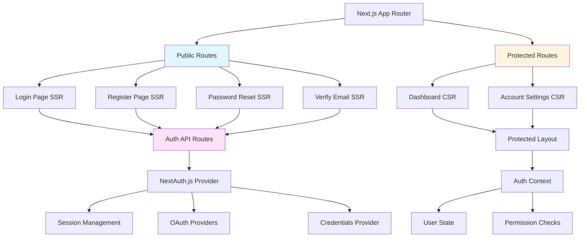

# Gate 1: UI Architecture - SUMA Finance

## Project: SUMA Finance
## Feature: User Registration & Authentication

---

## 1. UI Architecture Overview

### 1.1 UI Architecture Philosophy and Principles
- **User-First Design**: Prioritize simplicity, clarity, and security in authentication flows
- **Progressive Enhancement**: Core functionality works without JavaScript, enhanced with it
- **Accessibility First**: WCAG 2.1 AA compliance as baseline, not afterthought
- **Performance Budget**: Initial page load < 2s, Time to Interactive < 3s
- **Security by Design**: Visual security indicators, clear consent flows
- **Mobile-First Responsive**: Authentication flows optimized for mobile screens

### 1.2 Framework Selection
**Primary Framework**: **React 18.2+** with **Next.js 14** (App Router)

**Rationale**:
- Server-side rendering for initial auth pages (SEO, performance)
- React Server Components for reduced client bundle
- Built-in API routes for BFF pattern
- Excellent TypeScript support
- Large ecosystem for auth libraries (NextAuth.js)

**Mobile**: **React Native 0.73+** (code sharing with web where possible)

### 1.3 Rendering Strategy
- **SSR (Server-Side Rendering)**: Login, Register, Password Reset pages
  - Faster initial load
  - SEO-friendly
  - Security-sensitive pages benefit from server validation
- **CSR (Client-Side Rendering)**: Post-authentication dashboard
  - Rich interactivity
  - Optimized for authenticated users
- **ISR (Incremental Static Regeneration)**: Marketing pages, documentation
  - Cached for performance
  - Revalidated periodically

### 1.4 Design System Integration
**Design System**: Custom design system built on **Radix UI** primitives

**Components**:
- Unstyled, accessible primitives from Radix
- Styled with Tailwind CSS utilities
- Theme tokens from design system
- Documented in Storybook

### 1.5 Technology Stack Overview
```yaml
Frontend Framework: React 18.2 + Next.js 14
Language: TypeScript 5.3
Styling: Tailwind CSS 3.4 + CSS Modules
Component Library: Radix UI + Custom Components
Form Management: React Hook Form 7.50
Validation: Zod 3.22
State Management: Zustand 4.5 (minimal global state)
Auth: NextAuth.js 5 (Auth.js)
HTTP Client: Native fetch with Next.js caching
Testing: Vitest + React Testing Library + Playwright
Icons: Lucide React
Animation: Framer Motion 11
i18n: next-intl 3.0
```

### 1.6 High-Level UI Architecture Diagram



---

## 2. Application Structure

### 2.1 Project Directory Structure

**Feature-Based Organization** (for auth feature):

```
app/
├── (auth)/                          # Route group for auth pages
│   ├── login/
│   │   └── page.tsx                 # /login - SSR
│   ├── register/
│   │   └── page.tsx                 # /register - SSR
│   ├── verify-email/
│   │   └── page.tsx                 # /verify-email - SSR
│   ├── forgot-password/
│   │   └── page.tsx                 # /forgot-password - SSR
│   ├── reset-password/
│   │   └── page.tsx                 # /reset-password - SSR
│   └── layout.tsx                   # Auth pages layout
├── (dashboard)/                     # Route group for protected pages
│   ├── dashboard/
│   │   └── page.tsx                 # /dashboard - CSR
│   ├── settings/
│   │   ├── account/
│   │   │   └── page.tsx            # /settings/account
│   │   └── security/
│   │       └── page.tsx            # /settings/security
│   └── layout.tsx                   # Dashboard layout with auth check
├── api/
│   └── auth/
│       └── [...nextauth]/
│           └── route.ts             # NextAuth.js API routes
└── layout.tsx                       # Root layout

src/
├── components/
│   ├── auth/                        # Auth-specific components
│   │   ├── LoginForm/
│   │   │   ├── LoginForm.tsx
│   │   │   ├── LoginForm.test.tsx
│   │   │   └── index.ts
│   │   ├── RegisterForm/
│   │   │   ├── RegisterForm.tsx
│   │   │   ├── RegisterForm.test.tsx
│   │   │   └── index.ts
│   │   ├── PasswordStrengthIndicator/
│   │   ├── SocialLoginButtons/
│   │   └── TwoFactorInput/
│   ├── ui/                          # Shared UI components
│   │   ├── Button/
│   │   ├── Input/
│   │   ├── Card/
│   │   ├── Alert/
│   │   ├── Checkbox/
│   │   └── Label/
│   └── layouts/
│       ├── AuthLayout/
│       └── DashboardLayout/
├── hooks/
│   ├── useAuth.ts                   # Auth state hook
│   ├── useSession.ts                # Session management
│   └── usePasswordStrength.ts       # Password validation
├── lib/
│   ├── auth/
│   │   ├── auth.config.ts          # NextAuth configuration
│   │   ├── auth-options.ts         # Auth providers config
│   │   └── session.ts              # Session utilities
│   ├── validation/
│   │   ├── auth.schemas.ts         # Zod schemas for auth forms
│   │   └── password.ts             # Password validation logic
│   └── utils/
│       ├── api.ts                  # API client utilities
│       └── storage.ts              # Local storage helpers
├── stores/
│   └── auth-store.ts               # Zustand auth store (minimal)
├── styles/
│   ├── globals.css                 # Global styles + Tailwind
│   └── themes/
│       ├── light.css
│       └── dark.css
└── types/
    ├── auth.ts                     # Auth type definitions
    └── user.ts                     # User type definitions
```

### 2.2 Routing Architecture

**Next.js App Router** (File-based routing with route groups)

#### Route Configuration

```typescript
// Route structure
/login                    → app/(auth)/login/page.tsx
/register                 → app/(auth)/register/page.tsx
/verify-email             → app/(auth)/verify-email/page.tsx
/forgot-password          → app/(auth)/forgot-password/page.tsx
/reset-password           → app/(auth)/reset-password/page.tsx
/dashboard                → app/(dashboard)/dashboard/page.tsx
/settings/account         → app/(dashboard)/settings/account/page.tsx
/settings/security        → app/(dashboard)/settings/security/page.tsx
```

#### Route Groups
- `(auth)`: Public authentication pages, shared auth layout
- `(dashboard)`: Protected pages, shared dashboard layout with navigation

#### Dynamic Routes
```typescript
// Email verification with token
/verify-email/[token]     → app/(auth)/verify-email/[token]/page.tsx

// Password reset with token
/reset-password/[token]   → app/(auth)/reset-password/[token]/page.tsx
```

#### Route Guards and Authentication

```typescript
// app/(dashboard)/layout.tsx
import { redirect } from 'next/navigation';
import { getServerSession } from 'next-auth';
import { authOptions } from '@/lib/auth/auth-options';

export default async function DashboardLayout({
  children,
}: {
  children: React.ReactNode;
}) {
  const session = await getServerSession(authOptions);

  if (!session) {
    redirect('/login?callbackUrl=/dashboard');
  }

  return (
    <div className="dashboard-layout">
      <DashboardNav user={session.user} />
      <main>{children}</main>
    </div>
  );
}
```

### 2.3 Page Architecture

#### Page Component Structure

```typescript
// app/(auth)/login/page.tsx
import { Metadata } from 'next';
import { LoginForm } from '@/components/auth/LoginForm';
import { SocialLoginButtons } from '@/components/auth/SocialLoginButtons';

export const metadata: Metadata = {
  title: 'Login - SUMA Finance',
  description: 'Sign in to your SUMA Finance account',
};

export default function LoginPage() {
  return (
    <div className="auth-page">
      <h1>Welcome Back</h1>
      <LoginForm />
      <SocialLoginButtons />
      <p>
        Don't have an account? <a href="/register">Sign up</a>
      </p>
    </div>
  );
}
```

#### Layout Components

```typescript
// app/(auth)/layout.tsx
import { AuthLayoutShell } from '@/components/layouts/AuthLayout';

export default function AuthLayout({
  children,
}: {
  children: React.ReactNode;
}) {
  return (
    <AuthLayoutShell>
      <div className="auth-container">
        <div className="auth-brand">
          <Logo />
        </div>
        {children}
      </div>
    </AuthLayoutShell>
  );
}
```

#### Loading States and Suspense Boundaries

```typescript
// app/(auth)/login/loading.tsx
export default function LoginLoading() {
  return (
    <div className="auth-skeleton">
      <div className="skeleton-logo" />
      <div className="skeleton-form">
        <div className="skeleton-input" />
        <div className="skeleton-input" />
        <div className="skeleton-button" />
      </div>
    </div>
  );
}
```

---

## 3. Rendering Strategy

### 3.1 Client-Side Rendering (CSR)

**Use Cases**:
- Post-authentication dashboard
- Account settings (interactive forms)
- Real-time features (notifications, live updates)

**Code Splitting Strategy**:
```typescript
// Dynamic imports for heavy components
const TwoFactorSetup = dynamic(
  () => import('@/components/auth/TwoFactorSetup'),
  { 
    loading: () => <Spinner />,
    ssr: false // Client-side only
  }
);
```

**Initial Bundle Optimization**:
- Route-based code splitting (automatic with Next.js)
- Component lazy loading for modals and settings panels
- Tree-shaking unused libraries
- Target bundle size: < 200KB gzipped for initial auth pages

### 3.2 Server-Side Rendering (SSR)

**Use Cases**:
- Login page
- Registration page
- Password reset pages
- Email verification pages

**Benefits**:
- Faster First Contentful Paint (FCP)
- SEO-friendly (though auth pages typically noindex)
- Server-side validation before rendering
- Reduced client-side JavaScript

**Hydration Strategy**:
```typescript
// app/(auth)/login/page.tsx - SSR by default
export default async function LoginPage({
  searchParams,
}: {
  searchParams: { error?: string; callbackUrl?: string };
}) {
  // Server-side data fetching
  const csrfToken = await getCsrfToken();
  
  return (
    <LoginForm 
      error={searchParams.error}
      callbackUrl={searchParams.callbackUrl}
      csrfToken={csrfToken}
    />
  );
}
```

### 3.3 Static Site Generation (SSG)

**Use Cases**:
- Marketing landing pages
- Terms of Service, Privacy Policy
- Help documentation

**Incremental Static Regeneration (ISR)**:
```typescript
// app/privacy/page.tsx
export const revalidate = 3600; // Revalidate every hour

export default async function PrivacyPage() {
  const content = await getPrivacyContent();
  return <LegalDocument content={content} />;
}
```

### 3.4 Hybrid Rendering

**Per-Page Strategy**:
```yaml
Login Page: SSR (fast initial load, SEO)
Register Page: SSR (form pre-populated, validation)
Dashboard: CSR (rich interactivity)
Settings: CSR (complex forms, real-time validation)
Marketing: SSG + ISR (cached, periodically updated)
```

---

## 4. Design System Architecture

### 4.1 Design Tokens

**Token Structure** (CSS Variables + TypeScript):

```css
/* styles/themes/light.css */
:root {
  /* Colors - Semantic */
  --color-primary: 219 78% 56%;          /* Blue for CTAs */
  --color-primary-hover: 219 78% 50%;
  --color-secondary: 142 71% 45%;        /* Green for success */
  --color-danger: 0 84% 60%;             /* Red for errors */
  --color-warning: 38 92% 50%;           /* Orange for warnings */
  
  /* Neutrals */
  --color-background: 0 0% 100%;         /* White */
  --color-foreground: 222 47% 11%;       /* Dark text */
  --color-muted: 210 40% 96%;            /* Light gray */
  --color-border: 214 32% 91%;           /* Border gray */
  
  /* Typography */
  --font-sans: 'Inter', system-ui, sans-serif;
  --font-mono: 'JetBrains Mono', monospace;
  
  /* Font Sizes */
  --text-xs: 0.75rem;      /* 12px */
  --text-sm: 0.875rem;     /* 14px */
  --text-base: 1rem;       /* 16px */
  --text-lg: 1.125rem;     /* 18px */
  --text-xl: 1.25rem;      /* 20px */
  --text-2xl: 1.5rem;      /* 24px */
  --text-3xl: 1.875rem;    /* 30px */
  
  /* Spacing */
  --space-1: 0.25rem;      /* 4px */
  --space-2: 0.5rem;       /* 8px */
  --space-3: 0.75rem;      /* 12px */
  --space-4: 1rem;         /* 16px */
  --space-6: 1.5rem;       /* 24px */
  --space-8: 2rem;         /* 32px */
  --space-12: 3rem;        /* 48px */
  
  /* Shadows */
  --shadow-sm: 0 1px 2px 0 rgb(0 0 0 / 0.05);
  --shadow-md: 0 4px 6px -1px rgb(0 0 0 / 0.1);
  --shadow-lg: 0 10px 15px -3px rgb(0 0 0 / 0.1);
  
  /* Borders */
  --radius-sm: 0.25rem;    /* 4px */
  --radius-md: 0.5rem;     /* 8px */
  --radius-lg: 0.75rem;    /* 12px */
  --radius-full: 9999px;   /* Pill shape */
}
```

```css
/* styles/themes/dark.css */
[data-theme="dark"] {
  --color-background: 222 47% 11%;
  --color-foreground: 210 40% 98%;
  --color-muted: 217 33% 17%;
  --color-border: 217 33% 23%;
  /* ... other dark theme overrides */
}
```

**TypeScript Token Types**:

```typescript
// src/styles/tokens.ts
export const tokens = {
  colors: {
    primary: 'hsl(var(--color-primary))',
    primaryHover: 'hsl(var(--color-primary-hover))',
    secondary: 'hsl(var(--color-secondary))',
    danger: 'hsl(var(--color-danger))',
    warning: 'hsl(var(--color-warning))',
    background: 'hsl(var(--color-background))',
    foreground: 'hsl(var(--color-foreground))',
    muted: 'hsl(var(--color-muted))',
    border: 'hsl(var(--color-border))',
  },
  spacing: {
    1: 'var(--space-1)',
    2: 'var(--space-2)',
    3: 'var(--space-3)',
    4: 'var(--space-4)',
    6: 'var(--space-6)',
    8: 'var(--space-8)',
    12: 'var(--space-12)',
  },
  radius: {
    sm: 'var(--radius-sm)',
    md: 'var(--radius-md)',
    lg: 'var(--radius-lg)',
    full: 'var(--radius-full)',
  },
} as const;
```

### 4.2 Component Library

**Core UI Components** (Built on Radix UI):

```typescript
// src/components/ui/Button/Button.tsx
import * as React from 'react';
import { Slot } from '@radix-ui/react-slot';
import { cva, type VariantProps } from 'class-variance-authority';
import { cn } from '@/lib/utils';

const buttonVariants = cva(
  'inline-flex items-center justify-center rounded-md font-medium transition-colors focus-visible:outline-none focus-visible:ring-2 focus-visible:ring-offset-2 disabled:pointer-events-none disabled:opacity-50',
  {
    variants: {
      variant: {
        primary: 'bg-primary text-white hover:bg-primary-hover',
        secondary: 'bg-secondary text-white hover:bg-secondary/90',
        outline: 'border border-border bg-background hover:bg-muted',
        ghost: 'hover:bg-muted',
        danger: 'bg-danger text-white hover:bg-danger/90',
      },
      size: {
        sm: 'h-9 px-3 text-sm',
        md: 'h-10 px-4 text-base',
        lg: 'h-11 px-6 text-lg',
      },
    },
    defaultVariants: {
      variant: 'primary',
      size: 'md',
    },
  }
);

export interface ButtonProps
  extends React.ButtonHTMLAttributes<HTMLButtonElement>,
    VariantProps<typeof buttonVariants> {
  asChild?: boolean;
}

export const Button = React.forwardRef<HTMLButtonElement, ButtonProps>(
  ({ className, variant, size, asChild = false, ...props }, ref) => {
    const Comp = asChild ? Slot : 'button';
    return (
      <Comp
        className={cn(buttonVariants({ variant, size, className }))}
        ref={ref}
        {...props}
      />
    );
  }
);
Button.displayName = 'Button';
```

**Input Component**:

```typescript
// src/components/ui/Input/Input.tsx
import * as React from 'react';
import { cn } from '@/lib/utils';

export interface InputProps
  extends React.InputHTMLAttributes<HTMLInputElement> {
  error?: string;
}

export const Input = React.forwardRef<HTMLInputElement, InputProps>(
  ({ className, type, error, ...props }, ref) => {
    return (
      <div className="w-full">
        <input
          type={type}
          className={cn(
            'flex h-10 w-full rounded-md border border-border bg-background px-3 py-2 text-sm',
            'placeholder:text-muted-foreground',
            'focus-visible:outline-none focus-visible:ring-2 focus-visible:ring-primary focus-visible:ring-offset-2',
            'disabled:cursor-not-allowed disabled:opacity-50',
            error && 'border-danger focus-visible:ring-danger',
            className
          )}
          ref={ref}
          {...props}
        />
        {error && (
          <p className="mt-1 text-sm text-danger" role="alert">
            {error}
          </p>
        )}
      </div>
    );
  }
);
Input.displayName = 'Input';
```

**Component Composition Example**:

```typescript
// src/components/auth/LoginForm/LoginForm.tsx
import { Input } from '@/components/ui/Input';
import { Button } from '@/components/ui/Button';
import { Label } from '@/components/ui/Label';
import { Alert } from '@/components/ui/Alert';

export function LoginForm() {
  const [error, setError] = useState('');
  
  return (
    <form onSubmit={handleSubmit} className="space-y-4">
      {error && <Alert variant="danger">{error}</Alert>}
      
      <div>
        <Label htmlFor="email">Email</Label>
        <Input 
          id="email" 
          type="email" 
          placeholder="you@example.com"
          error={errors.email}
        />
      </div>
      
      <div>
        <Label htmlFor="password">Password</Label>
        <Input 
          id="password" 
          type="password"
          error={errors.password}
        />
      </div>
      
      <Button type="submit" className="w-full" size="lg">
        Sign In
      </Button>
    </form>
  );
}
```

### 4.3 Theme System

**Theme Provider**:

```typescript
// src/components/providers/ThemeProvider.tsx
'use client';

import * as React from 'react';
import { createContext, useContext, useEffect, useState } from 'react';

type Theme = 'light' | 'dark' | 'system';

type ThemeContextType = {
  theme: Theme;
  setTheme: (theme: Theme) => void;
  resolvedTheme: 'light' | 'dark';
};

const ThemeContext = createContext<ThemeContextType | undefined>(undefined);

export function ThemeProvider({ children }: { children: React.ReactNode }) {
  const [theme, setTheme] = useState<Theme>('system');
  const [resolvedTheme, setResolvedTheme] = useState<'light' | 'dark'>('light');

  useEffect(() => {
    const stored = localStorage.getItem('theme') as Theme | null;
    if (stored) setTheme(stored);
  }, []);

  useEffect(() => {
    const root = window.document.documentElement;
    
    if (theme === 'system') {
      const systemTheme = window.matchMedia('(prefers-color-scheme: dark)').matches
        ? 'dark'
        : 'light';
      root.setAttribute('data-theme', systemTheme);
      setResolvedTheme(systemTheme);
    } else {
      root.setAttribute('data-theme', theme);
      setResolvedTheme(theme);
    }
    
    localStorage.setItem('theme', theme);
  }, [theme]);

  return (
    <ThemeContext.Provider value={{ theme, setTheme, resolvedTheme }}>
      {children}
    </ThemeContext.Provider>
  );
}

export const useTheme = () => {
  const context = useContext(ThemeContext);
  if (!context) throw new Error('useTheme must be used within ThemeProvider');
  return context;
};
```

**Theme Toggle Component**:

```typescript
// src/components/ui/ThemeToggle/ThemeToggle.tsx
import { Moon, Sun } from 'lucide-react';
import { useTheme } from '@/components/providers/ThemeProvider';
import { Button } from '@/components/ui/Button';

export function ThemeToggle() {
  const { theme, setTheme, resolvedTheme } = useTheme();

  const toggleTheme = () => {
    setTheme(resolvedTheme === 'light' ? 'dark' : 'light');
  };

  return (
    <Button
      variant="ghost"
      size="sm"
      onClick={toggleTheme}
      aria-label="Toggle theme"
    >
      {resolvedTheme === 'light' ? <Moon size={18} /> : <Sun size={18} />}
    </Button>
  );
}
```

### 4.4 Typography System

**Typography Styles**:

```css
/* styles/typography.css */
h1, .heading-1 {
  font-size: var(--text-3xl);
  font-weight: 700;
  line-height: 1.2;
  letter-spacing: -0.02em;
}

h2, .heading-2 {
  font-size: var(--text-2xl);
  font-weight: 600;
  line-height: 1.3;
  letter-spacing: -0.01em;
}

h3, .heading-3 {
  font-size: var(--text-xl);
  font-weight: 600;
  line-height: 1.4;
}

.body-large {
  font-size: var(--text-lg);
  line-height: 1.6;
}

.body {
  font-size: var(--text-base);
  line-height: 1.5;
}

.body-small {
  font-size: var(--text-sm);
  line-height: 1.5;
}

.caption {
  font-size: var(--text-xs);
  line-height: 1.4;
  color: hsl(var(--color-muted-foreground));
}
```

**Responsive Typography** (Tailwind Config):

```javascript
// tailwind.config.js
module.exports = {
  theme: {
    extend: {
      fontSize: {
        'xs': ['0.75rem', { lineHeight: '1rem' }],
        'sm': ['0.875rem', { lineHeight: '1.25rem' }],
        'base': ['1rem', { lineHeight: '1.5rem' }],
        'lg': ['1.125rem', { lineHeight: '1.75rem' }],
        'xl': ['1.25rem', { lineHeight: '1.75rem' }],
        '2xl': ['1.5rem', { lineHeight: '2rem' }],
        '3xl': ['1.875rem', { lineHeight: '2.25rem' }],
        // Responsive heading
        'heading-1': ['clamp(1.875rem, 4vw, 3rem)', { lineHeight: '1.2' }],
      },
    },
  },
};
```

---

## 5. Layout Architecture

### 5.1 Layout Components

**Container Component**:

```typescript
// src/components/ui/Container/Container.tsx
import { cn } from '@/lib/utils';

interface ContainerProps {
  children: React.ReactNode;
  className?: string;
  size?: 'sm' | 'md' | 'lg' | 'full';
}

const containerSizes = {
  sm: 'max-w-2xl',
  md: 'max-w-4xl',
  lg: 'max-w-6xl',
  full: 'max-w-full',
};

export function Container({ 
  children, 
  className, 
  size = 'lg' 
}: ContainerProps) {
  return (
    <div className={cn('mx-auto px-4 sm:px-6 lg:px-8', containerSizes[size], className)}>
      {children}
    </div>
  );
}
```

**Stack Component** (Vertical spacing):

```typescript
// src/components/ui/Stack/Stack.tsx
import { cn } from '@/lib/utils';

interface StackProps {
  children: React.ReactNode;
  spacing?: 2 | 3 | 4 | 6 | 8;
  className?: string;
}

export function Stack({ children, spacing = 4, className }: StackProps) {
  const spacingClass = `space-y-${spacing}`;
  return <div className={cn(spacingClass, className)}>{children}</div>;
}
```

**Auth Layout**:

```typescript
// src/components/layouts/AuthLayout/AuthLayout.tsx
import { Container } from '@/components/ui/Container';

interface AuthLayoutProps {
  children: React.ReactNode;
}

export function AuthLayoutShell({ children }: AuthLayoutProps) {
  return (
    <div className="min-h-screen flex items-center justify-center bg-muted">
      <Container size="sm">
        <div className="bg-background rounded-lg shadow-lg p-8">
          {children}
        </div>
      </Container>
    </div>
  );
}
```

### 5.2 Responsive Design

**Mobile-First Approach**:

```css
/* Base styles (mobile) */
.auth-form {
  padding: 1rem;
  width: 100%;
}

/* Tablet and up */
@media (min-width: 640px) {
  .auth-form {
    padding: 2rem;
    max-width: 400px;
  }
}

/* Desktop and up */
@media (min-width: 1024px) {
  .auth-form {
    max-width: 480px;
  }
}
```

**Breakpoints**:

```javascript
// tailwind.config.js
module.exports = {
  theme: {
    screens: {
      'xs': '475px',
      'sm': '640px',   // Mobile landscape / Small tablet
      'md': '768px',   // Tablet
      'lg': '1024px',  // Desktop
      'xl': '1280px',  // Large desktop
      '2xl': '1536px', // Extra large desktop
    },
  },
};
```

**Responsive Props Example**:

```typescript
// Responsive button sizes
<Button 
  size="md"
  className="w-full sm:w-auto sm:min-w-[200px]"
>
  Sign In
</Button>

// Hidden on mobile, visible on desktop
<div className="hidden lg:block">
  <DesktopSidebar />
</div>

// Visible on mobile, hidden on desktop
<div className="block lg:hidden">
  <MobileMenu />
</div>
```

### 5.3 Grid Systems

**Tailwind Grid Utilities**:

```typescript
// Two-column layout for settings page
<div className="grid grid-cols-1 lg:grid-cols-12 gap-6">
  <aside className="lg:col-span-3">
    <SettingsNav />
  </aside>
  <main className="lg:col-span-9">
    <SettingsContent />
  </main>
</div>
```

**CSS Grid for Complex Layouts**:

```css
.dashboard-grid {
  display: grid;
  grid-template-columns: repeat(auto-fit, minmax(300px, 1fr));
  gap: 1.5rem;
}
```

### 5.4 Spacing System

**Tailwind Spacing Scale** (consistent with design tokens):

```javascript
// tailwind.config.js
module.exports = {
  theme: {
    spacing: {
      '0': '0',
      '1': '0.25rem',   // 4px
      '2': '0.5rem',    // 8px
      '3': '0.75rem',   // 12px
      '4': '1rem',      // 16px
      '6': '1.5rem',    // 24px
      '8': '2rem',      // 32px
      '12': '3rem',     // 48px
      '16': '4rem',     // 64px
    },
  },
};
```

**Consistent Spacing Usage**:

```typescript
<form className="space-y-6">  {/* 24px between form sections */}
  <div className="space-y-2">  {/* 8px between label and input */}
    <Label>Email</Label>
    <Input />
  </div>
  
  <div className="space-y-2">
    <Label>Password</Label>
    <Input />
  </div>
  
  <Button className="mt-6">Submit</Button>  {/* Extra spacing before button */}
</form>
```

---

## 6. Styling Architecture

### 6.1 Styling Approach Selection

**Primary**: **Tailwind CSS 3.4** (Utility-first CSS)

**Secondary**: **CSS Modules** (for complex component-specific styles)

**Rationale**:
- Tailwind for rapid development, consistency, responsive design
- CSS Modules for encapsulation when Tailwind becomes verbose
- No runtime CSS-in-JS overhead (performance)
- Type-safe with TypeScript plugin

### 6.2 Global Styles

```css
/* styles/globals.css */
@tailwind base;
@tailwind components;
@tailwind utilities;

@layer base {
  * {
    @apply border-border;
  }
  
  html {
    @apply antialiased;
    font-feature-settings: 'cv11', 'ss01';
  }
  
  body {
    @apply bg-background text-foreground;
    font-family: var(--font-sans);
  }
  
  /* Focus visible styles */
  :focus-visible {
    @apply outline-none ring-2 ring-primary ring-offset-2;
  }
}

@layer components {
  /* Custom components */
  .auth-card {
    @apply bg-background rounded-lg shadow-md p-6 sm:p-8;
  }
  
  .form-error {
    @apply text-sm text-danger mt-1;
  }
}
```

### 6.3 Component Styles

**Tailwind Utility Classes**:

```typescript
// Most components use Tailwind utilities
<div className="flex items-center justify-between p-4 bg-white rounded-lg shadow-sm">
  <h2 className="text-xl font-semibold">Account Security</h2>
  <Button variant="outline" size="sm">Edit</Button>
</div>
```

**CSS Modules for Complex Styles**:

```css
/* components/auth/LoginForm/LoginForm.module.css */
.loginForm {
  display: flex;
  flex-direction: column;
  gap: 1.5rem;
}

.socialDivider {
  position: relative;
  text-align: center;
  margin: 2rem 0;
}

.socialDivider::before {
  content: '';
  position: absolute;
  top: 50%;
  left: 0;
  right: 0;
  height: 1px;
  background: hsl(var(--color-border));
}

.socialDivider span {
  position: relative;
  padding: 0 1rem;
  background: hsl(var(--color-background));
  color: hsl(var(--color-muted-foreground));
  font-size: 0.875rem;
}
```

```typescript
// components/auth/LoginForm/LoginForm.tsx
import styles from './LoginForm.module.css';

export function LoginForm() {
  return (
    <form className={styles.loginForm}>
      {/* ... */}
      <div className={styles.socialDivider}>
        <span>Or continue with</span>
      </div>
      {/* ... */}
    </form>
  );
}
```

### 6.4 Tailwind Configuration

```javascript
// tailwind.config.js
const { fontFamily } = require('tailwindcss/defaultTheme');

module.exports = {
  darkMode: ['class', '[data-theme="dark"]'],
  content: [
    './app/**/*.{ts,tsx}',
    './src/**/*.{ts,tsx}',
  ],
  theme: {
    container: {
      center: true,
      padding: '2rem',
      screens: {
        '2xl': '1400px',
      },
    },
    extend: {
      colors: {
        border: 'hsl(var(--color-border))',
        background: 'hsl(var(--color-background))',
        foreground: 'hsl(var(--color-foreground))',
        primary: {
          DEFAULT: 'hsl(var(--color-primary))',
          hover: 'hsl(var(--color-primary-hover))',
        },
        secondary: 'hsl(var(--color-secondary))',
        danger: 'hsl(var(--color-danger))',
        warning: 'hsl(var(--color-warning))',
        muted: {
          DEFAULT: 'hsl(var(--color-muted))',
          foreground: 'hsl(var(--color-muted-foreground))',
        },
      },
      borderRadius: {
        sm: 'var(--radius-sm)',
        md: 'var(--radius-md)',
        lg: 'var(--radius-lg)',
        full: 'var(--radius-full)',
      },
      fontFamily: {
        sans: ['var(--font-sans)', ...fontFamily.sans],
        mono: ['var(--font-mono)', ...fontFamily.mono],
      },
      keyframes: {
        'fade-in': {
          '0%': { opacity: '0' },
          '100%': { opacity: '1' },
        },
        'slide-in': {
          '0%': { transform: 'translateY(-10px)', opacity: '0' },
          '100%': { transform: 'translateY(0)', opacity: '1' },
        },
      },
      animation: {
        'fade-in': 'fade-in 0.2s ease-out',
        'slide-in': 'slide-in 0.3s ease-out',
      },
    },
  },
  plugins: [
    require('@tailwindcss/forms'),
    require('tailwindcss-animate'),
  ],
};
```

---

## 7. Responsive and Adaptive Design

### 7.1 Breakpoint Strategy

```typescript
// lib/breakpoints.ts
export const breakpoints = {
  mobile: '(max-width: 639px)',
  tablet: '(min-width: 640px) and (max-width: 1023px)',
  desktop: '(min-width: 1024px)',
} as const;

// Custom hook for responsive behavior
export function useMediaQuery(query: string) {
  const [matches, setMatches] = useState(false);

  useEffect(() => {
    const media = window.matchMedia(query);
    setMatches(media.matches);

    const listener = () => setMatches(media.matches);
    media.addEventListener('change', listener);
    return () => media.removeEventListener('change', listener);
  }, [query]);

  return matches;
}

// Usage
const isMobile = useMediaQuery(breakpoints.mobile);
```

### 7.2 Mobile-First Design

**Base Styles for Mobile**:

```typescript
// Login page - mobile first
<div className="space-y-6">
  <h1 className="text-2xl sm:text-3xl font-bold">Welcome Back</h1>
  
  <LoginForm className="w-full" />
  
  {/* Full-width button on mobile, auto-width on tablet+ */}
  <Button className="w-full sm:w-auto sm:min-w-[200px]">
    Sign In
  </Button>
</div>
```

### 7.3 Adaptive Components

**Responsive Navigation**:

```typescript
// src/components/layouts/DashboardNav/DashboardNav.tsx
import { useMediaQuery } from '@/lib/breakpoints';
import { DesktopNav } from './DesktopNav';
import { MobileNav } from './MobileNav';

export function DashboardNav() {
  const isMobile = useMediaQuery('(max-width: 1023px)');
  
  return isMobile ? <MobileNav /> : <DesktopNav />;
}
```

**Responsive Images**:

```typescript
// Next.js Image component with responsive sizes
<Image
  src="/hero.jpg"
  alt="SUMA Finance"
  width={1200}
  height={600}
  sizes="(max-width: 640px) 100vw, (max-width: 1024px) 50vw, 33vw"
  priority
/>
```

**Responsive Tables**:

```typescript
// Desktop: table, Mobile: card list
<div className="hidden md:block">
  <table className="w-full">
    {/* Table view */}
  </table>
</div>

<div className="block md:hidden space-y-4">
  {items.map(item => (
    <Card key={item.id}>
      {/* Card view */}
    </Card>
  ))}
</div>
```

### 7.4 Touch vs Mouse

**Touch-Friendly Tap Targets**:

```css
/* Minimum 44x44px touch targets on mobile */
.mobile-button {
  @apply min-h-[44px] min-w-[44px] touch-manipulation;
}

/* Prevent double-tap zoom on buttons */
button {
  touch-action: manipulation;
}
```

**Hover States (Desktop Only)**:

```typescript
// Only show hover effects on devices with hover capability
<Button className="hover:bg-primary-hover active:scale-95 md:active:scale-100">
  Submit
</Button>
```

```css
/* CSS for hover-capable devices only */
@media (hover: hover) {
  .button:hover {
    background-color: hsl(var(--color-primary-hover));
  }
}
```

---

## 8. Navigation Architecture

### 8.1 Primary Navigation

**Desktop Navigation** (Top Navbar):

```typescript
// src/components/layouts/DashboardNav/DesktopNav.tsx
import { Home, Settings, User, LogOut } from 'lucide-react';
import { Button } from '@/components/ui/Button';

export function DesktopNav({ user }: { user: User }) {
  return (
    <nav className="border-b border-border bg-background">
      <div className="container flex items-center justify-between h-16">
        <div className="flex items-center gap-8">
          <Logo />
          <div className="hidden md:flex items-center gap-4">
            <NavLink href="/dashboard" icon={<Home />}>Dashboard</NavLink>
            <NavLink href="/settings" icon={<Settings />}>Settings</NavLink>
          </div>
        </div>
        
        <div className="flex items-center gap-4">
          <ThemeToggle />
          <UserMenu user={user} />
        </div>
      </div>
    </nav>
  );
}
```

**Mobile Navigation** (Bottom Tab Bar):

```typescript
// src/components/layouts/DashboardNav/MobileNav.tsx
export function MobileNav() {
  const pathname = usePathname();
  
  return (
    <nav className="md:hidden fixed bottom-0 left-0 right-0 bg-background border-t border-border">
      <div className="flex items-center justify-around h-16">
        <MobileNavItem href="/dashboard" icon={<Home />} active={pathname === '/dashboard'}>
          Home
        </MobileNavItem>
        <MobileNavItem href="/settings" icon={<Settings />} active={pathname === '/settings'}>
          Settings
        </MobileNavItem>
        <MobileNavItem href="/profile" icon={<User />} active={pathname === '/profile'}>
          Profile
        </MobileNavItem>
      </div>
    </nav>
  );
}

function MobileNavItem({ href, icon, active, children }: MobileNavItemProps) {
  return (
    <Link
      href={href}
      className={cn(
        'flex flex-col items-center gap-1 py-2 px-4 text-xs',
        active ? 'text-primary' : 'text-muted-foreground'
      )}
    >
      {icon}
      <span>{children}</span>
    </Link>
  );
}
```

### 8.2 Secondary Navigation

**Tabs for Settings Pages**:

```typescript
// src/components/ui/Tabs/Tabs.tsx (using Radix UI)
import * as TabsPrimitive from '@radix-ui/react-tabs';

export function SettingsTabs() {
  return (
    <TabsPrimitive.Root defaultValue="account">
      <TabsPrimitive.List className="flex border-b border-border">
        <TabsPrimitive.Trigger value="account" className="tab-trigger">
          Account
        </TabsPrimitive.Trigger>
        <TabsPrimitive.Trigger value="security" className="tab-trigger">
          Security
        </TabsPrimitive.Trigger>
        <TabsPrimitive.Trigger value="notifications" className="tab-trigger">
          Notifications
        </TabsPrimitive.Trigger>
      </TabsPrimitive.List>
      
      <TabsPrimitive.Content value="account">
        <AccountSettings />
      </TabsPrimitive.Content>
      <TabsPrimitive.Content value="security">
        <SecuritySettings />
      </TabsPrimitive.Content>
      <TabsPrimitive.Content value="notifications">
        <NotificationSettings />
      </TabsPrimitive.Content>
    </TabsPrimitive.Root>
  );
}
```

**Breadcrumbs**:

```typescript
// src/components/ui/Breadcrumbs/Breadcrumbs.tsx
import { ChevronRight } from 'lucide-react';

export function Breadcrumbs({ items }: { items: BreadcrumbItem[] }) {
  return (
    <nav aria-label="Breadcrumb">
      <ol className="flex items-center gap-2 text-sm">
        {items.map((item, index) => (
          <li key={item.href} className="flex items-center gap-2">
            {index > 0 && <ChevronRight size={16} className="text-muted-foreground" />}
            {index === items.length - 1 ? (
              <span className="font-medium">{item.label}</span>
            ) : (
              <Link href={item.href} className="text-muted-foreground hover:text-foreground">
                {item.label}
              </Link>
            )}
          </li>
        ))}
      </ol>
    </nav>
  );
}
```

### 8.3 Navigation State

**Active Route Highlighting**:

```typescript
// src/components/layouts/NavLink/NavLink.tsx
'use client';

import { usePathname } from 'next/navigation';
import Link from 'next/link';
import { cn } from '@/lib/utils';

export function NavLink({ href, children, icon }: NavLinkProps) {
  const pathname = usePathname();
  const isActive = pathname === href;
  
  return (
    <Link
      href={href}
      className={cn(
        'flex items-center gap-2 px-3 py-2 rounded-md transition-colors',
        isActive 
          ? 'bg-primary text-white' 
          : 'text-muted-foreground hover:bg-muted hover:text-foreground'
      )}
      aria-current={isActive ? 'page' : undefined}
    >
      {icon}
      {children}
    </Link>
  );
}
```

---

## 9. Form Architecture

### 9.1 Form Design

**Form Layout** (Single Column for Auth):

```typescript
// src/components/auth/RegisterForm/RegisterForm.tsx
import { useForm } from 'react-hook-form';
import { zodResolver } from '@hookform/resolvers/zod';
import { registerSchema } from '@/lib/validation/auth.schemas';

export function RegisterForm() {
  const {
    register,
    handleSubmit,
    formState: { errors, isSubmitting },
  } = useForm({
    resolver: zodResolver(registerSchema),
  });

  const onSubmit = async (data: RegisterData) => {
    // Handle registration
  };

  return (
    <form onSubmit={handleSubmit(onSubmit)} className="space-y-6">
      {/* Email Field */}
      <div className="space-y-2">
        <Label htmlFor="email">
          Email <span className="text-danger">*</span>
        </Label>
        <Input
          id="email"
          type="email"
          placeholder="you@example.com"
          {...register('email')}
          error={errors.email?.message}
          autoComplete="email"
        />
        <p className="text-xs text-muted-foreground">
          We'll send a verification link to this email
        </p>
      </div>

      {/* Password Field */}
      <div className="space-y-2">
        <Label htmlFor="password">
          Password <span className="text-danger">*</span>
        </Label>
        <Input
          id="password"
          type="password"
          {...register('password')}
          error={errors.password?.message}
          autoComplete="new-password"
        />
        <PasswordStrengthIndicator password={watch('password')} />
      </div>

      {/* Confirm Password */}
      <div className="space-y-2">
        <Label htmlFor="confirmPassword">
          Confirm Password <span className="text-danger">*</span>
        </Label>
        <Input
          id="confirmPassword"
          type="password"
          {...register('confirmPassword')}
          error={errors.confirmPassword?.message}
          autoComplete="new-password"
        />
      </div>

      {/* Terms Acceptance */}
      <div className="flex items-start gap-2">
        <Checkbox
          id="acceptTerms"
          {...register('acceptTerms')}
          aria-describedby="terms-error"
        />
        <Label htmlFor="acceptTerms" className="text-sm font-normal">
          I agree to the{' '}
          <a href="/terms" className="text-primary hover:underline">
            Terms of Service
          </a>{' '}
          and{' '}
          <a href="/privacy" className="text-primary hover:underline">
            Privacy Policy
          </a>
        </Label>
      </div>
      {errors.acceptTerms && (
        <p id="terms-error" className="form-error">
          {errors.acceptTerms.message}
        </p>
      )}

      {/* Submit Button */}
      <Button type="submit" className="w-full" size="lg" disabled={isSubmitting}>
        {isSubmitting ? 'Creating Account...' : 'Create Account'}
      </Button>
    </form>
  );
}
```

### 9.2 Validation UX

**Zod Schema for Validation**:

```typescript
// src/lib/validation/auth.schemas.ts
import { z } from 'zod';

export const registerSchema = z.object({
  email: z
    .string()
    .min(1, 'Email is required')
    .email('Please enter a valid email address'),
  password: z
    .string()
    .min(8, 'Password must be at least 8 characters')
    .regex(/[A-Z]/, 'Password must contain at least one uppercase letter')
    .regex(/[a-z]/, 'Password must contain at least one lowercase letter')
    .regex(/[0-9]/, 'Password must contain at least one number')
    .regex(/[^A-Za-z0-9]/, 'Password must contain at least one special character'),
  confirmPassword: z.string(),
  acceptTerms: z.literal(true, {
    errorMap: () => ({ message: 'You must accept the terms and conditions' }),
  }),
}).refine((data) => data.password === data.confirmPassword, {
  message: 'Passwords do not match',
  path: ['confirmPassword'],
});

export type RegisterData = z.infer<typeof registerSchema>;
```

**Real-Time Validation**:

```typescript
// Validate on blur, show errors immediately
<Input
  {...register('email', {
    onBlur: () => trigger('email'), // Trigger validation on blur
  })}
  error={errors.email?.message}
/>
```

**Password Strength Indicator**:

```typescript
// src/components/auth/PasswordStrengthIndicator/PasswordStrengthIndicator.tsx
export function PasswordStrengthIndicator({ password }: { password: string }) {
  const strength = calculatePasswordStrength(password);
  
  return (
    <div className="space-y-2">
      <div className="flex gap-1">
        {[1, 2, 3, 4].map((level) => (
          <div
            key={level}
            className={cn(
              'h-1 flex-1 rounded-full transition-colors',
              strength >= level ? strengthColors[strength] : 'bg-muted'
            )}
          />
        ))}
      </div>
      <p className={cn('text-xs', strengthTextColors[strength])}>
        {strengthLabels[strength]}
      </p>
      <ul className="text-xs text-muted-foreground space-y-1">
        <li className={password.length >= 8 ? 'text-secondary' : ''}>
          ✓ At least 8 characters
        </li>
        <li className={/[A-Z]/.test(password) ? 'text-secondary' : ''}>
          ✓ One uppercase letter
        </li>
        <li className={/[0-9]/.test(password) ? 'text-secondary' : ''}>
          ✓ One number
        </li>
        <li className={/[^A-Za-z0-9]/.test(password) ? 'text-secondary' : ''}>
          ✓ One special character
        </li>
      </ul>
    </div>
  );
}
```

### 9.3 Form Accessibility

**Label Association**:

```typescript
// Always associate labels with inputs
<Label htmlFor="email">Email</Label>
<Input id="email" {...register('email')} />
```

**Error Announcements**:

```typescript
// Use aria-describedby and role="alert"
<Input
  id="email"
  aria-describedby={errors.email ? 'email-error' : undefined}
  aria-invalid={!!errors.email}
  {...register('email')}
/>
{errors.email && (
  <p id="email-error" className="form-error" role="alert">
    {errors.email.message}
  </p>
)}
```

**Required Field Indicators**:

```typescript
<Label htmlFor="email">
  Email <span className="text-danger" aria-label="required">*</span>
</Label>
```

---

## 10. Loading States and Suspense

### 10.1 Loading Indicators

**Spinner Component**:

```typescript
// src/components/ui/Spinner/Spinner.tsx
import { cn } from '@/lib/utils';

export function Spinner({ size = 'md', className }: SpinnerProps) {
  const sizes = {
    sm: 'w-4 h-4',
    md: 'w-6 h-6',
    lg: 'w-8 h-8',
  };
  
  return (
    <div
      className={cn('animate-spin rounded-full border-2 border-primary border-t-transparent', sizes[size], className)}
      role="status"
      aria-label="Loading"
    >
      <span className="sr-only">Loading...</span>
    </div>
  );
}
```

**Skeleton Screen**:

```typescript
// src/components/ui/Skeleton/Skeleton.tsx
export function Skeleton({ className, ...props }: SkeletonProps) {
  return (
    <div
      className={cn('animate-pulse rounded-md bg-muted', className)}
      {...props}
    />
  );
}

// Usage: Login page skeleton
export function LoginSkeleton() {
  return (
    <div className="space-y-6">
      <Skeleton className="h-8 w-48" /> {/* Title */}
      <div className="space-y-4">
        <Skeleton className="h-10 w-full" /> {/* Email input */}
        <Skeleton className="h-10 w-full" /> {/* Password input */}
        <Skeleton className="h-12 w-full" /> {/* Submit button */}
      </div>
    </div>
  );
}
```

**Button Loading State**:

```typescript
<Button disabled={isSubmitting}>
  {isSubmitting ? (
    <>
      <Spinner size="sm" className="mr-2" />
      Signing in...
    </>
  ) : (
    'Sign In'
  )}
</Button>
```

### 10.2 Suspense Boundaries

**Next.js Loading UI**:

```typescript
// app/(auth)/login/loading.tsx
export default function LoginLoading() {
  return <LoginSkeleton />;
}
```

**React Suspense for Code Splitting**:

```typescript
import { Suspense, lazy } from 'react';

const TwoFactorSetup = lazy(() => import('@/components/auth/TwoFactorSetup'));

export function SecuritySettings() {
  return (
    <Suspense fallback={<Spinner />}>
      <TwoFactorSetup />
    </Suspense>
  );
}
```

### 10.3 Lazy Loading

**Image Lazy Loading**:

```typescript
// Next.js Image with lazy loading by default
<Image
  src="/avatar.jpg"
  alt="User avatar"
  width={100}
  height={100}
  loading="lazy" // Default behavior
/>
```

**Infinite Scroll** (for future activity logs):

```typescript
import { useInfiniteQuery } from '@tanstack/react-query';
import { useInView } from 'react-intersection-observer';

export function ActivityLog() {
  const { ref, inView } = useInView();
  
  const {
    data,
    fetchNextPage,
    hasNextPage,
    isFetchingNextPage,
  } = useInfiniteQuery({
    queryKey: ['activity'],
    queryFn: ({ pageParam = 0 }) => fetchActivity(pageParam),
    getNextPageParam: (lastPage) => lastPage.nextCursor,
  });

  useEffect(() => {
    if (inView && hasNextPage) {
      fetchNextPage();
    }
  }, [inView, hasNextPage]);

  return (
    <div>
      {data?.pages.map((page) =>
        page.items.map((item) => <ActivityItem key={item.id} item={item} />)
      )}
      <div ref={ref}>{isFetchingNextPage && <Spinner />}</div>
    </div>
  );
}
```

---

## 11. Error Handling and Empty States

### 11.1 Error States

**Error Boundary**:

```typescript
// src/components/ErrorBoundary/ErrorBoundary.tsx
'use client';

import { Component, ReactNode } from 'react';
import { AlertTriangle } from 'lucide-react';
import { Button } from '@/components/ui/Button';

interface Props {
  children: ReactNode;
  fallback?: ReactNode;
}

interface State {
  hasError: boolean;
  error?: Error;
}

export class ErrorBoundary extends Component<Props, State> {
  constructor(props: Props) {
    super(props);
    this.state = { hasError: false };
  }

  static getDerivedStateFromError(error: Error): State {
    return { hasError: true, error };
  }

  componentDidCatch(error: Error, errorInfo: React.ErrorInfo) {
    console.error('ErrorBoundary caught:', error, errorInfo);
  }

  render() {
    if (this.state.hasError) {
      return (
        this.props.fallback || (
          <div className="flex flex-col items-center justify-center min-h-[400px] p-8 text-center">
            <AlertTriangle className="w-12 h-12 text-danger mb-4" />
            <h2 className="text-xl font-semibold mb-2">Something went wrong</h2>
            <p className="text-muted-foreground mb-6">
              We encountered an unexpected error. Please try again.
            </p>
            <Button onClick={() => this.setState({ hasError: false })}>
              Try Again
            </Button>
          </div>
        )
      );
    }

    return this.props.children;
  }
}
```

**Next.js Error Page**:

```typescript
// app/(auth)/error.tsx
'use client';

import { useEffect } from 'react';
import { AlertTriangle } from 'lucide-react';
import { Button } from '@/components/ui/Button';

export default function Error({
  error,
  reset,
}: {
  error: Error & { digest?: string };
  reset: () => void;
}) {
  useEffect(() => {
    console.error(error);
  }, [error]);

  return (
    <div className="flex flex-col items-center justify-center min-h-screen p-4">
      <AlertTriangle className="w-16 h-16 text-danger mb-4" />
      <h1 className="text-2xl font-bold mb-2">Authentication Error</h1>
      <p className="text-muted-foreground mb-6 text-center max-w-md">
        {error.message || 'An error occurred during authentication'}
      </p>
      <div className="flex gap-4">
        <Button onClick={reset}>Try Again</Button>
        <Button variant="outline" asChild>
          <a href="/login">Back to Login</a>
        </Button>
      </div>
    </div>
  );
}
```

**Inline Error Messages**:

```typescript
// Display validation errors inline
{errors.email && (
  <Alert variant="danger" className="mt-4">
    <AlertTriangle className="w-4 h-4" />
    <p>{errors.email.message}</p>
  </Alert>
)}
```

### 11.2 Empty States

**No Data State**:

```typescript
// src/components/ui/EmptyState/EmptyState.tsx
import { LucideIcon } from 'lucide-react';
import { Button } from '@/components/ui/Button';

interface EmptyStateProps {
  icon: LucideIcon;
  title: string;
  description: string;
  action?: {
    label: string;
    onClick: () => void;
  };
}

export function EmptyState({ icon: Icon, title, description, action }: EmptyStateProps) {
  return (
    <div className="flex flex-col items-center justify-center p-12 text-center">
      <div className="w-16 h-16 rounded-full bg-muted flex items-center justify-center mb-4">
        <Icon className="w-8 h-8 text-muted-foreground" />
      </div>
      <h3 className="text-lg font-semibold mb-2">{title}</h3>
      <p className="text-muted-foreground mb-6 max-w-md">{description}</p>
      {action && (
        <Button onClick={action.onClick}>{action.label}</Button>
      )}
    </div>
  );
}

// Usage
import { Shield } from 'lucide-react';

<EmptyState
  icon={Shield}
  title="No sessions found"
  description="You don't have any active sessions. Your active sessions will appear here."
  action={{
    label: 'Refresh',
    onClick: () => window.location.reload(),
  }}
/>
```

---

## 12. Accessibility (a11y) Architecture

### 12.1 Semantic HTML

```typescript
// Use semantic HTML elements
<main>
  <article>
    <header>
      <h1>Account Settings</h1>
    </header>
    <section aria-labelledby="security-heading">
      <h2 id="security-heading">Security</h2>
      {/* Security settings */}
    </section>
  </article>
</main>
```

### 12.2 Keyboard Navigation

**Focus Management**:

```typescript
// Focus email input on page load
'use client';

import { useEffect, useRef } from 'react';

export function LoginForm() {
  const emailRef = useRef<HTMLInputElement>(null);

  useEffect(() => {
    emailRef.current?.focus();
  }, []);

  return (
    <form>
      <Input ref={emailRef} id="email" type="email" />
      {/* ... */}
    </form>
  );
}
```

**Modal Focus Trap**:

```typescript
// Using Radix UI Dialog (built-in focus trap)
import * as Dialog from '@radix-ui/react-dialog';

export function ConfirmDialog() {
  return (
    <Dialog.Root>
      <Dialog.Trigger asChild>
        <Button>Delete Account</Button>
      </Dialog.Trigger>
      <Dialog.Portal>
        <Dialog.Overlay className="fixed inset-0 bg-black/50" />
        <Dialog.Content className="fixed top-1/2 left-1/2 -translate-x-1/2 -translate-y-1/2 bg-white p-6 rounded-lg">
          <Dialog.Title>Confirm Deletion</Dialog.Title>
          <Dialog.Description>
            This action cannot be undone.
          </Dialog.Description>
          <div className="flex gap-4 mt-6">
            <Dialog.Close asChild>
              <Button variant="outline">Cancel</Button>
            </Dialog.Close>
            <Button variant="danger">Delete</Button>
          </div>
        </Dialog.Content>
      </Dialog.Portal>
    </Dialog.Root>
  );
}
```

### 12.3 Screen Reader Support

**ARIA Labels**:

```typescript
<Button aria-label="Close dialog">
  <X size={20} />
</Button>

<Input
  aria-label="Email address"
  aria-describedby="email-hint"
  aria-invalid={!!errors.email}
/>
<p id="email-hint" className="text-sm text-muted-foreground">
  We'll never share your email
</p>
```

**Live Regions**:

```typescript
// Announce form submission status
<div aria-live="polite" aria-atomic="true" className="sr-only">
  {isSubmitting && 'Submitting form...'}
  {isSuccess && 'Form submitted successfully'}
  {isError && 'Form submission failed'}
</div>
```

**Visually Hidden**:

```css
/* styles/globals.css */
.sr-only {
  position: absolute;
  width: 1px;
  height: 1px;
  padding: 0;
  margin: -1px;
  overflow: hidden;
  clip: rect(0, 0, 0, 0);
  white-space: nowrap;
  border-width: 0;
}
```

### 12.4 Color and Contrast

**WCAG AA Compliance**:

```css
/* Ensure 4.5:1 contrast ratio for text */
--color-foreground: 222 47% 11%;     /* #1a202c on white = 12.63:1 ✓ */
--color-primary: 219 78% 56%;        /* #3b82f6 on white = 4.54:1 ✓ */
--color-danger: 0 84% 60%;           /* #f44336 on white = 4.52:1 ✓ */
```

**Don't Rely on Color Alone**:

```typescript
// Use icons + color for status
<div className="flex items-center gap-2 text-secondary">
  <CheckCircle size={16} />
  <span>Email verified</span>
</div>

<div className="flex items-center gap-2 text-danger">
  <AlertCircle size={16} />
  <span>Verification failed</span>
</div>
```

### 12.5 Focus Indicators

**Custom Focus Ring**:

```css
/* styles/globals.css */
:focus-visible {
  outline: 2px solid hsl(var(--color-primary));
  outline-offset: 2px;
}

/* High contrast focus indicator */
@media (prefers-contrast: high) {
  :focus-visible {
    outline-width: 3px;
    outline-color: currentColor;
  }
}
```

---

## 13. Internationalization (i18n) and Localization (l10n)

### 13.1 i18n Library

**next-intl Setup**:

```typescript
// src/i18n.ts
import { getRequestConfig } from 'next-intl/server';

export default getRequestConfig(async ({ locale }) => ({
  messages: (await import(`../messages/${locale}.json`)).default,
}));
```

**Translation Files**:

```json
// messages/en.json
{
  "auth": {
    "login": {
      "title": "Welcome Back",
      "emailLabel": "Email",
      "passwordLabel": "Password",
      "submitButton": "Sign In",
      "forgotPassword": "Forgot password?",
      "noAccount": "Don't have an account?",
      "signUp": "Sign up"
    },
    "register": {
      "title": "Create Account",
      "passwordStrength": {
        "weak": "Weak password",
        "medium": "Medium strength",
        "strong": "Strong password"
      }
    },
    "errors": {
      "invalidCredentials": "Invalid email or password",
      "emailRequired": "Email is required",
      "passwordRequired": "Password is required"
    }
  }
}
```

```json
// messages/pt.json
{
  "auth": {
    "login": {
      "title": "Bem-vindo de Volta",
      "emailLabel": "Email",
      "passwordLabel": "Senha",
      "submitButton": "Entrar",
      "forgotPassword": "Esqueceu a senha?",
      "noAccount": "Não tem uma conta?",
      "signUp": "Inscrever-se"
    }
  }
}
```

**Usage in Components**:

```typescript
// src/components/auth/LoginForm/LoginForm.tsx
'use client';

import { useTranslations } from 'next-intl';

export function LoginForm() {
  const t = useTranslations('auth.login');

  return (
    <form>
      <h1>{t('title')}</h1>
      <Label>{t('emailLabel')}</Label>
      <Input type="email" />
      <Label>{t('passwordLabel')}</Label>
      <Input type="password" />
      <Button>{t('submitButton')}</Button>
    </form>
  );
}
```

### 13.2 Text Direction (RTL Support)

**RTL CSS**:

```css
/* Automatic RTL with Tailwind dir plugin */
[dir="rtl"] .ml-4 {
  margin-right: 1rem;
  margin-left: 0;
}

/* Manual RTL overrides */
[dir="rtl"] .auth-form {
  text-align: right;
}

[dir="rtl"] .icon-start {
  order: 2;
}
```

### 13.3 Number and Date Formatting

```typescript
// src/lib/i18n/formatting.ts
import { useLocale } from 'next-intl';

export function useFormatters() {
  const locale = useLocale();

  const formatDate = (date: Date) => {
    return new Intl.DateTimeFormat(locale, {
      year: 'numeric',
      month: 'long',
      day: 'numeric',
    }).format(date);
  };

  const formatCurrency = (amount: number, currency = 'EUR') => {
    return new Intl.NumberFormat(locale, {
      style: 'currency',
      currency,
    }).format(amount);
  };

  return { formatDate, formatCurrency };
}
```

---

## 14. Animation and Transitions

### 14.1 Framer Motion for Complex Animations

```typescript
// src/components/auth/AnimatedForm/AnimatedForm.tsx
import { motion } from 'framer-motion';

export function AnimatedLoginForm() {
  return (
    <motion.div
      initial={{ opacity: 0, y: 20 }}
      animate={{ opacity: 1, y: 0 }}
      transition={{ duration: 0.4, ease: 'easeOut' }}
    >
      <LoginForm />
    </motion.div>
  );
}
```

### 14.2 CSS Transitions

```css
/* Smooth transitions for interactive elements */
.button {
  transition: background-color 0.2s ease, transform 0.1s ease;
}

.button:active {
  transform: scale(0.98);
}

/* Fade in animation */
@keyframes fade-in {
  from { opacity: 0; }
  to { opacity: 1; }
}

.alert {
  animation: fade-in 0.3s ease-out;
}
```

### 14.3 Reduced Motion

```css
/* Respect user's motion preference */
@media (prefers-reduced-motion: reduce) {
  *,
  *::before,
  *::after {
    animation-duration: 0.01ms !important;
    animation-iteration-count: 1 !important;
    transition-duration: 0.01ms !important;
  }
}
```

---

## 15. Icon and Asset Management

### 15.1 Icon System

**Lucide React** (Primary icon library):

```typescript
import { Mail, Lock, Eye, EyeOff, AlertCircle } from 'lucide-react';

export function LoginForm() {
  const [showPassword, setShowPassword] = useState(false);

  return (
    <>
      <div className="relative">
        <Mail className="absolute left-3 top-1/2 -translate-y-1/2 text-muted-foreground" size={18} />
        <Input className="pl-10" type="email" />
      </div>
      
      <div className="relative">
        <Lock className="absolute left-3 top-1/2 -translate-y-1/2 text-muted-foreground" size={18} />
        <Input className="pl-10 pr-10" type={showPassword ? 'text' : 'password'} />
        <button
          type="button"
          onClick={() => setShowPassword(!showPassword)}
          className="absolute right-3 top-1/2 -translate-y-1/2"
        >
          {showPassword ? <EyeOff size={18} /> : <Eye size={18} />}
        </button>
      </div>
    </>
  );
}
```

### 15.2 Image Optimization

**Next.js Image Component**:

```typescript
import Image from 'next/image';

export function Logo() {
  return (
    <Image
      src="/logo.svg"
      alt="SUMA Finance"
      width={150}
      height={40}
      priority // Load immediately
    />
  );
}

// Responsive avatar
<Image
  src={user.avatar}
  alt={user.name}
  width={40}
  height={40}
  className="rounded-full"
  sizes="40px"
/>
```

---

## 16. Performance Optimization

### 16.1 Bundle Optimization

**Code Splitting**:

```typescript
// Route-based (automatic with Next.js App Router)
// Component-based
import dynamic from 'next/dynamic';

const TwoFactorSetup = dynamic(
  () => import('@/components/auth/TwoFactorSetup'),
  {
    loading: () => <Spinner />,
    ssr: false,
  }
);
```

**Bundle Analysis**:

```bash
# Add to package.json
"analyze": "ANALYZE=true next build"
```

### 16.2 Rendering Performance

**React Optimization**:

```typescript
import { memo, useMemo, useCallback } from 'react';

export const LoginForm = memo(function LoginForm({ onSubmit }: LoginFormProps) {
  const handleSubmit = useCallback((data: LoginData) => {
    onSubmit(data);
  }, [onSubmit]);

  return <form onSubmit={handleSubmit}>{/* ... */}</form>;
});
```

### 16.3 Resource Loading

```typescript
// app/layout.tsx
import { Inter } from 'next/font/google';

const inter = Inter({
  subsets: ['latin'],
  display: 'swap', // FOUT strategy
  preload: true,
});

export default function RootLayout({ children }: { children: React.ReactNode }) {
  return (
    <html lang="en" className={inter.className}>
      <head>
        <link rel="preconnect" href="https://api.sumafinance.com" />
      </head>
      <body>{children}</body>
    </html>
  );
}
```

---

## 17. SEO and Meta Tags

```typescript
// app/(auth)/login/page.tsx
import { Metadata } from 'next';

export const metadata: Metadata = {
  title: 'Login - SUMA Finance',
  description: 'Sign in to your SUMA Finance account to manage your finances',
  robots: 'noindex, nofollow', // Don't index auth pages
  openGraph: {
    title: 'SUMA Finance - Login',
    description: 'Secure login to SUMA Finance',
    type: 'website',
  },
};
```

---

## 18. Testing Architecture

### 18.1 Unit Testing

```typescript
// src/components/auth/LoginForm/LoginForm.test.tsx
import { render, screen, waitFor } from '@testing-library/react';
import userEvent from '@testing-library/user-event';
import { LoginForm } from './LoginForm';

describe('LoginForm', () => {
  it('should render email and password inputs', () => {
    render(<LoginForm />);
    expect(screen.getByLabelText(/email/i)).toBeInTheDocument();
    expect(screen.getByLabelText(/password/i)).toBeInTheDocument();
  });

  it('should show validation errors for empty fields', async () => {
    const user = userEvent.setup();
    render(<LoginForm />);
    
    await user.click(screen.getByRole('button', { name: /sign in/i }));
    
    await waitFor(() => {
      expect(screen.getByText(/email is required/i)).toBeInTheDocument();
    });
  });

  it('should submit form with valid data', async () => {
    const onSubmit = vi.fn();
    const user = userEvent.setup();
    render(<LoginForm onSubmit={onSubmit} />);
    
    await user.type(screen.getByLabelText(/email/i), 'test@example.com');
    await user.type(screen.getByLabelText(/password/i), 'Password123!');
    await user.click(screen.getByRole('button', { name: /sign in/i }));
    
    await waitFor(() => {
      expect(onSubmit).toHaveBeenCalledWith({
        email: 'test@example.com',
        password: 'Password123!',
      });
    });
  });
});
```

### 18.2 Accessibility Testing

```typescript
// src/components/auth/LoginForm/LoginForm.a11y.test.tsx
import { render } from '@testing-library/react';
import { axe, toHaveNoViolations } from 'jest-axe';
import { LoginForm } from './LoginForm';

expect.extend(toHaveNoViolations);

describe('LoginForm Accessibility', () => {
  it('should have no accessibility violations', async () => {
    const { container } = render(<LoginForm />);
    const results = await axe(container);
    expect(results).toHaveNoViolations();
  });
});
```

### 18.3 End-to-End Testing

```typescript
// e2e/auth/login.spec.ts (Playwright)
import { test, expect } from '@playwright/test';

test.describe('Login Flow', () => {
  test('should allow user to login with valid credentials', async ({ page }) => {
    await page.goto('/login');
    
    await page.fill('input[name="email"]', 'test@example.com');
    await page.fill('input[name="password"]', 'Password123!');
    await page.click('button[type="submit"]');
    
    await expect(page).toHaveURL('/dashboard');
    await expect(page.locator('h1')).toContainText('Dashboard');
  });

  test('should show error for invalid credentials', async ({ page }) => {
    await page.goto('/login');
    
    await page.fill('input[name="email"]', 'wrong@example.com');
    await page.fill('input[name="password"]', 'wrongpassword');
    await page.click('button[type="submit"]');
    
    await expect(page.locator('[role="alert"]')).toContainText('Invalid email or password');
  });
});
```

---

## 19. DevTools and Development Experience

### 19.1 Storybook

```typescript
// src/components/ui/Button/Button.stories.tsx
import type { Meta, StoryObj } from '@storybook/react';
import { Button } from './Button';

const meta: Meta<typeof Button> = {
  title: 'UI/Button',
  component: Button,
  tags: ['autodocs'],
  argTypes: {
    variant: {
      control: 'select',
      options: ['primary', 'secondary', 'outline', 'ghost', 'danger'],
    },
    size: {
      control: 'select',
      options: ['sm', 'md', 'lg'],
    },
  },
};

export default meta;
type Story = StoryObj<typeof Button>;

export const Primary: Story = {
  args: {
    variant: 'primary',
    children: 'Button',
  },
};

export const Danger: Story = {
  args: {
    variant: 'danger',
    children: 'Delete Account',
  },
};

export const Loading: Story = {
  args: {
    disabled: true,
    children: (
      <>
        <Spinner size="sm" className="mr-2" />
        Loading...
      </>
    ),
  },
};
```

---

## 20. Summary and Key Decisions

### 20.1 Technology Decisions

| Category | Technology | Rationale |
|----------|-----------|-----------|
| **Framework** | React 18 + Next.js 14 | SSR, App Router, React Server Components, excellent auth support |
| **Language** | TypeScript 5.3 | Type safety, better DX, catch errors early |
| **Styling** | Tailwind CSS + CSS Modules | Rapid development, consistency, minimal runtime overhead |
| **Component Library** | Radix UI + Custom | Accessible primitives, full control over styling |
| **Forms** | React Hook Form + Zod | Performance, type-safe validation, great DX |
| **Auth** | NextAuth.js 5 | First-class Next.js support, multiple providers, session management |
| **State** | Zustand (minimal) | Lightweight, only for auth state and theme |
| **Testing** | Vitest + React Testing Library + Playwright | Fast, modern, comprehensive coverage |
| **Icons** | Lucide React | Consistent, tree-shakeable, comprehensive |
| **Animation** | Framer Motion + CSS | Declarative animations, respect reduced motion |
| **i18n** | next-intl | Server Components support, type-safe translations |

### 20.2 Key Architectural Patterns

1. **Server-First Rendering**: Auth pages use SSR for performance and security
2. **Progressive Enhancement**: Core functionality works without JS
3. **Component Composition**: Radix UI primitives + custom styling
4. **Type-Safe Forms**: React Hook Form + Zod schemas
5. **Accessible by Default**: Semantic HTML, ARIA, keyboard navigation
6. **Mobile-First Responsive**: Base styles for mobile, enhance for desktop
7. **Performance Budget**: < 200KB initial bundle, < 2s page load
8. **Design System**: CSS variables + Tailwind for consistency
9. **Error Boundaries**: Graceful error handling at route and component level
10. **Security-First**: CSRF protection, secure session management, input sanitization

### 20.3 Performance Targets

- **First Contentful Paint (FCP)**: < 1.5s
- **Time to Interactive (TTI)**: < 3s
- **Largest Contentful Paint (LCP)**: < 2.5s
- **Cumulative Layout Shift (CLS)**: < 0.1
- **First Input Delay (FID)**: < 100ms
- **Initial Bundle Size**: < 200KB gzipped
- **Lighthouse Score**: 95+ (Performance, Accessibility, Best Practices, SEO)

---

**End of Gate 1: UI Architecture Document**