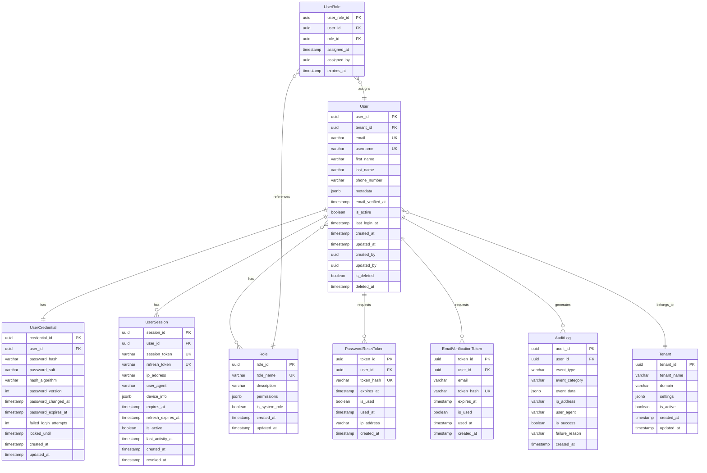
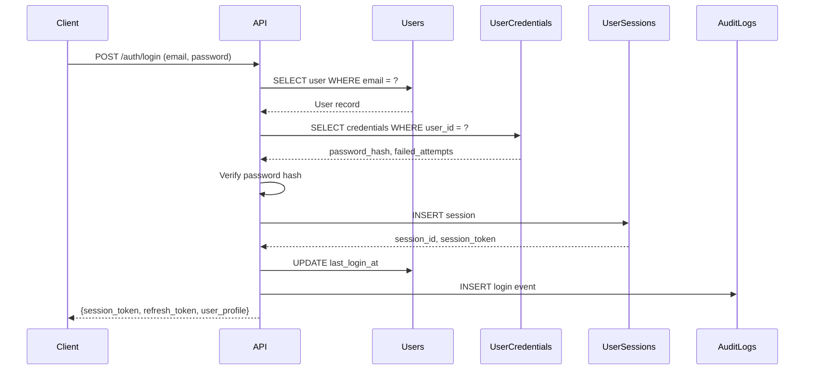

# Gate 1: Data Model Architecture - SUMA Finance User Registration & Authentication

## 1. Data Model Overview

### Data Modeling Approach
- **Primary Approach**: Relational (RDBMS)
- **Technology Stack**: PostgreSQL 15+
- **Rationale**: 
  - Strong ACID guarantees for user authentication data
  - Mature authentication patterns in relational databases
  - Row-level security (RLS) support for multi-tenancy
  - JSONB support for flexible metadata without sacrificing query performance

### Entity-Relationship Model Overview
The user registration and authentication system uses a normalized relational model with the following core entities:
- **User**: Central entity representing a registered user
- **UserCredential**: Authentication credentials (password hash, salts)
- **UserSession**: Active user sessions and refresh tokens
- **UserRole**: Role-based access control
- **PasswordResetToken**: Time-limited password reset tokens
- **EmailVerificationToken**: Email verification tokens
- **AuditLog**: Complete audit trail of authentication events

### Domain Model vs Persistence Model
- **Domain Model**: Rich User aggregate with embedded value objects (Email, Password, UserProfile)
- **Persistence Model**: Normalized tables with foreign keys for data integrity
- **Mapping**: Application layer handles transformation between domain and persistence models

### ER Diagram



## 2. Entity Definitions

### 2.1 User Entity

**Purpose**: Central entity representing a registered user in the system

**Lifecycle**: Created → Email Verified → Active → Deactivated/Deleted

#### Attributes

| Attribute | Type | Constraints | Description |
|-----------|------|-------------|-------------|
| user_id | UUID | PRIMARY KEY, NOT NULL, DEFAULT gen_random_uuid() | Unique user identifier |
| tenant_id | UUID | NOT NULL, FOREIGN KEY | Multi-tenant isolation |
| email | VARCHAR(255) | NOT NULL, UNIQUE | User email address |
| username | VARCHAR(50) | UNIQUE | Optional username for login |
| first_name | VARCHAR(100) | NOT NULL | User's first name |
| last_name | VARCHAR(100) | NOT NULL | User's last name |
| phone_number | VARCHAR(20) | | E.164 format phone number |
| metadata | JSONB | DEFAULT '{}' | Flexible user metadata |
| email_verified_at | TIMESTAMP WITH TIME ZONE | | Email verification timestamp |
| is_active | BOOLEAN | NOT NULL, DEFAULT true | Account active status |
| last_login_at | TIMESTAMP WITH TIME ZONE | | Last successful login |
| created_at | TIMESTAMP WITH TIME ZONE | NOT NULL, DEFAULT now() | Record creation timestamp |
| updated_at | TIMESTAMP WITH TIME ZONE | NOT NULL, DEFAULT now() | Last update timestamp |
| created_by | UUID | | User who created this record |
| updated_by | UUID | | User who last updated |
| is_deleted | BOOLEAN | NOT NULL, DEFAULT false | Soft delete flag |
| deleted_at | TIMESTAMP WITH TIME ZONE | | Soft delete timestamp |

#### Primary Key
- **Type**: Surrogate key (UUID)
- **Rationale**: 
  - UUIDs prevent enumeration attacks
  - Globally unique for distributed systems
  - No collision risk across tenants

#### Entity Metadata
- **Audit Fields**: created_at, updated_at, created_by, updated_by
- **Soft Delete**: is_deleted, deleted_at

#### Validation Rules
- Email must match RFC 5322 format
- Phone number must be E.164 format (if provided)
- email_verified_at must be NULL or >= created_at
- last_login_at must be >= created_at
- If is_deleted = true, deleted_at must be NOT NULL

#### Example Data

```sql
INSERT INTO users (user_id, tenant_id, email, username, first_name, last_name, phone_number, email_verified_at, is_active)
VALUES 
  ('550e8400-e29b-41d4-a716-446655440000', '650e8400-e29b-41d4-a716-446655440000', 
   'john.doe@example.com', 'johndoe', 'John', 'Doe', '+351912345678', 
   '2025-01-15T10:30:00Z', true);
```

---

### 2.2 UserCredential Entity

**Purpose**: Stores authentication credentials separate from user profile data for security

**Lifecycle**: Created with User → Updated on Password Change → Reset on Password Reset

#### Attributes

| Attribute | Type | Constraints | Description |
|-----------|------|-------------|-------------|
| credential_id | UUID | PRIMARY KEY, NOT NULL, DEFAULT gen_random_uuid() | Unique credential identifier |
| user_id | UUID | NOT NULL, UNIQUE, FOREIGN KEY | One-to-one with User |
| password_hash | VARCHAR(255) | NOT NULL | Hashed password (bcrypt/argon2) |
| password_salt | VARCHAR(255) | NOT NULL | Unique salt per password |
| hash_algorithm | VARCHAR(20) | NOT NULL, DEFAULT 'argon2id' | Hash algorithm identifier |
| password_version | INTEGER | NOT NULL, DEFAULT 1 | Password rotation version |
| password_changed_at | TIMESTAMP WITH TIME ZONE | NOT NULL, DEFAULT now() | Last password change |
| password_expires_at | TIMESTAMP WITH TIME ZONE | | Password expiration (optional) |
| failed_login_attempts | INTEGER | NOT NULL, DEFAULT 0 | Failed login counter |
| locked_until | TIMESTAMP WITH TIME ZONE | | Account lock timestamp |
| created_at | TIMESTAMP WITH TIME ZONE | NOT NULL, DEFAULT now() | Record creation timestamp |
| updated_at | TIMESTAMP WITH TIME ZONE | NOT NULL, DEFAULT now() | Last update timestamp |

#### Primary Key
- **Type**: Surrogate key (UUID)

#### Validation Rules
- password_hash must be minimum 60 characters (bcrypt) or 97 characters (argon2)
- hash_algorithm must be one of: 'bcrypt', 'argon2id', 'argon2i'
- failed_login_attempts must be >= 0 and <= 10
- locked_until must be > now() if set
- password_version increments on each password change

#### Example Data

```sql
INSERT INTO user_credentials (credential_id, user_id, password_hash, password_salt, hash_algorithm, password_changed_at)
VALUES 
  ('660e8400-e29b-41d4-a716-446655440000', '550e8400-e29b-41d4-a716-446655440000',
   '$argon2id$v=19$m=65536,t=3,p=4$c2FsdHNhbHRzYWx0$hash...', 
   'unique_salt_12345', 'argon2id', '2025-01-15T10:30:00Z');
```

---

### 2.3 UserSession Entity

**Purpose**: Manages active user sessions and refresh tokens for stateful authentication

**Lifecycle**: Created on Login → Active → Expired/Revoked

#### Attributes

| Attribute | Type | Constraints | Description |
|-----------|------|-------------|-------------|
| session_id | UUID | PRIMARY KEY, NOT NULL, DEFAULT gen_random_uuid() | Unique session identifier |
| user_id | UUID | NOT NULL, FOREIGN KEY | User owning the session |
| session_token | VARCHAR(255) | NOT NULL, UNIQUE | JWT or session token |
| refresh_token | VARCHAR(255) | UNIQUE | Refresh token for renewal |
| ip_address | VARCHAR(45) | NOT NULL | Client IP (IPv4 or IPv6) |
| user_agent | VARCHAR(500) | | Client user agent string |
| device_info | JSONB | DEFAULT '{}' | Device metadata |
| expires_at | TIMESTAMP WITH TIME ZONE | NOT NULL | Session expiration |
| refresh_expires_at | TIMESTAMP WITH TIME ZONE | | Refresh token expiration |
| is_active | BOOLEAN | NOT NULL, DEFAULT true | Session active status |
| last_activity_at | TIMESTAMP WITH TIME ZONE | NOT NULL, DEFAULT now() | Last activity timestamp |
| created_at | TIMESTAMP WITH TIME ZONE | NOT NULL, DEFAULT now() | Session creation timestamp |
| revoked_at | TIMESTAMP WITH TIME ZONE | | Session revocation timestamp |

#### Primary Key
- **Type**: Surrogate key (UUID)

#### Validation Rules
- expires_at must be > created_at
- refresh_expires_at must be > expires_at
- last_activity_at must be >= created_at and <= now()
- If is_active = false, revoked_at must be NOT NULL
- session_token must be JWT format or minimum 32 characters

#### Example Data

```sql
INSERT INTO user_sessions (session_id, user_id, session_token, refresh_token, ip_address, user_agent, expires_at, refresh_expires_at)
VALUES 
  ('770e8400-e29b-41d4-a716-446655440000', '550e8400-e29b-41d4-a716-446655440000',
   'eyJhbGciOiJIUzI1NiIsInR5cCI6IkpXVCJ9...', 'refresh_token_abc123...',
   '192.168.1.100', 'Mozilla/5.0 (Windows NT 10.0; Win64; x64)', 
   '2025-01-15T12:30:00Z', '2025-01-22T10:30:00Z');
```

---

### 2.4 Role Entity

**Purpose**: Defines available roles and permissions for RBAC

**Lifecycle**: Created → Active (System roles are immutable)

#### Attributes

| Attribute | Type | Constraints | Description |
|-----------|------|-------------|-------------|
| role_id | UUID | PRIMARY KEY, NOT NULL, DEFAULT gen_random_uuid() | Unique role identifier |
| role_name | VARCHAR(50) | NOT NULL, UNIQUE | Role name (e.g., 'admin', 'user') |
| description | VARCHAR(255) | | Role description |
| permissions | JSONB | NOT NULL, DEFAULT '[]' | Array of permission strings |
| is_system_role | BOOLEAN | NOT NULL, DEFAULT false | System role flag (immutable) |
| created_at | TIMESTAMP WITH TIME ZONE | NOT NULL, DEFAULT now() | Record creation timestamp |
| updated_at | TIMESTAMP WITH TIME ZONE | NOT NULL, DEFAULT now() | Last update timestamp |

#### Primary Key
- **Type**: Surrogate key (UUID)

#### Validation Rules
- role_name must be lowercase alphanumeric with underscores
- permissions must be valid JSON array
- is_system_role cannot be changed after creation

#### Example Data

```sql
INSERT INTO roles (role_id, role_name, description, permissions, is_system_role)
VALUES 
  ('880e8400-e29b-41d4-a716-446655440000', 'admin', 'System Administrator',
   '["user:read", "user:write", "user:delete", "role:manage"]'::jsonb, true),
  ('890e8400-e29b-41d4-a716-446655440000', 'user', 'Standard User',
   '["user:read_self", "user:update_self"]'::jsonb, true);
```

---

### 2.5 UserRole Entity (Junction Table)

**Purpose**: Many-to-many relationship between users and roles

**Lifecycle**: Assigned → Active → Expired/Removed

#### Attributes

| Attribute | Type | Constraints | Description |
|-----------|------|-------------|-------------|
| user_role_id | UUID | PRIMARY KEY, NOT NULL, DEFAULT gen_random_uuid() | Unique assignment identifier |
| user_id | UUID | NOT NULL, FOREIGN KEY | User receiving the role |
| role_id | UUID | NOT NULL, FOREIGN KEY | Role being assigned |
| assigned_at | TIMESTAMP WITH TIME ZONE | NOT NULL, DEFAULT now() | Assignment timestamp |
| assigned_by | UUID | FOREIGN KEY | User who assigned the role |
| expires_at | TIMESTAMP WITH TIME ZONE | | Optional role expiration |

#### Composite Unique Constraint
- UNIQUE (user_id, role_id) for active assignments

#### Validation Rules
- expires_at must be > assigned_at if set
- Cannot assign expired roles (expires_at <= now())

#### Example Data

```sql
INSERT INTO user_roles (user_role_id, user_id, role_id, assigned_by)
VALUES 
  ('990e8400-e29b-41d4-a716-446655440000', '550e8400-e29b-41d4-a716-446655440000',
   '890e8400-e29b-41d4-a716-446655440000', '550e8400-e29b-41d4-a716-446655440000');
```

---

### 2.6 PasswordResetToken Entity

**Purpose**: Temporary tokens for password reset flow

**Lifecycle**: Created → Used/Expired

#### Attributes

| Attribute | Type | Constraints | Description |
|-----------|------|-------------|-------------|
| token_id | UUID | PRIMARY KEY, NOT NULL, DEFAULT gen_random_uuid() | Unique token identifier |
| user_id | UUID | NOT NULL, FOREIGN KEY | User requesting reset |
| token_hash | VARCHAR(255) | NOT NULL, UNIQUE | Hashed reset token |
| expires_at | TIMESTAMP WITH TIME ZONE | NOT NULL | Token expiration (15-60 min) |
| is_used | BOOLEAN | NOT NULL, DEFAULT false | Token usage flag |
| used_at | TIMESTAMP WITH TIME ZONE | | Token usage timestamp |
| ip_address | VARCHAR(45) | NOT NULL | Request origin IP |
| created_at | TIMESTAMP WITH TIME ZONE | NOT NULL, DEFAULT now() | Token creation timestamp |

#### Primary Key
- **Type**: Surrogate key (UUID)

#### Validation Rules
- expires_at must be between created_at + 15 minutes and created_at + 60 minutes
- If is_used = true, used_at must be NOT NULL
- token_hash must be minimum 64 characters (SHA-256 hex)

#### Example Data

```sql
INSERT INTO password_reset_tokens (token_id, user_id, token_hash, expires_at, ip_address)
VALUES 
  ('aa0e8400-e29b-41d4-a716-446655440000', '550e8400-e29b-41d4-a716-446655440000',
   'sha256_hash_of_token_here_64_chars...', '2025-01-15T11:00:00Z', '192.168.1.100');
```

---

### 2.7 EmailVerificationToken Entity

**Purpose**: Email verification tokens for new registrations or email changes

**Lifecycle**: Created → Used/Expired

#### Attributes

| Attribute | Type | Constraints | Description |
|-----------|------|-------------|-------------|
| token_id | UUID | PRIMARY KEY, NOT NULL, DEFAULT gen_random_uuid() | Unique token identifier |
| user_id | UUID | NOT NULL, FOREIGN KEY | User verifying email |
| email | VARCHAR(255) | NOT NULL | Email being verified |
| token_hash | VARCHAR(255) | NOT NULL, UNIQUE | Hashed verification token |
| expires_at | TIMESTAMP WITH TIME ZONE | NOT NULL | Token expiration (24-72 hours) |
| is_used | BOOLEAN | NOT NULL, DEFAULT false | Token usage flag |
| used_at | TIMESTAMP WITH TIME ZONE | | Token usage timestamp |
| created_at | TIMESTAMP WITH TIME ZONE | NOT NULL, DEFAULT now() | Token creation timestamp |

#### Primary Key
- **Type**: Surrogate key (UUID)

#### Validation Rules
- expires_at must be between created_at + 24 hours and created_at + 72 hours
- If is_used = true, used_at must be NOT NULL and email must match user.email
- email must be valid RFC 5322 format

#### Example Data

```sql
INSERT INTO email_verification_tokens (token_id, user_id, email, token_hash, expires_at)
VALUES 
  ('bb0e8400-e29b-41d4-a716-446655440000', '550e8400-e29b-41d4-a716-446655440000',
   'john.doe@example.com', 'sha256_hash_of_token_here_64_chars...', '2025-01-16T10:30:00Z');
```

---

### 2.8 AuditLog Entity

**Purpose**: Complete audit trail of authentication and authorization events

**Lifecycle**: Append-only (never updated or deleted)

#### Attributes

| Attribute | Type | Constraints | Description |
|-----------|------|-------------|-------------|
| audit_id | UUID | PRIMARY KEY, NOT NULL, DEFAULT gen_random_uuid() | Unique audit entry identifier |
| user_id | UUID | FOREIGN KEY | User performing action (nullable for failed logins) |
| event_type | VARCHAR(50) | NOT NULL | Event type identifier |
| event_category | VARCHAR(20) | NOT NULL | Event category (AUTH, AUTHZ, PROFILE) |
| event_data | JSONB | DEFAULT '{}' | Event-specific data |
| ip_address | VARCHAR(45) | NOT NULL | Client IP address |
| user_agent | VARCHAR(500) | | Client user agent |
| is_success | BOOLEAN | NOT NULL | Event success flag |
| failure_reason | VARCHAR(255) | | Failure reason if unsuccessful |
| created_at | TIMESTAMP WITH TIME ZONE | NOT NULL, DEFAULT now() | Event timestamp |

#### Primary Key
- **Type**: Surrogate key (UUID)

#### Validation Rules
- event_category must be one of: 'AUTH', 'AUTHZ', 'PROFILE', 'SECURITY'
- If is_success = false, failure_reason must be NOT NULL
- event_type examples: 'login', 'logout', 'password_change', 'role_assigned'

#### Example Data

```sql
INSERT INTO audit_logs (audit_id, user_id, event_type, event_category, event_data, ip_address, is_success)
VALUES 
  ('cc0e8400-e29b-41d4-a716-446655440000', '550e8400-e29b-41d4-a716-446655440000',
   'login', 'AUTH', '{"method": "email_password", "mfa": false}'::jsonb, 
   '192.168.1.100', true);
```

---

### 2.9 Tenant Entity

**Purpose**: Multi-tenant isolation and tenant-specific settings

**Lifecycle**: Created → Active → Deactivated

#### Attributes

| Attribute | Type | Constraints | Description |
|-----------|------|-------------|-------------|
| tenant_id | UUID | PRIMARY KEY, NOT NULL, DEFAULT gen_random_uuid() | Unique tenant identifier |
| tenant_name | VARCHAR(100) | NOT NULL, UNIQUE | Tenant name |
| domain | VARCHAR(255) | UNIQUE | Tenant domain (e.g., acme.suma.com) |
| settings | JSONB | DEFAULT '{}' | Tenant-specific settings |
| is_active | BOOLEAN | NOT NULL, DEFAULT true | Tenant active status |
| created_at | TIMESTAMP WITH TIME ZONE | NOT NULL, DEFAULT now() | Tenant creation timestamp |
| updated_at | TIMESTAMP WITH TIME ZONE | NOT NULL, DEFAULT now() | Last update timestamp |

#### Primary Key
- **Type**: Surrogate key (UUID)

#### Validation Rules
- domain must be valid DNS format if provided
- settings may contain: password_policy, session_timeout, mfa_required, etc.

#### Example Data

```sql
INSERT INTO tenants (tenant_id, tenant_name, domain, settings)
VALUES 
  ('650e8400-e29b-41d4-a716-446655440000', 'ACME Corporation', 'acme.suma.com',
   '{"password_policy": {"min_length": 12, "require_special": true}, "mfa_required": false}'::jsonb);
```

---

## 3. Relationships

### 3.1 One-to-One Relationships

#### User ↔ UserCredential
- **Description**: Each user has exactly one set of credentials
- **Foreign Key**: `user_credentials.user_id` → `users.user_id`
- **Cascading Behavior**: 
  - ON DELETE CASCADE (delete credentials when user deleted)
  - ON UPDATE CASCADE
- **Rationale**: Separation of concerns - profile data separate from authentication secrets

### 3.2 One-to-Many Relationships

#### User → UserSession
- **Description**: Each user can have multiple active sessions (multi-device support)
- **Foreign Key**: `user_sessions.user_id` → `users.user_id`
- **Cascading Behavior**: 
  - ON DELETE CASCADE (revoke all sessions when user deleted)
  - ON UPDATE CASCADE
- **Cardinality**: 1 user : 0..N sessions

#### User → PasswordResetToken
- **Description**: Each user can request multiple password reset tokens (previous ones expire)
- **Foreign Key**: `password_reset_tokens.user_id` → `users.user_id`
- **Cascading Behavior**: 
  - ON DELETE CASCADE
  - ON UPDATE CASCADE
- **Cardinality**: 1 user : 0..N tokens

#### User → EmailVerificationToken
- **Description**: Each user can have multiple email verification tokens (resend, email change)
- **Foreign Key**: `email_verification_tokens.user_id` → `users.user_id`
- **Cascading Behavior**: 
  - ON DELETE CASCADE
  - ON UPDATE CASCADE
- **Cardinality**: 1 user : 0..N tokens

#### User → AuditLog
- **Description**: Each user generates multiple audit log entries
- **Foreign Key**: `audit_logs.user_id` → `users.user_id`
- **Cascading Behavior**: 
  - ON DELETE SET NULL (preserve audit logs even after user deletion)
  - ON UPDATE CASCADE
- **Cardinality**: 1 user : 0..N audit entries

#### Tenant → User
- **Description**: Each tenant has multiple users
- **Foreign Key**: `users.tenant_id` → `tenants.tenant_id`
- **Cascading Behavior**: 
  - ON DELETE RESTRICT (cannot delete tenant with users)
  - ON UPDATE CASCADE
- **Cardinality**: 1 tenant : 0..N users

### 3.3 Many-to-Many Relationships

#### User ↔ Role (via UserRole)
- **Description**: Users can have multiple roles, roles can be assigned to multiple users
- **Junction Table**: `user_roles`
- **Foreign Keys**:
  - `user_roles.user_id` → `users.user_id` (ON DELETE CASCADE)
  - `user_roles.role_id` → `roles.role_id` (ON DELETE RESTRICT - cannot delete assigned roles)
- **Composite Primary Key**: (user_role_id as surrogate, UNIQUE constraint on user_id + role_id)
- **Additional Attributes**: assigned_at, assigned_by, expires_at
- **Cardinality**: M users : N roles

### 3.4 Self-Referencing Relationships

#### User → User (created_by, updated_by, assigned_by)
- **Description**: Tracks which users performed administrative actions
- **Foreign Keys**:
  - `users.created_by` → `users.user_id`
  - `users.updated_by` → `users.user_id`
  - `user_roles.assigned_by` → `users.user_id`
- **Cascading Behavior**: ON DELETE SET NULL
- **Rationale**: Preserve audit trail even if admin user is deleted

### 3.5 Relationship Cardinality Summary

| Relationship | Type | Cardinality | Mandatory |
|--------------|------|-------------|-----------|
| User → UserCredential | One-to-One | 1:1 | Yes (user must have credentials) |
| User → UserSession | One-to-Many | 1:N | No (user may have no active sessions) |
| User → PasswordResetToken | One-to-Many | 1:N | No |
| User → EmailVerificationToken | One-to-Many | 1:N | No |
| User → AuditLog | One-to-Many | 1:N | No |
| Tenant → User | One-to-Many | 1:N | No (tenant may have no users yet) |
| User ↔ Role | Many-to-Many | M:N | Yes (user must have at least one role) |

---

## 4. Domain Model Design

### 4.1 Aggregates and Aggregate Roots

#### User Aggregate
- **Aggregate Root**: User entity
- **Aggregate Members**: 
  - UserCredential (value object in domain, separate table in persistence)
  - UserSessions (collection)
  - UserRoles (collection)
- **Transactional Boundary**: All changes to user credentials, active sessions, and role assignments go through the User aggregate
- **Consistency Rule**: Password changes must invalidate all active sessions atomically

#### Tenant Aggregate
- **Aggregate Root**: Tenant entity
- **Aggregate Members**: Users (collection)
- **Transactional Boundary**: Tenant settings changes are independent of user operations
- **Consistency Rule**: Tenant-level password policies apply to all users in tenant

### 4.2 Value Objects

#### Email (Value Object)
- **Properties**: address (string)
- **Validation**: RFC 5322 format
- **Immutability**: Changing email creates new value object
- **Persistence**: Embedded in User table as VARCHAR column

#### Password (Value Object)
- **Properties**: hash, salt, algorithm, version
- **Validation**: Minimum length, complexity requirements from tenant policy
- **Immutability**: Password changes create new value object
- **Persistence**: Separate UserCredential table

#### SessionToken (Value Object)
- **Properties**: token (JWT string), expiration
- **Validation**: JWT signature validation
- **Immutability**: Tokens cannot be modified, only created or revoked
- **Persistence**: Embedded in UserSession table

#### IPAddress (Value Object)
- **Properties**: address (string), version (IPv4/IPv6)
- **Validation**: Valid IP format
- **Persistence**: VARCHAR(45) to support both IPv4 and IPv6

#### PhoneNumber (Value Object)
- **Properties**: number (E.164 format), country_code
- **Validation**: E.164 format validation
- **Persistence**: VARCHAR(20) in User table

### 4.3 Domain Events

#### UserRegistered
```json
{
  "event_type": "UserRegistered",
  "aggregate_id": "user_id",
  "timestamp": "2025-01-15T10:30:00Z",
  "data": {
    "user_id": "uuid",
    "tenant_id": "uuid",
    "email": "string",
    "registration_method": "email_password|oauth|sso"
  }
}
```

#### EmailVerified
```json
{
  "event_type": "EmailVerified",
  "aggregate_id": "user_id",
  "timestamp": "2025-01-15T10:35:00Z",
  "data": {
    "user_id": "uuid",
    "email": "string",
    "verified_at": "timestamp"
  }
}
```

#### PasswordChanged
```json
{
  "event_type": "PasswordChanged",
  "aggregate_id": "user_id",
  "timestamp": "2025-01-20T14:00:00Z",
  "data": {
    "user_id": "uuid",
    "password_version": 2,
    "sessions_invalidated": 3,
    "changed_by": "user|admin"
  }
}
```

#### UserLoggedIn
```json
{
  "event_type": "UserLoggedIn",
  "aggregate_id": "user_id",
  "timestamp": "2025-01-15T11:00:00Z",
  "data": {
    "user_id": "uuid",
    "session_id": "uuid",
    "ip_address": "string",
    "device_info": {}
  }
}
```

#### RoleAssigned
```json
{
  "event_type": "RoleAssigned",
  "aggregate_id": "user_id",
  "timestamp": "2025-01-15T12:00:00Z",
  "data": {
    "user_id": "uuid",
    "role_id": "uuid",
    "role_name": "string",
    "assigned_by": "uuid"
  }
}
```

---

## 5. Data Types and Formats

### 5.1 Primitive Types

| Use Case | PostgreSQL Type | Size | Rationale |
|----------|----------------|------|-----------|
| Unique Identifiers | UUID | 16 bytes | Globally unique, non-enumerable |
| Email Address | VARCHAR(255) | Variable | RFC 5322 max email length |
| Username | VARCHAR(50) | Variable | Standard username length |
| Names (First/Last) | VARCHAR(100) | Variable | Accommodate international names |
| Phone Number | VARCHAR(20) | Variable | E.164 format (+123456789012345) |
| Password Hash | VARCHAR(255) | Variable | Argon2/bcrypt output |
| Hashed Tokens | VARCHAR(255) | Variable | SHA-256 hex output (64 chars) + prefix |
| IP Address | VARCHAR(45) | Variable | IPv6 max length (8 groups × 4 hex + 7 colons) |
| User Agent | VARCHAR(500) | Variable | Modern user agent strings |
| Booleans | BOOLEAN | 1 byte | True/false flags |
| Counters | INTEGER | 4 bytes | Failed login attempts, version numbers |
| Timestamps | TIMESTAMP WITH TIME ZONE | 8 bytes | ISO 8601 with timezone |

### 5.2 Complex Types

#### JSONB for Semi-Structured Data

**User Metadata**
```json
{
  "preferences": {
    "language": "en",
    "timezone": "Europe/Lisbon",
    "theme": "dark"
  },
  "profile": {
    "avatar_url": "https://cdn.suma.com/avatars/user123.jpg",
    "bio": "Finance enthusiast"
  },
  "kyc": {
    "verified": false,
    "verification_level": 0
  }
}
```

**Device Info**
```json
{
  "device_type": "mobile",
  "os": "iOS",
  "os_version": "17.2",
  "app_version": "1.2.3",
  "device_id": "device_fingerprint_hash"
}
```

**Tenant Settings**
```json
{
  "password_policy": {
    "min_length": 12,
    "require_uppercase": true,
    "require_lowercase": true,
    "require_number": true,
    "require_special": true,
    "expiry_days": 90
  },
  "session_policy": {
    "session_timeout_minutes": 30,
    "refresh_timeout_days": 7,
    "max_concurrent_sessions": 5
  },
  "mfa": {
    "required": false,
    "methods": ["totp", "sms"]
  }
}
```

**Role Permissions (Array of Strings)**
```json
[
  "user:read",
  "user:write",
  "user:delete",
  "role:read",
  "role:assign",
  "audit:read"
]
```

**Audit Log Event Data**
```json
{
  "method": "email_password",
  "mfa_used": false,
  "previous_login": "2025-01-14T18:00:00Z",
  "login_duration_ms": 234
}
```

### 5.3 Custom Types (PostgreSQL ENUMs)

```sql
-- Event categories for audit logging
CREATE TYPE event_category AS ENUM ('AUTH', 'AUTHZ', 'PROFILE', 'SECURITY');

-- Hash algorithms
CREATE TYPE hash_algorithm AS ENUM ('bcrypt', 'argon2id', 'argon2i');
```

### 5.4 Data Format Standards

| Data Type | Format | Example | Validation |
|-----------|--------|---------|------------|
| Email | RFC 5322 | john.doe@example.com | Regex: `^[a-zA-Z0-9._%+-]+@[a-zA-Z0-9.-]+\.[a-zA-Z]{2,}$` |
| Phone | E.164 | +351912345678 | Regex: `^\+[1-9]\d{1,14}$` |
| Timestamp | ISO 8601 with TZ | 2025-01-15T10:30:00Z | PostgreSQL TIMESTAMPTZ |
| UUID | RFC 4122 v4 | 550e8400-e29b-41d4-a716-446655440000 | PostgreSQL UUID type |
| IP Address | IPv4/IPv6 | 192.168.1.100 or 2001:0db8::1 | inet_pton validation |
| Password Hash | Argon2id | $argon2id$v=19$m=65536,t=3,p=4$... | Length >= 97 characters |
| JWT Token | RFC 7519 | eyJhbGciOiJIUzI1NiIsInR5cCI6IkpXVCJ9... | JWT signature validation |

---

## 6. Normalization and Denormalization

### 6.1 Normalization Levels

#### Third Normal Form (3NF) Application

**Users Table - 3NF Compliance**
- ✅ **1NF**: All attributes atomic (no repeating groups)
- ✅ **2NF**: All non-key attributes fully dependent on primary key
- ✅ **3NF**: No transitive dependencies
  - email, first_name, last_name depend only on user_id
  - tenant_id is a foreign key (not a transitive dependency)

**UserCredential Separated - 3NF**
- **Rationale**: Password hash, salt, algorithm depend on user but are functionally separate concerns
- **Benefit**: Security isolation, credential updates don't lock user table

**UserRole Junction Table - 3NF**
- **Rationale**: Eliminates multi-valued dependency (user_id → role_id would violate 1NF)
- **Benefit**: Flexible role assignment, role changes don't affect user records

#### Boyce-Codd Normal Form (BCNF)
- **All tables meet BCNF**: Every determinant is a candidate key
- **Example**: `user_sessions.session_token` is a candidate key (unique), could be alternate primary key

### 6.2 Denormalization for Performance

#### Computed/Cached Fields in User Table

**last_login_at (Denormalized)**
- **Source**: Latest `user_sessions.created_at` for the user
- **Rationale**: Avoid expensive MAX() aggregation query on sessions table
- **Update Strategy**: Trigger on user_sessions INSERT
- **Trade-off**: Slight write overhead for significant read performance gain

**Example Trigger**:
```sql
CREATE OR REPLACE FUNCTION update_last_login() 
RETURNS TRIGGER AS $$
BEGIN
  UPDATE users 
  SET last_login_at = NEW.created_at,
      updated_at = now()
  WHERE user_id = NEW.user_id;
  RETURN NEW;
END;
$$ LANGUAGE plpgsql;

CREATE TRIGGER trigger_update_last_login
AFTER INSERT ON user_sessions
FOR EACH ROW
EXECUTE FUNCTION update_last_login();
```

#### Materialized Views (Future Optimization)

**User Statistics View** (Not initially implemented, but planned)
```sql
CREATE MATERIALIZED VIEW user_statistics AS
SELECT 
  u.user_id,
  u.email,
  COUNT(DISTINCT s.session_id) as total_sessions,
  COUNT(DISTINCT al.audit_id) FILTER (WHERE al.event_type = 'login') as login_count,
  COUNT(DISTINCT al.audit_id) FILTER (WHERE al.is_success = false) as failed_login_count
FROM users u
LEFT JOIN user_sessions s ON u.user_id = s.user_id
LEFT JOIN audit_logs al ON u.user_id = al.user_id
GROUP BY u.user_id, u.email;

-- Refresh strategy: Hourly or on-demand
REFRESH MATERIALIZED VIEW CONCURRENTLY user_statistics;
```

**Rationale**: Admin dashboards need user statistics without expensive aggregations
**Trade-off**: Statistics may be slightly stale (eventual consistency)

### 6.3 Normalization Trade-offs

| Decision | Normalized Approach | Denormalized Approach | Chosen | Rationale |
|----------|---------------------|------------------------|--------|-----------|
| User last login | Join to user_sessions, MAX(created_at) | last_login_at in users table | Denormalized | Last login displayed on every user query |
| Role permissions | Separate permissions table | JSONB array in roles | Denormalized (JSONB) | Permissions queried with role, not independently |
| Session device info | Separate device table | JSONB in user_sessions | Denormalized (JSONB) | Device info is session-specific, not reused |
| Audit log data | Normalize event_type, category into lookup tables | VARCHAR + JSONB | Partially normalized | event_category as ENUM, event_data as JSONB |
| User full name | Computed from first_name + last_name | Stored full_name column | Normalized | Simple concatenation, no need to store |

---

## 7. Data Integrity Constraints

### 7.1 NOT NULL Constraints

```sql
-- Users table
ALTER TABLE users
  ALTER COLUMN user_id SET NOT NULL,
  ALTER COLUMN tenant_id SET NOT NULL,
  ALTER COLUMN email SET NOT NULL,
  ALTER COLUMN first_name SET NOT NULL,
  ALTER COLUMN last_name SET NOT NULL,
  ALTER COLUMN is_active SET NOT NULL,
  ALTER COLUMN created_at SET NOT NULL,
  ALTER COLUMN updated_at SET NOT NULL,
  ALTER COLUMN is_deleted SET NOT NULL;

-- UserCredentials table
ALTER TABLE user_credentials
  ALTER COLUMN credential_id SET NOT NULL,
  ALTER COLUMN user_id SET NOT NULL,
  ALTER COLUMN password_hash SET NOT NULL,
  ALTER COLUMN password_salt SET NOT NULL,
  ALTER COLUMN hash_algorithm SET NOT NULL,
  ALTER COLUMN password_version SET NOT NULL,
  ALTER COLUMN failed_login_attempts SET NOT NULL;
```

### 7.2 UNIQUE Constraints

```sql
-- Users table
ALTER TABLE users
  ADD CONSTRAINT uq_users_email UNIQUE (email),
  ADD CONSTRAINT uq_users_username UNIQUE (username);

-- UserCredential table
ALTER TABLE user_credentials
  ADD CONSTRAINT uq_user_credentials_user_id UNIQUE (user_id);

-- UserSessions table
ALTER TABLE user_sessions
  ADD CONSTRAINT uq_user_sessions_session_token UNIQUE (session_token),
  ADD CONSTRAINT uq_user_sessions_refresh_token UNIQUE (refresh_token);

-- Roles table
ALTER TABLE roles
  ADD CONSTRAINT uq_roles_role_name UNIQUE (role_name);

-- UserRole composite unique (prevent duplicate role assignments)
ALTER TABLE user_roles
  ADD CONSTRAINT uq_user_roles_user_role UNIQUE (user_id, role_id);

-- Tokens
ALTER TABLE password_reset_tokens
  ADD CONSTRAINT uq_password_reset_tokens_token_hash UNIQUE (token_hash);

ALTER TABLE email_verification_tokens
  ADD CONSTRAINT uq_email_verification_tokens_token_hash UNIQUE (token_hash);

-- Tenants
ALTER TABLE tenants
  ADD CONSTRAINT uq_tenants_tenant_name UNIQUE (tenant_name),
  ADD CONSTRAINT uq_tenants_domain UNIQUE (domain);
```

### 7.3 CHECK Constraints

```sql
-- Users table
ALTER TABLE users
  ADD CONSTRAINT chk_users_email_format 
    CHECK (email ~* '^[A-Za-z0-9._%+-]+@[A-Za-z0-9.-]+\.[A-Za-z]{2,}$'),
  ADD CONSTRAINT chk_users_phone_format 
    CHECK (phone_number IS NULL OR phone_number ~ '^\+[1-9]\d{1,14}$'),
  ADD CONSTRAINT chk_users_email_verified_after_created 
    CHECK (email_verified_at IS NULL OR email_verified_at >= created_at),
  ADD CONSTRAINT chk_users_last_login_after_created 
    CHECK (last_login_at IS NULL OR last_login_at >= created_at),
  ADD CONSTRAINT chk_users_deleted_timestamp 
    CHECK ((is_deleted = false AND deleted_at IS NULL) OR (is_deleted = true AND deleted_at IS NOT NULL));

-- UserCredentials table
ALTER TABLE user_credentials
  ADD CONSTRAINT chk_user_credentials_password_hash_length 
    CHECK (length(password_hash) >= 60),
  ADD CONSTRAINT chk_user_credentials_failed_attempts 
    CHECK (failed_login_attempts >= 0 AND failed_login_attempts <= 10),
  ADD CONSTRAINT chk_user_credentials_password_version 
    CHECK (password_version >= 1),
  ADD CONSTRAINT chk_user_credentials_locked_until_future 
    CHECK (locked_until IS NULL OR locked_until > password_changed_at);

-- UserSessions table
ALTER TABLE user_sessions
  ADD CONSTRAINT chk_user_sessions_expires_after_created 
    CHECK (expires_at > created_at),
  ADD CONSTRAINT chk_user_sessions_refresh_after_expires 
    CHECK (refresh_expires_at IS NULL OR refresh_expires_at > expires_at),
  ADD CONSTRAINT chk_user_sessions_last_activity 
    CHECK (last_activity_at >= created_at),
  ADD CONSTRAINT chk_user_sessions_revoked_inactive 
    CHECK ((is_active = true AND revoked_at IS NULL) OR (is_active = false AND revoked_at IS NOT NULL));

-- UserRoles table
ALTER TABLE user_roles
  ADD CONSTRAINT chk_user_roles_expires_after_assigned 
    CHECK (expires_at IS NULL OR expires_at > assigned_at);

-- PasswordResetTokens table
ALTER TABLE password_reset_tokens
  ADD CONSTRAINT chk_password_reset_tokens_expires_range 
    CHECK (expires_at > created_at AND expires_at <= created_at + INTERVAL '60 minutes'),
  ADD CONSTRAINT chk_password_reset_tokens_used 
    CHECK ((is_used = false AND used_at IS NULL) OR (is_used = true AND used_at IS NOT NULL)),
  ADD CONSTRAINT chk_password_reset_tokens_token_hash_length 
    CHECK (length(token_hash) >= 64);

-- EmailVerificationTokens table
ALTER TABLE email_verification_tokens
  ADD CONSTRAINT chk_email_verification_tokens_expires_range 
    CHECK (expires_at > created_at AND expires_at <= created_at + INTERVAL '72 hours'),
  ADD CONSTRAINT chk_email_verification_tokens_used 
    CHECK ((is_used = false AND used_at IS NULL) OR (is_used = true AND used_at IS NOT NULL)),
  ADD CONSTRAINT chk_email_verification_tokens_token_hash_length 
    CHECK (length(token_hash) >= 64);

-- AuditLogs table
ALTER TABLE audit_logs
  ADD CONSTRAINT chk_audit_logs_failure_reason 
    CHECK ((is_success = true AND failure_reason IS NULL) OR (is_success = false AND failure_reason IS NOT NULL));
```

### 7.4 FOREIGN KEY Constraints

```sql
-- Users table
ALTER TABLE users
  ADD CONSTRAINT fk_users_tenant 
    FOREIGN KEY (tenant_id) REFERENCES tenants(tenant_id)
    ON DELETE RESTRICT ON UPDATE CASCADE,
  ADD CONSTRAINT fk_users_created_by 
    FOREIGN KEY (created_by) REFERENCES users(user_id)
    ON DELETE SET NULL ON UPDATE CASCADE,
  ADD CONSTRAINT fk_users_updated_by 
    FOREIGN KEY (updated_by) REFERENCES users(user_id)
    ON DELETE SET NULL ON UPDATE CASCADE;

-- UserCredentials table
ALTER TABLE user_credentials
  ADD CONSTRAINT fk_user_credentials_user 
    FOREIGN KEY (user_id) REFERENCES users(user_id)
    ON DELETE CASCADE ON UPDATE CASCADE;

-- UserSessions table
ALTER TABLE user_sessions
  ADD CONSTRAINT fk_user_sessions_user 
    FOREIGN KEY (user_id) REFERENCES users(user_id)
    ON DELETE CASCADE ON UPDATE CASCADE;

-- UserRoles table
ALTER TABLE user_roles
  ADD CONSTRAINT fk_user_roles_user 
    FOREIGN KEY (user_id) REFERENCES users(user_id)
    ON DELETE CASCADE ON UPDATE CASCADE,
  ADD CONSTRAINT fk_user_roles_role 
    FOREIGN KEY (role_id) REFERENCES roles(role_id)
    ON DELETE RESTRICT ON UPDATE CASCADE,
  ADD CONSTRAINT fk_user_roles_assigned_by 
    FOREIGN KEY (assigned_by) REFERENCES users(user_id)
    ON DELETE SET NULL ON UPDATE CASCADE;

-- PasswordResetTokens table
ALTER TABLE password_reset_tokens
  ADD CONSTRAINT fk_password_reset_tokens_user 
    FOREIGN KEY (user_id) REFERENCES users(user_id)
    ON DELETE CASCADE ON UPDATE CASCADE;

-- EmailVerificationTokens table
ALTER TABLE email_verification_tokens
  ADD CONSTRAINT fk_email_verification_tokens_user 
    FOREIGN KEY (user_id) REFERENCES users(user_id)
    ON DELETE CASCADE ON UPDATE CASCADE;

-- AuditLogs table
ALTER TABLE audit_logs
  ADD CONSTRAINT fk_audit_logs_user 
    FOREIGN KEY (user_id) REFERENCES users(user_id)
    ON DELETE SET NULL ON UPDATE CASCADE;
```

**Cascading Behavior Rationale**:

| Relationship | ON DELETE | ON UPDATE | Rationale |
|--------------|-----------|-----------|-----------|
| users → tenant | RESTRICT | CASCADE | Cannot delete tenant with users |
| user_credentials → user | CASCADE | CASCADE | Delete credentials with user |
| user_sessions → user | CASCADE | CASCADE | Revoke sessions when user deleted |
| user_roles → user | CASCADE | CASCADE | Remove role assignments with user |
| user_roles → role | RESTRICT | CASCADE | Cannot delete role still assigned to users |
| audit_logs → user | SET NULL | CASCADE | Preserve audit trail even if user deleted |
| tokens → user | CASCADE | CASCADE | Delete tokens when user deleted |

### 7.5 DEFAULT Constraints

```sql
-- Users table
ALTER TABLE users
  ALTER COLUMN user_id SET DEFAULT gen_random_uuid(),
  ALTER COLUMN is_active SET DEFAULT true,
  ALTER COLUMN is_deleted SET DEFAULT false,
  ALTER COLUMN metadata SET DEFAULT '{}'::jsonb,
  ALTER COLUMN created_at SET DEFAULT now(),
  ALTER COLUMN updated_at SET DEFAULT now();

-- UserCredentials table
ALTER TABLE user_credentials
  ALTER COLUMN credential_id SET DEFAULT gen_random_uuid(),
  ALTER COLUMN hash_algorithm SET DEFAULT 'argon2id',
  ALTER COLUMN password_version SET DEFAULT 1,
  ALTER COLUMN failed_login_attempts SET DEFAULT 0,
  ALTER COLUMN created_at SET DEFAULT now(),
  ALTER COLUMN updated_at SET DEFAULT now();

-- UserSessions table
ALTER TABLE user_sessions
  ALTER COLUMN session_id SET DEFAULT gen_random_uuid(),
  ALTER COLUMN is_active SET DEFAULT true,
  ALTER COLUMN device_info SET DEFAULT '{}'::jsonb,
  ALTER COLUMN last_activity_at SET DEFAULT now(),
  ALTER COLUMN created_at SET DEFAULT now();

-- Roles table
ALTER TABLE roles
  ALTER COLUMN role_id SET DEFAULT gen_random_uuid(),
  ALTER COLUMN permissions SET DEFAULT '[]'::jsonb,
  ALTER COLUMN is_system_role SET DEFAULT false,
  ALTER COLUMN created_at SET DEFAULT now(),
  ALTER COLUMN updated_at SET DEFAULT now();

-- UserRoles table
ALTER TABLE user_roles
  ALTER COLUMN user_role_id SET DEFAULT gen_random_uuid(),
  ALTER COLUMN assigned_at SET DEFAULT now();

-- Tokens
ALTER TABLE password_reset_tokens
  ALTER COLUMN token_id SET DEFAULT gen_random_uuid(),
  ALTER COLUMN is_used SET DEFAULT false,
  ALTER COLUMN created_at SET DEFAULT now();

ALTER TABLE email_verification_tokens
  ALTER COLUMN token_id SET DEFAULT gen_random_uuid(),
  ALTER COLUMN is_used SET DEFAULT false,
  ALTER COLUMN created_at SET DEFAULT now();

-- AuditLogs table
ALTER TABLE audit_logs
  ALTER COLUMN audit_id SET DEFAULT gen_random_uuid(),
  ALTER COLUMN event_data SET DEFAULT '{}'::jsonb,
  ALTER COLUMN created_at SET DEFAULT now();

-- Tenants table
ALTER TABLE tenants
  ALTER COLUMN tenant_id SET DEFAULT gen_random_uuid(),
  ALTER COLUMN settings SET DEFAULT '{}'::jsonb,
  ALTER COLUMN is_active SET DEFAULT true,
  ALTER COLUMN created_at SET DEFAULT now(),
  ALTER COLUMN updated_at SET DEFAULT now();
```

---

## 8. Multi-Tenancy Data Model

### 8.1 Tenant Isolation Strategy

**Approach**: Shared database, shared schema with tenant_id column (Discriminator Column Pattern)

**Rationale**:
- ✅ **Cost-Effective**: Single database instance for all tenants
- ✅ **Simplified Maintenance**: Single schema, one migration path
- ✅ **Efficient Resource Usage**: Better utilization than separate databases
- ⚠️ **Security Requirement**: Strict row-level security (RLS) enforcement
- ⚠️ **Performance**: Tenant-specific indexes required

### 8.2 Tenant Identification

**tenant_id Column in All Tables**:
```sql
ALTER TABLE users ADD COLUMN tenant_id UUID NOT NULL;
ALTER TABLE user_sessions ADD COLUMN tenant_id UUID NOT NULL; -- Denormalized for RLS performance
ALTER TABLE audit_logs ADD COLUMN tenant_id UUID NOT NULL; -- Denormalized for RLS performance
```

**Row-Level Security (RLS) Policies**:
```sql
-- Enable RLS on users table
ALTER TABLE users ENABLE ROW LEVEL SECURITY;

-- Policy: Users can only see their own tenant's data
CREATE POLICY tenant_isolation_policy ON users
  USING (tenant_id = current_setting('app.current_tenant_id')::uuid);

-- Policy: Superadmin bypass (for system operations)
CREATE POLICY superadmin_bypass_policy ON users
  USING (current_setting('app.is_superadmin', true)::boolean = true);

-- Apply RLS to all tables
ALTER TABLE user_credentials ENABLE ROW LEVEL SECURITY;
ALTER TABLE user_sessions ENABLE ROW LEVEL SECURITY;
ALTER TABLE user_roles ENABLE ROW LEVEL SECURITY;
ALTER TABLE password_reset_tokens ENABLE ROW LEVEL SECURITY;
ALTER TABLE email_verification_tokens ENABLE ROW LEVEL SECURITY;
ALTER TABLE audit_logs ENABLE ROW LEVEL SECURITY;

-- Create similar policies for each table
```

**Application-Level Tenant Context**:
```sql
-- Set tenant context at connection level (application responsibility)
SET app.current_tenant_id = '650e8400-e29b-41d4-a716-446655440000';
SET app.is_superadmin = false;
```

### 8.3 Data Isolation

**Composite Indexes for Tenant Queries**:
```sql
-- Efficient tenant-scoped queries
CREATE INDEX idx_users_tenant_email ON users(tenant_id, email);
CREATE INDEX idx_users_tenant_id ON users(tenant_id) WHERE is_deleted = false;
CREATE INDEX idx_user_sessions_tenant_user ON user_sessions(tenant_id, user_id);
CREATE INDEX idx_audit_logs_tenant_created ON audit_logs(tenant_id, created_at DESC);
```

**Cross-Tenant Access Prevention**:
- RLS policies enforce tenant_id filtering on all queries
- Application layer validates tenant_id on all writes
- Foreign key constraints ensure referential integrity within tenant
- Audit logs track any superadmin cross-tenant access

**Tenant-Specific Data Partitioning (Future Optimization)**:
```sql
-- Partition audit_logs by tenant for large-scale deployments
CREATE TABLE audit_logs (
  -- columns...
) PARTITION BY LIST (tenant_id);

-- Create partition per tenant (automated by migration)
CREATE TABLE audit_logs_tenant_650e8400 
  PARTITION OF audit_logs 
  FOR VALUES IN ('650e8400-e29b-41d4-a716-446655440000');
```

---

## 9. Temporal Data and Versioning

### 9.1 Audit Trail

**Created and Updated Tracking**:
```sql
-- Automatic updated_at trigger
CREATE OR REPLACE FUNCTION update_updated_at_column()
RETURNS TRIGGER AS $$
BEGIN
  NEW.updated_at = now();
  RETURN NEW;
END;
$$ LANGUAGE plpgsql;

-- Apply to all tables with updated_at
CREATE TRIGGER trigger_users_updated_at 
  BEFORE UPDATE ON users
  FOR EACH ROW EXECUTE FUNCTION update_updated_at_column();

CREATE TRIGGER trigger_user_credentials_updated_at 
  BEFORE UPDATE ON user_credentials
  FOR EACH ROW EXECUTE FUNCTION update_updated_at_column();

CREATE TRIGGER trigger_roles_updated_at 
  BEFORE UPDATE ON roles
  FOR EACH ROW EXECUTE FUNCTION update_updated_at_column();

CREATE TRIGGER trigger_tenants_updated_at 
  BEFORE UPDATE ON tenants
  FOR EACH ROW EXECUTE FUNCTION update_updated_at_column();
```

**Change History Table (Optional - for critical entities)**:
```sql
CREATE TABLE user_history (
  history_id UUID PRIMARY KEY DEFAULT gen_random_uuid(),
  user_id UUID NOT NULL,
  tenant_id UUID NOT NULL,
  email VARCHAR(255),
  first_name VARCHAR(100),
  last_name VARCHAR(100),
  phone_number VARCHAR(20),
  is_active BOOLEAN,
  -- All user columns...
  changed_at TIMESTAMP WITH TIME ZONE NOT NULL DEFAULT now(),
  changed_by UUID,
  change_type VARCHAR(10) NOT NULL, -- INSERT, UPDATE, DELETE
  change_details JSONB -- Diff of changes
);

-- Trigger to populate history on user changes
CREATE OR REPLACE FUNCTION log_user_changes()
RETURNS TRIGGER AS $$
BEGIN
  IF TG_OP = 'UPDATE' THEN
    INSERT INTO user_history (user_id, tenant_id, email, first_name, last_name, phone_number, is_active, changed_by, change_type, change_details)
    VALUES (OLD.user_id, OLD.tenant_id, OLD.email, OLD.first_name, OLD.last_name, OLD.phone_number, OLD.is_active, NEW.updated_by, 'UPDATE',
            jsonb_build_object('old', row_to_json(OLD), 'new', row_to_json(NEW)));
  ELSIF TG_OP = 'DELETE' THEN
    INSERT INTO user_history (user_id, tenant_id, email, first_name, last_name, phone_number, is_active, changed_by, change_type)
    VALUES (OLD.user_id, OLD.tenant_id, OLD.email, OLD.first_name, OLD.last_name, OLD.phone_number, OLD.is_active, OLD.updated_by, 'DELETE');
  END IF;
  RETURN NULL;
END;
$$ LANGUAGE plpgsql;

CREATE TRIGGER trigger_log_user_changes
AFTER UPDATE OR DELETE ON users
FOR EACH ROW EXECUTE FUNCTION log_user_changes();
```

### 9.2 Soft Deletes

**Soft Delete Implementation**:
```sql
-- Users table has is_deleted and deleted_at columns
ALTER TABLE users 
  ADD COLUMN is_deleted BOOLEAN NOT NULL DEFAULT false,
  ADD COLUMN deleted_at TIMESTAMP WITH TIME ZONE;

-- Soft delete function
CREATE OR REPLACE FUNCTION soft_delete_user(p_user_id UUID, p_deleted_by UUID)
RETURNS VOID AS $$
BEGIN
  UPDATE users
  SET is_deleted = true,
      deleted_at = now(),
      updated_by = p_deleted_by,
      is_active = false
  WHERE user_id = p_user_id;
END;
$$ LANGUAGE plpgsql;

-- Query non-deleted users
CREATE VIEW active_users AS
  SELECT * FROM users WHERE is_deleted = false;

-- Index for soft-deleted queries
CREATE INDEX idx_users_is_deleted ON users(is_deleted) WHERE is_deleted = false;
```

**Rationale**:
- Preserve data for audit compliance
- Allow user account recovery
- Maintain foreign key referential integrity
- Enable data retention policies

**Permanent Delete (Hard Delete)**:
```sql
-- Admin function for GDPR "right to be forgotten"
CREATE OR REPLACE FUNCTION hard_delete_user(p_user_id UUID)
RETURNS VOID AS $$
BEGIN
  -- Delete in order due to foreign keys
  DELETE FROM user_sessions WHERE user_id = p_user_id;
  DELETE FROM user_roles WHERE user_id = p_user_id;
  DELETE FROM password_reset_tokens WHERE user_id = p_user_id;
  DELETE FROM email_verification_tokens WHERE user_id = p_user_id;
  -- Audit logs: SET NULL cascade already handled
  DELETE FROM user_credentials WHERE user_id = p_user_id;
  DELETE FROM users WHERE user_id = p_user_id;
END;
$$ LANGUAGE plpgsql;
```

### 9.3 Data Versioning

**Password Versioning**:
```sql
-- password_version in user_credentials table
-- Incremented on each password change
UPDATE user_credentials
SET password_hash = $1,
    password_salt = $2,
    password_version = password_version + 1,
    password_changed_at = now()
WHERE user_id = $3;
```

**Session Versioning** (Implicit via created_at):
- Each session has unique session_id and created_at
- Historical sessions preserved for audit (soft revoke via is_active = false)

### 9.4 Change Data Capture (CDC)

**Audit Logs Table as CDC**:
- All authentication events logged to audit_logs
- Event-driven architecture can subscribe to audit_logs
- Event types: 'login', 'logout', 'password_change', 'role_assigned', 'session_revoked'

**Future Enhancement: Event Sourcing**:
```sql
-- Potential event store table
CREATE TABLE event_store (
  event_id UUID PRIMARY KEY DEFAULT gen_random_uuid(),
  aggregate_type VARCHAR(50) NOT NULL, -- 'User', 'Session', 'Role'
  aggregate_id UUID NOT NULL,
  event_type VARCHAR(50) NOT NULL,
  event_version INTEGER NOT NULL,
  event_data JSONB NOT NULL,
  metadata JSONB DEFAULT '{}',
  occurred_at TIMESTAMP WITH TIME ZONE NOT NULL DEFAULT now()
);

-- Index for event replay
CREATE INDEX idx_event_store_aggregate ON event_store(aggregate_type, aggregate_id, event_version);
```

---

## 10. Hierarchical and Nested Data

### 10.1 Role Hierarchy (Future Enhancement)

**Adjacency List Pattern**:
```sql
-- Add parent_role_id to roles table
ALTER TABLE roles ADD COLUMN parent_role_id UUID;
ALTER TABLE roles 
  ADD CONSTRAINT fk_roles_parent 
    FOREIGN KEY (parent_role_id) REFERENCES roles(role_id)
    ON DELETE RESTRICT ON UPDATE CASCADE;

-- Example: admin → manager → user hierarchy
INSERT INTO roles (role_id, role_name, parent_role_id, permissions)
VALUES 
  ('role-admin', 'admin', NULL, '["*"]'::jsonb),
  ('role-manager', 'manager', 'role-admin', '["user:read", "user:write"]'::jsonb),
  ('role-user', 'user', 'role-manager', '["user:read_self"]'::jsonb);

-- Recursive query to get inherited permissions
WITH RECURSIVE role_hierarchy AS (
  SELECT role_id, role_name, parent_role_id, permissions, 1 AS level
  FROM roles
  WHERE role_id = 'role-user'
  
  UNION ALL
  
  SELECT r.role_id, r.role_name, r.parent_role_id, r.permissions, rh.level + 1
  FROM roles r
  INNER JOIN role_hierarchy rh ON r.role_id = rh.parent_role_id
)
SELECT role_name, permissions FROM role_hierarchy;
```

**Trade-off**: Adjacency list is simple but recursive queries are slower. For deep hierarchies, consider Materialized Path or Closure Table.

### 10.2 No Current Hierarchical Data

**Current model does not include**:
- Organizational hierarchies (not required for basic auth)
- User reporting structures
- Nested tenant structures

**Future consideration**: If multi-level organizations are needed, add:
```sql
CREATE TABLE organizations (
  org_id UUID PRIMARY KEY DEFAULT gen_random_uuid(),
  tenant_id UUID NOT NULL,
  org_name VARCHAR(100) NOT NULL,
  parent_org_id UUID,
  org_path VARCHAR(500), -- Materialized path: /acme/finance/accounting
  FOREIGN KEY (parent_org_id) REFERENCES organizations(org_id)
);

ALTER TABLE users ADD COLUMN org_id UUID;
ALTER TABLE users ADD CONSTRAINT fk_users_org FOREIGN KEY (org_id) REFERENCES organizations(org_id);
```

---

## 11. JSON and Semi-Structured Data

### 11.1 When to Use JSON Columns

**metadata Column in Users Table**:
- **Use Case**: User preferences, profile customization, KYC data
- **Rationale**: Flexible schema, different tenants may require different metadata
- **Example**:
```json
{
  "preferences": {
    "language": "pt-PT",
    "timezone": "Europe/Lisbon",
    "currency": "EUR"
  },
  "kyc": {
    "verified": true,
    "level": 2,
    "verified_at": "2025-01-15T10:30:00Z"
  }
}
```

**device_info Column in UserSessions Table**:
- **Use Case**: Device fingerprinting, security analysis
- **Rationale**: Semi-structured data, varies by device type
- **Example**:
```json
{
  "device_type": "mobile",
  "os": "iOS",
  "os_version": "17.2",
  "app_version": "1.2.3",
  "device_fingerprint": "hash123",
  "screen_resolution": "1170x2532"
}
```

**permissions Column in Roles Table**:
- **Use Case**: Dynamic permission lists
- **Rationale**: Permissions are variable, avoid separate permissions table
- **Example**:
```json
["user:read", "user:write", "subscription:read", "transaction:read"]
```

**settings Column in Tenants Table**:
- **Use Case**: Tenant-specific configuration
- **Rationale**: Each tenant may have different policy requirements
- **Example**:
```json
{
  "password_policy": {
    "min_length": 12,
    "require_uppercase": true,
    "expiry_days": 90
  },
  "session_policy": {
    "timeout_minutes": 30,
    "max_concurrent_sessions": 5
  },
  "features": {
    "mfa_enabled": true,
    "sso_enabled": false
  }
}
```

### 11.2 JSONB in PostgreSQL

**Indexing JSON Columns**:
```sql
-- GIN index for JSONB containment queries
CREATE INDEX idx_users_metadata_gin ON users USING GIN (metadata);
CREATE INDEX idx_tenants_settings_gin ON tenants USING GIN (settings);
CREATE INDEX idx_roles_permissions_gin ON roles USING GIN (permissions);

-- Specific path index for common queries
CREATE INDEX idx_users_metadata_language ON users ((metadata->'preferences'->>'language'));
CREATE INDEX idx_users_metadata_kyc_verified ON users ((metadata->'kyc'->>'verified'));
```

**Querying JSON Data**:
```sql
-- Find users who prefer Portuguese
SELECT * FROM users 
WHERE metadata->'preferences'->>'language' = 'pt-PT';

-- Find users with KYC level >= 2
SELECT * FROM users 
WHERE (metadata->'kyc'->>'level')::int >= 2;

-- Check if role has specific permission
SELECT * FROM roles 
WHERE permissions @> '["user:write"]'::jsonb;

-- Get tenant with MFA enabled
SELECT * FROM tenants 
WHERE settings->'features'->>'mfa_enabled' = 'true';
```

**JSON Schema Validation (PostgreSQL 14+)**:
```sql
-- Future enhancement: validate JSON structure
ALTER TABLE users
  ADD CONSTRAINT chk_users_metadata_schema 
    CHECK (jsonb_matches_schema(
      '{
        "type": "object",
        "properties": {
          "preferences": {"type": "object"},
          "kyc": {"type": "object"}
        }
      }'::jsonb,
      metadata
    ));
```

### 11.3 JSON vs Relational Trade-offs

| Attribute | JSON Approach | Relational Approach | Decision | Rationale |
|-----------|---------------|---------------------|----------|-----------|
| User preferences | metadata JSONB | user_preferences table | JSON | Flexible, rarely queried independently |
| Device info | device_info JSONB | devices table | JSON | Session-specific, not reused |
| Permissions | permissions JSONB array | permissions table + role_permissions junction | JSON | Small list, queried with role, low cardinality |
| Tenant settings | settings JSONB | tenant_settings table | JSON | Highly variable per tenant, infrequently changed |
| Audit event data | event_data JSONB | Normalize into separate columns | JSON | Variable structure per event type |

**When NOT to use JSON**:
- ❌ High-cardinality data requiring complex joins (use relational)
- ❌ Frequently filtered/sorted attributes (use indexed columns)
- ❌ Critical business entities (User, Session should not be JSON)
- ❌ Data requiring strong type constraints (use typed columns)

---

## 12. Large Object Storage

### 12.1 File References (Not Binary Storage)

**User Avatar Example**:
```sql
-- DO NOT store avatar binary in database
-- Store reference in user metadata
UPDATE users 
SET metadata = jsonb_set(
  metadata, 
  '{profile,avatar_url}', 
  '"https://cdn.suma.com/avatars/user-550e8400.jpg"'
)
WHERE user_id = '550e8400-e29b-41d4-a716-446655440000';
```

**File Metadata Table** (if file management needed):
```sql
CREATE TABLE user_files (
  file_id UUID PRIMARY KEY DEFAULT gen_random_uuid(),
  user_id UUID NOT NULL REFERENCES users(user_id) ON DELETE CASCADE,
  file_name VARCHAR(255) NOT NULL,
  file_size BIGINT NOT NULL, -- bytes
  file_type VARCHAR(100) NOT NULL, -- MIME type
  file_hash VARCHAR(64) NOT NULL, -- SHA-256 for deduplication
  storage_url VARCHAR(500) NOT NULL, -- S3/Azure Blob URL
  uploaded_at TIMESTAMP WITH TIME ZONE NOT NULL DEFAULT now(),
  is_deleted BOOLEAN NOT NULL DEFAULT false
);

CREATE INDEX idx_user_files_user ON user_files(user_id);
CREATE INDEX idx_user_files_hash ON user_files(file_hash); -- Deduplication
```

**Rationale**:
- Store files in object storage (AWS S3, Azure Blob Storage, Cloudflare R2)
- Database stores only metadata and URL references
- Benefits: Scalability, CDN integration, cost-effective
- File size limit: 10MB for user-uploaded files (enforced at application layer)

### 12.2 Content-Addressable Storage

**File Deduplication by Hash**:
```sql
-- Check if file already exists before upload
SELECT file_id, storage_url 
FROM user_files 
WHERE file_hash = 'sha256_hash_here' 
AND is_deleted = false
LIMIT 1;

-- If exists, create reference instead of uploading
INSERT INTO user_files (user_id, file_name, file_size, file_type, file_hash, storage_url)
VALUES ($1, $2, $3, $4, 'existing_hash', 'existing_url');
```

---

## 13. Calculated and Derived Fields

### 13.1 Computed Columns

**Virtual Computed Column: Full Name**
```sql
-- PostgreSQL doesn't support virtual columns, use generated column (PostgreSQL 12+)
ALTER TABLE users 
  ADD COLUMN full_name VARCHAR(201) 
  GENERATED ALWAYS AS (first_name || ' ' || last_name) STORED;

-- Or use a VIEW for virtual computation
CREATE VIEW users_with_full_name AS
  SELECT 
    *,
    first_name || ' ' || last_name AS full_name
  FROM users;
```

**Age Calculation from Birth Date** (if birth_date added):
```sql
ALTER TABLE users ADD COLUMN birth_date DATE;

-- Virtual computation via function
CREATE OR REPLACE FUNCTION calculate_age(birth_date DATE)
RETURNS INTEGER AS $$
BEGIN
  RETURN EXTRACT(YEAR FROM AGE(birth_date));
END;
$$ LANGUAGE plpgsql IMMUTABLE;

-- Use in queries
SELECT user_id, email, calculate_age(birth_date) AS age FROM users;
```

### 13.2 Aggregated Data

**User Login Count** (cached in user_statistics materialized view):
```sql
-- Materialized view (refresh hourly)
CREATE MATERIALIZED VIEW user_statistics AS
SELECT 
  u.user_id,
  COUNT(al.audit_id) FILTER (WHERE al.event_type = 'login' AND al.is_success = true) AS login_count,
  COUNT(al.audit_id) FILTER (WHERE al.event_type = 'login' AND al.is_success = false) AS failed_login_count,
  MAX(al.created_at) FILTER (WHERE al.event_type = 'login') AS last_login_calculated
FROM users u
LEFT JOIN audit_logs al ON u.user_id = al.user_id
GROUP BY u.user_id;

CREATE UNIQUE INDEX idx_user_statistics_user_id ON user_statistics(user_id);

-- Refresh strategy (called by scheduled job)
REFRESH MATERIALIZED VIEW CONCURRENTLY user_statistics;
```

**Active Session Count** (real-time):
```sql
-- Query active sessions count
SELECT user_id, COUNT(*) AS active_session_count
FROM user_sessions
WHERE is_active = true AND expires_at > now()
GROUP BY user_id;

-- Or add to materialized view if acceptable staleness
```

### 13.3 Triggers for Updates

**Update last_login_at on Session Creation** (already shown in section 6.2):
```sql
CREATE OR REPLACE FUNCTION update_last_login() 
RETURNS TRIGGER AS $$
BEGIN
  UPDATE users 
  SET last_login_at = NEW.created_at,
      updated_at = now()
  WHERE user_id = NEW.user_id;
  RETURN NEW;
END;
$$ LANGUAGE plpgsql;

CREATE TRIGGER trigger_update_last_login
AFTER INSERT ON user_sessions
FOR EACH ROW
EXECUTE FUNCTION update_last_login();
```

**Update failed_login_attempts on Failed Login**:
```sql
CREATE OR REPLACE FUNCTION increment_failed_login_attempts()
RETURNS TRIGGER AS $$
BEGIN
  IF NEW.event_type = 'login' AND NEW.is_success = false THEN
    UPDATE user_credentials
    SET failed_login_attempts = failed_login_attempts + 1,
        updated_at = now()
    WHERE user_id = NEW.user_id;
    
    -- Lock account if threshold exceeded
    UPDATE user_credentials
    SET locked_until = now() + INTERVAL '15 minutes'
    WHERE user_id = NEW.user_id 
      AND failed_login_attempts >= 5;
  ELSIF NEW.event_type = 'login' AND NEW.is_success = true THEN
    -- Reset on successful login
    UPDATE user_credentials
    SET failed_login_attempts = 0,
        locked_until = NULL,
        updated_at = now()
    WHERE user_id = NEW.user_id;
  END IF;
  
  RETURN NEW;
END;
$$ LANGUAGE plpgsql;

CREATE TRIGGER trigger_failed_login_tracking
AFTER INSERT ON audit_logs
FOR EACH ROW
EXECUTE FUNCTION increment_failed_login_attempts();
```

---

## 14. Data Partitioning Strategy

### 14.1 Horizontal Partitioning (Future Optimization)

**Partition audit_logs by Date Range**:
```sql
-- Create partitioned table
CREATE TABLE audit_logs (
  audit_id UUID NOT NULL,
  user_id UUID,
  event_type VARCHAR(50) NOT NULL,
  event_category VARCHAR(20) NOT NULL,
  event_data JSONB DEFAULT '{}',
  ip_address VARCHAR(45) NOT NULL,
  user_agent VARCHAR(500),
  is_success BOOLEAN NOT NULL,
  failure_reason VARCHAR(255),
  created_at TIMESTAMP WITH TIME ZONE NOT NULL DEFAULT now(),
  PRIMARY KEY (audit_id, created_at)
) PARTITION BY RANGE (created_at);

-- Create monthly partitions
CREATE TABLE audit_logs_2025_01 PARTITION OF audit_logs
  FOR VALUES FROM ('2025-01-01') TO ('2025-02-01');

CREATE TABLE audit_logs_2025_02 PARTITION OF audit_logs
  FOR VALUES FROM ('2025-02-01') TO ('2025-03-01');

-- Automated partition creation (via cron job or pg_partman extension)
```

**Rationale**:
- Audit logs grow indefinitely
- Queries typically filter by date range
- Old partitions can be archived or dropped
- Improved query performance on recent data

**Partition by tenant_id** (for very large multi-tenant deployments):
```sql
CREATE TABLE users (
  -- columns...
) PARTITION BY LIST (tenant_id);

-- Create partition per large tenant
CREATE TABLE users_tenant_acme PARTITION OF users
  FOR VALUES IN ('tenant-acme-uuid');

-- Default partition for small tenants
CREATE TABLE users_tenant_default PARTITION OF users DEFAULT;
```

### 14.2 Vertical Partitioning

**Not Applicable** for current schema:
- User table is already narrow (no BLOB columns)
- All columns are frequently accessed together
- No clear split between "hot" and "cold" columns

**Future Consideration**: If user_metadata grows very large:
```sql
-- Split into separate table
CREATE TABLE user_extended_metadata (
  user_id UUID PRIMARY KEY REFERENCES users(user_id) ON DELETE CASCADE,
  large_metadata JSONB,
  infrequently_accessed_data JSONB
);
```

---

## 15. Enumeration and Lookup Tables

### 15.1 Enum Types (PostgreSQL)

**Event Category Enum**:
```sql
CREATE TYPE event_category AS ENUM ('AUTH', 'AUTHZ', 'PROFILE', 'SECURITY');

ALTER TABLE audit_logs 
  ALTER COLUMN event_category TYPE event_category 
  USING event_category::event_category;
```

**Hash Algorithm Enum**:
```sql
CREATE TYPE hash_algorithm AS ENUM ('bcrypt', 'argon2id', 'argon2i', 'scrypt');

ALTER TABLE user_credentials 
  ALTER COLUMN hash_algorithm TYPE hash_algorithm 
  USING hash_algorithm::hash_algorithm;
```

**Enum Evolution Strategy**:
```sql
-- Adding new enum value (PostgreSQL 10+)
ALTER TYPE event_category ADD VALUE 'COMPLIANCE';

-- Cannot remove enum values directly
-- Workaround: Create new enum, migrate data, drop old enum
```

### 15.2 Lookup Tables

**Roles Table as Lookup**:
- Roles are semi-static reference data
- System roles (is_system_role = true) are seeded on deployment
- Custom roles can be added by admins

**Future: Event Type Lookup Table**:
```sql
CREATE TABLE event_types (
  event_type_id UUID PRIMARY KEY DEFAULT gen_random_uuid(),
  event_type_code VARCHAR(50) NOT NULL UNIQUE, -- 'login', 'logout', etc.
  event_category event_category NOT NULL,
  description VARCHAR(255),
  is_system_event BOOLEAN NOT NULL DEFAULT true
);

-- Seed system event types
INSERT INTO event_types (event_type_code, event_category, description)
VALUES 
  ('login', 'AUTH', 'User login attempt'),
  ('logout', 'AUTH', 'User logout'),
  ('password_change', 'SECURITY', 'Password changed'),
  ('role_assigned', 'AUTHZ', 'Role assigned to user');

-- Modify audit_logs to reference
ALTER TABLE audit_logs 
  ADD COLUMN event_type_id UUID REFERENCES event_types(event_type_id);
```

**Trade-off**: Lookup table provides referential integrity and descriptions, but adds JOIN overhead. Current VARCHAR approach is simpler for known event types.

### 15.3 Reference Data

**Country/Locale Reference Table** (if needed for i18n):
```sql
CREATE TABLE locales (
  locale_code VARCHAR(10) PRIMARY KEY, -- 'en-US', 'pt-PT'
  language_code VARCHAR(2) NOT NULL, -- 'en', 'pt'
  country_code VARCHAR(2), -- 'US', 'PT'
  locale_name VARCHAR(100) NOT NULL,
  is_active BOOLEAN NOT NULL DEFAULT true
);

INSERT INTO locales (locale_code, language_code, country_code, locale_name)
VALUES 
  ('en-US', 'en', 'US', 'English (United States)'),
  ('pt-PT', 'pt', 'PT', 'Portuguese (Portugal)'),
  ('pt-BR', 'pt', 'BR', 'Portuguese (Brazil)');

-- Reference in user metadata
UPDATE users 
SET metadata = jsonb_set(metadata, '{preferences,locale}', '"pt-PT"')
WHERE user_id = 'user-uuid';
```

**Caching Reference Data**:
- Application layer caches roles, event types, locales
- Cache invalidation on rare updates (e.g., new role added)

---

## 16. Data Model Evolution

### 16.1 Schema Migration Strategy

**Migration Tool**: Use Flyway, Liquibase, or golang-migrate

**Migration File Naming**:
```
V001__initial_schema.sql
V002__add_user_phone_number.sql
V003__add_session_device_info.sql
V004__add_audit_logs_partitioning.sql
```

**Backward Compatible Changes** (Safe):
- ✅ Add new table
- ✅ Add nullable column
- ✅ Add column with default value
- ✅ Add index
- ✅ Add CHECK constraint (non-strict)
- ✅ Create view

**Breaking Changes** (Require Careful Planning):
- ⚠️ Rename column (use view or transition period)
- ⚠️ Change column type (may require data transformation)
- ⚠️ Add NOT NULL constraint to existing column
- ⚠️ Drop column (requires code deployment first)
- ⚠️ Drop table

### 16.2 Additive vs Breaking Changes

**Example: Adding phone_number (Additive)**:
```sql
-- V002__add_user_phone_number.sql
ALTER TABLE users ADD COLUMN phone_number VARCHAR(20);
ALTER TABLE users ADD CONSTRAINT chk_users_phone_format 
  CHECK (phone_number IS NULL OR phone_number ~ '^\+[1-9]\d{1,14}$');

-- Deploy: No application changes required (nullable column)
```

**Example: Renaming email to email_address (Breaking)**:
```sql
-- Step 1: Add new column (V003__add_email_address_column.sql)
ALTER TABLE users ADD COLUMN email_address VARCHAR(255);
UPDATE users SET email_address = email;
ALTER TABLE users ADD CONSTRAINT uq_users_email_address UNIQUE (email_address);

-- Step 2: Deploy application using email_address

-- Step 3: Remove old column (V004__drop_email_column.sql - weeks later)
ALTER TABLE users DROP COLUMN email;
```

**Example: Changing username to NOT NULL (Breaking)**:
```sql
-- Step 1: Ensure all existing users have username
UPDATE users SET username = email WHERE username IS NULL;

-- Step 2: Add NOT NULL constraint
ALTER TABLE users ALTER COLUMN username SET NOT NULL;

-- Deploy: Ensure application always provides username
```

### 16.3 Zero-Downtime Migrations

**Expand-Contract Pattern**:
1. **Expand**: Add new schema elements (columns, tables) without removing old ones
2. **Migrate**: Dual-write to both old and new schema
3. **Contract**: Remove old schema elements after full migration

**Example: Splitting UserCredential.password_hash**:
```sql
-- Expand: Add new columns
ALTER TABLE user_credentials 
  ADD COLUMN password_hash_v2 VARCHAR(255),
  ADD COLUMN hash_params JSONB;

-- Migrate: Application writes to both
UPDATE user_credentials SET password_hash_v2 = password_hash WHERE password_hash_v2 IS NULL;

-- Contract: Drop old column (after all passwords updated)
ALTER TABLE user_credentials DROP COLUMN password_hash;
ALTER TABLE user_credentials RENAME COLUMN password_hash_v2 TO password_hash;
```

### 16.4 Schema Versioning

**Schema Version Table**:
```sql
CREATE TABLE schema_version (
  version_id SERIAL PRIMARY KEY,
  version_number VARCHAR(20) NOT NULL,
  description VARCHAR(255),
  applied_at TIMESTAMP WITH TIME ZONE NOT NULL DEFAULT now(),
  applied_by VARCHAR(100) NOT NULL
);

-- Managed by migration tool (Flyway, Liquibase, etc.)
```

**Migration Scripts in Version Control**:
```
database/
├── migrations/
│   ├── V001__initial_schema.sql
│   ├── V002__add_phone_number.sql
│   ├── V003__add_mfa_tables.sql
│   └── ...
├── seeds/
│   ├── R__seed_roles.sql (repeatable)
│   └── R__seed_tenants.sql
└── rollback/ (if needed)
    └── U001__rollback_initial.sql
```

---

## 17. Cross-Platform Data Consistency

### 17.1 Shared Entities Across Web and Mobile

**User Entity**: Shared across all platforms
- Web app and mobile app query same users table
- No platform-specific user data

**Session Management**: Platform-agnostic
- `device_info` JSONB stores platform-specific metadata
- Web sessions: `{"platform": "web", "browser": "Chrome"}`
- Mobile sessions: `{"platform": "ios", "app_version": "1.2.3"}`

### 17.2 Platform-Specific Data (If Needed)

**Mobile Device Tokens** (for push notifications):
```sql
CREATE TABLE device_tokens (
  token_id UUID PRIMARY KEY DEFAULT gen_random_uuid(),
  user_id UUID NOT NULL REFERENCES users(user_id) ON DELETE CASCADE,
  platform VARCHAR(10) NOT NULL, -- 'ios', 'android'
  device_token VARCHAR(255) NOT NULL UNIQUE,
  is_active BOOLEAN NOT NULL DEFAULT true,
  created_at TIMESTAMP WITH TIME ZONE NOT NULL DEFAULT now(),
  updated_at TIMESTAMP WITH TIME ZONE NOT NULL DEFAULT now()
);

CREATE INDEX idx_device_tokens_user ON device_tokens(user_id);
CREATE INDEX idx_device_tokens_platform ON device_tokens(platform) WHERE is_active = true;
```

**Web-Specific Data** (e.g., browser preferences):
- Store in user.metadata JSONB under `{"web": {...}}`

### 17.3 Synchronization Strategy

**Real-Time Sync**:
- All platforms connect to same API
- Database is single source of truth
- No offline data sync required for authentication (online-only)

**Eventual Consistency** (Future: Offline Support):
- Mobile app caches user profile locally
- Sync on reconnection
- Conflict resolution: Last-write-wins or user prompt

---

## 18. Data Validation Rules

### 18.1 Database-Level Validation (Already Covered in Section 7)

**Summary of Database Constraints**:
- NOT NULL constraints on required fields
- UNIQUE constraints on email, username, tokens
- CHECK constraints for format validation (email, phone, date ranges)
- FOREIGN KEY constraints for referential integrity

### 18.2 Application-Level Validation

**Example: Pydantic Models in Python**:
```python
from pydantic import BaseModel, EmailStr, Field, validator
import re

class UserRegistrationInput(BaseModel):
    tenant_id: str = Field(..., regex=r'^[0-9a-f-]{36}$')  # UUID format
    email: EmailStr
    username: str = Field(..., min_length=3, max_length=50)
    first_name: str = Field(..., min_length=1, max_length=100)
    last_name: str = Field(..., min_length=1, max_length=100)
    password: str = Field(..., min_length=12, max_length=128)
    phone_number: str | None = Field(None, regex=r'^\+[1-9]\d{1,14}$')
    
    @validator('username')
    def username_alphanumeric(cls, v):
        if not re.match(r'^[a-zA-Z0-9_]+$', v):
            raise ValueError('Username must be alphanumeric with underscores')
        return v
    
    @validator('password')
    def password_strength(cls, v):
        if not re.search(r'[A-Z]', v):
            raise ValueError('Password must contain uppercase letter')
        if not re.search(r'[a-z]', v):
            raise ValueError('Password must contain lowercase letter')
        if not re.search(r'[0-9]', v):
            raise ValueError('Password must contain number')
        if not re.search(r'[!@#$%^&*(),.?":{}|<>]', v):
            raise ValueError('Password must contain special character')
        return v
```

**Cross-Field Validation**:
```python
@validator('password_confirmation')
def passwords_match(cls, v, values):
    if 'password' in values and v != values['password']:
        raise ValueError('Passwords do not match')
    return v
```

### 18.3 Validation Consistency

**Validation Layers**:
1. **Client-Side** (JavaScript/Mobile): Immediate feedback, not trusted
2. **API Layer** (Pydantic/DTO): Trusted validation before database
3. **Database Layer** (Constraints): Last line of defense, data integrity

**Tenant-Specific Validation**:
```python
def validate_password_policy(password: str, tenant_id: str) -> bool:
    tenant_settings = get_tenant_settings(tenant_id)
    policy = tenant_settings.get('password_policy', {})
    
    min_length = policy.get('min_length', 12)
    if len(password) < min_length:
        raise ValueError(f'Password must be at least {min_length} characters')
    
    if policy.get('require_uppercase') and not re.search(r'[A-Z]', password):
        raise ValueError('Password must contain uppercase letter')
    
    # ... more tenant-specific rules
    return True
```

---

## 19. Data Model Documentation

### 19.1 Entity-Relationship Diagram (ERD)

**Already provided in Section 1** using Mermaid syntax.

**Additional Diagram: Authentication Flow**:


### 19.2 Data Dictionary

**Comprehensive table in Sections 2.x** for all entities.

**Summary Table**:

| Table Name | Description | Primary Key | Row Estimate |
|------------|-------------|-------------|--------------|
| users | Registered users | user_id (UUID) | 100K-1M |
| user_credentials | Authentication credentials | credential_id (UUID) | 100K-1M |
| user_sessions | Active user sessions | session_id (UUID) | 500K-5M |
| roles | Role definitions | role_id (UUID) | 10-100 |
| user_roles | User role assignments | user_role_id (UUID) | 100K-2M |
| password_reset_tokens | Password reset tokens | token_id (UUID) | 10K-50K |
| email_verification_tokens | Email verification tokens | token_id (UUID) | 50K-200K |
| audit_logs | Authentication audit trail | audit_id (UUID) | 10M-100M |
| tenants | Multi-tenant organizations | tenant_id (UUID) | 10-1000 |

### 19.3 Sample Data

**Already provided in each entity section (2.x)**.

**Complete Sample Dataset**:
```sql
-- Tenant
INSERT INTO tenants VALUES 
  ('650e8400-e29b-41d4-a716-446655440000', 'ACME Corp', 'acme.suma.com', 
   '{"password_policy": {"min_length": 12}}'::jsonb, true, now(), now());

-- User
INSERT INTO users VALUES 
  ('550e8400-e29b-41d4-a716-446655440000', '650e8400-e29b-41d4-a716-446655440000',
   'john.doe@acme.com', 'johndoe', 'John', 'Doe', '+351912345678', 
   '{}'::jsonb, '2025-01-15T10:30:00Z', true, '2025-01-15T11:00:00Z', 
   now(), now(), NULL, NULL, false, NULL);

-- User Credential
INSERT INTO user_credentials VALUES 
  ('660e8400-e29b-41d4-a716-446655440000', '550e8400-e29b-41d4-a716-446655440000',
   '$argon2id$v=19$m=65536,t=3,p=4$...', 'salt123', 'argon2id', 1, 
   now(), NULL, 0, NULL, now(), now());

-- Role
INSERT INTO roles VALUES 
  ('890e8400-e29b-41d4-a716-446655440000', 'user', 'Standard User',
   '["user:read_self", "user:update_self"]'::jsonb, true, now(), now());

-- User Role Assignment
INSERT INTO user_roles VALUES 
  ('990e8400-e29b-41d4-a716-446655440000', '550e8400-e29b-41d4-a716-446655440000',
   '890e8400-e29b-41d4-a716-446655440000', now(), NULL, NULL);

-- User Session
INSERT INTO user_sessions VALUES 
  ('770e8400-e29b-41d4-a716-446655440000', '550e8400-e29b-41d4-a716-446655440000',
   'eyJhbGciOiJIUzI1NiIsInR5cCI6IkpXVCJ9...', 'refresh_abc123...',
   '192.168.1.100', 'Mozilla/5.0...', '{"device_type": "web"}'::jsonb,
   now() + INTERVAL '2 hours', now() + INTERVAL '7 days', true, now(), now(), NULL);

-- Audit Log
INSERT INTO audit_logs VALUES 
  ('cc0e8400-e29b-41d4-a716-446655440000', '550e8400-e29b-41d4-a716-446655440000',
   'login', 'AUTH', '{"method": "email_password"}'::jsonb, 
   '192.168.1.100', 'Mozilla/5.0...', true, NULL, now());
```

---

## 20. Performance Considerations

### 20.1 Index Planning

**Primary Indexes** (Automatic):
- All PRIMARY KEY constraints create indexes
- All UNIQUE constraints create indexes

**Foreign Key Indexes**:
```sql
-- User foreign keys
CREATE INDEX idx_users_tenant_id ON users(tenant_id);
CREATE INDEX idx_users_created_by ON users(created_by);

-- UserSessions foreign key
CREATE INDEX idx_user_sessions_user_id ON user_sessions(user_id);

-- UserRoles foreign keys
CREATE INDEX idx_user_roles_user_id ON user_roles(user_id);
CREATE INDEX idx_user_roles_role_id ON user_roles(role_id);

-- Tokens foreign keys
CREATE INDEX idx_password_reset_tokens_user_id ON password_reset_tokens(user_id);
CREATE INDEX idx_email_verification_tokens_user_id ON email_verification_tokens(user_id);

-- AuditLogs foreign key (nullable, so may have NULLs)
CREATE INDEX idx_audit_logs_user_id ON audit_logs(user_id) WHERE user_id IS NOT NULL;
```

**Composite Indexes for Common Queries**:
```sql
-- Login query: WHERE email = ? AND tenant_id = ?
CREATE INDEX idx_users_tenant_email ON users(tenant_id, email) 
  WHERE is_deleted = false;

-- Active sessions query: WHERE user_id = ? AND is_active = true
CREATE INDEX idx_user_sessions_user_active ON user_sessions(user_id, is_active) 
  WHERE expires_at > now();

-- Audit logs by user and date: WHERE user_id = ? ORDER BY created_at DESC
CREATE INDEX idx_audit_logs_user_created ON audit_logs(user_id, created_at DESC);

-- Audit logs by tenant and date: WHERE tenant_id = ? ORDER BY created_at DESC
CREATE INDEX idx_audit_logs_tenant_created ON audit_logs(tenant_id, created_at DESC);

-- Unused tokens: WHERE is_used = false AND expires_at > now()
CREATE INDEX idx_password_reset_tokens_unused ON password_reset_tokens(expires_at) 
  WHERE is_used = false;

CREATE INDEX idx_email_verification_tokens_unused ON email_verification_tokens(expires_at) 
  WHERE is_used = false;
```

**Partial Indexes** (for boolean flags):
```sql
-- Index only active users (is_deleted = false is majority case)
CREATE INDEX idx_users_active ON users(user_id) WHERE is_deleted = false;

-- Index only active sessions
CREATE INDEX idx_user_sessions_active ON user_sessions(session_id) WHERE is_active = true;
```

**JSONB Indexes**:
```sql
-- GIN indexes for JSONB containment queries
CREATE INDEX idx_users_metadata_gin ON users USING GIN (metadata);
CREATE INDEX idx_tenants_settings_gin ON tenants USING GIN (settings);
CREATE INDEX idx_roles_permissions_gin ON roles USING GIN (permissions);

-- Specific JSONB path indexes for frequent queries
CREATE INDEX idx_users_metadata_language ON users ((metadata->'preferences'->>'language'));
CREATE INDEX idx_user_sessions_device_type ON user_sessions ((device_info->>'device_type'));
```

**Index Maintenance**:
```sql
-- Reindex periodically (automated job)
REINDEX TABLE CONCURRENTLY users;
REINDEX INDEX CONCURRENTLY idx_users_tenant_email;

-- Analyze for query planner statistics
ANALYZE users;
ANALYZE user_sessions;
ANALYZE audit_logs;
```

### 20.2 Query Optimization

**Avoid N+1 Queries**:
```sql
-- BAD: N+1 query (fetch user, then fetch role for each)
SELECT * FROM users WHERE tenant_id = ?;
-- Then for each user:
SELECT * FROM user_roles WHERE user_id = ?;

-- GOOD: JOIN to fetch all at once
SELECT u.*, r.role_name, r.permissions
FROM users u
LEFT JOIN user_roles ur ON u.user_id = ur.user_id
LEFT JOIN roles r ON ur.role_id = r.role_id
WHERE u.tenant_id = ? AND u.is_deleted = false;
```

**Use Covering Indexes**:
```sql
-- Query: SELECT email, first_name, last_name FROM users WHERE tenant_id = ?
-- Covering index includes all selected columns
CREATE INDEX idx_users_tenant_covering 
  ON users(tenant_id, email, first_name, last_name) 
  WHERE is_deleted = false;
```

**Materialized Views for Heavy Aggregations** (already discussed in Section 6.2):
```sql
CREATE MATERIALIZED VIEW user_statistics AS
SELECT 
  u.user_id,
  u.email,
  COUNT(DISTINCT s.session_id) as total_sessions,
  COUNT(DISTINCT al.audit_id) FILTER (WHERE al.event_type = 'login') as login_count
FROM users u
LEFT JOIN user_sessions s ON u.user_id = s.user_id
LEFT JOIN audit_logs al ON u.user_id = al.user_id
GROUP BY u.user_id, u.email;
```

### 20.3 Storage Estimation

**Row Size Calculations**:

**Users Table**:
- Fixed columns: ~200 bytes (UUIDs, timestamps, booleans)
- Variable columns: email (50 bytes avg), names (100 bytes avg), phone (20 bytes)
- JSONB metadata: 500 bytes avg
- **Estimated row size**: ~900 bytes
- **100K users**: 90 MB

**UserSessions Table**:
- Fixed columns: ~150 bytes
- session_token (JWT): 500 bytes
- refresh_token: 100 bytes
- user_agent: 300 bytes
- device_info JSONB: 200 bytes
- **Estimated row size**: ~1250 bytes
- **1M active sessions**: 1.25 GB

**AuditLogs Table** (largest table):
- Fixed columns: ~200 bytes
- event_data JSONB: 300 bytes avg
- **Estimated row size**: ~600 bytes
- **100M audit entries**: 60 GB
- **With indexes**: ~120 GB total

**Total Database Size Estimate**:
- Users + credentials: 200 MB
- Sessions: 2 GB
- Audit logs: 120 GB
- Tokens: 100 MB
- Roles: 1 MB
- **Total**: ~125 GB for mature deployment (1M users, 100M audit logs)

### 20.4 Archive Strategy

**Audit Logs Archival**:
```sql
-- Archive logs older than 1 year to cold storage
CREATE TABLE audit_logs_archive (LIKE audit_logs INCLUDING ALL);

-- Move old data (run monthly)
WITH deleted AS (
  DELETE FROM audit_logs
  WHERE created_at < now() - INTERVAL '1 year'
  RETURNING *
)
INSERT INTO audit_logs_archive SELECT * FROM deleted;

-- Or use partitioning and drop old partitions
DROP TABLE audit_logs_2024_01;
```

**Session Cleanup**:
```sql
-- Delete expired sessions (run daily)
DELETE FROM user_sessions
WHERE expires_at < now() - INTERVAL '30 days';

-- Or soft delete
UPDATE user_sessions
SET is_active = false, revoked_at = now()
WHERE expires_at < now() AND is_active = true;
```

**Token Cleanup**:
```sql
-- Delete used/expired tokens older than 30 days (run weekly)
DELETE FROM password_reset_tokens
WHERE created_at < now() - INTERVAL '30 days';

DELETE FROM email_verification_tokens
WHERE created_at < now() - INTERVAL '30 days';
```

---

## Summary

This Data Model Architecture document provides a comprehensive relational database design for the SUMA Finance User Registration & Authentication system. Key highlights:

- **Technology**: PostgreSQL 15+ with JSONB, UUIDs, and Row-Level Security
- **Normalization**: 3NF/BCNF with strategic denormalization (last_login_at)
- **Multi-Tenancy**: Shared schema with tenant_id discriminator and RLS policies
- **Security**: Separate credentials table, hashed tokens, audit trail, soft deletes
- **Scalability**: Partitioning strategy for audit logs, materialized views for aggregations
- **Flexibility**: JSONB for semi-structured data (metadata, settings, permissions)
- **Data Integrity**: Comprehensive constraints (NOT NULL, UNIQUE, CHECK, FOREIGN KEY)
- **Performance**: Strategic indexing (composite, partial, GIN for JSONB)
- **Temporal Data**: Audit trails, soft deletes, versioning, change history
- **Evolution**: Backward-compatible migration strategy, schema versioning

**Next Steps** (Gate 2):
- API endpoint design for user registration, login, session management
- Business logic implementation (password hashing, token generation, session refresh)
- GDPR compliance (data export, right to be forgotten)
- Multi-factor authentication (MFA) data model extension
