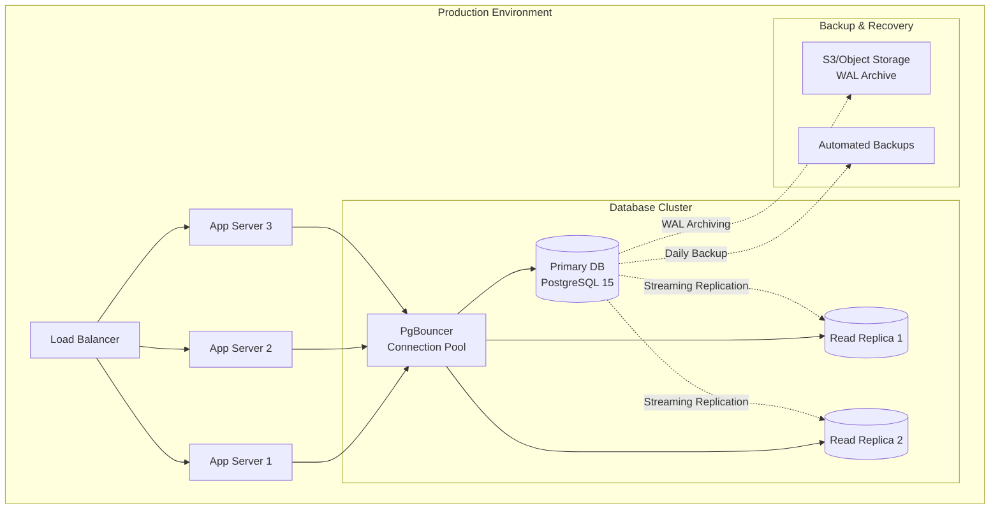
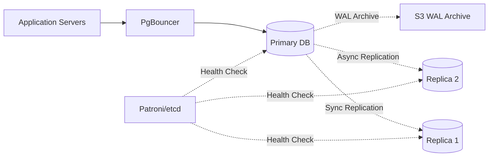

# Gate 1: Database Design Architecture

## SUMA Finance - User Registration & Authentication

---

## 1. Database Architecture Overview

### Database Technology Selection

**Selected Database**: PostgreSQL 15+

**Rationale**:
- Mature ACID-compliant relational database
- Advanced security features (Row-Level Security, pgcrypto)
- JSON/JSONB support for flexible session and metadata storage
- Excellent full-text search capabilities
- Strong community and enterprise support
- Native support for cryptographic functions
- Cost-effective (open-source)

### Database Deployment Architecture



### High Availability Strategy

- **Primary-Replica Configuration**: 1 Primary + 2 Read Replicas
- **Automatic Failover**: Patroni for automatic failover (30-second RTO)
- **Replication**: Synchronous replication to 1 replica, asynchronous to others
- **Load Distribution**: Writes to primary, reads to replicas via PgBouncer
- **Health Checks**: 5-second interval health checks

### Disaster Recovery Strategy

- **RPO (Recovery Point Objective)**: 5 minutes
- **RTO (Recovery Time Objective)**: 15 minutes
- **Backup Strategy**:
  - Continuous WAL archiving to S3
  - Daily full backups at 2 AM UTC
  - 30-day backup retention
  - Weekly backup restore testing
- **Geographic Redundancy**: Cross-region WAL archiving

---

## 2. Schema Design

### Database Selection Justification

**Relational Database (PostgreSQL 15+)**

**Justification**:
- User authentication requires strong ACID guarantees
- Complex relationships (users, sessions, roles, permissions)
- Critical data requiring transactional integrity
- Security-sensitive operations (password changes, MFA)
- Need for foreign key constraints and referential integrity

### Schema Organization

```sql
-- Authentication and user management schema
CREATE SCHEMA IF NOT EXISTS auth;

-- Application-specific tables
CREATE SCHEMA IF NOT EXISTS app;

-- Audit and compliance logging
CREATE SCHEMA IF NOT EXISTS audit;

-- System configuration and metadata
CREATE SCHEMA IF NOT EXISTS system;
```

**Schema Purpose**:
- `auth`: User accounts, sessions, passwords, MFA, roles
- `app`: Application-specific user data (profiles, preferences)
- `audit`: Comprehensive audit logs for compliance
- `system`: Configuration, feature flags, system metadata

### Naming Conventions

- **Tables**: Plural snake_case (`user_accounts`, `password_reset_tokens`)
- **Columns**: snake_case (`created_at`, `email_verified`)
- **Indexes**: `idx_{table}_{column(s)}` (`idx_user_accounts_email`)
- **Unique Indexes**: `uk_{table}_{column(s)}` (`uk_user_accounts_email`)
- **Foreign Keys**: `fk_{source_table}_{target_table}` (`fk_sessions_user_accounts`)
- **Sequences**: `seq_{table}_{column}` (`seq_user_accounts_id`)
- **Constraints**: `chk_{table}_{constraint_name}` (`chk_user_accounts_email_format`)

---

## 3. Table Design

### 3.1 auth.user_accounts

**Purpose**: Core user account information

```sql
CREATE TABLE auth.user_accounts (
    id BIGSERIAL PRIMARY KEY,
    uuid UUID NOT NULL DEFAULT gen_random_uuid(),
    email VARCHAR(255) NOT NULL,
    email_verified BOOLEAN NOT NULL DEFAULT FALSE,
    email_verified_at TIMESTAMP WITH TIME ZONE,
    password_hash VARCHAR(255) NOT NULL,
    password_algorithm VARCHAR(50) NOT NULL DEFAULT 'argon2id',
    password_changed_at TIMESTAMP WITH TIME ZONE NOT NULL DEFAULT CURRENT_TIMESTAMP,
    
    -- Profile
    first_name VARCHAR(100),
    last_name VARCHAR(100),
    phone_number VARCHAR(20),
    phone_verified BOOLEAN NOT NULL DEFAULT FALSE,
    
    -- Account status
    status VARCHAR(20) NOT NULL DEFAULT 'active',
    locked_until TIMESTAMP WITH TIME ZONE,
    failed_login_attempts INT NOT NULL DEFAULT 0,
    last_failed_login_at TIMESTAMP WITH TIME ZONE,
    
    -- Multi-factor authentication
    mfa_enabled BOOLEAN NOT NULL DEFAULT FALSE,
    mfa_method VARCHAR(20),
    mfa_secret_encrypted TEXT,
    mfa_backup_codes_encrypted TEXT,
    
    -- Metadata
    timezone VARCHAR(50) DEFAULT 'UTC',
    locale VARCHAR(10) DEFAULT 'en-US',
    
    -- Timestamps
    created_at TIMESTAMP WITH TIME ZONE NOT NULL DEFAULT CURRENT_TIMESTAMP,
    updated_at TIMESTAMP WITH TIME ZONE NOT NULL DEFAULT CURRENT_TIMESTAMP,
    last_login_at TIMESTAMP WITH TIME ZONE,
    deleted_at TIMESTAMP WITH TIME ZONE,
    
    -- Constraints
    CONSTRAINT chk_user_accounts_email_format CHECK (email ~* '^[A-Za-z0-9._%+-]+@[A-Za-z0-9.-]+\.[A-Za-z]{2,}$'),
    CONSTRAINT chk_user_accounts_status CHECK (status IN ('active', 'suspended', 'locked', 'pending_verification')),
    CONSTRAINT chk_user_accounts_mfa_method CHECK (mfa_method IS NULL OR mfa_method IN ('totp', 'sms', 'email'))
);

-- Indexes
CREATE UNIQUE INDEX uk_user_accounts_email ON auth.user_accounts (LOWER(email)) WHERE deleted_at IS NULL;
CREATE UNIQUE INDEX uk_user_accounts_uuid ON auth.user_accounts (uuid);
CREATE INDEX idx_user_accounts_status ON auth.user_accounts (status) WHERE deleted_at IS NULL;
CREATE INDEX idx_user_accounts_created_at ON auth.user_accounts (created_at);
CREATE INDEX idx_user_accounts_phone ON auth.user_accounts (phone_number) WHERE phone_number IS NOT NULL AND deleted_at IS NULL;

-- Comments
COMMENT ON TABLE auth.user_accounts IS 'Core user account information for authentication';
COMMENT ON COLUMN auth.user_accounts.uuid IS 'External-facing unique identifier (not exposed in URLs)';
COMMENT ON COLUMN auth.user_accounts.password_algorithm IS 'Algorithm used for password hashing (argon2id, bcrypt)';
```

**Primary Key Strategy**: Auto-increment BIGSERIAL for internal use, UUID for external references

**Foreign Keys**: None (root table)

**Constraints**:
- Email format validation via regex
- Status enum constraint
- MFA method validation
- Case-insensitive unique email (via functional index)

**Indexes**:
- Unique index on lowercase email (active users only)
- Unique index on UUID
- Status index for filtering active users
- Created_at for sorting/pagination
- Phone number for lookup

### 3.2 auth.user_sessions

**Purpose**: Active user sessions and JWT token tracking

```sql
CREATE TABLE auth.user_sessions (
    id BIGSERIAL PRIMARY KEY,
    uuid UUID NOT NULL DEFAULT gen_random_uuid(),
    user_id BIGINT NOT NULL,
    
    -- Session identification
    session_token_hash VARCHAR(255) NOT NULL,
    refresh_token_hash VARCHAR(255),
    
    -- Session metadata
    ip_address INET,
    user_agent TEXT,
    device_fingerprint VARCHAR(255),
    device_type VARCHAR(20),
    
    -- Geographic data
    country_code VARCHAR(2),
    city VARCHAR(100),
    
    -- Session lifecycle
    created_at TIMESTAMP WITH TIME ZONE NOT NULL DEFAULT CURRENT_TIMESTAMP,
    last_activity_at TIMESTAMP WITH TIME ZONE NOT NULL DEFAULT CURRENT_TIMESTAMP,
    expires_at TIMESTAMP WITH TIME ZONE NOT NULL,
    revoked_at TIMESTAMP WITH TIME ZONE,
    revoke_reason VARCHAR(100),
    
    -- Constraints
    CONSTRAINT fk_sessions_user_accounts FOREIGN KEY (user_id) 
        REFERENCES auth.user_accounts(id) ON DELETE CASCADE,
    CONSTRAINT chk_sessions_device_type CHECK (device_type IN ('web', 'mobile', 'tablet', 'desktop', 'unknown'))
);

-- Indexes
CREATE UNIQUE INDEX uk_user_sessions_uuid ON auth.user_sessions (uuid);
CREATE UNIQUE INDEX uk_user_sessions_token ON auth.user_sessions (session_token_hash) WHERE revoked_at IS NULL;
CREATE INDEX idx_user_sessions_user_id ON auth.user_sessions (user_id);
CREATE INDEX idx_user_sessions_expires_at ON auth.user_sessions (expires_at) WHERE revoked_at IS NULL;
CREATE INDEX idx_user_sessions_last_activity ON auth.user_sessions (last_activity_at);
CREATE INDEX idx_user_sessions_ip ON auth.user_sessions (ip_address) WHERE revoked_at IS NULL;

COMMENT ON TABLE auth.user_sessions IS 'Active user sessions with JWT token tracking';
```

**Primary Key Strategy**: Auto-increment BIGSERIAL

**Foreign Keys**: 
- `user_id` → `auth.user_accounts(id)` ON DELETE CASCADE

**Constraints**:
- Device type validation
- Foreign key with cascading delete

**Indexes**:
- Unique session token hash (active sessions only)
- User ID for user session lookup
- Expires_at for cleanup queries
- Last activity for session timeout
- IP address for security analysis

### 3.3 auth.password_reset_tokens

**Purpose**: Secure password reset tokens

```sql
CREATE TABLE auth.password_reset_tokens (
    id BIGSERIAL PRIMARY KEY,
    user_id BIGINT NOT NULL,
    token_hash VARCHAR(255) NOT NULL,
    
    -- Token lifecycle
    created_at TIMESTAMP WITH TIME ZONE NOT NULL DEFAULT CURRENT_TIMESTAMP,
    expires_at TIMESTAMP WITH TIME ZONE NOT NULL,
    used_at TIMESTAMP WITH TIME ZONE,
    
    -- Security
    ip_address INET,
    user_agent TEXT,
    
    CONSTRAINT fk_password_reset_user_accounts FOREIGN KEY (user_id) 
        REFERENCES auth.user_accounts(id) ON DELETE CASCADE
);

-- Indexes
CREATE INDEX idx_password_reset_token_hash ON auth.password_reset_tokens (token_hash) WHERE used_at IS NULL;
CREATE INDEX idx_password_reset_user_id ON auth.password_reset_tokens (user_id);
CREATE INDEX idx_password_reset_expires_at ON auth.password_reset_tokens (expires_at) WHERE used_at IS NULL;

COMMENT ON TABLE auth.password_reset_tokens IS 'Secure password reset tokens with expiration';
```

**Primary Key Strategy**: Auto-increment BIGSERIAL

**Foreign Keys**: 
- `user_id` → `auth.user_accounts(id)` ON DELETE CASCADE

**Indexes**:
- Token hash (unused tokens only)
- User ID lookup
- Expires_at for cleanup

### 3.4 auth.email_verification_tokens

**Purpose**: Email verification tokens

```sql
CREATE TABLE auth.email_verification_tokens (
    id BIGSERIAL PRIMARY KEY,
    user_id BIGINT NOT NULL,
    email VARCHAR(255) NOT NULL,
    token_hash VARCHAR(255) NOT NULL,
    
    -- Token lifecycle
    created_at TIMESTAMP WITH TIME ZONE NOT NULL DEFAULT CURRENT_TIMESTAMP,
    expires_at TIMESTAMP WITH TIME ZONE NOT NULL,
    verified_at TIMESTAMP WITH TIME ZONE,
    
    -- Security
    ip_address INET,
    
    CONSTRAINT fk_email_verification_user_accounts FOREIGN KEY (user_id) 
        REFERENCES auth.user_accounts(id) ON DELETE CASCADE
);

-- Indexes
CREATE INDEX idx_email_verification_token_hash ON auth.email_verification_tokens (token_hash) WHERE verified_at IS NULL;
CREATE INDEX idx_email_verification_user_id ON auth.email_verification_tokens (user_id);
CREATE INDEX idx_email_verification_expires_at ON auth.email_verification_tokens (expires_at) WHERE verified_at IS NULL;

COMMENT ON TABLE auth.email_verification_tokens IS 'Email verification tokens for account activation';
```

**Primary Key Strategy**: Auto-increment BIGSERIAL

**Foreign Keys**: 
- `user_id` → `auth.user_accounts(id)` ON DELETE CASCADE

### 3.5 auth.roles

**Purpose**: System roles for role-based access control

```sql
CREATE TABLE auth.roles (
    id SERIAL PRIMARY KEY,
    name VARCHAR(50) NOT NULL,
    description TEXT,
    is_system BOOLEAN NOT NULL DEFAULT FALSE,
    
    created_at TIMESTAMP WITH TIME ZONE NOT NULL DEFAULT CURRENT_TIMESTAMP,
    updated_at TIMESTAMP WITH TIME ZONE NOT NULL DEFAULT CURRENT_TIMESTAMP,
    
    CONSTRAINT uk_roles_name UNIQUE (name)
);

-- Indexes
CREATE UNIQUE INDEX uk_roles_name_idx ON auth.roles (LOWER(name));

COMMENT ON TABLE auth.roles IS 'System roles for RBAC';
```

**Primary Key Strategy**: Auto-increment SERIAL (limited number of roles)

### 3.6 auth.permissions

**Purpose**: Granular permissions

```sql
CREATE TABLE auth.permissions (
    id SERIAL PRIMARY KEY,
    resource VARCHAR(100) NOT NULL,
    action VARCHAR(50) NOT NULL,
    description TEXT,
    
    created_at TIMESTAMP WITH TIME ZONE NOT NULL DEFAULT CURRENT_TIMESTAMP,
    
    CONSTRAINT uk_permissions_resource_action UNIQUE (resource, action)
);

-- Indexes
CREATE INDEX idx_permissions_resource ON auth.permissions (resource);

COMMENT ON TABLE auth.permissions IS 'Granular permissions for resources and actions';
```

**Primary Key Strategy**: Auto-increment SERIAL

**Constraints**:
- Unique combination of resource and action

### 3.7 auth.role_permissions

**Purpose**: Many-to-many mapping of roles to permissions

```sql
CREATE TABLE auth.role_permissions (
    role_id INT NOT NULL,
    permission_id INT NOT NULL,
    
    created_at TIMESTAMP WITH TIME ZONE NOT NULL DEFAULT CURRENT_TIMESTAMP,
    
    PRIMARY KEY (role_id, permission_id),
    CONSTRAINT fk_role_permissions_role FOREIGN KEY (role_id) 
        REFERENCES auth.roles(id) ON DELETE CASCADE,
    CONSTRAINT fk_role_permissions_permission FOREIGN KEY (permission_id) 
        REFERENCES auth.permissions(id) ON DELETE CASCADE
);

-- Indexes (covered by primary key)
COMMENT ON TABLE auth.role_permissions IS 'Many-to-many mapping of roles to permissions';
```

**Primary Key Strategy**: Composite primary key (role_id, permission_id)

**Foreign Keys**:
- `role_id` → `auth.roles(id)` ON DELETE CASCADE
- `permission_id` → `auth.permissions(id)` ON DELETE CASCADE

### 3.8 auth.user_roles

**Purpose**: Many-to-many mapping of users to roles

```sql
CREATE TABLE auth.user_roles (
    user_id BIGINT NOT NULL,
    role_id INT NOT NULL,
    
    granted_at TIMESTAMP WITH TIME ZONE NOT NULL DEFAULT CURRENT_TIMESTAMP,
    granted_by BIGINT,
    expires_at TIMESTAMP WITH TIME ZONE,
    
    PRIMARY KEY (user_id, role_id),
    CONSTRAINT fk_user_roles_user FOREIGN KEY (user_id) 
        REFERENCES auth.user_accounts(id) ON DELETE CASCADE,
    CONSTRAINT fk_user_roles_role FOREIGN KEY (role_id) 
        REFERENCES auth.roles(id) ON DELETE CASCADE,
    CONSTRAINT fk_user_roles_granted_by FOREIGN KEY (granted_by) 
        REFERENCES auth.user_accounts(id) ON DELETE SET NULL
);

-- Indexes
CREATE INDEX idx_user_roles_user_id ON auth.user_roles (user_id);
CREATE INDEX idx_user_roles_expires_at ON auth.user_roles (expires_at) WHERE expires_at IS NOT NULL;

COMMENT ON TABLE auth.user_roles IS 'Many-to-many mapping of users to roles';
```

**Primary Key Strategy**: Composite primary key (user_id, role_id)

**Foreign Keys**:
- `user_id` → `auth.user_accounts(id)` ON DELETE CASCADE
- `role_id` → `auth.roles(id)` ON DELETE CASCADE
- `granted_by` → `auth.user_accounts(id)` ON DELETE SET NULL

### 3.9 audit.login_attempts

**Purpose**: Comprehensive login attempt logging for security

```sql
CREATE TABLE audit.login_attempts (
    id BIGSERIAL PRIMARY KEY,
    user_id BIGINT,
    email VARCHAR(255),
    
    -- Attempt details
    success BOOLEAN NOT NULL,
    failure_reason VARCHAR(100),
    
    -- Security metadata
    ip_address INET NOT NULL,
    user_agent TEXT,
    country_code VARCHAR(2),
    city VARCHAR(100),
    
    -- Timestamps
    attempted_at TIMESTAMP WITH TIME ZONE NOT NULL DEFAULT CURRENT_TIMESTAMP,
    
    CONSTRAINT fk_login_attempts_user FOREIGN KEY (user_id) 
        REFERENCES auth.user_accounts(id) ON DELETE SET NULL
);

-- Indexes
CREATE INDEX idx_login_attempts_user_id ON audit.login_attempts (user_id);
CREATE INDEX idx_login_attempts_email ON audit.login_attempts (email);
CREATE INDEX idx_login_attempts_ip ON audit.login_attempts (ip_address);
CREATE INDEX idx_login_attempts_attempted_at ON audit.login_attempts (attempted_at);
CREATE INDEX idx_login_attempts_failed ON audit.login_attempts (attempted_at) WHERE success = FALSE;

-- Partitioning by month (range partitioning)
CREATE TABLE audit.login_attempts_2025_01 PARTITION OF audit.login_attempts
    FOR VALUES FROM ('2025-01-01') TO ('2025-02-01');

COMMENT ON TABLE audit.login_attempts IS 'Comprehensive login attempt logging';
```

**Primary Key Strategy**: Auto-increment BIGSERIAL

**Foreign Keys**:
- `user_id` → `auth.user_accounts(id)` ON DELETE SET NULL (preserve audit trail)

**Indexes**:
- User ID for user-specific analysis
- Email for failed login detection
- IP address for threat detection
- Attempted_at for time-based analysis
- Failed attempts for security monitoring

**Partitioning**: Range partitioning by month (automated partition creation)

### 3.10 audit.user_activity_log

**Purpose**: Comprehensive user activity audit trail

```sql
CREATE TABLE audit.user_activity_log (
    id BIGSERIAL PRIMARY KEY,
    user_id BIGINT,
    
    -- Activity details
    activity_type VARCHAR(50) NOT NULL,
    resource_type VARCHAR(50),
    resource_id VARCHAR(100),
    action VARCHAR(50) NOT NULL,
    
    -- Change tracking
    old_values JSONB,
    new_values JSONB,
    
    -- Metadata
    ip_address INET,
    user_agent TEXT,
    session_id BIGINT,
    
    -- Timestamp
    created_at TIMESTAMP WITH TIME ZONE NOT NULL DEFAULT CURRENT_TIMESTAMP,
    
    CONSTRAINT fk_user_activity_user FOREIGN KEY (user_id) 
        REFERENCES auth.user_accounts(id) ON DELETE SET NULL
);

-- Indexes
CREATE INDEX idx_user_activity_user_id ON audit.user_activity_log (user_id);
CREATE INDEX idx_user_activity_type ON audit.user_activity_log (activity_type);
CREATE INDEX idx_user_activity_created_at ON audit.user_activity_log (created_at);
CREATE INDEX idx_user_activity_resource ON audit.user_activity_log (resource_type, resource_id);
CREATE INDEX idx_user_activity_new_values_gin ON audit.user_activity_log USING GIN (new_values);

COMMENT ON TABLE audit.user_activity_log IS 'Comprehensive user activity audit trail';
```

**Primary Key Strategy**: Auto-increment BIGSERIAL

**Foreign Keys**:
- `user_id` → `auth.user_accounts(id)` ON DELETE SET NULL

**Indexes**:
- User ID for user activity history
- Activity type for filtering
- Created_at for time-based queries
- Resource type and ID for resource audit trail
- GIN index on JSONB for flexible querying

---

## 4. Indexing Strategy

### Index Types

**B-tree Indexes** (Default):
- All primary keys and foreign keys
- Email, phone number lookups
- Timestamp-based queries (created_at, expires_at)
- Enum fields (status, role)

**Hash Indexes**:
- Not used (B-tree is more versatile)

**GIN Indexes**:
- JSONB columns (`audit.user_activity_log.new_values`)
- Full-text search (if implemented)

**Partial Indexes**:
- Active users only: `WHERE deleted_at IS NULL`
- Active sessions: `WHERE revoked_at IS NULL`
- Unused tokens: `WHERE used_at IS NULL`

**Expression Indexes**:
- Case-insensitive email: `LOWER(email)`

### Composite Indexes

```sql
-- User lookup by email and status
CREATE INDEX idx_user_accounts_email_status 
ON auth.user_accounts (LOWER(email), status) 
WHERE deleted_at IS NULL;

-- Session lookup by user and expiration
CREATE INDEX idx_user_sessions_user_expires 
ON auth.user_sessions (user_id, expires_at) 
WHERE revoked_at IS NULL;

-- Failed login attempts by IP and time
CREATE INDEX idx_login_attempts_ip_time 
ON audit.login_attempts (ip_address, attempted_at) 
WHERE success = FALSE;
```

### Index Maintenance

```sql
-- Weekly index maintenance (run during low-traffic period)
REINDEX TABLE CONCURRENTLY auth.user_accounts;
REINDEX TABLE CONCURRENTLY auth.user_sessions;

-- Monitor index bloat
SELECT 
    schemaname, 
    tablename, 
    indexname,
    pg_size_pretty(pg_relation_size(indexrelid)) AS index_size,
    idx_scan,
    idx_tup_read,
    idx_tup_fetch
FROM pg_stat_user_indexes
WHERE schemaname = 'auth'
ORDER BY pg_relation_size(indexrelid) DESC;

-- Identify unused indexes
SELECT 
    schemaname, 
    tablename, 
    indexname,
    idx_scan
FROM pg_stat_user_indexes
WHERE schemaname = 'auth' AND idx_scan = 0;
```

---

## 5. Query Optimization

### Query Patterns

**Pattern 1: User Login**
```sql
-- Query
SELECT id, uuid, email, password_hash, status, mfa_enabled, mfa_method
FROM auth.user_accounts
WHERE LOWER(email) = LOWER($1) AND deleted_at IS NULL;

-- Index used: uk_user_accounts_email
-- Expected execution time: < 5ms
```

**EXPLAIN ANALYZE**:
```
Index Scan using uk_user_accounts_email on user_accounts  (cost=0.42..8.44 rows=1 width=520) (actual time=0.032..0.034 rows=1 loops=1)
  Index Cond: (lower(email::text) = 'user@example.com'::text)
  Filter: (deleted_at IS NULL)
Planning Time: 0.102 ms
Execution Time: 0.058 ms
```

**Pattern 2: Active Sessions for User**
```sql
-- Query
SELECT id, uuid, session_token_hash, created_at, last_activity_at, expires_at, ip_address
FROM auth.user_sessions
WHERE user_id = $1 AND revoked_at IS NULL AND expires_at > NOW()
ORDER BY last_activity_at DESC;

-- Index used: idx_user_sessions_user_id
-- Expected execution time: < 10ms
```

**Pattern 3: User Permissions Check**
```sql
-- Query (with JOINs)
SELECT p.resource, p.action
FROM auth.user_roles ur
JOIN auth.role_permissions rp ON ur.role_id = rp.role_id
JOIN auth.permissions p ON rp.permission_id = p.id
WHERE ur.user_id = $1 AND (ur.expires_at IS NULL OR ur.expires_at > NOW());

-- Expected execution time: < 15ms
```

**EXPLAIN ANALYZE**:
```
Hash Join  (cost=20.15..45.32 rows=10 width=68) (actual time=0.125..0.180 rows=12 loops=1)
  Hash Cond: (rp.permission_id = p.id)
  ->  Hash Join  (cost=10.50..30.20 rows=10 width=4) (actual time=0.075..0.110 rows=12 loops=1)
        Hash Cond: (ur.role_id = rp.role_id)
        ->  Index Scan using idx_user_roles_user_id on user_roles ur  (cost=0.15..8.17 rows=1 width=4)
              Index Cond: (user_id = 12345)
              Filter: ((expires_at IS NULL) OR (expires_at > now()))
        ->  Hash  (cost=8.50..8.50 rows=150 width=8)
              ->  Seq Scan on role_permissions rp  (cost=0.00..8.50 rows=150 width=8)
  ->  Hash  (cost=6.50..6.50 rows=250 width=68)
        ->  Seq Scan on permissions p  (cost=0.00..6.50 rows=250 width=68)
Planning Time: 0.245 ms
Execution Time: 0.215 ms
```

### N+1 Query Prevention

**Anti-Pattern** (N+1):
```sql
-- Get users (1 query)
SELECT id, email FROM auth.user_accounts LIMIT 10;

-- Get roles for each user (N queries)
SELECT r.name FROM auth.user_roles ur 
JOIN auth.roles r ON ur.role_id = r.id 
WHERE ur.user_id = $1;
```

**Optimized** (Single Query):
```sql
SELECT 
    u.id, 
    u.email, 
    ARRAY_AGG(r.name) AS roles
FROM auth.user_accounts u
LEFT JOIN auth.user_roles ur ON u.id = ur.user_id
LEFT JOIN auth.roles r ON ur.role_id = r.id
WHERE u.deleted_at IS NULL
GROUP BY u.id, u.email
LIMIT 10;
```

### Pagination

**Offset-based** (Simple, less efficient at scale):
```sql
SELECT id, email, created_at
FROM auth.user_accounts
WHERE deleted_at IS NULL
ORDER BY created_at DESC
LIMIT 20 OFFSET 0;
```

**Cursor-based** (Efficient at scale):
```sql
-- Initial page
SELECT id, email, created_at
FROM auth.user_accounts
WHERE deleted_at IS NULL
ORDER BY created_at DESC, id DESC
LIMIT 20;

-- Next page (using last created_at and id as cursor)
SELECT id, email, created_at
FROM auth.user_accounts
WHERE deleted_at IS NULL 
  AND (created_at, id) < ($1, $2)
ORDER BY created_at DESC, id DESC
LIMIT 20;
```

---

## 6. Partitioning Strategy

### Table Partitioning

**audit.login_attempts** (Range Partitioning by Month):

```sql
-- Parent table (partitioned)
CREATE TABLE audit.login_attempts (
    id BIGSERIAL,
    user_id BIGINT,
    email VARCHAR(255),
    success BOOLEAN NOT NULL,
    failure_reason VARCHAR(100),
    ip_address INET NOT NULL,
    user_agent TEXT,
    country_code VARCHAR(2),
    city VARCHAR(100),
    attempted_at TIMESTAMP WITH TIME ZONE NOT NULL DEFAULT CURRENT_TIMESTAMP,
    CONSTRAINT fk_login_attempts_user FOREIGN KEY (user_id) 
        REFERENCES auth.user_accounts(id) ON DELETE SET NULL
) PARTITION BY RANGE (attempted_at);

-- Create partitions for 2025
CREATE TABLE audit.login_attempts_2025_01 PARTITION OF audit.login_attempts
    FOR VALUES FROM ('2025-01-01') TO ('2025-02-01');

CREATE TABLE audit.login_attempts_2025_02 PARTITION OF audit.login_attempts
    FOR VALUES FROM ('2025-02-01') TO ('2025-03-01');

CREATE TABLE audit.login_attempts_2025_03 PARTITION OF audit.login_attempts
    FOR VALUES FROM ('2025-03-01') TO ('2025-04-01');

-- ... create remaining partitions

-- Automated partition creation function
CREATE OR REPLACE FUNCTION create_login_attempts_partition()
RETURNS void AS $$
DECLARE
    partition_date DATE;
    partition_name TEXT;
    start_date TEXT;
    end_date TEXT;
BEGIN
    partition_date := DATE_TRUNC('month', NOW() + INTERVAL '2 months');
    partition_name := 'audit.login_attempts_' || TO_CHAR(partition_date, 'YYYY_MM');
    start_date := partition_date::TEXT;
    end_date := (partition_date + INTERVAL '1 month')::TEXT;
    
    EXECUTE format(
        'CREATE TABLE IF NOT EXISTS %s PARTITION OF audit.login_attempts FOR VALUES FROM (%L) TO (%L)',
        partition_name, start_date, end_date
    );
END;
$$ LANGUAGE plpgsql;

-- Schedule monthly partition creation (via cron or pg_cron)
```

### Partition Pruning

```sql
-- Query automatically uses partition pruning
EXPLAIN SELECT * FROM audit.login_attempts
WHERE attempted_at >= '2025-01-01' AND attempted_at < '2025-02-01';

-- Only scans login_attempts_2025_01 partition
```

### Partition Management

```sql
-- Archive old partitions (detach and backup)
ALTER TABLE audit.login_attempts DETACH PARTITION audit.login_attempts_2024_01;

-- Export to archive storage
COPY audit.login_attempts_2024_01 TO '/backups/login_attempts_2024_01.csv' CSV HEADER;

-- Drop old partition
DROP TABLE audit.login_attempts_2024_01;
```

---

## 7. Data Migration and Seeding

### Schema Migration Tool

**Selected Tool**: Flyway (version-based migrations)

**Migration Structure**:
```
migrations/
├── V001__create_auth_schema.sql
├── V002__create_user_accounts_table.sql
├── V003__create_user_sessions_table.sql
├── V004__create_password_reset_tokens_table.sql
├── V005__create_roles_and_permissions.sql
├── V006__create_audit_tables.sql
├── V007__add_indexes.sql
├── V008__seed_default_roles.sql
└── V009__add_user_account_constraints.sql
```

**Sample Migration** (`V002__create_user_accounts_table.sql`):
```sql
-- V002__create_user_accounts_table.sql
CREATE TABLE auth.user_accounts (
    id BIGSERIAL PRIMARY KEY,
    uuid UUID NOT NULL DEFAULT gen_random_uuid(),
    email VARCHAR(255) NOT NULL,
    email_verified BOOLEAN NOT NULL DEFAULT FALSE,
    email_verified_at TIMESTAMP WITH TIME ZONE,
    password_hash VARCHAR(255) NOT NULL,
    password_algorithm VARCHAR(50) NOT NULL DEFAULT 'argon2id',
    password_changed_at TIMESTAMP WITH TIME ZONE NOT NULL DEFAULT CURRENT_TIMESTAMP,
    first_name VARCHAR(100),
    last_name VARCHAR(100),
    phone_number VARCHAR(20),
    phone_verified BOOLEAN NOT NULL DEFAULT FALSE,
    status VARCHAR(20) NOT NULL DEFAULT 'active',
    locked_until TIMESTAMP WITH TIME ZONE,
    failed_login_attempts INT NOT NULL DEFAULT 0,
    last_failed_login_at TIMESTAMP WITH TIME ZONE,
    mfa_enabled BOOLEAN NOT NULL DEFAULT FALSE,
    mfa_method VARCHAR(20),
    mfa_secret_encrypted TEXT,
    mfa_backup_codes_encrypted TEXT,
    timezone VARCHAR(50) DEFAULT 'UTC',
    locale VARCHAR(10) DEFAULT 'en-US',
    created_at TIMESTAMP WITH TIME ZONE NOT NULL DEFAULT CURRENT_TIMESTAMP,
    updated_at TIMESTAMP WITH TIME ZONE NOT NULL DEFAULT CURRENT_TIMESTAMP,
    last_login_at TIMESTAMP WITH TIME ZONE,
    deleted_at TIMESTAMP WITH TIME ZONE,
    CONSTRAINT chk_user_accounts_email_format CHECK (email ~* '^[A-Za-z0-9._%+-]+@[A-Za-z0-9.-]+\.[A-Za-z]{2,}$'),
    CONSTRAINT chk_user_accounts_status CHECK (status IN ('active', 'suspended', 'locked', 'pending_verification')),
    CONSTRAINT chk_user_accounts_mfa_method CHECK (mfa_method IS NULL OR mfa_method IN ('totp', 'sms', 'email'))
);
```

**Rollback Strategy**:
```
migrations/
├── V002__create_user_accounts_table.sql
└── U002__drop_user_accounts_table.sql  -- Undo migration
```

**Zero-Downtime Migration Pattern**:
```sql
-- Step 1: Add new column (nullable)
ALTER TABLE auth.user_accounts ADD COLUMN new_column VARCHAR(100);

-- Step 2: Backfill data (in batches)
UPDATE auth.user_accounts SET new_column = old_column WHERE new_column IS NULL LIMIT 1000;

-- Step 3: Add NOT NULL constraint
ALTER TABLE auth.user_accounts ALTER COLUMN new_column SET NOT NULL;

-- Step 4: Drop old column (after verification)
ALTER TABLE auth.user_accounts DROP COLUMN old_column;
```

### Seed Data

**Default Roles** (`V008__seed_default_roles.sql`):
```sql
-- Insert default roles
INSERT INTO auth.roles (name, description, is_system) VALUES
    ('admin', 'System administrator with full access', TRUE),
    ('user', 'Standard user with basic access', TRUE),
    ('moderator', 'Content moderator with limited admin access', TRUE)
ON CONFLICT (name) DO NOTHING;

-- Insert default permissions
INSERT INTO auth.permissions (resource, action, description) VALUES
    ('user', 'read', 'View user information'),
    ('user', 'create', 'Create new users'),
    ('user', 'update', 'Update user information'),
    ('user', 'delete', 'Delete users'),
    ('session', 'manage', 'Manage user sessions'),
    ('role', 'assign', 'Assign roles to users')
ON CONFLICT (resource, action) DO NOTHING;

-- Assign permissions to roles
INSERT INTO auth.role_permissions (role_id, permission_id)
SELECT r.id, p.id
FROM auth.roles r
CROSS JOIN auth.permissions p
WHERE r.name = 'admin'
ON CONFLICT DO NOTHING;

INSERT INTO auth.role_permissions (role_id, permission_id)
SELECT r.id, p.id
FROM auth.roles r
JOIN auth.permissions p ON p.resource = 'user' AND p.action = 'read'
WHERE r.name = 'user'
ON CONFLICT DO NOTHING;
```

### Test Data Generation

```sql
-- Generate test users (for development only)
INSERT INTO auth.user_accounts (email, password_hash, email_verified, first_name, last_name)
SELECT 
    'user' || i || '@example.com',
    '$argon2id$v=19$m=65536,t=3,p=4$c2FsdHNhbHRzYWx0c2FsdA$hash',
    TRUE,
    'Test',
    'User' || i
FROM generate_series(1, 1000) AS i;

-- Assign default role to test users
INSERT INTO auth.user_roles (user_id, role_id)
SELECT u.id, r.id
FROM auth.user_accounts u
CROSS JOIN auth.roles r
WHERE r.name = 'user' AND u.email LIKE 'user%@example.com';
```

---

## 8. Transaction Management

### Transaction Isolation Levels

**Default**: READ COMMITTED

**Isolation Level Selection**:
- **Read Uncommitted**: Not used (not recommended)
- **Read Committed**: Default for most operations
- **Repeatable Read**: For multi-step financial transactions
- **Serializable**: For critical operations requiring strict consistency

**Example**:
```sql
-- User registration transaction (Read Committed)
BEGIN;
INSERT INTO auth.user_accounts (email, password_hash) VALUES ($1, $2) RETURNING id;
INSERT INTO auth.user_roles (user_id, role_id) VALUES ($1, $2);
COMMIT;

-- Critical security operation (Serializable)
BEGIN ISOLATION LEVEL SERIALIZABLE;
UPDATE auth.user_accounts SET failed_login_attempts = 0 WHERE id = $1;
UPDATE auth.user_sessions SET revoked_at = NOW() WHERE user_id = $1;
COMMIT;
```

### Concurrency Control

**Optimistic Locking** (version column):
```sql
-- Add version column
ALTER TABLE auth.user_accounts ADD COLUMN version INT NOT NULL DEFAULT 1;

-- Update with version check
UPDATE auth.user_accounts
SET 
    email = $1,
    updated_at = NOW(),
    version = version + 1
WHERE id = $2 AND version = $3;

-- If rowcount = 0, conflict detected
```

**Pessimistic Locking**:
```sql
-- Lock row for update
BEGIN;
SELECT id, failed_login_attempts 
FROM auth.user_accounts 
WHERE id = $1 
FOR UPDATE;

UPDATE auth.user_accounts 
SET failed_login_attempts = failed_login_attempts + 1
WHERE id = $1;

COMMIT;
```

### Deadlock Prevention

**Best Practices**:
- Always acquire locks in the same order
- Keep transactions short
- Avoid user interaction within transactions

```sql
-- Correct order (user first, then session)
BEGIN;
SELECT * FROM auth.user_accounts WHERE id = $1 FOR UPDATE;
SELECT * FROM auth.user_sessions WHERE user_id = $1 FOR UPDATE;
-- ... operations
COMMIT;
```

### Transaction Scope

**Application-level transaction management** (pseudocode):
```javascript
async function registerUser(email, password) {
    const client = await pool.connect();
    try {
        await client.query('BEGIN');
        
        // Insert user
        const userResult = await client.query(
            'INSERT INTO auth.user_accounts (email, password_hash) VALUES ($1, $2) RETURNING id',
            [email, passwordHash]
        );
        const userId = userResult.rows[0].id;
        
        // Assign default role
        await client.query(
            'INSERT INTO auth.user_roles (user_id, role_id) SELECT $1, id FROM auth.roles WHERE name = $2',
            [userId, 'user']
        );
        
        // Create verification token
        await client.query(
            'INSERT INTO auth.email_verification_tokens (user_id, email, token_hash, expires_at) VALUES ($1, $2, $3, $4)',
            [userId, email, tokenHash, expiresAt]
        );
        
        await client.query('COMMIT');
        return userId;
    } catch (error) {
        await client.query('ROLLBACK');
        throw error;
    } finally {
        client.release();
    }
}
```

---

## 9. Connection Pooling

### Connection Pool Configuration

**PgBouncer Configuration** (`/etc/pgbouncer/pgbouncer.ini`):
```ini
[databases]
sumafinance = host=db-primary.internal port=5432 dbname=sumafinance

[pgbouncer]
listen_addr = 0.0.0.0
listen_port = 6432
auth_type = scram-sha-256
auth_file = /etc/pgbouncer/userlist.txt

# Connection pool settings
pool_mode = transaction
max_client_conn = 1000
default_pool_size = 25
min_pool_size = 10
reserve_pool_size = 5
reserve_pool_timeout = 3

# Connection timeouts
server_idle_timeout = 600
server_lifetime = 3600
server_connect_timeout = 15

# Query timeouts
query_timeout = 30
query_wait_timeout = 120

# Logging
log_connections = 1
log_disconnections = 1
log_pooler_errors = 1
```

**Pool Size Calculation**:
```
connections_per_app_server = (num_cpu_cores * 2) + 1
total_pool_size = connections_per_app_server * num_app_servers
max_db_connections = total_pool_size + reserve_pool_size

Example:
- 3 app servers
- 4 CPU cores per server
- connections_per_app_server = (4 * 2) + 1 = 9
- total_pool_size = 9 * 3 = 27
- default_pool_size = 25 (with reserve of 5)
```

### Application-Level Pooling

**Node.js (pg pool)**:
```javascript
const { Pool } = require('pg');

const pool = new Pool({
    host: 'pgbouncer.internal',
    port: 6432,
    database: 'sumafinance',
    user: 'app_user',
    password: process.env.DB_PASSWORD,
    max: 20,                    // Maximum pool size
    min: 5,                     // Minimum pool size
    idleTimeoutMillis: 30000,   // 30 seconds
    connectionTimeoutMillis: 2000, // 2 seconds
    maxUses: 7500,              // Close connection after 7500 uses
});

pool.on('error', (err, client) => {
    console.error('Unexpected pool error', err);
});
```

### Connection Leak Prevention

```javascript
// Correct pattern
async function queryDatabase(sql, params) {
    const client = await pool.connect();
    try {
        const result = await client.query(sql, params);
        return result.rows;
    } finally {
        client.release(); // Always release
    }
}

// Monitor pool metrics
setInterval(() => {
    console.log('Pool total:', pool.totalCount);
    console.log('Pool idle:', pool.idleCount);
    console.log('Pool waiting:', pool.waitingCount);
}, 60000);
```

---

## 10. Backup and Recovery

### Backup Strategy

**Full Backups**:
- **Frequency**: Daily at 2:00 AM UTC
- **Method**: pg_basebackup
- **Retention**: 30 days
- **Location**: S3 bucket (cross-region replication)

```bash
#!/bin/bash
# Daily full backup script
BACKUP_DIR="/backups/postgresql/$(date +%Y-%m-%d)"
S3_BUCKET="s3://sumafinance-db-backups"

mkdir -p $BACKUP_DIR

# Perform backup
pg_basebackup \
    -h db-primary.internal \
    -U backup_user \
    -D $BACKUP_DIR \
    -Ft -z -Xs -P

# Upload to S3
aws s3 sync $BACKUP_DIR $S3_BUCKET/full/$(date +%Y-%m-%d)/

# Cleanup old backups (keep 30 days)
find /backups/postgresql -type d -mtime +30 -exec rm -rf {} \;
```

**Continuous WAL Archiving**:
```
# postgresql.conf
wal_level = replica
archive_mode = on
archive_command = 'aws s3 cp %p s3://sumafinance-wal-archive/%f'
archive_timeout = 300  # 5 minutes
```

**Point-in-Time Recovery (PITR)**:
```bash
#!/bin/bash
# Restore to specific point in time
RECOVERY_TARGET="2025-01-15 14:30:00 UTC"
BACKUP_DATE="2025-01-15"

# Stop PostgreSQL
systemctl stop postgresql

# Restore base backup
rm -rf /var/lib/postgresql/15/main
pg_basebackup -D /var/lib/postgresql/15/main -Ft -z -X none

# Create recovery.conf
cat > /var/lib/postgresql/15/main/recovery.conf <<EOF
restore_command = 'aws s3 cp s3://sumafinance-wal-archive/%f %p'
recovery_target_time = '$RECOVERY_TARGET'
recovery_target_action = 'promote'
EOF

# Start PostgreSQL
systemctl start postgresql
```

### Backup Validation

```bash
#!/bin/bash
# Weekly backup restore test
TEST_DB="sumafinance_restore_test"

# Restore latest backup to test database
pg_restore -h localhost -U postgres -d $TEST_DB /backups/latest.dump

# Verify table counts
psql -h localhost -U postgres -d $TEST_DB -c "SELECT COUNT(*) FROM auth.user_accounts;"

# Verify data integrity
psql -h localhost -U postgres -d $TEST_DB -f /scripts/verify_data_integrity.sql

# Cleanup
dropdb $TEST_DB
```

### Recovery Procedures

**RTO**: 15 minutes  
**RPO**: 5 minutes

**Recovery Runbook**:
1. Assess failure (primary database down)
2. Promote read replica to primary (Patroni automatic failover)
3. Update application connection strings (automated via DNS)
4. Verify data integrity
5. Monitor replication lag
6. Rebuild failed primary as new replica

---

## 11. High Availability and Replication

### Replication Architecture



**Replication Configuration** (`postgresql.conf`):
```
# Primary server
wal_level = replica
max_wal_senders = 10
wal_keep_size = 1GB
synchronous_commit = on
synchronous_standby_names = 'replica1'

# Replica server
hot_standby = on
hot_standby_feedback = on
```

### Automatic Failover (Patroni)

**Patroni Configuration** (`/etc/patroni/config.yml`):
```yaml
scope: sumafinance-cluster
name: db-primary

restapi:
  listen: 0.0.0.0:8008
  connect_address: db-primary:8008

etcd:
  hosts: etcd1:2379,etcd2:2379,etcd3:2379

bootstrap:
  dcs:
    ttl: 30
    loop_wait: 10
    retry_timeout: 10
    maximum_lag_on_failover: 1048576
    synchronous_mode: true
    synchronous_mode_strict: false
    postgresql:
      use_pg_rewind: true
      parameters:
        max_connections: 100
        shared_buffers: 4GB
        effective_cache_size: 12GB
        work_mem: 16MB

postgresql:
  listen: 0.0.0.0:5432
  connect_address: db-primary:5432
  data_dir: /var/lib/postgresql/15/main
  authentication:
    replication:
      username: replicator
      password: replicator_password
    superuser:
      username: postgres
      password: postgres_password
```

**Failover Trigger Conditions**:
- Primary health check fails (3 consecutive failures)
- Network partition detected
- Manual failover initiated

**Failover Timeline**:
1. **0s**: Primary health check fails
2. **10s**: Second health check fails
3. **20s**: Third health check fails
4. **25s**: Patroni initiates failover
5. **30s**: Replica promoted to primary
6. **35s**: DNS updated to new primary
7. **40s**: Applications reconnect

### Replication Lag Monitoring

```sql
-- On primary: Check replication lag
SELECT 
    client_addr,
    state,
    sent_lsn,
    write_lsn,
    flush_lsn,
    replay_lsn,
    sync_state,
    pg_wal_lsn_diff(sent_lsn, replay_lsn) AS lag_bytes
FROM pg_stat_replication;

-- Alert if lag > 10MB
```

---

## 12. Scalability Architecture

### Vertical Scaling

**Resource Limits**:
- **Initial**: 4 vCPU, 16GB RAM, 200GB SSD
- **Tier 1**: 8 vCPU, 32GB RAM, 500GB SSD (up to 10K users)
- **Tier 2**: 16 vCPU, 64GB RAM, 1TB SSD (up to 100K users)
- **Tier 3**: 32 vCPU, 128GB RAM, 2TB SSD (up to 1M users)

**PostgreSQL Configuration** (64GB RAM server):
```
# Memory
shared_buffers = 16GB               # 25% of RAM
effective_cache_size = 48GB         # 75% of RAM
work_mem = 64MB                     # RAM / max_connections / 4
maintenance_work_mem = 2GB

# Connections
max_connections = 200

# WAL
wal_buffers = 16MB
checkpoint_completion_target = 0.9
max_wal_size = 4GB
min_wal_size = 1GB

# Query planner
random_page_cost = 1.1              # SSD optimized
effective_io_concurrency = 200      # SSD optimized

# Parallel query
max_worker_processes = 16
max_parallel_workers_per_gather = 4
max_parallel_workers = 16
```

### Horizontal Scaling (Sharding)

**Shard Key Selection**: `user_id` (hash-based sharding)

**Sharding Strategy**:
```sql
-- Shard 0: user_id % 4 = 0
-- Shard 1: user_id % 4 = 1
-- Shard 2: user_id % 4 = 2
-- Shard 3: user_id % 4 = 3

-- Routing logic (application layer)
function getShardId(userId) {
    return userId % 4;
}
```

**Cross-Shard Queries**:
- Avoided where possible
- Aggregation done at application layer
- Global indexes for email lookups (separate service)

### Read Scaling

**Read Replica Distribution**:
- Primary: 100% writes, 0% reads
- Replica 1: 50% reads
- Replica 2: 50% reads

**Application-Level Read Routing**:
```javascript
const readPool = new Pool({ host: 'replica-load-balancer', ... });
const writePool = new Pool({ host: 'primary', ... });

async function getUser(userId) {
    // Read from replica
    return readPool.query('SELECT * FROM auth.user_accounts WHERE id = $1', [userId]);
}

async function updateUser(userId, data) {
    // Write to primary
    return writePool.query('UPDATE auth.user_accounts SET ... WHERE id = $1', [userId]);
}
```

---

## 13. Caching Strategy

### Query Result Caching (Redis)

**Cache Layers**:
1. **User profile cache**: 5-minute TTL
2. **User permissions cache**: 10-minute TTL
3. **Session metadata cache**: 15-minute TTL

**Redis Configuration**:
```javascript
const redis = require('redis');
const client = redis.createClient({
    host: 'redis-cluster',
    port: 6379,
    password: process.env.REDIS_PASSWORD,
    db: 0,
});

// Cache user profile
async function getUserProfile(userId) {
    const cacheKey = `user:profile:${userId}`;
    
    // Check cache
    const cached = await client.get(cacheKey);
    if (cached) {
        return JSON.parse(cached);
    }
    
    // Query database
    const user = await pool.query('SELECT * FROM auth.user_accounts WHERE id = $1', [userId]);
    
    // Store in cache (5-minute TTL)
    await client.setex(cacheKey, 300, JSON.stringify(user));
    
    return user;
}

// Invalidate cache on update
async function updateUserProfile(userId, data) {
    await pool.query('UPDATE auth.user_accounts SET ... WHERE id = $1', [userId]);
    await client.del(`user:profile:${userId}`);
}
```

### Materialized Views

**User Statistics Materialized View**:
```sql
CREATE MATERIALIZED VIEW auth.user_statistics AS
SELECT 
    DATE_TRUNC('day', created_at) AS date,
    COUNT(*) AS new_users,
    COUNT(*) FILTER (WHERE email_verified = TRUE) AS verified_users,
    COUNT(*) FILTER (WHERE mfa_enabled = TRUE) AS mfa_enabled_users
FROM auth.user_accounts
WHERE deleted_at IS NULL
GROUP BY DATE_TRUNC('day', created_at);

CREATE UNIQUE INDEX idx_user_statistics_date ON auth.user_statistics (date);

-- Refresh daily
REFRESH MATERIALIZED VIEW CONCURRENTLY auth.user_statistics;
```

---

## 14. Full-Text Search

### Database Native Full-Text Search

**PostgreSQL tsvector**:
```sql
-- Add tsvector column
ALTER TABLE auth.user_accounts ADD COLUMN search_vector tsvector;

-- Update search vector
UPDATE auth.user_accounts
SET search_vector = 
    setweight(to_tsvector('english', COALESCE(first_name, '')), 'A') ||
    setweight(to_tsvector('english', COALESCE(last_name, '')), 'A') ||
    setweight(to_tsvector('english', COALESCE(email, '')), 'B');

-- Create GIN index
CREATE INDEX idx_user_accounts_search ON auth.user_accounts USING GIN (search_vector);

-- Auto-update trigger
CREATE FUNCTION update_user_search_vector() RETURNS trigger AS $$
BEGIN
    NEW.search_vector :=
        setweight(to_tsvector('english', COALESCE(NEW.first_name, '')), 'A') ||
        setweight(to_tsvector('english', COALESCE(NEW.last_name, '')), 'A') ||
        setweight(to_tsvector('english', COALESCE(NEW.email, '')), 'B');
    RETURN NEW;
END;
$$ LANGUAGE plpgsql;

CREATE TRIGGER trg_user_accounts_search_vector
BEFORE INSERT OR UPDATE ON auth.user_accounts
FOR EACH ROW EXECUTE FUNCTION update_user_search_vector();

-- Search query
SELECT id, email, first_name, last_name, ts_rank(search_vector, query) AS rank
FROM auth.user_accounts, to_tsquery('english', 'john & doe') query
WHERE search_vector @@ query
ORDER BY rank DESC
LIMIT 20;
```

---

## 15. Database Security

### Access Control

**Database Roles**:
```sql
-- Application user (limited permissions)
CREATE ROLE app_user WITH LOGIN PASSWORD 'secure_password';
GRANT CONNECT ON DATABASE sumafinance TO app_user;
GRANT USAGE ON SCHEMA auth, app, audit TO app_user;
GRANT SELECT, INSERT, UPDATE ON ALL TABLES IN SCHEMA auth TO app_user;
GRANT SELECT, INSERT ON ALL TABLES IN SCHEMA audit TO app_user;
GRANT USAGE ON ALL SEQUENCES IN SCHEMA auth TO app_user;

-- Read-only user (for analytics)
CREATE ROLE readonly_user WITH LOGIN PASSWORD 'secure_password';
GRANT CONNECT ON DATABASE sumafinance TO readonly_user;
GRANT USAGE ON SCHEMA auth, app, audit TO readonly_user;
GRANT SELECT ON ALL TABLES IN SCHEMA auth, app, audit TO readonly_user;

-- Admin user (full permissions)
CREATE ROLE admin_user WITH LOGIN PASSWORD 'secure_password' SUPERUSER;
```

### Row-Level Security (RLS)

**Tenant Isolation** (if multi-tenant):
```sql
-- Enable RLS on user_accounts
ALTER TABLE auth.user_accounts ENABLE ROW LEVEL SECURITY;

-- Policy: Users can only see their own data
CREATE POLICY user_isolation ON auth.user_accounts
    FOR ALL
    USING (id = current_setting('app.current_user_id')::BIGINT);

-- Set current user in application
SET app.current_user_id = '12345';
```

### Encryption

**Encryption at Rest**: Transparent Data Encryption (TDE) via AWS RDS or LUKS

**Encryption in Transit**:
```
# postgresql.conf
ssl = on
ssl_cert_file = '/etc/postgresql/server.crt'
ssl_key_file = '/etc/postgresql/server.key'
ssl_ca_file = '/etc/postgresql/root.crt'

# Require SSL for all connections
hostssl all all 0.0.0.0/0 scram-sha-256
```

**Column-Level Encryption** (pgcrypto):
```sql
-- Encrypt MFA secret
UPDATE auth.user_accounts
SET mfa_secret_encrypted = pgp_sym_encrypt(mfa_secret, 'encryption_key')
WHERE id = $1;

-- Decrypt MFA secret
SELECT pgp_sym_decrypt(mfa_secret_encrypted::bytea, 'encryption_key')
FROM auth.user_accounts
WHERE id = $1;
```

### SQL Injection Prevention

**Parameterized Queries** (always):
```javascript
// CORRECT
const result = await pool.query(
    'SELECT * FROM auth.user_accounts WHERE email = $1',
    [email]
);

// WRONG (vulnerable to SQL injection)
const result = await pool.query(
    `SELECT * FROM auth.user_accounts WHERE email = '${email}'`
);
```

---

## 16. Monitoring and Observability

### Performance Metrics

**Key Metrics**:
- Query response time (p50, p95, p99)
- Queries per second (QPS)
- Active connections
- Cache hit ratio
- Replication lag
- Table/index bloat
- Disk I/O
- CPU/Memory usage

**Monitoring Query**:
```sql
-- Query performance (pg_stat_statements extension required)
SELECT 
    query,
    calls,
    total_exec_time,
    mean_exec_time,
    max_exec_time,
    stddev_exec_time,
    rows
FROM pg_stat_statements
ORDER BY mean_exec_time DESC
LIMIT 20;

-- Cache hit ratio
SELECT 
    sum(heap_blks_read) AS heap_read,
    sum(heap_blks_hit) AS heap_hit,
    sum(heap_blks_hit) / (sum(heap_blks_hit) + sum(heap_blks_read)) AS cache_hit_ratio
FROM pg_statio_user_tables;

-- Active connections
SELECT count(*) FROM pg_stat_activity WHERE state = 'active';

-- Replication lag
SELECT pg_wal_lsn_diff(sent_lsn, replay_lsn) AS lag_bytes
FROM pg_stat_replication;
```

### Alerting

**Alert Thresholds**:
- Query response time p95 > 100ms
- Active connections > 180 (90% of max)
- Replication lag > 10MB
- Cache hit ratio < 95%
- Disk usage > 80%
- Failed backup

**Alert Configuration** (Prometheus/Alertmanager):
```yaml
groups:
  - name: postgresql
    rules:
      - alert: HighQueryLatency
        expr: pg_stat_statements_mean_exec_time > 100
        for: 5m
        labels:
          severity: warning
        annotations:
          summary: "High query latency detected"
      
      - alert: HighConnectionCount
        expr: pg_stat_database_numbackends > 180
        for: 2m
        labels:
          severity: critical
        annotations:
          summary: "Connection count approaching limit"
      
      - alert: ReplicationLag
        expr: pg_replication_lag_bytes > 10485760
        for: 1m
        labels:
          severity: critical
        annotations:
          summary: "Replication lag exceeds 10MB"
```

---

## 17. Database Maintenance

### VACUUM and ANALYZE

**Auto-vacuum Configuration** (`postgresql.conf`):
```
autovacuum = on
autovacuum_max_workers = 4
autovacuum_naptime = 1min
autovacuum_vacuum_threshold = 50
autovacuum_analyze_threshold = 50
autovacuum_vacuum_scale_factor = 0.1
autovacuum_analyze_scale_factor = 0.05
```

**Manual VACUUM** (weekly):
```bash
#!/bin/bash
# Weekly maintenance
vacuumdb --all --analyze --jobs=4
```

### Index Maintenance

```sql
-- Weekly index maintenance (during low-traffic period)
REINDEX TABLE CONCURRENTLY auth.user_accounts;
REINDEX TABLE CONCURRENTLY auth.user_sessions;

-- Identify bloated indexes
SELECT 
    schemaname,
    tablename,
    indexname,
    pg_size_pretty(pg_relation_size(indexrelid)) AS index_size,
    idx_scan,
    idx_tup_read,
    idx_tup_fetch
FROM pg_stat_user_indexes
WHERE schemaname = 'auth'
ORDER BY pg_relation_size(indexrelid) DESC;
```

### Archival and Purging

```sql
-- Archive old sessions (monthly)
DELETE FROM auth.user_sessions
WHERE expires_at < NOW() - INTERVAL '90 days' AND revoked_at IS NOT NULL;

-- Archive old login attempts (monthly, partitioned table)
ALTER TABLE audit.login_attempts DETACH PARTITION audit.login_attempts_2024_01;

-- Purge old password reset tokens (daily)
DELETE FROM auth.password_reset_tokens
WHERE expires_at < NOW() - INTERVAL '7 days';
```

---

## 18. Testing Strategy

### Unit Tests

```sql
-- Test: Email constraint validation
INSERT INTO auth.user_accounts (email, password_hash) 
VALUES ('invalid-email', 'hash'); 
-- Expected: ERROR: check constraint "chk_user_accounts_email_format" violated

-- Test: Unique email constraint
INSERT INTO auth.user_accounts (email, password_hash) 
VALUES ('test@example.com', 'hash1');
INSERT INTO auth.user_accounts (email, password_hash) 
VALUES ('test@example.com', 'hash2');
-- Expected: ERROR: duplicate key value violates unique constraint
```

### Integration Tests

```javascript
// Test: User registration transaction
describe('User Registration', () => {
    it('should create user with default role', async () => {
        const result = await registerUser('test@example.com', 'password123');
        expect(result.userId).toBeDefined();
        
        // Verify user created
        const user = await pool.query('SELECT * FROM auth.user_accounts WHERE id = $1', [result.userId]);
        expect(user.rows[0].email).toBe('test@example.com');
        
        // Verify role assigned
        const roles = await pool.query('SELECT r.name FROM auth.user_roles ur JOIN auth.roles r ON ur.role_id = r.id WHERE ur.user_id = $1', [result.userId]);
        expect(roles.rows[0].name).toBe('user');
    });
});
```

### Performance Tests

```bash
# Load test with pgbench
pgbench -h localhost -U app_user -d sumafinance -c 50 -j 4 -T 60 -f login_test.sql

# login_test.sql
\set email 'user' || random(1, 10000) || '@example.com'
SELECT id FROM auth.user_accounts WHERE LOWER(email) = LOWER(:'email');
```

---

## 19. Deployment Architecture

### Deployment Environments

**Development**:
- Single PostgreSQL instance
- Local Docker container
- Seed data loaded

**Staging**:
- Primary + 1 replica
- Same configuration as production
- Production data snapshot (anonymized)

**Production**:
- Primary + 2 replicas
- Patroni for HA
- PgBouncer for connection pooling
- Multi-AZ deployment

### Infrastructure as Code (Terraform)

```hcl
# RDS PostgreSQL instance
resource "aws_db_instance" "primary" {
  identifier              = "sumafinance-db-primary"
  engine                  = "postgres"
  engine_version          = "15.4"
  instance_class          = "db.r6g.xlarge"
  allocated_storage       = 200
  storage_type            = "gp3"
  storage_encrypted       = true
  
  db_name                 = "sumafinance"
  username                = "postgres"
  password                = var.db_password
  
  multi_az                = true
  backup_retention_period = 30
  backup_window           = "02:00-03:00"
  maintenance_window      = "sun:03:00-sun:04:00"
  
  enabled_cloudwatch_logs_exports = ["postgresql", "upgrade"]
  
  parameter_group_name    = aws_db_parameter_group.postgres15.name
  
  tags = {
    Environment = "production"
    Application = "SUMA Finance"
  }
}

# Read replica
resource "aws_db_instance" "replica" {
  identifier             = "sumafinance-db-replica-1"
  replicate_source_db    = aws_db_instance.primary.identifier
  instance_class         = "db.r6g.large"
  publicly_accessible    = false
  
  tags = {
    Environment = "production"
    Application = "SUMA Finance"
  }
}
```

---

## Summary

This Database Design Architecture provides a comprehensive, production-ready database design for the SUMA Finance user registration and authentication system. Key highlights:

- **PostgreSQL 15+** with advanced security features
- **High availability** with Patroni and streaming replication
- **Scalable architecture** supporting vertical and horizontal scaling
- **Comprehensive security** with RLS, encryption, and audit logging
- **Performance optimized** with strategic indexing and caching
- **Disaster recovery** with automated backups and PITR
- **Monitoring and observability** for proactive issue detection

**Next Steps**:
1. Review and approve database schema
2. Execute migrations in development environment
3. Perform load testing
4. Implement monitoring and alerting
5. Execute disaster recovery drills
