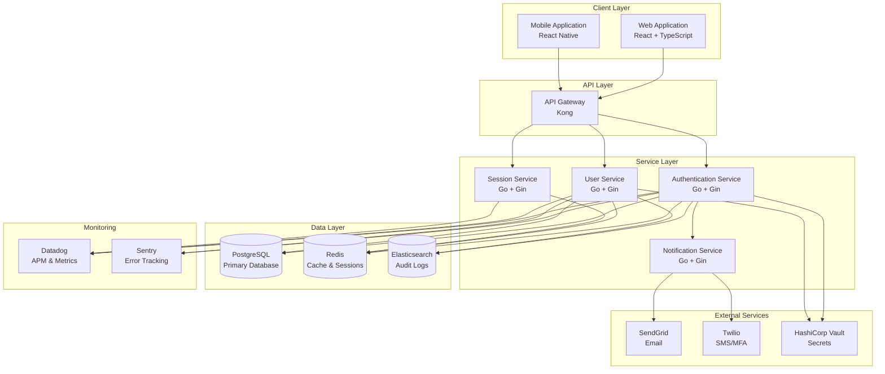
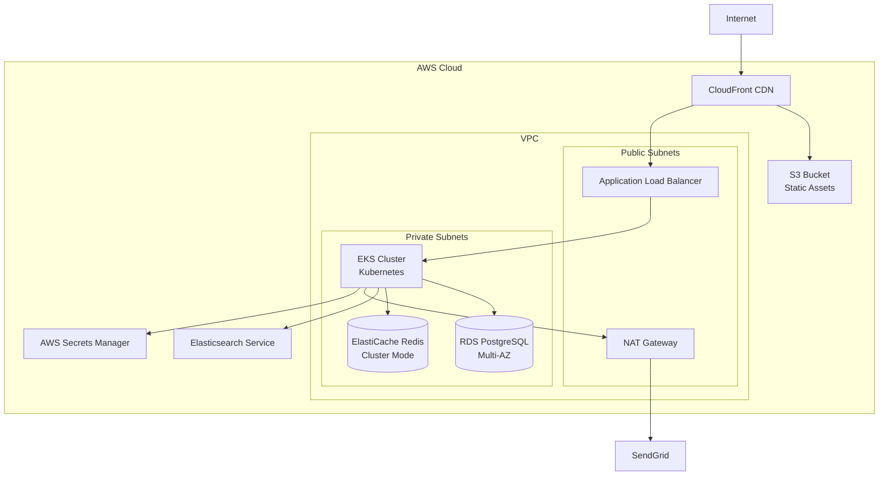
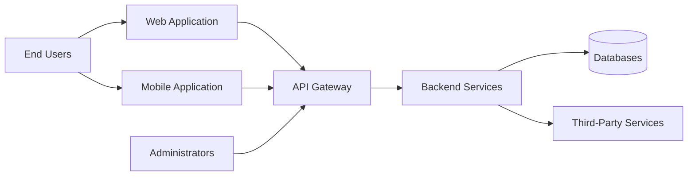
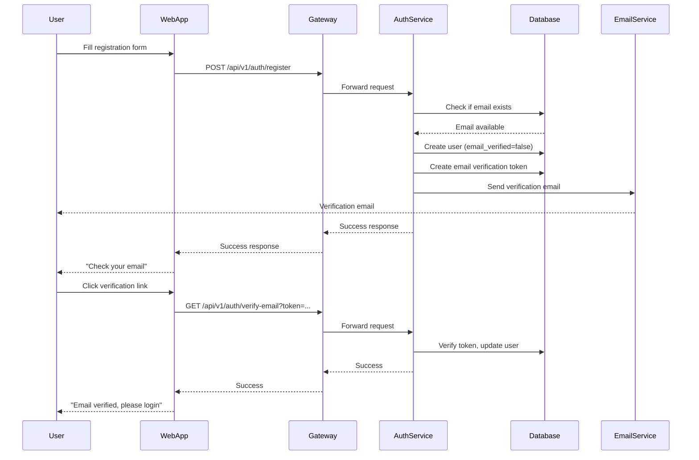

# Gate 1: Architecture Summary

## 1. Executive Summary

### Project Overview

**Feature Name**: User Registration & Authentication  
**Purpose**: Secure user onboarding and identity management system for SUMA Finance platform  
**Target Users**: 
- End users (individuals and businesses) requiring secure access to financial services
- System administrators managing user accounts and permissions
- Third-party integrations requiring authenticated API access

**Use Cases**:
- New user registration with email verification
- Secure login with multi-factor authentication (MFA)
- Password reset and account recovery
- OAuth 2.0 integration for third-party authentication
- Session management and token refresh
- Role-based access control for different user types

**Business Value Proposition**:
- Establishes trust through enterprise-grade security
- Reduces friction in user onboarding while maintaining security
- Enables regulatory compliance (GDPR, PSD2)
- Provides foundation for all authenticated features
- Supports scalability for future user growth

### Architectural Approach

**High-Level Architecture Style**: Microservices-oriented with API Gateway pattern

**Key Technology Choices**:
- Backend: Go with Gin framework for high performance and type safety
- Frontend: React with TypeScript for type-safe UI development
- Database: PostgreSQL for ACID compliance and robust data integrity
- Authentication: JWT with refresh token rotation and OAuth 2.0 support
- Infrastructure: Containerized deployment with Kubernetes orchestration

**Strategic Architectural Decisions**:
1. **JWT-based authentication** for stateless scalability with refresh token rotation for security
2. **PostgreSQL** for transactional integrity critical in financial applications
3. **API Gateway pattern** for centralized authentication, rate limiting, and monitoring
4. **Microservices architecture** for independent scaling and deployment of authentication services
5. **OAuth 2.0 integration** for future third-party authentication providers

### Key Highlights

**Major Technical Innovations**:
- Adaptive MFA with risk-based authentication triggers
- Passwordless authentication support (WebAuthn/FIDO2 ready)
- Real-time session monitoring and anomaly detection
- Zero-trust security model with continuous authentication validation

**Competitive Advantages**:
- Sub-200ms authentication response times
- 99.99% uptime SLA for authentication services
- GDPR and PSD2 compliant by design
- Seamless mobile and web experience with SSO

**Risk Mitigations**:
- Multi-region deployment for high availability
- Automated secret rotation with HashiCorp Vault
- Circuit breakers for third-party authentication providers
- Comprehensive audit logging for regulatory compliance
- Rate limiting and DDoS protection at API Gateway

## 2. Technology Stack Summary

| Layer | Technology | Purpose | Rationale |
|-------|-----------|---------|-----------|
| **Frontend** | React 18.x + TypeScript | UI Framework | Type safety, component reusability, large ecosystem |
| | Zustand | State Management | Lightweight, minimal boilerplate, excellent TypeScript support |
| | Material-UI (MUI) | UI Component Library | Accessibility, customizable, production-ready components |
| | React Hook Form | Form Management | Performance, minimal re-renders, validation support |
| | React Query | Server State | Caching, synchronization, optimistic updates |
| **Mobile** | React Native | Cross-Platform Mobile | Code sharing with web, single team, faster development |
| **Backend** | Go 1.21+ | Programming Language | Performance, concurrency, type safety, low memory footprint |
| | Gin | Web Framework | High performance, middleware support, minimal overhead |
| | gRPC | Internal Services Communication | Type-safe, high performance, bi-directional streaming |
| | JWT + OAuth 2.0 | Authentication | Industry standard, stateless, extensible |
| **Database** | PostgreSQL 15+ | Primary Database | ACID compliance, JSON support, robust indexing |
| | Redis 7+ | Cache & Session Store | Sub-millisecond latency, pub/sub, atomic operations |
| | Elasticsearch 8+ | Audit Log Search | Full-text search, log aggregation, analytics |
| **Infrastructure** | AWS | Cloud Provider | Mature services, global presence, financial services compliance |
| | Docker + Kubernetes | Containerization | Portability, scaling, resource efficiency |
| | Terraform | Infrastructure as Code | Version control, reproducibility, multi-cloud support |
| | GitHub Actions | CI/CD | Native GitHub integration, cost-effective, flexible |
| **Security** | HashiCorp Vault | Secrets Management | Dynamic secrets, encryption as a service, audit logging |
| | Let's Encrypt | SSL/TLS Certificates | Free, automated, trusted CA |
| | AWS WAF | Web Application Firewall | DDoS protection, bot mitigation, custom rules |
| **Third-Party** | SendGrid | Email Delivery | High deliverability, templates, analytics |
| | Twilio | SMS/MFA | Global coverage, programmable, reliable |
| | Datadog | Monitoring & APM | Full-stack observability, alerting, dashboards |
| | Sentry | Error Tracking | Real-time alerts, release tracking, performance monitoring |

## 3. Security Architecture Summary

### Authentication Strategy

**Authentication Methods**:
1. **Primary**: Email/password with bcrypt hashing (cost factor 12)
2. **MFA**: Time-based OTP (TOTP) and SMS-based verification
3. **OAuth 2.0**: Support for Google, Microsoft, and future providers
4. **SSO**: SAML 2.0 for enterprise customers (Phase 2)
5. **Passwordless** (Phase 3): WebAuthn/FIDO2 for biometric authentication

**Session Management**:
- Short-lived access tokens (15 minutes) with JWT
- Long-lived refresh tokens (7 days) stored in httpOnly cookies
- Automatic token refresh with sliding window
- Refresh token rotation on every use
- Device fingerprinting for anomaly detection

**Token Strategy**:
- Access Token: JWT with RS256 signing (public/private key pair)
- Claims: user_id, email, roles, permissions, issued_at, expires_at
- Refresh Token: Cryptographically random 256-bit token stored hashed in database
- Token revocation list (blacklist) with Redis TTL

### Authorization Strategy

**Access Control Model**: Hybrid RBAC (Role-Based Access Control) with attribute-based extensions

**Roles**:
- `user`: Standard authenticated user
- `premium_user`: Paid subscription user with additional features
- `admin`: System administrator
- `support`: Customer support with limited user management
- `auditor`: Read-only access for compliance auditing

**Permissions**: Granular permissions attached to roles (e.g., `users:read`, `users:write`, `transactions:approve`)

**Permission Enforcement**:
- API Gateway: Role validation before routing
- Service Layer: Permission checks with middleware
- Database Layer: Row-level security (RLS) policies
- Frontend: UI element visibility based on permissions (not security boundary)

**Role Management**:
- Roles assigned during registration (default: `user`)
- Role elevation requires admin approval with audit trail
- Dynamic permission updates without redeployment
- Separation of duties enforced (e.g., admin cannot be auditor)

### Data Protection

**Encryption at Rest**:
- Database: AWS RDS encryption with AES-256
- Backups: Encrypted with customer-managed keys (CMK)
- PII fields: Additional application-level encryption with field-level keys
- Passwords: bcrypt with salt (never reversible)

**Encryption in Transit**:
- TLS 1.3 for all external communication
- mTLS for internal service-to-service communication
- Certificate pinning for mobile applications
- HSTS headers with 1-year max-age

**Key Management**:
- HashiCorp Vault for secret storage and key management
- Automatic key rotation every 90 days
- Separate keys for different environments
- Hardware Security Module (HSM) integration for production keys

**Sensitive Data Handling**:
- PII: Encrypted at rest, masked in logs, access audited
- Payment Data: Not stored (tokenized via payment gateway)
- Session Tokens: Stored in httpOnly, secure, SameSite cookies
- Passwords: Never logged, never transmitted in plain text

### Security Compliance

**GDPR Compliance**:
- Explicit consent for data collection
- Right to data export (JSON format)
- Right to erasure (account deletion with 30-day retention)
- Data minimization (only collect necessary data)
- Privacy by design and by default
- Data Processing Agreement (DPA) with third parties

**PSD2 Compliance**:
- Strong Customer Authentication (SCA) with MFA
- Dynamic linking for payment authentication
- Secure communication standards (TLS 1.3)
- Fraud monitoring and reporting

**Security Standards**:
- OWASP Top 10 mitigation strategies implemented
- OWASP ASVS Level 2 compliance
- Regular penetration testing (quarterly)
- Vulnerability scanning in CI/CD pipeline
- Dependency scanning with Snyk

**Vulnerability Management**:
- Automated dependency updates with Dependabot
- CVE monitoring and alerting
- Security patch SLA: Critical (24h), High (7 days), Medium (30 days)
- Bug bounty program (Phase 2)

## 4. API Architecture Summary

### API Design Approach

**RESTful API Principles**:
- Resource-oriented URLs (`/api/v1/users/{id}`)
- Standard HTTP methods (GET, POST, PUT, PATCH, DELETE)
- Stateless requests with JWT in Authorization header
- HATEOAS links for resource navigation (Phase 2)
- Idempotency keys for POST/PUT operations

**API Versioning Strategy**:
- URL versioning (`/api/v1/`, `/api/v2/`)
- Version in Accept header as alternative (`Accept: application/vnd.suma.v1+json`)
- Minimum 12-month support for deprecated versions
- Deprecation warnings in response headers (`Sunset: Sat, 31 Dec 2025 23:59:59 GMT`)

**API Documentation**:
- OpenAPI 3.0 specification
- Auto-generated from code annotations
- Interactive documentation with Swagger UI
- Postman collections for testing
- Code examples in multiple languages (Go, JavaScript, Python)

### API Gateway

**Gateway Technology**: Kong API Gateway

**Rationale**:
- Open-source with enterprise support
- High performance (40k+ requests/second)
- Plugin ecosystem for extensibility
- Kubernetes-native deployment
- Built-in rate limiting, authentication, and monitoring

**Key Gateway Features**:
1. **Authentication**: JWT validation before routing to backend
2. **Rate Limiting**: Tiered limits by user role (user: 1000/hour, premium: 5000/hour, admin: unlimited)
3. **Caching**: Response caching with Redis for frequently accessed resources
4. **Request/Response Transformation**: Header injection, body transformation
5. **Circuit Breaking**: Fail fast when downstream services are unhealthy
6. **Load Balancing**: Round-robin with health checks
7. **Request ID Injection**: For distributed tracing
8. **CORS Handling**: Configurable cross-origin policies

**Request Routing**:
- `/api/v1/auth/*` → Authentication Service
- `/api/v1/users/*` → User Service
- `/api/v1/sessions/*` → Session Service
- Canary routing for gradual rollouts (10% → 50% → 100%)

### Error Handling

**Error Response Format** (RFC 7807 Problem Details):

```json
{
  "type": "https://api.suma.finance/errors/invalid-credentials",
  "title": "Invalid Credentials",
  "status": 401,
  "detail": "The email or password you entered is incorrect.",
  "instance": "/api/v1/auth/login",
  "trace_id": "550e8400-e29b-41d4-a716-446655440000",
  "timestamp": "2025-11-02T14:30:00Z"
}
```

**Error Categories**:
- `4xx`: Client errors (validation, authentication, authorization)
- `5xx`: Server errors (internal errors, service unavailable)

**Status Codes**:
- `400 Bad Request`: Invalid input
- `401 Unauthorized`: Missing or invalid authentication
- `403 Forbidden`: Insufficient permissions
- `404 Not Found`: Resource not found
- `409 Conflict`: Duplicate resource (e.g., email already exists)
- `422 Unprocessable Entity`: Validation errors
- `429 Too Many Requests`: Rate limit exceeded
- `500 Internal Server Error`: Unexpected server error
- `503 Service Unavailable`: Service temporarily down

**Error Logging**:
- All errors logged to centralized logging (Datadog)
- Error tracking with Sentry (client and server)
- Sensitive data (passwords, tokens) redacted from logs
- Stack traces included for 5xx errors

**User-Friendly Error Communication**:
- Generic messages for security errors ("Invalid credentials" instead of "User not found")
- Actionable guidance ("Check your email for verification link")
- Support contact for unresolved errors
- Error codes for support ticket reference

## 5. Data Architecture Summary

### Data Model

**Key Entities**:

1. **User**
   - `id` (UUID, PK)
   - `email` (unique, indexed)
   - `password_hash` (bcrypt)
   - `first_name`, `last_name`
   - `phone_number` (optional, encrypted)
   - `email_verified` (boolean)
   - `mfa_enabled` (boolean)
   - `created_at`, `updated_at`, `deleted_at` (soft delete)

2. **UserRole**
   - `id` (UUID, PK)
   - `user_id` (UUID, FK to User)
   - `role` (enum: user, premium_user, admin, support, auditor)
   - `assigned_by` (UUID, FK to User)
   - `assigned_at` (timestamp)

3. **RefreshToken**
   - `id` (UUID, PK)
   - `user_id` (UUID, FK to User)
   - `token_hash` (SHA-256 hash of token)
   - `device_fingerprint` (string)
   - `ip_address` (inet)
   - `user_agent` (string)
   - `expires_at` (timestamp)
   - `revoked` (boolean)
   - `created_at`

4. **MFASecret**
   - `id` (UUID, PK)
   - `user_id` (UUID, FK to User, unique)
   - `secret` (encrypted TOTP secret)
   - `backup_codes` (encrypted array of codes)
   - `created_at`, `updated_at`

5. **AuditLog**
   - `id` (UUID, PK)
   - `user_id` (UUID, FK to User, nullable)
   - `action` (enum: login, logout, register, password_reset, etc.)
   - `resource_type` (string)
   - `resource_id` (UUID)
   - `ip_address` (inet)
   - `user_agent` (string)
   - `status` (enum: success, failure)
   - `metadata` (JSONB)
   - `created_at` (timestamp, indexed)

6. **PasswordReset**
   - `id` (UUID, PK)
   - `user_id` (UUID, FK to User)
   - `token_hash` (SHA-256 hash)
   - `expires_at` (timestamp)
   - `used` (boolean)
   - `created_at`

7. **EmailVerification**
   - `id` (UUID, PK)
   - `user_id` (UUID, FK to User)
   - `token_hash` (SHA-256 hash)
   - `email` (string)
   - `expires_at` (timestamp)
   - `verified` (boolean)
   - `created_at`

**Relationships**:
- User → UserRole: One-to-Many
- User → RefreshToken: One-to-Many
- User → MFASecret: One-to-One
- User → AuditLog: One-to-Many
- User → PasswordReset: One-to-Many
- User → EmailVerification: One-to-Many

**Normalization**: 3NF (Third Normal Form) with denormalization for read-heavy queries

**Data Integrity Constraints**:
- Foreign key constraints with CASCADE on delete for user data (GDPR compliance)
- Unique constraints on email (case-insensitive)
- Check constraints on email format, password length
- NOT NULL constraints on critical fields
- Default values for timestamps (CURRENT_TIMESTAMP)

### Database Design

**Database Technology**: PostgreSQL 15+

**Selection Rationale**:
- ACID compliance for financial data integrity
- JSONB support for flexible metadata storage
- Row-level security for multi-tenant isolation
- Robust indexing (B-tree, GIN, partial indexes)
- Mature replication and backup solutions
- Excellent performance with proper indexing

**Indexing Strategy**:

```sql
-- Primary indexes (automatically created)
CREATE INDEX idx_users_email ON users(email);

-- Composite indexes
CREATE INDEX idx_refresh_tokens_user_expires ON refresh_tokens(user_id, expires_at);
CREATE INDEX idx_audit_logs_user_created ON audit_logs(user_id, created_at DESC);

-- Partial indexes (for frequently filtered queries)
CREATE INDEX idx_users_unverified ON users(email) WHERE email_verified = false;
CREATE INDEX idx_tokens_active ON refresh_tokens(user_id) WHERE revoked = false;

-- GIN indexes for JSONB
CREATE INDEX idx_audit_logs_metadata ON audit_logs USING GIN (metadata);
```

**Query Optimization**:
- Connection pooling with pgBouncer (100 max connections)
- Prepared statements for repeated queries
- Query plan analysis with `EXPLAIN ANALYZE`
- Slow query logging (queries > 100ms)
- Read replicas for reporting and analytics

**Scalability Strategy**:
- **Vertical Scaling**: db.r6g.2xlarge (8 vCPU, 64 GB RAM) for MVP, scale up as needed
- **Read Replicas**: 2 read replicas for analytics and reporting (Phase 2)
- **Sharding** (Phase 3): User-based sharding for 10M+ users
- **Connection Pooling**: pgBouncer in transaction mode
- **Table Partitioning**: Audit logs partitioned by month for performance

### Data Flow

**Data Ingestion**:
1. User submits registration form
2. API Gateway validates and forwards to Auth Service
3. Auth Service validates business rules
4. User record created in PostgreSQL
5. Email verification token generated and sent via SendGrid
6. Audit log entry created

**Data Transformation**:
- Input validation and sanitization at API layer
- Password hashing with bcrypt before storage
- PII encryption before database write
- Token hashing (SHA-256) for refresh tokens
- Normalization of email addresses (lowercase)

**Data Storage**:
- Transactional data: PostgreSQL (primary)
- Session data: Redis (TTL-based expiration)
- Audit logs: PostgreSQL (hot), Elasticsearch (cold storage for search)
- Backups: AWS S3 with lifecycle policies (daily for 30 days, weekly for 1 year)

**Caching Strategy**:
- **User Sessions**: Redis with 15-minute TTL (access token lifetime)
- **User Permissions**: Redis with 5-minute TTL (frequently checked)
- **Rate Limiting Counters**: Redis with sliding window
- **Email Verification Status**: Redis to prevent duplicate sends
- Cache invalidation on user update (email, role change)

**Search Architecture**:
- Elasticsearch for audit log search and analytics
- Daily bulk indexing from PostgreSQL
- Retention: 90 days in Elasticsearch, 7 years in PostgreSQL (compliance)
- Full-text search on action, resource_type, metadata

## 6. Frontend Architecture Summary

### Component Architecture

**Component Organization**: Feature-based with Atomic Design principles

```
src/
├── components/           # Reusable components
│   ├── atoms/           # Basic building blocks (Button, Input, Label)
│   ├── molecules/       # Simple combinations (FormField, PasswordInput)
│   ├── organisms/       # Complex components (LoginForm, RegistrationForm)
│   └── templates/       # Page layouts (AuthLayout)
├── features/            # Feature modules
│   ├── auth/
│   │   ├── components/  # Feature-specific components
│   │   ├── hooks/       # Feature-specific hooks
│   │   ├── services/    # API calls
│   │   ├── store/       # State management
│   │   └── types/       # TypeScript types
│   └── user/
├── shared/              # Shared utilities
│   ├── hooks/          # Shared custom hooks
│   ├── utils/          # Helper functions
│   └── types/          # Shared TypeScript types
└── pages/              # Route components
    ├── Login.tsx
    ├── Register.tsx
    └── ResetPassword.tsx
```

**Reusable Component Library**:
- Material-UI (MUI) as base component library
- Custom theme with SUMA Finance branding
- Shared components package for web and mobile
- Storybook for component documentation and testing

**Design System Integration**:
- Design tokens for colors, spacing, typography
- Centralized theme configuration
- Consistent component variants (primary, secondary, outlined)
- Dark mode support (Phase 2)

### State Management

**State Management Approach**: Hybrid with Zustand and React Query

**Zustand** (Client State):
- User authentication state (isAuthenticated, user, roles)
- UI state (modals, notifications, theme)
- Form state (multi-step registration progress)
- Small bundle size, minimal boilerplate

**React Query** (Server State):
- Server data fetching and caching
- Automatic refetching on window focus
- Optimistic updates for mutations
- Background synchronization

**Global State** (Zustand):
```typescript
interface AuthStore {
  user: User | null;
  accessToken: string | null;
  isAuthenticated: boolean;
  login: (email: string, password: string) => Promise<void>;
  logout: () => Promise<void>;
  refreshToken: () => Promise<void>;
}
```

**Local State** (React useState/useReducer):
- Component-specific UI state (form inputs, toggle states)
- Temporary state that doesn't need to be shared

**Server State Caching** (React Query):
- User profile: 5-minute stale time
- User permissions: 5-minute stale time
- Session info: 1-minute stale time
- Invalidation on logout or role change

### UI/UX Architecture

**Responsive Design Strategy**:
- Mobile-first approach (320px → 1920px)
- Breakpoints: xs (0px), sm (600px), md (900px), lg (1200px), xl (1536px)
- Fluid typography (clamp for font sizes)
- Flexible grid layout with CSS Grid and Flexbox
- Touch-friendly targets (minimum 44x44px)

**Accessibility Compliance**: WCAG 2.1 Level AA

- Semantic HTML (proper heading hierarchy, landmarks)
- ARIA labels for interactive elements
- Keyboard navigation support (Tab, Enter, Escape)
- Focus management (focus trap in modals)
- Color contrast ratio 4.5:1 minimum
- Screen reader tested (NVDA, JAWS)
- Form validation with accessible error messages

**Internationalization Support** (Phase 2):
- react-i18next for translations
- Language files in JSON (en, pt, es, fr)
- Locale-specific date/time formatting (date-fns)
- RTL support for Arabic, Hebrew
- Currency formatting with locale

**Performance Optimization**:
- **Code Splitting**: Route-based lazy loading (`React.lazy`)
- **Bundle Size**: Target < 200KB initial bundle (gzipped)
- **Lazy Loading**: Below-the-fold components
- **Image Optimization**: WebP format, responsive images with `srcset`
- **Tree Shaking**: ES modules for minimal bundle
- **Memoization**: `React.memo`, `useMemo`, `useCallback` for expensive computations
- **Virtual Scrolling**: For long lists (react-window)

## 7. System Architecture Highlights

### System Components



**Component Descriptions**:

1. **Web Application**: React-based SPA with TypeScript, served via CDN
2. **Mobile Application**: React Native app for iOS and Android
3. **API Gateway**: Kong gateway for routing, authentication, rate limiting
4. **Authentication Service**: User registration, login, MFA, password reset
5. **User Service**: User profile management, role assignment, account deletion
6. **Session Service**: Session management, token refresh, device tracking
7. **Notification Service**: Email and SMS sending (verification, password reset, alerts)
8. **PostgreSQL**: Primary database for user data, roles, tokens, audit logs
9. **Redis**: Cache for sessions, rate limiting, temporary data
10. **Elasticsearch**: Audit log search and analytics
11. **SendGrid**: Transactional email delivery
12. **Twilio**: SMS delivery for MFA and notifications
13. **HashiCorp Vault**: Secret storage and key management
14. **Datadog**: Application performance monitoring and metrics
15. **Sentry**: Real-time error tracking and alerting

### Communication Patterns

**Client-Server Communication**:
- **Protocol**: HTTPS (TLS 1.3)
- **Format**: JSON for REST API
- **Authentication**: JWT in Authorization header (`Bearer <token>`)
- **WebSocket** (Phase 2): Real-time session notifications (e.g., "Logged in from new device")

**Service-to-Service Communication**:
- **Internal Services**: gRPC with Protocol Buffers (faster than REST, type-safe)
- **Authentication**: mTLS with service certificates
- **Service Discovery**: Kubernetes DNS
- **Load Balancing**: Kubernetes Service with round-robin

**Event-Driven Communication** (Phase 2):
- **Message Broker**: RabbitMQ or AWS SQS
- **Events**: `user.registered`, `user.verified`, `user.login`, `user.password_reset`
- **Consumers**: Notification service, analytics service, audit service
- **Guaranteed Delivery**: At-least-once delivery with idempotency

### Deployment Architecture

**Cloud Infrastructure**: AWS



**Environment Strategy**:

| Environment | Purpose | Infrastructure | Data |
|-------------|---------|----------------|------|
| **Development** | Local development | Docker Compose | Synthetic test data |
| **Staging** | Pre-production testing | AWS EKS (smaller instances) | Anonymized production data |
| **Production** | Live system | AWS EKS (multi-AZ) | Real user data |

**Containerization**:
- **Docker**: Multi-stage builds for minimal image size
- **Base Images**: Distroless or Alpine for security
- **Image Scanning**: Trivy for vulnerability scanning in CI/CD
- **Registry**: AWS ECR with lifecycle policies

**Orchestration**:
- **Kubernetes (EKS)**: Container orchestration
- **Namespaces**: Separate namespaces per service
- **Horizontal Pod Autoscaling**: CPU/memory-based scaling
- **Resource Limits**: CPU and memory limits/requests defined
- **Health Checks**: Liveness and readiness probes

## 8. Key Architectural Decisions

### Decision 1: JWT with Refresh Token Rotation

**Context**: Need stateless authentication for scalability while maintaining security and ability to revoke access.

**Alternatives Considered**:
1. Session-based authentication (server-side sessions)
2. JWT without refresh tokens
3. OAuth 2.0 opaque tokens with introspection

**Decision**: JWT access tokens (15-minute expiry) with refresh token rotation (7-day expiry)

**Rationale**:
- **Stateless**: No server-side session storage, enables horizontal scaling
- **Security**: Short-lived access tokens limit exposure; refresh token rotation prevents token reuse
- **Revocability**: Refresh tokens can be revoked in database; access tokens expire quickly
- **Performance**: No database lookup on every request (only on token refresh)

**Consequences**:
- **Pros**: Scalable, performant, secure
- **Cons**: Cannot immediately revoke access tokens (up to 15-minute delay); requires refresh token storage in database
- **Mitigation**: Short access token lifetime reduces revocation delay; blacklist for critical security events

---

### Decision 2: PostgreSQL for Primary Database

**Context**: Need reliable, ACID-compliant database for user data and financial transactions.

**Alternatives Considered**:
1. MySQL (popular relational database)
2. MongoDB (NoSQL for flexibility)
3. DynamoDB (managed NoSQL on AWS)

**Decision**: PostgreSQL 15+

**Rationale**:
- **ACID Compliance**: Critical for financial data integrity
- **JSONB Support**: Flexible metadata storage without sacrificing relational structure
- **Advanced Indexing**: GIN indexes for JSONB, partial indexes for optimized queries
- **Row-Level Security**: Built-in multi-tenant isolation
- **Mature Ecosystem**: Robust tooling, replication, backup solutions
- **Open Source**: No vendor lock-in, large community

**Consequences**:
- **Pros**: Data integrity, flexibility, strong ecosystem
- **Cons**: Vertical scaling limits (mitigated with read replicas and eventual sharding)
- **Trade-offs**: More complex than managed NoSQL, but necessary for financial compliance

---

### Decision 3: Kong API Gateway

**Context**: Need centralized point for authentication, rate limiting, monitoring, and routing.

**Alternatives Considered**:
1. AWS API Gateway (managed service)
2. Nginx with custom Lua scripts
3. Traefik (Kubernetes-native)
4. Envoy Proxy (used in service meshes)

**Decision**: Kong API Gateway (open-source)

**Rationale**:
- **Performance**: 40k+ requests/second, low latency overhead
- **Plugin Ecosystem**: Authentication, rate limiting, caching, logging out of the box
- **Kubernetes Native**: Excellent Kubernetes integration with Kong Ingress Controller
- **Extensibility**: Custom plugins in Lua for specific needs
- **No Vendor Lock-In**: Open-source core, enterprise support available
- **Developer Experience**: Declarative configuration, easy to test locally

**Consequences**:
- **Pros**: High performance, feature-rich, flexible
- **Cons**: Requires operational knowledge; learning curve for custom plugins
- **Trade-offs**: More complex than AWS API Gateway but avoids vendor lock-in and reduces costs

---

### Decision 4: React with TypeScript for Frontend

**Context**: Need modern, maintainable, type-safe frontend framework with strong ecosystem.

**Alternatives Considered**:
1. Vue.js with TypeScript
2. Angular (TypeScript built-in)
3. Svelte (lightweight, modern)

**Decision**: React 18+ with TypeScript

**Rationale**:
- **Ecosystem**: Largest ecosystem, extensive third-party libraries
- **Type Safety**: TypeScript catches errors at compile-time
- **Talent Pool**: Large developer community, easier hiring
- **React Native**: Code sharing with mobile application (single team)
- **Performance**: Concurrent rendering, automatic batching in React 18
- **Stability**: Mature and stable, backed by Meta

**Consequences**:
- **Pros**: Strong typing, large ecosystem, code sharing with mobile
- **Cons**: Boilerplate compared to Vue/Svelte; requires build tooling
- **Trade-offs**: Slightly more verbose than alternatives but better long-term maintainability

---

### Decision 5: Microservices Architecture

**Context**: Need independent scaling, deployment, and development of authentication features.

**Alternatives Considered**:
1. Monolithic architecture (single codebase)
2. Modular monolith (modular structure, single deployment)
3. Serverless functions (AWS Lambda)

**Decision**: Microservices with Authentication Service, User Service, Session Service, Notification Service

**Rationale**:
- **Independent Scaling**: Authentication service can scale independently during peak login times
- **Independent Deployment**: Deploy new features without redeploying entire system
- **Team Autonomy**: Teams can work on services independently
- **Technology Flexibility**: Different services can use different technologies if needed
- **Fault Isolation**: Failure in notification service doesn't bring down authentication

**Consequences**:
- **Pros**: Scalability, flexibility, resilience
- **Cons**: Increased operational complexity, network latency, distributed tracing needed
- **Mitigation**: Service mesh (Phase 2), comprehensive monitoring, gRPC for low-latency internal communication

---

### Decision 6: Go for Backend Services

**Context**: Need high-performance, type-safe, concurrent backend language for authentication services.

**Alternatives Considered**:
1. Node.js with TypeScript (JavaScript ecosystem)
2. Python with FastAPI (rapid development)
3. Java with Spring Boot (enterprise standard)
4. Rust (maximum performance and safety)

**Decision**: Go 1.21+ with Gin framework

**Rationale**:
- **Performance**: Compiled language, low latency, high throughput
- **Concurrency**: Goroutines enable efficient handling of concurrent requests
- **Type Safety**: Static typing catches errors at compile-time
- **Simplicity**: Simple syntax, fast learning curve, easy to maintain
- **Standard Library**: Excellent standard library for HTTP, JSON, crypto
- **Deployment**: Single binary, minimal container images, fast startup

**Consequences**:
- **Pros**: Performance, concurrency, simplicity, small binaries
- **Cons**: Less expressive than Python; smaller ecosystem than Node.js/Java
- **Trade-offs**: Slightly more verbose error handling but better performance and reliability

## 9. Scalability and Performance

### Scalability Strategy

**Horizontal Scaling**:
- **Stateless Services**: All services designed to be stateless for horizontal scaling
- **Kubernetes**: Horizontal Pod Autoscaler (HPA) based on CPU (70% threshold) and memory (80% threshold)
- **API Gateway**: Multiple Kong instances behind load balancer
- **Database Reads**: Read replicas for analytics and reporting (Phase 2)

**Vertical Scaling**:
- **Database**: Start with db.r6g.2xlarge, scale up to db.r6g.4xlarge as needed
- **Redis**: cache.r6g.large, scale up for memory needs
- **Application Pods**: Increase CPU/memory requests as traffic grows

**Auto-Scaling Policies**:
- **Authentication Service**: Scale from 3 to 20 pods based on CPU/memory and request rate
- **User Service**: Scale from 2 to 10 pods
- **Session Service**: Scale from 2 to 15 pods (high read volume)
- **Notification Service**: Scale from 2 to 5 pods (async processing)

**Database Scaling**:
- **Connection Pooling**: pgBouncer with 100 max connections per service
- **Read Replicas** (Phase 2): 2 replicas for read-heavy queries (analytics, reporting)
- **Sharding** (Phase 3): User-based sharding for 10M+ users (shard key: user_id % 10)
- **Table Partitioning**: Audit logs partitioned by month for performance

### Performance Targets

| Metric | Target | Measurement |
|--------|--------|-------------|
| **API Response Time (p50)** | < 100ms | Datadog APM |
| **API Response Time (p95)** | < 300ms | Datadog APM |
| **API Response Time (p99)** | < 500ms | Datadog APM |
| **Page Load Time (LCP)** | < 2.5s | Google Lighthouse |
| **Time to Interactive (TTI)** | < 3.5s | Google Lighthouse |
| **First Contentful Paint (FCP)** | < 1.8s | Google Lighthouse |
| **Concurrent Users** | 10,000 (MVP), 100,000 (Phase 2) | Load testing |
| **Database Query Time (p95)** | < 50ms | PostgreSQL slow query log |
| **Cache Hit Rate** | > 90% | Redis metrics |

### Performance Optimizations

**API Layer**:
- **HTTP/2**: Multiplexing for reduced latency
- **Compression**: Gzip compression for responses > 1KB
- **Response Caching**: Kong cache plugin for frequently accessed resources (5-minute TTL)
- **Connection Pooling**: HTTP keep-alive for reduced connection overhead

**Database**:
- **Indexing**: Strategic indexes on frequently queried columns (email, user_id, created_at)
- **Query Optimization**: Prepared statements, avoiding N+1 queries
- **Connection Pooling**: pgBouncer for connection reuse
- **Read Replicas**: Offload analytics and reporting queries (Phase 2)

**Caching**:
- **Redis**: Session data, user permissions, rate limiting counters
- **Application Cache**: In-memory cache for static configuration
- **CDN**: CloudFront for static assets (images, JavaScript, CSS)
- **Browser Cache**: Cache-Control headers for static resources (1 year)

**Frontend**:
- **Code Splitting**: Route-based lazy loading, reducing initial bundle
- **Tree Shaking**: Remove unused code from bundle
- **Image Optimization**: WebP format, responsive images, lazy loading
- **Minification**: Minify JavaScript, CSS, HTML
- **Bundle Analysis**: Webpack Bundle Analyzer to identify large dependencies

**Background Processing**:
- **Async Email/SMS**: Queue-based processing for non-blocking notifications
- **Batch Operations**: Bulk token cleanup, audit log archival

## 10. Reliability and Availability

### High Availability Design

**Target Uptime SLA**: 99.99% (52 minutes downtime/year)

**Redundancy**:
- **Multi-AZ Deployment**: Services deployed across 3 availability zones (AWS)
- **Database**: RDS Multi-AZ automatic failover (< 60 seconds)
- **Redis**: ElastiCache cluster mode with automatic failover
- **Load Balancer**: Application Load Balancer distributes traffic across healthy instances
- **Multi-Region** (Phase 3): Active-active deployment in US-East and EU-West

**Failover Mechanisms**:
- **Database Failover**: Automatic RDS failover to standby replica (< 60 seconds)
- **Redis Failover**: Automatic failover to replica node (< 30 seconds)
- **Pod Restart**: Kubernetes restarts unhealthy pods automatically
- **Health Checks**: Liveness and readiness probes for all services

### Fault Tolerance

**Circuit Breakers**:
- **Third-Party Services**: Circuit breaker for SendGrid, Twilio (fail open after 5 failures in 60 seconds)
- **Internal Services**: Circuit breaker for service-to-service calls
- **Timeout Settings**: 5 seconds for email/SMS, 2 seconds for internal gRPC calls

**Retry Logic**:
- **Exponential Backoff**: Retry failed requests with exponential backoff (1s, 2s, 4s, 8s)
- **Idempotency Keys**: POST/PUT requests include idempotency key to prevent duplicate operations
- **Max Retries**: Maximum 3 retries before failing

**Graceful Degradation**:
- **MFA Unavailable**: Allow login without MFA with security alert (if Twilio down)
- **Email Unavailable**: Queue email for later delivery (if SendGrid down)
- **Analytics Unavailable**: Continue core authentication even if audit log fails
- **Cache Miss**: Fallback to database query if Redis unavailable

### Disaster Recovery

**Backup Strategy**:
- **Database Backups**: 
  - Automated daily snapshots (retained for 30 days)
  - Transaction logs for point-in-time recovery
  - Weekly backups retained for 1 year
  - Stored in S3 with cross-region replication
- **Configuration Backups**: Infrastructure as Code (Terraform) in Git
- **Secret Backups**: HashiCorp Vault snapshots (daily)

**Recovery Objectives**:
- **RTO (Recovery Time Objective)**: 1 hour (time to restore service)
- **RPO (Recovery Point Objective)**: 5 minutes (acceptable data loss)

**Disaster Recovery Plan**:
1. Detect outage (monitoring alerts)
2. Assess impact (regional vs. global)
3. Restore from latest backup (automated scripts)
4. Validate data integrity (checksums, smoke tests)
5. Resume traffic (DNS failover or load balancer)
6. Post-mortem and improvement (within 48 hours)

**Disaster Recovery Testing**:
- Quarterly DR drills to practice recovery procedures
- Annual full-scale failover test

## 11. Monitoring and Observability

### Logging

**Centralized Logging Platform**: Datadog Logs

**Structured Logging**:
- **Format**: JSON with consistent schema
- **Fields**: timestamp, level, service, trace_id, message, context (user_id, action, etc.)
- **Libraries**: Go: zap, Frontend: winston

**Example Log Entry**:
```json
{
  "timestamp": "2025-11-02T14:30:00Z",
  "level": "info",
  "service": "auth-service",
  "trace_id": "550e8400-e29b-41d4-a716-446655440000",
  "message": "User login successful",
  "user_id": "123e4567-e89b-12d3-a456-426614174000",
  "ip_address": "203.0.113.45",
  "user_agent": "Mozilla/5.0..."
}
```

**Log Levels**:
- `DEBUG`: Detailed diagnostic information (development only)
- `INFO`: General informational messages (user login, registration)
- `WARN`: Warning messages (rate limit approached, slow query)
- `ERROR`: Error messages (failed authentication, database error)
- `FATAL`: Critical errors causing service shutdown

**Log Retention Policy**:
- **Hot Storage** (Datadog): 30 days for fast search
- **Cold Storage** (S3): 7 years for compliance (GDPR, PSD2)
- **Audit Logs**: 7 years in Elasticsearch and S3

**Sensitive Data Redaction**:
- Passwords, tokens, and secrets never logged
- PII masked in logs (email: `j***@example.com`, phone: `***-***-1234`)

### Metrics and Monitoring

**Application Performance Metrics**:
- **Request Rate**: Requests per second by endpoint
- **Response Time**: p50, p95, p99 latency by endpoint
- **Error Rate**: 4xx and 5xx errors by endpoint
- **Throughput**: Requests processed per second
- **Active Users**: Concurrent authenticated users

**Infrastructure Metrics**:
- **CPU Utilization**: By pod/node
- **Memory Utilization**: By pod/node
- **Network I/O**: Bytes sent/received
- **Disk I/O**: IOPS, throughput (database)
- **Pod Health**: Running, pending, failed pods

**Business Metrics**:
- **User Registrations**: Count per hour/day
- **Login Success Rate**: Percentage of successful logins
- **MFA Adoption**: Percentage of users with MFA enabled
- **Password Resets**: Count per day
- **Session Duration**: Average session length

**Monitoring Tools**:
- **Datadog**: APM, infrastructure monitoring, custom metrics
- **Kubernetes Dashboard**: Cluster health and resource usage
- **PostgreSQL**: pg_stat_statements for query performance

**Dashboards**:
- **Service Health Dashboard**: All services, request rate, error rate, latency
- **Authentication Dashboard**: Login success/failure, MFA usage, password resets
- **Infrastructure Dashboard**: CPU, memory, disk, network by service
- **Business Metrics Dashboard**: Registrations, logins, active users

### Alerting

**Critical Alerts** (PagerDuty, Slack):
- **Service Down**: No successful requests in 5 minutes (P1 - immediate response)
- **High Error Rate**: > 5% error rate for 5 minutes (P1)
- **Database Down**: Connection failure to PostgreSQL (P1)
- **Redis Down**: Connection failure to Redis (P2 - graceful degradation)
- **High Latency**: p95 > 1 second for 5 minutes (P2)

**Warning Alerts** (Slack only):
- **Increased Error Rate**: > 1% error rate for 10 minutes
- **Slow Queries**: Database query > 500ms
- **High CPU**: > 80% CPU for 10 minutes
- **High Memory**: > 85% memory for 10 minutes
- **Low Cache Hit Rate**: < 80% for 30 minutes

**Thresholds**:
- **Error Rate**: Warning: 1%, Critical: 5%
- **Latency**: Warning: p95 > 500ms, Critical: p95 > 1s
- **CPU**: Warning: 80%, Critical: 90%
- **Memory**: Warning: 85%, Critical: 95%
- **Disk**: Warning: 80%, Critical: 90%

**On-Call Procedures**:
- 24/7 on-call rotation for production incidents
- PagerDuty escalation policy (primary → backup → manager)
- Runbooks for common incidents (database failover, pod restart)
- Post-incident review within 48 hours

### Distributed Tracing

**Tracing Implementation**: Datadog APM with OpenTelemetry

**Trace Propagation**:
- **Trace ID**: Generated at API Gateway, propagated in headers (`X-Trace-ID`)
- **Span ID**: Each service creates spans for operations
- **Context Propagation**: Automatic propagation via OpenTelemetry

**Traced Operations**:
- HTTP requests (API Gateway → Services)
- gRPC calls (Service → Service)
- Database queries (Service → PostgreSQL)
- Cache operations (Service → Redis)
- External API calls (Service → SendGrid/Twilio)

**Request Correlation**:
- All logs include trace_id for correlation
- Search logs by trace_id to see full request lifecycle
- Trace view shows waterfall of operations and timing

## 12. Development and Testing

### Development Workflow

**Version Control**: Git with GitHub

**Branching Strategy**: GitHub Flow (simplified Git Flow)
- `main`: Production-ready code (protected branch)
- `feature/<feature-name>`: Feature development branches
- `fix/<bug-name>`: Bug fix branches
- `hotfix/<issue>`: Urgent production fixes

**Workflow**:
1. Create feature branch from `main`
2. Develop and commit changes
3. Push to GitHub and create Pull Request
4. Code review (minimum 1 approval required)
5. Automated tests run in CI/CD
6. Merge to `main` after approval and passing tests
7. Automatic deployment to staging
8. Manual approval for production deployment

**Code Review Process**:
- **Required Reviewers**: Minimum 1 reviewer (2 for security-critical code)
- **Review Checklist**: Functionality, code quality, tests, documentation, security
- **Approval Required**: Cannot merge without approval
- **CI Checks**: All tests must pass before merge

**Development Environment Setup**:
- **Docker Compose**: Local development with PostgreSQL, Redis, services
- **Makefile**: Common commands (`make run`, `make test`, `make lint`)
- **Environment Variables**: `.env.local` for local overrides
- **Hot Reload**: Air for Go hot reload, Vite for React hot reload

### Testing Strategy

**Unit Testing**:
- **Backend**: Go `testing` package with `testify` assertions
- **Frontend**: Vitest with React Testing Library
- **Coverage Target**: 80% code coverage minimum
- **Scope**: Individual functions, pure logic, utility functions
- **Mocking**: Mock external dependencies (database, HTTP clients)

**Integration Testing**:
- **Backend**: Test API endpoints with test database
- **Frontend**: Test component integration with React Testing Library
- **Scope**: Service layer, database interactions, API calls
- **Test Database**: Separate PostgreSQL database for tests (cleaned between tests)

**End-to-End Testing**:
- **Tool**: Playwright for browser automation
- **Scope**: Critical user flows (registration, login, password reset, MFA)
- **Environment**: Staging environment with production-like data
- **Frequency**: Before every production deployment

**Load and Performance Testing**:
- **Tool**: k6 for load testing
- **Scenarios**: 
  - **Baseline**: 100 users, 10 requests/second
  - **Peak**: 1,000 users, 100 requests/second
  - **Stress**: 5,000 users, 500 requests/second until failure
- **Metrics**: Response time (p95, p99), error rate, throughput
- **Frequency**: Weekly on staging, before major releases

**Security Testing**:
- **Static Analysis**: Snyk for dependency vulnerabilities in CI/CD
- **Dynamic Analysis**: OWASP ZAP for penetration testing (quarterly)
- **Manual Penetration Testing**: Annual by third-party security firm
- **Scope**: OWASP Top 10, authentication/authorization bypasses, injection attacks

### Quality Assurance

**Linting and Code Formatting**:
- **Backend**: `golangci-lint` with 30+ linters (golint, govet, staticcheck, etc.)
- **Frontend**: ESLint with Airbnb config, Prettier for formatting
- **Pre-commit Hooks**: Husky runs linters before commit
- **CI Enforcement**: Linting must pass in CI/CD pipeline

**Static Code Analysis**:
- **Go**: `go vet`, `staticcheck` for bug detection
- **TypeScript**: TypeScript compiler strict mode
- **Security**: Snyk for vulnerability scanning, Semgrep for security patterns

**Automated Testing in CI/CD**:
- **Trigger**: On every push and pull request
- **Steps**:
  1. Lint code (golangci-lint, ESLint)
  2. Run unit tests with coverage
  3. Run integration tests
  4. Build Docker images
  5. Scan images for vulnerabilities (Trivy)
  6. Deploy to staging (on `main` branch)
  7. Run E2E tests on staging
  8. Manual approval for production

**Code Coverage**:
- **Target**: 80% minimum (unit + integration tests)
- **Enforcement**: CI fails if coverage drops below threshold
- **Reports**: Coverage reports uploaded to Codecov for visibility

## 13. Deployment and DevOps

### CI/CD Pipeline

**CI/CD Tool**: GitHub Actions

**Pipeline Stages**:

```yaml
# .github/workflows/main.yml
name: CI/CD Pipeline

on:
  push:
    branches: [main]
  pull_request:
    branches: [main]

jobs:
  test:
    runs-on: ubuntu-latest
    steps:
      - Checkout code
      - Setup Go, Node.js
      - Install dependencies
      - Lint code
      - Run unit tests
      - Run integration tests
      - Upload coverage to Codecov
  
  build:
    needs: test
    runs-on: ubuntu-latest
    steps:
      - Build Docker images
      - Scan images with Trivy
      - Push images to ECR
  
  deploy-staging:
    needs: build
    if: github.ref == 'refs/heads/main'
    runs-on: ubuntu-latest
    steps:
      - Deploy to staging with Helm
      - Run E2E tests with Playwright
      - Notify Slack on success/failure
  
  deploy-production:
    needs: deploy-staging
    if: github.ref == 'refs/heads/main'
    runs-on: ubuntu-latest
    environment: production
    steps:
      - Manual approval required
      - Deploy to production with Helm
      - Run smoke tests
      - Notify Slack on success/failure
```

**Deployment Environments**:

| Environment | Trigger | Purpose | Approval |
|-------------|---------|---------|----------|
| **Development** | On commit to feature branch | Developer testing | None |
| **Staging** | On merge to `main` | Pre-production testing | Automatic |
| **Production** | After staging success | Live system | Manual |

**Deployment Frequency**:
- **Staging**: Multiple times per day (on every merge to `main`)
- **Production**: 2-3 times per week (after manual approval)

### Infrastructure as Code

**IaC Tool**: Terraform

**Terraform Modules**:
- **VPC Module**: VPC, subnets, NAT gateway, security groups
- **EKS Module**: Kubernetes cluster, node groups, IAM roles
- **RDS Module**: PostgreSQL database, parameter groups, backups
- **ElastiCache Module**: Redis cluster, parameter groups
- **Secrets Module**: AWS Secrets Manager, IAM policies

**Environment Provisioning**:
```bash
# Provision staging environment
cd terraform/staging
terraform init
terraform plan
terraform apply

# Provision production environment
cd terraform/production
terraform init
terraform plan
terraform apply
```

**State Management**:
- **Backend**: S3 bucket with state locking (DynamoDB)
- **Separate State**: Different state files for staging and production
- **Version Control**: Terraform files in Git

### Deployment Strategy

**Blue-Green Deployment**:
- **Approach**: Deploy new version (green) alongside current version (blue)
- **Traffic Shift**: Gradually shift traffic from blue to green (10% → 50% → 100%)
- **Rollback**: Instant rollback by shifting traffic back to blue
- **Implementation**: Kubernetes Service with weighted pods

**Canary Releases**:
- **Approach**: Deploy new version to small subset of users (5-10%)
- **Monitoring**: Monitor error rate, latency, user feedback
- **Gradual Rollout**: Increase to 25% → 50% → 100% if metrics are healthy
- **Automated Rollback**: If error rate > threshold, automatic rollback

**Feature Flags**:
- **Tool**: LaunchDarkly or custom solution (Phase 2)
- **Use Cases**: Gradual feature rollout, A/B testing, kill switch for problematic features
- **Example**: `mfa_required` flag to enforce MFA for specific user segments

**Rollback Procedures**:
- **Kubernetes Rollback**: `kubectl rollout undo deployment/auth-service`
- **Database Rollback**: Restore from latest backup (if schema change)
- **DNS Rollback**: Switch load balancer target to previous version
- **Time Limit**: Rollback decision within 15 minutes of deployment

## 14. Cross-Cutting Concerns

### Error Handling

**Centralized Error Handling**:
- **Backend**: Middleware catches all errors, formats response, logs error
- **Frontend**: Error boundary component catches React errors, displays fallback UI

**Error Response Format** (RFC 7807):
```json
{
  "type": "https://api.suma.finance/errors/validation-error",
  "title": "Validation Error",
  "status": 422,
  "detail": "Password must be at least 8 characters",
  "instance": "/api/v1/auth/register",
  "trace_id": "550e8400-e29b-41d4-a716-446655440000",
  "errors": [
    {
      "field": "password",
      "message": "Password must be at least 8 characters"
    }
  ]
}
```

**Error Logging**:
- All errors logged to Datadog with trace_id, user_id, context
- Critical errors (5xx) sent to Sentry for real-time alerts
- Error aggregation by type for trend analysis

**User Error Communication**:
- **Client Errors (4xx)**: Display actionable error message to user
- **Server Errors (5xx)**: Display generic error message, log trace_id for support
- **Network Errors**: Display offline message, retry button
- **Validation Errors**: Display field-specific error messages

### Internationalization

**Multi-Language Support** (Phase 2):
- **Languages**: English (default), Portuguese, Spanish, French
- **Library**: react-i18next for translations
- **Translation Files**: JSON files in `src/locales/` (`en.json`, `pt.json`, etc.)
- **Dynamic Loading**: Lazy load translation files to reduce initial bundle size

**Locale-Specific Formatting**:
- **Dates**: Use `date-fns` with locale (`format(date, 'PPP', { locale: pt })`)
- **Numbers**: Use `Intl.NumberFormat` for locale-specific formatting
- **Currency**: Use `Intl.NumberFormat` with currency code (`EUR`, `USD`)
- **Time Zones**: Use user's time zone for display, store UTC in database

**Translation Management**:
- **Source of Truth**: JSON files in Git
- **Translation Platform** (Phase 2): Lokalise for translator collaboration
- **Missing Translations**: Fallback to English with warning in logs

### Accessibility

**WCAG 2.1 Level AA Compliance**:

**Semantic HTML**:
- Proper heading hierarchy (`<h1>` → `<h2>` → `<h3>`)
- Landmark elements (`<header>`, `<nav>`, `<main>`, `<footer>`)
- Semantic elements (`<button>`, `<a>`, `<form>`, `<label>`)

**ARIA Labels**:
- `aria-label` for icon-only buttons
- `aria-labelledby` for complex controls
- `aria-describedby` for additional context
- `aria-live` for dynamic content updates

**Keyboard Navigation**:
- All interactive elements accessible via Tab
- Enter/Space to activate buttons and links
- Escape to close modals and dropdowns
- Arrow keys for menu navigation
- Focus trap in modals (prevent tabbing out)

**Color Contrast**:
- Minimum 4.5:1 contrast ratio for normal text
- Minimum 3:1 contrast ratio for large text (18pt+)
- Color not sole indicator of meaning (use icons, text)

**Screen Reader Testing**:
- Tested with NVDA (Windows), JAWS (Windows), VoiceOver (macOS/iOS)
- Alt text for all images
- Form labels associated with inputs
- Error messages announced to screen readers

**Accessibility Testing**:
- Automated testing with axe-core in CI/CD
- Manual testing with keyboard and screen reader
- WCAG audit before production launch

### Analytics

**User Behavior Tracking**:
- **Tool**: Google Analytics 4 or Mixpanel
- **Events**: Page views, button clicks, form submissions, errors
- **User Properties**: User ID (hashed), account type, registration date
- **Privacy**: Cookie consent required (GDPR), opt-out option

**Conversion Tracking**:
- **Funnel**: Landing page → Registration → Email verification → First login
- **Drop-off Points**: Track where users abandon registration flow
- **A/B Testing**: Test variations of registration form (Phase 2)

**Privacy Compliance**:
- **Cookie Consent**: Banner with accept/reject options (GDPR)
- **Opt-Out**: Users can disable analytics in account settings
- **Data Anonymization**: IP addresses anonymized, no PII tracked
- **Data Retention**: Analytics data retained for 26 months (Google Analytics default)

## 15. Third-Party Integrations

### Integration Summary

| Service | Purpose | Integration Pattern | Data Sharing |
|---------|---------|---------------------|--------------|
| **SendGrid** | Transactional emails | REST API | Email address, first name |
| **Twilio** | SMS for MFA | REST API | Phone number |
| **Datadog** | Monitoring & APM | Agent + API | Application metrics, logs |
| **Sentry** | Error tracking | SDK | Error details, stack traces |
| **HashiCorp Vault** | Secret management | API | Secrets retrieval only |
| **Snyk** | Vulnerability scanning | CLI + API | Codebase, dependencies |
| **Google Analytics** | User analytics | JavaScript SDK | Anonymized user behavior |

### Key Integrations

**Payment Processing** (Phase 2):
- **Provider**: Stripe or Adyen
- **Integration**: Stripe SDK, webhook for payment events
- **Security**: PCI-DSS Level 1 compliance via tokenization (no card data stored)

**Email/SMS Notifications**:
- **Email**: SendGrid with templates for verification, password reset, alerts
- **SMS**: Twilio Verify API for MFA codes
- **Fallback**: Secondary provider (Amazon SES, Mailgun) if primary fails

**Analytics and Monitoring**:
- **Datadog**: APM, infrastructure monitoring, log aggregation
- **Sentry**: Real-time error tracking, release tracking, performance monitoring
- **Google Analytics**: User behavior, conversion tracking, funnel analysis

**Authentication Providers** (Phase 2):
- **OAuth 2.0**: Google, Microsoft, GitHub
- **SAML 2.0**: Okta, Auth0 for enterprise SSO
- **WebAuthn**: FIDO2 for passwordless authentication

## 16. Security Considerations

### Security Measures

**Authentication**:
- Passwords hashed with bcrypt (cost factor 12)
- JWT with RS256 signing (asymmetric keys)
- Refresh token rotation on every use
- Account lockout after 5 failed login attempts (15-minute cooldown)

**Authorization**:
- Role-Based Access Control (RBAC) with granular permissions
- Permission checks at API Gateway, service layer, and database (RLS)
- Least privilege principle for service accounts

**Data Encryption**:
- TLS 1.3 for all external communication
- mTLS for internal service-to-service communication
- AES-256 encryption at rest (database, backups)
- Field-level encryption for PII

**Input Validation**:
- Whitelist validation for all inputs
- Schema validation with JSON Schema
- SQL injection prevention with parameterized queries
- XSS prevention with React's automatic escaping

**CSRF Protection**:
- SameSite=Lax cookies for session tokens
- CSRF tokens for state-changing operations
- Origin and Referer header validation

**XSS Protection**:
- Content Security Policy (CSP) headers
- React's automatic HTML escaping
- Sanitization of user-generated content (DOMPurify)

### Compliance

**GDPR Compliance**:
- **Lawful Basis**: Consent or contractual necessity
- **Data Minimization**: Only collect necessary data
- **Right to Access**: Users can export their data (JSON format)
- **Right to Erasure**: Users can delete their account (30-day retention)
- **Right to Portability**: Export data in machine-readable format
- **Data Breach Notification**: Notify users within 72 hours

**PSD2 Compliance** (Payment Services Directive):
- **Strong Customer Authentication (SCA)**: MFA for login and payments
- **Dynamic Linking**: Transaction details tied to authentication
- **Secure Communication**: TLS 1.3, certificate pinning

**Security Standards**:
- **OWASP Top 10**: Mitigation strategies for all 10 vulnerabilities
- **OWASP ASVS Level 2**: Application Security Verification Standard compliance
- **CIS Benchmarks**: Infrastructure hardening following CIS guidelines

### Vulnerability Management

**Dependency Scanning**:
- **Tool**: Snyk integrated in CI/CD pipeline
- **Frequency**: On every pull request and daily scheduled scans
- **Auto-Remediation**: Automated pull requests for vulnerability fixes
- **SLA**: Critical vulnerabilities fixed within 24 hours

**Security Patching**:
- **Process**: Security patches prioritized, tested, and deployed quickly
- **SLA**: 
  - Critical: 24 hours
  - High: 7 days
  - Medium: 30 days
  - Low: Next sprint

**Penetration Testing**:
- **Frequency**: Quarterly automated scans (OWASP ZAP), annual manual testing
- **Scope**: Web application, APIs, infrastructure
- **Third-Party**: Annual penetration test by accredited firm
- **Remediation**: Vulnerabilities fixed before production launch

**Bug Bounty Program** (Phase 2):
- **Platform**: HackerOne or Bugcrowd
- **Scope**: Web application, APIs (excluding third-party services)
- **Rewards**: $100 (low) to $5,000 (critical)

## 17. Cost Considerations

### Infrastructure Costs (Estimated Monthly)

| Resource | Specification | Cost (USD) |
|----------|---------------|------------|
| **EKS Cluster** | 1 cluster | $73 |
| **EC2 Instances (Nodes)** | 3x t3.medium (staging) | $75 |
| | 6x t3.large (production) | $300 |
| **RDS PostgreSQL** | db.r6g.2xlarge (Multi-AZ) | $600 |
| **ElastiCache Redis** | cache.r6g.large (cluster) | $200 |
| **Application Load Balancer** | 2 ALBs | $40 |
| **CloudFront CDN** | 1TB data transfer | $85 |
| **S3 Storage** | 500GB (backups, assets) | $12 |
| **Elasticsearch** | 3-node cluster (t3.medium) | $150 |
| **Data Transfer** | 2TB outbound | $180 |
| **Third-Party Services** | | |
| SendGrid | 100k emails/month | $20 |
| Twilio | 10k SMS/month | $75 |
| Datadog | 10 hosts, 100GB logs | $300 |
| Sentry | 100k events/month | $29 |
| HashiCorp Vault | Self-hosted (included in EC2) | $0 |
| **Total** | | **~$2,139/month** |

*Note: Costs are estimates for MVP (10k users). Production costs will scale with usage.*

### Cost Optimization Strategies

**Right-Sizing Resources**:
- Start with smaller instances (t3.medium for staging, t3.large for production)
- Monitor CPU/memory utilization, upsize if needed (80%+ sustained usage)
- Downsize during low-traffic periods (nights, weekends)

**Caching**:
- Redis caching reduces database queries (fewer RDS reads)
- CloudFront caching reduces origin requests (lower bandwidth costs)
- API response caching reduces compute (fewer pod CPU cycles)

**Reserved Instances**:
- 1-year reserved instances for predictable workloads (30% savings)
- Savings Plans for EC2, RDS, ElastiCache (up to 72% savings)

**Serverless for Variable Workloads**:
- AWS Lambda for low-frequency tasks (audit log archival, token cleanup)
- Avoid idle compute costs (pay only when code runs)

**Spot Instances** (Phase 2):
- Use spot instances for non-critical workloads (background jobs, testing)
- Up to 90% savings compared to on-demand instances

**Storage Lifecycle Policies**:
- S3 lifecycle policies to move old backups to Glacier (90% cheaper)
- Delete old logs after retention period (reduce storage costs)

### Cost Monitoring

**Cost Allocation**:
- Tag all resources by environment (dev, staging, production) and service (auth, user, session)
- AWS Cost Explorer to track spending by tag
- Chargeback reports for finance team

**Budget Alerts**:
- AWS Budgets with alerts at 80%, 90%, 100% of budget
- Daily cost anomaly detection (alert if cost > 20% above baseline)
- Slack notifications for budget alerts

**Cost Dashboards**:
- Monthly cost dashboard in Datadog or Grafana
- Cost by service, environment, resource type
- Cost trends over time

## 18. Risks and Mitigation

### Technical Risks

**Risk 1: JWT Security (Token Theft)**
- **Description**: Access tokens could be stolen via XSS or man-in-the-middle attacks
- **Likelihood**: Medium
- **Impact**: High (unauthorized access to user accounts)
- **Mitigation**:
  - Short access token lifetime (15 minutes)
  - Refresh token rotation
  - HttpOnly, Secure, SameSite cookies
  - Content Security Policy (CSP) headers
  - TLS 1.3 with certificate pinning

**Risk 2: Database Scalability (PostgreSQL Vertical Scaling Limits)**
- **Description**: PostgreSQL has vertical scaling limits; may not handle 10M+ users
- **Likelihood**: Low (Phase 3 concern)
- **Impact**: High (service degradation or downtime)
- **Mitigation**:
  - Read replicas for read-heavy queries
  - Connection pooling with pgBouncer
  - Sharding strategy planned for Phase 3
  - Monitor database performance early

**Risk 3: Third-Party Dependency (SendGrid, Twilio Outages)**
- **Description**: Email/SMS services could go down, blocking registration/MFA
- **Likelihood**: Low
- **Impact**: Medium (user frustration, support tickets)
- **Mitigation**:
  - Circuit breakers with graceful degradation
  - Secondary email provider (Amazon SES) as fallback
  - Queue emails for retry if service down
  - Monitoring and alerting for third-party failures

**Risk 4: Kubernetes Operational Complexity**
- **Description**: Kubernetes requires specialized knowledge; misconfigurations can cause outages
- **Likelihood**: Medium
- **Impact**: High (downtime, data loss)
- **Mitigation**:
  - Managed Kubernetes (AWS EKS) reduces operational burden
  - Infrastructure as Code (Terraform) for reproducibility
  - Training for DevOps team
  - Runbooks for common issues
  - External Kubernetes expertise (consultant or managed service)

**Risk 5: Security Vulnerabilities (Zero-Day Exploits)**
- **Description**: Unpatched vulnerabilities in dependencies or platform
- **Likelihood**: Medium
- **Impact**: Critical (data breach, regulatory fines)
- **Mitigation**:
  - Automated dependency scanning with Snyk
  - Security patch SLA (critical within 24 hours)
  - Web Application Firewall (AWS WAF) for known attack patterns
  - Penetration testing (quarterly automated, annual manual)
  - Bug bounty program (Phase 2)

### Mitigation Strategies

**Proof of Concepts (PoCs)**:
- JWT implementation PoC to validate security and performance
- Kubernetes deployment PoC to validate autoscaling and failover
- Load testing PoC to validate performance targets

**Fallback Plans**:
- Email service down: Queue for retry, use secondary provider
- Redis down: Fallback to database for session validation (slower but functional)
- MFA service down: Allow login without MFA with security alert

**Security Audits**:
- Pre-launch security audit by third-party firm
- Quarterly automated penetration testing (OWASP ZAP)
- Annual manual penetration testing
- Bug bounty program for ongoing vulnerability discovery

**Vendor Lock-In Avoidance**:
- Use open-source tools where possible (PostgreSQL, Redis, Kubernetes)
- Avoid AWS-specific services where alternatives exist (use RDS vs. Aurora)
- Infrastructure as Code (Terraform) supports multi-cloud deployment
- Abstract third-party integrations behind interfaces (easy to swap providers)

### Assumptions and Dependencies

**Assumptions**:
1. User base grows gradually (not viral overnight growth)
2. Majority of users access via web (mobile is 30% of traffic)
3. Average session duration: 30 minutes
4. Majority of users in single region (US or EU)
5. MFA adoption: 50% within 6 months of launch

**External Dependencies**:
1. **AWS**: Cloud infrastructure provider (mitigation: multi-cloud in Phase 3)
2. **SendGrid**: Email delivery (mitigation: secondary provider)
3. **Twilio**: SMS delivery (mitigation: alternative MFA methods)
4. **GitHub**: Code hosting and CI/CD (mitigation: GitLab as alternative)
5. **Datadog**: Monitoring and observability (mitigation: self-hosted Prometheus/Grafana)

**Validation Plans**:
- **Assumption 1**: Monitor user growth weekly, prepare scaling plan if viral
- **Assumption 2**: Track mobile vs. web traffic, prioritize mobile if needed
- **Assumption 3**: Monitor average session duration, adjust token lifetime if needed
- **Assumption 4**: Monitor traffic by region, deploy multi-region if needed
- **Assumption 5**: Monitor MFA adoption, incentivize if low (e.g., require for sensitive actions)

## 19. Implementation Roadmap

### Phase 1: MVP (Minimum Viable Product) - Weeks 1-8

**Core Features**:
- User registration with email verification
- Login with email/password
- JWT-based authentication with refresh tokens
- Basic role-based access control (user, admin)
- Password reset functionality
- User profile management
- Session management
- Audit logging

**Essential Integrations**:
- SendGrid for email delivery
- Redis for session storage
- PostgreSQL for user data

**Basic Security and Monitoring**:
- TLS 1.3 for encryption in transit
- bcrypt for password hashing
- Rate limiting at API Gateway
- Basic logging to Datadog
- Error tracking with Sentry

**Deliverables**:
- Authentication Service (Go)
- User Service (Go)
- Session Service (Go)
- Web Application (React)
- API Gateway (Kong)
- PostgreSQL database with schema
- Redis cache
- CI/CD pipeline (GitHub Actions)
- Deployment to staging and production (AWS EKS)

**Success Criteria**:
- Users can register, verify email, login, reset password
- Sub-200ms p95 API response time
- 80% test coverage
- Zero critical security vulnerabilities

---

### Phase 2: Enhancement - Weeks 9-16

**Additional Features**:
- Multi-factor authentication (TOTP, SMS)
- OAuth 2.0 integration (Google, Microsoft)
- Account lockout after failed login attempts
- Device management (view and revoke sessions)
- Enhanced audit logging with Elasticsearch
- User roles and permissions management
- Email preferences and notification settings

**Performance Optimizations**:
- Read replicas for PostgreSQL
- Enhanced caching strategy
- Code splitting and lazy loading (frontend)
- Image optimization and CDN
- Database query optimization

**Enhanced Monitoring**:
- Custom dashboards (authentication, business metrics)
- Advanced alerting with PagerDuty
- Distributed tracing with Datadog APM
- Synthetic monitoring (uptime checks)

**Deliverables**:
- MFA Service (TOTP, SMS via Twilio)
- OAuth 2.0 integration (Google, Microsoft)
- Enhanced notification service
- Elasticsearch for audit log search
- Read replicas for PostgreSQL
- Advanced monitoring dashboards
- Mobile application (React Native) - Phase 2A

**Success Criteria**:
- MFA adoption > 30%
- OAuth login > 20% of total logins
- Sub-300ms p95 API response time with 10x traffic
- 99.9% uptime SLA achieved

---

### Phase 3: Scale - Weeks 17-24

**Advanced Scalability Features**:
- Multi-region deployment (US-East, EU-West)
- Database sharding for 10M+ users
- Advanced auto-scaling policies
- Global load balancing with Route 53
- Edge caching with CloudFront

**Advanced Security**:
- WebAuthn/FIDO2 for passwordless authentication
- SAML 2.0 for enterprise SSO
- Advanced fraud detection and anomaly detection
- Bug bounty program
- SOC 2 Type II compliance

**Advanced Analytics**:
- User behavior analytics
- Conversion funnel analysis
- A/B testing framework
- Business intelligence dashboards

**Deliverables**:
- Multi-region deployment (active-active)
- Database sharding implementation
- WebAuthn integration
- SAML 2.0 for enterprise SSO
- Advanced fraud detection
- SOC 2 audit and certification

**Success Criteria**:
- 99.99% uptime SLA achieved
- Support for 100,000 concurrent users
- Sub-200ms p95 global response time (multi-region)
- SOC 2 Type II certified

---

### Timeline and Milestones

| Milestone | Week | Deliverable |
|-----------|------|-------------|
| **Kickoff** | Week 0 | Team onboarding, environment setup |
| **Design Complete** | Week 2 | Database schema, API contracts, UI mockups |
| **Backend MVP** | Week 4 | Authentication, User, Session services functional |
| **Frontend MVP** | Week 6 | Web application with login, register, profile |
| **MVP Launch** | Week 8 | Production deployment of MVP |
| **MFA Integration** | Week 10 | TOTP and SMS MFA functional |
| **OAuth Integration** | Week 12 | Google and Microsoft login functional |
| **Mobile App** | Week 14 | React Native app for iOS and Android |
| **Phase 2 Launch** | Week 16 | Production deployment of enhancements |
| **Multi-Region** | Week 20 | Active-active deployment in US and EU |
| **WebAuthn** | Week 22 | Passwordless authentication functional |
| **Phase 3 Launch** | Week 24 | Production deployment of scale features |

---

### Dependencies and Blockers

**Dependencies**:
1. **AWS Account Setup**: Required for infrastructure provisioning (Week 0)
2. **SendGrid Account**: Required for email sending (Week 1)
3. **Twilio Account**: Required for SMS MFA (Week 9)
4. **Domain Name**: Required for production deployment (Week 6)
5. **SSL Certificate**: Required for HTTPS (Week 6, automated with Let's Encrypt)
6. **Design Mockups**: Required for frontend development (Week 2)
7. **Legal Review**: Privacy policy, terms of service (Week 7)

**Potential Blockers**:
1. **Database Schema Changes**: Breaking changes require careful migration planning
2. **Third-Party Service Outages**: SendGrid, Twilio could delay testing
3. **Security Audit Findings**: Critical vulnerabilities could delay launch
4. **Regulatory Compliance**: GDPR, PSD2 requirements could add scope

**Mitigation**:
- Early setup of third-party accounts (Week 0)
- Database migration strategy planned from start (Alembic or golang-migrate)
- Fallback providers for critical third-party services
- Legal and compliance review in parallel with development
- Security audit scheduled before launch with buffer time

## 20. Success Criteria

### Technical Success Metrics

| Metric | Target | Measurement |
|--------|--------|-------------|
| **Uptime SLA** | 99.99% | Datadog uptime monitoring |
| **API Response Time (p95)** | < 300ms | Datadog APM |
| **Page Load Time (LCP)** | < 2.5s | Google Lighthouse, Real User Monitoring |
| **Test Coverage** | > 80% | Codecov |
| **Security Vulnerabilities** | 0 critical, 0 high | Snyk, penetration tests |
| **Error Rate** | < 0.1% | Sentry, Datadog |
| **Database Query Time (p95)** | < 50ms | PostgreSQL slow query log |
| **Cache Hit Rate** | > 90% | Redis metrics |

### Business Success Metrics

| Metric | Target | Measurement |
|--------|--------|-------------|
| **User Registrations** | 10,000 (6 months) | Analytics, database |
| **Registration Completion Rate** | > 70% | Funnel analysis (landing → verified) |
| **Login Success Rate** | > 95% | Audit logs |
| **MFA Adoption** | > 50% (6 months) | Database query |
| **OAuth Adoption** | > 30% (6 months) | Database query |
| **Average Session Duration** | > 20 minutes | Analytics |
| **User Retention (30-day)** | > 60% | Analytics cohort analysis |
| **Support Tickets (Auth Issues)** | < 5% of users | Support system |

### Operational Success Metrics

| Metric | Target | Measurement |
|--------|--------|-------------|
| **Deployment Frequency** | > 2 per week | GitHub Actions logs |
| **Mean Time to Recovery (MTTR)** | < 30 minutes | Incident reports |
| **Incident Frequency** | < 2 per month | PagerDuty alerts |
| **Failed Deployment Rate** | < 5% | CI/CD pipeline logs |
| **Time to Provision Environment** | < 15 minutes | Terraform apply time |
| **Security Patch SLA Compliance** | 100% | Security audit log |

## 21. Team and Responsibilities

### Development Team Structure

**Frontend Team** (2 engineers):
- React web application development
- React Native mobile application
- UI/UX implementation
- Frontend testing (unit, integration, E2E)
- Accessibility compliance

**Backend Team** (3 engineers):
- Go microservices development (Auth, User, Session, Notification)
- API design and implementation
- Database schema design and optimization
- Backend testing (unit, integration, load)
- Third-party integrations (SendGrid, Twilio)

**DevOps Team** (1 engineer):
- Infrastructure provisioning (Terraform)
- CI/CD pipeline setup (GitHub Actions)
- Kubernetes cluster management
- Monitoring and alerting setup (Datadog, Sentry)
- Incident response and on-call

**QA Team** (1 engineer):
- Test planning and execution
- E2E test automation (Playwright)
- Load testing (k6)
- Security testing coordination
- Bug tracking and regression testing

### Key Roles

**Solution Architect** (1 person):
- Overall system architecture design
- Technology selection and evaluation
- Architectural decision records (ADRs)
- Technical leadership and mentorship
- Code review for architecture-critical changes

**Tech Lead** (1 person):
- Sprint planning and task breakdown
- Code review and quality assurance
- Technical guidance for team
- Cross-team coordination
- Performance and scalability optimization

**Product Owner** (1 person):
- Feature prioritization and roadmap
- User story creation and acceptance criteria
- Stakeholder communication
- Acceptance testing
- Backlog grooming

**Security Lead** (0.5 FTE, shared):
- Security architecture review
- Penetration testing coordination
- Vulnerability management
- Security training for team
- Compliance monitoring (GDPR, PSD2)

**Project Manager** (0.5 FTE, shared):
- Sprint planning and retrospectives
- Risk management
- Timeline and milestone tracking
- Status reporting to stakeholders
- Resource allocation

### Communication and Collaboration

**Daily Stand-ups** (15 minutes):
- What did you do yesterday?
- What will you do today?
- Any blockers?

**Sprint Planning** (Bi-weekly, 2 hours):
- Review backlog
- Estimate stories (story points)
- Commit to sprint goal
- Assign tasks

**Sprint Review/Demo** (Bi-weekly, 1 hour):
- Demo completed features
- Gather feedback from stakeholders
- Update roadmap based on feedback

**Sprint Retrospective** (Bi-weekly, 1 hour):
- What went well?
- What could be improved?
- Action items for next sprint

**Architecture Review** (Weekly, 1 hour):
- Review proposed architecture changes
- Discuss architectural decisions
- ADR creation and review
- Knowledge sharing

**Cross-Team Dependencies**:
- Frontend depends on Backend for API contracts
- Backend depends on DevOps for infrastructure
- QA depends on Frontend/Backend for testable builds
- All teams depend on Security for compliance guidance

**Communication Channels**:
- **Slack**: Daily communication, quick questions
- **GitHub**: Code review, pull requests, issue tracking
- **Confluence**: Documentation, ADRs, runbooks
- **Zoom**: Meetings, pairing sessions

## 22. Documentation and Knowledge Transfer

### Architecture Documentation

**Gate 0 Requirements**:
- Requirements document with functional and non-functional requirements
- User stories and acceptance criteria
- Business goals and success metrics

**Gate 1 Architecture Documents**:
- **This Document**: Gate 1 Summary (comprehensive architecture overview)
- **Security Architecture**: Authentication, authorization, encryption, compliance
- **API Architecture**: API design, API Gateway, error handling
- **Data Architecture**: Data model, database design, data flow
- **Frontend Architecture**: Component architecture, state management, UI/UX
- **System Architecture**: System components, deployment architecture

**Detailed Architecture Documents** (Created in Phase 2):
- Database Schema Documentation (ERD, table descriptions)
- API Documentation (OpenAPI/Swagger)
- Deployment Architecture (network diagrams, infrastructure as code)
- Monitoring and Alerting (dashboard descriptions, alert policies)

### Operational Documentation

**Runbooks**:
- **Database Failover**: Steps to manually failover RDS
- **Pod Restart**: Restart unhealthy Kubernetes pods
- **Certificate Renewal**: Renew SSL certificates (automated with Let's Encrypt)
- **Backup Restore**: Restore database from backup
- **Security Incident Response**: Steps for security incidents

**Troubleshooting Guides**:
- **High Latency**: Diagnose and fix slow API responses
- **High Error Rate**: Diagnose and fix increased errors
- **Database Connection Issues**: Fix connection pool exhaustion
- **Redis Connection Issues**: Diagnose and fix cache failures
- **Third-Party Service Down**: Handle SendGrid or Twilio outages

**Deployment Procedures**:
- **Deploy to Staging**: Automated via GitHub Actions on merge to `main`
- **Deploy to Production**: Manual approval in GitHub Actions
- **Rollback**: Revert to previous deployment
- **Database Migration**: Apply schema changes safely

### Developer Onboarding

**Setup Guides**:
- **Local Development Setup**: Install dependencies, run services with Docker Compose
- **IDE Configuration**: VSCode settings, extensions, debugging
- **Git Workflow**: Branching strategy, commit conventions, pull requests
- **Testing**: Run unit tests, integration tests, E2E tests locally

**Code Conventions**:
- **Go**: `golangci-lint` rules, naming conventions, error handling
- **TypeScript**: ESLint Airbnb config, naming conventions, component structure
- **Commit Messages**: Conventional Commits format (`feat:`, `fix:`, `docs:`)
- **Pull Requests**: PR template, review checklist

**Architecture Decision Records (ADRs)**:
- Document all major architectural decisions
- Format: Context, Decision, Alternatives, Rationale, Consequences
- Stored in `docs/adr/` directory in Git
- Examples: JWT authentication, PostgreSQL selection, Kong API Gateway

## 23. Next Steps

### Immediate Actions (Week 0)

**1. Team Onboarding**:
- Kickoff meeting with full team
- Review Gate 0 requirements and Gate 1 architecture
- Assign roles and responsibilities
- Set up communication channels (Slack, GitHub, Confluence)

**2. Environment Setup**:
- Set up AWS account and IAM roles
- Provision development environments with Terraform
- Set up GitHub repository and branching strategy
- Configure CI/CD pipeline (GitHub Actions)

**3. Third-Party Account Setup**:
- Create SendGrid account for email
- Create Twilio account for SMS
- Create Datadog account for monitoring
- Create Sentry account for error tracking
- Create HashiCorp Vault instance (self-hosted or cloud)

**4. Design Finalization**:
- Database schema design (ERD, tables, relationships)
- API contract design (OpenAPI spec)
- UI mockups and design system (Figma)
- Infrastructure architecture diagram

---

### Gate 2 Preparation (Weeks 1-2)

**1. Detailed Technical Specifications**:
- **Authentication Service Spec**: Endpoints, request/response formats, business logic
- **User Service Spec**: Endpoints, request/response formats, business logic
- **Session Service Spec**: Endpoints, request/response formats, business logic
- **Notification Service Spec**: Email templates, SMS templates, trigger logic

**2. Component-Level Design**:
- **Backend**: Package structure, module design, dependency injection
- **Frontend**: Component hierarchy, state management design, routing
- **API Gateway**: Route configuration, plugin setup, rate limiting rules

**3. Database Schema Finalization**:
- **Tables**: Users, UserRoles, RefreshTokens, MFASecrets, AuditLogs, PasswordResets, EmailVerifications
- **Indexes**: Strategic indexes for query performance
- **Constraints**: Foreign keys, unique constraints, check constraints
- **Migrations**: Initial migration scripts (Alembic or golang-migrate)

**4. API Contract Finalization**:
- **OpenAPI Specification**: Complete API documentation
- **Authentication Endpoints**: `/auth/register`, `/auth/login`, `/auth/refresh`, `/auth/logout`, `/auth/verify-email`, `/auth/reset-password`
- **User Endpoints**: `/users/{id}`, `/users/{id}/profile`, `/users/{id}/roles`
- **Session Endpoints**: `/sessions`, `/sessions/{id}/revoke`

---

### Dependencies to Address (Weeks 1-3)

**1. AWS Account and Permissions**:
- Request AWS account from finance/IT
- Set up IAM roles for developers, CI/CD, services
- Configure VPC, subnets, security groups

**2. Third-Party Service Accounts**:
- SendGrid: Verify domain, configure API key, create email templates
- Twilio: Verify phone number, configure API key, test SMS sending
- Datadog: Configure API key, install agent, create dashboards
- Sentry: Configure DSN, test error tracking

**3. Domain Name and SSL**:
- Purchase domain name (e.g., `suma.finance`)
- Configure DNS (Route 53 or Cloudflare)
- Set up SSL certificate (Let's Encrypt automated via cert-manager)

**4. Legal and Compliance**:
- Draft privacy policy (GDPR compliant)
- Draft terms of service
- Data Processing Agreement (DPA) with third-party services
- GDPR compliance checklist

**5. Design Assets**:
- Logo and branding
- Color palette and typography
- UI mockups for key screens (login, register, profile, MFA)
- Design system documentation

---

### Development Kickoff (Week 2)

**Sprint 1 Goals** (Week 2-3):
- Set up backend repository with Go project structure
- Set up frontend repository with React + TypeScript
- Implement basic authentication service (register, login)
- Implement database layer with PostgreSQL
- Implement basic frontend (login and register forms)
- Set up CI/CD pipeline (lint, test, build)

**Sprint 2 Goals** (Week 4-5):
- Implement email verification (SendGrid integration)
- Implement password reset functionality
- Implement user profile management
- Implement session management with Redis
- Add comprehensive tests (unit, integration)
- Deploy to staging environment

**Sprint 3 Goals** (Week 6-7):
- Implement role-based access control
- Implement audit logging
- Enhance frontend (profile page, settings)
- Set up monitoring (Datadog, Sentry)
- Security testing and vulnerability fixes

**Sprint 4 Goals** (Week 8):
- Production deployment preparation
- Load testing and performance optimization
- Security audit and penetration testing
- Documentation finalization
- **MVP Launch**

## 24. Appendices

### Glossary

| Term | Definition |
|------|------------|
| **ACID** | Atomicity, Consistency, Isolation, Durability - database transaction properties |
| **API Gateway** | Entry point for all API requests, handles routing, authentication, rate limiting |
| **CSRF** | Cross-Site Request Forgery - attack that tricks user into submitting malicious request |
| **GDPR** | General Data Protection Regulation - EU data privacy regulation |
| **gRPC** | Google Remote Procedure Call - high-performance RPC framework |
| **HSTS** | HTTP Strict Transport Security - forces HTTPS |
| **IAM** | Identity and Access Management - AWS service for managing access |
| **JWT** | JSON Web Token - compact token format for authentication |
| **MFA** | Multi-Factor Authentication - authentication with multiple factors (password + code) |
| **mTLS** | Mutual TLS - both client and server authenticate each other |
| **OAuth 2.0** | Open Authorization - standard for third-party authentication |
| **OWASP** | Open Web Application Security Project - security community |
| **PII** | Personally Identifiable Information - data that can identify an individual |
| **PSD2** | Payment Services Directive 2 - EU regulation for payment services |
| **RBAC** | Role-Based Access Control - permissions based on user roles |
| **RTO** | Recovery Time Objective - target time to restore service after disaster |
| **RPO** | Recovery Point Objective - acceptable data loss in time |
| **SAML** | Security Assertion Markup Language - standard for SSO |
| **SLA** | Service Level Agreement - guaranteed uptime or performance |
| **SSO** | Single Sign-On - one login for multiple applications |
| **TOTP** | Time-based One-Time Password - MFA code that changes every 30 seconds |
| **TLS** | Transport Layer Security - encryption protocol for HTTPS |
| **WCAG** | Web Content Accessibility Guidelines - accessibility standards |
| **XSS** | Cross-Site Scripting - attack that injects malicious scripts |

### References

**Gate 0 Requirements**:
- `.requirements/{project_name}/overview.md` - Requirements overview
- `.requirements/{project_name}/roadmap.md` - Timeline and phases
- `.requirements/{project_name}/analysis.md` - Detailed analysis

**Gate 1 Architecture Documents**:
- `gate1_security_architecture.md` - Security, authentication, authorization, encryption
- `gate1_api_architecture.md` - API design, API Gateway, error handling
- `gate1_data_architecture.md` - Data model, database design, data flow
- `gate1_frontend_architecture.md` - Components, state management, UI/UX
- `gate1_system_architecture.md` - System design, deployment architecture

**External Documentation**:
- [PostgreSQL Documentation](https://www.postgresql.org/docs/)
- [Go Documentation](https://go.dev/doc/)
- [React Documentation](https://react.dev/)
- [Kong API Gateway](https://docs.konghq.com/)
- [JWT.io](https://jwt.io/)
- [OWASP Top 10](https://owasp.org/www-project-top-ten/)
- [GDPR Official Text](https://gdpr-info.eu/)
- [WCAG 2.1](https://www.w3.org/WAI/WCAG21/quickref/)

### Diagrams Summary

**1. System Context Diagram** (High-Level Overview):



**2. Architecture Overview** (Detailed Component View):
- See Section 7: System Architecture Highlights

**3. Data Flow Diagram** (User Registration Flow):



**4. Deployment Diagram** (Infrastructure View):
- See Section 7.3: Deployment Architecture

---

**End of Gate 1 Summary**

---

**Document Metadata**:
- **Project**: SUMA Finance
- **Feature**: User Registration & Authentication
- **Gate**: Gate 1 - Architecture Summary
- **Version**: 1.0
- **Date**: 2025-11-02
- **Author**: Architecture Team
- **Status**: Complete

**Next Gate**: Gate 2 - Detailed Technical Specifications

**Approval Required**: Technical Lead, Product Owner, Security Lead
