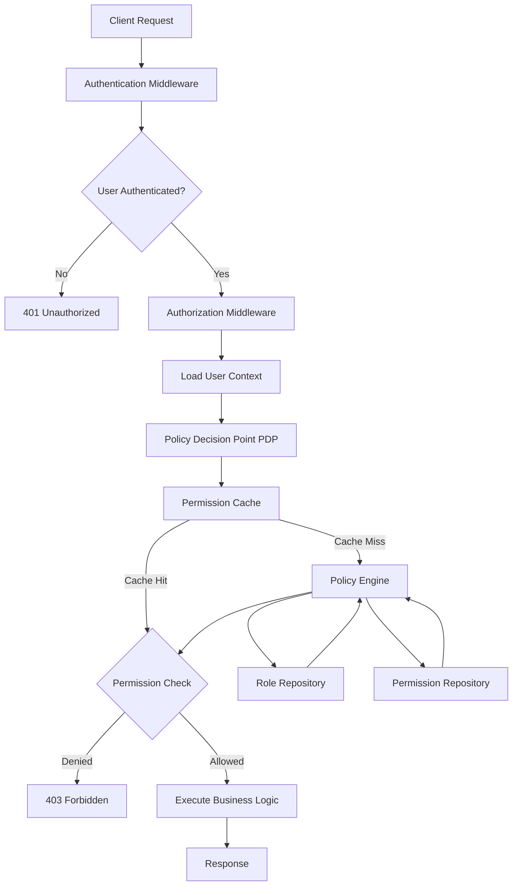
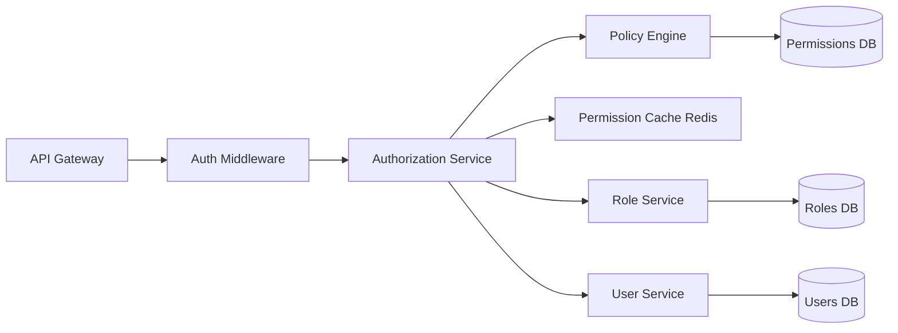
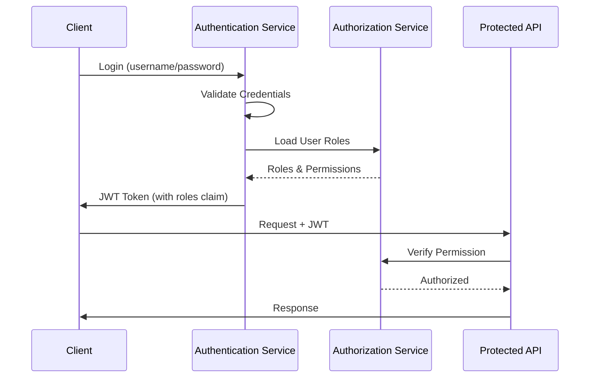
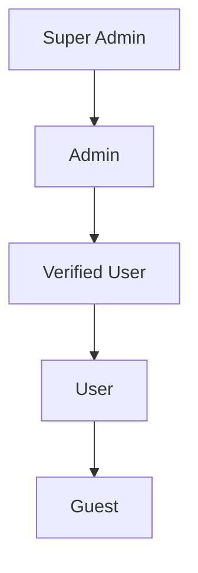
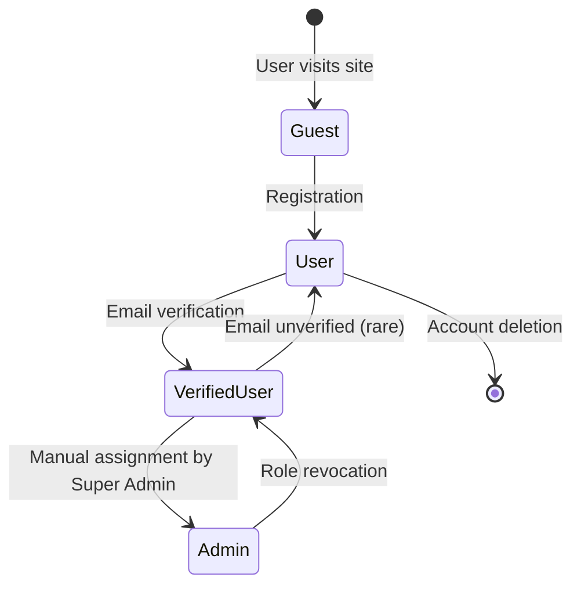
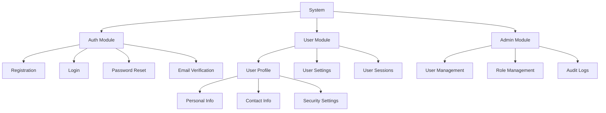
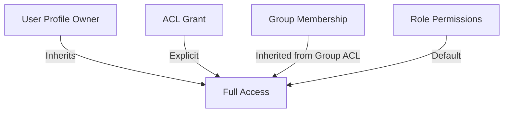
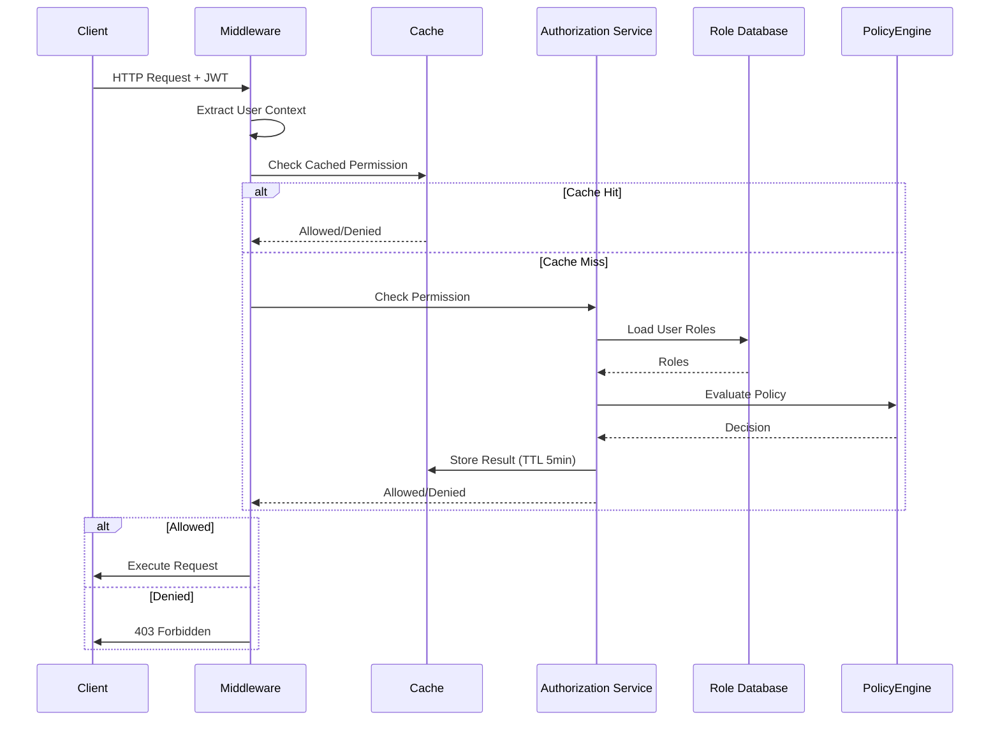
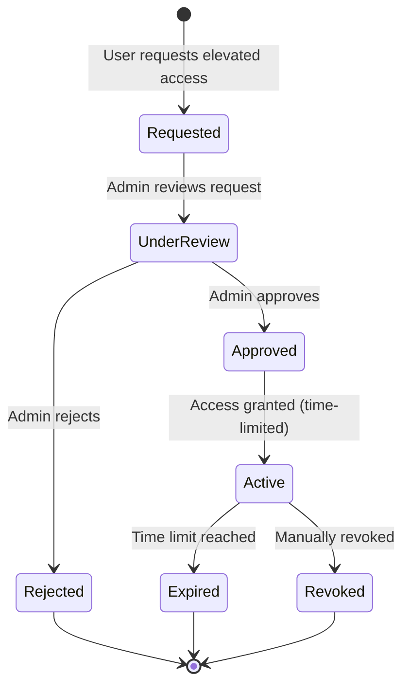
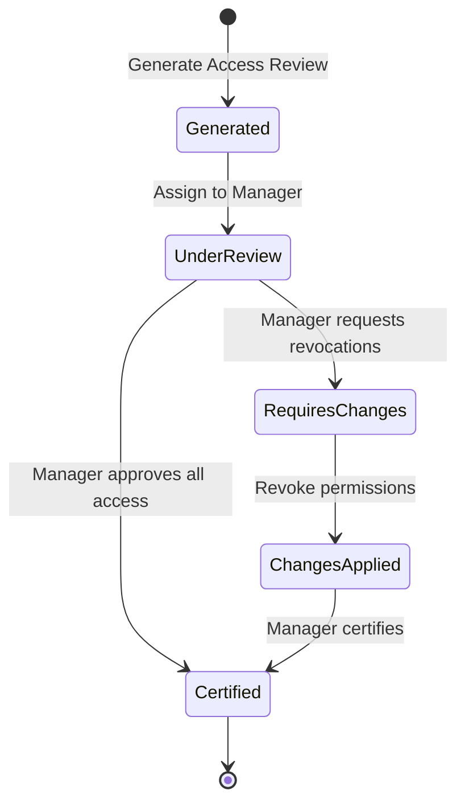

# Gate 1: Authorization Design Architecture

## 1. Authorization Architecture Overview

### High-Level Authorization Flow



### Access Control Model Selection

**Primary Model: Role-Based Access Control (RBAC)**

**Rationale:**
- User registration and authentication features require straightforward access control
- Clear role hierarchy (Guest, User, Admin)
- Predictable permission sets
- Easier to audit and maintain
- Lower complexity for initial implementation

**Secondary Model: Attribute-Based Access Control (ABAC) - Future Extension**

For advanced scenarios:
- Account ownership verification
- Email verification status checks
- Account status (active, suspended, pending)
- Time-based access restrictions

### Component Architecture



**Core Components:**

1. **Authorization Service**: Central permission checking service
2. **Policy Engine**: Evaluates access policies and rules
3. **Permission Cache**: Redis-based caching for fast lookups
4. **Role Service**: Manages role definitions and assignments
5. **User Service**: Provides user context and attributes

### Integration with Authentication System



**JWT Token Structure:**
```json
{
  "sub": "user-id-123",
  "email": "user@example.com",
  "roles": ["user"],
  "permissions": ["read:profile", "update:profile"],
  "account_status": "active",
  "email_verified": true,
  "iat": 1704067200,
  "exp": 1704153600
}
```

### Technology Stack

| Component | Technology | Rationale |
|-----------|-----------|-----------|
| Policy Engine | **Casbin** | Go-native, high performance, supports RBAC/ABAC |
| Permission Cache | **Redis** | Fast in-memory cache, TTL support |
| Database | **PostgreSQL** | ACID compliance, JSON support for attributes |
| API Framework | **Gin (Go)** | Middleware support, high performance |
| Authorization Library | **Casbin + custom middleware** | Flexible, extensible |

## 2. Role-Based Access Control (RBAC) Design

### Role Hierarchy



**Role Definitions:**

| Role | Description | Assignment Method |
|------|-------------|-------------------|
| **Guest** | Unauthenticated visitor | Default (no login) |
| **User** | Registered user with unverified email | Auto-assigned on registration |
| **Verified User** | User with verified email address | Auto-assigned after email verification |
| **Admin** | System administrator | Manual assignment by Super Admin |
| **Super Admin** | System owner with full access | Database-seeded, cannot be assigned via UI |

**Role Inheritance Model:**

- Each role inherits all permissions from roles below it
- Super Admin inherits all permissions
- Verified User inherits User permissions + additional privileges
- User inherits Guest permissions + authenticated features

### Permission Matrix

**Resource-Action Permission Matrix:**

| Resource | Action | Guest | User | Verified User | Admin | Super Admin |
|----------|--------|-------|------|---------------|-------|-------------|
| **Authentication** |
| POST /auth/register | Create Account | ✅ | ❌ | ❌ | ❌ | ❌ |
| POST /auth/login | Login | ✅ | ✅ | ✅ | ✅ | ✅ |
| POST /auth/logout | Logout | ❌ | ✅ | ✅ | ✅ | ✅ |
| POST /auth/refresh | Refresh Token | ❌ | ✅ | ✅ | ✅ | ✅ |
| POST /auth/forgot-password | Request Reset | ✅ | ✅ | ✅ | ✅ | ✅ |
| POST /auth/reset-password | Reset Password | ✅ | ✅ | ✅ | ✅ | ✅ |
| **Email Verification** |
| POST /auth/verify-email | Verify Email | ❌ | ✅ | ✅ | ✅ | ✅ |
| POST /auth/resend-verification | Resend Email | ❌ | ✅ | ❌ | ✅ | ✅ |
| **User Profile** |
| GET /users/me | Read Own Profile | ❌ | ✅ | ✅ | ✅ | ✅ |
| PUT /users/me | Update Own Profile | ❌ | ❌ | ✅ | ✅ | ✅ |
| DELETE /users/me | Delete Own Account | ❌ | ❌ | ✅ | ✅ | ✅ |
| GET /users/:id | Read Other Profile | ❌ | ❌ | ❌ | ✅ | ✅ |
| PUT /users/:id | Update Other Profile | ❌ | ❌ | ❌ | ✅ | ✅ |
| DELETE /users/:id | Delete Other Account | ❌ | ❌ | ❌ | ❌ | ✅ |
| **User Management** |
| GET /users | List Users | ❌ | ❌ | ❌ | ✅ | ✅ |
| POST /users/:id/suspend | Suspend User | ❌ | ❌ | ❌ | ✅ | ✅ |
| POST /users/:id/activate | Activate User | ❌ | ❌ | ❌ | ✅ | ✅ |
| **Role Management** |
| GET /roles | List Roles | ❌ | ❌ | ❌ | ✅ | ✅ |
| POST /users/:id/roles | Assign Role | ❌ | ❌ | ❌ | ❌ | ✅ |
| DELETE /users/:id/roles/:role | Revoke Role | ❌ | ❌ | ❌ | ❌ | ✅ |
| **Audit Logs** |
| GET /audit-logs | View Audit Logs | ❌ | ❌ | ❌ | ✅ | ✅ |
| GET /audit-logs/me | View Own Audit Logs | ❌ | ❌ | ✅ | ✅ | ✅ |

**Default Permissions for New Users:**

Upon registration, users receive:
- `auth:login`
- `auth:logout`
- `auth:refresh`
- `auth:verify-email`
- `auth:resend-verification`
- `profile:read:own`
- `password:reset:own`

After email verification, additional permissions:
- `profile:update:own`
- `profile:delete:own`
- `audit:read:own`

### Role Management

**Role Assignment Workflow:**



**Role Assignment Rules:**

1. **Auto-Assignment:**
   - User → Assigned automatically on registration
   - Verified User → Assigned automatically on email verification

2. **Manual Assignment:**
   - Admin → Only Super Admin can assign
   - Super Admin → Cannot be assigned (database-seeded only)

3. **Role Revocation:**
   - Super Admin can revoke Admin role
   - Email unverification reverts Verified User to User

**Role Audit Trail:**

Log every role change with:
```json
{
  "event_id": "uuid",
  "timestamp": "2025-11-02T10:30:00Z",
  "user_id": "target-user-id",
  "changed_by": "admin-user-id",
  "action": "role_assigned",
  "role": "admin",
  "previous_roles": ["verified_user"],
  "new_roles": ["admin", "verified_user"],
  "reason": "Promoted to admin for user management",
  "ip_address": "192.168.1.100",
  "user_agent": "Mozilla/5.0..."
}
```

## 3. Attribute-Based Access Control (ABAC) Design

### Subject Attributes (User Properties)

```go
type SubjectAttributes struct {
    UserID          string    `json:"user_id"`
    Email           string    `json:"email"`
    EmailVerified   bool      `json:"email_verified"`
    AccountStatus   string    `json:"account_status"` // active, suspended, pending_deletion
    Roles           []string  `json:"roles"`
    CreatedAt       time.Time `json:"created_at"`
    LastLoginAt     time.Time `json:"last_login_at"`
    TwoFactorEnabled bool     `json:"two_factor_enabled"`
}
```

### Resource Attributes (Data Classification, Ownership)

```go
type ResourceAttributes struct {
    ResourceType    string   `json:"resource_type"` // user_profile, audit_log
    ResourceID      string   `json:"resource_id"`
    OwnerID         string   `json:"owner_id"`
    Classification  string   `json:"classification"` // public, internal, confidential
    Sensitivity     string   `json:"sensitivity"` // low, medium, high
    CreatedAt       time.Time `json:"created_at"`
}
```

### Environment Attributes (Time, Location, IP)

```go
type EnvironmentAttributes struct {
    IPAddress       string    `json:"ip_address"`
    Country         string    `json:"country"`
    RequestTime     time.Time `json:"request_time"`
    UserAgent       string    `json:"user_agent"`
    IsBusinessHours bool      `json:"is_business_hours"`
    IsTrustedNetwork bool     `json:"is_trusted_network"`
}
```

### Policy Definition Language

**Casbin Policy Model (model.conf):**

```ini
[request_definition]
r = sub, obj, act, env

[policy_definition]
p = sub, obj, act, conditions

[role_definition]
g = _, _

[policy_effect]
e = some(where (p.eft == allow))

[matchers]
m = g(r.sub, p.sub) && r.obj == p.obj && r.act == p.act && eval(p.conditions)
```

**Policy Examples (policy.csv):**

```csv
p, verified_user, user_profile, update, subject.user_id == resource.owner_id && subject.email_verified == true
p, admin, user_profile, update, subject.roles.contains("admin")
p, verified_user, user_profile, delete, subject.user_id == resource.owner_id && subject.email_verified == true && resource.created_at > 24h
p, user, auth, verify_email, subject.email_verified == false && subject.account_status == "active"
```

### Policy Evaluation Engine

```go
type PolicyEngine struct {
    enforcer *casbin.Enforcer
    cache    *redis.Client
}

func (pe *PolicyEngine) Evaluate(ctx context.Context, request AuthRequest) (bool, error) {
    // Build evaluation context
    subject := request.SubjectAttributes
    resource := request.ResourceAttributes
    environment := request.EnvironmentAttributes
    
    // Check cache first
    cacheKey := fmt.Sprintf("authz:%s:%s:%s", subject.UserID, resource.ResourceID, request.Action)
    if cached, err := pe.cache.Get(ctx, cacheKey).Result(); err == nil {
        return cached == "allow", nil
    }
    
    // Evaluate policies
    allowed, err := pe.enforcer.Enforce(
        subject.UserID,
        resource.ResourceType,
        request.Action,
        map[string]interface{}{
            "subject": subject,
            "resource": resource,
            "environment": environment,
        },
    )
    
    if err != nil {
        return false, err
    }
    
    // Cache result (5 minutes TTL)
    pe.cache.Set(ctx, cacheKey, map[bool]string{true: "allow", false: "deny"}[allowed], 5*time.Minute)
    
    return allowed, nil
}
```

## 4. Permission Model Design

### Resource Hierarchy



**Resource Type Taxonomy:**

| Resource Type | Parent Resource | Nested Resources |
|---------------|-----------------|------------------|
| `auth` | System | `registration`, `login`, `password_reset`, `email_verification` |
| `user_profile` | User Module | `personal_info`, `contact_info`, `security_settings` |
| `user_sessions` | User Module | N/A |
| `user_management` | Admin Module | N/A |
| `role_management` | Admin Module | N/A |
| `audit_logs` | Admin Module | N/A |

**Nested Resource Permissions:**

- Permission on parent resource grants access to all child resources
- Example: `read:user_profile` includes `read:personal_info`, `read:contact_info`, `read:security_settings`

**Inherited Permissions:**

- Ownership-based inheritance: Owner of `user_profile` automatically gets `read:user_sessions`
- Role-based inheritance: Admin role inherits all Verified User permissions

### Action Types

**Standard CRUD Operations:**

| Action | Description | HTTP Method |
|--------|-------------|-------------|
| `create` | Create new resource | POST |
| `read` | Retrieve resource | GET |
| `update` | Modify resource | PUT/PATCH |
| `delete` | Remove resource | DELETE |

**Custom Actions:**

| Action | Resource | Description | HTTP Method |
|--------|----------|-------------|-------------|
| `verify` | `email` | Verify email address | POST |
| `resend` | `email_verification` | Resend verification email | POST |
| `suspend` | `user` | Suspend user account | POST |
| `activate` | `user` | Activate suspended account | POST |
| `reset` | `password` | Reset forgotten password | POST |
| `change` | `password` | Change existing password | PUT |
| `revoke` | `session` | Revoke active session | DELETE |
| `assign` | `role` | Assign role to user | POST |

**Bulk Actions:**

| Action | Resource | Description | Permission Required |
|--------|----------|-------------|---------------------|
| `bulk_suspend` | `users` | Suspend multiple users | `admin` role |
| `bulk_delete` | `sessions` | Revoke multiple sessions | `admin` role |
| `bulk_export` | `users` | Export user data | `super_admin` role |

### Permission Granularity

**Resource-Level Permissions:**

```go
// Permission format: action:resource_type
"read:user_profile"
"update:user_profile"
"delete:user_profile"
```

**Field-Level Permissions:**

```go
// Permission format: action:resource_type:field
"read:user_profile:email"
"update:user_profile:password"
"read:user_profile:sensitive_data"
```

**Field-Level Policy Example:**

```go
type UserProfile struct {
    ID              string    `json:"id" permission:"read:user_profile"`
    Email           string    `json:"email" permission:"read:user_profile:email"`
    FullName        string    `json:"full_name" permission:"read:user_profile"`
    PhoneNumber     string    `json:"phone_number" permission:"read:user_profile:phone"`
    SSN             string    `json:"ssn" permission:"read:user_profile:ssn"` // Admin only
    CreatedAt       time.Time `json:"created_at" permission:"read:user_profile"`
    LastLoginIP     string    `json:"last_login_ip" permission:"read:user_profile:admin_data"` // Admin only
}

// Filter fields based on permissions
func FilterFields(profile UserProfile, permissions []string) map[string]interface{} {
    result := make(map[string]interface{})
    val := reflect.ValueOf(profile)
    typ := reflect.TypeOf(profile)
    
    for i := 0; i < val.NumField(); i++ {
        field := typ.Field(i)
        permTag := field.Tag.Get("permission")
        
        if hasPermission(permissions, permTag) {
            result[field.Tag.Get("json")] = val.Field(i).Interface()
        }
    }
    
    return result
}
```

**Row-Level Security:**

Filter data based on ownership or role:

```sql
-- User can only see their own profile
SELECT * FROM user_profiles 
WHERE id = $1 AND user_id = $current_user_id;

-- Admin can see all profiles
SELECT * FROM user_profiles 
WHERE ($is_admin = true) OR (user_id = $current_user_id);
```

## 5. Access Control Lists (ACLs) Design

**Note:** ACLs are not the primary authorization model for user registration/authentication features, but included for completeness and future extensibility.

### User-Specific Access Grants

**Use Case:** Grant specific users temporary access to another user's profile (e.g., for customer support).

```go
type ACLEntry struct {
    ID           string    `json:"id"`
    ResourceType string    `json:"resource_type"` // user_profile
    ResourceID   string    `json:"resource_id"`   // target user ID
    GrantedTo    string    `json:"granted_to"`    // user ID or group ID
    GrantedBy    string    `json:"granted_by"`    // admin user ID
    Permissions  []string  `json:"permissions"`   // ["read", "update"]
    ExpiresAt    *time.Time `json:"expires_at"`
    CreatedAt    time.Time `json:"created_at"`
}
```

### Group-Based Access

**Example:** Grant all members of "Support Team" group read access to user profiles.

```go
type Group struct {
    ID          string   `json:"id"`
    Name        string   `json:"name"`
    Description string   `json:"description"`
    Members     []string `json:"members"` // user IDs
}

type GroupACL struct {
    GroupID      string   `json:"group_id"`
    ResourceType string   `json:"resource_type"`
    Permissions  []string `json:"permissions"`
}
```

### ACL Inheritance Model



**Inheritance Priority (highest to lowest):**

1. Explicit Deny ACL
2. Explicit Allow ACL
3. Group ACL
4. Role Permissions
5. Default Deny

### ACL Merge Strategies

**Strategy: Permit-Overrides**

- If any ACL grants permission, access is allowed
- Used for additive permissions

```go
func MergeACLsPermitOverrides(acls []ACLEntry) []string {
    permissionSet := make(map[string]bool)
    
    for _, acl := range acls {
        for _, perm := range acl.Permissions {
            permissionSet[perm] = true
        }
    }
    
    var result []string
    for perm := range permissionSet {
        result = append(result, perm)
    }
    
    return result
}
```

**Strategy: Deny-Overrides**

- If any ACL denies permission, access is denied
- Used for restrictive scenarios

```go
type ACLEntryWithDeny struct {
    ACLEntry
    DeniedPermissions []string `json:"denied_permissions"`
}

func MergeACLsDenyOverrides(acls []ACLEntryWithDeny) []string {
    allowed := make(map[string]bool)
    denied := make(map[string]bool)
    
    for _, acl := range acls {
        for _, perm := range acl.Permissions {
            allowed[perm] = true
        }
        for _, perm := range acl.DeniedPermissions {
            denied[perm] = true
        }
    }
    
    var result []string
    for perm := range allowed {
        if !denied[perm] {
            result = append(result, perm)
        }
    }
    
    return result
}
```

### Performance Optimization

**Caching Strategy:**

```go
type ACLCache struct {
    redis *redis.Client
}

func (c *ACLCache) GetUserACLs(ctx context.Context, userID string, resourceID string) ([]ACLEntry, error) {
    cacheKey := fmt.Sprintf("acl:user:%s:resource:%s", userID, resourceID)
    
    // Try cache first
    cached, err := c.redis.Get(ctx, cacheKey).Result()
    if err == nil {
        var acls []ACLEntry
        json.Unmarshal([]byte(cached), &acls)
        return acls, nil
    }
    
    // Load from database
    acls := loadACLsFromDB(userID, resourceID)
    
    // Cache for 10 minutes
    data, _ := json.Marshal(acls)
    c.redis.Set(ctx, cacheKey, data, 10*time.Minute)
    
    return acls, nil
}
```

**Denormalization:**

Store computed ACLs in user session for faster access:

```go
type SessionContext struct {
    UserID      string
    Roles       []string
    ACLs        []ACLEntry  // Pre-loaded ACLs
    Permissions []string    // Computed permissions
}
```

## 6. Permission Checking Architecture

### Authorization Middleware

```go
func AuthorizationMiddleware(requiredPermission string) gin.HandlerFunc {
    return func(c *gin.Context) {
        // Extract user context from JWT
        userID, exists := c.Get("user_id")
        if !exists {
            c.JSON(401, gin.H{"error": "Unauthorized"})
            c.Abort()
            return
        }
        
        // Get authorization service
        authzService := c.MustGet("authz_service").(*AuthorizationService)
        
        // Extract resource context
        resourceType := c.Param("resource_type")
        resourceID := c.Param("id")
        action := mapHTTPMethodToAction(c.Request.Method)
        
        // Check permission
        allowed, err := authzService.CheckPermission(c.Request.Context(), CheckPermissionRequest{
            UserID:       userID.(string),
            ResourceType: resourceType,
            ResourceID:   resourceID,
            Action:       action,
        })
        
        if err != nil {
            c.JSON(500, gin.H{"error": "Authorization check failed"})
            c.Abort()
            return
        }
        
        if !allowed {
            c.JSON(403, gin.H{
                "error": "Forbidden",
                "message": fmt.Sprintf("Insufficient permissions to %s %s", action, resourceType),
            })
            c.Abort()
            return
        }
        
        // Permission granted
        c.Next()
    }
}

// Usage
router.PUT("/users/:id", 
    AuthenticationMiddleware(),
    AuthorizationMiddleware("update:user_profile"),
    UpdateUserProfile,
)
```

### Permission Resolution Flow



### Permission Resolution Service

```go
type AuthorizationService struct {
    enforcer     *casbin.Enforcer
    cache        *redis.Client
    roleRepo     RoleRepository
    permissionRepo PermissionRepository
}

type CheckPermissionRequest struct {
    UserID       string
    ResourceType string
    ResourceID   string
    Action       string
    Context      map[string]interface{}
}

func (s *AuthorizationService) CheckPermission(ctx context.Context, req CheckPermissionRequest) (bool, error) {
    // 1. Check cache
    cacheKey := fmt.Sprintf("perm:%s:%s:%s:%s", req.UserID, req.ResourceType, req.ResourceID, req.Action)
    if cached, err := s.cache.Get(ctx, cacheKey).Result(); err == nil {
        return cached == "allow", nil
    }
    
    // 2. Load user roles
    roles, err := s.roleRepo.GetUserRoles(ctx, req.UserID)
    if err != nil {
        return false, err
    }
    
    // 3. Check ownership
    if req.ResourceID != "" {
        isOwner, err := s.checkOwnership(ctx, req.UserID, req.ResourceType, req.ResourceID)
        if err == nil && isOwner {
            // Owners have full access to their own resources
            if req.Action == "read" || req.Action == "update" || req.Action == "delete" {
                s.cacheResult(ctx, cacheKey, true)
                return true, nil
            }
        }
    }
    
    // 4. Evaluate policies
    for _, role := range roles {
        allowed, err := s.enforcer.Enforce(role, req.ResourceType, req.Action)
        if err != nil {
            continue
        }
        if allowed {
            s.cacheResult(ctx, cacheKey, true)
            return true, nil
        }
    }
    
    // 5. Check ACLs
    acls, err := s.loadUserACLs(ctx, req.UserID, req.ResourceID)
    if err == nil {
        for _, acl := range acls {
            if contains(acl.Permissions, req.Action) {
                s.cacheResult(ctx, cacheKey, true)
                return true, nil
            }
        }
    }
    
    // 6. Default deny
    s.cacheResult(ctx, cacheKey, false)
    return false, nil
}

func (s *AuthorizationService) cacheResult(ctx context.Context, key string, allowed bool) {
    value := map[bool]string{true: "allow", false: "deny"}[allowed]
    s.cache.Set(ctx, key, value, 5*time.Minute)
}
```

### Dynamic Permission Computation

**Computed Permissions Based on Context:**

```go
func (s *AuthorizationService) ComputeDynamicPermissions(ctx context.Context, userID string) ([]string, error) {
    permissions := []string{}
    
    user, err := s.userRepo.GetByID(ctx, userID)
    if err != nil {
        return nil, err
    }
    
    // Base permissions from roles
    rolePerms := s.getRolePermissions(ctx, user.Roles)
    permissions = append(permissions, rolePerms...)
    
    // Dynamic: Email verified users get additional permissions
    if user.EmailVerified {
        permissions = append(permissions, 
            "update:user_profile",
            "delete:user_profile",
        )
    }
    
    // Dynamic: 2FA enabled users get sensitive operations
    if user.TwoFactorEnabled {
        permissions = append(permissions, 
            "read:security_settings",
            "update:security_settings",
        )
    }
    
    // Dynamic: Account age > 30 days gets advanced features
    if time.Since(user.CreatedAt) > 30*24*time.Hour {
        permissions = append(permissions, "access:advanced_features")
    }
    
    return permissions, nil
}
```

### Policy Decision Point (PDP)

```go
type PolicyDecisionPoint struct {
    enforcer *casbin.Enforcer
}

type PolicyDecision struct {
    Allowed bool
    Reason  string
    Applied []string // List of policies that were applied
}

func (pdp *PolicyDecisionPoint) Decide(ctx context.Context, request AuthRequest) (PolicyDecision, error) {
    decision := PolicyDecision{
        Allowed: false,
        Applied: []string{},
    }
    
    // Collect all applicable policies
    policies := pdp.enforcer.GetFilteredPolicy(0, request.Subject.UserID)
    
    for _, policy := range policies {
        // policy = [subject, resource, action, conditions]
        if policy[1] == request.ResourceType && policy[2] == request.Action {
            // Evaluate conditions
            allowed, err := pdp.evaluateConditions(policy[3], request)
            if err != nil {
                continue
            }
            
            decision.Applied = append(decision.Applied, policy[0])
            
            if allowed {
                decision.Allowed = true
                decision.Reason = fmt.Sprintf("Allowed by policy: %s", policy[0])
                return decision, nil
            }
        }
    }
    
    decision.Reason = "No matching policy found (default deny)"
    return decision, nil
}
```

### Combining Policies

**Permit-Overrides Strategy:**

```go
func (pdp *PolicyDecisionPoint) CombinePoliciesPermitOverrides(decisions []PolicyDecision) PolicyDecision {
    combined := PolicyDecision{
        Allowed: false,
        Applied: []string{},
    }
    
    for _, decision := range decisions {
        combined.Applied = append(combined.Applied, decision.Applied...)
        
        if decision.Allowed {
            combined.Allowed = true
            combined.Reason = decision.Reason
            return combined // First allow wins
        }
    }
    
    combined.Reason = "All policies denied access"
    return combined
}
```

**Deny-Overrides Strategy:**

```go
func (pdp *PolicyDecisionPoint) CombinePoliciesDenyOverrides(decisions []PolicyDecision) PolicyDecision {
    combined := PolicyDecision{
        Allowed: true, // Assume allowed unless denied
        Applied: []string{},
    }
    
    for _, decision := range decisions {
        combined.Applied = append(combined.Applied, decision.Applied...)
        
        if !decision.Allowed {
            combined.Allowed = false
            combined.Reason = decision.Reason
            return combined // First deny wins
        }
    }
    
    combined.Reason = "All policies allowed access"
    return combined
}
```

## 7. Data Security Design

### Row-Level Security (RLS)

**Database-Level RLS (PostgreSQL):**

```sql
-- Enable RLS on users table
ALTER TABLE users ENABLE ROW LEVEL SECURITY;

-- Policy: Users can only see their own data
CREATE POLICY user_isolation ON users
    FOR ALL
    TO authenticated_user
    USING (id = current_setting('app.current_user_id')::uuid);

-- Policy: Admins can see all users
CREATE POLICY admin_full_access ON users
    FOR ALL
    TO admin_role
    USING (true);

-- Set user context in session
SET app.current_user_id = 'user-uuid-here';
```

**Application-Level Filtering:**

```go
type UserRepository struct {
    db *sql.DB
}

func (r *UserRepository) FindByID(ctx context.Context, id string, requestorID string, isAdmin bool) (*User, error) {
    query := `
        SELECT id, email, full_name, created_at 
        FROM users 
        WHERE id = $1
    `
    
    // Apply row-level security at application level
    if !isAdmin {
        query += ` AND id = $2`
        row := r.db.QueryRowContext(ctx, query, id, requestorID)
        // ... scan row
    } else {
        row := r.db.QueryRowContext(ctx, query, id)
        // ... scan row
    }
    
    return user, nil
}
```

**Multi-Tenancy Isolation:**

Not applicable for user registration/authentication (single-tenant system).

### Column-Level Security

**Sensitive Field Masking:**

```go
type User struct {
    ID            string    `json:"id"`
    Email         string    `json:"email" sensitive:"true"`
    FullName      string    `json:"full_name"`
    PhoneNumber   string    `json:"phone_number" sensitive:"true"`
    PasswordHash  string    `json:"-"` // Never expose
    CreatedAt     time.Time `json:"created_at"`
    LastLoginIP   string    `json:"last_login_ip" sensitive:"admin_only"`
}

func MaskSensitiveFields(user User, isAdmin bool, isOwner bool) map[string]interface{} {
    result := map[string]interface{}{
        "id":         user.ID,
        "full_name":  user.FullName,
        "created_at": user.CreatedAt,
    }
    
    // Owner or admin can see email
    if isOwner || isAdmin {
        result["email"] = user.Email
        result["phone_number"] = user.PhoneNumber
    } else {
        result["email"] = maskEmail(user.Email)
        result["phone_number"] = "***-***-****"
    }
    
    // Only admin can see IP address
    if isAdmin {
        result["last_login_ip"] = user.LastLoginIP
    }
    
    return result
}

func maskEmail(email string) string {
    parts := strings.Split(email, "@")
    if len(parts) != 2 {
        return "***@***.***"
    }
    
    username := parts[0]
    if len(username) > 2 {
        username = username[:2] + "***"
    }
    
    return username + "@" + parts[1]
}
```

**Conditional Field Visibility:**

```go
type UserProfileResponse struct {
    ID               string     `json:"id"`
    Email            string     `json:"email,omitempty"`
    FullName         string     `json:"full_name"`
    PhoneNumber      string     `json:"phone_number,omitempty"`
    EmailVerified    bool       `json:"email_verified,omitempty"`
    TwoFactorEnabled bool       `json:"two_factor_enabled,omitempty"`
    CreatedAt        time.Time  `json:"created_at"`
    LastLoginAt      *time.Time `json:"last_login_at,omitempty"`
}

func BuildUserResponse(user User, permissions []string) UserProfileResponse {
    response := UserProfileResponse{
        ID:        user.ID,
        FullName:  user.FullName,
        CreatedAt: user.CreatedAt,
    }
    
    if contains(permissions, "read:user_profile:email") {
        response.Email = user.Email
        response.EmailVerified = user.EmailVerified
    }
    
    if contains(permissions, "read:user_profile:phone") {
        response.PhoneNumber = user.PhoneNumber
    }
    
    if contains(permissions, "read:user_profile:security") {
        response.TwoFactorEnabled = user.TwoFactorEnabled
    }
    
    if contains(permissions, "read:user_profile:activity") {
        response.LastLoginAt = user.LastLoginAt
    }
    
    return response
}
```

### Data Classification

**Classification Levels:**

| Level | Description | Access Policy | Examples |
|-------|-------------|---------------|----------|
| **Public** | Publicly accessible data | Anyone | User ID, public profile name |
| **Internal** | Internal use only | Authenticated users | Email verification status |
| **Confidential** | Sensitive personal data | Owner + Admin | Email, phone number |
| **Restricted** | Highly sensitive | Owner only (Admin read-only) | Password hash, 2FA secrets |

**Access Policies per Classification:**

```go
type DataClassification string

const (
    ClassificationPublic       DataClassification = "public"
    ClassificationInternal     DataClassification = "internal"
    ClassificationConfidential DataClassification = "confidential"
    ClassificationRestricted   DataClassification = "restricted"
)

type FieldClassification struct {
    FieldName      string
    Classification DataClassification
}

var UserFieldClassifications = []FieldClassification{
    {"id", ClassificationPublic},
    {"full_name", ClassificationPublic},
    {"created_at", ClassificationPublic},
    {"email_verified", ClassificationInternal},
    {"email", ClassificationConfidential},
    {"phone_number", ClassificationConfidential},
    {"last_login_ip", ClassificationConfidential},
    {"password_hash", ClassificationRestricted},
    {"two_factor_secret", ClassificationRestricted},
}

func CanAccessField(classification DataClassification, userRole string, isOwner bool) bool {
    switch classification {
    case ClassificationPublic:
        return true
    case ClassificationInternal:
        return userRole != "guest"
    case ClassificationConfidential:
        return isOwner || userRole == "admin" || userRole == "super_admin"
    case ClassificationRestricted:
        return isOwner // Admin can't even read password hashes
    default:
        return false
    }
}
```

**Database Schema with Classification:**

```sql
CREATE TABLE user_data_classification (
    id UUID PRIMARY KEY DEFAULT gen_random_uuid(),
    table_name VARCHAR(100) NOT NULL,
    column_name VARCHAR(100) NOT NULL,
    classification VARCHAR(50) NOT NULL CHECK (classification IN ('public', 'internal', 'confidential', 'restricted')),
    access_policy JSONB,
    created_at TIMESTAMP DEFAULT NOW()
);

INSERT INTO user_data_classification (table_name, column_name, classification, access_policy) VALUES
('users', 'id', 'public', '{"roles": ["guest", "user", "admin"]}'),
('users', 'email', 'confidential', '{"roles": ["owner", "admin"], "conditions": ["is_owner OR is_admin"]}'),
('users', 'password_hash', 'restricted', '{"roles": ["owner"], "conditions": ["is_owner"], "read_only": false}');
```

## 8. Administrative Access Control

### Super Admin Role

**Capabilities:**

- Full system access (all permissions)
- User management (create, update, suspend, delete)
- Role assignment (assign/revoke Admin role)
- System configuration
- Audit log access
- Database administration

**Restrictions:**

- Cannot be assigned via UI (database-seeded only)
- Cannot be revoked via UI
- All actions are logged with enhanced detail
- Requires additional authentication (e.g., hardware key)

**Database Seeding:**

```sql
-- Insert super admin user (run once during deployment)
INSERT INTO users (id, email, full_name, email_verified, account_status, created_at)
VALUES 
    ('super-admin-uuid', 'admin@sumafinance.com', 'Super Administrator', true, 'active', NOW());

INSERT INTO user_roles (user_id, role)
VALUES 
    ('super-admin-uuid', 'super_admin');
```

**Super Admin Audit Logging:**

```go
func (s *AuditService) LogSuperAdminAction(ctx context.Context, action SuperAdminAction) error {
    log := AuditLog{
        EventID:     uuid.New().String(),
        Timestamp:   time.Now(),
        UserID:      action.AdminID,
        UserRole:    "super_admin",
        Action:      action.ActionType,
        ResourceType: action.ResourceType,
        ResourceID:  action.ResourceID,
        Changes:     action.Changes,
        IPAddress:   action.IPAddress,
        UserAgent:   action.UserAgent,
        Severity:    "CRITICAL", // All super admin actions are critical
        Metadata: map[string]interface{}{
            "requires_review": true,
            "notification_sent": true,
        },
    }
    
    // Store in audit database
    err := s.repo.Create(ctx, log)
    if err != nil {
        return err
    }
    
    // Send real-time notification
    s.notificationService.NotifySuperAdminAction(ctx, log)
    
    return nil
}
```

### Delegated Administration

**Department Admins:**

Not applicable for user registration/authentication feature (no departments).

**Team Leads:**

Not applicable for user registration/authentication feature (no teams).

**Scoped Administrative Permissions:**

**Example: Support Admin Role**

Limited admin capabilities for customer support:

```go
type SupportAdmin struct {
    Permissions []string
}

var SupportAdminPermissions = []string{
    "read:user_profile",        // View user profiles
    "read:audit_logs",          // View audit logs (read-only)
    "update:user:email_verification", // Manually verify email
    "create:password_reset_token",    // Generate password reset links
    "read:user_sessions",       // View active sessions
    "revoke:user_session",      // Revoke specific sessions (security)
}

// Support admins CANNOT:
// - Assign roles
// - Delete users
// - Update passwords
// - Access restricted data (password hashes, 2FA secrets)
```

**Policy Configuration:**

```csv
# Support admin policies
p, support_admin, user_profile, read, true
p, support_admin, audit_logs, read, true
p, support_admin, email_verification, update, subject.role == "support_admin"
p, support_admin, password_reset_token, create, subject.role == "support_admin"
p, support_admin, user_session, read, true
p, support_admin, user_session, revoke, true

# Explicit denies
p, support_admin, user, delete, false
p, support_admin, user_password, update, false
p, support_admin, role, assign, false
```

### Privileged Access Management

**Temporary Elevated Access:**

```go
type TemporaryAccess struct {
    ID          string    `json:"id"`
    UserID      string    `json:"user_id"`
    GrantedRole string    `json:"granted_role"`
    Reason      string    `json:"reason"`
    GrantedBy   string    `json:"granted_by"`
    GrantedAt   time.Time `json:"granted_at"`
    ExpiresAt   time.Time `json:"expires_at"`
    Revoked     bool      `json:"revoked"`
}

func (s *AuthorizationService) GrantTemporaryAccess(ctx context.Context, req GrantTemporaryAccessRequest) error {
    // Validate requester has permission to grant access
    if !s.hasPermission(ctx, req.GrantedBy, "grant:temporary_access") {
        return errors.New("insufficient permissions")
    }
    
    // Create temporary access grant
    tempAccess := TemporaryAccess{
        ID:          uuid.New().String(),
        UserID:      req.UserID,
        GrantedRole: req.Role,
        Reason:      req.Reason,
        GrantedBy:   req.GrantedBy,
        GrantedAt:   time.Now(),
        ExpiresAt:   time.Now().Add(req.Duration),
        Revoked:     false,
    }
    
    // Store in database
    err := s.tempAccessRepo.Create(ctx, tempAccess)
    if err != nil {
        return err
    }
    
    // Audit log
    s.auditService.Log(ctx, AuditLog{
        Action:      "temporary_access_granted",
        UserID:      req.UserID,
        ChangedBy:   req.GrantedBy,
        Metadata: map[string]interface{}{
            "role":       req.Role,
            "duration":   req.Duration,
            "reason":     req.Reason,
            "expires_at": tempAccess.ExpiresAt,
        },
    })
    
    return nil
}
```

**Approval Workflows:**



**Time-Limited Permissions:**

```go
func (s *AuthorizationService) CheckPermissionWithTemporaryAccess(ctx context.Context, userID string, permission string) (bool, error) {
    // Check regular permissions
    hasPermission, err := s.CheckPermission(ctx, CheckPermissionRequest{
        UserID:       userID,
        ResourceType: extractResourceType(permission),
        Action:       extractAction(permission),
    })
    
    if err != nil {
        return false, err
    }
    
    if hasPermission {
        return true, nil
    }
    
    // Check temporary access grants
    tempAccess, err := s.tempAccessRepo.GetActiveByUserID(ctx, userID)
    if err != nil {
        return false, err
    }
    
    for _, access := range tempAccess {
        // Check if not expired and not revoked
        if time.Now().Before(access.ExpiresAt) && !access.Revoked {
            // Check if granted role has permission
            roleHasPermission, _ := s.roleHasPermission(ctx, access.GrantedRole, permission)
            if roleHasPermission {
                return true, nil
            }
        }
    }
    
    return false, nil
}

// Background job: Auto-revoke expired temporary access
func (s *AuthorizationService) RevokeExpiredTemporaryAccess(ctx context.Context) error {
    expired, err := s.tempAccessRepo.FindExpired(ctx)
    if err != nil {
        return err
    }
    
    for _, access := range expired {
        access.Revoked = true
        s.tempAccessRepo.Update(ctx, access)
        
        // Audit log
        s.auditService.Log(ctx, AuditLog{
            Action:    "temporary_access_expired",
            UserID:    access.UserID,
            Metadata: map[string]interface{}{
                "role":       access.GrantedRole,
                "granted_at": access.GrantedAt,
                "expired_at": access.ExpiresAt,
            },
        })
    }
    
    return nil
}
```

## 9. API Authorization Design

### Scope-Based Authorization

**OAuth 2.0 Scopes:**

| Scope | Description | Permissions Included |
|-------|-------------|---------------------|
| `openid` | OpenID Connect authentication | User ID claim |
| `profile` | Basic profile information | Read user profile (name, ID) |
| `email` | Email address access | Read email, email verification status |
| `user:read` | Read user data | Read own profile, settings |
| `user:write` | Modify user data | Update profile, change password |
| `user:delete` | Delete account | Delete own account |
| `admin:users` | User management | Read/update/delete all users (admin only) |
| `admin:roles` | Role management | Assign/revoke roles (super admin only) |

**Scope-to-Permission Mapping:**

```go
var ScopePermissionMap = map[string][]string{
    "openid": {},
    "profile": {
        "read:user_profile:basic",
    },
    "email": {
        "read:user_profile:email",
    },
    "user:read": {
        "read:user_profile",
        "read:user_settings",
        "read:user_sessions",
    },
    "user:write": {
        "update:user_profile",
        "update:user_password",
        "update:user_settings",
    },
    "user:delete": {
        "delete:user_profile",
    },
    "admin:users": {
        "read:users",
        "update:users",
        "delete:users",
        "suspend:users",
        "activate:users",
    },
    "admin:roles": {
        "read:roles",
        "assign:roles",
        "revoke:roles",
    },
}

func (s *AuthorizationService) GetPermissionsFromScopes(scopes []string) []string {
    permissions := []string{}
    
    for _, scope := range scopes {
        if perms, exists := ScopePermissionMap[scope]; exists {
            permissions = append(permissions, perms...)
        }
    }
    
    return removeDuplicates(permissions)
}
```

**JWT Token with Scopes:**

```json
{
  "sub": "user-123",
  "email": "user@example.com",
  "scope": "openid profile email user:read user:write",
  "iat": 1704067200,
  "exp": 1704153600
}
```

**Scope Validation Middleware:**

```go
func RequireScopes(requiredScopes ...string) gin.HandlerFunc {
    return func(c *gin.Context) {
        // Extract token from Authorization header
        token := extractToken(c.GetHeader("Authorization"))
        
        // Parse and validate JWT
        claims, err := parseJWT(token)
        if err != nil {
            c.JSON(401, gin.H{"error": "Invalid token"})
            c.Abort()
            return
        }
        
        // Extract scopes from token
        scopeString := claims["scope"].(string)
        grantedScopes := strings.Split(scopeString, " ")
        
        // Check if all required scopes are present
        for _, required := range requiredScopes {
            if !contains(grantedScopes, required) {
                c.JSON(403, gin.H{
                    "error": "Insufficient scope",
                    "required_scope": required,
                })
                c.Abort()
                return
            }
        }
        
        // Store scopes in context
        c.Set("scopes", grantedScopes)
        c.Next()
    }
}

// Usage
router.PUT("/users/me", 
    RequireScopes("user:write"),
    UpdateUserProfile,
)

router.DELETE("/users/:id",
    RequireScopes("admin:users"),
    DeleteUser,
)
```

### Client Credential Scopes

**Client Types:**

| Client Type | Description | Allowed Scopes |
|-------------|-------------|----------------|
| **Web Application** | First-party web app | All user scopes |
| **Mobile App** | First-party mobile app | All user scopes |
| **Third-Party App** | External integration | Limited scopes (profile, email) |
| **Service Account** | Backend service | Service-specific scopes |
| **Admin Console** | Admin dashboard | Admin scopes |

**Client Registration:**

```go
type OAuth2Client struct {
    ClientID     string   `json:"client_id"`
    ClientSecret string   `json:"-"` // Never expose
    Name         string   `json:"name"`
    Type         string   `json:"type"` // web, mobile, third_party, service
    AllowedScopes []string `json:"allowed_scopes"`
    RedirectURIs []string `json:"redirect_uris"`
    CreatedAt    time.Time `json:"created_at"`
}

var ClientScopeRestrictions = map[string][]string{
    "web": {
        "openid", "profile", "email", "user:read", "user:write", "user:delete",
    },
    "mobile": {
        "openid", "profile", "email", "user:read", "user:write", "user:delete",
    },
    "third_party": {
        "openid", "profile", "email", "user:read",
    },
    "service": {
        "service:read", "service:write",
    },
    "admin_console": {
        "openid", "profile", "admin:users", "admin:roles",
    },
}

func (s *OAuth2Service) ValidateClientScopes(client OAuth2Client, requestedScopes []string) error {
    allowedScopes := ClientScopeRestrictions[client.Type]
    
    for _, requested := range requestedScopes {
        if !contains(allowedScopes, requested) {
            return fmt.Errorf("scope %s not allowed for client type %s", requested, client.Type)
        }
    }
    
    return nil
}
```

### Rate Limiting per Role

**Rate Limit Configuration:**

| Role | Requests per Minute | Burst | Daily Limit |
|------|-------------------|-------|-------------|
| **Guest** | 20 | 30 | 1,000 |
| **User** | 60 | 100 | 10,000 |
| **Verified User** | 100 | 150 | 50,000 |
| **Admin** | 200 | 300 | 100,000 |
| **Super Admin** | Unlimited | Unlimited | Unlimited |

**Rate Limiting Middleware:**

```go
type RateLimiter struct {
    redis *redis.Client
}

type RateLimit struct {
    RequestsPerMinute int
    BurstSize         int
    DailyLimit        int
}

var RateLimitsByRole = map[string]RateLimit{
    "guest": {
        RequestsPerMinute: 20,
        BurstSize:         30,
        DailyLimit:        1000,
    },
    "user": {
        RequestsPerMinute: 60,
        BurstSize:         100,
        DailyLimit:        10000,
    },
    "verified_user": {
        RequestsPerMinute: 100,
        BurstSize:         150,
        DailyLimit:        50000,
    },
    "admin": {
        RequestsPerMinute: 200,
        BurstSize:         300,
        DailyLimit:        100000,
    },
}

func (rl *RateLimiter) RateLimitMiddleware() gin.HandlerFunc {
    return func(c *gin.Context) {
        userID, _ := c.Get("user_id")
        userRole, _ := c.Get("user_role")
        
        role := "guest"
        if userRole != nil {
            role = userRole.(string)
        }
        
        // Super admin bypasses rate limiting
        if role == "super_admin" {
            c.Next()
            return
        }
        
        limits := RateLimitsByRole[role]
        
        // Check per-minute rate limit
        allowed, err := rl.checkMinuteLimit(c.Request.Context(), userID.(string), limits)
        if err != nil || !allowed {
            c.JSON(429, gin.H{
                "error": "Rate limit exceeded",
                "retry_after": 60,
            })
            c.Abort()
            return
        }
        
        // Check daily limit
        allowed, err = rl.checkDailyLimit(c.Request.Context(), userID.(string), limits)
        if err != nil || !allowed {
            c.JSON(429, gin.H{
                "error": "Daily rate limit exceeded",
                "retry_after": 86400,
            })
            c.Abort()
            return
        }
        
        c.Next()
    }
}

func (rl *RateLimiter) checkMinuteLimit(ctx context.Context, userID string, limits RateLimit) (bool, error) {
    key := fmt.Sprintf("ratelimit:minute:%s", userID)
    
    count, err := rl.redis.Incr(ctx, key).Result()
    if err != nil {
        return false, err
    }
    
    if count == 1 {
        rl.redis.Expire(ctx, key, 60*time.Second)
    }
    
    return count <= int64(limits.RequestsPerMinute), nil
}
```

### API Key Permissions

**Scoped API Keys:**

```go
type APIKey struct {
    ID          string    `json:"id"`
    UserID      string    `json:"user_id"`
    Name        string    `json:"name"`
    KeyHash     string    `json:"-"` // Hashed API key
    Scopes      []string  `json:"scopes"`
    Permissions []string  `json:"permissions"`
    RateLimit   RateLimit `json:"rate_limit"`
    ExpiresAt   *time.Time `json:"expires_at"`
    LastUsedAt  *time.Time `json:"last_used_at"`
    CreatedAt   time.Time `json:"created_at"`
    Revoked     bool      `json:"revoked"`
}

func (s *APIKeyService) CreateAPIKey(ctx context.Context, req CreateAPIKeyRequest) (*APIKey, string, error) {
    // Generate random API key
    rawKey := generateSecureAPIKey() // suma_sk_xxxxxxxxxxxxxxxx
    keyHash := hashAPIKey(rawKey)
    
    // Validate requested scopes
    if err := s.validateScopes(ctx, req.UserID, req.Scopes); err != nil {
        return nil, "", err
    }
    
    // Convert scopes to permissions
    permissions := s.scopesToPermissions(req.Scopes)
    
    apiKey := &APIKey{
        ID:          uuid.New().String(),
        UserID:      req.UserID,
        Name:        req.Name,
        KeyHash:     keyHash,
        Scopes:      req.Scopes,
        Permissions: permissions,
        RateLimit:   req.RateLimit,
        ExpiresAt:   req.ExpiresAt,
        CreatedAt:   time.Now(),
        Revoked:     false,
    }
    
    err := s.repo.Create(ctx, apiKey)
    if err != nil {
        return nil, "", err
    }
    
    // Return API key only once (never stored in plain text)
    return apiKey, rawKey, nil
}
```

**API Key Authentication Middleware:**

```go
func APIKeyAuthMiddleware() gin.HandlerFunc {
    return func(c *gin.Context) {
        apiKey := c.GetHeader("X-API-Key")
        if apiKey == "" {
            c.JSON(401, gin.H{"error": "API key required"})
            c.Abort()
            return
        }
        
        // Validate and load API key
        key, err := apiKeyService.ValidateAPIKey(c.Request.Context(), apiKey)
        if err != nil {
            c.JSON(401, gin.H{"error": "Invalid API key"})
            c.Abort()
            return
        }
        
        // Check expiration
        if key.ExpiresAt != nil && time.Now().After(*key.ExpiresAt) {
            c.JSON(401, gin.H{"error": "API key expired"})
            c.Abort()
            return
        }
        
        // Check revocation
        if key.Revoked {
            c.JSON(401, gin.H{"error": "API key revoked"})
            c.Abort()
            return
        }
        
        // Store permissions in context
        c.Set("user_id", key.UserID)
        c.Set("permissions", key.Permissions)
        c.Set("api_key_id", key.ID)
        
        // Update last used timestamp
        apiKeyService.UpdateLastUsed(c.Request.Context(), key.ID)
        
        c.Next()
    }
}
```

**Key-Level Permission Restrictions:**

```go
// Example: API key with limited permissions
apiKey := APIKey{
    Name:   "Read-only key for analytics",
    Scopes: []string{"user:read"},
    Permissions: []string{
        "read:user_profile",
        "read:user_settings",
    },
    RateLimit: RateLimit{
        RequestsPerMinute: 30,
        DailyLimit:        5000,
    },
}

// This key CANNOT:
// - Update user profiles
// - Delete accounts
// - Access admin endpoints
// - Exceed rate limits
```

## 10. UI Permission Enforcement

### Frontend Authorization

**UI Element Visibility (React Example):**

```tsx
import { usePermissions } from '@/hooks/usePermissions';

interface ProtectedButtonProps {
  permission: string;
  children: React.ReactNode;
  fallback?: React.ReactNode;
}

const ProtectedButton: React.FC<ProtectedButtonProps> = ({ 
  permission, 
  children, 
  fallback 
}) => {
  const { hasPermission } = usePermissions();
  
  if (!hasPermission(permission)) {
    return fallback || null;
  }
  
  return <>{children}</>;
};

// Usage
<ProtectedButton permission="update:user_profile">
  <Button onClick={handleEdit}>Edit Profile</Button>
</ProtectedButton>

<ProtectedButton permission="delete:user_profile">
  <Button onClick={handleDelete} variant="danger">
    Delete Account
  </Button>
</ProtectedButton>

<ProtectedButton 
  permission="admin:users"
  fallback={<Tooltip>Admin access required</Tooltip>}
>
  <Link to="/admin/users">User Management</Link>
</ProtectedButton>
```

**Conditional Rendering Based on Roles:**

```tsx
import { useAuth } from '@/hooks/useAuth';

const UserProfile: React.FC = () => {
  const { user, hasRole, hasPermission } = useAuth();
  
  return (
    <div>
      <h1>{user.fullName}</h1>
      <p>{user.email}</p>
      
      {hasPermission('update:user_profile') && (
        <Button onClick={handleEdit}>Edit Profile</Button>
      )}
      
      {hasRole('admin') && (
        <AdminPanel />
      )}
      
      {hasRole('super_admin') && (
        <SuperAdminControls />
      )}
    </div>
  );
};
```

**Feature Flags Integration:**

```tsx
import { useFeatureFlag } from '@/hooks/useFeatureFlag';
import { usePermissions } from '@/hooks/usePermissions';

const AdvancedSettings: React.FC = () => {
  const { hasPermission } = usePermissions();
  const isAdvancedSettingsEnabled = useFeatureFlag('advanced_settings');
  
  // Both permission AND feature flag must be enabled
  if (!hasPermission('read:advanced_settings') || !isAdvancedSettingsEnabled) {
    return null;
  }
  
  return (
    <div>
      <h2>Advanced Settings</h2>
      {/* Advanced settings UI */}
    </div>
  );
};
```

### Route Guards and Navigation Control

**Protected Routes (React Router):**

```tsx
import { Navigate, Outlet } from 'react-router-dom';
import { useAuth } from '@/hooks/useAuth';

interface ProtectedRouteProps {
  requiredPermission?: string;
  requiredRole?: string;
  redirectTo?: string;
}

const ProtectedRoute: React.FC<ProtectedRouteProps> = ({
  requiredPermission,
  requiredRole,
  redirectTo = '/login',
}) => {
  const { isAuthenticated, hasPermission, hasRole } = useAuth();
  
  if (!isAuthenticated) {
    return <Navigate to={redirectTo} replace />;
  }
  
  if (requiredPermission && !hasPermission(requiredPermission)) {
    return <Navigate to="/forbidden" replace />;
  }
  
  if (requiredRole && !hasRole(requiredRole)) {
    return <Navigate to="/forbidden" replace />;
  }
  
  return <Outlet />;
};

// Route configuration
<Routes>
  <Route path="/login" element={<LoginPage />} />
  <Route path="/register" element={<RegisterPage />} />
  
  <Route element={<ProtectedRoute />}>
    <Route path="/profile" element={<ProfilePage />} />
  </Route>
  
  <Route element={<ProtectedRoute requiredPermission="update:user_profile" />}>
    <Route path="/profile/edit" element={<EditProfilePage />} />
  </Route>
  
  <Route element={<ProtectedRoute requiredRole="admin" />}>
    <Route path="/admin/*" element={<AdminDashboard />} />
  </Route>
  
  <Route element={<ProtectedRoute requiredRole="super_admin" />}>
    <Route path="/admin/roles" element={<RoleManagement />} />
  </Route>
</Routes>
```

**Navigation Menu Filtering:**

```tsx
const NavigationMenu: React.FC = () => {
  const { hasPermission, hasRole } = useAuth();
  
  const menuItems = [
    { label: 'Profile', path: '/profile', permission: null },
    { label: 'Settings', path: '/settings', permission: 'update:user_profile' },
    { label: 'Admin Panel', path: '/admin', role: 'admin' },
    { label: 'User Management', path: '/admin/users', role: 'admin' },
    { label: 'Role Management', path: '/admin/roles', role: 'super_admin' },
  ];
  
  const filteredItems = menuItems.filter(item => {
    if (item.permission && !hasPermission(item.permission)) {
      return false;
    }
    if (item.role && !hasRole(item.role)) {
      return false;
    }
    return true;
  });
  
  return (
    <nav>
      {filteredItems.map(item => (
        <Link key={item.path} to={item.path}>
          {item.label}
        </Link>
      ))}
    </nav>
  );
};
```

### Backend Validation

**IMPORTANT: Always Validate Permissions on Backend**

Frontend authorization is for UX only—never rely on it for security.

```go
// BAD: Trusting frontend
func UpdateUserProfile(c *gin.Context) {
    // ❌ No permission check - vulnerable
    var req UpdateProfileRequest
    c.BindJSON(&req)
    
    userService.UpdateProfile(req)
    c.JSON(200, gin.H{"success": true})
}

// GOOD: Backend validation
func UpdateUserProfile(c *gin.Context) {
    // ✅ Verify authentication
    userID, exists := c.Get("user_id")
    if !exists {
        c.JSON(401, gin.H{"error": "Unauthorized"})
        return
    }
    
    // ✅ Verify authorization
    targetUserID := c.Param("id")
    if userID != targetUserID {
        allowed, err := authzService.CheckPermission(c.Request.Context(), CheckPermissionRequest{
            UserID:       userID.(string),
            ResourceType: "user_profile",
            ResourceID:   targetUserID,
            Action:       "update",
        })
        
        if err != nil || !allowed {
            c.JSON(403, gin.H{"error": "Forbidden"})
            return
        }
    }
    
    // ✅ Proceed with update
    var req UpdateProfileRequest
    c.BindJSON(&req)
    
    err := userService.UpdateProfile(c.Request.Context(), targetUserID, req)
    if err != nil {
        c.JSON(500, gin.H{"error": err.Error()})
        return
    }
    
    c.JSON(200, gin.H{"success": true})
}
```

**Consistent Permission Checks:**

All sensitive operations must check permissions:

```go
type UserService struct {
    authzService *AuthorizationService
}

func (s *UserService) DeleteUser(ctx context.Context, requestorID string, targetUserID string) error {
    // Permission check (same logic everywhere)
    allowed, err := s.authzService.CheckPermission(ctx, CheckPermissionRequest{
        UserID:       requestorID,
        ResourceType: "user_profile",
        ResourceID:   targetUserID,
        Action:       "delete",
    })
    
    if err != nil {
        return err
    }
    
    if !allowed {
        return errors.New("permission denied")
    }
    
    // Business logic
    return s.repo.Delete(ctx, targetUserID)
}
```

## 11. Multi-Tenancy Authorization

**Note:** User registration and authentication features do not require multi-tenancy support. This section is included for completeness and future extensibility.

### Tenant Isolation Strategy

**Single-Tenant Model (Current):**

- All users belong to a single organization (SUMA Finance)
- No tenant-level data isolation required
- Simplified authorization model

**Future Multi-Tenant Model:**

If multi-tenancy is added in the future:

```go
type Tenant struct {
    ID        string    `json:"id"`
    Name      string    `json:"name"`
    Domain    string    `json:"domain"` // e.g., acme.sumafinance.com
    Plan      string    `json:"plan"`   // free, pro, enterprise
    CreatedAt time.Time `json:"created_at"`
    Status    string    `json:"status"` // active, suspended
}

type User struct {
    ID       string `json:"id"`
    TenantID string `json:"tenant_id"` // Added for multi-tenancy
    Email    string `json:"email"`
    // ... other fields
}
```

### Cross-Tenant Access Restrictions

**Default Policy: Strict Isolation**

```sql
-- Row-level security for multi-tenancy
CREATE POLICY tenant_isolation ON users
    FOR ALL
    TO authenticated_user
    USING (tenant_id = current_setting('app.current_tenant_id')::uuid);
```

**Cross-Tenant Access (Special Cases):**

```go
// Super admin can access all tenants
type CrossTenantAccess struct {
    UserID       string
    AllowedTenants []string // Empty = all tenants
}

func (s *AuthorizationService) CheckCrossTenantAccess(ctx context.Context, userID string, targetTenantID string) (bool, error) {
    // Super admins have cross-tenant access
    if s.isSuperAdmin(ctx, userID) {
        return true, nil
    }
    
    // Check explicit cross-tenant grants
    access, err := s.crossTenantRepo.GetByUserID(ctx, userID)
    if err != nil {
        return false, err
    }
    
    if len(access.AllowedTenants) == 0 {
        return true, nil // All tenants
    }
    
    return contains(access.AllowedTenants, targetTenantID), nil
}
```

### Tenant-Specific Roles and Permissions

**Scoped Roles:**

```go
type TenantRole struct {
    TenantID    string   `json:"tenant_id"`
    UserID      string   `json:"user_id"`
    Roles       []string `json:"roles"` // admin, user, etc.
}

// User can have different roles in different tenants
// Example:
// - Admin in Tenant A
// - User in Tenant B
// - No access to Tenant C
```

### Shared vs Tenant-Specific Resources

**Resource Isolation:**

```go
type Resource struct {
    ID       string `json:"id"`
    TenantID *string `json:"tenant_id"` // NULL = shared resource
    Type     string `json:"type"`
}

func (s *AuthorizationService) CanAccessResource(ctx context.Context, userID string, resourceID string) (bool, error) {
    resource, err := s.resourceRepo.GetByID(ctx, resourceID)
    if err != nil {
        return false, err
    }
    
    // Shared resources: accessible to all authenticated users
    if resource.TenantID == nil {
        return s.isAuthenticated(ctx, userID), nil
    }
    
    // Tenant-specific resources: check tenant membership
    user, err := s.userRepo.GetByID(ctx, userID)
    if err != nil {
        return false, err
    }
    
    return user.TenantID == *resource.TenantID, nil
}
```

## 12. Permission Caching Strategy

### Cache Invalidation on Permission Changes

```go
type PermissionCacheInvalidator struct {
    redis *redis.Client
}

func (pci *PermissionCacheInvalidator) InvalidateUserPermissions(ctx context.Context, userID string) error {
    // Invalidate all permission cache keys for user
    pattern := fmt.Sprintf("perm:%s:*", userID)
    
    keys, err := pci.redis.Keys(ctx, pattern).Result()
    if err != nil {
        return err
    }
    
    if len(keys) > 0 {
        err = pci.redis.Del(ctx, keys...).Err()
        if err != nil {
            return err
        }
    }
    
    logger.Info("permission_cache_invalidated", "user_id", userID, "keys_deleted", len(keys))
    return nil
}

func (pci *PermissionCacheInvalidator) InvalidateRolePermissions(ctx context.Context, role string) error {
    // Find all users with this role
    users, err := pci.userRepo.FindByRole(ctx, role)
    if err != nil {
        return err
    }
    
    // Invalidate cache for all affected users
    for _, user := range users {
        pci.InvalidateUserPermissions(ctx, user.ID)
    }
    
    return nil
}

// Hook into role assignment/revocation
func (s *RoleService) AssignRole(ctx context.Context, userID string, role string) error {
    err := s.repo.AssignRole(ctx, userID, role)
    if err != nil {
        return err
    }
    
    // Invalidate permission cache
    s.cacheInvalidator.InvalidateUserPermissions(ctx, userID)
    
    return nil
}
```

### Cache Storage (Redis)

**Redis Schema:**

```
# Permission cache keys
perm:{user_id}:{resource_type}:{resource_id}:{action} = "allow" | "deny"
TTL: 5 minutes

# Role cache keys
role:{user_id} = ["user", "verified_user"]
TTL: 10 minutes

# ACL cache keys
acl:user:{user_id}:resource:{resource_id} = JSON array of ACL entries
TTL: 10 minutes
```

**Redis Configuration:**

```go
type CacheConfig struct {
    Address            string
    Password           string
    DB                 int
    PoolSize           int
    PermissionCacheTTL time.Duration
    RoleCacheTTL       time.Duration
    ACLCacheTTL        time.Duration
}

var DefaultCacheConfig = CacheConfig{
    Address:            "localhost:6379",
    Password:           "",
    DB:                 0,
    PoolSize:           10,
    PermissionCacheTTL: 5 * time.Minute,
    RoleCacheTTL:       10 * time.Minute,
    ACLCacheTTL:        10 * time.Minute,
}
```

### Cache TTL Configuration

**Dynamic TTL Based on Sensitivity:**

```go
func (s *AuthorizationService) getCacheTTL(resourceType string, action string) time.Duration {
    // Sensitive operations: shorter TTL
    if action == "delete" || resourceType == "role_assignment" {
        return 1 * time.Minute
    }
    
    // Read operations: longer TTL
    if action == "read" {
        return 10 * time.Minute
    }
    
    // Default: 5 minutes
    return 5 * time.Minute
}

func (s *AuthorizationService) cachePermissionResult(ctx context.Context, key string, allowed bool, resourceType string, action string) {
    value := map[bool]string{true: "allow", false: "deny"}[allowed]
    ttl := s.getCacheTTL(resourceType, action)
    
    s.redis.Set(ctx, key, value, ttl)
}
```

### Cache Warming Strategy

**Preload Permissions on Login:**

```go
func (s *AuthenticationService) Login(ctx context.Context, email string, password string) (*Session, error) {
    // Authenticate user
    user, err := s.userRepo.FindByEmail(ctx, email)
    if err != nil {
        return nil, errors.New("invalid credentials")
    }
    
    if !s.verifyPassword(password, user.PasswordHash) {
        return nil, errors.New("invalid credentials")
    }
    
    // Create session
    session := s.sessionService.Create(ctx, user.ID)
    
    // Warm up permission cache
    go s.warmUpPermissionCache(context.Background(), user.ID)
    
    return session, nil
}

func (s *AuthenticationService) warmUpPermissionCache(ctx context.Context, userID string) {
    // Load user roles
    roles, err := s.roleRepo.GetUserRoles(ctx, userID)
    if err != nil {
        return
    }
    
    // Cache roles
    rolesJSON, _ := json.Marshal(roles)
    s.redis.Set(ctx, fmt.Sprintf("role:%s", userID), rolesJSON, 10*time.Minute)
    
    // Preload common permissions
    commonResources := []string{"user_profile", "user_settings", "user_sessions"}
    commonActions := []string{"read", "update"}
    
    for _, resource := range commonResources {
        for _, action := range commonActions {
            key := fmt.Sprintf("perm:%s:%s::%s", userID, resource, action)
            
            allowed, err := s.authzService.CheckPermission(ctx, CheckPermissionRequest{
                UserID:       userID,
                ResourceType: resource,
                Action:       action,
            })
            
            if err == nil {
                value := map[bool]string{true: "allow", false: "deny"}[allowed]
                s.redis.Set(ctx, key, value, 5*time.Minute)
            }
        }
    }
}
```

## 13. Audit and Compliance

### Authorization Audit Logs

**Audit Log Schema:**

```go
type AuthorizationAuditLog struct {
    ID           string                 `json:"id"`
    Timestamp    time.Time              `json:"timestamp"`
    EventType    string                 `json:"event_type"` // permission_check, role_assigned, permission_denied
    UserID       string                 `json:"user_id"`
    UserRole     string                 `json:"user_role"`
    ResourceType string                 `json:"resource_type"`
    ResourceID   string                 `json:"resource_id"`
    Action       string                 `json:"action"`
    Allowed      bool                   `json:"allowed"`
    Reason       string                 `json:"reason"`
    IPAddress    string                 `json:"ip_address"`
    UserAgent    string                 `json:"user_agent"`
    RequestID    string                 `json:"request_id"`
    Metadata     map[string]interface{} `json:"metadata"`
}
```

**Permission Change Auditing:**

```go
func (s *RoleService) AssignRole(ctx context.Context, adminID string, targetUserID string, role string) error {
    // Perform role assignment
    err := s.repo.AssignRole(ctx, targetUserID, role)
    if err != nil {
        return err
    }
    
    // Audit log
    s.auditService.Log(ctx, AuthorizationAuditLog{
        ID:           uuid.New().String(),
        Timestamp:    time.Now(),
        EventType:    "role_assigned",
        UserID:       targetUserID,
        UserRole:     role,
        Action:       "assign",
        Allowed:      true,
        Reason:       fmt.Sprintf("Role %s assigned by admin %s", role, adminID),
        Metadata: map[string]interface{}{
            "assigned_by":   adminID,
            "previous_roles": s.getPreviousRoles(ctx, targetUserID),
            "new_role":      role,
        },
    })
    
    return nil
}
```

**Access Denial Logging:**

```go
func (s *AuthorizationService) CheckPermission(ctx context.Context, req CheckPermissionRequest) (bool, error) {
    // ... permission check logic
    
    allowed, reason := s.evaluatePermission(ctx, req)
    
    // Log all access denials
    if !allowed {
        s.auditService.Log(ctx, AuthorizationAuditLog{
            ID:           uuid.New().String(),
            Timestamp:    time.Now(),
            EventType:    "permission_denied",
            UserID:       req.UserID,
            ResourceType: req.ResourceType,
            ResourceID:   req.ResourceID,
            Action:       req.Action,
            Allowed:      false,
            Reason:       reason,
            IPAddress:    extractIPFromContext(ctx),
            UserAgent:    extractUserAgentFromContext(ctx),
        })
    }
    
    return allowed, nil
}
```

### Access Reviews

**Periodic Permission Reviews:**

```go
type AccessReviewReport struct {
    GeneratedAt time.Time
    ReviewPeriod string // "monthly", "quarterly"
    Users        []UserAccessSummary
}

type UserAccessSummary struct {
    UserID         string
    Email          string
    Roles          []string
    Permissions    []string
    LastLogin      time.Time
    UnusedPermissions []string // Permissions granted but never used
}

func (s *AccessReviewService) GenerateAccessReview(ctx context.Context) (*AccessReviewReport, error) {
    users, err := s.userRepo.FindAll(ctx)
    if err != nil {
        return nil, err
    }
    
    report := &AccessReviewReport{
        GeneratedAt:  time.Now(),
        ReviewPeriod: "monthly",
        Users:        []UserAccessSummary{},
    }
    
    for _, user := range users {
        roles := s.roleRepo.GetUserRoles(ctx, user.ID)
        permissions := s.authzService.GetUserPermissions(ctx, user.ID)
        unusedPermissions := s.findUnusedPermissions(ctx, user.ID, permissions)
        
        report.Users = append(report.Users, UserAccessSummary{
            UserID:            user.ID,
            Email:             user.Email,
            Roles:             roles,
            Permissions:       permissions,
            LastLogin:         user.LastLoginAt,
            UnusedPermissions: unusedPermissions,
        })
    }
    
    return report, nil
}

func (s *AccessReviewService) findUnusedPermissions(ctx context.Context, userID string, permissions []string) []string {
    // Query audit logs for permission usage in last 90 days
    usedPermissions := s.auditService.GetUsedPermissions(ctx, userID, 90*24*time.Hour)
    
    unused := []string{}
    for _, perm := range permissions {
        if !contains(usedPermissions, perm) {
            unused = append(unused, perm)
        }
    }
    
    return unused
}
```

**Unused Permission Cleanup:**

```go
func (s *AccessReviewService) CleanupUnusedPermissions(ctx context.Context, dryRun bool) ([]CleanupAction, error) {
    report, err := s.GenerateAccessReview(ctx)
    if err != nil {
        return nil, err
    }
    
    actions := []CleanupAction{}
    
    for _, user := range report.Users {
        // Skip users who logged in recently
        if time.Since(user.LastLogin) < 30*24*time.Hour {
            continue
        }
        
        // Revoke unused permissions
        for _, perm := range user.UnusedPermissions {
            action := CleanupAction{
                UserID:     user.UserID,
                Permission: perm,
                Action:     "revoke",
                Reason:     fmt.Sprintf("Unused for %d days", int(time.Since(user.LastLogin).Hours()/24)),
            }
            
            if !dryRun {
                s.authzService.RevokePermission(ctx, user.UserID, perm)
            }
            
            actions = append(actions, action)
        }
    }
    
    return actions, nil
}
```

**Certification Workflows:**



### Compliance Reporting

**"Who Has Access to What" Report:**

```go
type AccessMatrix struct {
    Resource    string
    Permissions map[string][]UserAccess // permission -> users
}

type UserAccess struct {
    UserID    string
    Email     string
    AccessVia string // "role", "acl", "ownership"
}

func (s *ComplianceService) GenerateAccessMatrix(ctx context.Context, resourceType string) (*AccessMatrix, error) {
    matrix := &AccessMatrix{
        Resource:    resourceType,
        Permissions: make(map[string][]UserAccess),
    }
    
    // Get all users
    users, err := s.userRepo.FindAll(ctx)
    if err != nil {
        return nil, err
    }
    
    actions := []string{"create", "read", "update", "delete"}
    
    for _, action := range actions {
        matrix.Permissions[action] = []UserAccess{}
        
        for _, user := range users {
            allowed, reason := s.authzService.CheckPermissionWithReason(ctx, CheckPermissionRequest{
                UserID:       user.ID,
                ResourceType: resourceType,
                Action:       action,
            })
            
            if allowed {
                matrix.Permissions[action] = append(matrix.Permissions[action], UserAccess{
                    UserID:    user.ID,
                    Email:     user.Email,
                    AccessVia: reason, // "role:admin", "ownership", "acl:explicit"
                })
            }
        }
    }
    
    return matrix, nil
}
```

**Separation of Duties Verification:**

```go
type SeparationOfDutiesRule struct {
    Name           string
    ConflictingPermissions []string
    Description    string
}

var SoDRules = []SeparationOfDutiesRule{
    {
        Name: "User Creation and Role Assignment",
        ConflictingPermissions: []string{
            "create:user",
            "assign:role",
        },
        Description: "Users who can create accounts should not also assign admin roles",
    },
}

func (s *ComplianceService) VerifySeparationOfDuties(ctx context.Context) ([]SoDViolation, error) {
    violations := []SoDViolation{}
    
    users, err := s.userRepo.FindAll(ctx)
    if err != nil {
        return nil, err
    }
    
    for _, rule := range SoDRules {
        for _, user := range users {
            permissions := s.authzService.GetUserPermissions(ctx, user.ID)
            
            hasAll := true
            for _, required := range rule.ConflictingPermissions {
                if !contains(permissions, required) {
                    hasAll = false
                    break
                }
            }
            
            if hasAll {
                violations = append(violations, SoDViolation{
                    RuleName:    rule.Name,
                    UserID:      user.ID,
                    Email:       user.Email,
                    Permissions: rule.ConflictingPermissions,
                })
            }
        }
    }
    
    return violations, nil
}
```

## 14. Special Permission Scenarios

### Ownership-Based Access

**Automatic Owner Permissions:**

```go
func (s *AuthorizationService) CheckOwnership(ctx context.Context, userID string, resourceType string, resourceID string) (bool, error) {
    switch resourceType {
    case "user_profile":
        return userID == resourceID, nil
    case "user_session":
        session, err := s.sessionRepo.GetByID(ctx, resourceID)
        if err != nil {
            return false, err
        }
        return session.UserID == userID, nil
    case "password_reset_token":
        token, err := s.tokenRepo.GetByID(ctx, resourceID)
        if err != nil {
            return false, err
        }
        return token.UserID == userID, nil
    default:
        return false, nil
    }
}

func (s *AuthorizationService) CheckPermission(ctx context.Context, req CheckPermissionRequest) (bool, error) {
    // Check ownership first
    isOwner, err := s.CheckOwnership(ctx, req.UserID, req.ResourceType, req.ResourceID)
    if err == nil && isOwner {
        // Owners have full access to their own resources
        if req.Action == "read" || req.Action == "update" || req.Action == "delete" {
            return true, nil
        }
    }
    
    // Fall back to role/permission checks
    return s.checkRolePermissions(ctx, req)
}
```

**Transferring Ownership:**

```go
func (s *UserService) TransferProfileOwnership(ctx context.Context, currentOwnerID string, newOwnerID string) error {
    // Verify current user is owner or admin
    if !s.isOwner(ctx, currentOwnerID, currentOwnerID) && !s.isAdmin(ctx, currentOwnerID) {
        return errors.New("unauthorized")
    }
    
    // Transfer ownership (not applicable for user profiles, included for completeness)
    // In practice, user profiles cannot be transferred
    
    // Audit log
    s.auditService.Log(ctx, AuditLog{
        Action:    "ownership_transferred",
        UserID:    currentOwnerID,
        Metadata: map[string]interface{}{
            "previous_owner": currentOwnerID,
            "new_owner":      newOwnerID,
        },
    })
    
    return nil
}
```

### Delegation and Sharing

**Share with Specific Users:**

```go
type ShareGrant struct {
    ID          string    `json:"id"`
    ResourceType string   `json:"resource_type"`
    ResourceID  string    `json:"resource_id"`
    OwnerID     string    `json:"owner_id"`
    SharedWith  string    `json:"shared_with"` // user ID
    Permissions []string  `json:"permissions"` // ["read", "update"]
    ExpiresAt   *time.Time `json:"expires_at"`
    CreatedAt   time.Time `json:"created_at"`
}

func (s *SharingService) ShareResource(ctx context.Context, req ShareResourceRequest) error {
    // Verify requester is owner
    isOwner, err := s.authzService.CheckOwnership(ctx, req.OwnerID, req.ResourceType, req.ResourceID)
    if err != nil || !isOwner {
        return errors.New("only owner can share resources")
    }
    
    // Create share grant
    share := ShareGrant{
        ID:           uuid.New().String(),
        ResourceType: req.ResourceType,
        ResourceID:   req.ResourceID,
        OwnerID:      req.OwnerID,
        SharedWith:   req.SharedWith,
        Permissions:  req.Permissions,
        ExpiresAt:    req.ExpiresAt,
        CreatedAt:    time.Now(),
    }
    
    err = s.repo.Create(ctx, share)
    if err != nil {
        return err
    }
    
    // Audit log
    s.auditService.Log(ctx, AuditLog{
        Action:    "resource_shared",
        UserID:    req.OwnerID,
        Metadata: map[string]interface{}{
            "resource_type": req.ResourceType,
            "resource_id":   req.ResourceID,
            "shared_with":   req.SharedWith,
            "permissions":   req.Permissions,
        },
    })
    
    return nil
}
```

**Share with Groups:**

```go
type GroupShare struct {
    ResourceType string
    ResourceID   string
    GroupID      string
    Permissions  []string
}

func (s *SharingService) ShareWithGroup(ctx context.Context, req ShareWithGroupRequest) error {
    group, err := s.groupRepo.GetByID(ctx, req.GroupID)
    if err != nil {
        return err
    }
    
    // Create share grants for all group members
    for _, memberID := range group.Members {
        s.ShareResource(ctx, ShareResourceRequest{
            OwnerID:      req.OwnerID,
            ResourceType: req.ResourceType,
            ResourceID:   req.ResourceID,
            SharedWith:   memberID,
            Permissions:  req.Permissions,
            ExpiresAt:    req.ExpiresAt,
        })
    }
    
    return nil
}
```

**Expiring Shares:**

```go
// Background job: Revoke expired shares
func (s *SharingService) RevokeExpiredShares(ctx context.Context) error {
    expired, err := s.repo.FindExpired(ctx)
    if err != nil {
        return err
    }
    
    for _, share := range expired {
        s.repo.Delete(ctx, share.ID)
        
        // Invalidate permission cache
        s.cacheInvalidator.InvalidateUserPermissions(ctx, share.SharedWith)
        
        // Audit log
        s.auditService.Log(ctx, AuditLog{
            Action:    "share_expired",
            UserID:    share.SharedWith,
            Metadata: map[string]interface{}{
                "resource_type": share.ResourceType,
                "resource_id":   share.ResourceID,
                "expired_at":    share.ExpiresAt,
            },
        })
    }
    
    return nil
}
```

### Temporary Access

**Time-Limited Permissions:**

```go
type TemporaryPermission struct {
    ID         string    `json:"id"`
    UserID     string    `json:"user_id"`
    Permission string    `json:"permission"`
    Reason     string    `json:"reason"`
    GrantedBy  string    `json:"granted_by"`
    GrantedAt  time.Time `json:"granted_at"`
    ExpiresAt  time.Time `json:"expires_at"`
    Revoked    bool      `json:"revoked"`
}

func (s *AuthorizationService) GrantTemporaryPermission(ctx context.Context, req GrantTemporaryPermissionRequest) error {
    tempPerm := TemporaryPermission{
        ID:         uuid.New().String(),
        UserID:     req.UserID,
        Permission: req.Permission,
        Reason:     req.Reason,
        GrantedBy:  req.GrantedBy,
        GrantedAt:  time.Now(),
        ExpiresAt:  time.Now().Add(req.Duration),
        Revoked:    false,
    }
    
    err := s.tempPermRepo.Create(ctx, tempPerm)
    if err != nil {
        return err
    }
    
    // Invalidate cache
    s.cacheInvalidator.InvalidateUserPermissions(ctx, req.UserID)
    
    return nil
}
```

**Auto-Revocation:**

```go
// Scheduled job: Run every 5 minutes
func (s *AuthorizationService) AutoRevokeExpiredPermissions(ctx context.Context) error {
    expired, err := s.tempPermRepo.FindExpired(ctx)
    if err != nil {
        return err
    }
    
    for _, perm := range expired {
        perm.Revoked = true
        s.tempPermRepo.Update(ctx, perm)
        
        // Invalidate cache
        s.cacheInvalidator.InvalidateUserPermissions(ctx, perm.UserID)
        
        // Notify user
        s.notificationService.Send(ctx, Notification{
            UserID:  perm.UserID,
            Type:    "permission_revoked",
            Message: fmt.Sprintf("Temporary permission '%s' has expired", perm.Permission),
        })
    }
    
    return nil
}
```

## 15. Integration Architecture

### Authentication System Integration

**Shared User Context:**

```go
// Authentication middleware extracts user from JWT
func AuthenticationMiddleware() gin.HandlerFunc {
    return func(c *gin.Context) {
        token := extractToken(c.GetHeader("Authorization"))
        
        claims, err := validateJWT(token)
        if err != nil {
            c.JSON(401, gin.H{"error": "Unauthorized"})
            c.Abort()
            return
        }
        
        // Store user context for authorization
        c.Set("user_id", claims["sub"])
        c.Set("email", claims["email"])
        c.Set("roles", claims["roles"])
        c.Set("email_verified", claims["email_verified"])
        
        c.Next()
    }
}

// Authorization middleware uses user context
func AuthorizationMiddleware(permission string) gin.HandlerFunc {
    return func(c *gin.Context) {
        userID, _ := c.Get("user_id")
        
        allowed, err := authzService.CheckPermission(c.Request.Context(), CheckPermissionRequest{
            UserID:       userID.(string),
            ResourceType: extractResourceType(permission),
            Action:       extractAction(permission),
        })
        
        if err != nil || !allowed {
            c.JSON(403, gin.H{"error": "Forbidden"})
            c.Abort()
            return
        }
        
        c.Next()
    }
}
```

### User Directory Integration (LDAP, Active Directory)

**Not applicable for current implementation** (local user database).

Future integration:

```go
type LDAPIntegration struct {
    Host     string
    Port     int
    BaseDN   string
    BindUser string
    BindPass string
}

func (ldap *LDAPIntegration) SyncUsers(ctx context.Context) error {
    // Connect to LDAP
    // Query users
    // Sync to local database
    // Map LDAP groups to roles
    return nil
}
```

### Database Schema for Roles, Permissions, Assignments

```sql
-- Roles table
CREATE TABLE roles (
    id UUID PRIMARY KEY DEFAULT gen_random_uuid(),
    name VARCHAR(50) UNIQUE NOT NULL,
    description TEXT,
    created_at TIMESTAMP DEFAULT NOW()
);

-- Permissions table
CREATE TABLE permissions (
    id UUID PRIMARY KEY DEFAULT gen_random_uuid(),
    resource_type VARCHAR(100) NOT NULL,
    action VARCHAR(50) NOT NULL,
    description TEXT,
    created_at TIMESTAMP DEFAULT NOW(),
    UNIQUE(resource_type, action)
);

-- Role-Permission assignments
CREATE TABLE role_permissions (
    role_id UUID REFERENCES roles(id) ON DELETE CASCADE,
    permission_id UUID REFERENCES permissions(id) ON DELETE CASCADE,
    created_at TIMESTAMP DEFAULT NOW(),
    PRIMARY KEY (role_id, permission_id)
);

-- User-Role assignments
CREATE TABLE user_roles (
    user_id UUID REFERENCES users(id) ON DELETE CASCADE,
    role_id UUID REFERENCES roles(id) ON DELETE CASCADE,
    assigned_by UUID REFERENCES users(id),
    assigned_at TIMESTAMP DEFAULT NOW(),
    PRIMARY KEY (user_id, role_id)
);

-- ACL entries
CREATE TABLE acl_entries (
    id UUID PRIMARY KEY DEFAULT gen_random_uuid(),
    resource_type VARCHAR(100) NOT NULL,
    resource_id UUID NOT NULL,
    granted_to UUID REFERENCES users(id) ON DELETE CASCADE,
    granted_by UUID REFERENCES users(id),
    permissions TEXT[] NOT NULL,
    expires_at TIMESTAMP,
    created_at TIMESTAMP DEFAULT NOW()
);

-- Temporary access grants
CREATE TABLE temporary_access (
    id UUID PRIMARY KEY DEFAULT gen_random_uuid(),
    user_id UUID REFERENCES users(id) ON DELETE CASCADE,
    granted_role VARCHAR(50) NOT NULL,
    reason TEXT NOT NULL,
    granted_by UUID REFERENCES users(id),
    granted_at TIMESTAMP DEFAULT NOW(),
    expires_at TIMESTAMP NOT NULL,
    revoked BOOLEAN DEFAULT FALSE
);

-- Authorization audit logs
CREATE TABLE authorization_audit_logs (
    id UUID PRIMARY KEY DEFAULT gen_random_uuid(),
    timestamp TIMESTAMP DEFAULT NOW(),
    event_type VARCHAR(100) NOT NULL,
    user_id UUID REFERENCES users(id),
    user_role VARCHAR(50),
    resource_type VARCHAR(100),
    resource_id UUID,
    action VARCHAR(50),
    allowed BOOLEAN,
    reason TEXT,
    ip_address INET,
    user_agent TEXT,
    request_id VARCHAR(100),
    metadata JSONB
);

-- Indexes for performance
CREATE INDEX idx_user_roles_user_id ON user_roles(user_id);
CREATE INDEX idx_role_permissions_role_id ON role_permissions(role_id);
CREATE INDEX idx_acl_entries_granted_to ON acl_entries(granted_to);
CREATE INDEX idx_acl_entries_resource ON acl_entries(resource_type, resource_id);
CREATE INDEX idx_temporary_access_user_id ON temporary_access(user_id);
CREATE INDEX idx_temporary_access_expires_at ON temporary_access(expires_at) WHERE NOT revoked;
CREATE INDEX idx_authz_audit_user_id ON authorization_audit_logs(user_id);
CREATE INDEX idx_authz_audit_timestamp ON authorization_audit_logs(timestamp);
CREATE INDEX idx_authz_audit_event_type ON authorization_audit_logs(event_type);
```

**Seed Data:**

```sql
-- Insert default roles
INSERT INTO roles (name, description) VALUES
    ('guest', 'Unauthenticated visitor'),
    ('user', 'Registered user with unverified email'),
    ('verified_user', 'User with verified email address'),
    ('admin', 'System administrator'),
    ('super_admin', 'System owner with full access');

-- Insert permissions
INSERT INTO permissions (resource_type, action, description) VALUES
    ('auth', 'register', 'Create new account'),
    ('auth', 'login', 'Authenticate'),
    ('auth', 'logout', 'End session'),
    ('auth', 'verify_email', 'Verify email address'),
    ('user_profile', 'read', 'View user profile'),
    ('user_profile', 'update', 'Modify user profile'),
    ('user_profile', 'delete', 'Delete user account'),
    ('users', 'list', 'List all users'),
    ('users', 'suspend', 'Suspend user account'),
    ('role', 'assign', 'Assign role to user'),
    ('audit_logs', 'read', 'View audit logs');

-- Assign permissions to roles
INSERT INTO role_permissions (role_id, permission_id)
SELECT r.id, p.id FROM roles r, permissions p
WHERE r.name = 'guest' AND p.action IN ('register', 'login');

INSERT INTO role_permissions (role_id, permission_id)
SELECT r.id, p.id FROM roles r, permissions p
WHERE r.name = 'user' AND p.resource_type IN ('auth', 'user_profile') AND p.action != 'update';

-- (additional role-permission mappings...)
```

### Frontend API for Permission Checking

**REST API Endpoint:**

```go
// GET /api/v1/permissions/check
func CheckPermissionAPI(c *gin.Context) {
    userID, _ := c.Get("user_id")
    
    resourceType := c.Query("resource_type")
    resourceID := c.Query("resource_id")
    action := c.Query("action")
    
    allowed, err := authzService.CheckPermission(c.Request.Context(), CheckPermissionRequest{
        UserID:       userID.(string),
        ResourceType: resourceType,
        ResourceID:   resourceID,
        Action:       action,
    })
    
    if err != nil {
        c.JSON(500, gin.H{"error": err.Error()})
        return
    }
    
    c.JSON(200, gin.H{
        "allowed": allowed,
        "permission": fmt.Sprintf("%s:%s", action, resourceType),
    })
}

// GET /api/v1/permissions/me
func GetMyPermissions(c *gin.Context) {
    userID, _ := c.Get("user_id")
    
    permissions, err := authzService.GetUserPermissions(c.Request.Context(), userID.(string))
    if err != nil {
        c.JSON(500, gin.H{"error": err.Error()})
        return
    }
    
    roles, _ := roleService.GetUserRoles(c.Request.Context(), userID.(string))
    
    c.JSON(200, gin.H{
        "user_id": userID,
        "roles": roles,
        "permissions": permissions,
    })
}
```

**Frontend API Client (TypeScript):**

```typescript
export class AuthorizationClient {
  async checkPermission(permission: string): Promise<boolean> {
    const [action, resourceType] = permission.split(':');
    
    const response = await fetch(
      `/api/v1/permissions/check?resource_type=${resourceType}&action=${action}`,
      {
        headers: {
          'Authorization': `Bearer ${getAccessToken()}`,
        },
      }
    );
    
    const data = await response.json();
    return data.allowed;
  }
  
  async getMyPermissions(): Promise<string[]> {
    const response = await fetch('/api/v1/permissions/me', {
      headers: {
        'Authorization': `Bearer ${getAccessToken()}`,
      },
    });
    
    const data = await response.json();
    return data.permissions;
  }
}

// React Hook
export function usePermissions() {
  const [permissions, setPermissions] = useState<string[]>([]);
  
  useEffect(() => {
    const client = new AuthorizationClient();
    client.getMyPermissions().then(setPermissions);
  }, []);
  
  const hasPermission = (permission: string) => {
    return permissions.includes(permission);
  };
  
  return { permissions, hasPermission };
}
```

### Admin UI for Role/Permission Management

**Admin Dashboard Routes:**

```go
// Admin panel routes (super_admin only)
adminRouter := router.Group("/admin")
adminRouter.Use(AuthenticationMiddleware())
adminRouter.Use(RequireRole("super_admin"))

adminRouter.GET("/roles", ListRoles)
adminRouter.POST("/roles", CreateRole)
adminRouter.PUT("/roles/:id", UpdateRole)
adminRouter.DELETE("/roles/:id", DeleteRole)

adminRouter.GET("/users/:id/roles", GetUserRoles)
adminRouter.POST("/users/:id/roles", AssignRole)
adminRouter.DELETE("/users/:id/roles/:role", RevokeRole)

adminRouter.GET("/permissions", ListPermissions)
adminRouter.POST("/permissions", CreatePermission)

adminRouter.GET("/audit-logs", ListAuditLogs)
adminRouter.GET("/access-reviews", GenerateAccessReview)
```

**Admin UI Components (React):**

```tsx
// Role Management Component
const RoleManagement: React.FC = () => {
  const [roles, setRoles] = useState<Role[]>([]);
  
  const assignRole = async (userId: string, role: string) => {
    await fetch(`/api/v1/admin/users/${userId}/roles`, {
      method: 'POST',
      headers: {
        'Authorization': `Bearer ${getAccessToken()}`,
        'Content-Type': 'application/json',
      },
      body: JSON.stringify({ role }),
    });
    
    // Reload roles
    loadRoles();
  };
  
  return (
    <div>
      <h1>Role Management</h1>
      <RoleList roles={roles} onAssign={assignRole} />
    </div>
  );
};
```

---

**End of Authorization Design Architecture Document**

This comprehensive architecture provides a production-ready authorization system for the SUMA Finance user registration and authentication features, with clear guidance on RBAC implementation, permission management, and integration patterns.
