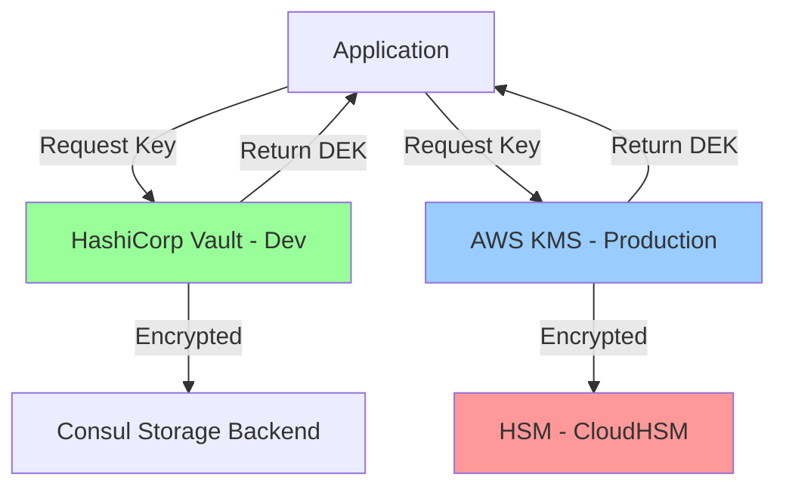
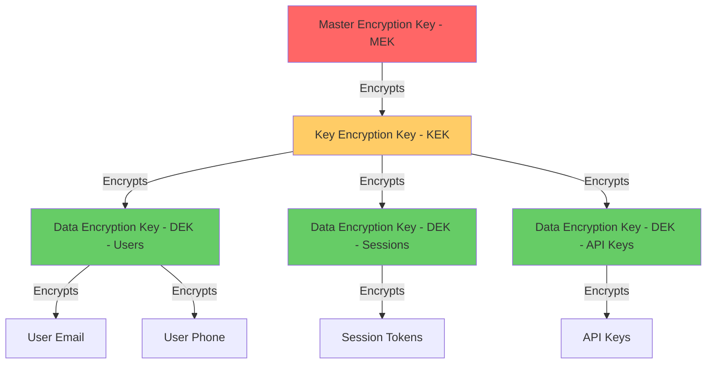
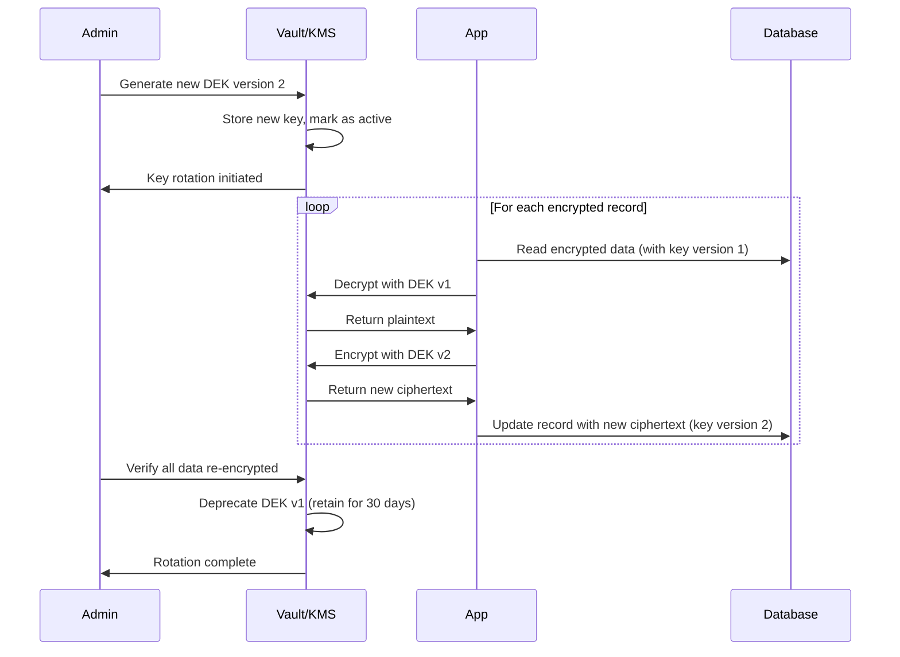
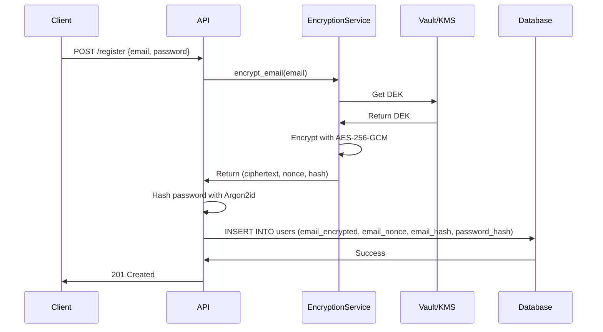
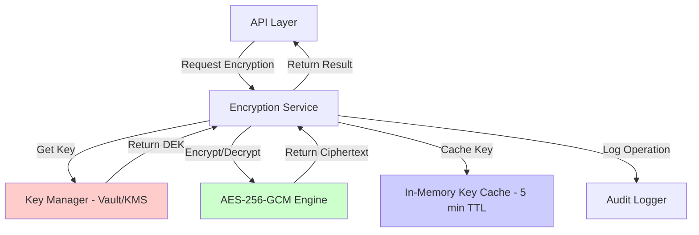

# Data Encryption Architecture - SUMA Finance

**Project**: SUMA Finance  
**Feature**: User Registration & Authentication  
**Gate**: Gate 1 - Data Encryption Architecture  
**Version**: 1.0  
**Date**: 2025-11-02

---

## 1. Encryption Architecture Overview

### High-Level Encryption Strategy

SUMA Finance implements a **defense-in-depth encryption strategy** to protect user authentication data and personally identifiable information (PII) throughout the data lifecycle.

**Core Principles:**
- **Encrypt at Rest**: All sensitive data stored in databases, file systems, and backups
- **Encrypt in Transit**: All network communication over TLS 1.3
- **Encrypt Credentials**: Password hashing with Argon2id (NOT encryption)
- **Key Separation**: Distinct keys for different data classifications
- **Zero-Trust Model**: Assume all network layers are compromised

### Encryption Scope

| Data Type | At Rest | In Transit | Field-Level | Compliance |
|-----------|---------|------------|-------------|------------|
| User Credentials | Hashed (Argon2id) | TLS 1.3 | Yes | GDPR, SOC 2 |
| Email Addresses | AES-256-GCM | TLS 1.3 | Yes | GDPR |
| Phone Numbers | AES-256-GCM | TLS 1.3 | Yes | GDPR |
| Session Tokens | AES-256-GCM | TLS 1.3 | Yes | GDPR, SOC 2 |
| API Keys | AES-256-GCM | TLS 1.3 | Yes | SOC 2 |
| Audit Logs | AES-256-GCM | TLS 1.3 | No (full encryption) | GDPR, SOC 2 |

### Compliance Requirements

- **GDPR (EU)**: Encryption as a pseudonymization technique (Article 32)
- **SOC 2 (Type II)**: Encryption controls for data security
- **ISO 27001**: Cryptographic controls (A.10.1.1, A.10.1.2)

### Technology Stack

- **Encryption Library**: OpenSSL 3.0+ (FIPS 140-2 compliant)
- **Key Management**: HashiCorp Vault (development) → AWS KMS (production)
- **Database Encryption**: PostgreSQL with pgcrypto extension
- **TLS Termination**: NGINX with Let's Encrypt (dev/staging) → AWS ALB (production)
- **Password Hashing**: Argon2id via `argon2-cffi` (Python) or `argon2` (Go)

---

## 2. Encryption at Rest Design

### Database Encryption

**Strategy**: Hybrid approach combining Transparent Data Encryption (TDE) and field-level encryption.

#### Transparent Data Encryption (TDE)

```yaml
# PostgreSQL TDE Configuration
Database: PostgreSQL 15+
Encryption: AES-256-XTS (full database encryption)
Implementation: pgcrypto extension + LUKS disk encryption
Scope: 
  - All tablespaces
  - WAL (Write-Ahead Log) files
  - Temporary files
```

**PostgreSQL Configuration:**

```sql
-- Enable pgcrypto extension
CREATE EXTENSION IF NOT EXISTS pgcrypto;

-- Example: Encrypted users table
CREATE TABLE users (
    id UUID PRIMARY KEY DEFAULT gen_random_uuid(),
    email_encrypted BYTEA NOT NULL, -- AES-256-GCM encrypted
    email_nonce BYTEA NOT NULL,     -- 96-bit nonce for GCM
    phone_encrypted BYTEA,          -- Optional field
    phone_nonce BYTEA,
    password_hash TEXT NOT NULL,    -- Argon2id hash
    created_at TIMESTAMP DEFAULT NOW(),
    updated_at TIMESTAMP DEFAULT NOW()
);

-- Index on non-encrypted search field (e.g., username)
CREATE UNIQUE INDEX idx_users_email_hash ON users(digest(email_encrypted, 'sha256'));
```

#### Column-Level Encryption for Sensitive Fields

**Fields Requiring Encryption:**
- `email` (PII)
- `phone_number` (PII)
- `session_token` (authentication)
- `api_key` (authentication)
- `oauth_refresh_token` (authentication)

**Encryption Method**: AES-256-GCM (authenticated encryption)

**Implementation Example (Python):**

```python
from cryptography.hazmat.primitives.ciphers.aead import AESGCM
import os

class FieldEncryptor:
    def __init__(self, kek: bytes):
        """
        Initialize with Key Encryption Key from Vault/KMS
        kek: 32-byte AES-256 key
        """
        self.aesgcm = AESGCM(kek)
    
    def encrypt_field(self, plaintext: str) -> tuple[bytes, bytes]:
        """
        Encrypt a field value
        Returns: (ciphertext, nonce)
        """
        nonce = os.urandom(12)  # 96-bit nonce for GCM
        plaintext_bytes = plaintext.encode('utf-8')
        ciphertext = self.aesgcm.encrypt(nonce, plaintext_bytes, None)
        return ciphertext, nonce
    
    def decrypt_field(self, ciphertext: bytes, nonce: bytes) -> str:
        """Decrypt a field value"""
        plaintext_bytes = self.aesgcm.decrypt(nonce, ciphertext, None)
        return plaintext_bytes.decode('utf-8')
```

**Implementation Example (Go):**

```go
package encryption

import (
    "crypto/aes"
    "crypto/cipher"
    "crypto/rand"
    "io"
)

type FieldEncryptor struct {
    gcm cipher.AEAD
}

func NewFieldEncryptor(kek []byte) (*FieldEncryptor, error) {
    block, err := aes.NewCipher(kek) // 32-byte key for AES-256
    if err != nil {
        return nil, err
    }
    
    gcm, err := cipher.NewGCM(block)
    if err != nil {
        return nil, err
    }
    
    return &FieldEncryptor{gcm: gcm}, nil
}

func (fe *FieldEncryptor) EncryptField(plaintext string) ([]byte, []byte, error) {
    nonce := make([]byte, fe.gcm.NonceSize())
    if _, err := io.ReadFull(rand.Reader, nonce); err != nil {
        return nil, nil, err
    }
    
    ciphertext := fe.gcm.Seal(nil, nonce, []byte(plaintext), nil)
    return ciphertext, nonce, nil
}

func (fe *FieldEncryptor) DecryptField(ciphertext, nonce []byte) (string, error) {
    plaintext, err := fe.gcm.Open(nil, nonce, ciphertext, nil)
    if err != nil {
        return "", err
    }
    return string(plaintext), nil
}
```

#### Encrypted Backup Strategy

```yaml
Backup Encryption:
  Database Dumps:
    - Encrypt with AES-256-GCM before upload to S3
    - Use separate backup encryption key (rotated quarterly)
    - Store backup key in AWS KMS with separate IAM policy
  
  Backup Storage:
    - AWS S3 with SSE-KMS (Server-Side Encryption)
    - Bucket encryption enabled by default
    - Versioning enabled with MFA delete
  
  Backup Rotation:
    - Daily backups: Retain 7 days
    - Weekly backups: Retain 4 weeks
    - Monthly backups: Retain 12 months
    - Annual backups: Retain 7 years (compliance)
```

**Backup Encryption Script:**

```bash
#!/bin/bash
# Encrypted PostgreSQL backup script

DB_NAME="suma_finance"
BACKUP_DIR="/var/backups/postgres"
DATE=$(date +%Y%m%d_%H%M%S)
BACKUP_FILE="${BACKUP_DIR}/${DB_NAME}_${DATE}.sql.gz"
ENCRYPTED_FILE="${BACKUP_FILE}.enc"

# Get encryption key from Vault
BACKUP_KEY=$(vault kv get -field=backup_key secret/suma/backup)

# Create backup
pg_dump -U postgres -d ${DB_NAME} | gzip > ${BACKUP_FILE}

# Encrypt backup with AES-256-GCM
openssl enc -aes-256-gcm -salt -pbkdf2 -in ${BACKUP_FILE} -out ${ENCRYPTED_FILE} -pass pass:${BACKUP_KEY}

# Upload to S3 with SSE-KMS
aws s3 cp ${ENCRYPTED_FILE} s3://suma-backups/postgres/ --sse aws:kms --sse-kms-key-id arn:aws:kms:eu-west-1:123456789:key/backup-key

# Clean up local files
rm ${BACKUP_FILE} ${ENCRYPTED_FILE}
```

### File Storage Encryption

**Use Case**: Storing user-uploaded documents (e.g., profile pictures, verification documents)

#### Object Storage Encryption (AWS S3)

```yaml
S3 Encryption Configuration:
  Default Encryption: SSE-KMS (Server-Side Encryption with KMS)
  KMS Key: aws/s3 (AWS managed) for dev → Custom CMK for production
  Bucket Policy: Enforce encryption for all PUT operations
  
  Additional Security:
    - Block public access
    - Enable versioning
    - Enable MFA delete
    - Enable access logging
```

**S3 Bucket Policy (Enforce Encryption):**

```json
{
  "Version": "2012-10-17",
  "Statement": [
    {
      "Sid": "DenyUnencryptedObjectUploads",
      "Effect": "Deny",
      "Principal": "*",
      "Action": "s3:PutObject",
      "Resource": "arn:aws:s3:::suma-user-uploads/*",
      "Condition": {
        "StringNotEquals": {
          "s3:x-amz-server-side-encryption": "aws:kms"
        }
      }
    }
  ]
}
```

#### Client-Side Encryption for Sensitive Files

For highly sensitive documents (e.g., identity verification), implement **client-side encryption before upload**.

```python
# Client-side file encryption before S3 upload
import boto3
from cryptography.hazmat.primitives.ciphers.aead import AESGCM

class S3FileEncryptor:
    def __init__(self, kms_client, s3_client):
        self.kms = kms_client
        self.s3 = s3_client
    
    def upload_encrypted_file(self, file_path: str, bucket: str, key: str):
        # Generate Data Encryption Key (DEK) from KMS
        response = self.kms.generate_data_key(
            KeyId='arn:aws:kms:eu-west-1:123456789:key/file-encryption-key',
            KeySpec='AES_256'
        )
        
        plaintext_key = response['Plaintext']  # 32-byte key
        encrypted_key = response['CiphertextBlob']  # Encrypted DEK
        
        # Encrypt file with DEK
        aesgcm = AESGCM(plaintext_key)
        nonce = os.urandom(12)
        
        with open(file_path, 'rb') as f:
            plaintext_data = f.read()
        
        ciphertext = aesgcm.encrypt(nonce, plaintext_data, None)
        
        # Store encrypted file with metadata
        self.s3.put_object(
            Bucket=bucket,
            Key=key,
            Body=ciphertext,
            Metadata={
                'x-amz-nonce': nonce.hex(),
                'x-amz-encrypted-dek': encrypted_key.hex()
            },
            ServerSideEncryption='aws:kms'  # Double encryption
        )
```

### Encryption Algorithms

| Use Case | Algorithm | Key Size | Mode | Rationale |
|----------|-----------|----------|------|-----------|
| Database Fields | AES-256 | 256-bit | GCM | Authenticated encryption, prevents tampering |
| File Encryption | AES-256 | 256-bit | GCM | Industry standard, FIPS 140-2 approved |
| Backup Encryption | AES-256 | 256-bit | GCM | Long-term security, quantum-resistant (for now) |
| Key Encryption | RSA | 4096-bit | OAEP | Asymmetric encryption for key wrapping |
| Key Exchange | ECDH | P-384 | - | Efficient key agreement, NSA Suite B |

**Secure Random Number Generation:**

```python
# Python: Use secrets module (cryptographically secure)
import secrets

# Generate 256-bit AES key
aes_key = secrets.token_bytes(32)

# Generate 96-bit GCM nonce
nonce = secrets.token_bytes(12)
```

```go
// Go: Use crypto/rand
import "crypto/rand"

// Generate 256-bit AES key
aesKey := make([]byte, 32)
_, err := rand.Read(aesKey)
```

---

## 3. Encryption in Transit Design

### TLS/SSL Configuration

**Minimum Version**: TLS 1.3 (fallback to TLS 1.2 for legacy clients)

**Cipher Suites (Ordered by Preference):**

```nginx
# NGINX TLS Configuration
ssl_protocols TLSv1.3 TLSv1.2;
ssl_prefer_server_ciphers on;

ssl_ciphers 'TLS_AES_256_GCM_SHA384:TLS_CHACHA20_POLY1305_SHA256:TLS_AES_128_GCM_SHA256:ECDHE-RSA-AES256-GCM-SHA384:ECDHE-RSA-AES128-GCM-SHA256';

ssl_ecdh_curve secp384r1;
ssl_session_timeout 10m;
ssl_session_cache shared:SSL:10m;
ssl_session_tickets off;

# OCSP Stapling
ssl_stapling on;
ssl_stapling_verify on;
resolver 8.8.8.8 8.8.4.4 valid=300s;
resolver_timeout 5s;
```

**AWS Application Load Balancer (ALB) Policy:**

```json
{
  "SecurityPolicy": "ELBSecurityPolicy-TLS-1-2-Ext-2018-06",
  "SslCertificates": [
    {
      "CertificateArn": "arn:aws:acm:eu-west-1:123456789:certificate/suma-finance-cert"
    }
  ],
  "AlpnPolicy": ["HTTP2Preferred"]
}
```

### Certificate Management

```yaml
Certificate Strategy:
  Development/Staging:
    - Let's Encrypt (free, auto-renewal)
    - Wildcard certificate (*.dev.suma-finance.com)
    - 90-day validity with auto-renewal
  
  Production:
    - AWS Certificate Manager (ACM)
    - EV (Extended Validation) certificate for main domain
    - Multi-domain SAN certificate
    - Auto-renewal managed by AWS
  
  Certificate Pinning (Mobile Apps):
    - Pin public key hash (SPKI)
    - Pin backup certificate
    - Update pins with app updates
```

**Certificate Pinning (iOS - Swift):**

```swift
import Foundation

class CertificatePinner: NSObject, URLSessionDelegate {
    let pinnedHashes = [
        "sha256/AAAAAAAAAAAAAAAAAAAAAAAAAAAAAAAAAAAAAAAAAAA=", // Primary cert
        "sha256/BBBBBBBBBBBBBBBBBBBBBBBBBBBBBBBBBBBBBBBBBBB="  // Backup cert
    ]
    
    func urlSession(_ session: URLSession,
                    didReceive challenge: URLAuthenticationChallenge,
                    completionHandler: @escaping (URLSession.AuthChallengeDisposition, URLCredential?) -> Void) {
        
        guard let serverTrust = challenge.protectionSpace.serverTrust,
              let certificate = SecTrustGetCertificateAtIndex(serverTrust, 0) else {
            completionHandler(.cancelAuthenticationChallenge, nil)
            return
        }
        
        let publicKey = SecCertificateCopyKey(certificate)
        let publicKeyData = SecKeyCopyExternalRepresentation(publicKey!, nil)! as Data
        let publicKeyHash = publicKeyData.base64EncodedString()
        
        if pinnedHashes.contains("sha256/\(publicKeyHash)") {
            completionHandler(.useCredential, URLCredential(trust: serverTrust))
        } else {
            completionHandler(.cancelAuthenticationChallenge, nil)
        }
    }
}
```

### HTTPS Enforcement

```nginx
# NGINX HTTPS Enforcement
server {
    listen 80;
    server_name suma-finance.com www.suma-finance.com;
    
    # Redirect all HTTP to HTTPS
    return 301 https://$host$request_uri;
}

server {
    listen 443 ssl http2;
    server_name suma-finance.com www.suma-finance.com;
    
    # HSTS (HTTP Strict Transport Security)
    add_header Strict-Transport-Security "max-age=31536000; includeSubDomains; preload" always;
    
    # Prevent clickjacking
    add_header X-Frame-Options "SAMEORIGIN" always;
    
    # Prevent MIME sniffing
    add_header X-Content-Type-Options "nosniff" always;
    
    # XSS Protection
    add_header X-XSS-Protection "1; mode=block" always;
    
    # CSP (Content Security Policy)
    add_header Content-Security-Policy "default-src 'self'; script-src 'self' 'unsafe-inline'; style-src 'self' 'unsafe-inline';" always;
}
```

**Secure Cookie Attributes:**

```python
# Python (Flask)
from flask import Flask, session

app = Flask(__name__)
app.config.update(
    SESSION_COOKIE_SECURE=True,      # HTTPS only
    SESSION_COOKIE_HTTPONLY=True,    # No JavaScript access
    SESSION_COOKIE_SAMESITE='Strict', # CSRF protection
    PERMANENT_SESSION_LIFETIME=1800   # 30 minutes
)
```

```go
// Go (Gorilla sessions)
import "github.com/gorilla/sessions"

store := sessions.NewCookieStore([]byte(sessionKey))
store.Options = &sessions.Options{
    Path:     "/",
    MaxAge:   1800, // 30 minutes
    HttpOnly: true,
    Secure:   true,
    SameSite: http.SameSiteStrictMode,
}
```

### API Communication

#### mTLS (Mutual TLS) for Service-to-Service Communication

```yaml
mTLS Configuration:
  Use Case: Backend microservices communication
  Implementation: Istio service mesh or manual cert management
  
  Components:
    - Client Certificate: Each service has unique client cert
    - Server Certificate: API server validates client cert
    - CA Certificate: Internal CA for issuing service certs
  
  Certificate Rotation: Automated every 7 days via cert-manager
```

**mTLS Client (Go):**

```go
package main

import (
    "crypto/tls"
    "crypto/x509"
    "io/ioutil"
    "net/http"
)

func createMTLSClient() (*http.Client, error) {
    // Load client certificate
    cert, err := tls.LoadX509KeyPair("client-cert.pem", "client-key.pem")
    if err != nil {
        return nil, err
    }
    
    // Load CA certificate
    caCert, err := ioutil.ReadFile("ca-cert.pem")
    if err != nil {
        return nil, err
    }
    
    caCertPool := x509.NewCertPool()
    caCertPool.AppendCertsFromPEM(caCert)
    
    tlsConfig := &tls.Config{
        Certificates: []tls.Certificate{cert},
        RootCAs:      caCertPool,
        MinVersion:   tls.VersionTLS13,
    }
    
    transport := &http.Transport{TLSClientConfig: tlsConfig}
    client := &http.Client{Transport: transport}
    
    return client, nil
}
```

#### End-to-End Encryption for Sensitive APIs

For highly sensitive operations (e.g., password reset), implement **application-layer encryption** on top of TLS.

```python
# API request encryption (Python client)
from cryptography.hazmat.primitives.asymmetric import rsa, padding
from cryptography.hazmat.primitives import hashes
import requests

class EncryptedAPIClient:
    def __init__(self, server_public_key: rsa.RSAPublicKey):
        self.server_pubkey = server_public_key
    
    def send_encrypted_request(self, endpoint: str, data: dict):
        # Serialize and encrypt payload
        plaintext = json.dumps(data).encode('utf-8')
        
        ciphertext = self.server_pubkey.encrypt(
            plaintext,
            padding.OAEP(
                mgf=padding.MGF1(algorithm=hashes.SHA256()),
                algorithm=hashes.SHA256(),
                label=None
            )
        )
        
        # Send encrypted payload over HTTPS
        response = requests.post(
            f"https://api.suma-finance.com{endpoint}",
            json={"encrypted_payload": ciphertext.hex()},
            headers={"Content-Type": "application/json"}
        )
        
        return response.json()
```

---

## 4. Key Management Architecture

### Key Generation

```yaml
Key Generation Requirements:
  Random Number Generator: CSPRNG (Cryptographically Secure Pseudo-Random Number Generator)
  Sources:
    - Python: secrets.token_bytes()
    - Go: crypto/rand.Read()
    - Linux: /dev/urandom
    - Hardware: TPM (Trusted Platform Module) or HSM
  
  Key Strength:
    - AES Keys: 256-bit (32 bytes)
    - RSA Keys: 4096-bit minimum
    - ECC Keys: P-384 curve minimum
  
  Key Types:
    - Symmetric: AES-256 for data encryption
    - Asymmetric: RSA-4096 or ECC P-384 for key exchange
```

**Key Generation Example:**

```python
import secrets
from cryptography.hazmat.primitives.asymmetric import rsa

# Generate AES-256 key
aes_key = secrets.token_bytes(32)

# Generate RSA-4096 key pair
private_key = rsa.generate_private_key(
    public_exponent=65537,
    key_size=4096
)
public_key = private_key.public_key()
```

### Key Storage



#### Development/Staging: HashiCorp Vault

```yaml
Vault Configuration:
  Deployment: Docker container on EC2
  Backend: Consul (distributed storage)
  Seal: Shamir secret sharing (3 of 5 keys)
  
  Auth Methods:
    - AppRole: For backend services
    - Kubernetes: For K8s-deployed services
    - LDAP: For admin access
  
  Secret Engines:
    - KV v2: Versioned secrets for API keys
    - Transit: Encryption as a Service
    - Database: Dynamic database credentials
```

**Vault Secret Structure:**

```
secret/
├── suma/
│   ├── encryption/
│   │   ├── dek-users (Data Encryption Key for users table)
│   │   ├── dek-sessions (Data Encryption Key for sessions)
│   │   └── master-key (Master Encryption Key)
│   ├── database/
│   │   └── postgres-creds (Dynamic credentials)
│   └── api/
│       └── external-service-keys
```

**Retrieving Keys from Vault (Python):**

```python
import hvac

class VaultKeyManager:
    def __init__(self, vault_url: str, token: str):
        self.client = hvac.Client(url=vault_url, token=token)
    
    def get_encryption_key(self, key_name: str) -> bytes:
        """Retrieve encryption key from Vault"""
        secret = self.client.secrets.kv.v2.read_secret_version(
            path=f'encryption/{key_name}',
            mount_point='suma'
        )
        
        key_hex = secret['data']['data']['key']
        return bytes.fromhex(key_hex)
    
    def rotate_key(self, key_name: str) -> bytes:
        """Generate and store new key version"""
        new_key = secrets.token_bytes(32)
        
        self.client.secrets.kv.v2.create_or_update_secret(
            path=f'encryption/{key_name}',
            secret={'key': new_key.hex()},
            mount_point='suma'
        )
        
        return new_key
```

#### Production: AWS KMS

```yaml
KMS Configuration:
  Master Keys (CMKs):
    - suma-encryption-key: For field-level encryption
    - suma-backup-key: For backup encryption
    - suma-session-key: For session token encryption
  
  Key Policy:
    - Allow: Application IAM role (suma-backend-role)
    - Deny: All other principals
    - Require: MFA for key deletion
  
  Key Rotation:
    - Automatic: Enabled (yearly rotation)
    - Manual: On-demand for security incidents
  
  CloudHSM Integration:
    - Custom Key Store: FIPS 140-2 Level 3 compliance
    - Dedicated HSM cluster
```

**Retrieving Keys from AWS KMS (Python):**

```python
import boto3
from cryptography.hazmat.primitives.ciphers.aead import AESGCM

class KMSKeyManager:
    def __init__(self):
        self.kms = boto3.client('kms', region_name='eu-west-1')
        self.key_id = 'arn:aws:kms:eu-west-1:123456789:key/suma-encryption-key'
    
    def generate_data_key(self) -> tuple[bytes, bytes]:
        """Generate DEK from KMS"""
        response = self.kms.generate_data_key(
            KeyId=self.key_id,
            KeySpec='AES_256'
        )
        
        plaintext_key = response['Plaintext']
        encrypted_key = response['CiphertextBlob']
        
        return plaintext_key, encrypted_key
    
    def decrypt_data_key(self, encrypted_key: bytes) -> bytes:
        """Decrypt DEK using KMS"""
        response = self.kms.decrypt(
            CiphertextBlob=encrypted_key
        )
        
        return response['Plaintext']
```

### Key Hierarchy



**Key Hierarchy Levels:**

| Level | Key Type | Purpose | Rotation Frequency | Storage |
|-------|----------|---------|-------------------|---------|
| **L0** | Master Encryption Key (MEK) | Root of trust, encrypts KEKs | Annual (automatic in KMS) | AWS KMS / CloudHSM |
| **L1** | Key Encryption Key (KEK) | Encrypts Data Encryption Keys | Quarterly | Encrypted by MEK, stored in Vault/KMS |
| **L2** | Data Encryption Key (DEK) | Encrypts actual data fields | Monthly | Encrypted by KEK, stored in database |

**Envelope Encryption Pattern:**

```python
class EnvelopeEncryption:
    def __init__(self, kms_manager: KMSKeyManager):
        self.kms = kms_manager
    
    def encrypt_data(self, plaintext: str) -> dict:
        """Encrypt data using envelope encryption"""
        # Generate DEK from KMS
        plaintext_dek, encrypted_dek = self.kms.generate_data_key()
        
        # Encrypt data with DEK
        aesgcm = AESGCM(plaintext_dek)
        nonce = secrets.token_bytes(12)
        ciphertext = aesgcm.encrypt(nonce, plaintext.encode('utf-8'), None)
        
        # Return encrypted data + encrypted DEK
        return {
            'ciphertext': ciphertext,
            'nonce': nonce,
            'encrypted_dek': encrypted_dek  # Store this with ciphertext
        }
    
    def decrypt_data(self, encrypted_payload: dict) -> str:
        """Decrypt data using envelope encryption"""
        # Decrypt DEK using KMS
        plaintext_dek = self.kms.decrypt_data_key(encrypted_payload['encrypted_dek'])
        
        # Decrypt data with DEK
        aesgcm = AESGCM(plaintext_dek)
        plaintext_bytes = aesgcm.decrypt(
            encrypted_payload['nonce'],
            encrypted_payload['ciphertext'],
            None
        )
        
        return plaintext_bytes.decode('utf-8')
```

### Key Rotation

```yaml
Key Rotation Schedule:
  Master Encryption Key (MEK):
    Frequency: Annual (automatic in AWS KMS)
    Process: AWS manages automatically, old key versions retained
    Impact: None (KMS handles transparently)
  
  Key Encryption Key (KEK):
    Frequency: Quarterly (every 90 days)
    Process: Generate new KEK, re-encrypt all DEKs
    Downtime: Zero (blue-green deployment)
  
  Data Encryption Key (DEK):
    Frequency: Monthly for active keys, on-demand for compromised keys
    Process: Generate new DEK, re-encrypt data in batches
    Downtime: Zero (background re-encryption)
  
  Old Key Retention:
    Policy: Retain previous 3 versions
    Purpose: Decrypt old data, support rollback
    Deletion: After all data re-encrypted with new key
```

**Zero-Downtime Key Rotation Process:**



**Key Rotation Script (Python):**

```python
import asyncio
import asyncpg
from typing import List

class KeyRotator:
    def __init__(self, db_pool: asyncpg.Pool, old_key: bytes, new_key: bytes):
        self.db = db_pool
        self.old_encryptor = AESGCM(old_key)
        self.new_encryptor = AESGCM(new_key)
    
    async def rotate_user_emails(self, batch_size: int = 1000):
        """Rotate encryption keys for user emails"""
        offset = 0
        
        while True:
            # Fetch batch of users
            users = await self.db.fetch(
                "SELECT id, email_encrypted, email_nonce FROM users LIMIT $1 OFFSET $2",
                batch_size, offset
            )
            
            if not users:
                break
            
            # Re-encrypt in batch
            updates = []
            for user in users:
                # Decrypt with old key
                plaintext = self.old_encryptor.decrypt(
                    bytes(user['email_nonce']),
                    bytes(user['email_encrypted']),
                    None
                )
                
                # Encrypt with new key
                new_nonce = secrets.token_bytes(12)
                new_ciphertext = self.new_encryptor.encrypt(new_nonce, plaintext, None)
                
                updates.append((new_ciphertext, new_nonce, user['id']))
            
            # Batch update
            await self.db.executemany(
                "UPDATE users SET email_encrypted = $1, email_nonce = $2, key_version = 2 WHERE id = $3",
                updates
            )
            
            print(f"Rotated {len(users)} users (offset {offset})")
            offset += batch_size
            
            # Rate limiting to avoid database overload
            await asyncio.sleep(1)
        
        print("Key rotation complete")
```

---

## 5. Sensitive Data Encryption

### Personally Identifiable Information (PII)

```yaml
PII Data Classification:
  High Sensitivity (Always Encrypted):
    - Email addresses
    - Phone numbers
    - Full name
    - Date of birth
    - Government ID numbers (SSN, passport)
    - Home address
  
  Medium Sensitivity (Encrypted in production):
    - Username (if reveals identity)
    - IP addresses
    - Device identifiers
  
  Low Sensitivity (Hashed/masked):
    - User ID (UUID, not encrypted)
    - Timestamps
    - Session metadata
```

**Database Schema for Encrypted PII:**

```sql
CREATE TABLE users (
    id UUID PRIMARY KEY DEFAULT gen_random_uuid(),
    
    -- Encrypted fields
    email_encrypted BYTEA NOT NULL,
    email_nonce BYTEA NOT NULL,
    phone_encrypted BYTEA,
    phone_nonce BYTEA,
    full_name_encrypted BYTEA,
    full_name_nonce BYTEA,
    
    -- Searchable hash (for lookups)
    email_hash BYTEA NOT NULL UNIQUE, -- SHA-256 hash
    
    -- Non-sensitive fields
    username VARCHAR(50) UNIQUE,
    account_status VARCHAR(20) DEFAULT 'active',
    created_at TIMESTAMP DEFAULT NOW(),
    updated_at TIMESTAMP DEFAULT NOW(),
    
    -- Key management
    key_version INTEGER DEFAULT 1 NOT NULL
);

-- Index on searchable hash
CREATE UNIQUE INDEX idx_users_email_hash ON users(email_hash);
```

**PII Encryption Service:**

```python
import hashlib
from cryptography.hazmat.primitives.ciphers.aead import AESGCM

class PIIEncryptor:
    def __init__(self, encryption_key: bytes):
        self.aesgcm = AESGCM(encryption_key)
    
    def encrypt_email(self, email: str) -> tuple[bytes, bytes, bytes]:
        """
        Encrypt email and generate searchable hash
        Returns: (ciphertext, nonce, hash)
        """
        # Normalize email
        email_lower = email.lower().strip()
        
        # Generate searchable hash (for lookups)
        email_hash = hashlib.sha256(email_lower.encode('utf-8')).digest()
        
        # Encrypt email
        nonce = secrets.token_bytes(12)
        ciphertext = self.aesgcm.encrypt(nonce, email_lower.encode('utf-8'), None)
        
        return ciphertext, nonce, email_hash
    
    def decrypt_email(self, ciphertext: bytes, nonce: bytes) -> str:
        """Decrypt email"""
        plaintext = self.aesgcm.decrypt(nonce, ciphertext, None)
        return plaintext.decode('utf-8')
    
    def find_by_email(self, db_conn, email: str) -> dict:
        """Find user by email using searchable hash"""
        email_hash = hashlib.sha256(email.lower().strip().encode('utf-8')).digest()
        
        user = db_conn.fetchrow(
            "SELECT id, email_encrypted, email_nonce FROM users WHERE email_hash = $1",
            email_hash
        )
        
        if user:
            decrypted_email = self.decrypt_email(user['email_encrypted'], user['email_nonce'])
            return {'id': user['id'], 'email': decrypted_email}
        
        return None
```

### Authentication Credentials

**IMPORTANT**: Passwords are **HASHED**, not encrypted. Use Argon2id.

```yaml
Password Hashing:
  Algorithm: Argon2id (winner of Password Hashing Competition)
  Parameters:
    - Memory: 64 MB (65536 KB)
    - Iterations: 3
    - Parallelism: 4
    - Salt: 16 bytes (random per password)
    - Output: 32 bytes
  
  Library:
    - Python: argon2-cffi
    - Go: golang.org/x/crypto/argon2
    - Node.js: argon2
```

**Password Hashing Implementation:**

```python
from argon2 import PasswordHasher
from argon2.exceptions import VerifyMismatchError

class PasswordManager:
    def __init__(self):
        self.hasher = PasswordHasher(
            time_cost=3,        # Iterations
            memory_cost=65536,  # 64 MB
            parallelism=4,      # Threads
            hash_len=32,        # 32-byte output
            salt_len=16         # 16-byte salt
        )
    
    def hash_password(self, password: str) -> str:
        """Hash password with Argon2id"""
        return self.hasher.hash(password)
    
    def verify_password(self, password: str, password_hash: str) -> bool:
        """Verify password against hash"""
        try:
            self.hasher.verify(password_hash, password)
            
            # Check if rehashing is needed (parameters changed)
            if self.hasher.check_needs_rehash(password_hash):
                new_hash = self.hash_password(password)
                # Update database with new hash
                return True, new_hash
            
            return True, None
        except VerifyMismatchError:
            return False, None
```

```go
// Go implementation
package auth

import (
    "crypto/rand"
    "encoding/base64"
    "golang.org/x/crypto/argon2"
)

type PasswordHasher struct {
    memory      uint32
    iterations  uint32
    parallelism uint8
    saltLength  uint32
    keyLength   uint32
}

func NewPasswordHasher() *PasswordHasher {
    return &PasswordHasher{
        memory:      64 * 1024, // 64 MB
        iterations:  3,
        parallelism: 4,
        saltLength:  16,
        keyLength:   32,
    }
}

func (ph *PasswordHasher) HashPassword(password string) (string, error) {
    salt := make([]byte, ph.saltLength)
    if _, err := rand.Read(salt); err != nil {
        return "", err
    }
    
    hash := argon2.IDKey(
        []byte(password),
        salt,
        ph.iterations,
        ph.memory,
        ph.parallelism,
        ph.keyLength,
    )
    
    // Encode as: $argon2id$v=19$m=65536,t=3,p=4$salt$hash
    encoded := fmt.Sprintf(
        "$argon2id$v=19$m=%d,t=%d,p=%d$%s$%s",
        ph.memory, ph.iterations, ph.parallelism,
        base64.RawStdEncoding.EncodeToString(salt),
        base64.RawStdEncoding.EncodeToString(hash),
    )
    
    return encoded, nil
}
```

**API Keys and Secrets Encryption:**

```python
class APIKeyManager:
    def __init__(self, encryption_key: bytes):
        self.aesgcm = AESGCM(encryption_key)
    
    def generate_api_key(self, user_id: str) -> tuple[str, bytes, bytes]:
        """
        Generate API key and encrypt for storage
        Returns: (api_key_plaintext, encrypted_key, nonce)
        """
        # Generate secure random API key (32 bytes = 64 hex chars)
        api_key = secrets.token_hex(32)
        
        # Encrypt API key before storing
        nonce = secrets.token_bytes(12)
        encrypted_key = self.aesgcm.encrypt(nonce, api_key.encode('utf-8'), None)
        
        return api_key, encrypted_key, nonce
    
    def validate_api_key(self, provided_key: str, encrypted_key: bytes, nonce: bytes) -> bool:
        """Validate API key"""
        try:
            stored_key = self.aesgcm.decrypt(nonce, encrypted_key, None).decode('utf-8')
            return secrets.compare_digest(provided_key, stored_key)
        except Exception:
            return False
```

---

## 6. Field-Level Encryption Design

### Application-Level Encryption

**Encryption happens in application layer before database write.**



**Service Layer Implementation:**

```python
from dataclasses import dataclass
from typing import Optional

@dataclass
class EncryptedField:
    ciphertext: bytes
    nonce: bytes
    searchable_hash: Optional[bytes] = None

class UserRegistrationService:
    def __init__(self, pii_encryptor: PIIEncryptor, password_manager: PasswordManager):
        self.encryptor = pii_encryptor
        self.password_mgr = password_manager
    
    async def register_user(self, email: str, password: str, phone: Optional[str] = None) -> str:
        """Register new user with encrypted PII"""
        
        # Encrypt email
        email_ciphertext, email_nonce, email_hash = self.encryptor.encrypt_email(email)
        
        # Hash password
        password_hash = self.password_mgr.hash_password(password)
        
        # Encrypt phone (if provided)
        phone_ciphertext, phone_nonce = None, None
        if phone:
            phone_ciphertext, phone_nonce, _ = self.encryptor.encrypt_email(phone)  # Reuse method
        
        # Insert into database
        user_id = await self.db.fetchval(
            """
            INSERT INTO users (email_encrypted, email_nonce, email_hash, phone_encrypted, phone_nonce, password_hash)
            VALUES ($1, $2, $3, $4, $5, $6)
            RETURNING id
            """,
            email_ciphertext, email_nonce, email_hash,
            phone_ciphertext, phone_nonce, password_hash
        )
        
        return str(user_id)
```

### Database-Native Encryption (PostgreSQL pgcrypto)

**Alternative approach using database functions.**

```sql
-- Enable pgcrypto
CREATE EXTENSION IF NOT EXISTS pgcrypto;

-- Store encryption key in environment variable (not in database!)
-- Key retrieved via application and passed to functions

-- Encrypt function
CREATE OR REPLACE FUNCTION encrypt_field(plaintext TEXT, key BYTEA)
RETURNS BYTEA AS $$
BEGIN
    RETURN pgp_sym_encrypt(plaintext, key);
END;
$$ LANGUAGE plpgsql;

-- Decrypt function
CREATE OR REPLACE FUNCTION decrypt_field(ciphertext BYTEA, key BYTEA)
RETURNS TEXT AS $$
BEGIN
    RETURN pgp_sym_decrypt(ciphertext, key);
END;
$$ LANGUAGE plpgsql;

-- Usage example
INSERT INTO users (email_encrypted)
VALUES (encrypt_field('user@example.com', decode('hex_key_here', 'hex')));

SELECT decrypt_field(email_encrypted, decode('hex_key_here', 'hex')) AS email
FROM users WHERE id = 'user-id';
```

**⚠️ WARNING**: Database-native encryption has limitations:
- Keys must be passed from application (security risk)
- No authenticated encryption (use AES-GCM in app layer instead)
- Difficult key rotation
- Performance overhead on database

**Recommendation**: Use **application-level encryption** for better control and security.

### Performance Considerations

```yaml
Encryption Performance Impact:
  Encryption Overhead:
    - AES-256-GCM: ~1-2 μs per operation (negligible)
    - RSA-4096: ~10-50 ms per operation (use sparingly)
  
  Database Performance:
    - Encrypted fields: Cannot use standard indexes
    - Searchable hash: Use for lookups (indexed)
    - Full table scan: Avoid decrypting in WHERE clause
  
  Caching Strategy:
    - Cache decrypted data in application memory (short TTL)
    - Use Redis for session tokens (encrypted in Redis)
    - Invalidate cache on key rotation
  
  Optimization Techniques:
    - Batch encryption/decryption
    - Lazy decryption (decrypt only when needed)
    - Async encryption for non-blocking operations
```

**Indexed Searchable Hash Example:**

```sql
-- GOOD: Uses index on searchable hash
SELECT id, email_encrypted, email_nonce
FROM users
WHERE email_hash = decode('sha256_hash_here', 'hex');

-- BAD: Cannot use index on encrypted field
SELECT id, email_encrypted
FROM users
WHERE decrypt_field(email_encrypted, key) = 'user@example.com';  -- Full table scan!
```

**Caching Decrypted Data (Python with Redis):**

```python
import redis
import json

class EncryptedDataCache:
    def __init__(self, redis_client: redis.Redis, encryption_key: bytes):
        self.redis = redis_client
        self.encryptor = AESGCM(encryption_key)
        self.ttl = 300  # 5 minutes
    
    def cache_user_data(self, user_id: str, data: dict):
        """Cache decrypted user data (encrypted in Redis)"""
        # Encrypt before caching
        nonce = secrets.token_bytes(12)
        plaintext = json.dumps(data).encode('utf-8')
        ciphertext = self.encryptor.encrypt(nonce, plaintext, None)
        
        # Store in Redis with TTL
        cache_key = f"user:{user_id}"
        self.redis.setex(
            cache_key,
            self.ttl,
            json.dumps({'ciphertext': ciphertext.hex(), 'nonce': nonce.hex()})
        )
    
    def get_cached_user_data(self, user_id: str) -> Optional[dict]:
        """Retrieve and decrypt cached user data"""
        cache_key = f"user:{user_id}"
        cached = self.redis.get(cache_key)
        
        if not cached:
            return None
        
        cached_data = json.loads(cached)
        ciphertext = bytes.fromhex(cached_data['ciphertext'])
        nonce = bytes.fromhex(cached_data['nonce'])
        
        plaintext = self.encryptor.decrypt(nonce, ciphertext, None)
        return json.loads(plaintext)
```

---

## 7. Data Masking and Redaction

### Log Masking

**CRITICAL**: Never log PII in plaintext.

```python
import logging
import re

class PIIMaskingFilter(logging.Filter):
    """Logging filter to mask PII"""
    
    EMAIL_PATTERN = r'\b[A-Za-z0-9._%+-]+@[A-Za-z0-9.-]+\.[A-Z|a-z]{2,}\b'
    PHONE_PATTERN = r'\b\d{3}[-.]?\d{3}[-.]?\d{4}\b'
    SSN_PATTERN = r'\b\d{3}-\d{2}-\d{4}\b'
    
    def filter(self, record: logging.LogRecord) -> bool:
        # Mask PII in log message
        record.msg = self._mask_pii(str(record.msg))
        
        # Mask PII in log arguments
        if record.args:
            record.args = tuple(self._mask_pii(str(arg)) for arg in record.args)
        
        return True
    
    def _mask_pii(self, text: str) -> str:
        # Mask emails: user@example.com → u***@example.com
        text = re.sub(self.EMAIL_PATTERN, lambda m: self._mask_email(m.group()), text)
        
        # Mask phones: 555-123-4567 → ***-***-4567
        text = re.sub(self.PHONE_PATTERN, '***-***-****', text)
        
        # Mask SSN: 123-45-6789 → ***-**-6789
        text = re.sub(self.SSN_PATTERN, '***-**-****', text)
        
        return text
    
    def _mask_email(self, email: str) -> str:
        local, domain = email.split('@')
        masked_local = local[0] + '***' if len(local) > 1 else '***'
        return f"{masked_local}@{domain}"

# Configure logger
logger = logging.getLogger('suma_finance')
logger.addFilter(PIIMaskingFilter())

# Example usage
logger.info(f"User registered: user@example.com")  # Logged as: User registered: u***@example.com
```

**Structured Logging with Auto-Masking:**

```python
import structlog

def mask_pii_processor(logger, method_name, event_dict):
    """Structlog processor to mask PII fields"""
    sensitive_fields = {'email', 'phone', 'ssn', 'password', 'api_key'}
    
    for key in event_dict:
        if key in sensitive_fields:
            event_dict[key] = '***REDACTED***'
    
    return event_dict

structlog.configure(
    processors=[
        structlog.stdlib.add_log_level,
        structlog.stdlib.add_logger_name,
        mask_pii_processor,  # Add masking processor
        structlog.processors.TimeStamper(fmt="iso"),
        structlog.processors.JSONRenderer()
    ]
)

logger = structlog.get_logger()
logger.info("user_registered", email="user@example.com", user_id="123")
# Output: {"event": "user_registered", "email": "***REDACTED***", "user_id": "123"}
```

### UI Masking

**Frontend Masking Examples:**

```typescript
// TypeScript/React masking utilities

export const maskEmail = (email: string): string => {
  const [local, domain] = email.split('@');
  if (local.length <= 2) return `***@${domain}`;
  return `${local[0]}***@${domain}`;
};

export const maskPhone = (phone: string): string => {
  // 555-123-4567 → ***-***-4567
  const last4 = phone.slice(-4);
  return `***-***-${last4}`;
};

export const maskCreditCard = (cardNumber: string): string => {
  // 4111111111111111 → ****1111
  const last4 = cardNumber.slice(-4);
  return `****${last4}`;
};

export const maskSSN = (ssn: string): string => {
  // 123-45-6789 → ***-**-6789
  const last4 = ssn.slice(-4);
  return `***-**-${last4}`;
};

// React component example
const UserProfile: React.FC<{user: User}> = ({user}) => {
  return (
    <div>
      <p>Email: {maskEmail(user.email)}</p>
      <p>Phone: {maskPhone(user.phone)}</p>
      <button onClick={() => setShowFull(true)}>Show Full Details</button>
    </div>
  );
};
```

### Data Export Masking

**Anonymization for Analytics:**

```python
import hashlib
import uuid

class DataAnonymizer:
    def __init__(self, salt: bytes):
        self.salt = salt
    
    def pseudonymize_user_id(self, user_id: str) -> str:
        """Deterministic pseudonymization (same input → same output)"""
        salted = f"{user_id}{self.salt.hex()}".encode('utf-8')
        hashed = hashlib.sha256(salted).hexdigest()
        return f"anon_{hashed[:16]}"
    
    def anonymize_user_id(self) -> str:
        """Full anonymization (random, cannot reverse)"""
        return str(uuid.uuid4())
    
    def mask_email_for_export(self, email: str) -> str:
        """Mask email for data export"""
        domain = email.split('@')[1]
        return f"user_***@{domain}"
    
    def export_anonymized_users(self, users: list[dict]) -> list[dict]:
        """Export user data with anonymization"""
        return [
            {
                'user_id': self.pseudonymize_user_id(user['id']),
                'email_domain': user['email'].split('@')[1],
                'registration_date': user['created_at'].date(),  # Remove time
                'account_status': user['status']
            }
            for user in users
        ]
```

---

## 8. Encryption in Backups

```yaml
Backup Encryption Strategy:
  Database Backups:
    - Encrypted at source: pg_dump piped through OpenSSL
    - Encrypted at rest: S3 SSE-KMS
    - Key: Separate backup encryption key (rotated quarterly)
  
  Incremental Backups:
    - WAL archives encrypted with same key
    - Stored in separate S3 bucket
  
  Backup Verification:
    - Weekly restore test to staging environment
    - Automated decryption check
  
  Disaster Recovery:
    - Backup keys stored in AWS Secrets Manager
    - Emergency key escrow with 2-of-3 key splitting (Shamir)
```

**Encrypted Backup Script:**

```bash
#!/bin/bash
# Encrypted PostgreSQL backup with KMS

set -e

DB_NAME="suma_finance"
DATE=$(date +%Y%m%d_%H%M%S)
BACKUP_FILE="/tmp/${DB_NAME}_${DATE}.sql.gz"
ENCRYPTED_FILE="${BACKUP_FILE}.enc"
S3_BUCKET="s3://suma-backups/postgres/"
KMS_KEY_ID="arn:aws:kms:eu-west-1:123456789:key/backup-key"

# Get backup encryption key from Secrets Manager
BACKUP_KEY=$(aws secretsmanager get-secret-value \
    --secret-id suma/backup-key \
    --query SecretString \
    --output text | jq -r .key)

# Create database dump
echo "Creating database dump..."
pg_dump -U postgres -d ${DB_NAME} -Fc | gzip > ${BACKUP_FILE}

# Encrypt with AES-256-GCM
echo "Encrypting backup..."
openssl enc -aes-256-gcm -salt -pbkdf2 -iter 100000 \
    -in ${BACKUP_FILE} \
    -out ${ENCRYPTED_FILE} \
    -pass pass:${BACKUP_KEY}

# Upload to S3 with SSE-KMS (double encryption)
echo "Uploading to S3..."
aws s3 cp ${ENCRYPTED_FILE} ${S3_BUCKET} \
    --sse aws:kms \
    --sse-kms-key-id ${KMS_KEY_ID} \
    --metadata "backup-date=${DATE},encrypted=true"

# Clean up local files
rm ${BACKUP_FILE} ${ENCRYPTED_FILE}

echo "Backup complete: ${S3_BUCKET}${DB_NAME}_${DATE}.sql.gz.enc"
```

**Disaster Recovery Key Escrow (Shamir Secret Sharing):**

```python
from secretsharing import PlaintextToHexSecretSharer

class KeyEscrow:
    def split_master_key(self, master_key: bytes, threshold: int = 2, shares: int = 3) -> list[str]:
        """
        Split master key using Shamir's Secret Sharing
        Requires 2 of 3 shares to reconstruct
        """
        hex_key = master_key.hex()
        key_shares = PlaintextToHexSecretSharer.split_secret(hex_key, threshold, shares)
        return key_shares
    
    def reconstruct_master_key(self, shares: list[str]) -> bytes:
        """Reconstruct master key from shares"""
        hex_key = PlaintextToHexSecretSharer.recover_secret(shares)
        return bytes.fromhex(hex_key)

# Usage for disaster recovery
escrow = KeyEscrow()
master_key = secrets.token_bytes(32)

# Split key into 3 shares (need 2 to recover)
shares = escrow.split_master_key(master_key, threshold=2, shares=3)

# Distribute shares to:
# Share 1: CTO (stored in personal password manager)
# Share 2: Security Officer (stored in hardware token)
# Share 3: External auditor (stored in safe deposit box)

# Emergency recovery (need any 2 shares)
recovered_key = escrow.reconstruct_master_key([shares[0], shares[2]])
assert recovered_key == master_key
```

---

## 9. Mobile Platform Encryption

### iOS Encryption

```swift
import Foundation
import Security

class iOSSecureStorage {
    // Store sensitive data in Keychain (hardware-encrypted)
    func saveToKeychain(key: String, data: String) -> Bool {
        guard let dataBytes = data.data(using: .utf8) else { return false }
        
        let query: [String: Any] = [
            kSecClass as String: kSecClassGenericPassword,
            kSecAttrAccount as String: key,
            kSecValueData as String: dataBytes,
            kSecAttrAccessible as String: kSecAttrAccessibleWhenUnlockedThisDeviceOnly
        ]
        
        SecItemDelete(query as CFDictionary) // Delete old value
        let status = SecItemAdd(query as CFDictionary, nil)
        
        return status == errSecSuccess
    }
    
    func retrieveFromKeychain(key: String) -> String? {
        let query: [String: Any] = [
            kSecClass as String: kSecClassGenericPassword,
            kSecAttrAccount as String: key,
            kSecReturnData as String: true,
            kSecMatchLimit as String: kSecMatchLimitOne
        ]
        
        var result: AnyObject?
        let status = SecItemCopyMatching(query as CFDictionary, &result)
        
        guard status == errSecSuccess,
              let data = result as? Data,
              let string = String(data: data, encoding: .utf8) else {
            return nil
        }
        
        return string
    }
    
    // Use Secure Enclave for cryptographic operations (iOS 9+)
    func generateSecureEnclaveKey() -> SecKey? {
        let access = SecAccessControlCreateWithFlags(
            kCFAllocatorDefault,
            kSecAttrAccessibleWhenUnlockedThisDeviceOnly,
            [.privateKeyUsage, .biometryCurrentSet],
            nil
        )
        
        let attributes: [String: Any] = [
            kSecAttrKeyType as String: kSecAttrKeyTypeECSECPrimeRandom,
            kSecAttrKeySizeInBits as String: 256,
            kSecAttrTokenID as String: kSecAttrTokenIDSecureEnclave,
            kSecPrivateKeyAttrs as String: [
                kSecAttrIsPermanent as String: true,
                kSecAttrApplicationTag as String: "com.suma.finance.enclave-key",
                kSecAttrAccessControl as String: access as Any
            ]
        ]
        
        var error: Unmanaged<CFError>?
        guard let privateKey = SecKeyCreateRandomKey(attributes as CFDictionary, &error) else {
            return nil
        }
        
        return privateKey
    }
}

// Usage
let storage = iOSSecureStorage()
storage.saveToKeychain(key: "api_token", data: "secret_token_here")
let token = storage.retrieveFromKeychain(key: "api_token")
```

### Android Encryption

```kotlin
import android.security.keystore.KeyGenParameterSpec
import android.security.keystore.KeyProperties
import androidx.security.crypto.EncryptedSharedPreferences
import androidx.security.crypto.MasterKey
import java.security.KeyStore
import javax.crypto.Cipher
import javax.crypto.KeyGenerator
import javax.crypto.SecretKey

class AndroidSecureStorage(private val context: Context) {
    
    // Use EncryptedSharedPreferences (Android Jetpack)
    fun getEncryptedPreferences(): SharedPreferences {
        val masterKey = MasterKey.Builder(context)
            .setKeyScheme(MasterKey.KeyScheme.AES256_GCM)
            .build()
        
        return EncryptedSharedPreferences.create(
            context,
            "suma_secure_prefs",
            masterKey,
            EncryptedSharedPreferences.PrefKeyEncryptionScheme.AES256_SIV,
            EncryptedSharedPreferences.PrefValueEncryptionScheme.AES256_GCM
        )
    }
    
    // Use Android Keystore for hardware-backed encryption
    fun generateKeystoreKey(keyAlias: String) {
        val keyGenerator = KeyGenerator.getInstance(
            KeyProperties.KEY_ALGORITHM_AES,
            "AndroidKeyStore"
        )
        
        val keyGenParameterSpec = KeyGenParameterSpec.Builder(
            keyAlias,
            KeyProperties.PURPOSE_ENCRYPT or KeyProperties.PURPOSE_DECRYPT
        )
            .setBlockModes(KeyProperties.BLOCK_MODE_GCM)
            .setEncryptionPaddings(KeyProperties.ENCRYPTION_PADDING_NONE)
            .setKeySize(256)
            .setUserAuthenticationRequired(true) // Requires biometric/PIN
            .setUserAuthenticationValidityDurationSeconds(30)
            .build()
        
        keyGenerator.init(keyGenParameterSpec)
        keyGenerator.generateKey()
    }
    
    fun encryptWithKeystore(keyAlias: String, plaintext: String): ByteArray {
        val keyStore = KeyStore.getInstance("AndroidKeyStore")
        keyStore.load(null)
        
        val secretKey = keyStore.getKey(keyAlias, null) as SecretKey
        val cipher = Cipher.getInstance("AES/GCM/NoPadding")
        cipher.init(Cipher.ENCRYPT_MODE, secretKey)
        
        return cipher.doFinal(plaintext.toByteArray(Charsets.UTF_8))
    }
}

// Usage
val storage = AndroidSecureStorage(context)
val prefs = storage.getEncryptedPreferences()
prefs.edit().putString("api_token", "secret_token_here").apply()
val token = prefs.getString("api_token", null)
```

### Mobile Database Encryption (SQLCipher)

```kotlin
// Android with SQLCipher
import net.sqlcipher.database.SQLiteDatabase

class EncryptedDatabaseHelper(context: Context) : SQLiteOpenHelper(
    context,
    "suma_finance.db",
    null,
    1
) {
    companion object {
        init {
            System.loadLibrary("sqlcipher")
        }
    }
    
    fun getWritableDatabase(password: String): SQLiteDatabase {
        return super.getWritableDatabase(password)
    }
    
    override fun onCreate(db: SQLiteDatabase) {
        db.execSQL("""
            CREATE TABLE users (
                id TEXT PRIMARY KEY,
                email_encrypted BLOB,
                created_at INTEGER
            )
        """)
    }
}

// Usage
val dbHelper = EncryptedDatabaseHelper(context)
val password = "secure_database_password_from_keystore"
val db = dbHelper.getWritableDatabase(password)
```

---

## 10. Key Access Control

```yaml
Key Access Policies:
  Master Encryption Key (MEK):
    Allowed:
      - KMS Service (automatic key operations)
      - Security Admin (emergency access with MFA)
    Denied:
      - Application services (no direct MEK access)
      - Developers (use DEK only)
  
  Data Encryption Key (DEK):
    Allowed:
      - Backend API service (IAM role: suma-backend-role)
      - Batch processing service (IAM role: suma-batch-role)
    Denied:
      - Frontend services (decrypt on backend only)
      - Third-party integrations
  
  Backup Encryption Key:
    Allowed:
      - Backup service (IAM role: suma-backup-role)
      - Disaster recovery admin (with 2FA)
    Denied:
      - Regular application services
```

**AWS KMS Key Policy (DEK):**

```json
{
  "Version": "2012-10-17",
  "Statement": [
    {
      "Sid": "Enable IAM policies",
      "Effect": "Allow",
      "Principal": {
        "AWS": "arn:aws:iam::123456789:root"
      },
      "Action": "kms:*",
      "Resource": "*"
    },
    {
      "Sid": "Allow backend service to use key",
      "Effect": "Allow",
      "Principal": {
        "AWS": "arn:aws:iam::123456789:role/suma-backend-role"
      },
      "Action": [
        "kms:Decrypt",
        "kms:GenerateDataKey",
        "kms:DescribeKey"
      ],
      "Resource": "*"
    },
    {
      "Sid": "Deny key deletion without MFA",
      "Effect": "Deny",
      "Principal": "*",
      "Action": [
        "kms:ScheduleKeyDeletion",
        "kms:DeleteAlias"
      ],
      "Resource": "*",
      "Condition": {
        "BoolIfExists": {
          "aws:MultiFactorAuthPresent": "false"
        }
      }
    }
  ]
}
```

**Key Usage Auditing (CloudTrail):**

```yaml
Audit Logging:
  Events to Monitor:
    - kms:Decrypt (track who decrypts data)
    - kms:GenerateDataKey (track DEK generation)
    - kms:ScheduleKeyDeletion (track key deletion attempts)
    - vault:read (Vault secret access)
  
  Alerting:
    - Alert on failed KMS decrypt attempts (potential attack)
    - Alert on unusual key access patterns
    - Alert on key policy changes
  
  Retention:
    - CloudTrail logs: 1 year
    - Vault audit logs: 90 days
    - Application encryption logs: 30 days
```

**Separation of Duties:**

| Role | Permissions | Restrictions |
|------|-------------|--------------|
| **Key Administrator** | Create/delete keys, rotate keys, modify key policies | Cannot use keys for encryption/decryption |
| **Key User (Application)** | Encrypt/decrypt with DEK, generate data keys | Cannot modify key policies, cannot delete keys |
| **Security Auditor** | View key usage logs, run compliance reports | Cannot access keys, cannot decrypt data |
| **Backup Operator** | Use backup encryption key | Cannot access application DEKs |

---

## 11. Compliance and Standards

### GDPR Compliance

```yaml
GDPR Requirements:
  Article 32 - Security of Processing:
    - Encryption of personal data (✓ AES-256-GCM)
    - Pseudonymization (✓ searchable hashes)
    - Regular testing of security measures (✓ backup restore tests)
  
  Article 17 - Right to Erasure:
    - Securely delete encryption keys for user data
    - Re-encrypt data with new key (crypto-shredding)
  
  Article 20 - Right to Data Portability:
    - Decrypt and export user data in structured format
    - Provide data in JSON/CSV format
  
  Data Breach Notification (72 hours):
    - Maintain encryption audit logs
    - Document which data was encrypted (reduces breach impact)
```

**GDPR Crypto-Shredding (Right to be Forgotten):**

```python
class GDPRCompliance:
    def __init__(self, kms_manager: KMSKeyManager):
        self.kms = kms_manager
    
    async def erase_user_data(self, user_id: str):
        """
        GDPR-compliant user data deletion via crypto-shredding
        Delete encryption key instead of data (makes data unrecoverable)
        """
        # Generate unique DEK for this user (envelope encryption)
        user_dek_name = f"user-dek-{user_id}"
        
        # Delete DEK from KMS/Vault (makes encrypted data unrecoverable)
        await self.kms.delete_key(user_dek_name)
        
        # Mark user as deleted in database (keep audit trail)
        await self.db.execute(
            "UPDATE users SET status = 'deleted', deleted_at = NOW() WHERE id = $1",
            user_id
        )
        
        # Log deletion for compliance audit
        logger.info("gdpr_deletion", user_id=user_id, method="crypto_shredding")
```

### PCI-DSS Compliance (if handling credit cards)

```yaml
PCI-DSS Requirements (for future payment integration):
  Requirement 3.4 - Render PAN Unreadable:
    - Use strong cryptography (✓ AES-256)
    - Full disk encryption (✓ LUKS for database)
    - Encrypted backups (✓ OpenSSL + S3 SSE-KMS)
  
  Requirement 3.5 - Document Key Management:
    - Key generation (✓ CSPRNG)
    - Key distribution (✓ KMS/Vault)
    - Key storage (✓ HSM/CloudHSM)
    - Key rotation (✓ automated quarterly)
    - Key retirement (✓ after re-encryption)
  
  Requirement 3.6 - Key Custodian Responsibilities:
    - Separation of duties (✓ IAM policies)
    - Dual control for key access (✓ 2-of-3 key splitting)
```

### SOC 2 Controls

```yaml
SOC 2 Type II - Security Controls:
  CC6.1 - Logical Access Security:
    - Encryption of data at rest (✓)
    - Encryption of data in transit (✓ TLS 1.3)
    - Key access controls (✓ IAM policies)
  
  CC6.6 - Encryption:
    - Encryption algorithm documentation (✓ AES-256-GCM)
    - Key management procedures (✓ this document)
    - Regular key rotation (✓ automated)
  
  CC7.2 - System Monitoring:
    - Encryption failure alerts (✓ CloudWatch)
    - Key access audit logs (✓ CloudTrail)
```

---

## 12. Implementation Architecture

### Encryption Service Design



**Encryption Service Interface:**

```python
from abc import ABC, abstractmethod
from dataclasses import dataclass
from typing import Optional

@dataclass
class EncryptionResult:
    ciphertext: bytes
    nonce: bytes
    key_version: int
    algorithm: str = "AES-256-GCM"

class IEncryptionService(ABC):
    @abstractmethod
    async def encrypt(self, plaintext: str, context: Optional[dict] = None) -> EncryptionResult:
        """Encrypt plaintext data"""
        pass
    
    @abstractmethod
    async def decrypt(self, ciphertext: bytes, nonce: bytes, key_version: int) -> str:
        """Decrypt ciphertext data"""
        pass
    
    @abstractmethod
    async def rotate_keys(self) -> None:
        """Rotate encryption keys"""
        pass

class EncryptionService(IEncryptionService):
    def __init__(self, key_manager: KMSKeyManager):
        self.key_manager = key_manager
        self.key_cache: dict[int, bytes] = {}
        self.current_key_version = 1
    
    async def encrypt(self, plaintext: str, context: Optional[dict] = None) -> EncryptionResult:
        # Get current DEK (cached)
        dek = await self._get_cached_key(self.current_key_version)
        
        # Encrypt with AES-256-GCM
        aesgcm = AESGCM(dek)
        nonce = secrets.token_bytes(12)
        ciphertext = aesgcm.encrypt(nonce, plaintext.encode('utf-8'), None)
        
        # Log encryption operation
        logger.info("encryption_performed", key_version=self.current_key_version, context=context)
        
        return EncryptionResult(
            ciphertext=ciphertext,
            nonce=nonce,
            key_version=self.current_key_version
        )
    
    async def decrypt(self, ciphertext: bytes, nonce: bytes, key_version: int) -> str:
        # Get DEK for specific version
        dek = await self._get_cached_key(key_version)
        
        # Decrypt with AES-256-GCM
        aesgcm = AESGCM(dek)
        plaintext_bytes = aesgcm.decrypt(nonce, ciphertext, None)
        
        # Log decryption operation
        logger.info("decryption_performed", key_version=key_version)
        
        return plaintext_bytes.decode('utf-8')
    
    async def _get_cached_key(self, version: int) -> bytes:
        if version not in self.key_cache:
            # Fetch from KMS
            dek = await self.key_manager.get_data_key(version)
            self.key_cache[version] = dek
        
        return self.key_cache[version]
```

### Database Schema for Encrypted Fields

```sql
-- Users table with encrypted PII
CREATE TABLE users (
    id UUID PRIMARY KEY DEFAULT gen_random_uuid(),
    
    -- Encrypted fields (with nonce and key version)
    email_encrypted BYTEA NOT NULL,
    email_nonce BYTEA NOT NULL,
    email_hash BYTEA NOT NULL UNIQUE, -- SHA-256 for lookups
    
    phone_encrypted BYTEA,
    phone_nonce BYTEA,
    
    full_name_encrypted BYTEA,
    full_name_nonce BYTEA,
    
    -- Authentication
    password_hash TEXT NOT NULL, -- Argon2id hash
    
    -- Metadata
    key_version INTEGER NOT NULL DEFAULT 1,
    account_status VARCHAR(20) DEFAULT 'active',
    created_at TIMESTAMP DEFAULT NOW(),
    updated_at TIMESTAMP DEFAULT NOW(),
    deleted_at TIMESTAMP NULL
);

-- Session tokens (encrypted)
CREATE TABLE sessions (
    id UUID PRIMARY KEY DEFAULT gen_random_uuid(),
    user_id UUID NOT NULL REFERENCES users(id),
    
    token_encrypted BYTEA NOT NULL,
    token_nonce BYTEA NOT NULL,
    token_hash BYTEA NOT NULL UNIQUE, -- For lookups
    
    key_version INTEGER NOT NULL DEFAULT 1,
    expires_at TIMESTAMP NOT NULL,
    created_at TIMESTAMP DEFAULT NOW()
);

-- API keys (encrypted)
CREATE TABLE api_keys (
    id UUID PRIMARY KEY DEFAULT gen_random_uuid(),
    user_id UUID NOT NULL REFERENCES users(id),
    
    key_encrypted BYTEA NOT NULL,
    key_nonce BYTEA NOT NULL,
    key_hash BYTEA NOT NULL UNIQUE,
    
    key_version INTEGER NOT NULL DEFAULT 1,
    name VARCHAR(100),
    last_used_at TIMESTAMP,
    created_at TIMESTAMP DEFAULT NOW(),
    revoked_at TIMESTAMP NULL
);

-- Indexes
CREATE INDEX idx_users_email_hash ON users(email_hash);
CREATE INDEX idx_sessions_token_hash ON sessions(token_hash);
CREATE INDEX idx_sessions_user_id ON sessions(user_id);
CREATE INDEX idx_api_keys_user_id ON api_keys(user_id);
CREATE INDEX idx_api_keys_hash ON api_keys(key_hash);
```

### Monitoring and Alerting

```yaml
Encryption Monitoring:
  Metrics to Track:
    - Encryption operation latency (p50, p95, p99)
    - Decryption failure rate
    - Key access errors
    - Cache hit rate for DEKs
  
  Alerts:
    - High decryption failure rate (> 1%) → Potential key rotation issue
    - KMS service unavailable → Circuit breaker activated
    - Unusual key access pattern → Potential security incident
    - Backup encryption failure → Immediate page to on-call
  
  Dashboards:
    - Encryption operations per second
    - Key version distribution (track rotation progress)
    - Failed encryption attempts by service
```

**CloudWatch Monitoring (Python):**

```python
import boto3
from datetime import datetime

class EncryptionMetrics:
    def __init__(self):
        self.cloudwatch = boto3.client('cloudwatch')
    
    def record_encryption_operation(self, duration_ms: float, success: bool):
        self.cloudwatch.put_metric_data(
            Namespace='SUMA/Encryption',
            MetricData=[
                {
                    'MetricName': 'EncryptionLatency',
                    'Value': duration_ms,
                    'Unit': 'Milliseconds',
                    'Timestamp': datetime.utcnow()
                },
                {
                    'MetricName': 'EncryptionSuccess',
                    'Value': 1 if success else 0,
                    'Unit': 'Count',
                    'Timestamp': datetime.utcnow()
                }
            ]
        )
    
    def record_key_cache_hit(self, hit: bool):
        self.cloudwatch.put_metric_data(
            Namespace='SUMA/Encryption',
            MetricData=[
                {
                    'MetricName': 'KeyCacheHitRate',
                    'Value': 1 if hit else 0,
                    'Unit': 'Count',
                    'Timestamp': datetime.utcnow()
                }
            ]
        )
```

---

## 13. Summary and Next Steps

### Summary

This Data Encryption Architecture document provides comprehensive encryption coverage for the **SUMA Finance User Registration & Authentication** feature:

✅ **Encryption at Rest**: AES-256-GCM for database fields, TDE for full database  
✅ **Encryption in Transit**: TLS 1.3 with strong cipher suites  
✅ **Key Management**: Hierarchical key architecture with Vault (dev) and AWS KMS (prod)  
✅ **Password Hashing**: Argon2id (not encryption)  
✅ **PII Protection**: Field-level encryption for emails, phones, etc.  
✅ **Mobile Security**: Keychain (iOS) and Keystore (Android) integration  
✅ **Compliance**: GDPR, SOC 2, ISO 27001 requirements addressed  
✅ **Backup Encryption**: Double-encrypted backups with separate keys  
✅ **Data Masking**: Log masking, UI masking, export anonymization  
✅ **Monitoring**: Encryption metrics and alerting  

### Implementation Checklist

- [ ] Set up HashiCorp Vault (development) or AWS KMS (production)
- [ ] Generate Master Encryption Key (MEK) in KMS
- [ ] Implement `EncryptionService` with AES-256-GCM
- [ ] Create database schema with encrypted fields
- [ ] Implement `PIIEncryptor` for email/phone encryption
- [ ] Implement `PasswordManager` with Argon2id
- [ ] Configure TLS 1.3 on NGINX/ALB
- [ ] Set up encrypted backups with OpenSSL + S3 SSE-KMS
- [ ] Implement key rotation scripts
- [ ] Configure CloudWatch monitoring and alerts
- [ ] Implement log masking for PII
- [ ] Set up certificate management (Let's Encrypt or ACM)
- [ ] Test disaster recovery with encrypted backups
- [ ] Document key escrow procedures (Shamir secret sharing)
- [ ] Conduct security audit and penetration testing

### Performance Benchmarks

Target performance for encryption operations:

| Operation | Target Latency (p95) | Target Throughput |
|-----------|---------------------|-------------------|
| Field Encryption (AES-256-GCM) | < 2 ms | > 10,000 ops/sec |
| Field Decryption (AES-256-GCM) | < 2 ms | > 10,000 ops/sec |
| Password Hashing (Argon2id) | < 100 ms | > 100 hashes/sec |
| KMS DEK Generation | < 50 ms | > 500 ops/sec |
| Database Query (encrypted field) | < 10 ms | > 1,000 queries/sec |

### Next Gate: Gate 2 - Detailed Design

This encryption architecture feeds into **Gate 2 (Detailed Design)**, which will include:
- API endpoint specifications with encrypted request/response
- Authentication flow diagrams with session token encryption
- Database ER diagrams with encryption annotations
- Error handling for encryption failures
- Rate limiting and abuse prevention

---

**Document End**