# Architecture Overview - SUMA Finance User Registration & Authentication

## 1. Executive Summary

### Project Overview
**Project Name:** SUMA Finance  
**Feature:** User Registration & Authentication  
**Version:** 1.0  
**Date:** 2025-11-02

### Architectural Vision
Build a secure, scalable, and user-friendly authentication system for SUMA Finance that provides seamless user registration, login, and session management while adhering to financial industry security standards and regulatory compliance requirements.

### High-Level Technology Stack
- **Frontend:** React with TypeScript, Material-UI
- **Backend:** Go (Gin framework)
- **Database:** PostgreSQL
- **Authentication:** JWT tokens with refresh token rotation
- **Security:** bcrypt password hashing, rate limiting, HTTPS/TLS
- **Infrastructure:** Docker containers, cloud-native deployment

### Key Architectural Decisions
1. **JWT-based stateless authentication** - Enables horizontal scaling and microservices readiness
2. **Refresh token rotation** - Enhanced security against token theft
3. **PostgreSQL for user data** - ACID compliance for financial data integrity
4. **Go backend** - High performance, strong typing, excellent concurrency
5. **React SPA** - Modern user experience with client-side state management

### Target Users and Scale
- **Primary Users:** Individual finance app users (consumers)
- **Initial Scale:** 10,000 concurrent users
- **Target Scale:** 100,000+ concurrent users
- **Response Time:** <200ms for authentication operations (p95)
- **Availability:** 99.9% uptime SLA

### Success Criteria
- ✅ Secure user registration with email verification
- ✅ Multi-factor authentication (MFA) support
- ✅ Password reset and account recovery
- ✅ Session management with automatic token refresh
- ✅ GDPR compliance for user data
- ✅ Sub-200ms authentication response times
- ✅ Zero critical security vulnerabilities

---

## 2. System Context and Scope

### System Boundaries

#### In Scope
- User registration with email/password
- Email verification workflow
- User login and logout
- JWT token generation and validation
- Refresh token rotation mechanism
- Password reset via email
- Multi-factor authentication (TOTP)
- Session management and token refresh
- User profile management (basic)
- Account deactivation and deletion
- Rate limiting and brute force protection

#### Out of Scope
- Social login (OAuth providers) - Phase 2
- Biometric authentication - Phase 3
- Single Sign-On (SSO) - Phase 3
- Advanced user profile features - Separate feature
- Payment processing - Separate feature
- Full identity verification (KYC) - Separate feature

#### External Dependencies
- **Email Service:** SendGrid or AWS SES for transactional emails
- **Time Service:** NTP servers for token expiration validation
- **DNS Provider:** Route53 or equivalent for domain management
- **SSL/TLS Certificates:** Let's Encrypt or cloud provider managed certificates

#### Third-Party Integrations
- **Email Delivery:** SendGrid API
- **Monitoring:** Datadog or CloudWatch
- **Secret Management:** AWS Secrets Manager or HashiCorp Vault

### Stakeholders

#### End Users
- Individual consumers managing personal finances
- Expectations: Secure, fast, and intuitive authentication
- Technical proficiency: Varying (basic to advanced)

#### Business Stakeholders
- Product owners requiring feature completeness
- Compliance officers ensuring regulatory adherence
- Marketing team for user acquisition metrics

#### Development Team
- Backend engineers (Go)
- Frontend engineers (React)
- DevOps engineers (infrastructure)
- QA engineers (security and functional testing)

#### Operations Team
- Site reliability engineers (SRE)
- Security operations center (SOC)
- Customer support team

### Business Context

#### Business Goals and Drivers
- **User Acquisition:** Frictionless registration to minimize drop-off
- **Security Compliance:** Meet financial industry standards
- **User Trust:** Secure authentication builds platform credibility
- **Scalability:** Support rapid user growth
- **Regulatory Compliance:** GDPR, PSD2 compliance

#### Key Performance Indicators (KPIs)
- Registration completion rate: >85%
- Login success rate: >98%
- Average registration time: <2 minutes
- Authentication API response time: <200ms (p95)
- Security incidents: 0 critical vulnerabilities
- Account takeover rate: <0.01%

#### Success Metrics
- User registration flow completion: >80%
- Email verification rate: >70% within 24 hours
- Password reset success rate: >90%
- MFA adoption rate: >30% of users
- Zero data breaches

---

## 3. High-Level Architecture

### Architecture Style

#### Layered Monolithic Architecture (Phase 1)
- **Rationale:** Simpler deployment, faster initial development, sufficient for initial scale
- **Future Evolution:** Microservices extraction when scale demands (>100k users)

**Architecture Layers:**
1. **Presentation Layer:** React SPA
2. **API Gateway Layer:** Reverse proxy (Nginx)
3. **Application Layer:** Go REST API services
4. **Data Access Layer:** Repository pattern with database abstraction
5. **Infrastructure Layer:** Database, caching, message queues

#### Event-Driven Components
- **Email notifications:** Asynchronous event processing
- **Audit logging:** Event stream for compliance
- **Analytics:** User behavior events

### System Context Diagram

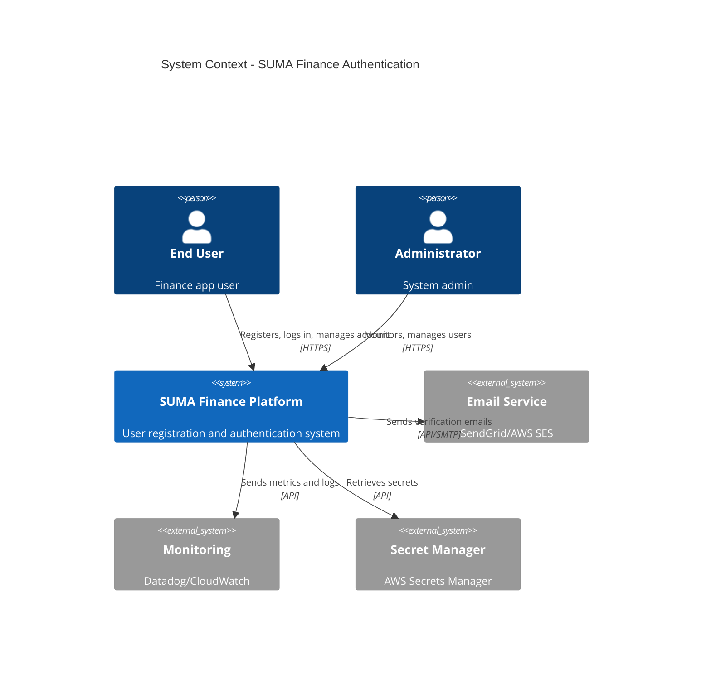

### Technology Stack Overview

#### Frontend Technologies
- **Framework:** React 18+ with TypeScript
- **State Management:** Zustand or React Context API
- **UI Library:** Material-UI (MUI) v5
- **Forms:** React Hook Form with Zod validation
- **HTTP Client:** Axios with interceptors
- **Build Tool:** Vite
- **Testing:** Vitest, React Testing Library, Cypress

#### Backend Technologies
- **Language:** Go 1.21+
- **Framework:** Gin Web Framework
- **ORM:** GORM
- **Authentication:** golang-jwt/jwt
- **Password Hashing:** bcrypt
- **Validation:** go-playground/validator
- **Testing:** Go testing package, Testify

#### Database Technologies
- **Primary Database:** PostgreSQL 15+
- **Caching:** Redis 7+ (session caching, rate limiting)
- **Schema Migration:** golang-migrate

#### Infrastructure and DevOps
- **Containerization:** Docker
- **Orchestration:** Kubernetes or Docker Compose (initial)
- **CI/CD:** GitHub Actions or GitLab CI
- **Infrastructure as Code:** Terraform
- **Cloud Provider:** AWS, GCP, or Azure

#### Third-Party Services
- **Email:** SendGrid or AWS SES
- **Monitoring:** Datadog, Prometheus + Grafana
- **Logging:** ELK Stack or CloudWatch Logs
- **Secret Management:** AWS Secrets Manager or Vault

---

## 4. Architecture Principles

### Design Principles

#### Separation of Concerns
- Clear boundaries between presentation, business logic, and data access
- Domain-driven design for business logic
- Infrastructure concerns isolated from business logic

#### Single Responsibility Principle
- Each component has one reason to change
- Services focused on specific authentication concerns
- Clear module boundaries

#### DRY (Don't Repeat Yourself)
- Reusable authentication middleware
- Shared validation logic
- Common error handling patterns

#### SOLID Principles
- **S:** Single responsibility per service/handler
- **O:** Open for extension (plugin architecture for MFA providers)
- **L:** Liskov substitution (interface-based design)
- **I:** Interface segregation (minimal interfaces)
- **D:** Dependency injection for testability

#### 12-Factor App Methodology
- **I. Codebase:** Single Git repository
- **II. Dependencies:** Go modules, npm packages
- **III. Config:** Environment variables
- **IV. Backing Services:** Database, Redis as attached resources
- **V. Build/Release/Run:** Strict separation via CI/CD
- **VI. Processes:** Stateless application processes
- **VII. Port Binding:** Self-contained HTTP service
- **VIII. Concurrency:** Horizontal scaling via container orchestration
- **IX. Disposability:** Fast startup/shutdown
- **X. Dev/Prod Parity:** Docker ensures environment consistency
- **XI. Logs:** Structured logging to stdout
- **XII. Admin Processes:** Database migrations as separate tasks

### Architectural Qualities

#### Scalability
- **Horizontal Scaling:** Stateless API servers behind load balancer
- **Database Scaling:** Read replicas for query distribution
- **Caching Strategy:** Redis for session data and rate limiting
- **Target:** 100,000+ concurrent users

#### Reliability and Availability
- **Target SLA:** 99.9% uptime (8.76 hours downtime/year)
- **Redundancy:** Multi-instance deployment across availability zones
- **Failover:** Automatic container restart and health checks
- **Data Durability:** PostgreSQL with automated backups

#### Performance
- **API Response Time:** <200ms (p95) for authentication endpoints
- **Database Query Time:** <50ms (p95)
- **Token Validation:** <10ms (in-memory verification)
- **Concurrent Requests:** 10,000 requests/second

#### Security
- **Authentication:** JWT with RS256 signing
- **Password Storage:** bcrypt with cost factor 12
- **Transport Security:** TLS 1.3 mandatory
- **Input Validation:** Strict schema validation
- **Rate Limiting:** 5 login attempts per 15 minutes
- **MFA:** TOTP-based two-factor authentication

#### Maintainability
- **Code Quality:** Linting, formatting, static analysis
- **Documentation:** OpenAPI/Swagger for API documentation
- **Testing:** >80% code coverage
- **Monitoring:** Comprehensive metrics and alerting

#### Testability
- **Unit Tests:** Isolated component testing
- **Integration Tests:** API endpoint testing
- **E2E Tests:** Complete user flow validation
- **Security Tests:** OWASP Top 10 vulnerability scanning

### Trade-offs and Constraints

#### Technical Constraints
- **Go Standard Library Preference:** Minimize third-party dependencies
- **PostgreSQL Only:** Single database technology for simplicity
- **JWT Statelessness:** No server-side session storage initially

#### Business Constraints
- **Time to Market:** 8-week development cycle
- **Budget:** Limited infrastructure budget (cost optimization required)
- **Compliance:** GDPR mandatory from day one

#### Trade-off Decisions and Rationale

| Decision | Trade-off | Rationale |
|----------|-----------|-----------|
| **JWT vs Session Cookies** | Stateless scalability vs revocation complexity | Chose JWT for horizontal scaling; mitigate with refresh token rotation |
| **Monolith vs Microservices** | Simplicity vs scalability | Monolith for faster initial development; refactor when scale demands |
| **Email Verification Required** | User friction vs security | Required verification for security and spam prevention |
| **bcrypt vs Argon2** | Industry standard vs modern algorithm | bcrypt for broader library support and proven track record |
| **React vs Vue/Svelte** | Ecosystem vs simplicity | React for larger ecosystem and team expertise |

---

## 5. Logical Architecture

### Application Layers

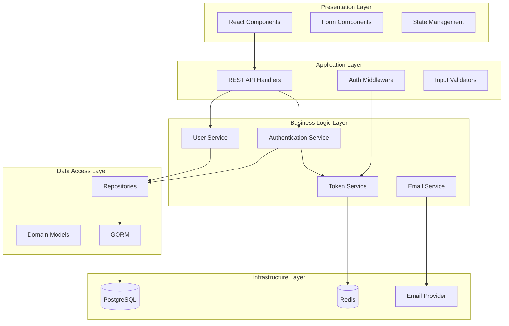

#### Presentation Layer (UI)
- **Responsibility:** User interface and user interactions
- **Components:**
  - Login/Register forms
  - Password reset flows
  - MFA setup and verification
  - Session management UI
- **Technology:** React, TypeScript, Material-UI

#### Application Layer (Business Logic)
- **Responsibility:** Request handling, validation, orchestration
- **Components:**
  - HTTP route handlers
  - Request validation middleware
  - Authentication middleware
  - Error handling middleware
- **Technology:** Go, Gin framework

#### Data Access Layer
- **Responsibility:** Database operations, data persistence
- **Components:**
  - Repository pattern implementations
  - Database models
  - Query builders
  - Transaction management
- **Technology:** GORM, PostgreSQL driver

#### Infrastructure Layer
- **Responsibility:** External integrations, storage, caching
- **Components:**
  - Database connections
  - Redis client
  - Email client
  - Secret management client

### Bounded Contexts (DDD)

#### Core Domain: Authentication & Authorization
**Entities:**
- User (aggregate root)
- Session
- RefreshToken
- EmailVerification
- PasswordReset

**Value Objects:**
- Email
- HashedPassword
- JWTToken
- VerificationCode

**Services:**
- AuthenticationService
- RegistrationService
- PasswordService

#### Supporting Subdomain: User Profile
**Entities:**
- UserProfile
- UserPreferences

**Services:**
- UserProfileService

#### Generic Subdomain: Notifications
**Entities:**
- EmailNotification

**Services:**
- EmailService

### Component Diagram

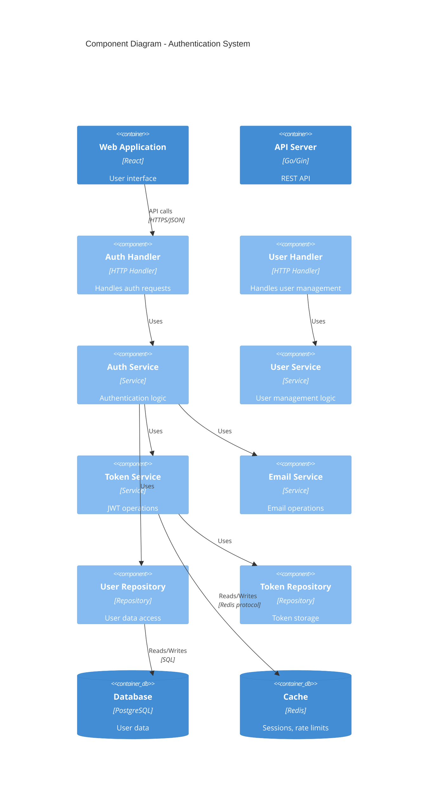

---

## 6. Frontend Architecture

### Frontend Technology Stack
- **Framework:** React 18.2+
- **Language:** TypeScript 5.0+
- **State Management:** Zustand (lightweight, scalable)
- **UI Library:** Material-UI (MUI) v5
- **Forms:** React Hook Form + Zod validation
- **HTTP Client:** Axios with interceptors
- **Build Tool:** Vite 4+
- **Testing:** Vitest, React Testing Library, Cypress
- **Linting:** ESLint, Prettier
- **Type Checking:** TypeScript strict mode

### Rendering Strategy
- **Client-Side Rendering (CSR):** Single Page Application
- **Rationale:**
  - Authentication flows are dynamic and user-specific
  - No SEO requirements for auth pages
  - Better user experience with instant transitions
- **Future Consideration:** Server-Side Rendering (SSR) for marketing pages

### Frontend Structure

```
src/
├── components/
│   ├── auth/
│   │   ├── LoginForm.tsx
│   │   ├── RegisterForm.tsx
│   │   ├── PasswordResetForm.tsx
│   │   └── MFASetup.tsx
│   ├── common/
│   │   ├── Button.tsx
│   │   ├── Input.tsx
│   │   └── ErrorBoundary.tsx
│   └── layout/
│       ├── AuthLayout.tsx
│       └── Header.tsx
├── pages/
│   ├── LoginPage.tsx
│   ├── RegisterPage.tsx
│   ├── VerifyEmailPage.tsx
│   └── ResetPasswordPage.tsx
├── services/
│   ├── authService.ts
│   ├── userService.ts
│   └── apiClient.ts
├── stores/
│   ├── authStore.ts
│   └── userStore.ts
├── hooks/
│   ├── useAuth.ts
│   ├── useUser.ts
│   └── useTokenRefresh.ts
├── utils/
│   ├── validators.ts
│   ├── tokenManager.ts
│   └── errorHandler.ts
├── types/
│   ├── auth.ts
│   └── user.ts
└── App.tsx
```

#### Component Architecture
- **Atomic Design Pattern:**
  - Atoms: Buttons, inputs, labels
  - Molecules: Form fields with labels
  - Organisms: Complete forms (LoginForm, RegisterForm)
  - Templates: Auth layout wrapper
  - Pages: Full page implementations

#### State Management Strategy
- **Zustand Store:** Global authentication state
  - Current user
  - Authentication tokens
  - Loading states
  - Error states
- **React Hook Form:** Form-level state
  - Form values
  - Validation errors
  - Submit state

#### Routing Architecture
- **React Router v6**
- **Protected Routes:** HOC for authenticated routes
- **Route Structure:**
  ```
  /login
  /register
  /verify-email/:token
  /reset-password
  /reset-password/:token
  /mfa/setup
  /mfa/verify
  ```

#### API Communication Layer
- **Axios Instance:** Configured base client
- **Interceptors:**
  - Request: Attach JWT token to headers
  - Response: Handle token refresh on 401
  - Error: Global error handling
- **Token Refresh Logic:** Automatic retry with refresh token

### Mobile Frontend
**Not applicable for Phase 1** - Web-only implementation initially.

**Future Consideration (Phase 2):**
- React Native for mobile apps
- Shared authentication logic via npm package
- Platform-specific UI components

---

## 7. Backend Architecture

### Backend Technology Stack
- **Language:** Go 1.21+
- **Framework:** Gin Web Framework
- **ORM:** GORM v2
- **Authentication:** golang-jwt/jwt v5
- **Validation:** go-playground/validator v10
- **Password Hashing:** golang.org/x/crypto/bcrypt
- **Database Driver:** lib/pq (PostgreSQL)
- **Redis Client:** go-redis/redis v9
- **Email:** SendGrid Go SDK
- **Testing:** Go testing, Testify
- **Linting:** golangci-lint

### Service Architecture

#### Monolithic Service (Phase 1)
- **Single deployable unit** containing all authentication logic
- **Clear module boundaries** for future extraction
- **Benefits:**
  - Simpler deployment
  - Faster development
  - Lower operational overhead
  - Suitable for initial scale (<100k users)

#### Future Microservices Evolution (Phase 2+)
Potential service extraction:
- **Auth Service:** Core authentication logic
- **User Service:** User profile management
- **Notification Service:** Email and SMS notifications
- **Session Service:** Session and token management

### API Design

#### RESTful API Endpoints

**Authentication Endpoints:**
```
POST   /api/v1/auth/register          - Register new user
POST   /api/v1/auth/verify-email      - Verify email address
POST   /api/v1/auth/login             - User login
POST   /api/v1/auth/logout            - User logout
POST   /api/v1/auth/refresh           - Refresh access token
POST   /api/v1/auth/forgot-password   - Initiate password reset
POST   /api/v1/auth/reset-password    - Complete password reset
```

**MFA Endpoints:**
```
POST   /api/v1/auth/mfa/setup         - Setup MFA
POST   /api/v1/auth/mfa/verify        - Verify MFA code
POST   /api/v1/auth/mfa/disable       - Disable MFA
```

**User Management:**
```
GET    /api/v1/users/me               - Get current user
PATCH  /api/v1/users/me               - Update user profile
DELETE /api/v1/users/me               - Delete user account
```

#### API Versioning
- **Strategy:** URI path versioning (`/api/v1/...`)
- **Rationale:** Simple, explicit, easy to route
- **Migration:** Maintain v1 for 12 months after v2 release

#### Rate Limiting
- **Strategy:** Token bucket algorithm via Redis
- **Limits:**
  - Login: 5 attempts per 15 minutes per IP
  - Registration: 3 attempts per hour per IP
  - Password reset: 3 attempts per hour per email
  - General API: 100 requests per minute per user
- **Response:** HTTP 429 with Retry-After header

#### Authentication and Authorization
- **Authentication:** JWT Bearer tokens in Authorization header
- **Access Token:** Short-lived (15 minutes)
- **Refresh Token:** Long-lived (7 days), stored in httpOnly cookie
- **Token Structure:**
  ```json
  {
    "sub": "user-uuid",
    "email": "user@example.com",
    "role": "user",
    "exp": 1699999999,
    "iat": 1699999999
  }
  ```

### Business Logic Layer

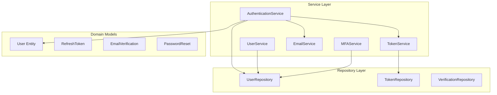

#### Domain Models

**User Entity:**
```go
type User struct {
    ID                string    `gorm:"primaryKey;type:uuid"`
    Email             string    `gorm:"uniqueIndex;not null"`
    PasswordHash      string    `gorm:"not null"`
    EmailVerified     bool      `gorm:"default:false"`
    MFAEnabled        bool      `gorm:"default:false"`
    MFASecret         string    `gorm:"type:text"`
    CreatedAt         time.Time
    UpdatedAt         time.Time
    LastLoginAt       *time.Time
}
```

**RefreshToken Entity:**
```go
type RefreshToken struct {
    ID        string    `gorm:"primaryKey;type:uuid"`
    UserID    string    `gorm:"type:uuid;index;not null"`
    Token     string    `gorm:"uniqueIndex;not null"`
    ExpiresAt time.Time `gorm:"not null"`
    CreatedAt time.Time
    Revoked   bool      `gorm:"default:false"`
}
```

#### Service Layer

**AuthenticationService:**
- `Register(email, password) error`
- `Login(email, password) (accessToken, refreshToken, error)`
- `VerifyEmail(token) error`
- `RefreshAccessToken(refreshToken) (accessToken, error)`
- `Logout(userID) error`
- `ForgotPassword(email) error`
- `ResetPassword(token, newPassword) error`

**UserService:**
- `GetUserByID(id) (*User, error)`
- `UpdateUser(id, updates) error`
- `DeleteUser(id) error`

**TokenService:**
- `GenerateAccessToken(user) (string, error)`
- `GenerateRefreshToken(user) (string, error)`
- `ValidateAccessToken(token) (*Claims, error)`
- `ValidateRefreshToken(token) (*Claims, error)`
- `RevokeRefreshToken(token) error`

---

## 8. Data Architecture

### Database Selection

#### Primary Database: PostgreSQL 15+
**Rationale:**
- **ACID Compliance:** Critical for financial data integrity
- **Mature Ecosystem:** Proven reliability and extensive tooling
- **JSON Support:** Flexibility for semi-structured data
- **Performance:** Excellent query performance with proper indexing
- **Open Source:** No vendor lock-in

**Alternatives Considered:**
- **MySQL:** Less robust JSON support
- **MongoDB:** No ACID transactions, eventual consistency risks
- **SQLite:** Not suitable for multi-instance deployment

### Data Model

#### Entity-Relationship Overview

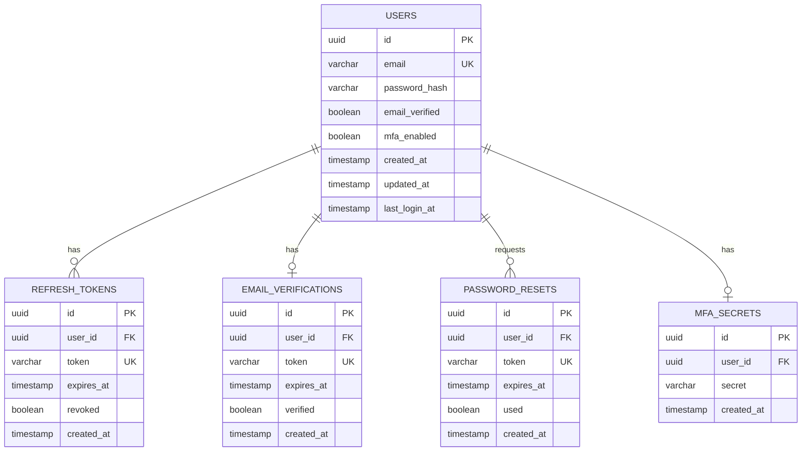

#### Key Entities and Relationships

1. **Users** (Aggregate Root)
   - Primary entity for authentication
   - Stores email, password hash, verification status
   - One-to-many: RefreshTokens, PasswordResets
   - One-to-one: EmailVerification, MFASecret

2. **RefreshTokens**
   - Supports refresh token rotation
   - Tracks token revocation
   - Automatic cleanup of expired tokens

3. **EmailVerifications**
   - Temporary tokens for email verification
   - Expires after 24 hours
   - One-time use

4. **PasswordResets**
   - Temporary tokens for password reset
   - Expires after 1 hour
   - One-time use

#### Data Normalization Approach
- **3rd Normal Form (3NF)** for relational integrity
- **Denormalization** for frequently accessed user metadata (e.g., last_login_at)

### Data Access

#### ORM: GORM
**Benefits:**
- Type-safe query building
- Automatic migrations
- Association management
- Hooks for lifecycle events

**Repository Pattern:**
```go
type UserRepository interface {
    Create(user *User) error
    FindByID(id string) (*User, error)
    FindByEmail(email string) (*User, error)
    Update(user *User) error
    Delete(id string) error
}

type userRepository struct {
    db *gorm.DB
}

func (r *userRepository) FindByEmail(email string) (*User, error) {
    var user User
    err := r.db.Where("email = ?", email).First(&user).Error
    return &user, err
}
```

### Data Flow

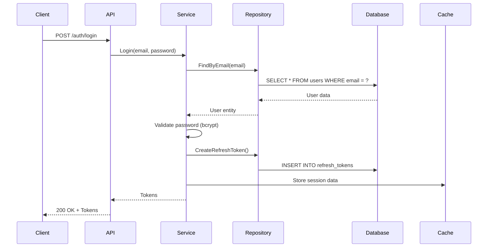

### Caching Strategy

#### Redis for Session and Rate Limiting
- **Session Cache:** Store active sessions (key: `session:{userID}`)
- **Rate Limiting:** Token bucket counters (key: `ratelimit:{endpoint}:{identifier}`)
- **Token Blacklist:** Revoked tokens before expiration (key: `blacklist:{tokenID}`)
- **TTL Strategy:**
  - Session: Match access token expiration (15 minutes)
  - Rate limit: Sliding window (15 minutes)
  - Blacklist: Match original token expiration

#### Cache Invalidation
- **On Logout:** Delete session cache
- **On Token Refresh:** Update session cache
- **On Password Change:** Delete all user sessions

---

## 9. Security Architecture

### Authentication

#### JWT (JSON Web Tokens)
**Access Token:**
- **Algorithm:** RS256 (RSA with SHA-256)
- **Lifetime:** 15 minutes
- **Storage:** LocalStorage or memory (frontend)
- **Payload:**
  ```json
  {
    "sub": "user-uuid",
    "email": "user@example.com",
    "role": "user",
    "exp": 1699999999,
    "iat": 1699999999,
    "jti": "token-uuid"
  }
  ```

**Refresh Token:**
- **Lifetime:** 7 days
- **Storage:** httpOnly, Secure, SameSite=Strict cookie
- **Rotation:** New refresh token issued on each use
- **Database-backed:** Stored in PostgreSQL for revocation

#### Session Management
- **Stateless Access Tokens:** No server-side session storage
- **Refresh Token Rotation:** Mitigates token theft
- **Automatic Token Refresh:** Frontend intercepts 401 and refreshes
- **Logout:** Revokes refresh token and clears cookies

#### Multi-Factor Authentication (MFA)
- **Method:** Time-based One-Time Password (TOTP)
- **Standard:** RFC 6238
- **Library:** pquerna/otp
- **Backup Codes:** 10 single-use recovery codes
- **Flow:**
  1. User enables MFA
  2. QR code generated for authenticator app
  3. User scans and verifies first code
  4. Future logins require TOTP verification

### Authorization

#### Access Control Model: Role-Based Access Control (RBAC)
**Roles:**
- `user` - Standard authenticated user
- `admin` - Administrative user (future phase)

**Permissions (Future):**
- Read own profile
- Update own profile
- Delete own account

**Middleware:**
```go
func RequireAuth() gin.HandlerFunc {
    return func(c *gin.Context) {
        token := extractToken(c)
        claims, err := validateToken(token)
        if err != nil {
            c.AbortWithStatus(401)
            return
        }
        c.Set("userID", claims.Subject)
        c.Next()
    }
}
```

### Data Protection

#### Encryption at Rest
- **Database:** PostgreSQL encryption at rest (cloud provider managed)
- **Backup Encryption:** AES-256 encrypted backups
- **Secrets:** AWS Secrets Manager or Vault for sensitive configuration

#### Encryption in Transit
- **TLS 1.3:** Mandatory for all API communication
- **HSTS:** HTTP Strict Transport Security header
- **Certificate Management:** Let's Encrypt with auto-renewal

#### Sensitive Data Handling
- **Password Storage:** bcrypt with cost factor 12
- **MFA Secrets:** AES-256 encrypted in database
- **PII:** Email addresses hashed for analytics
- **No Logging:** Never log passwords or tokens

#### Key Management
- **JWT Signing Keys:** RSA 2048-bit key pair
- **Key Rotation:** Annual rotation with grace period
- **Storage:** AWS Secrets Manager or HashiCorp Vault

### Security Layers

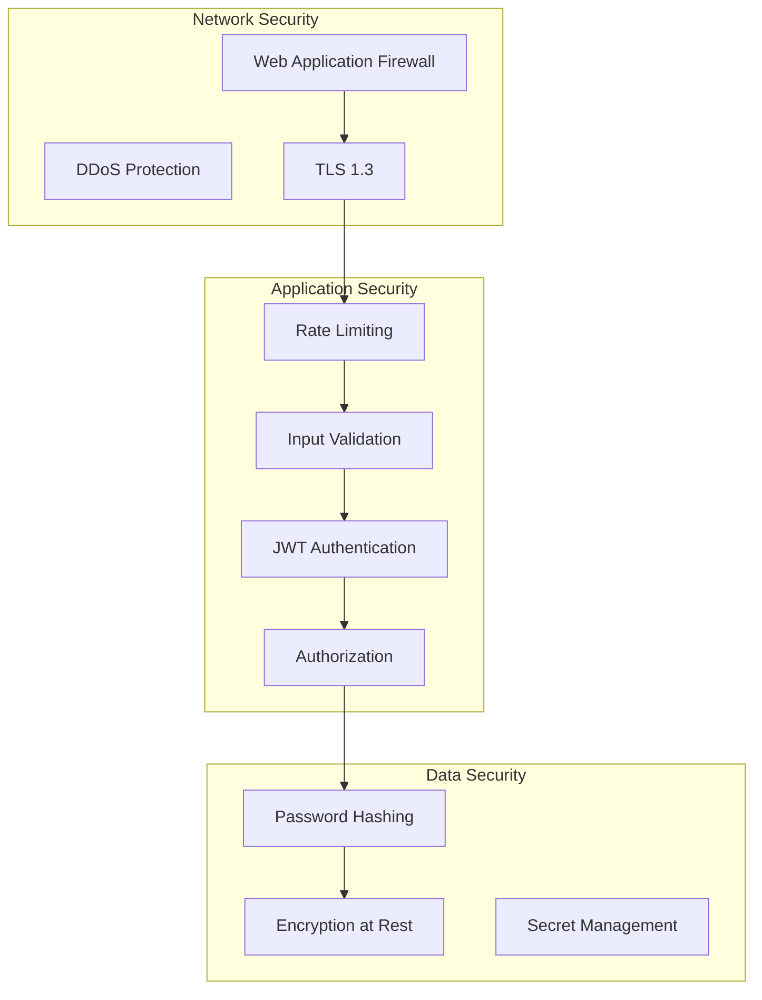

### Compliance

#### GDPR (General Data Protection Regulation)
- **Right to Access:** User can export their data (API endpoint)
- **Right to Deletion:** User can delete account and all data
- **Data Minimization:** Collect only necessary data (email, password)
- **Consent:** Explicit consent for terms and privacy policy
- **Breach Notification:** Incident response plan (72-hour notification)
- **Data Portability:** Export user data in JSON format

#### Security Standards

**OWASP Top 10 Mitigation:**
1. **Broken Access Control:** RBAC, token validation
2. **Cryptographic Failures:** TLS, bcrypt, JWT RS256
3. **Injection:** Parameterized queries, input validation
4. **Insecure Design:** Threat modeling, security reviews
5. **Security Misconfiguration:** Hardened defaults, security headers
6. **Vulnerable Components:** Dependency scanning, regular updates
7. **Authentication Failures:** MFA, rate limiting, account lockout
8. **Software and Data Integrity:** Signed commits, SRI for frontend
9. **Logging Failures:** Structured logging, audit trail
10. **SSRF:** Input validation, allowlist for external requests

**Security Headers:**
```
Strict-Transport-Security: max-age=31536000; includeSubDomains
Content-Security-Policy: default-src 'self'
X-Content-Type-Options: nosniff
X-Frame-Options: DENY
X-XSS-Protection: 1; mode=block
Referrer-Policy: strict-origin-when-cross-origin
```

---

## 10. Integration Architecture

### External API Integrations

#### Email Service (SendGrid)
**Purpose:** Transactional emails (verification, password reset)

**Integration Pattern:**
- **Protocol:** REST API over HTTPS
- **Authentication:** API key in request header
- **Retry Logic:** Exponential backoff (3 retries)
- **Fallback:** Log email to file if SendGrid unavailable (dev only)

**Email Templates:**
- Welcome email
- Email verification
- Password reset
- Account deletion confirmation

**Circuit Breaker:**
- **Threshold:** 5 consecutive failures
- **Timeout:** 30 seconds
- **Half-Open State:** Retry after 60 seconds

**Example Implementation:**
```go
type EmailService struct {
    client *sendgrid.Client
    breaker *gobreaker.CircuitBreaker
}

func (s *EmailService) SendVerificationEmail(email, token string) error {
    _, err := s.breaker.Execute(func() (interface{}, error) {
        return s.client.Send(buildEmail(email, token))
    })
    return err
}
```

### Internal Service Communication

**Phase 1: Monolithic**
- Direct function calls within application
- No inter-service communication needed

**Phase 2: Microservices (Future)**
- **Synchronous:** gRPC for low-latency service-to-service calls
- **Asynchronous:** Message queue (RabbitMQ) for events
- **API Contracts:** Protocol Buffers for type safety
- **Service Discovery:** Kubernetes DNS or Consul

### Event-Driven Architecture

**Not Applicable for Phase 1** - Monolithic architecture with direct calls.

**Future Consideration (Phase 2):**
- **Event Bus:** RabbitMQ or AWS EventBridge
- **Events:**
  - `UserRegistered`: Trigger welcome email, analytics
  - `EmailVerified`: Activate account features
  - `PasswordChanged`: Revoke all sessions, send notification
  - `AccountDeleted`: Cleanup user data, send confirmation
- **Event Schema:** JSON with versioning
- **Event Sourcing:** Audit log of authentication events

---

## 11. Deployment Architecture

### Infrastructure

#### Cloud Provider: AWS (Assumed)
**Services:**
- **Compute:** ECS (Elastic Container Service) or EC2 with Docker
- **Database:** RDS for PostgreSQL
- **Caching:** ElastiCache for Redis
- **Load Balancer:** Application Load Balancer (ALB)
- **Storage:** S3 for backups and logs
- **Secrets:** AWS Secrets Manager
- **Monitoring:** CloudWatch

**Alternative:** Google Cloud Platform (GCP) or Microsoft Azure

#### Containerization: Docker
**Dockerfile (Backend):**
```dockerfile
FROM golang:1.21-alpine AS builder
WORKDIR /app
COPY go.mod go.sum ./
RUN go mod download
COPY . .
RUN CGO_ENABLED=0 go build -o server ./cmd/server

FROM alpine:3.18
RUN apk --no-cache add ca-certificates
WORKDIR /root/
COPY --from=builder /app/server .
EXPOSE 8080
CMD ["./server"]
```

#### Orchestration
**Phase 1:** Docker Compose for local development
**Phase 2:** Kubernetes (EKS) for production

**Docker Compose (Local Dev):**
```yaml
version: '3.8'
services:
  api:
    build: ./backend
    ports:
      - "8080:8080"
    environment:
      - DB_HOST=db
      - REDIS_HOST=redis
    depends_on:
      - db
      - redis
  
  db:
    image: postgres:15-alpine
    environment:
      POSTGRES_DB: suma_finance
      POSTGRES_USER: suma
      POSTGRES_PASSWORD: devpassword
    volumes:
      - postgres_data:/var/lib/postgresql/data
  
  redis:
    image: redis:7-alpine
    ports:
      - "6379:6379"
  
  frontend:
    build: ./frontend
    ports:
      - "3000:3000"
    depends_on:
      - api

volumes:
  postgres_data:
```

### Environments

#### Development
- **Purpose:** Local developer machines
- **Infrastructure:** Docker Compose
- **Database:** Local PostgreSQL container
- **Configuration:** `.env.development`
- **Domain:** `localhost:3000`

#### Staging
- **Purpose:** Pre-production testing
- **Infrastructure:** AWS ECS (single instance)
- **Database:** RDS PostgreSQL (db.t3.small)
- **Configuration:** Environment variables via ECS task definition
- **Domain:** `staging.suma-finance.com`
- **Data:** Anonymized production data

#### Production
- **Purpose:** Live user traffic
- **Infrastructure:** AWS ECS (auto-scaling)
- **Database:** RDS PostgreSQL (db.r5.large) with Multi-AZ
- **Configuration:** AWS Secrets Manager
- **Domain:** `api.suma-finance.com`
- **High Availability:** Multi-AZ deployment

### Deployment Strategy

#### Blue-Green Deployment
- **Two identical environments:** Blue (current), Green (new)
- **Process:**
  1. Deploy new version to Green
  2. Run smoke tests on Green
  3. Switch load balancer to Green
  4. Monitor for issues
  5. Rollback to Blue if problems detected
  6. Decommission Blue after success
- **Downtime:** Zero downtime
- **Rollback Time:** <1 minute

#### Canary Releases (Future)
- Deploy to 5% of instances
- Monitor error rates and performance
- Gradually increase to 100%
- Automatic rollback if error rate exceeds threshold

#### Rolling Updates
- Kubernetes native rolling update
- Update one pod at a time
- Health checks before routing traffic

#### Feature Flags
- **Library:** Flagsmith or LaunchDarkly
- **Use Cases:**
  - MFA feature toggle
  - Email verification requirement
  - Rate limit adjustments
- **Kill Switch:** Disable features in production without deployment

### CI/CD Pipeline

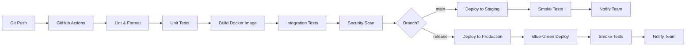

**GitHub Actions Workflow:**
```yaml
name: CI/CD Pipeline

on:
  push:
    branches: [main, release/*]
  pull_request:
    branches: [main]

jobs:
  test:
    runs-on: ubuntu-latest
    steps:
      - uses: actions/checkout@v3
      - name: Set up Go
        uses: actions/setup-go@v4
        with:
          go-version: 1.21
      - name: Run tests
        run: go test -v -race -coverprofile=coverage.txt ./...
      - name: Upload coverage
        uses: codecov/codecov-action@v3
  
  build:
    needs: test
    runs-on: ubuntu-latest
    steps:
      - uses: actions/checkout@v3
      - name: Build Docker image
        run: docker build -t suma-api:${{ github.sha }} .
      - name: Push to ECR
        run: |
          aws ecr get-login-password | docker login --username AWS --password-stdin
          docker push suma-api:${{ github.sha }}
  
  deploy:
    needs: build
    if: github.ref == 'refs/heads/main'
    runs-on: ubuntu-latest
    steps:
      - name: Deploy to ECS
        run: |
          aws ecs update-service --cluster suma-staging --service api --force-new-deployment
```

---

## 12. Scalability and Performance

### Scalability Strategy

#### Horizontal Scaling
- **Application Tier:** Stateless API servers (scale from 2 to 20+ instances)
- **Auto-Scaling Policy:**
  - Scale up: CPU > 70% for 2 minutes
  - Scale down: CPU < 30% for 10 minutes
  - Min instances: 2 (high availability)
  - Max instances: 20
- **Database Tier:** Read replicas for query distribution
- **Caching Tier:** Redis cluster mode for horizontal scaling

#### Vertical Scaling
- **Database:** Upgrade RDS instance class when needed
- **Redis:** Upgrade ElastiCache node type
- **Limitations:** Temporary solution before horizontal scaling

#### Auto-Scaling Policies
**ECS Service Auto-Scaling:**
```yaml
scaling_policies:
  - name: cpu-scaling
    target_metric: CPUUtilization
    target_value: 70
    scale_out_cooldown: 60
    scale_in_cooldown: 300
  
  - name: request-count-scaling
    target_metric: RequestCountPerTarget
    target_value: 1000
    scale_out_cooldown: 60
```

### Performance Targets

| Metric | Target | Measurement |
|--------|--------|-------------|
| Login API Response | <200ms | p95 |
| Register API Response | <300ms | p95 |
| Token Refresh | <100ms | p95 |
| Database Query | <50ms | p95 |
| Password Hash | <200ms | p99 |
| Throughput | 10,000 req/s | Peak load |
| Concurrent Users | 100,000 | Simultaneous |
| Frontend Load Time | <2s | First Contentful Paint |

### Performance Optimization

#### Caching Strategy
1. **Redis Session Cache:**
   - Cache user sessions after token validation
   - TTL: 15 minutes (match access token)
   - Reduces database queries by 80%

2. **Query Result Caching:**
   - Cache frequently accessed user data
   - Invalidate on user updates
   - TTL: 5 minutes

3. **Rate Limit Cache:**
   - Store rate limit counters in Redis
   - Sliding window algorithm
   - Reduces database load

#### Database Query Optimization
- **Indexes:**
  - `users.email` (unique index)
  - `refresh_tokens.token` (unique index)
  - `refresh_tokens.user_id` (index)
  - `refresh_tokens.expires_at` (index for cleanup)
- **Connection Pooling:**
  - Min connections: 5
  - Max connections: 25
  - Idle timeout: 10 minutes
- **Query Analysis:** Explain plans for slow queries

#### Code Splitting and Lazy Loading
- **Frontend:** Dynamic imports for auth pages
- **Bundle Size:** <100KB initial bundle
- **Lazy Load:** Non-critical components (MFA setup)

#### CDN for Static Assets
- **CloudFront or CloudFlare** for React app
- **Edge Caching:** 24-hour TTL for JS/CSS
- **Gzip/Brotli Compression**

### Load Balancing

#### Application Load Balancer (AWS ALB)
- **Algorithm:** Round robin with sticky sessions disabled
- **Health Checks:**
  - Endpoint: `/health`
  - Interval: 30 seconds
  - Timeout: 5 seconds
  - Healthy threshold: 2 consecutive successes
  - Unhealthy threshold: 3 consecutive failures
- **Target Groups:** ECS service instances
- **SSL Termination:** At load balancer (offload from instances)

---

## 13. Reliability and Availability

### High Availability

#### Target Uptime SLA: 99.9%
- **Allowed Downtime:**
  - Annual: 8 hours 45 minutes
  - Monthly: 43 minutes
  - Weekly: 10 minutes

#### Redundancy and Failover
- **Application Tier:**
  - Minimum 2 instances across 2 availability zones
  - Auto-scaling maintains instance count
  - Health checks remove unhealthy instances
- **Database Tier:**
  - RDS Multi-AZ deployment (automatic failover)
  - Failover time: <2 minutes
  - Read replicas for query distribution
- **Caching Tier:**
  - Redis cluster with automatic failover
  - Multi-AZ replication

#### Multi-Region Deployment (Future Phase)
- Primary region: US-East-1
- Failover region: US-West-2
- Global load balancer with health checks
- Database cross-region replication

### Fault Tolerance

#### Circuit Breakers
**Email Service Circuit Breaker:**
- **Closed:** Normal operation
- **Open:** 5 consecutive failures → stop sending requests
- **Half-Open:** After 60 seconds, try one request
- **Fallback:** Log email to database for manual retry

**Implementation:**
```go
import "github.com/sony/gobreaker"

cb := gobreaker.NewCircuitBreaker(gobreaker.Settings{
    Name:        "EmailService",
    MaxRequests: 3,
    Interval:    60 * time.Second,
    Timeout:     60 * time.Second,
    ReadyToTrip: func(counts gobreaker.Counts) bool {
        return counts.ConsecutiveFailures > 5
    },
})
```

#### Retry Logic with Exponential Backoff
- **Strategy:** Retry transient failures (network errors, timeouts)
- **Max Retries:** 3
- **Backoff:** 1s, 2s, 4s
- **Jitter:** ±500ms to prevent thundering herd

```go
func retryWithBackoff(operation func() error) error {
    backoff := []time.Duration{1*time.Second, 2*time.Second, 4*time.Second}
    for i, delay := range backoff {
        err := operation()
        if err == nil {
            return nil
        }
        if i < len(backoff)-1 {
            time.Sleep(delay + jitter())
        }
    }
    return errors.New("max retries exceeded")
}
```

#### Graceful Degradation
- **Email Service Down:** Log emails, continue registration (manual verification)
- **Redis Down:** Fall back to database queries (slower but functional)
- **Database Read Replica Down:** Route reads to primary

#### Bulkhead Pattern
- **Separate Thread Pools:** Email service uses dedicated goroutine pool
- **Isolation:** Email failures don't impact authentication
- **Resource Limits:** Max 100 concurrent email sends

### Disaster Recovery

#### Backup Strategy
- **Database Backups:**
  - Automated daily snapshots (RDS)
  - Retention: 30 days
  - Point-in-time recovery within 5 minutes
  - Cross-region backup replication
- **Application Backups:**
  - Docker images stored in ECR (immutable)
  - Infrastructure as Code in Git

#### Recovery Time Objective (RTO)
- **Target RTO:** 1 hour
- **Scenarios:**
  - Database failure: <10 minutes (RDS failover)
  - Application failure: <5 minutes (auto-scaling)
  - Region failure: <1 hour (manual failover)

#### Recovery Point Objective (RPO)
- **Target RPO:** 5 minutes
- **Database:** Point-in-time recovery with 5-minute granularity
- **Data Loss:** Maximum 5 minutes of data in catastrophic failure

#### Disaster Recovery Plan
1. **Detection:** Automated monitoring alerts on-call engineer
2. **Assessment:** Determine severity and scope
3. **Communication:** Notify stakeholders and users
4. **Recovery:**
   - Database: Restore from latest snapshot
   - Application: Deploy last known good version
   - Infrastructure: Terraform apply to recreate resources
5. **Validation:** Run smoke tests, verify functionality
6. **Post-Mortem:** Document incident, identify improvements

---

## 14. Monitoring and Observability

### Logging

#### Centralized Logging: AWS CloudWatch Logs (or ELK Stack)
- **Log Aggregation:** All application and infrastructure logs
- **Log Groups:**
  - `/suma/api/application`
  - `/suma/api/access`
  - `/suma/api/error`
  - `/suma/rds/postgresql`

#### Structured Logging
**Format:** JSON for machine readability
```json
{
  "timestamp": "2025-11-02T10:15:30Z",
  "level": "info",
  "service": "auth-api",
  "trace_id": "abc123",
  "user_id": "user-uuid",
  "event": "user_login",
  "email": "user@example.com",
  "ip": "192.168.1.1",
  "duration_ms": 145
}
```

**Go Implementation:**
```go
import "go.uber.org/zap"

logger, _ := zap.NewProduction()
logger.Info("user_login",
    zap.String("user_id", userID),
    zap.String("email", email),
    zap.Int("duration_ms", duration),
)
```

#### Log Retention
- **Application Logs:** 90 days
- **Access Logs:** 180 days (compliance)
- **Error Logs:** 1 year
- **Audit Logs:** 7 years (financial compliance)

### Metrics

#### Application Metrics
- **Request Metrics:**
  - Request count (by endpoint, status code)
  - Request duration (p50, p95, p99)
  - Active requests (concurrent)
- **Authentication Metrics:**
  - Login success/failure rate
  - Registration completion rate
  - Token refresh rate
  - MFA verification success rate
- **Error Metrics:**
  - Error count (by type, severity)
  - 4xx vs 5xx error ratio
  - Circuit breaker state changes

#### Infrastructure Metrics
- **Compute:**
  - CPU utilization
  - Memory usage
  - Network I/O
  - Disk I/O
- **Database:**
  - Connection count
  - Query execution time
  - Slow query count
  - Replication lag (read replicas)
- **Cache:**
  - Hit rate
  - Eviction rate
  - Memory usage

#### Business Metrics
- **User Acquisition:**
  - Daily active users (DAU)
  - Monthly active users (MAU)
  - New registrations per day
- **Engagement:**
  - Login frequency
  - Session duration
  - MFA adoption rate

#### Monitoring Tools
- **Prometheus:** Metrics collection and storage
- **Grafana:** Visualization and dashboards
- **AWS CloudWatch:** AWS-native monitoring
- **Datadog (Alternative):** All-in-one observability platform

**Prometheus Instrumentation (Go):**
```go
import "github.com/prometheus/client_golang/prometheus"

var (
    loginAttempts = prometheus.NewCounterVec(
        prometheus.CounterOpts{
            Name: "auth_login_attempts_total",
            Help: "Total login attempts",
        },
        []string{"status"},
    )
    
    requestDuration = prometheus.NewHistogramVec(
        prometheus.HistogramOpts{
            Name: "http_request_duration_seconds",
            Help: "HTTP request duration",
        },
        []string{"endpoint", "method"},
    )
)
```

### Distributed Tracing

#### OpenTelemetry
- **Trace Context Propagation:** Across all services
- **Span Attributes:**
  - Service name
  - Operation name
  - User ID
  - Request ID
  - Duration
  - Status (success/error)
- **Backend:** Jaeger or AWS X-Ray

**Trace Example:**
```
Trace ID: abc123
├── Span: POST /api/v1/auth/login (200ms)
│   ├── Span: ValidateInput (5ms)
│   ├── Span: QueryDatabase (80ms)
│   ├── Span: VerifyPassword (100ms)
│   └── Span: GenerateTokens (15ms)
```

**Go Implementation:**
```go
import "go.opentelemetry.io/otel"

tracer := otel.Tracer("auth-service")
ctx, span := tracer.Start(ctx, "Login")
defer span.End()

span.SetAttributes(attribute.String("user.email", email))
```

### Alerting

#### Alert Definitions

| Alert | Condition | Severity | Notification |
|-------|-----------|----------|--------------|
| High Error Rate | 5xx > 5% for 5 min | Critical | PagerDuty |
| Login Failures | Login failure rate > 20% for 5 min | High | Slack + Email |
| Database Latency | Query time p95 > 500ms | High | Slack |
| Low Disk Space | Disk usage > 85% | Medium | Email |
| Certificate Expiry | SSL cert expires in <7 days | High | Email |
| High CPU | CPU > 80% for 10 min | Medium | Slack |
| Circuit Breaker Open | Email circuit open | Medium | Slack |

#### On-Call Rotations
- **Primary On-Call:** Weekly rotation
- **Secondary On-Call:** Escalation after 15 minutes
- **Escalation Path:** Engineer → Team Lead → Engineering Manager
- **Tools:** PagerDuty or Opsgenie

#### Incident Response
1. **Acknowledge:** On-call engineer acknowledges alert <5 minutes
2. **Assess:** Determine severity and impact
3. **Mitigate:** Immediate actions (rollback, scale up, failover)
4. **Communicate:** Status page update, stakeholder notification
5. **Resolve:** Fix root cause
6. **Post-Mortem:** Document and prevent recurrence

---

## 15. Testing Strategy

### Testing Levels

#### Unit Testing
- **Scope:** Individual functions, methods, components
- **Framework:**
  - Backend: Go testing package + Testify
  - Frontend: Vitest + React Testing Library
- **Coverage Target:** >80%
- **Execution:** Every git push via CI

**Example (Go):**
```go
func TestValidateEmail(t *testing.T) {
    tests := []struct {
        email string
        valid bool
    }{
        {"user@example.com", true},
        {"invalid", false},
    }
    
    for _, tt := range tests {
        t.Run(tt.email, func(t *testing.T) {
            result := ValidateEmail(tt.email)
            assert.Equal(t, tt.valid, result)
        })
    }
}
```

#### Integration Testing
- **Scope:** API endpoints with database interactions
- **Framework:** Go testing with test database
- **Database:** PostgreSQL test container (Testcontainers)
- **Execution:** Every git push via CI

**Example:**
```go
func TestLoginEndpoint(t *testing.T) {
    db := setupTestDB()
    defer db.Cleanup()
    
    // Create test user
    user := createTestUser(db, "test@example.com", "password123")
    
    // Test login
    resp := httptest.NewRecorder()
    req := httptest.NewRequest("POST", "/api/v1/auth/login", loginPayload)
    router.ServeHTTP(resp, req)
    
    assert.Equal(t, 200, resp.Code)
    assert.Contains(t, resp.Body.String(), "access_token")
}
```

#### End-to-End Testing
- **Scope:** Complete user flows across frontend and backend
- **Framework:** Cypress or Playwright
- **Environment:** Staging environment
- **Execution:** Nightly and before production deployments

**Example (Cypress):**
```javascript
describe('User Registration Flow', () => {
  it('should register a new user', () => {
    cy.visit('/register')
    cy.get('[name="email"]').type('newuser@example.com')
    cy.get('[name="password"]').type('SecurePass123!')
    cy.get('[type="submit"]').click()
    cy.contains('Verification email sent').should('be.visible')
  })
})
```

#### Performance Testing
- **Scope:** Load, stress, and endurance testing
- **Tool:** k6 or Apache JMeter
- **Scenarios:**
  - Load test: 10,000 concurrent users
  - Stress test: Find breaking point
  - Endurance test: Sustained load for 2 hours
- **Execution:** Before major releases

**Example (k6):**
```javascript
import http from 'k6/http';
import { check } from 'k6';

export let options = {
  stages: [
    { duration: '2m', target: 100 },
    { duration: '5m', target: 1000 },
    { duration: '2m', target: 0 },
  ],
};

export default function() {
  let res = http.post('https://api.suma-finance.com/auth/login', {
    email: 'test@example.com',
    password: 'password123',
  });
  
  check(res, {
    'status is 200': (r) => r.status === 200,
    'response time < 200ms': (r) => r.timings.duration < 200,
  });
}
```

#### Security Testing
- **Scope:** Vulnerability scanning and penetration testing
- **Tools:**
  - OWASP ZAP: Automated vulnerability scanning
  - Snyk: Dependency vulnerability scanning
  - SonarQube: Static code analysis
- **Frequency:**
  - Automated: Every deployment
  - Manual pentest: Quarterly

### Test Automation

#### Automated Test Suite
- **Unit Tests:** Run on every commit (pre-commit hook)
- **Integration Tests:** Run on every push to main
- **E2E Tests:** Run nightly and before releases
- **Performance Tests:** Run weekly on staging

#### CI/CD Integration
```yaml
# GitHub Actions workflow
jobs:
  unit-tests:
    runs-on: ubuntu-latest
    steps:
      - uses: actions/checkout@v3
      - run: go test -v -race ./...
      - run: npm test
  
  integration-tests:
    needs: unit-tests
    runs-on: ubuntu-latest
    services:
      postgres:
        image: postgres:15
    steps:
      - run: go test -tags=integration ./...
  
  e2e-tests:
    needs: integration-tests
    runs-on: ubuntu-latest
    steps:
      - run: npx cypress run
```

#### Test Coverage Targets
- **Backend:** >80% line coverage
- **Frontend:** >75% line coverage
- **Critical Paths:** 100% coverage (login, register, token refresh)

### Testing Tools

| Category | Tool | Purpose |
|----------|------|---------|
| Backend Unit | Go testing + Testify | Unit tests |
| Frontend Unit | Vitest + RTL | Component tests |
| API Integration | Go testing + httptest | API endpoint tests |
| E2E | Cypress | User flow tests |
| Performance | k6 | Load testing |
| Security | OWASP ZAP | Vulnerability scanning |
| Dependency | Snyk | Dependency scanning |
| Code Quality | SonarQube | Static analysis |

---

## 16. Development Workflow

### Version Control

#### Git Workflow: Trunk-Based Development
- **Main Branch:** `main` (always deployable)
- **Feature Branches:** Short-lived (<2 days), merged frequently
- **Branch Naming:** `feat/user-registration`, `fix/login-bug`, `chore/update-deps`
- **No Long-Lived Branches:** Avoid merge conflicts and integration issues

**Alternative (Larger Team):** GitFlow
- `main`, `develop`, `feature/*`, `release/*`, `hotfix/*`

#### Branching Strategy
```
main (production)
  ↑
  └── feature/add-mfa
  └── fix/password-reset-bug
  └── chore/update-dependencies
```

**Commit Frequency:** Multiple commits per day
**Merge Strategy:** Squash and merge or rebase

#### Code Review Process
- **Pull Request Required:** All changes via PR
- **Reviewers:** Minimum 1 approval required
- **Checklist:**
  - ✅ Tests passing
  - ✅ Code coverage >80%
  - ✅ Linting passing
  - ✅ Security scan passed
  - ✅ Documentation updated
  - ✅ CHANGELOG entry added
- **Review Time:** <24 hours target
- **Auto-Merge:** After approvals and CI passing

### Development Environment

#### Local Development Setup
**Prerequisites:**
- Docker Desktop
- Go 1.21+
- Node.js 18+
- Git

**Setup Commands:**
```bash
# Clone repository
git clone https://github.com/suma/finance-app.git
cd finance-app

# Start infrastructure (database, Redis)
docker-compose up -d

# Backend setup
cd backend
go mod download
go run cmd/server/main.go

# Frontend setup
cd ../frontend
npm install
npm run dev
```

#### Docker Compose for Local Services
```yaml
version: '3.8'
services:
  postgres:
    image: postgres:15-alpine
    environment:
      POSTGRES_DB: suma_dev
      POSTGRES_USER: suma
      POSTGRES_PASSWORD: devpass
    ports:
      - "5432:5432"
  
  redis:
    image: redis:7-alpine
    ports:
      - "6379:6379"
  
  mailhog:
    image: mailhog/mailhog
    ports:
      - "1025:1025"  # SMTP
      - "8025:8025"  # Web UI
```

#### Development Database Seeding
**Seed Data:**
- 10 test users with verified emails
- 5 test users with unverified emails
- Sample MFA-enabled users

**Seed Command:**
```bash
go run cmd/seed/main.go
```

### Code Quality

#### Linting and Formatting
**Backend (Go):**
- **Linter:** golangci-lint
- **Formatter:** gofmt
- **Config:** `.golangci.yml`
```yaml
linters:
  enable:
    - gofmt
    - golint
    - govet
    - errcheck
    - staticcheck
```

**Frontend (TypeScript):**
- **Linter:** ESLint
- **Formatter:** Prettier
- **Config:** `.eslintrc.json`, `.prettierrc`

**Pre-Commit Hook:**
```bash
#!/bin/sh
# .git/hooks/pre-commit
golangci-lint run
go test ./...
npm run lint
npm run typecheck
```

#### Static Code Analysis
- **SonarQube:** Code quality and security vulnerabilities
- **Quality Gate:**
  - Coverage >80%
  - No critical bugs
  - No security vulnerabilities
  - Technical debt ratio <5%

#### Code Review Guidelines
- **Readability:** Clear variable names, comments for complex logic
- **Performance:** No N+1 queries, efficient algorithms
- **Security:** Input validation, no hardcoded secrets
- **Testing:** All new code has tests
- **Documentation:** API changes update Swagger docs

#### Technical Debt Management
- **Tracking:** GitHub Issues with `tech-debt` label
- **Allocation:** 20% of sprint capacity for tech debt
- **Prioritization:** Security > Performance > Maintainability
- **Quarterly Review:** Assess and prioritize tech debt backlog

---

## 17. Cross-Cutting Concerns

### Error Handling

#### Global Error Handling
**Backend (Go):**
```go
func ErrorMiddleware() gin.HandlerFunc {
    return func(c *gin.Context) {
        c.Next()
        
        if len(c.Errors) > 0 {
            err := c.Errors.Last()
            
            var appErr *AppError
            if errors.As(err.Err, &appErr) {
                c.JSON(appErr.StatusCode, gin.H{
                    "error": appErr.Message,
                    "code": appErr.Code,
                })
            } else {
                c.JSON(500, gin.H{
                    "error": "Internal server error",
                })
            }
        }
    }
}
```

**Frontend (React):**
```typescript
class ErrorBoundary extends React.Component {
  componentDidCatch(error: Error, errorInfo: React.ErrorInfo) {
    logErrorToService(error, errorInfo);
    this.setState({ hasError: true });
  }
  
  render() {
    if (this.state.hasError) {
      return <ErrorFallback />;
    }
    return this.props.children;
  }
}
```

#### Error Logging and Tracking
- **Tool:** Sentry or Rollbar
- **Captured Data:**
  - Error message and stack trace
  - User ID (if authenticated)
  - Request ID
  - Environment (staging/production)
  - Browser/OS (frontend)
- **Severity Levels:** Debug, Info, Warning, Error, Critical

#### User-Friendly Error Messages
- **400 Bad Request:** "Invalid email or password format"
- **401 Unauthorized:** "Please log in to continue"
- **403 Forbidden:** "You don't have permission to access this resource"
- **429 Too Many Requests:** "Too many login attempts. Please try again in 15 minutes"
- **500 Internal Server Error:** "Something went wrong. Please try again later"

**Never Expose:**
- Stack traces
- Database errors
- Internal system details

### Internationalization

**Not Applicable for Phase 1** - English only initially.

**Future Consideration (Phase 2):**
- **Library:** react-i18next (frontend), go-i18n (backend)
- **Supported Languages:** English, Portuguese, Spanish
- **Translation Files:** JSON format
- **Locale Detection:** Browser settings, user preference
- **Date/Time Formatting:** Locale-specific via libraries

### Accessibility

#### WCAG 2.1 Level AA Compliance
- **Semantic HTML:** Proper heading hierarchy, form labels
- **Keyboard Navigation:** All interactive elements accessible via keyboard
- **Focus Management:** Visible focus indicators
- **Color Contrast:** Minimum 4.5:1 for normal text
- **Alt Text:** All images have descriptive alt text
- **ARIA Labels:** For dynamic content and custom components

#### Screen Reader Support
- **Testing:** NVDA (Windows), VoiceOver (macOS)
- **Announcements:** Form errors, success messages
- **Live Regions:** Dynamic content updates

#### Keyboard Navigation
- **Tab Order:** Logical flow through form fields
- **Shortcuts:**
  - `Enter` to submit forms
  - `Esc` to close modals
  - `Tab` to navigate
  - `Shift+Tab` to navigate backwards

**Accessibility Testing:**
- **Automated:** axe DevTools, Lighthouse
- **Manual:** Keyboard-only navigation testing
- **Assistive Tech:** Screen reader testing

### Analytics and Tracking

#### User Behavior Tracking
- **Tool:** Google Analytics 4 or Mixpanel
- **Events:**
  - Page views
  - Registration started
  - Registration completed
  - Login success/failure
  - Password reset initiated
  - MFA enabled
  - Account deleted

**Event Schema:**
```javascript
trackEvent('registration_completed', {
  user_id: 'user-uuid',
  registration_duration: 120, // seconds
  email_verified: false,
  referral_source: 'organic'
});
```

#### Analytics Tools
- **Product Analytics:** Mixpanel or Amplitude
- **Web Analytics:** Google Analytics 4
- **Session Replay:** LogRocket or FullStory (privacy-compliant)

#### Privacy Compliance
- **Cookie Consent:** GDPR-compliant cookie banner
- **Opt-Out:** Users can disable analytics
- **Data Anonymization:** IP address anonymization
- **No PII:** Never send passwords or sensitive data to analytics

---

## 18. Migration and Evolution

### Migration Strategy

**Not Applicable** - New greenfield project with no legacy system.

**Future Scenario:** Migrating from existing auth system
- **Phased Migration:**
  - Phase 1: Dual-write (old + new system)
  - Phase 2: Gradual user migration (10% → 100%)
  - Phase 3: Read from new system, fall back to old
  - Phase 4: Decommission old system
- **Data Migration:**
  - Export users from old system
  - Hash password migration (re-hash on first login)
  - Preserve user IDs for data consistency
- **Rollback Strategy:**
  - Maintain old system for 3 months
  - Feature flag to switch between systems
  - Database backups before migration

### Architecture Evolution

#### Versioning Strategy
- **API Versioning:** URI path versioning (`/api/v1/`, `/api/v2/`)
- **Backward Compatibility:** Maintain v1 for 12 months after v2 release
- **Deprecation Warnings:** HTTP header `X-API-Deprecation`

#### Breaking Changes Process
1. **Announce:** 6 months notice to users
2. **Deprecation Warning:** Add warning to responses
3. **Documentation:** Update migration guide
4. **Monitoring:** Track v1 usage
5. **Sunset:** Remove v1 after grace period

#### Deprecation Policy
- **Minor Changes:** No deprecation needed
- **Major Changes:** 6-month deprecation period
- **Critical Security:** Immediate deprecation with migration path

#### Long-Term Architecture Roadmap

**Year 1 (Current):**
- Monolithic authentication service
- PostgreSQL + Redis
- Manual scaling

**Year 2:**
- Extract notification service (microservice)
- Implement event bus (RabbitMQ)
- Auto-scaling in production

**Year 3:**
- Extract user profile service
- Multi-region deployment
- Advanced MFA (biometric, WebAuthn)

**Year 4:**
- Service mesh (Istio)
- Chaos engineering practices
- Zero-trust architecture

---

## 19. Cost Optimization

### Infrastructure Costs

#### AWS Cost Breakdown (Estimated Monthly)

| Service | Configuration | Monthly Cost |
|---------|---------------|--------------|
| ECS (Compute) | 4 × t3.medium instances | $120 |
| RDS PostgreSQL | db.r5.large Multi-AZ | $350 |
| ElastiCache Redis | cache.t3.medium | $50 |
| Application Load Balancer | 1 ALB | $25 |
| CloudWatch Logs | 50 GB ingestion | $30 |
| S3 (Backups) | 100 GB | $2.50 |
| Data Transfer | 500 GB/month | $45 |
| **Total** | | **~$622/month** |

**Scaling Costs:**
- At 10k users: ~$600/month
- At 100k users: ~$2,500/month (more instances, larger RDS)

#### Reserved Instances vs On-Demand
- **Reserved Instances:** 30-40% savings for RDS and ElastiCache
- **Savings Plans:** Commit to 1-year for compute savings
- **Spot Instances:** Not recommended for authentication (high availability requirement)

### Cost Monitoring

#### Cost Allocation Tags
```
Environment: production
Service: authentication
Team: backend
Project: suma-finance
```

#### Budget Alerts
- **Budget:** $700/month
- **Alerts:**
  - 80% threshold → Email to engineering lead
  - 100% threshold → Slack alert + PagerDuty
  - 120% threshold → Escalate to management

#### FinOps Practices
- **Monthly Review:** Analyze cost trends and anomalies
- **Right-Sizing:** Adjust instance types based on utilization
- **Unused Resources:** Automated cleanup of unused EBS volumes, snapshots
- **Cost Dashboard:** Grafana dashboard with cost metrics

### Optimization Strategies

#### Right-Sizing Resources
- **RDS:** Start with db.t3.large, upgrade based on CPU/memory metrics
- **ECS:** t3.medium for initial load, scale horizontally
- **ElastiCache:** cache.t3.small initially, monitor hit rate

#### Caching to Reduce Compute
- **Redis Caching:** Reduce database queries by 80%
- **CDN Caching:** Reduce origin requests for frontend assets
- **Application-Level Caching:** In-memory caching for frequently accessed data

#### Data Transfer Optimization
- **Same-Region:** Keep all resources in same region
- **CloudFront:** Cache static assets at edge locations
- **Compression:** Enable gzip/brotli for API responses
- **Optimize Payloads:** Reduce response sizes (pagination, field selection)

**Cost Optimization Checklist:**
- ✅ Use reserved instances for predictable workloads
- ✅ Enable auto-scaling to match demand
- ✅ Monitor and delete unused resources
- ✅ Implement caching at all layers
- ✅ Use compression for data transfer
- ✅ Right-size instances based on metrics
- ✅ Set up cost alerts and budgets

---

## 20. Risks and Mitigation

### Technical Risks

| Risk | Likelihood | Impact | Mitigation |
|------|------------|--------|------------|
| **JWT Token Theft** | Medium | Critical | Short-lived access tokens, refresh token rotation, httpOnly cookies |
| **Database Performance Degradation** | Medium | High | Connection pooling, read replicas, query optimization, monitoring |
| **Email Service Downtime** | Low | Medium | Circuit breaker, fallback logging, retry queue |
| **Scalability Bottlenecks** | Medium | High | Horizontal scaling, caching, load testing before launch |
| **Dependency Vulnerabilities** | High | Medium | Automated dependency scanning (Snyk), regular updates |
| **Brute Force Attacks** | High | High | Rate limiting, account lockout, CAPTCHA after failures |
| **DDoS Attacks** | Medium | Critical | WAF, rate limiting, CloudFlare protection |

### Mitigation Strategies

#### Technology Maturity
- **Go:** Mature, proven in production at scale (Google, Uber)
- **PostgreSQL:** 25+ years of development, highly stable
- **React:** Industry standard, large ecosystem
- **Risk:** Low - all technologies are mature and battle-tested

#### Scalability Risks
- **Risk:** Monolithic architecture may not scale beyond 100k users
- **Mitigation:**
  - Stateless design for horizontal scaling
  - Database read replicas
  - Regular load testing
  - Microservices extraction plan

#### Security Vulnerabilities
- **Risk:** Authentication system is prime target for attacks
- **Mitigation:**
  - Security-first design (OWASP Top 10)
  - Regular penetration testing
  - Dependency scanning (Snyk, Dependabot)
  - Security training for team
  - Bug bounty program (future)

#### Third-Party Dependencies
- **Risk:** SendGrid outage prevents email delivery
- **Mitigation:**
  - Circuit breaker pattern
  - Fallback email provider (AWS SES)
  - Queue emails for retry
  - Monitor SLA and uptime

### Architectural Assumptions

#### Assumptions Made

1. **User Base Growth:** Gradual growth over 12 months (not viral overnight)
   - **Validation:** Marketing projections, phased rollout
   - **Contingency:** Rapid scaling playbook if viral growth

2. **Email Verification Acceptable:** Users accept email verification step
   - **Validation:** A/B testing, user feedback
   - **Contingency:** Option to disable for certain user segments

3. **JWT Sufficient:** Stateless JWT meets scalability needs
   - **Validation:** Load testing, production monitoring
   - **Contingency:** Hybrid approach with Redis-backed sessions

4. **Single Region Sufficient:** US-East-1 serves global users acceptably
   - **Validation:** Latency monitoring from different regions
   - **Contingency:** Multi-region deployment plan

5. **PostgreSQL Scalability:** PostgreSQL can handle 100k users
   - **Validation:** Benchmark testing, read replica strategy
   - **Contingency:** Database sharding or migration to distributed DB

#### Contingency Plans

**Rapid Growth Scenario:**
- Accelerated scaling roadmap
- Emergency budget approval
- Temporary rate limiting
- Waitlist/invite system

**Security Breach Scenario:**
- Incident response plan activated
- Force password reset for all users
- Public disclosure per GDPR requirements
- Security audit and remediation

**Email Provider Failure:**
- Automatic failover to AWS SES
- Manual email sending for critical accounts
- User notification of delays

---

## 21. Architecture Decision Records (ADRs)

### ADR-001: JWT-Based Stateless Authentication

**Date:** 2025-11-02  
**Status:** Accepted

#### Context and Problem Statement
We need to choose an authentication mechanism that supports horizontal scaling, microservices readiness, and provides good security.

#### Considered Alternatives
1. **Session-based authentication** (cookies with server-side sessions)
2. **JWT-based stateless authentication**
3. **OAuth 2.0 with external provider**

#### Decision
Use JWT-based stateless authentication with refresh token rotation.

#### Rationale
- **Scalability:** No server-side session storage enables horizontal scaling
- **Microservices Ready:** Tokens can be validated by any service
- **Performance:** No database lookup for token validation
- **Industry Standard:** Widely adopted and well-understood

#### Consequences
**Pros:**
- Horizontal scaling without session affinity
- Reduced database load (no session queries)
- Enables future microservices architecture
- Self-contained tokens (no session storage)

**Cons:**
- Token revocation complexity (mitigated by short expiration + refresh rotation)
- Larger payload than session ID
- Requires secure key management

---

### ADR-002: PostgreSQL for User Data

**Date:** 2025-11-02  
**Status:** Accepted

#### Context and Problem Statement
We need to select a database for storing user accounts, credentials, and authentication state.

#### Considered Alternatives
1. **PostgreSQL** (relational database)
2. **MongoDB** (document database)
3. **DynamoDB** (managed NoSQL)

#### Decision
Use PostgreSQL as the primary database.

#### Rationale
- **ACID Transactions:** Critical for financial application data integrity
- **Relational Model:** User data fits relational schema well
- **Mature Ecosystem:** Proven reliability, extensive tooling
- **JSON Support:** Flexibility for semi-structured data
- **Cost-Effective:** Open-source, no vendor lock-in

#### Consequences
**Pros:**
- Strong consistency guarantees
- Referential integrity via foreign keys
- Rich query capabilities (joins, aggregations)
- Excellent performance with proper indexing
- Large community and support

**Cons:**
- Vertical scaling limits (mitigated by read replicas)
- Schema migrations require planning
- Sharding complexity for massive scale

---

### ADR-003: Monolithic Architecture (Phase 1)

**Date:** 2025-11-02  
**Status:** Accepted

#### Context and Problem Statement
Should we build a monolithic application or start with microservices?

#### Considered Alternatives
1. **Monolithic architecture**
2. **Microservices from day one**
3. **Modular monolith**

#### Decision
Start with a monolithic architecture with clear module boundaries.

#### Rationale
- **Faster Development:** Single codebase, simpler deployment
- **Lower Operational Overhead:** No service mesh, fewer moving parts
- **Sufficient for Scale:** Can handle 100k+ users with horizontal scaling
- **Easier Debugging:** Single process, simpler error tracking
- **Team Size:** Small team (5-10 engineers) better suited to monolith

#### Consequences
**Pros:**
- Faster time to market
- Simpler deployment and testing
- Lower infrastructure costs
- Easier refactoring early on

**Cons:**
- Eventual scaling limits (plan extraction at 100k users)
- Deployment couples all features
- Potentially longer build times as codebase grows

**Migration Path:**
- Extract notification service first (least coupled)
- Then user profile service
- Finally, auth core remains as microservice

---

### ADR-004: React for Frontend

**Date:** 2025-11-02  
**Status:** Accepted

#### Context and Problem Statement
Which frontend framework should we use for the authentication UI?

#### Considered Alternatives
1. **React**
2. **Vue.js**
3. **Svelte**

#### Decision
Use React with TypeScript and Material-UI.

#### Rationale
- **Ecosystem:** Largest library ecosystem and community
- **Team Expertise:** Team familiarity with React
- **Hiring:** Easier to hire React developers
- **Tooling:** Excellent TypeScript support and dev tools
- **Component Library:** Material-UI provides accessible, professional components

#### Consequences
**Pros:**
- Faster development with rich ecosystem
- Strong typing with TypeScript
- Accessible UI with Material-UI
- Large talent pool for hiring

**Cons:**
- Larger bundle size than Svelte
- More boilerplate than Vue
- Frequent breaking changes in ecosystem

---

### ADR-005: bcrypt for Password Hashing

**Date:** 2025-11-02  
**Status:** Accepted

#### Context and Problem Statement
Which password hashing algorithm should we use?

#### Considered Alternatives
1. **bcrypt**
2. **Argon2**
3. **scrypt**

#### Decision
Use bcrypt with cost factor 12.

#### Rationale
- **Industry Standard:** Widely adopted and trusted
- **Go Support:** Excellent library support (golang.org/x/crypto/bcrypt)
- **Proven Track Record:** Decades of use without major vulnerabilities
- **Adaptive:** Cost factor can increase over time

#### Consequences
**Pros:**
- Battle-tested security
- Excellent library support
- Adjustable work factor
- Resistance to brute force

**Cons:**
- Slower than Argon2 (not significant for auth)
- No parallelization benefits (acceptable trade-off)

---

### ADR-006: Email Verification Required

**Date:** 2025-11-02  
**Status:** Accepted

#### Context and Problem Statement
Should we require email verification during registration?

#### Considered Alternatives
1. **Required email verification**
2. **Optional email verification**
3. **No email verification**

#### Decision
Require email verification before account activation.

#### Rationale
- **Security:** Prevents spam and bot registrations
- **Communication Channel:** Ensures we can contact users
- **Password Recovery:** Required for password reset flow
- **Compliance:** Helps with GDPR (verified contact)

#### Consequences
**Pros:**
- Higher quality user base
- Reduced spam accounts
- Secure password recovery
- Verified communication channel

**Cons:**
- Increased registration friction (dropout risk)
- Dependency on email service
- User frustration if email delayed

**Mitigation:**
- Clear messaging about verification
- Resend verification email option
- 24-hour verification window

---

## 22. Diagrams

### C4 Model - System Context Diagram

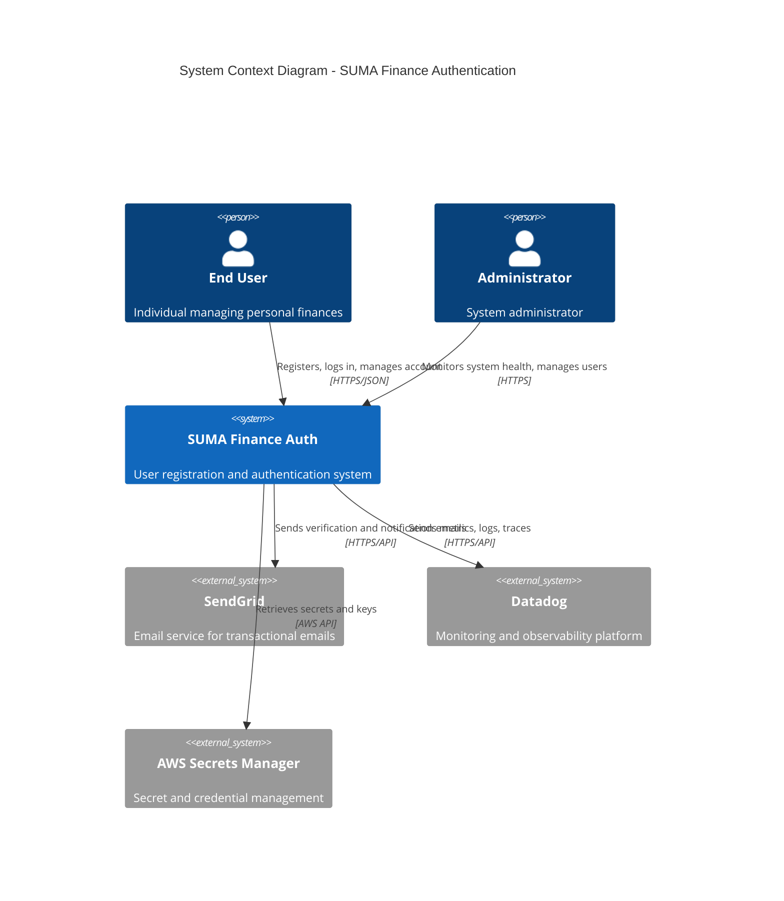

### C4 Model - Container Diagram

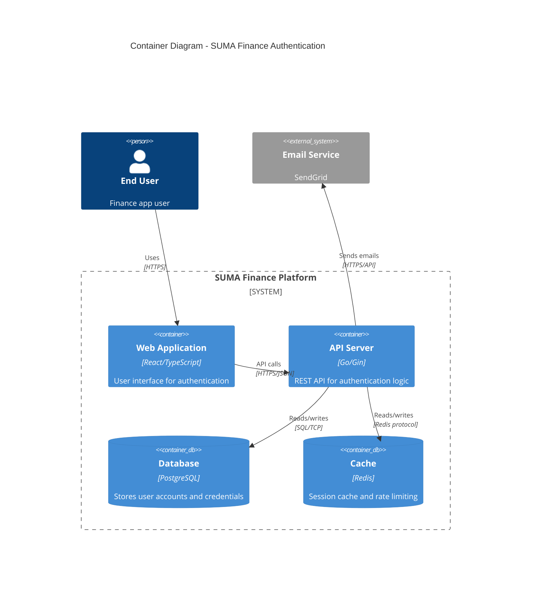

### C4 Model - Component Diagram (Backend)

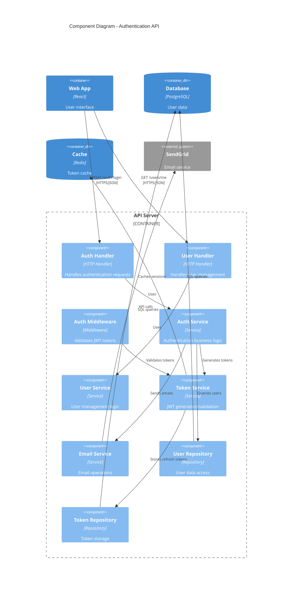

### Sequence Diagram - User Registration Flow

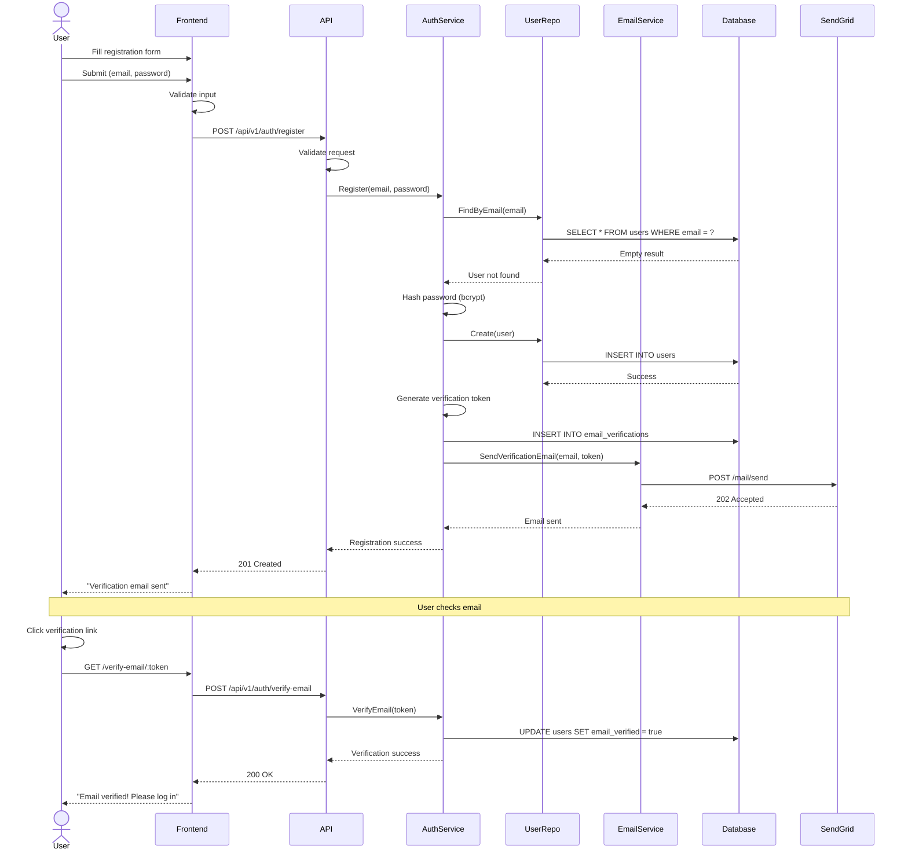

### Sequence Diagram - User Login Flow with MFA

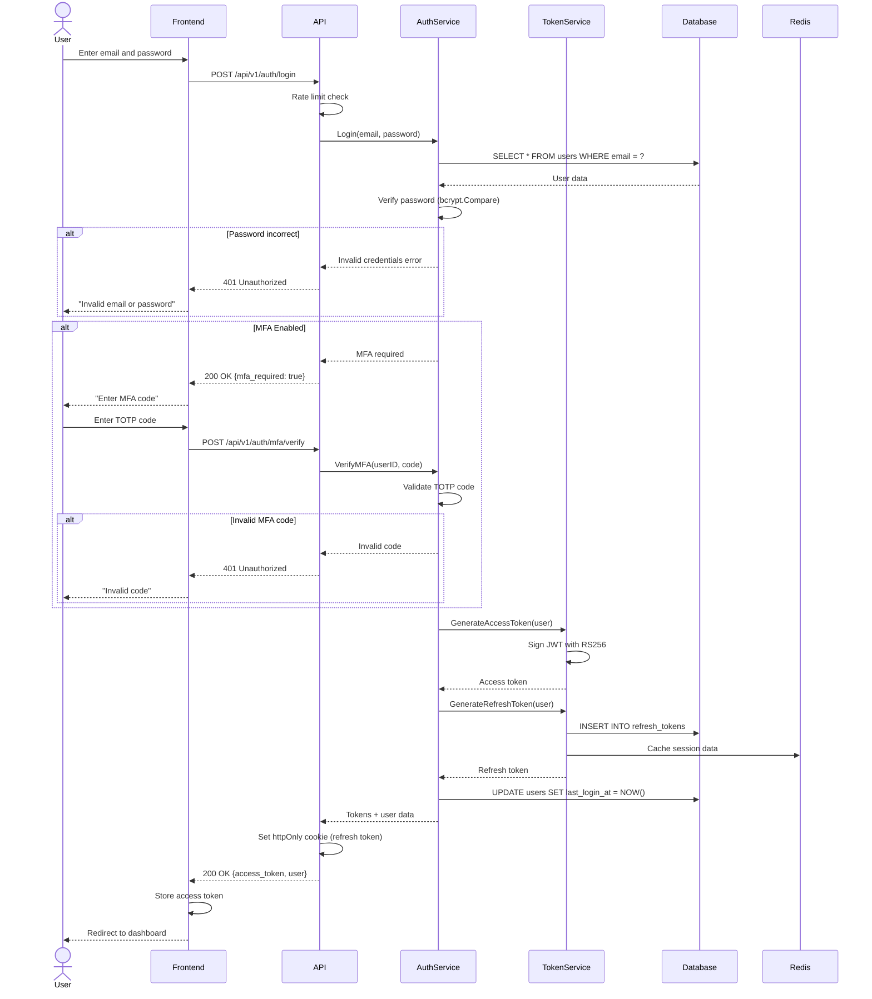

### Deployment Diagram - Production Infrastructure

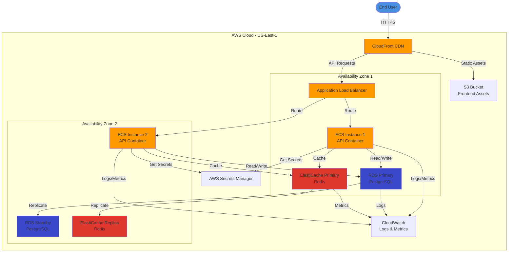

---

## Conclusion

This Architecture Overview provides a comprehensive blueprint for implementing a secure, scalable, and maintainable user registration and authentication system for SUMA Finance. The architecture is designed to:

- **Start Simple:** Monolithic architecture for rapid development
- **Scale Gracefully:** Horizontal scaling and clear microservices extraction path
- **Prioritize Security:** Multiple defense layers, OWASP compliance, GDPR adherence
- **Ensure Reliability:** 99.9% uptime SLA with multi-AZ deployment
- **Enable Evolution:** Clear migration path to microservices and advanced features

**Next Steps:**
1. Review and approve this architecture document
2. Proceed to detailed Gate 1 documents (API Design, Database Schema, Security Specifications)
3. Begin implementation with infrastructure setup
4. Iterative development following the deployment pipeline

**Key Success Factors:**
- Adherence to security best practices
- Comprehensive testing at all levels
- Continuous monitoring and optimization
- Regular architecture reviews and refinements

This architecture provides a solid foundation for SUMA Finance's authentication system while remaining flexible for future growth and innovation.