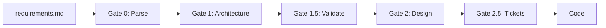

# Requirements Documentation
{: .no_toc }

Complete guide to writing and managing requirements in SUMA IDE.
{: .fs-6 .fw-300 }

## Table of contents
{: .no_toc .text-delta }

1. TOC
{:toc}

---

## What are Requirements in SUMA?

Requirements are structured documentation that describes what your software should do. In SUMA IDE, requirements are:

- **Machine-readable**: Parsed by AI for gate execution
- **Human-friendly**: Written in markdown with clear syntax
- **Traceable**: Linked through all gates to final code
- **Enrichable**: Enhanced with codebase context
- **Validatable**: Automatically checked for completeness

## Standard Format

```markdown
# Feature Name

## Overview
Brief description of the feature

## Functional Requirements

### REQ-[CATEGORY]-[NUMBER]: Requirement Title
**Priority**: CRITICAL | HIGH | MEDIUM | LOW
**Category**: Category name
**Status**: DRAFT | REVIEW | APPROVED

Detailed requirement description using SHALL/SHOULD/MAY keywords.

## Non-Functional Requirements

### REQ-[CATEGORY]-NFR-[NUMBER]: NFR Title
**Priority**: CRITICAL | HIGH | MEDIUM | LOW
**Category**: Performance | Security | Scalability | etc.

Detailed non-functional requirement.
```

## Example: E-Commerce Checkout

```markdown
# E-Commerce Checkout System

## REQ-CHECKOUT-001: Shopping Cart Review
**Priority**: CRITICAL
**Category**: Checkout

The system SHALL display a cart summary with:
- Product names, images, quantities
- Individual prices and total
- Ability to edit quantities
- Apply discount codes

## REQ-CHECKOUT-NFR-001: Security
**Priority**: CRITICAL
**Category**: Security

- Payment data MUST be PCI-DSS compliant
- SSL/TLS MUST be enforced
- No credit card data SHALL be stored
```

## Requirements Flow

Requirements flow through all gates:



## Best Practices

### Use Standard Keywords

- **SHALL** / **MUST**: Mandatory requirement
- **SHOULD**: Recommended but not mandatory
- **MAY**: Optional feature

### Be Specific and Measurable

❌ Bad: "The system should be fast"

✅ Good: "The system SHALL respond to API requests in < 200ms (p95)"

### Include Acceptance Criteria

```markdown
### REQ-SEARCH-001: Product Search
**Priority**: HIGH

The system SHALL provide product search with autocomplete.

**Acceptance Criteria**:
- [ ] Search shows suggestions after 3 characters
- [ ] Suggestions update in real-time (< 100ms)
- [ ] Shows top 10 results by relevance
- [ ] Highlights matching text
```

## Next Steps

- [Gate Documentation](gates) - Learn about each gate
- [Templates](templates) - Use starter templates
