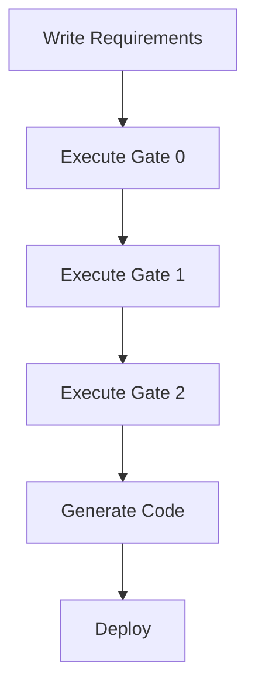

# Getting Started with SUMA IDE
{: .no_toc }

Welcome to SUMA IDE! This guide will help you get up and running in minutes.
{: .fs-6 .fw-300 }

## Table of contents
{: .no_toc .text-delta }

1. TOC
{:toc}

---

## Prerequisites

- **Operating System**: Windows 10+, macOS 10.15+, or Linux
- **Node.js**: Version 18+ (for Claude CLI integration)
- **Python**: Version 3.8+ (for MCP server)
- **Git**: For version control
- **Claude CLI** (optional): For AI-powered features

## Installation

### Windows

1. Download the installer from [Releases](https://github.com/ricmar-dev/suma-ide/releases)
   ```
   SUMA-IDE-Setup-1.0.0.exe
   ```

2. Run the installer and follow the prompts

3. Launch SUMA IDE from the Start Menu

### macOS

1. Download the DMG file
   ```
   SUMA-IDE-1.0.0.dmg
   ```

2. Open the DMG and drag SUMA IDE to Applications

3. Launch SUMA IDE from Applications

### Linux (Debian/Ubuntu)

```bash
# Download the package
wget https://github.com/ricmar-dev/suma-ide/releases/download/v1.0.0/suma-ide-1.0.0.deb

# Install
sudo dpkg -i suma-ide-1.0.0.deb
sudo apt-get install -f  # Fix dependencies if needed

# Launch
suma-ide
```

## First Launch

When you first launch SUMA IDE, you'll see the Welcome screen with:

1. **Quick Start Guide** - Interactive tutorial
2. **Create Project** - Start a new SUMA project
3. **Open Folder** - Open existing code
4. **Sample Projects** - Explore examples

### Initial Configuration

SUMA IDE will automatically:
- ✅ Start the MCP server (27 tools available)
- ✅ Load the Gates system
- ✅ Configure the Requirements manager
- ✅ Set up Claude integration (if installed)

Check the status bar (bottom right) for:
- **MCP Status**: `✓ MCP: 27 tools` (green = ready)
- **Gates Status**: `Gates: Ready`

## Create Your First Project

### Option 1: New SUMA Project

1. **File > New SUMA Project**

2. Select a template:
   - **Basic Web App** (React + Node.js)
   - **Mobile App** (React Native)
   - **Backend API** (Go or Node.js)
   - **Full Stack** (React + Go + PostgreSQL)
   - **Empty Project** (Start from scratch)

3. Choose a location and project name

4. SUMA IDE creates:
   ```
   my-project/
   ├── Requirements/
   │   └── feature-template.md
   ├── .claude/
   │   └── skills/
   ├── .suma/
   │   ├── config.json
   │   └── gates/
   └── README.md
   ```

### Option 2: Import Existing Project

1. **File > Open Folder**
2. Select your project directory
3. **SUMA > Initialize Gate System**
4. SUMA IDE will scan and set up requirements, gates, and MCP integration

## Your First Gate Execution

### Step 1: Write Requirements

Create `Requirements/user-authentication.md`:

```markdown
# User Authentication Feature

## REQ-AUTH-001: User Registration
**Priority**: CRITICAL
**Category**: Authentication

The system SHALL allow users to register with:
- Email address (validated)
- Password (min 8 chars, complexity rules)
- Optional: Name, profile picture

## REQ-AUTH-002: User Login
**Priority**: CRITICAL
**Category**: Authentication

The system SHALL allow users to login with:
- Email and password
- OAuth (Google, GitHub)
- "Remember me" option
```

### Step 2: Execute Gate 0

1. Open **Gates Explorer** (Activity Bar)
2. **Right-click** on **Gate 0** > **Execute Gate**
3. Configure:
   - **Input**: `Requirements/user-authentication.md`
   - **Feature Name**: `User Authentication`
4. Click **Execute**

### Step 3: Review Results

SUMA IDE generates:
```
Requirements/
└── user-authentication/
    └── Gate-0-Requirements/
        ├── requirements-summary.md
        ├── functional-requirements.md
        ├── non-functional-requirements.md
        └── validation-report.md
```

## Architecture Diagram Example

Here's an example of how Mermaid diagrams render:



## Next Steps

- [Gate System Overview](gate-system-overview) - Learn all gates
- [MCP Tools Reference](mcp-tools-reference) - Explore all 27 tools
- [Requirements Manager](requirements-manager) - Advanced features
- [Tutorials](tutorials) - Step-by-step guides

## Troubleshooting

### MCP Server Not Starting

**Symptom**: Status bar shows `⚠ MCP: Offline`

**Solution**:
1. Open **Output** panel (View > Output)
2. Select **SUMA MCP** from dropdown
3. Check for errors
4. Try: **SUMA > Restart MCP Server**

### Gate Execution Fails

**Symptom**: Gate shows ❌ Failed status

**Solution**:
1. Check **SUMA Output** panel for errors
2. Verify requirements file syntax
3. Ensure MCP server is running
4. Try re-running with: **SUMA > Execute Gate (Debug Mode)**

## Get Help

- **Documentation**: [SUMA IDE Docs](/)
- **Issues**: [GitHub Issues](https://github.com/ricmar-dev/suma-ide/issues)
- **Email**: support@suma-ide.dev
